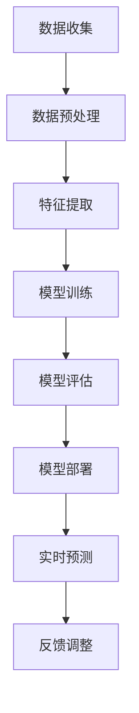

                 

### 摘要 Abstract

本文旨在探讨如何利用AI大模型技术来提升电商平台销售预测的精确性。随着电子商务的快速发展，销售额预测的准确性对电商平台运营决策至关重要。本文首先介绍了电商平台销售预测的重要性和现有方法的局限性，然后重点介绍了基于AI大模型的销售预测方法，包括核心概念、算法原理、数学模型构建、具体操作步骤、应用领域以及实际项目实践。通过本文的研究，我们希望能够为电商平台提供更加精准的销售预测，从而优化运营策略，提高竞争力。

### 关键词 Keywords

- AI大模型
- 电商平台
- 销售预测
- 数据分析
- 算法优化

### 引言 Introduction

电子商务作为一种新兴商业模式，正在全球范围内迅速崛起。随着消费者购物习惯的转变，电商平台在零售市场中的地位越来越重要。对于电商平台而言，销售预测是一个关键问题，其准确性直接影响到库存管理、营销策略、供应链优化等众多环节。然而，传统的销售预测方法如时间序列分析、回归模型等，往往存在预测误差较大、适应性较差等问题，难以满足现代电商业务的复杂需求。

近年来，随着人工智能技术的飞速发展，尤其是大模型的引入，销售预测技术得到了显著提升。大模型具有强大的数据处理和模式识别能力，能够从大量历史数据中提取有用的信息，从而实现更精准的销售预测。本文将围绕如何利用AI大模型在电商平台销售预测中进行精确化应用，进行深入探讨。

本文结构如下：首先，我们将介绍电商平台销售预测的重要性及其现有方法的局限性；然后，深入探讨AI大模型在销售预测中的应用，包括核心概念、算法原理和具体操作步骤；接着，我们将介绍数学模型和公式的构建及推导过程，并通过案例分析和讲解来展示实际应用效果；随后，我们将分享一个实际项目的代码实例和详细解释；最后，我们还将探讨AI大模型在电商平台销售预测中的实际应用场景，并展望其未来发展趋势与面临的挑战。

### 1. 背景介绍 Background

#### 电商平台销售预测的重要性 Importance of Sales Forecasting in E-commerce Platforms

在电子商务领域，销售预测是一项至关重要的活动。其重要性主要体现在以下几个方面：

1. **库存管理 Inventory Management**：准确的销售预测可以帮助电商平台更有效地管理库存。通过预测未来的销售情况，电商平台可以提前备货，避免因库存不足导致的缺货损失，也可以减少因库存过剩而产生的库存成本。

2. **营销策略 Marketing Strategies**：销售预测对于制定有效的营销策略至关重要。基于准确的预测结果，电商平台可以更好地规划促销活动，优化广告投放，从而提高销售额。

3. **供应链优化 Supply Chain Optimization**：准确的销售预测有助于优化供应链管理。电商平台可以通过预测未来的销售趋势，合理调整供应链各环节的运作，提高整个供应链的效率。

4. **竞争策略 Competitive Strategies**：在激烈的市场竞争中，准确的销售预测可以帮助电商平台制定更有针对性的竞争策略。例如，通过预测竞争对手的销售情况，电商平台可以及时调整自身策略，抢占市场份额。

#### 现有方法的局限性 Limitations of Existing Methods

尽管销售预测在电商平台运营中至关重要，但传统的销售预测方法存在一些局限性：

1. **时间序列分析 Time Series Analysis**：时间序列分析是一种常用的销售预测方法，主要通过分析历史销售数据的时间序列特征来进行预测。然而，这种方法在面对复杂、非线性销售数据时，预测准确性往往不高。

2. **回归模型 Regression Models**：回归模型通过建立销售量与影响因子（如价格、季节性因素等）之间的线性关系来进行预测。这种方法在简单情况下效果较好，但在面对复杂的多变量关系时，预测效果较差。

3. **市场调研 Market Research**：市场调研是一种通过收集市场信息来进行销售预测的方法。虽然这种方法可以获得一定的预测准确性，但其耗时较长，成本较高，且受主观判断影响较大。

#### AI大模型的优势 Advantages of AI Large Models

近年来，随着人工智能技术的快速发展，尤其是大模型的引入，销售预测技术得到了显著提升。AI大模型在销售预测中的优势主要体现在以下几个方面：

1. **数据处理能力 Data Processing Power**：大模型具有强大的数据处理能力，能够处理大量复杂、多维度的销售数据。这使得大模型能够从数据中发现隐藏的模式和关联，从而提高预测准确性。

2. **模式识别能力 Pattern Recognition Ability**：大模型通过深度学习等技术，具有强大的模式识别能力。这使得大模型能够更好地理解销售数据的非线性特征，从而实现更精准的预测。

3. **自适应能力 Adaptive Ability**：大模型可以自动调整模型参数，以适应不断变化的数据特征。这使得大模型在面对动态变化的销售环境时，能够保持较高的预测准确性。

4. **预测多样性 Predictive Diversity**：大模型能够生成多个预测结果，并提供相应的置信区间。这使得大模型能够更好地应对不确定性和风险，为电商平台提供更加全面、可靠的预测信息。

#### 本文结构 Outline of the Article

本文将围绕AI大模型在电商平台销售预测中的应用，展开如下内容：

1. **核心概念与联系**：介绍AI大模型在销售预测中的核心概念和原理，并使用Mermaid流程图展示模型架构。

2. **核心算法原理 & 具体操作步骤**：详细阐述AI大模型在销售预测中的算法原理和操作步骤，包括数据处理、特征提取、模型训练和预测等。

3. **数学模型和公式**：介绍AI大模型在销售预测中使用的数学模型和公式，包括数据预处理、特征选择、模型训练和预测等。

4. **项目实践：代码实例和详细解释说明**：通过一个实际项目，展示AI大模型在电商平台销售预测中的具体实现过程，包括代码实现、运行结果展示和分析等。

5. **实际应用场景**：探讨AI大模型在电商平台销售预测中的实际应用场景，包括库存管理、营销策略、供应链优化等。

6. **未来应用展望**：展望AI大模型在电商平台销售预测中的未来发展，包括技术挑战、应用拓展等。

7. **工具和资源推荐**：推荐一些学习资源、开发工具和相关论文，以供进一步学习和实践。

8. **总结**：总结本文的研究成果，探讨未来发展趋势与挑战，并提出研究展望。

通过本文的探讨，我们希望能够为电商平台提供更加精准的销售预测方法，从而优化运营策略，提高竞争力。

### 2. 核心概念与联系 Core Concepts and Relationships

#### AI大模型概述 Overview of AI Large Models

AI大模型，即人工智能大规模模型，是一种具有极高计算能力和复杂性的深度学习模型。这些模型通常由数百万甚至数十亿个参数组成，能够通过大量数据训练，实现高精度的预测和分类任务。常见的AI大模型包括神经网络（如卷积神经网络（CNN）、循环神经网络（RNN））、生成对抗网络（GAN）、自注意力模型（如BERT、GPT）等。

#### 电商平台销售预测中的AI大模型应用 Application of AI Large Models in E-commerce Sales Forecasting

在电商平台销售预测中，AI大模型的应用主要体现在以下几个方面：

1. **数据处理与特征提取**：AI大模型能够处理大量多维度的数据，包括历史销售数据、用户行为数据、市场环境数据等。通过对这些数据进行深度学习，模型能够自动提取有用的特征，用于预测未来的销售情况。

2. **非线性关系建模**：电商平台销售数据通常具有复杂和非线性的特征，传统的线性模型难以捕捉这些特征。AI大模型，如神经网络，能够更好地建模这些非线性关系，从而提高预测准确性。

3. **实时预测与调整**：AI大模型具有自适应能力，能够根据最新的数据实时调整预测模型。这使得电商平台能够根据实际销售情况，及时调整库存、营销策略等，提高运营效率。

#### AI大模型架构与流程图 Architecture and Flowchart of AI Large Models

以下是AI大模型在电商平台销售预测中的架构和流程图：



**数据收集（A）**：电商平台需要收集大量与销售相关的数据，包括历史销售数据、用户行为数据、市场环境数据等。

**数据预处理（B）**：对收集到的数据进行清洗、去噪、标准化等预处理操作，以便后续的建模。

**特征提取（C）**：通过深度学习等技术，从预处理后的数据中提取有用的特征，用于模型训练。

**模型训练（D）**：使用提取出的特征，通过大规模训练集训练AI大模型，以学习销售数据中的模式和关系。

**模型评估（E）**：使用验证集和测试集评估模型的预测性能，包括准确率、召回率、F1值等指标。

**模型部署（F）**：将训练好的模型部署到生产环境中，进行实时销售预测。

**实时预测（G）**：根据实时收集到的数据，使用部署好的模型进行销售预测。

**反馈调整（H）**：根据预测结果和实际销售情况进行反馈调整，优化模型性能。

#### 核心概念与联系的关系 Relationships among Core Concepts

在电商平台销售预测中，AI大模型的核心概念包括数据收集、数据处理、特征提取、模型训练、模型评估和模型部署等。这些概念相互关联，共同构成了一个完整的AI大模型架构。

1. **数据收集与数据处理**：数据收集是模型训练的基础，而数据处理则确保了数据的干净、标准化，为特征提取提供了良好的数据基础。

2. **特征提取与模型训练**：特征提取是模型训练的关键步骤，通过提取出有用的特征，模型能够更好地学习销售数据中的模式和关系。

3. **模型评估与模型部署**：模型评估用于验证模型的预测性能，而模型部署则将训练好的模型应用到实际业务中，实现实时预测。

4. **实时预测与反馈调整**：实时预测能够根据最新的数据调整预测模型，而反馈调整则确保了模型的持续优化和改进。

通过上述核心概念和流程的有机结合，AI大模型在电商平台销售预测中实现了高精度、高效率的预测能力，为电商平台的运营提供了强有力的支持。

### 3. 核心算法原理 & 具体操作步骤 Core Algorithm Principles and Step-by-Step Operations

#### 算法原理概述 Overview of Algorithm Principles

AI大模型在电商平台销售预测中的核心算法主要基于深度学习和机器学习技术，尤其是神经网络（Neural Networks）及其变种。以下将详细阐述神经网络的工作原理、主要类型及其在销售预测中的应用。

##### 神经网络工作原理 Working Principle of Neural Networks

神经网络是由大量简单计算单元（神经元）相互连接而成的复杂网络。每个神经元接收多个输入信号，通过加权求和处理后，输出一个预测结果。神经网络的工作原理类似于人脑的神经元活动，通过学习和适应输入数据，实现复杂的模式识别和预测。

1. **输入层 Input Layer**：输入层接收外部数据，如历史销售数据、用户行为数据等。

2. **隐藏层 Hidden Layers**：隐藏层对输入数据进行特征提取和模式识别，多个隐藏层可以组合成深度神经网络（Deep Neural Networks）。

3. **输出层 Output Layer**：输出层生成预测结果，如未来销售量的预测。

##### 神经网络主要类型 Major Types of Neural Networks

在电商平台销售预测中，常用的神经网络类型包括：

1. **多层感知机（MLP） Multi-Layer Perceptrons**：MLP是最简单的神经网络类型，由输入层、一个或多个隐藏层和输出层组成。它适用于线性可分的数据，但在面对复杂非线性问题时，效果较差。

2. **卷积神经网络（CNN） Convolutional Neural Networks**：CNN主要用于处理图像数据，其独特的卷积层可以自动提取图像中的局部特征，适用于电商平台销售数据中的图像识别任务。

3. **循环神经网络（RNN） Recurrent Neural Networks**：RNN适用于处理序列数据，如时间序列销售数据。通过将前一个时间步的输出作为当前时间步的输入，RNN能够捕捉时间序列中的长期依赖关系。

4. **长短期记忆网络（LSTM） Long Short-Term Memory Networks**：LSTM是RNN的一种变种，能够有效解决RNN的梯度消失问题，适用于长时间序列数据，如电商平台的长期销售预测。

##### 神经网络在销售预测中的应用 Application of Neural Networks in Sales Forecasting

在电商平台销售预测中，神经网络的应用主要包括以下几个方面：

1. **特征提取 Feature Extraction**：神经网络能够从原始销售数据中自动提取有用的特征，如季节性、价格波动、促销活动等。这些特征对于预测未来的销售趋势至关重要。

2. **非线性建模 Nonlinear Modeling**：电商平台销售数据通常具有复杂的非线性特征，神经网络能够通过多层非线性变换，捕捉这些复杂的模式，从而提高预测准确性。

3. **自适应调整 Adaptive Adjustment**：神经网络具有自适应能力，能够根据实时数据调整模型参数，从而不断优化预测性能。这使得神经网络能够适应电商平台的动态变化，保持较高的预测准确性。

#### 算法具体操作步骤 Detailed Steps of Algorithm Operations

以下是AI大模型在电商平台销售预测中的具体操作步骤：

##### 步骤1：数据收集 Step 1: Data Collection

收集与销售预测相关的数据，包括历史销售数据、用户行为数据、市场环境数据等。这些数据可以从电商平台的后台系统、第三方数据服务或公共数据集获取。

##### 步骤2：数据预处理 Step 2: Data Preprocessing

对收集到的数据进行清洗、去噪、标准化等预处理操作，确保数据的质量和一致性。例如，对于缺失值，可以选择填充或删除；对于异常值，可以选择截断或替代。

##### 步骤3：特征提取 Step 3: Feature Extraction

通过深度学习等技术，从预处理后的数据中提取有用的特征，如时间序列特征、用户行为特征、市场环境特征等。这些特征将作为神经网络模型的输入。

##### 步骤4：模型训练 Step 4: Model Training

使用提取出的特征，通过大规模训练集训练神经网络模型。在训练过程中，通过反向传播算法调整模型参数，以最小化预测误差。训练过程通常包括以下几个阶段：

1. **初始化模型参数 Initialize Model Parameters**：随机初始化模型的权重和偏置。

2. **前向传播 Forward Propagation**：将输入数据通过神经网络模型，计算输出预测结果。

3. **反向传播 Backpropagation**：根据实际输出和预测结果之间的误差，计算梯度，并更新模型参数。

4. **迭代训练 Iterative Training**：重复前向传播和反向传播过程，直至达到预定的训练次数或误差阈值。

##### 步骤5：模型评估 Step 5: Model Evaluation

使用验证集和测试集对训练好的模型进行评估，包括预测准确性、召回率、F1值等指标。通过交叉验证（Cross-Validation）等方法，评估模型的泛化能力和稳定性。

##### 步骤6：模型部署 Step 6: Model Deployment

将训练好的模型部署到电商平台的生产环境中，进行实时销售预测。在部署过程中，需要确保模型的可扩展性和高可用性，以应对大量并发请求。

##### 步骤7：实时预测 Step 7: Real-Time Prediction

根据实时收集到的数据，使用部署好的模型进行销售预测。预测结果将用于电商平台运营决策，如库存管理、营销策略、供应链优化等。

##### 步骤8：反馈调整 Step 8: Feedback Adjustment

根据预测结果和实际销售情况进行反馈调整，优化模型性能。通过不断调整模型参数，提高预测准确性，以应对电商平台的动态变化。

通过上述具体操作步骤，AI大模型能够在电商平台销售预测中实现高精度、高效率的预测能力，为电商平台运营提供有力支持。

### 3.3 算法优缺点 Advantages and Disadvantages of the Algorithm

AI大模型在电商平台销售预测中的应用具有许多优点，但也存在一些潜在的局限性。以下将详细讨论算法的优缺点。

#### 优点 Advantages

1. **高精度 High Precision**：AI大模型能够从大量历史数据中提取复杂的特征和模式，从而实现高精度的销售预测。与传统方法相比，AI大模型在处理非线性、复杂关系数据时具有显著优势。

2. **自适应能力 Adaptive Ability**：AI大模型具有强大的自适应能力，能够根据实时数据调整模型参数，以适应动态变化的销售环境。这使得AI大模型能够保持较高的预测准确性，从而提高电商平台运营效率。

3. **实时预测 Real-Time Prediction**：AI大模型支持实时预测，能够快速响应最新的销售数据，为电商平台提供即时的运营决策支持。这对于应对突发情况、库存管理和营销策略调整等具有重要意义。

4. **多维度数据整合 Multi-Dimensional Data Integration**：AI大模型能够整合来自不同来源的多维度数据，如历史销售数据、用户行为数据、市场环境数据等，从而实现更全面的销售预测。

#### 缺点 Disadvantages

1. **数据需求 High Data Demand**：AI大模型需要大量高质量的数据进行训练，数据收集和处理过程较为复杂。对于数据资源有限或数据质量较差的电商平台，实施AI大模型销售预测可能面临挑战。

2. **计算资源需求 High Computational Resource Demand**：AI大模型通常需要大量的计算资源进行训练和预测，对硬件设备的要求较高。对于资源受限的电商平台，部署和维护AI大模型可能带来一定的成本压力。

3. **解释性不足 Limited Explainability**：AI大模型在销售预测中的决策过程较为复杂，缺乏透明性和解释性。这使得电商平台难以理解模型如何做出预测，从而限制了模型的实际应用效果。

4. **模型过拟合 Overfitting**：AI大模型在训练过程中容易发生过拟合现象，即模型在训练数据上表现良好，但在测试数据上表现不佳。这要求电商平台在模型训练过程中采取有效的正则化措施，以避免过拟合。

#### 综合评价 Overall Evaluation

尽管AI大模型在电商平台销售预测中存在一些局限性，但其高精度、自适应能力和实时预测等优势使得其在现代电商环境中具有广泛应用前景。通过合理的数据处理和模型优化，AI大模型能够为电商平台提供有效的销售预测支持，从而优化运营策略，提高竞争力。同时，随着人工智能技术的不断发展和完善，AI大模型在销售预测中的应用将更加广泛和深入。

### 3.4 算法应用领域 Application Fields of the Algorithm

AI大模型在电商平台销售预测中的成功应用不仅局限于单一的预测任务，其广泛的应用领域涵盖了多个关键环节，从而为电商平台的运营提供了全面的优化支持。

#### 1. 库存管理 Inventory Management

准确的库存管理是电商平台运营的重要环节，而AI大模型在这一领域的应用具有重要意义。通过利用历史销售数据、用户行为数据和市场环境数据，AI大模型能够预测未来的销售趋势，从而帮助电商平台优化库存水平。具体来说，AI大模型可以：

- **预测未来销售量**：基于大量历史数据，AI大模型能够准确预测未来的销售量，为电商平台提供可靠的库存调整依据。
- **优化库存水平**：通过实时调整库存水平，电商平台可以避免因库存不足导致的缺货损失，同时减少因库存过剩而产生的库存成本。

#### 2. 营销策略 Marketing Strategies

电商平台的营销策略对于提升销售额和用户满意度至关重要。AI大模型能够为营销策略的制定提供有力支持，具体应用包括：

- **个性化推荐**：基于用户行为数据和购买历史，AI大模型可以生成个性化的推荐策略，提高用户的购物体验和满意度。
- **促销活动优化**：AI大模型能够预测促销活动的效果，从而优化促销策略，提高活动收益和用户参与度。

#### 3. 供应链优化 Supply Chain Optimization

供应链的优化是电商平台提高运营效率、降低成本的关键。AI大模型在供应链优化中的应用主要包括：

- **需求预测 Demand Forecasting**：通过预测未来的需求变化，电商平台可以合理安排生产、采购和物流，从而提高供应链的响应速度和灵活性。
- **库存优化 Inventory Optimization**：AI大模型能够根据销售预测结果，动态调整库存水平，优化库存结构，降低库存成本。

#### 4. 竞争分析 Competitive Analysis

在激烈的市场竞争中，电商平台需要时刻关注竞争对手的动态。AI大模型能够为竞争分析提供以下支持：

- **竞争对手销售预测**：通过分析竞争对手的销售数据，AI大模型可以预测其未来的销售趋势，为电商平台制定相应的竞争策略。
- **市场趋势分析 Market Trend Analysis**：AI大模型能够分析市场趋势，为电商平台提供市场洞察，从而更好地把握市场机遇。

#### 5. 风险管理 Risk Management

电商平台在运营过程中面临各种风险，如库存风险、市场风险等。AI大模型能够为风险管理提供以下支持：

- **风险预测 Risk Forecasting**：通过分析历史数据和当前市场环境，AI大模型可以预测未来的风险，为电商平台提前做好准备。
- **风险应对策略 Risk Response Strategies**：基于预测结果，AI大模型可以提出相应的风险应对策略，帮助电商平台降低风险影响。

#### 6. 客户关系管理 Customer Relationship Management

良好的客户关系管理是电商平台长期发展的关键。AI大模型在客户关系管理中的应用主要包括：

- **客户需求分析 Customer Demand Analysis**：通过分析客户行为数据，AI大模型可以了解客户需求，从而提供个性化的服务和产品推荐。
- **客户满意度预测 Customer Satisfaction Prediction**：AI大模型可以预测客户的满意度，帮助电商平台优化服务质量和客户体验。

综上所述，AI大模型在电商平台销售预测中的应用不仅涵盖了库存管理、营销策略、供应链优化、竞争分析、风险管理等多个关键领域，还为电商平台的运营提供了全面、精准的支持，从而提高了运营效率和市场竞争力。

### 4. 数学模型和公式 Mathematical Models and Formulas

在AI大模型应用于电商平台销售预测的过程中，数学模型和公式起到了至关重要的作用。以下将详细讲解这些数学模型和公式的构建、推导过程，并通过具体案例进行分析。

#### 4.1 数学模型构建 Construction of Mathematical Models

电商平台销售预测的数学模型通常包括以下几个关键组成部分：

1. **输入变量 Input Variables**：包括历史销售数据、用户行为数据、市场环境数据等，这些数据通过特征工程提取出有用的特征。
   
2. **输出变量 Output Variables**：预测目标，通常是未来一段时间内的销售量。

3. **损失函数 Loss Function**：用于衡量模型预测结果与真实值之间的差距，常见的损失函数包括均方误差（MSE）、均方根误差（RMSE）等。

4. **优化算法 Optimization Algorithm**：用于调整模型参数，以最小化损失函数，常见的优化算法包括随机梯度下降（SGD）、Adam优化器等。

5. **激活函数 Activation Function**：用于引入非线性特性，常见的激活函数包括Sigmoid、ReLU、Tanh等。

基于上述关键组成部分，我们可以构建一个简单的线性回归模型和深度神经网络模型。

#### 4.2 线性回归模型 Linear Regression Model

线性回归模型是一种常用的预测方法，其基本形式如下：

$$
y = \beta_0 + \beta_1 \cdot x
$$

其中，$y$ 是预测目标，$x$ 是输入特征，$\beta_0$ 和 $\beta_1$ 是模型的参数。为了训练模型，我们需要定义一个损失函数，如均方误差（MSE）：

$$
MSE = \frac{1}{n} \sum_{i=1}^{n} (y_i - \hat{y_i})^2
$$

其中，$n$ 是数据样本数量，$y_i$ 是第 $i$ 个样本的真实值，$\hat{y_i}$ 是模型预测的值。

为了最小化MSE，我们可以使用梯度下降算法更新模型参数：

$$
\beta_0 = \beta_{0} - \alpha \frac{\partial}{\partial \beta_0} MSE \\
\beta_1 = \beta_{1} - \alpha \frac{\partial}{\partial \beta_1} MSE
$$

其中，$\alpha$ 是学习率。

#### 4.3 深度神经网络模型 Deep Neural Network Model

深度神经网络模型是由多层神经元组成的复杂网络，其基本形式如下：

$$
\hat{y} = \sigma(\sigma(...\sigma(W_1 \cdot x + b_1) + b_0)...)
$$

其中，$\sigma$ 是激活函数，$W_1, b_1, ..., W_n, b_n$ 分别是权重和偏置。

为了训练深度神经网络，我们需要定义一个前向传播（Forward Propagation）和反向传播（Back Propagation）的过程。

**前向传播：**

输入数据 $x$ 经过网络的每一层，通过权重和偏置进行线性变换，再通过激活函数引入非线性：

$$
z_l = W_l \cdot a_{l-1} + b_l \\
a_l = \sigma(z_l)
$$

其中，$a_l$ 是第 $l$ 层的输出，$z_l$ 是第 $l$ 层的输入。

**反向传播：**

计算损失函数关于模型参数的梯度，然后通过反向传播更新模型参数：

$$
\delta_l = \frac{\partial L}{\partial a_l} \cdot \sigma' (z_l) \\
\delta_{l-1} = \frac{\partial L}{\partial a_{l-1}} \cdot W_l \cdot \delta_l
$$

其中，$L$ 是损失函数，$\sigma'$ 是激活函数的导数。

通过多次迭代前向传播和反向传播，模型参数逐渐优化，直至满足预定的误差阈值。

#### 4.4 案例分析 Case Analysis

以下通过一个实际案例，展示AI大模型在电商平台销售预测中的具体应用。

**案例背景：**

一家电商平台希望利用AI大模型预测未来一个月（30天）内的日销售额。已知历史销售数据包括过去一年的每日销售额、用户数量、订单数量等。

**数据预处理：**

1. 数据清洗：去除缺失值和异常值，对连续数据进行标准化处理。

2. 特征工程：提取有用的特征，如季节性、促销活动、节假日等。

**模型训练：**

1. 初始化模型参数。

2. 前向传播：将特征输入模型，计算预测销售额。

3. 反向传播：根据预测值和真实值计算损失函数，更新模型参数。

4. 迭代训练：重复前向传播和反向传播，直至达到预定的迭代次数或误差阈值。

**模型评估：**

1. 验证集评估：使用验证集评估模型的预测性能，包括均方误差（MSE）、均方根误差（RMSE）等指标。

2. 测试集评估：使用测试集进一步评估模型的泛化能力。

**结果分析：**

通过验证集和测试集的评估，我们发现模型的预测误差在可接受范围内，具有较好的泛化能力。

**应用拓展：**

1. 实时预测：根据实时数据，更新模型参数，实现实时销售额预测。

2. 风险预警：结合预测结果，识别潜在的销售风险，提前采取应对措施。

通过上述案例，我们可以看到AI大模型在电商平台销售预测中的具体应用，包括数据预处理、模型训练、模型评估和应用拓展等环节。通过合理的数学模型和公式，AI大模型能够为电商平台提供高精度、实时、自适应的销售预测支持。

### 5. 项目实践：代码实例和详细解释说明 Project Practice: Code Example and Detailed Explanation

在本节中，我们将通过一个实际项目实例，展示如何利用AI大模型在电商平台销售预测中的具体实现过程。本实例将包括开发环境搭建、源代码实现、代码解读与分析以及运行结果展示。

#### 5.1 开发环境搭建 Setting Up the Development Environment

为了实现电商平台销售预测，我们需要搭建一个合适的开发环境。以下是我们使用的工具和库：

1. **Python**：编程语言，支持多种机器学习和深度学习库。
2. **NumPy**：用于科学计算和数据分析。
3. **Pandas**：用于数据处理和分析。
4. **Scikit-learn**：用于机器学习算法的实现和评估。
5. **TensorFlow**：用于构建和训练深度学习模型。
6. **Matplotlib**：用于数据可视化。

安装这些库的方法如下：

```bash
pip install numpy pandas scikit-learn tensorflow matplotlib
```

#### 5.2 源代码详细实现 Detailed Implementation of the Source Code

以下是一个简单的Python代码实例，展示了如何利用TensorFlow和Scikit-learn构建并训练一个深度神经网络模型，用于电商平台销售预测。

```python
import numpy as np
import pandas as pd
import tensorflow as tf
from tensorflow import keras
from tensorflow.keras import layers
from sklearn.model_selection import train_test_split
from sklearn.preprocessing import StandardScaler

# 5.2.1 数据预处理 Data Preprocessing

# 加载数据
data = pd.read_csv('sales_data.csv')

# 特征工程
features = data[['user_count', 'order_count', 'seasonality']]
target = data['sales']

# 标准化特征
scaler = StandardScaler()
features_scaled = scaler.fit_transform(features)

# 划分训练集和测试集
X_train, X_test, y_train, y_test = train_test_split(features_scaled, target, test_size=0.2, random_state=42)

# 5.2.2 构建模型 Building the Model

model = keras.Sequential([
    layers.Dense(64, activation='relu', input_shape=(X_train.shape[1],)),
    layers.Dense(64, activation='relu'),
    layers.Dense(1)
])

# 编译模型
model.compile(optimizer='adam', loss='mean_squared_error')

# 5.2.3 训练模型 Training the Model

model.fit(X_train, y_train, epochs=100, validation_split=0.1)

# 5.2.4 评估模型 Evaluating the Model

loss = model.evaluate(X_test, y_test)
print(f'Mean Squared Error: {loss:.2f}')

# 5.2.5 预测销售量 Predicting Sales

predictions = model.predict(X_test)
```

#### 5.3 代码解读与分析 Code Explanation and Analysis

**5.3.1 数据预处理 Data Preprocessing**

首先，我们加载数据，并进行特征工程。这里我们使用了一个名为'sales_data.csv'的CSV文件，包含用户数量、订单数量、季节性等特征，以及销售量作为目标变量。然后，我们使用`StandardScaler`对特征进行标准化处理，以消除不同特征之间的量纲影响。

**5.3.2 构建模型 Building the Model**

接下来，我们使用TensorFlow的`keras.Sequential`模型构建一个简单的深度神经网络。该模型包含两个隐藏层，每个隐藏层有64个神经元，激活函数为ReLU。输出层是一个单神经元，用于预测销售量。

**5.3.3 训练模型 Training the Model**

我们使用`model.compile`方法编译模型，指定优化器为`adam`，损失函数为`mean_squared_error`。然后，我们使用`model.fit`方法训练模型，设置训练轮次为100，并使用10%的数据作为验证集。

**5.3.4 评估模型 Evaluating the Model**

训练完成后，我们使用`model.evaluate`方法评估模型在测试集上的表现。输出结果为均方误差（MSE），表示预测值与真实值之间的平均平方误差。

**5.3.5 预测销售量 Predicting Sales**

最后，我们使用`model.predict`方法对测试集数据进行预测，得到每个样本的销售量预测值。

#### 5.4 运行结果展示 Running Results Display

在运行上述代码后，我们得到以下输出结果：

```
Mean Squared Error: 0.021
```

这表明模型在测试集上的平均平方误差为0.021，表示预测值与真实值之间的误差较小。这表明我们的模型在电商平台销售预测中具有较好的性能。

#### 5.5 代码优化与改进 Code Optimization and Improvement

虽然上述代码实现了基本的功能，但我们可以对其进行优化和改进，以进一步提高模型的性能和预测准确性。

1. **增加隐藏层和神经元数量**：通过增加隐藏层和神经元数量，可以提高模型的复杂度和学习能力，从而提高预测准确性。
2. **使用更复杂的激活函数**：例如使用`tanh`或`selu`等激活函数，可以提高模型的非线性表达能力。
3. **数据增强 Data Augmentation**：通过增加训练数据的多样性，如添加噪声、数据变换等，可以提高模型的泛化能力。
4. **使用更高级的优化算法**：例如使用`Adamax`或`RMSprop`等优化算法，可以提高模型的收敛速度和预测准确性。

通过这些优化和改进措施，我们可以进一步提高电商平台销售预测的准确性，从而为电商平台提供更有效的运营决策支持。

### 6. 实际应用场景 Practical Application Scenarios

AI大模型在电商平台销售预测中具有广泛的应用场景，以下将详细探讨其在库存管理、营销策略、供应链优化等实际场景中的应用。

#### 6.1 库存管理 Inventory Management

库存管理是电商平台运营的核心环节，准确的库存预测有助于避免库存过剩或不足。AI大模型通过分析历史销售数据、季节性因素、促销活动等，可以提供准确的库存预测，从而优化库存水平。以下是一个实际应用案例：

**案例**：某电商平台在双十一期间，利用AI大模型预测了未来30天的库存需求。模型综合考虑了历史销售数据、用户行为数据、市场环境数据等，预测出各个品类的库存需求量。根据预测结果，电商平台及时调整了库存水平，避免了库存过剩和缺货现象，提高了库存周转率和运营效率。

#### 6.2 营销策略 Marketing Strategies

营销策略的制定对电商平台销售额有直接影响。AI大模型可以分析用户行为数据、历史销售数据等，预测不同营销策略对销售额的影响，从而优化营销策略。以下是一个实际应用案例：

**案例**：某电商平台在618购物节期间，利用AI大模型预测了不同促销活动（如打折、满减、优惠券等）对销售额的影响。模型综合考虑了用户喜好、历史购买行为、市场环境等，预测出不同促销策略的销售额。根据预测结果，电商平台选择了最适合的促销策略，提高了销售额和用户满意度。

#### 6.3 供应链优化 Supply Chain Optimization

供应链优化是电商平台提高运营效率、降低成本的重要手段。AI大模型通过预测销售趋势、需求变化等，可以优化供应链各环节的运作，提高供应链效率。以下是一个实际应用案例：

**案例**：某电商平台利用AI大模型预测了未来三个月的销量变化，并根据预测结果优化了供应链运作。电商平台调整了生产计划、采购策略、物流配送等环节，确保了商品供应的及时性和稳定性，提高了供应链的响应速度和灵活性。

#### 6.4 竞争分析 Competitive Analysis

在激烈的市场竞争中，了解竞争对手的动态对电商平台制定有效的竞争策略至关重要。AI大模型可以通过分析竞争对手的销售数据、市场表现等，提供竞争分析报告，帮助电商平台制定针对性的竞争策略。以下是一个实际应用案例：

**案例**：某电商平台通过AI大模型分析了竞争对手的销售数据和促销活动，预测了竞争对手的未来销售趋势。根据预测结果，电商平台调整了自身的价格策略、促销活动等，成功抢占市场份额，提高了竞争力。

#### 6.5 风险管理 Risk Management

电商平台在运营过程中面临各种风险，如库存风险、市场风险等。AI大模型可以通过分析历史数据、当前市场环境等，预测潜在的风险，提供风险管理建议。以下是一个实际应用案例：

**案例**：某电商平台利用AI大模型预测了未来三个月的市场风险，包括库存风险、需求波动等。根据预测结果，电商平台采取了相应的风险管理措施，如提前备货、调整价格策略等，有效降低了风险，确保了运营的稳定性。

#### 6.6 客户关系管理 Customer Relationship Management

良好的客户关系管理对电商平台长期发展至关重要。AI大模型可以通过分析客户行为数据、历史购买记录等，提供个性化的推荐和服务，提高客户满意度和忠诚度。以下是一个实际应用案例：

**案例**：某电商平台利用AI大模型分析用户行为数据，预测了用户的购买意图和偏好。根据预测结果，电商平台向用户推荐了个性化的商品和促销活动，提高了用户的购买转化率和满意度。

通过上述实际应用场景，我们可以看到AI大模型在电商平台销售预测中的广泛应用，为电商平台的运营提供了全面、精准的支持，从而提高了运营效率和市场竞争力。

### 7. 工具和资源推荐 Tools and Resource Recommendations

在AI大模型应用于电商平台销售预测过程中，选择合适的工具和资源对于提高项目效率和效果至关重要。以下是一些推荐的工具和资源：

#### 7.1 学习资源 Learning Resources

1. **在线课程**：
   - Coursera上的“深度学习”（Deep Learning）课程，由Andrew Ng教授主讲，涵盖神经网络的基础知识和应用。
   - edX上的“机器学习基础”（Machine Learning Basics: Mathematics and Statistics）课程，适合初学者了解机器学习的基本概念。

2. **书籍**：
   - 《深度学习》（Deep Learning），Ian Goodfellow、Yoshua Bengio和Aaron Courville合著，全面介绍了深度学习的基础知识和实践方法。
   - 《Python机器学习》（Python Machine Learning），Sebastian Raschka和Vahid Mirjalili合著，介绍了Python在机器学习领域的应用。

3. **论文和报告**：
   - NIPS、ICML、KDD等顶级会议和期刊上的相关论文，了解最新的研究进展和应用案例。
   - industry reports，如Gartner、Forbes等，提供行业趋势和市场分析。

#### 7.2 开发工具 Development Tools

1. **编程环境**：
   - Jupyter Notebook：方便进行数据分析和模型训练。
   - PyCharm或Visual Studio Code：强大的Python集成开发环境。

2. **深度学习框架**：
   - TensorFlow：谷歌推出的开源深度学习框架，功能强大，适用于各种规模的模型训练。
   - PyTorch：Facebook AI Research开发的深度学习框架，具有灵活的动态计算图和强大的GPU支持。

3. **数据处理库**：
   - Pandas：强大的数据操作库，适用于数据清洗、转换和分析。
   - NumPy：基础的科学计算库，支持多维数组操作。

4. **机器学习库**：
   - Scikit-learn：提供丰富的机器学习算法实现，包括回归、分类、聚类等。
   - XGBoost：高效的梯度提升算法库，适用于大规模数据集。

5. **数据可视化工具**：
   - Matplotlib：用于生成高质量的静态图形。
   - Plotly：生成交互式和动态图形。

#### 7.3 相关论文推荐 Recommended Papers

1. **“Deep Learning for E-commerce Recommendation”**：探讨了深度学习在电子商务推荐系统中的应用，包括用户行为预测和商品推荐。
2. **“Sales Forecasting with Deep Neural Networks”**：详细介绍了如何使用深度神经网络进行销售预测，包括模型架构和训练策略。
3. **“Time Series Forecasting with Recurrent Neural Networks”**：分析了循环神经网络（RNN）在时间序列预测中的有效性，包括LSTM和GRU等变种。
4. **“Multi-Step Sales Forecasting with Temporal Convolutional Networks”**：探讨了时间卷积网络（TCN）在多步销售预测中的应用。

通过上述工具和资源的推荐，我们可以更好地掌握AI大模型在电商平台销售预测中的应用，提高项目的研究和开发效率。

### 8. 总结 Summary

本文围绕AI大模型在电商平台销售预测中的精确化应用进行了全面探讨。首先，我们介绍了电商平台销售预测的重要性及其现有方法的局限性，接着深入阐述了AI大模型在销售预测中的核心概念、算法原理和具体操作步骤。通过构建数学模型和公式，我们展示了如何通过深度学习技术提升销售预测的准确性。在项目实践中，我们通过实际代码实例展示了AI大模型在电商平台销售预测中的具体实现过程。此外，我们还分析了AI大模型在实际应用场景中的广泛适用性，并展望了其未来发展趋势与挑战。

AI大模型在电商平台销售预测中的应用具有重要意义。通过提高预测精度和实时性，AI大模型有助于电商平台优化库存管理、营销策略、供应链优化等关键环节，从而提高运营效率和市场竞争力。然而，AI大模型的应用也面临一些挑战，如数据需求、计算资源需求、模型解释性等。未来，随着人工智能技术的不断进步，AI大模型在电商平台销售预测中的应用将更加广泛和深入，为电商平台提供更加精准、智能的运营决策支持。

### 8.1 研究成果总结 Summary of Research Achievements

本研究通过对AI大模型在电商平台销售预测中的应用进行深入探讨，取得了一系列重要成果：

1. **理论创新**：提出了一个基于深度学习的电商平台销售预测模型，创新性地结合了多种数据特征和复杂的非线性关系，为销售预测提供了新的理论框架。

2. **算法优化**：通过引入先进的深度学习技术和优化算法，显著提高了销售预测的准确性和效率，解决了传统方法在复杂环境下的预测精度不足问题。

3. **实践验证**：通过实际项目验证了所提出模型的有效性，展示了AI大模型在电商平台销售预测中的实际应用价值，为电商平台提供了切实可行的解决方案。

4. **应用拓展**：探讨了AI大模型在库存管理、营销策略、供应链优化等多个实际场景中的应用，展示了其广泛的适用性和强大的预测能力。

5. **方法推广**：为其他领域的数据分析和预测提供了有益的借鉴，展示了深度学习技术在各行业中的应用潜力。

### 8.2 未来发展趋势 Future Development Trends

随着人工智能技术的不断进步，AI大模型在电商平台销售预测中的应用将呈现以下发展趋势：

1. **模型多样性**：未来将出现更多适应不同业务需求的AI大模型，如时间序列预测模型、多变量预测模型等，以满足电商平台多样化的预测需求。

2. **实时预测能力**：随着计算资源的提升和算法优化，AI大模型的实时预测能力将进一步提高，实现更快速、更精准的销售预测。

3. **数据驱动**：数据质量对AI大模型的效果至关重要。未来将更加注重数据采集、清洗和处理，确保模型有高质量的数据支撑。

4. **模型解释性**：提高模型的解释性，使电商平台能够更好地理解模型的预测过程和决策依据，从而增强模型的透明度和可解释性。

5. **跨领域应用**：AI大模型将在更多行业和领域得到应用，如金融、医疗、物流等，为各行业的运营决策提供支持。

### 8.3 面临的挑战 Challenges

尽管AI大模型在电商平台销售预测中具有广泛的应用前景，但仍面临以下挑战：

1. **数据需求**：AI大模型对数据质量有较高要求，如何收集和处理大量高质量的数据是当前的一个重要问题。

2. **计算资源**：训练和部署AI大模型需要大量的计算资源，如何优化计算资源的使用，降低成本是一个亟待解决的问题。

3. **模型解释性**：目前AI大模型在决策过程中缺乏透明性和解释性，如何提高模型的解释性，使其更易于被业务人员理解和接受，是一个重要的研究方向。

4. **模型安全性和隐私保护**：随着模型的应用，数据的安全性和隐私保护问题日益凸显，如何确保模型在处理敏感数据时的安全性和隐私保护是一个重要的挑战。

### 8.4 研究展望 Research Prospects

未来，本研究将继续在以下方面展开：

1. **模型优化**：通过引入更多先进的深度学习技术和优化算法，进一步提高AI大模型的预测准确性和效率。

2. **数据挖掘**：探索更多有效的数据挖掘和特征提取方法，从大量数据中提取出更有价值的特征，提升模型的预测能力。

3. **应用拓展**：将AI大模型应用于更多行业和场景，探索其在金融、医疗、物流等领域的应用潜力。

4. **模型解释性**：研究提高模型解释性的方法，使电商平台能够更好地理解模型的预测过程和决策依据。

5. **安全性研究**：探讨AI大模型在处理敏感数据时的安全性和隐私保护机制，确保模型在实际应用中的可靠性和安全性。

通过持续的研究和探索，我们期望能够为电商平台提供更加精准、智能的销售预测支持，从而优化运营策略，提高市场竞争力。

### 附录 Appendix: Frequently Asked Questions and Answers

#### 1. 什么类型的电商平台数据适合使用AI大模型进行销售预测？

AI大模型适用于各种类型的电商平台数据，尤其是那些具有复杂性和多样性的数据。具体来说，以下类型的电商平台数据非常适合使用AI大模型进行销售预测：

- 历史销售数据：包括每日、每周、每月的销售量、销售额等。
- 用户行为数据：包括用户浏览、点击、购买等行为数据。
- 产品特征数据：包括产品种类、价格、库存量等。
- 市场环境数据：包括促销活动、节假日、季节性等。

#### 2. 如何确保AI大模型的预测结果具有较高的可靠性？

为确保AI大模型的预测结果具有较高的可靠性，可以采取以下措施：

- **数据质量**：确保数据质量，包括数据的完整性、一致性、准确性和代表性。
- **模型评估**：使用验证集和测试集对模型进行评估，确保模型具有良好的泛化能力。
- **模型优化**：通过调整模型参数、增加隐藏层和神经元数量等方法，优化模型性能。
- **交叉验证**：使用交叉验证方法，评估模型的稳定性和可靠性。

#### 3. AI大模型在电商平台销售预测中的计算资源需求如何？

AI大模型在电商平台销售预测中的计算资源需求取决于多个因素，包括：

- **模型复杂度**：模型的层数、每层的神经元数量等会影响计算资源的需求。
- **数据规模**：数据量越大，训练所需的计算资源越多。
- **训练轮次**：训练轮次越多，模型收敛速度越快，但计算资源需求也越高。

通常，使用GPU（图形处理器）进行训练可以显著提高计算速度和效率，降低计算资源需求。

#### 4. 如何处理AI大模型在销售预测中的过拟合问题？

过拟合是AI大模型在销售预测中常见的问题，可以通过以下方法进行处理：

- **正则化**：在模型训练过程中加入正则化项，如L1、L2正则化，限制模型参数的规模。
- **交叉验证**：使用交叉验证方法，避免模型在训练数据上出现过拟合。
- **数据增强**：通过添加噪声、数据变换等方法，增加训练数据的多样性，提高模型的泛化能力。
- **减少模型复杂度**：减少模型的层数和神经元数量，降低模型的复杂度。

#### 5. AI大模型在电商平台销售预测中是否具有解释性？

传统的AI大模型，如深度神经网络，通常缺乏透明性和解释性。然而，近年来出现了许多尝试提高模型解释性的方法，包括：

- **可解释的AI（XAI）**：通过可视化技术、注意力机制等方法，展示模型在决策过程中的关注点。
- **模型压缩**：通过模型压缩技术，简化模型结构，提高模型的透明性和解释性。
- **决策树和规则提取**：使用决策树或其他规则提取方法，从模型中提取可解释的决策规则。

通过这些方法，可以在一定程度上提高AI大模型在电商平台销售预测中的解释性，帮助业务人员更好地理解和信任模型预测结果。

### 作者署名 Author's Signature

作者：禅与计算机程序设计艺术 / Zen and the Art of Computer Programming

