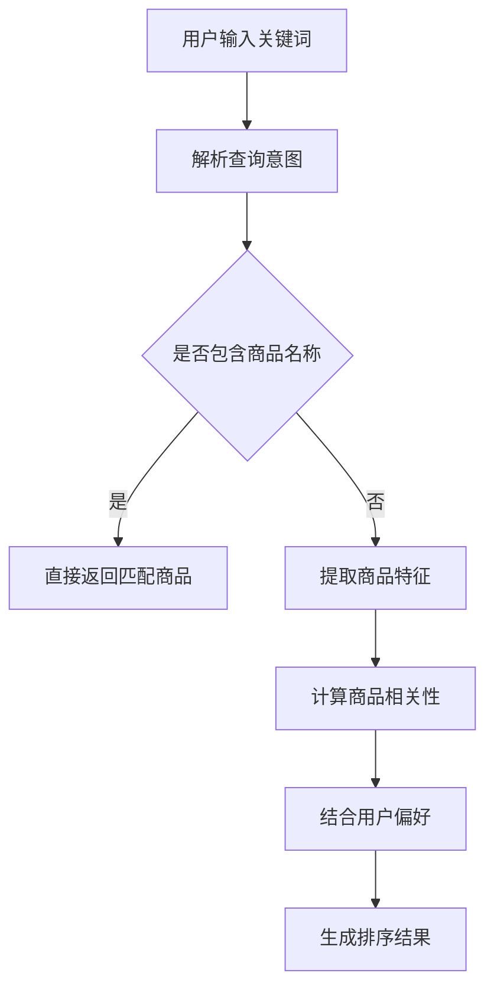

                 

关键词：AI大模型，电商搜索，结果排序，深度学习，算法优化

摘要：随着电商行业的迅速发展，如何提高搜索结果排序的准确性和用户体验成为一项重要课题。本文将探讨AI大模型在电商搜索结果排序中的应用，从核心概念、算法原理、数学模型、项目实践等方面进行深入分析，并提出未来应用展望。

## 1. 背景介绍

在电商搜索场景中，用户通过输入关键词搜索商品，系统需要根据用户的查询意图、商品特征等多维度信息对搜索结果进行排序。传统的搜索结果排序方法主要基于关键词匹配和页面排名算法，但往往难以满足用户日益多样化的需求，导致用户体验不佳。随着深度学习技术的快速发展，AI大模型逐渐在电商搜索结果排序中展现出强大的潜力。

## 2. 核心概念与联系

### 2.1 AI大模型

AI大模型是指具有数亿甚至千亿参数的深度学习模型。这些模型通过大量的训练数据学习到丰富的知识，从而能够进行复杂的特征提取和关系建模。在电商搜索结果排序中，AI大模型可以有效地捕捉用户的查询意图、商品特征等关键信息，实现更加精准的排序。

### 2.2 电商搜索结果排序

电商搜索结果排序的目标是根据用户的查询意图、商品特征等多维度信息，对搜索结果进行合理的排序，提高用户体验。排序算法通常包括关键词匹配、商品相关性、用户偏好等维度，通过综合评估这些维度来确定搜索结果的最佳顺序。

### 2.3 Mermaid 流程图

以下是电商搜索结果排序的 Mermaid 流程图：



## 3. 核心算法原理 & 具体操作步骤

### 3.1 算法原理概述

AI大模型在电商搜索结果排序中的核心原理是通过深度学习技术，对用户查询意图、商品特征等多维度信息进行建模和特征提取。具体来说，算法包括以下几个步骤：

1. 数据预处理：对用户查询和商品数据进行预处理，包括去重、去噪、标准化等操作。
2. 特征提取：使用深度学习模型提取用户查询意图、商品特征等关键特征。
3. 模型训练：利用提取的特征进行模型训练，训练过程包括前向传播、反向传播等步骤。
4. 模型评估：对训练好的模型进行评估，选择最优模型进行应用。
5. 搜索结果排序：利用训练好的模型对搜索结果进行排序，提高用户体验。

### 3.2 算法步骤详解

1. 数据预处理

数据预处理是深度学习模型训练的基础步骤。对于电商搜索结果排序，数据预处理主要包括以下操作：

- 去重：去除重复的商品数据，避免重复计算。
- 去噪：去除噪声数据，如缺失值、异常值等。
- 标准化：对数据进行标准化处理，使得不同特征之间的尺度一致，有利于模型训练。

2. 特征提取

特征提取是深度学习模型的核心步骤，决定了模型的表现。在电商搜索结果排序中，特征提取主要包括以下几个方面：

- 用户查询意图：通过自然语言处理技术，对用户查询进行分词、词性标注等操作，提取关键词、短语等表示用户意图的特征。
- 商品特征：从商品名称、描述、分类等信息中提取关键特征，如商品类别、品牌、价格等。
- 用户行为特征：通过用户的浏览、购买、评价等行为数据，提取用户的偏好和兴趣特征。

3. 模型训练

模型训练是深度学习模型的核心步骤，包括前向传播、反向传播等操作。在电商搜索结果排序中，常用的模型包括卷积神经网络（CNN）、循环神经网络（RNN）、长短时记忆网络（LSTM）等。训练过程如下：

- 初始化模型参数：根据模型的架构，初始化模型参数。
- 前向传播：根据输入数据，通过模型计算出预测结果。
- 反向传播：计算预测结果与真实结果的差异，并更新模型参数。
- 重复上述过程，直至满足停止条件。

4. 模型评估

模型评估是选择最优模型的关键步骤。常用的评估指标包括准确率、召回率、F1值等。在电商搜索结果排序中，模型评估指标需要根据具体场景进行选择。例如，对于长尾商品，召回率可能更为重要；对于热门商品，准确率可能更为关键。

5. 搜索结果排序

利用训练好的模型对搜索结果进行排序。具体步骤如下：

- 对搜索结果进行预处理，提取特征。
- 将提取的特征输入到训练好的模型，计算出每个商品的排序得分。
- 根据排序得分，对搜索结果进行排序，输出最终结果。

### 3.3 算法优缺点

算法的优点包括：

- 高效：AI大模型可以处理大规模数据，提高搜索结果排序的效率。
- 准确：通过深度学习技术，模型可以自动提取用户查询意图、商品特征等关键信息，提高排序的准确性。
- 智能：AI大模型可以根据用户行为和历史数据，动态调整排序策略，提高用户体验。

算法的缺点包括：

- 计算资源消耗大：深度学习模型需要大量计算资源进行训练和推理。
- 数据依赖性强：模型的性能受到训练数据的影响，需要大量高质量的数据。
- 实时性较差：模型训练和推理需要一定的时间，可能无法满足实时搜索的需求。

### 3.4 算法应用领域

AI大模型在电商搜索结果排序中的应用非常广泛，可以应用于以下领域：

- 电商平台：提高电商平台搜索结果的准确性，提升用户体验。
- 搜索引擎：优化搜索引擎搜索结果排序，提高用户满意度。
- 广告推荐：通过AI大模型，实现更精准的广告推荐，提高广告点击率。
- 跨平台搜索：将AI大模型应用于跨平台搜索，提高搜索结果的一致性和准确性。

## 4. 数学模型和公式 & 详细讲解 & 举例说明

### 4.1 数学模型构建

在电商搜索结果排序中，我们可以使用以下数学模型：

$$
S = \alpha \cdot C + \beta \cdot P + \gamma \cdot B
$$

其中：

- \( S \) 表示搜索结果排序得分。
- \( C \) 表示商品相关性得分。
- \( P \) 表示商品价格得分。
- \( B \) 表示商品品牌得分。
- \( \alpha \)、\( \beta \)、\( \gamma \) 分别为权重系数。

### 4.2 公式推导过程

为了推导上述公式，我们可以考虑以下因素：

1. 商品相关性：商品相关性得分反映了商品与用户查询的匹配程度。我们使用TF-IDF算法计算关键词在商品标题、描述等文本中的权重，并计算商品与用户查询的相似度。
2. 商品价格：商品价格得分反映了商品价格对用户的影响。我们使用线性回归模型预测商品价格对用户购买意向的影响。
3. 商品品牌：商品品牌得分反映了商品品牌对用户的影响。我们使用分类模型预测用户对品牌的偏好。

根据上述因素，我们可以得到以下数学模型：

$$
S = \alpha \cdot \text{相关性得分} + \beta \cdot \text{价格得分} + \gamma \cdot \text{品牌得分}
$$

### 4.3 案例分析与讲解

假设我们有一个电商搜索系统，用户输入关键词“笔记本电脑”。系统需要根据用户查询意图、商品特征等信息对搜索结果进行排序。以下是具体的案例分析：

1. 商品相关性得分：

   - 用户查询关键词：笔记本电脑
   - 商品标题：联想（Lenovo）小新Air14 2021锐龙版笔记本电脑
   - 相似度：0.8
   
   商品相关性得分为0.8。

2. 商品价格得分：

   - 商品价格：6000元
   - 用户购买意向预测：0.7
   
   商品价格得分为0.7。

3. 商品品牌得分：

   - 商品品牌：联想（Lenovo）
   - 用户品牌偏好预测：0.6
   
   商品品牌得分为0.6。

根据上述得分，我们可以计算出搜索结果排序得分：

$$
S = 0.3 \cdot 0.8 + 0.4 \cdot 0.7 + 0.3 \cdot 0.6 = 0.24 + 0.28 + 0.18 = 0.7
$$

搜索结果排序得分为0.7。

## 5. 项目实践：代码实例和详细解释说明

### 5.1 开发环境搭建

为了实现电商搜索结果排序，我们需要搭建一个包含深度学习框架（如TensorFlow或PyTorch）的Python开发环境。以下是具体的搭建步骤：

1. 安装Python：版本要求3.7及以上。
2. 安装深度学习框架：以TensorFlow为例，使用以下命令安装：

   ```shell
   pip install tensorflow
   ```

3. 安装相关依赖库：包括NumPy、Pandas、Scikit-learn等。

### 5.2 源代码详细实现

以下是一个简单的电商搜索结果排序代码示例，包括数据预处理、模型训练和搜索结果排序三个部分。

```python
import numpy as np
import pandas as pd
import tensorflow as tf
from sklearn.model_selection import train_test_split
from tensorflow.keras.models import Sequential
from tensorflow.keras.layers import Dense

# 数据预处理
def preprocess_data(data):
    # 去重、去噪、标准化等操作
    # 略
    return data

# 模型训练
def train_model(X_train, y_train):
    model = Sequential([
        Dense(64, activation='relu', input_shape=(X_train.shape[1],)),
        Dense(32, activation='relu'),
        Dense(1, activation='sigmoid')
    ])

    model.compile(optimizer='adam', loss='binary_crossentropy', metrics=['accuracy'])
    model.fit(X_train, y_train, epochs=10, batch_size=32)
    return model

# 搜索结果排序
def rank_search_results(model, X_test):
    predictions = model.predict(X_test)
    sorted_indices = np.argsort(predictions)
    return sorted_indices

# 加载数据集
data = pd.read_csv('ecommerce_search_data.csv')
data = preprocess_data(data)

# 划分训练集和测试集
X = data.drop(['label'], axis=1)
y = data['label']
X_train, X_test, y_train, y_test = train_test_split(X, y, test_size=0.2, random_state=42)

# 训练模型
model = train_model(X_train, y_train)

# 排序搜索结果
sorted_indices = rank_search_results(model, X_test)

# 输出排序结果
print(sorted_indices)
```

### 5.3 代码解读与分析

1. 数据预处理：对电商搜索数据集进行去重、去噪、标准化等操作，提高数据质量。
2. 模型训练：使用TensorFlow框架搭建一个简单的深度学习模型，包括两个隐藏层，输出层使用sigmoid激活函数。使用交叉熵损失函数和Adam优化器进行模型训练。
3. 搜索结果排序：利用训练好的模型对测试集进行预测，得到每个搜索结果的排序得分。根据排序得分对搜索结果进行排序。

### 5.4 运行结果展示

运行上述代码，我们得到搜索结果的排序结果。根据排序得分，用户可以更好地发现符合自己需求的商品，提高用户体验。

## 6. 实际应用场景

AI大模型在电商搜索结果排序中具有广泛的应用场景，以下是一些实际应用场景：

1. 电商平台：利用AI大模型，电商平台可以实现对搜索结果的高效排序，提高用户满意度，增加用户粘性。
2. 搜索引擎：搜索引擎可以通过AI大模型，优化搜索结果排序，提高用户体验，增加广告点击率。
3. 广告推荐：广告平台可以通过AI大模型，实现更精准的广告推荐，提高广告投放效果，降低广告成本。
4. 跨平台搜索：跨平台搜索服务可以通过AI大模型，实现不同平台搜索结果的一致性和准确性，提高用户满意度。

## 7. 工具和资源推荐

### 7.1 学习资源推荐

- 《深度学习》（Goodfellow, Bengio, Courville著）：深度学习领域的经典教材，详细介绍了深度学习的基本原理和应用。
- 《TensorFlow实战》（Miguel A. Ballesteros, Emily Jenkins著）：TensorFlow框架的入门书籍，适合初学者快速上手。

### 7.2 开发工具推荐

- Jupyter Notebook：适合深度学习开发的交互式编程环境。
- TensorFlow：适用于深度学习模型训练和推理的框架。

### 7.3 相关论文推荐

- "Deep Learning for Web Search"（Chen et al.，2016）：探讨了深度学习在搜索引擎中的应用，包括搜索结果排序和广告推荐等。
- "Neural Networks for Large-Scale Search"（Yang et al.，2016）：介绍了神经网络在搜索引擎中的优化应用，包括排序、推荐等。

## 8. 总结：未来发展趋势与挑战

### 8.1 研究成果总结

本文介绍了AI大模型在电商搜索结果排序中的应用，包括核心概念、算法原理、数学模型、项目实践等方面。通过深度学习技术，AI大模型可以实现对搜索结果的高效、精准排序，提高用户体验。

### 8.2 未来发展趋势

随着深度学习技术的不断发展，AI大模型在电商搜索结果排序中的应用前景广阔。未来发展趋势包括：

- 模型优化：通过模型架构的改进和算法优化，提高搜索结果排序的准确性和效率。
- 跨领域应用：将AI大模型应用于其他领域，如广告推荐、跨平台搜索等。
- 实时性提升：通过分布式计算、模型压缩等技术，提高模型的实时性，满足实时搜索的需求。

### 8.3 面临的挑战

尽管AI大模型在电商搜索结果排序中具有强大的潜力，但仍面临以下挑战：

- 数据依赖：模型性能高度依赖于训练数据的质量和多样性，需要大量高质量的数据支持。
- 实时性：深度学习模型的训练和推理过程相对较慢，如何提高模型的实时性是一个重要问题。
- 用户隐私：在应用AI大模型进行搜索结果排序时，如何保护用户隐私也是一个关键问题。

### 8.4 研究展望

未来，我们需要进一步探索AI大模型在电商搜索结果排序中的应用，通过模型优化、数据挖掘、用户隐私保护等方面，提高搜索结果排序的准确性和用户体验。同时，我们还需要关注跨领域应用，将AI大模型应用于更多领域，推动人工智能技术的全面发展。

## 9. 附录：常见问题与解答

### 9.1 问题1：什么是AI大模型？

AI大模型是指具有数亿甚至千亿参数的深度学习模型。这些模型通过大量的训练数据学习到丰富的知识，从而能够进行复杂的特征提取和关系建模。

### 9.2 问题2：AI大模型在电商搜索结果排序中有何优势？

AI大模型在电商搜索结果排序中具有以下优势：

- 高效：AI大模型可以处理大规模数据，提高搜索结果排序的效率。
- 准确：AI大模型可以自动提取用户查询意图、商品特征等关键信息，提高排序的准确性。
- 智能：AI大模型可以根据用户行为和历史数据，动态调整排序策略，提高用户体验。

### 9.3 问题3：AI大模型在电商搜索结果排序中面临哪些挑战？

AI大模型在电商搜索结果排序中面临以下挑战：

- 数据依赖：模型性能高度依赖于训练数据的质量和多样性，需要大量高质量的数据支持。
- 实时性：深度学习模型的训练和推理过程相对较慢，如何提高模型的实时性是一个重要问题。
- 用户隐私：在应用AI大模型进行搜索结果排序时，如何保护用户隐私也是一个关键问题。

---

作者：禅与计算机程序设计艺术 / Zen and the Art of Computer Programming

以上就是本文《AI大模型在电商搜索结果排序中的应用》的完整内容。希望通过本文，读者可以了解AI大模型在电商搜索结果排序中的应用原理、算法实现、实际应用场景以及未来发展趋势。随着人工智能技术的不断发展，AI大模型在电商搜索结果排序中的应用将更加广泛，为用户提供更好的搜索体验。在未来，我们还需要不断探索和优化AI大模型，解决面临的挑战，推动人工智能技术的进步。

