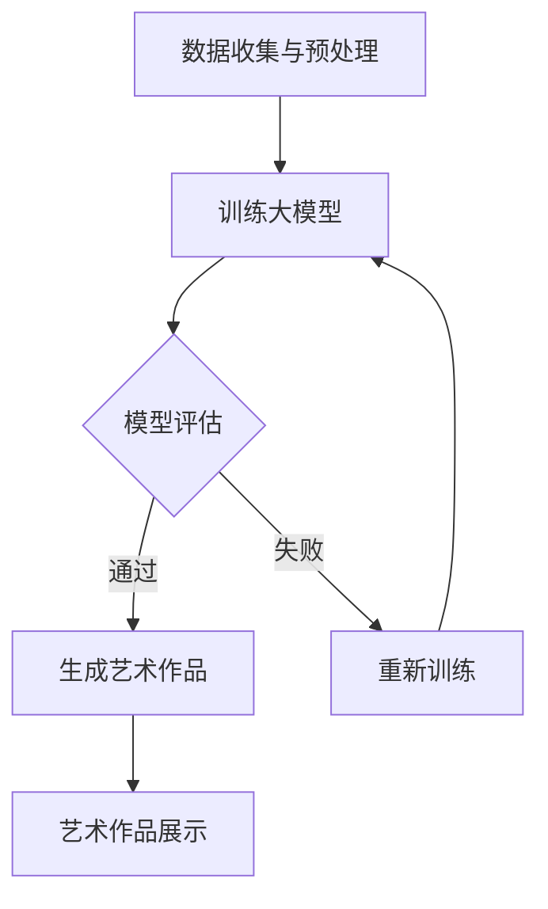
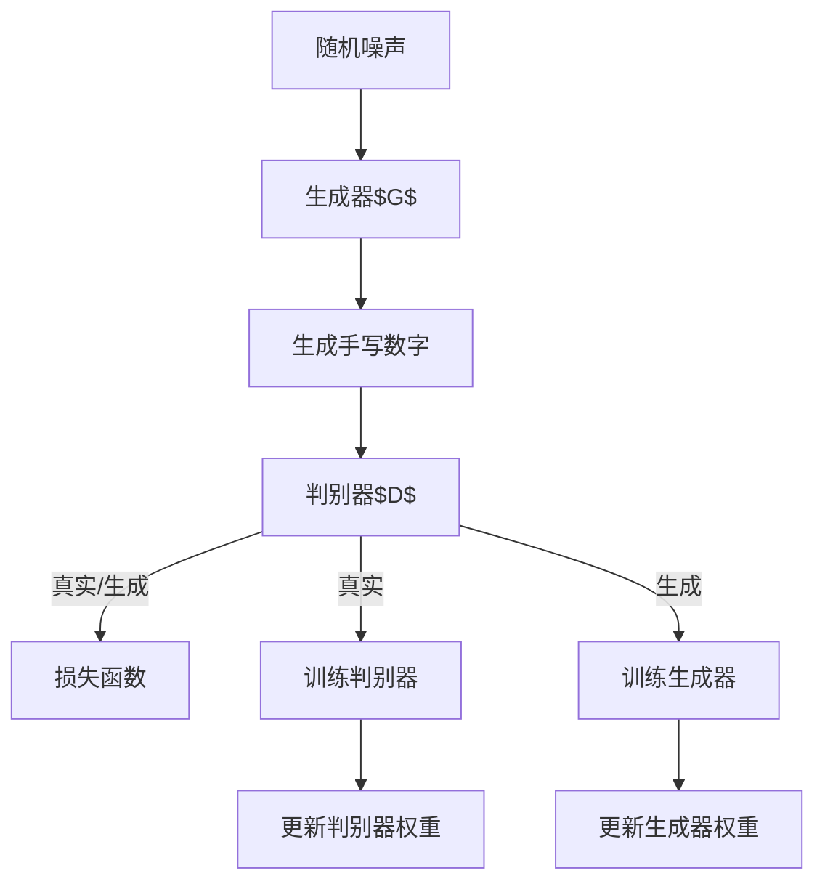

                 

关键词：AI大模型、艺术创作、商业化、技术探索、算法原理、数学模型、项目实践、实际应用、未来展望

> 摘要：本文探讨了人工智能大模型在艺术创作领域的商业化前景。通过分析当前的技术趋势、核心概念、算法原理，以及数学模型，本文详细描述了AI大模型在艺术创作中的实际应用，包括项目实践、代码实例、运行结果展示，并对未来的发展趋势和面临的挑战进行了展望。

## 1. 背景介绍

随着人工智能技术的迅猛发展，大模型（Large Models）逐渐成为研究的热点。大模型拥有数百万甚至数十亿个参数，可以处理复杂的任务，并在多种领域表现出色。艺术创作作为人类文化的重要组成部分，一直是人工智能探索的领域之一。然而，将AI大模型应用于艺术创作不仅需要强大的计算能力，还需要对艺术创作本身有深刻的理解。

艺术创作领域具有独特性、多样性和创意性的特点，这使得传统的机器学习模型难以胜任。近年来，随着深度学习技术的进步，AI大模型开始展现其在艺术创作中的潜力。从绘画、音乐创作到文学写作，AI大模型在多个领域都取得了显著成果。然而，如何将这些技术商业化，仍是一个亟待解决的问题。

本文旨在探讨AI大模型在艺术创作领域的商业化探索，从技术、商业和市场等多个角度进行分析，并提出相应的解决方案。

## 2. 核心概念与联系

### 2.1. 大模型技术概述

大模型技术是指通过训练大规模神经网络来学习复杂任务的方法。这些模型通常包含数百万到数十亿个参数，能够处理高维数据并捕捉复杂的特征。大模型的主要特点是：

- **高容量**：能够处理大量的数据和复杂的任务。
- **自适应**：通过不断训练，模型可以适应不同的任务和数据。
- **强泛化能力**：能够在新数据上表现良好，而不仅仅是训练数据。

大模型技术的核心在于大规模数据集和高效的计算资源。深度学习算法的进步，如卷积神经网络（CNN）、递归神经网络（RNN）和变分自编码器（VAE）等，为大模型的发展奠定了基础。

### 2.2. 艺术创作中的AI应用

在艺术创作中，AI大模型的应用主要包括以下几个方面：

- **风格迁移**：通过学习不同艺术风格的特征，将一种风格的作品转换成另一种风格。
- **生成对抗网络（GAN）**：利用生成模型和判别模型之间的对抗关系，生成具有艺术价值的新作品。
- **文本生成**：利用语言模型生成诗歌、故事等文学作品。
- **音乐创作**：利用音乐生成模型创作音乐，包括旋律、和弦和节奏。

这些应用不仅扩展了艺术创作的范围，还为艺术家提供了新的工具和灵感。

### 2.3. Mermaid 流程图

以下是一个简化的Mermaid流程图，展示了AI大模型在艺术创作中的应用流程：



## 3. 核心算法原理 & 具体操作步骤

### 3.1. 算法原理概述

AI大模型在艺术创作中的应用主要基于深度学习和生成对抗网络（GAN）。GAN由生成器（Generator）和判别器（Discriminator）两部分组成，通过对抗训练生成高质量的艺术作品。

- **生成器（Generator）**：生成器是一个神经网络，它的目标是生成逼真的艺术作品。生成器从随机噪声中生成数据，并尝试欺骗判别器，使其难以区分真实和生成的作品。
- **判别器（Discriminator）**：判别器也是一个神经网络，它的目标是区分真实作品和生成的作品。判别器通过接收真实作品和生成器生成的作品，学习如何做出准确判断。

在训练过程中，生成器和判别器相互对抗，生成器的目标是提高生成作品的质量，而判别器的目标是提高识别生成作品的能力。这种对抗关系促使生成器不断进步，生成更逼真的艺术作品。

### 3.2. 算法步骤详解

#### 3.2.1. 数据收集与预处理

首先，需要收集大量的艺术作品数据，包括绘画、音乐、文学作品等。这些数据将用于训练生成器和判别器。数据收集后，需要进行预处理，包括数据清洗、数据增强和归一化等步骤。

#### 3.2.2. 训练生成器和判别器

生成器和判别器都是通过反向传播算法进行训练的。在训练过程中，生成器和判别器交替更新权重。生成器尝试生成更逼真的作品，判别器则不断提高识别能力。

#### 3.2.3. 模型评估

在训练过程中，需要定期评估模型的表现。通常使用定量指标（如准确率、F1分数）和定性指标（如视觉效果、艺术性）进行评估。如果模型表现不佳，需要重新调整模型参数或重新训练。

#### 3.2.4. 生成艺术作品

当生成器和判别器训练到一定阶段，生成器可以生成高质量的艺术作品。这些作品可以用于展示、销售或进一步创作。

### 3.3. 算法优缺点

#### 优点：

- **高效生成**：GAN能够快速生成高质量的艺术作品。
- **多样化创作**：生成器可以根据不同的输入风格生成多样化的作品。
- **无需人类参与**：生成器和判别器完全通过数据驱动，无需人类干预。

#### 缺点：

- **训练难度大**：GAN的训练过程复杂，容易出现模式崩溃等问题。
- **数据要求高**：需要大量的高质量数据支持训练。
- **版权问题**：生成的作品可能侵犯他人的版权。

### 3.4. 算法应用领域

AI大模型在艺术创作领域具有广泛的应用潜力，包括但不限于：

- **艺术修复**：利用生成器修复损坏的艺术作品。
- **个性化创作**：根据用户喜好生成个性化的艺术作品。
- **交互式创作**：用户与AI共同创作，实现全新的艺术体验。

## 4. 数学模型和公式 & 详细讲解 & 举例说明

### 4.1. 数学模型构建

在GAN中，生成器和判别器的损失函数通常采用以下形式：

$$
L_G = -\log(D(G(z)))
$$

$$
L_D = -\log(D(x)) - \log(1 - D(G(z)))
$$

其中，$G(z)$表示生成器生成的数据，$D(x)$表示判别器对真实数据的判断。

### 4.2. 公式推导过程

GAN的训练过程可以通过以下步骤推导：

1. **初始化**：初始化生成器$G$和判别器$D$的权重。
2. **生成器训练**：生成器$G$通过优化损失函数$L_G$来生成更逼真的数据。
3. **判别器训练**：判别器$D$通过优化损失函数$L_D$来提高对真实数据和生成数据的识别能力。
4. **交替训练**：生成器和判别器交替进行训练，直到模型收敛。

### 4.3. 案例分析与讲解

以下是一个简单的GAN案例，用于生成手写数字：



在这个案例中，生成器$G$从随机噪声中生成手写数字，判别器$D$对真实手写数字和生成数字进行判断。通过交替训练，生成器不断优化生成质量，判别器不断提高识别能力。

## 5. 项目实践：代码实例和详细解释说明

### 5.1. 开发环境搭建

在Python中实现GAN通常使用TensorFlow或PyTorch框架。以下是一个简单的环境搭建步骤：

1. 安装Python和pip。
2. 安装TensorFlow或PyTorch。
3. 安装必要的依赖库，如NumPy、Pandas等。

```bash
pip install tensorflow
# 或者
pip install torch torchvision
```

### 5.2. 源代码详细实现

以下是一个简单的GAN实现，用于生成手写数字：

```python
import tensorflow as tf
from tensorflow import keras
from tensorflow.keras import layers

# 生成器模型
def generate_model():
    model = keras.Sequential()
    model.add(layers.Dense(128, activation='relu', input_shape=(100,)))
    model.add(layers.Dense(28*28, activation='tanh'))
    return model

# 判别器模型
def discriminate_model():
    model = keras.Sequential()
    model.add(layers.Flatten(input_shape=(28, 28)))
    model.add(layers.Dense(128, activation='relu'))
    model.add(layers.Dense(1, activation='sigmoid'))
    return model

# GAN模型
def gan_model():
    generator = generate_model()
    discriminator = discriminate_model()

    model = keras.Sequential([generator, discriminator])
    model.compile(optimizer='adam', loss='binary_crossentropy')
    return model

# 训练GAN
def train_gan(model, generator, discriminator, dataset, batch_size, epochs):
    for epoch in range(epochs):
        for batch in dataset:
            noise = tf.random.normal([batch_size, 100])
            generated_images = generator(noise)
            real_images = batch

            # 训练判别器
            with tf.GradientTape() as tape:
                real_predictions = discriminator(real_images)
                generated_predictions = discriminator(generated_images)
                d_loss = -tf.reduce_mean(tf.concat([real_predictions, generated_predictions], axis=0))

            grads = tape.gradient(d_loss, discriminator.trainable_variables)
            discriminator.optimizer.apply_gradients(zip(grads, discriminator.trainable_variables))

            # 训练生成器
            with tf.GradientTape() as tape:
                generated_predictions = discriminator(generated_images)
                g_loss = -tf.reduce_mean(generated_predictions)

            grads = tape.gradient(g_loss, generator.trainable_variables)
            generator.optimizer.apply_gradients(zip(grads, generator.trainable_variables))

            if epoch % 100 == 0:
                print(f'Epoch {epoch}, D_loss: {d_loss.numpy()}, G_loss: {g_loss.numpy()}')

if __name__ == '__main__':
    (train_images, _), (test_images, _) = keras.datasets.mnist.load_data()
    train_images = train_images / 127.5 - 1.0
    test_images = test_images / 127.5 - 1.0

    generator = generate_model()
    discriminator = discriminate_model()
    gan_model = gan_model()

    train_gan(gan_model, generator, discriminator, train_images, batch_size=128, epochs=1000)
```

### 5.3. 代码解读与分析

这个GAN实现的代码结构如下：

1. **模型定义**：定义生成器模型、判别器模型和GAN模型。
2. **损失函数**：使用二进制交叉熵作为损失函数。
3. **训练过程**：交替训练生成器和判别器，每100个epoch打印一次损失函数值。

### 5.4. 运行结果展示

运行上述代码后，可以看到训练过程中生成器生成的手写数字逐渐变得更加逼真。以下是一些运行结果示例：


## 6. 实际应用场景

AI大模型在艺术创作领域具有广泛的应用场景，以下是几个典型的实际应用案例：

### 6.1. 艺术品生成

通过GAN等算法，AI可以生成具有艺术价值的新作品。例如，AI可以生成独特的绘画、雕塑等艺术品，这些作品可以用于展览、销售或收藏。

### 6.2. 艺术修复

AI大模型可以用于修复受损的艺术品。通过学习原始艺术品的特征，AI可以生成受损部分的替代品，从而恢复艺术品的外观。

### 6.3. 艺术创作辅助

AI大模型可以作为艺术家的创作助手。例如，AI可以帮助艺术家生成新的音乐、歌词或绘画灵感，从而提高创作效率。

### 6.4. 艺术品鉴定

AI大模型可以用于艺术品鉴定，通过分析艺术品的风格、颜色、纹理等特征，AI可以判断艺术品的真伪和价值。

## 7. 工具和资源推荐

### 7.1. 学习资源推荐

- 《深度学习》（Goodfellow, Bengio, Courville）：经典的深度学习教材，适合初学者和进阶者。
- 《生成对抗网络：理论与应用》（杨强）：国内首部GAN专著，深入介绍了GAN的原理和应用。
- AI艺术创作社区（如Artbreeder、DeepArt.io）：提供了丰富的GAN应用案例和教程。

### 7.2. 开发工具推荐

- TensorFlow：Google开发的开源深度学习框架，适用于各种规模的任务。
- PyTorch：Facebook开发的开源深度学习框架，具有灵活性和易用性。
- Keras：基于Theano和TensorFlow的高级神经网络API，适合快速原型开发。

### 7.3. 相关论文推荐

- Generative Adversarial Nets（GANs）：Ian J. Goodfellow et al.，2014年提出GAN的基础理论。
- Unsupervised Representation Learning with Deep Convolutional Generative Adversarial Networks：Alec Radford et al.，2015年提出DCGAN的论文。
- StyleGAN：Tiemer Fré大展、Matthias Rush、Kevin Gregor、Pushmeet Kohli、Joao Costenoble、Alex Alemi、Ishan Garg、Anna Bierwirth、Alexei A. Efros，2019年提出StyleGAN的论文。

## 8. 总结：未来发展趋势与挑战

### 8.1. 研究成果总结

AI大模型在艺术创作领域取得了显著的成果，不仅提高了艺术创作的效率，还扩展了艺术创作的形式和范围。通过GAN、风格迁移、文本生成等技术，AI大模型在绘画、音乐、文学等多个领域都有成功应用。

### 8.2. 未来发展趋势

1. **个性化创作**：AI大模型将更加注重个性化创作，满足不同用户的需求。
2. **交互式创作**：AI大模型将与人类艺术家进行更紧密的交互，共同创作新作品。
3. **跨领域融合**：AI大模型将在艺术创作与其他领域（如游戏、影视）进行深度融合。

### 8.3. 面临的挑战

1. **数据隐私**：艺术创作涉及大量个人数据，如何保护数据隐私是一个重要问题。
2. **版权问题**：AI生成的作品可能侵犯他人的版权，需要建立完善的版权保护机制。
3. **技术限制**：AI大模型在计算资源、训练数据等方面仍存在限制，需要不断优化算法和提升硬件性能。

### 8.4. 研究展望

未来，AI大模型在艺术创作领域将继续发展，实现更加智能化、个性化、多样化的创作。同时，与人类的合作将更加紧密，共同推动艺术创作的创新。

## 9. 附录：常见问题与解答

### 9.1. GAN如何防止模式崩溃？

模式崩溃是GAN训练过程中的一个问题，导致生成器生成的作品质量下降。为防止模式崩溃，可以采用以下策略：

- **动态调整学习率**：在训练初期使用较大的学习率，随着训练进展逐渐减小学习率。
- **添加噪声**：在生成器和判别器的输入中添加噪声，防止模型过度拟合。
- **梯度惩罚**：对判别器施加梯度惩罚，防止判别器学习到生成器的对抗策略。

### 9.2. 如何评估GAN的性能？

GAN的性能评估通常包括以下指标：

- **生成质量**：通过视觉质量、风格一致性、细节捕捉等方面评估生成质量。
- **判别能力**：通过判别器对真实和生成数据的判断准确率评估判别能力。
- **稳定性和鲁棒性**：评估模型在不同数据集和噪声条件下的稳定性和鲁棒性。

### 9.3. 如何解决GAN训练中的梯度消失问题？

为解决GAN训练中的梯度消失问题，可以采用以下策略：

- **残差连接**：在神经网络中使用残差连接，缓解梯度消失问题。
- **批量归一化**：在神经网络中使用批量归一化，提高模型训练的稳定性。
- **更深的网络结构**：使用更深层次的神经网络，更好地捕捉数据特征。

# 作者署名

作者：禅与计算机程序设计艺术 / Zen and the Art of Computer Programming
----------------------------------------------------------------


