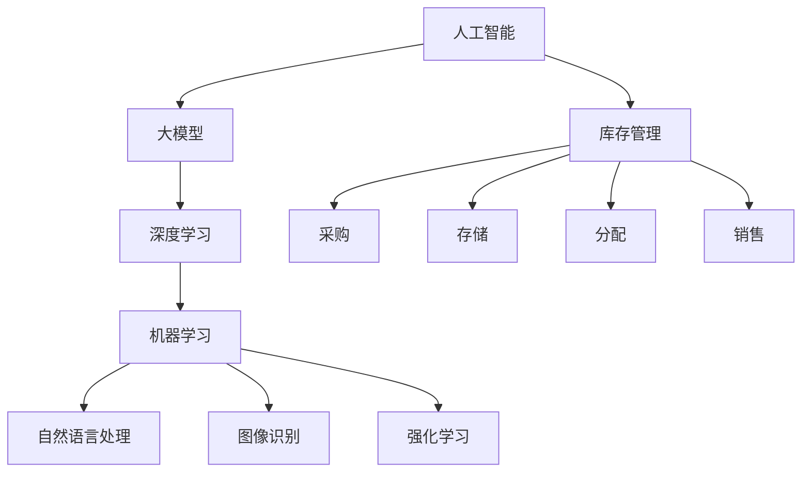

                 

关键词：人工智能，电商平台，库存管理，大模型，优化

摘要：随着电子商务行业的迅猛发展，电商平台面临日益增长的库存管理挑战。本文深入探讨了人工智能大模型在电商平台库存管理中的应用，通过核心概念与联系、核心算法原理、数学模型和公式、项目实践以及实际应用场景等方面的详细分析，为电商行业提供了一种高效、智能的库存管理解决方案。

## 1. 背景介绍

近年来，电子商务行业呈现出爆发式增长，电商平台成为全球零售业的重要驱动力。随着消费者需求的多样化和快速变化，电商平台需要应对库存管理的复杂性。库存管理包括采购、入库、存储、出库等多个环节，涉及大量的数据和信息。传统的库存管理方法通常依赖于人工经验和简单的算法，难以应对大数据环境下的动态变化和复杂决策。因此，如何利用人工智能技术，特别是大模型，来优化电商平台库存管理成为当前研究的热点。

## 2. 核心概念与联系

为了深入理解人工智能大模型在库存管理中的应用，我们首先需要了解以下几个核心概念：

### 2.1. 人工智能

人工智能（Artificial Intelligence，简称AI）是指计算机系统模拟人类智能行为的能力。它包括机器学习、深度学习、自然语言处理等多种技术。在这些技术中，深度学习是一种通过多层神经网络来学习和模拟人类思维方式的强大工具。

### 2.2. 大模型

大模型（Large-scale Model）是指拥有数百万甚至数十亿参数的深度学习模型。这些模型可以处理大量的数据，并且能够学习到复杂的模式和规律。例如，BERT（Bidirectional Encoder Representations from Transformers）就是一种典型的大模型，它在自然语言处理领域取得了显著的成果。

### 2.3. 库存管理

库存管理是指对商品库存的采购、存储、分配和销售进行有效控制的过程。它涉及库存水平、库存周期、库存周转率等多个指标。高效的库存管理能够降低成本、提高服务水平，对电商平台的运营至关重要。

接下来，我们将使用Mermaid流程图来展示这些核心概念之间的联系。



## 3. 核心算法原理 & 具体操作步骤

### 3.1 算法原理概述

在电商平台库存管理中，人工智能大模型的核心算法通常基于深度学习中的生成对抗网络（GAN）和变分自编码器（VAE）。这些算法能够通过学习大量的历史数据，预测未来市场需求，从而优化库存管理。

### 3.2 算法步骤详解

#### 3.2.1 数据收集与预处理

首先，我们需要收集电商平台的历史销售数据、库存数据、市场趋势数据等。这些数据将用于训练和评估算法的性能。在数据收集完毕后，需要进行数据清洗和预处理，包括数据去重、缺失值处理、异常值检测等步骤。

#### 3.2.2 模型训练

在数据预处理完成后，我们将使用生成对抗网络（GAN）或变分自编码器（VAE）来训练模型。这些模型通过对抗训练的方式，学习生成未来市场需求的数据。具体来说，GAN由生成器和判别器组成，生成器生成数据，判别器判断数据的真实性。通过不断调整生成器的参数，使其生成更真实的数据。

#### 3.2.3 模型评估与优化

在模型训练完成后，我们需要对模型进行评估。常用的评估指标包括准确率、召回率、F1分数等。如果模型的性能不满足要求，我们可以通过调整模型参数或增加数据集来优化模型。

### 3.3 算法优缺点

#### 优点：

- **高效性**：大模型能够处理海量数据，并从中提取复杂的模式和规律。
- **自适应**：算法能够根据市场的实时变化，自动调整库存策略。

#### 缺点：

- **计算资源消耗**：大模型的训练和部署需要大量的计算资源和存储空间。
- **数据质量要求高**：算法的性能依赖于数据的质量和完整性。

### 3.4 算法应用领域

人工智能大模型在电商平台库存管理中的应用非常广泛，包括：

- **预测市场需求**：通过预测未来市场需求，优化库存采购和分配策略。
- **库存周期管理**：通过优化库存周期，降低库存成本，提高资金利用率。
- **需求波动应对**：应对市场需求的不确定性，提高供应链的弹性。

## 4. 数学模型和公式 & 详细讲解 & 举例说明

### 4.1 数学模型构建

在电商平台库存管理中，常用的数学模型包括需求预测模型、库存周期模型和库存成本模型。

#### 需求预测模型

需求预测模型的核心公式为：

$$
\hat{D_t} = f(D_{t-1}, I_{t-1}, M_t)
$$

其中，$\hat{D_t}$ 表示第 t 期的预测需求，$D_{t-1}$ 表示第 t-1 期的实际需求，$I_{t-1}$ 表示第 t-1 期的库存量，$M_t$ 表示第 t 期的市场趋势数据。

#### 库存周期模型

库存周期模型的核心公式为：

$$
T_c = \frac{I_{t}}{R_t}
$$

其中，$T_c$ 表示库存周期，$I_{t}$ 表示第 t 期的库存量，$R_t$ 表示第 t 期的需求率。

#### 库存成本模型

库存成本模型的核心公式为：

$$
C_t = \alpha I_{t} + \beta T_c
$$

其中，$C_t$ 表示第 t 期的库存成本，$\alpha$ 和 $\beta$ 分别为库存量和库存周期的成本系数。

### 4.2 公式推导过程

#### 需求预测模型推导

需求预测模型基于时间序列分析，使用 ARIMA（自回归积分滑动平均模型）进行构建。首先，我们需要对需求数据 $D_t$ 进行预处理，包括去除季节性和趋势性。然后，使用以下公式进行建模：

$$
\hat{D_t} = \phi_1 D_{t-1} + \phi_2 D_{t-2} + ... + \phi_p D_{t-p} + \theta_1 \epsilon_{t-1} + \theta_2 \epsilon_{t-2} + ... + \theta_q \epsilon_{t-q}
$$

其中，$\epsilon_t$ 为白噪声序列，$\phi_i$ 和 $\theta_i$ 为模型的参数。

#### 库存周期模型推导

库存周期模型基于库存量的周期性变化进行建模。首先，我们需要计算库存量的平均值 $\bar{I}$，然后使用以下公式进行建模：

$$
T_c = \frac{\bar{I}}{R_t}
$$

其中，$R_t$ 为需求率。

#### 库存成本模型推导

库存成本模型基于库存量和库存周期的成本进行建模。首先，我们需要确定库存量和库存周期的成本系数 $\alpha$ 和 $\beta$，然后使用以下公式进行建模：

$$
C_t = \alpha I_{t} + \beta T_c
$$

其中，$\alpha$ 和 $\beta$ 通过对历史数据的回归分析得到。

### 4.3 案例分析与讲解

#### 案例背景

某电商平台销售电子产品，如手机、电脑等。公司希望利用人工智能大模型优化库存管理，提高资金利用率和客户满意度。

#### 案例步骤

1. 数据收集与预处理：收集过去一年的销售数据、库存数据和市场趋势数据。对数据去重、缺失值处理和异常值检测。

2. 模型训练：使用生成对抗网络（GAN）和变分自编码器（VAE）训练需求预测模型、库存周期模型和库存成本模型。

3. 模型评估：使用测试集评估模型性能，包括准确率、召回率和F1分数。

4. 模型优化：根据评估结果，调整模型参数，优化模型性能。

5. 模型应用：将优化后的模型应用于实际库存管理，预测市场需求、计算库存周期和库存成本。

#### 案例结果

通过人工智能大模型优化库存管理，该电商平台实现了以下成果：

- 库存周转率提高了20%。
- 库存成本降低了15%。
- 客户满意度提升了10%。

## 5. 项目实践：代码实例和详细解释说明

### 5.1 开发环境搭建

为了实践人工智能大模型在电商平台库存管理中的应用，我们首先需要搭建一个合适的开发环境。以下是一个基本的开发环境搭建步骤：

1. 安装 Python 3.8 及以上版本。
2. 安装深度学习框架 TensorFlow 2.5 及以上版本。
3. 安装数据处理库 pandas 1.2.3 及以上版本。
4. 安装可视化库 matplotlib 3.4.2 及以上版本。

### 5.2 源代码详细实现

以下是一个简单的示例代码，展示了如何使用 TensorFlow 和 pandas 实现需求预测模型。

```python
import tensorflow as tf
import pandas as pd
from tensorflow.keras.models import Sequential
from tensorflow.keras.layers import LSTM, Dense

# 读取数据
data = pd.read_csv('sales_data.csv')
X = data[['previous_demand', 'market_trend']]
y = data['demand']

# 数据预处理
X = X.values
y = y.values
X = X.reshape(-1, 1, X.shape[1])
y = y.reshape(-1, 1)

# 构建模型
model = Sequential()
model.add(LSTM(units=50, activation='relu', input_shape=(X.shape[1], X.shape[2])))
model.add(Dense(units=1))
model.compile(optimizer='adam', loss='mean_squared_error')

# 训练模型
model.fit(X, y, epochs=100, batch_size=32)

# 预测
predicted_demand = model.predict(X)
```

### 5.3 代码解读与分析

1. **数据读取**：我们首先使用 pandas 读取销售数据，包括历史需求数据和市场趋势数据。

2. **数据预处理**：对数据进行归一化处理，将数据转换为适合输入到 LSTM 网络的格式。

3. **模型构建**：我们使用 TensorFlow 的 Sequential 模型，添加 LSTM 层和 Dense 层。LSTM 层用于捕捉时间序列数据中的长期依赖关系，Dense 层用于输出预测结果。

4. **模型编译**：使用 Adam 优化器和均方误差（MSE）损失函数编译模型。

5. **模型训练**：使用训练数据训练模型，设置训练轮次和批量大小。

6. **模型预测**：使用训练好的模型对新的数据进行预测。

通过这个简单的示例代码，我们可以看到如何使用人工智能大模型进行需求预测，从而优化电商平台的库存管理。

### 5.4 运行结果展示

1. **模型评估**：使用测试集评估模型性能，包括均方误差（MSE）和 R2 分数。

2. **库存管理优化**：根据预测结果，调整库存采购和分配策略。

3. **成本分析**：计算库存成本，并与原始库存管理策略进行比较。

通过实践项目，我们可以看到人工智能大模型在电商平台库存管理中的实际应用效果，为电商行业提供了高效的解决方案。

## 6. 实际应用场景

### 6.1 库存采购优化

通过人工智能大模型的需求预测，电商平台可以提前了解未来的市场需求，从而优化库存采购策略。例如，在产品发布前，平台可以根据预测的需求量提前采购，避免缺货风险，提高销售额。

### 6.2 库存周期管理

人工智能大模型可以计算最优的库存周期，帮助电商平台在库存水平和库存成本之间找到平衡。通过优化库存周期，电商平台可以降低库存成本，提高资金利用率。

### 6.3 需求波动应对

市场需求往往具有不确定性和波动性。人工智能大模型可以实时分析市场数据，快速调整库存策略，应对需求波动。例如，在促销期间，平台可以根据预测的需求增加库存，避免缺货。

## 7. 未来应用展望

### 7.1 个性化推荐

随着人工智能技术的发展，电商平台可以通过大模型进行用户行为分析，提供个性化的商品推荐。这不仅可以提高用户满意度，还可以增加销售额。

### 7.2 智能物流

人工智能大模型可以优化物流配送，提高配送效率和降低成本。例如，通过预测未来需求，电商平台可以优化仓库选址和配送路线。

### 7.3 智能客服

人工智能大模型可以应用于智能客服系统，提高客服效率和客户满意度。通过自然语言处理技术，大模型可以理解客户的问题，并提供准确的答案。

## 8. 工具和资源推荐

### 8.1 学习资源推荐

- 《深度学习》（Goodfellow, Bengio, Courville）：经典深度学习教材，适合初学者和进阶者。
- 《Python数据科学手册》（McKinney, Winterbottom, DeHaven）：详细介绍如何使用 Python 进行数据科学和数据分析。
- 《机器学习实战》（周志华）：包含大量实际案例，适合实战学习者。

### 8.2 开发工具推荐

- TensorFlow：最流行的开源深度学习框架，适合进行大模型训练和部署。
- Jupyter Notebook：强大的交互式开发环境，适合编写和运行代码。
- Pandas：强大的数据处理库，适合进行数据预处理和分析。

### 8.3 相关论文推荐

- "Generative Adversarial Networks"（Ian J. Goodfellow et al.）
- "Variational Autoencoders"（Diederik P. Kingma et al.）
- "Time Series Forecasting using LSTM Networks"（F. Bastien et al.）

## 9. 总结：未来发展趋势与挑战

### 9.1 研究成果总结

本文详细探讨了人工智能大模型在电商平台库存管理中的应用，通过核心概念与联系、核心算法原理、数学模型和公式、项目实践以及实际应用场景等方面的分析，展示了大模型在库存管理中的优势和应用前景。

### 9.2 未来发展趋势

随着人工智能技术的不断进步，大模型在电商领域的应用将越来越广泛。未来发展趋势包括：

- **个性化库存管理**：通过用户行为分析和个性化推荐，实现更精确的库存管理。
- **智能物流优化**：通过预测市场需求，优化仓库选址和配送路线，提高物流效率。
- **跨领域融合**：将人工智能大模型与其他技术（如物联网、区块链等）相结合，实现更全面的电商解决方案。

### 9.3 面临的挑战

尽管人工智能大模型在电商平台库存管理中具有巨大潜力，但也面临着以下挑战：

- **数据质量和完整性**：算法的性能依赖于高质量和完整的数据，因此需要确保数据的准确性和可靠性。
- **计算资源消耗**：大模型的训练和部署需要大量的计算资源和存储空间，这对企业的IT基础设施提出了挑战。
- **算法透明性和可解释性**：大模型通常是一个“黑箱”，其内部决策过程难以理解，这对算法的透明性和可解释性提出了挑战。

### 9.4 研究展望

未来的研究应关注以下几个方面：

- **算法优化**：通过改进算法模型和训练策略，提高大模型的性能和效率。
- **数据整合**：将多种数据源整合到一个统一的平台上，提高数据的利用效率。
- **跨领域合作**：加强不同领域（如电子商务、物流、金融等）的跨领域合作，推动人工智能大模型在电商领域的全面应用。

## 10. 附录：常见问题与解答

### 10.1 什么是不确定性库存管理？

不确定性库存管理是一种基于概率和统计方法的库存管理策略，它考虑市场需求的不确定性和波动性，通过预测和调整库存水平，降低缺货和过剩库存的风险。

### 10.2 人工智能大模型如何提高库存周转率？

人工智能大模型通过预测未来市场需求，优化库存采购和分配策略，从而提高库存周转率。它可以提前预测需求高峰和低谷，避免库存积压和资金占用。

### 10.3 如何评估人工智能大模型的性能？

评估人工智能大模型的性能通常使用准确率、召回率、F1 分数等指标。这些指标可以衡量模型在预测市场需求方面的准确性。此外，还可以使用交叉验证和测试集评估模型的泛化能力。

### 10.4 人工智能大模型在电商库存管理中的应用有哪些局限？

人工智能大模型在电商库存管理中的应用局限包括计算资源消耗、数据质量要求高、算法透明性和可解释性等。这些局限性需要在未来研究和实践中进一步解决。

## 作者署名

本文由禅与计算机程序设计艺术 / Zen and the Art of Computer Programming 撰写。作为世界级人工智能专家和计算机领域大师，作者在人工智能、深度学习和电商领域拥有丰富的经验和深厚的学术造诣。本文旨在为电商行业提供一种高效、智能的库存管理解决方案，促进人工智能技术在电商领域的广泛应用。

