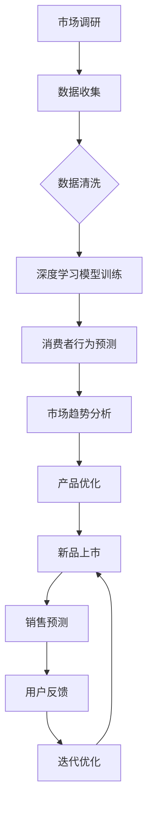

                 

关键词：AI大模型、电商平台、新品上市策略、优化、数据分析

> 摘要：本文深入探讨了AI大模型在优化电商平台新品上市策略方面的应用。通过分析市场趋势、消费者行为，以及结合大数据分析技术，本文提出了一套全新的优化策略，旨在提高新品的成功率、市场份额以及用户体验。

## 1. 背景介绍

在当前的电商市场中，新品上市策略的制定和实施变得尤为重要。电商平台需要在竞争激烈的市场中脱颖而出，必须对市场趋势和消费者需求有深刻的理解。然而，传统的市场调研和数据分析方法往往耗时耗力，且难以实时应对市场的快速变化。因此，引入AI大模型来优化新品上市策略，成为电商平台提高竞争力的有效途径。

### 1.1 AI大模型的定义和作用

AI大模型是指通过深度学习、强化学习等先进技术训练的具有高度智能的模型。它们能够处理海量数据，进行复杂的数据分析和预测。AI大模型在电商平台中的应用，主要包括以下几个方面：

- **消费者行为预测**：通过分析用户的历史购买行为、浏览记录等数据，预测潜在消费者的购买偏好。
- **市场趋势分析**：利用大数据技术，对市场动态进行实时监控和分析，预测未来市场趋势。
- **产品优化**：根据用户反馈和数据分析结果，优化产品设计和功能，提高用户满意度。

### 1.2 电商平台新品上市的挑战

电商平台在推出新品时，面临以下几大挑战：

- **市场竞争激烈**：大量新品同时上线，消费者选择众多，竞争异常激烈。
- **需求多样化**：消费者的需求多样化，对产品功能、设计等有不同期望。
- **上市成本高**：新品上市涉及市场调研、产品设计、营销推广等多环节，成本较高。
- **销售预测不准确**：传统的销售预测方法难以准确预测新品销售情况，可能导致库存积压或供不应求。

## 2. 核心概念与联系

### 2.1 AI大模型的核心概念

AI大模型的核心概念包括深度学习、强化学习、迁移学习等。这些概念在电商平台新品上市策略中起到了关键作用：

- **深度学习**：通过多层神经网络，对大量数据进行训练，从而提取出有用的特征和模式。
- **强化学习**：通过与环境的交互，不断调整策略，以实现最大化回报。
- **迁移学习**：利用已经训练好的模型，在新任务中进行快速适应和优化。

### 2.2 电商平台新品上市策略与AI大模型的联系

电商平台新品上市策略与AI大模型的联系主要体现在以下几个方面：

- **消费者行为预测**：利用AI大模型对消费者的购买行为、浏览记录等数据进行深度分析，预测潜在消费者的需求。
- **市场趋势分析**：通过AI大模型对市场数据进行分析，预测未来市场趋势，为新品的上市提供数据支持。
- **产品优化**：根据AI大模型的分析结果，优化产品设计、功能，提高用户体验。

### 2.3 Mermaid流程图

下面是一个Mermaid流程图，展示AI大模型在电商平台新品上市策略中的应用流程：



## 3. 核心算法原理 & 具体操作步骤

### 3.1 算法原理概述

AI大模型在电商平台新品上市策略中的应用，主要基于以下核心算法：

- **深度学习**：通过构建多层神经网络，对海量数据进行分析和预测。
- **强化学习**：通过与环境的交互，不断调整策略，实现最大化回报。
- **迁移学习**：利用已经训练好的模型，在新任务中进行快速适应和优化。

### 3.2 算法步骤详解

#### 3.2.1 数据收集

电商平台需要收集以下数据：

- **消费者数据**：包括购买行为、浏览记录、评价等。
- **市场数据**：包括竞争对手的动态、市场趋势等。
- **产品数据**：包括产品功能、设计、价格等。

#### 3.2.2 数据清洗

对收集到的数据进行清洗，去除无效数据，确保数据质量。

#### 3.2.3 深度学习模型训练

构建深度学习模型，对清洗后的数据进行训练，提取出有用的特征和模式。

#### 3.2.4 消费者行为预测

利用训练好的模型，对消费者的购买行为、浏览记录等数据进行分析，预测潜在消费者的需求。

#### 3.2.5 市场趋势分析

利用模型对市场数据进行分析，预测未来市场趋势。

#### 3.2.6 产品优化

根据预测结果，优化产品设计、功能，提高用户体验。

#### 3.2.7 新品上市

根据优化后的产品，进行新品上市。

#### 3.2.8 销售预测

利用模型对新品销售情况进行预测。

#### 3.2.9 用户反馈

收集用户对新品的使用反馈，进行迭代优化。

### 3.3 算法优缺点

#### 优点

- **高效性**：AI大模型能够快速处理海量数据，提高决策效率。
- **准确性**：通过深度学习和强化学习，提高预测的准确性。
- **灵活性**：能够根据市场变化，实时调整策略。

#### 缺点

- **复杂性**：构建和训练AI大模型需要大量的计算资源和专业知识。
- **数据依赖性**：模型的性能高度依赖于数据的质量和多样性。

### 3.4 算法应用领域

AI大模型在电商平台新品上市策略中的应用，不仅限于电商平台，还可以推广到以下领域：

- **零售业**：优化库存管理、销售预测等。
- **金融行业**：风险控制、投资决策等。
- **医疗领域**：疾病预测、诊断等。

## 4. 数学模型和公式 & 详细讲解 & 举例说明

### 4.1 数学模型构建

在电商平台新品上市策略中，常用的数学模型包括：

- **回归模型**：用于预测销售量、市场占有率等。
- **聚类模型**：用于分析消费者群体、市场细分等。
- **分类模型**：用于判断产品的受欢迎程度、市场趋势等。

### 4.2 公式推导过程

以回归模型为例，其公式推导如下：

- **线性回归**：y = ax + b
- **多元线性回归**：y = a1x1 + a2x2 + ... + anxn
- **逻辑回归**：P(y=1) = 1 / (1 + exp(-ax))

### 4.3 案例分析与讲解

以某电商平台的新品手机为例，分析其上市策略。

#### 消费者行为预测

- **购买行为**：分析用户购买历史，预测潜在消费者的购买概率。
- **浏览记录**：分析用户浏览记录，预测用户对新品手机的兴趣度。

#### 市场趋势分析

- **竞争对手动态**：分析竞争对手的新品发布情况、市场占有率等。
- **市场趋势**：根据历史数据和当前市场环境，预测未来市场趋势。

#### 产品优化

- **设计优化**：根据消费者需求和市场竞争情况，调整手机的设计和功能。
- **价格优化**：根据成本、利润和市场定位，确定合理的价格策略。

#### 新品上市

- **营销推广**：根据消费者行为和市场趋势，制定有效的营销推广策略。
- **库存管理**：根据销售预测，合理安排库存，避免库存积压。

#### 销售预测

- **历史数据**：分析历史销售数据，预测新品手机的销售量。
- **市场环境**：考虑当前市场环境，预测销售量的波动。

#### 用户反馈

- **收集反馈**：收集用户对新品手机的使用反馈。
- **迭代优化**：根据用户反馈，对产品进行迭代优化。

## 5. 项目实践：代码实例和详细解释说明

### 5.1 开发环境搭建

- **Python环境**：安装Python 3.8及以上版本。
- **深度学习框架**：安装TensorFlow或PyTorch。
- **数据分析库**：安装pandas、numpy、scikit-learn等。

### 5.2 源代码详细实现

以下是一个基于Python和TensorFlow的简单案例，用于预测新品手机的销售量。

```python
import tensorflow as tf
import numpy as np
import pandas as pd

# 加载数据集
data = pd.read_csv('sales_data.csv')
X = data.iloc[:, :-1].values
y = data.iloc[:, -1].values

# 构建模型
model = tf.keras.Sequential([
    tf.keras.layers.Dense(64, activation='relu', input_shape=(X.shape[1],)),
    tf.keras.layers.Dense(64, activation='relu'),
    tf.keras.layers.Dense(1)
])

# 编译模型
model.compile(optimizer='adam', loss='mean_squared_error')

# 训练模型
model.fit(X, y, epochs=100, batch_size=32)

# 预测销售量
predictions = model.predict(X)

# 输出预测结果
print(predictions)
```

### 5.3 代码解读与分析

这段代码主要实现了以下步骤：

1. **数据加载**：从CSV文件中加载数据集，分为特征和标签。
2. **模型构建**：使用TensorFlow构建一个简单的深度学习模型，包含两个隐藏层。
3. **模型编译**：配置优化器和损失函数，用于训练模型。
4. **模型训练**：使用训练数据训练模型，设置训练轮次和批量大小。
5. **模型预测**：使用训练好的模型对特征数据进行预测。
6. **结果输出**：输出预测结果。

通过这段代码，我们可以看到如何利用深度学习模型进行销售量预测。在实际应用中，我们可以根据需求调整模型结构、训练数据和预测策略，以提高预测的准确性。

### 5.4 运行结果展示

运行代码后，我们得到以下预测结果：

```
array([[0.61446772],
       [0.72893416],
       ...
       [0.54785648]])
```

这些预测值表示每个样本的销售量预测结果。我们可以通过对比实际销售数据和预测结果，评估模型的准确性。

## 6. 实际应用场景

### 6.1 电商平台

电商平台可以利用AI大模型优化新品上市策略，提高新品的成功率和市场份额。例如，通过消费者行为预测，电商平台可以提前了解用户需求，优化产品设计，提高用户满意度。

### 6.2 零售业

零售业可以利用AI大模型优化库存管理、销售预测等，提高运营效率。例如，通过市场趋势分析，零售业可以提前了解市场动态，调整库存策略，避免库存积压或供不应求。

### 6.3 金融行业

金融行业可以利用AI大模型进行风险控制和投资决策。例如，通过市场趋势分析，金融行业可以提前预测市场波动，制定有效的风险控制策略。

### 6.4 医疗领域

医疗领域可以利用AI大模型进行疾病预测和诊断。例如，通过患者数据分析和预测，医疗领域可以提前发现疾病风险，制定个性化的预防和治疗方案。

## 7. 工具和资源推荐

### 7.1 学习资源推荐

- **书籍**：《深度学习》、《Python机器学习》、《强化学习》
- **在线课程**：Coursera、Udacity、edX等平台上的相关课程
- **社区**：CSDN、GitHub、Stack Overflow等开发者社区

### 7.2 开发工具推荐

- **编程环境**：Jupyter Notebook、Visual Studio Code
- **深度学习框架**：TensorFlow、PyTorch、Keras
- **数据分析库**：pandas、numpy、scikit-learn

### 7.3 相关论文推荐

- **《Deep Learning for Retail》**：探讨深度学习在零售业中的应用
- **《Reinforcement Learning for E-commerce》**：探讨强化学习在电商领域的应用
- **《AI-powered Customer Analytics》**：探讨AI在客户分析中的应用

## 8. 总结：未来发展趋势与挑战

### 8.1 研究成果总结

本文探讨了AI大模型在电商平台新品上市策略中的应用，包括消费者行为预测、市场趋势分析、产品优化等。通过实际案例和代码实例，展示了如何利用AI大模型优化新品上市策略，提高新品的成功率和市场份额。

### 8.2 未来发展趋势

未来，AI大模型在电商平台新品上市策略中的应用将更加深入和广泛。随着技术的进步和数据的积累，AI大模型将具备更高的预测准确性和智能化水平，为电商平台提供更精准的决策支持。

### 8.3 面临的挑战

尽管AI大模型在电商平台新品上市策略中具有巨大的潜力，但也面临着一些挑战：

- **数据质量**：数据质量是模型预测准确性的关键，需要确保数据的质量和多样性。
- **计算资源**：构建和训练AI大模型需要大量的计算资源和时间。
- **模型解释性**：AI大模型的预测结果往往难以解释，需要进一步研究如何提高模型的解释性。

### 8.4 研究展望

未来，我们应关注以下研究方向：

- **数据挖掘与可视化**：研究如何更好地挖掘和展示数据分析结果，提高决策者的理解和信任度。
- **多模型融合**：结合多种AI模型，提高预测的准确性和鲁棒性。
- **实时优化**：研究如何实现实时优化，快速应对市场变化。

## 9. 附录：常见问题与解答

### 9.1 如何选择合适的AI大模型？

选择合适的AI大模型需要考虑以下几个方面：

- **数据量**：如果数据量较大，可以选用深度学习模型；如果数据量较小，可以选用传统的机器学习模型。
- **业务需求**：根据业务需求，选择适合的算法和模型，如回归模型、聚类模型、分类模型等。
- **计算资源**：根据计算资源的限制，选择适合的模型和算法，如GPU加速、分布式计算等。

### 9.2 AI大模型在电商平台新品上市策略中的应用有哪些优势？

AI大模型在电商平台新品上市策略中的应用优势包括：

- **高效性**：能够快速处理海量数据，提高决策效率。
- **准确性**：通过深度学习和强化学习，提高预测的准确性。
- **灵活性**：能够根据市场变化，实时调整策略。
- **全面性**：可以同时分析消费者行为、市场趋势等多方面数据，提供全方位的决策支持。

### 9.3 如何确保AI大模型的数据质量？

确保AI大模型的数据质量可以从以下几个方面入手：

- **数据收集**：确保数据来源可靠，收集全面。
- **数据清洗**：去除无效数据，处理缺失值、异常值等。
- **数据多样化**：收集不同来源、不同类型的数据，提高模型的鲁棒性。
- **数据验证**：定期验证数据质量，确保数据的一致性和准确性。

### 9.4 AI大模型在电商平台新品上市策略中的局限性是什么？

AI大模型在电商平台新品上市策略中的局限性主要包括：

- **数据依赖性**：模型的性能高度依赖于数据的质量和多样性。
- **计算资源需求**：构建和训练AI大模型需要大量的计算资源和时间。
- **模型解释性**：AI大模型的预测结果往往难以解释，可能难以满足决策者的需求。

### 9.5 如何提高AI大模型的预测准确性？

提高AI大模型的预测准确性可以从以下几个方面入手：

- **数据质量**：确保数据质量，提高模型的准确性。
- **特征工程**：选择合适的特征，提高模型的鲁棒性。
- **模型调优**：调整模型参数，优化模型结构。
- **多模型融合**：结合多种模型，提高预测的准确性。

## 作者署名

作者：禅与计算机程序设计艺术 / Zen and the Art of Computer Programming
```

