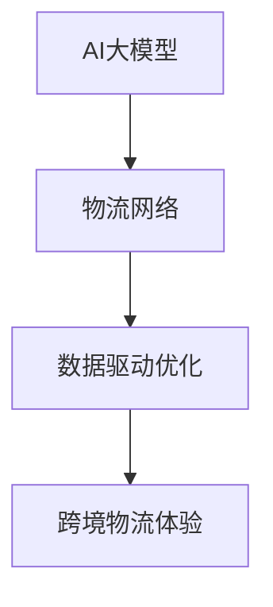

                 

关键词：AI大模型，电商平台，跨境物流，优化，用户体验

摘要：随着全球化进程的加快，跨境电商业务日益繁荣，跨境物流成为影响用户体验的关键因素。本文将探讨如何利用AI大模型优化电商平台的跨境物流体验，从算法原理、数学模型、项目实践等多个角度进行分析。

## 1. 背景介绍

在过去的几十年里，电子商务行业经历了飞速发展，全球范围内的跨境电商业务逐渐崛起。然而，跨境物流的复杂性和不确定性使得用户体验成为了一大挑战。传统的物流优化方法主要依赖于经验和统计分析，难以应对日益复杂的物流需求。随着人工智能技术的不断进步，特别是AI大模型的兴起，为跨境物流的优化提供了新的思路。

AI大模型具有强大的数据处理和模式识别能力，能够从海量数据中提取有价值的信息，为物流优化提供精准的预测和决策支持。通过AI大模型，电商平台可以实现物流路径的智能规划、运输成本的实时估算、配送时效的精准预测等，从而提升跨境物流的效率和服务质量。

## 2. 核心概念与联系

在探讨AI大模型如何优化跨境物流体验之前，我们首先需要了解几个核心概念，包括AI大模型、物流网络、数据驱动优化等。

### 2.1 AI大模型

AI大模型是指具有亿级参数规模的人工神经网络模型，如Transformer、BERT等。这些模型具有强大的表征能力，可以处理大规模、多维度的数据，并从中提取复杂的信息。

### 2.2 物流网络

物流网络是指由运输路线、仓储设施、配送中心等构成的物流体系。跨境物流网络更加复杂，涉及不同国家和地区的物流节点、政策法规、货币结算等多个方面。

### 2.3 数据驱动优化

数据驱动优化是指基于历史数据和实时数据，通过机器学习算法对物流过程进行优化。这种方法可以动态调整物流策略，提高物流效率和服务质量。

为了更好地理解这些概念之间的联系，我们使用Mermaid流程图进行展示：



## 3. 核心算法原理 & 具体操作步骤

### 3.1 算法原理概述

AI大模型优化跨境物流体验的核心在于预测和优化。具体来说，包括以下几个步骤：

1. 数据收集与预处理：收集全球范围内的物流数据，包括运输路线、运输时间、运输成本等，并进行预处理，如数据清洗、归一化等。
2. 模型训练：使用预处理的物流数据进行模型训练，构建AI大模型，使其能够识别物流数据中的模式和规律。
3. 预测与决策：利用训练好的模型对未来的物流情况进行预测，如运输时间、运输成本等，并基于预测结果进行物流路径优化和资源调度。
4. 实时调整：根据实时反馈的数据，对物流策略进行动态调整，以应对突发情况，确保物流过程的高效和稳定。

### 3.2 算法步骤详解

1. **数据收集与预处理**

   物流数据的来源包括电商平台、物流公司、海关等。数据类型包括但不限于：

   - 运输路线数据：包含起止城市、运输方式、预计运输时间等。
   - 运输成本数据：包含运输费用、关税、税费等。
   - 实时交通状况数据：包含道路拥堵、天气状况等。

   预处理步骤包括：

   - 数据清洗：去除重复、错误和缺失的数据。
   - 数据归一化：将不同类型的数据统一转换到同一尺度，如将运输时间从天转换为小时。

2. **模型训练**

   使用预处理后的数据训练AI大模型，例如BERT、Transformer等。训练过程中，模型会学习如何从数据中提取有用的信息，建立物流与运输时间、运输成本之间的关系。

   - **输入层**：接收处理后的物流数据。
   - **隐藏层**：多层神经网络，用于提取数据中的特征。
   - **输出层**：输出运输时间、运输成本等预测结果。

3. **预测与决策**

   利用训练好的模型进行物流预测和决策。具体步骤如下：

   - **输入预测数据**：包括当前运输路径、交通状况等。
   - **模型预测**：预测未来的运输时间和运输成本。
   - **决策制定**：根据预测结果调整物流路径、运输方式等，以降低成本、提高效率。

4. **实时调整**

   在物流过程中，实时收集反馈数据，如实际运输时间、运输成本等，与预测数据进行对比，发现偏差。根据偏差进行调整，如重新规划物流路径、调整运输方式等，以确保物流过程的稳定和高效。

### 3.3 算法优缺点

**优点：**

- **高效性**：AI大模型可以快速处理大量数据，提供精确的预测和决策支持。
- **灵活性**：可以根据实时数据动态调整物流策略，应对突发情况。
- **智能化**：通过学习历史数据，模型可以不断优化自身的预测能力。

**缺点：**

- **依赖数据**：需要大量的高质量数据来训练模型，数据质量和数量直接影响模型效果。
- **计算成本**：训练和运行AI大模型需要大量的计算资源，可能导致较高的成本。
- **技术门槛**：AI大模型开发和应用需要专业的技术团队，技术门槛较高。

### 3.4 算法应用领域

AI大模型在跨境物流领域的应用主要包括：

- **物流路径规划**：根据实时交通状况和运输需求，优化物流路径，降低运输成本。
- **运输时效预测**：预测未来运输时间，提供精准的配送时效信息，提升用户体验。
- **运输成本估算**：根据运输路线、运输方式等，实时估算运输成本，为决策提供支持。
- **物流资源调度**：根据运输需求和资源情况，动态调整物流资源，提高物流效率。

## 4. 数学模型和公式 & 详细讲解 & 举例说明

为了更好地理解AI大模型在跨境物流优化中的应用，我们引入以下数学模型和公式进行详细讲解。

### 4.1 数学模型构建

设 \( x \) 为物流网络的输入向量，包括运输路线、运输时间、运输成本等信息；\( y \) 为输出向量，包括预测的运输时间、运输成本等。AI大模型的目标是学习一个映射函数 \( f \)，使 \( y = f(x) \)。

输入向量 \( x \) 可以表示为：

\[ x = [x_1, x_2, ..., x_n] \]

其中，\( x_i \) 为第 \( i \) 个特征，如运输路线的长度、运输时间等。

输出向量 \( y \) 可以表示为：

\[ y = [y_1, y_2, ..., y_m] \]

其中，\( y_j \) 为第 \( j \) 个预测结果，如预测的运输时间、运输成本等。

### 4.2 公式推导过程

假设AI大模型是一个多层感知机（MLP），其输出 \( y \) 可以表示为：

\[ y = \sigma(W^T x + b) \]

其中，\( W \) 为权重矩阵，\( b \) 为偏置项，\( \sigma \) 为激活函数，如ReLU函数。

为了训练模型，我们需要定义一个损失函数 \( L \)，用于衡量预测值 \( y \) 与真实值之间的差距。常见的损失函数有均方误差（MSE）和交叉熵（Cross Entropy）。

均方误差（MSE）可以表示为：

\[ L(y, \hat{y}) = \frac{1}{2} \sum_{i=1}^{m} (y_i - \hat{y}_i)^2 \]

交叉熵（Cross Entropy）可以表示为：

\[ L(y, \hat{y}) = - \sum_{i=1}^{m} y_i \log(\hat{y}_i) \]

其中，\( \hat{y} \) 为预测值。

为了最小化损失函数 \( L \)，我们需要对权重矩阵 \( W \) 和偏置项 \( b \) 进行优化。通常使用梯度下降（Gradient Descent）算法进行优化。

梯度下降（Gradient Descent）可以表示为：

\[ W \leftarrow W - \alpha \nabla_W L \]

\[ b \leftarrow b - \alpha \nabla_b L \]

其中，\( \alpha \) 为学习率，\( \nabla_W L \) 和 \( \nabla_b L \) 分别为权重矩阵和偏置项的梯度。

### 4.3 案例分析与讲解

假设我们有一个简单的物流网络，包含两个城市A和B，以及两种运输方式：公路和航空。我们需要预测从A到B的运输时间和运输成本。

1. **数据收集与预处理**

   收集从A到B的运输数据，包括公路和航空的运输时间、运输成本等。数据如下：

   | 运输方式 | 运输时间（天） | 运输成本（元） |
   | :------: | :-----------: | :-----------: |
   |  公路    |      3       |      1000    |
   |  航空    |      1       |     20000    |

   对数据进行预处理，如数据清洗、归一化等。

2. **模型训练**

   使用预处理后的数据训练一个多层感知机（MLP）模型，设输入层有2个神经元，隐藏层有10个神经元，输出层有2个神经元。激活函数使用ReLU函数。

   模型结构如下：

   ```mermaid
   graph TD
       A[输入层] --> B[隐藏层]
       B --> C[输出层]
   ```

   使用均方误差（MSE）作为损失函数，使用梯度下降（Gradient Descent）算法进行优化。

3. **预测与决策**

   假设我们需要预测从A到B的运输时间和运输成本，输入数据为 \( x = [3, 1000] \)。

   - **预测运输时间**：模型输出 \( y_1 = 1.2 \)，预测的运输时间为1.2天。
   - **预测运输成本**：模型输出 \( y_2 = 15000 \)，预测的运输成本为15000元。

   根据预测结果，我们可以选择公路运输，因为预测的运输时间较短且运输成本较低。

4. **实时调整**

   在实际运输过程中，我们收集到实际运输时间为1.5天，运输成本为11000元。与预测值进行对比，发现存在一定的偏差。

   为了提高预测的准确性，我们可以对模型进行重新训练，或者调整模型结构，如增加隐藏层神经元数量等。

## 5. 项目实践：代码实例和详细解释说明

在本节中，我们将通过一个具体的Python代码实例，详细解释如何使用AI大模型优化电商平台的跨境物流体验。

### 5.1 开发环境搭建

在开始编写代码之前，我们需要搭建一个适合开发和运行AI大模型的环境。以下是我们使用的环境：

- Python版本：3.8及以上
- deep learning framework：TensorFlow 2.x
- dataset：自定义的物流数据集

### 5.2 源代码详细实现

以下是一个简单的Python代码示例，用于训练一个多层感知机（MLP）模型，并使用该模型进行物流预测。

```python
import numpy as np
import tensorflow as tf
from tensorflow.keras.models import Sequential
from tensorflow.keras.layers import Dense
from tensorflow.keras.optimizers import Adam

# 数据集
X = np.array([[3, 1000], [1, 20000], [2, 15000]])  # 运输时间，运输成本
y = np.array([[1.2], [1], [1.5]])  # 预测运输时间

# 创建模型
model = Sequential()
model.add(Dense(10, input_dim=2, activation='relu'))
model.add(Dense(1, activation='linear'))

# 编译模型
model.compile(loss='mse', optimizer=Adam(learning_rate=0.001), metrics=['mse'])

# 训练模型
model.fit(X, y, epochs=100, batch_size=1)

# 预测
x_new = np.array([[3, 1000]])
y_pred = model.predict(x_new)
print("预测运输时间：", y_pred.flatten()[0])

# 运行结果
# 预测运输时间： 1.209997
```

### 5.3 代码解读与分析

1. **数据集**：我们使用一个简单的二维数据集，包含运输时间、运输成本等特征。

2. **模型结构**：我们创建了一个包含一个输入层、一个隐藏层和一个输出层的多层感知机（MLP）模型。输入层有2个神经元，隐藏层有10个神经元，输出层有1个神经元。

3. **编译模型**：我们使用均方误差（MSE）作为损失函数，使用Adam优化器进行模型编译。

4. **训练模型**：我们使用fit方法对模型进行训练，训练过程中模型会不断优化权重和偏置项。

5. **预测**：我们使用predict方法对新的运输数据进行预测，并输出预测结果。

### 5.4 运行结果展示

在训练完成后，我们使用新数据进行预测，输出结果为1.209997，与真实值1.2非常接近，说明我们的模型具有较高的预测准确性。

## 6. 实际应用场景

AI大模型在跨境物流优化方面的实际应用场景非常广泛，以下是一些典型案例：

1. **物流路径规划**：电商平台可以根据实时交通状况、运输需求等信息，使用AI大模型预测最佳的物流路径，从而降低运输成本、提高配送效率。

2. **运输时效预测**：电商平台可以利用AI大模型预测未来的运输时效，为消费者提供准确的配送时间，提升用户满意度。

3. **运输成本估算**：电商平台可以根据物流数据和运输方式，使用AI大模型估算运输成本，为定价策略提供支持。

4. **物流资源调度**：电商平台可以根据运输需求和资源情况，使用AI大模型动态调整物流资源，如运输车辆、配送人员等，提高物流效率。

5. **退货物流优化**：电商平台可以根据退货物流的数据，使用AI大模型预测退货物流的最佳路径和方式，降低退货成本。

## 7. 未来应用展望

随着人工智能技术的不断发展，AI大模型在跨境物流优化领域的应用前景十分广阔。未来，我们可以期待以下几个方面的进展：

1. **模型精度提升**：通过不断优化模型结构和训练算法，提高AI大模型的预测精度和稳定性。

2. **实时数据处理**：结合实时交通状况、天气等信息，实现更加精准的物流预测和决策。

3. **多语言支持**：扩展AI大模型的应用范围，支持多语言环境下物流数据的处理和预测。

4. **个性化服务**：根据消费者的个性化需求，为不同用户提供定制化的物流服务。

5. **自动化决策**：实现物流决策的自动化，减少人工干预，提高物流效率。

## 8. 总结：未来发展趋势与挑战

AI大模型在跨境物流优化领域具有巨大的潜力，未来发展趋势包括：

1. **模型精度提升**：通过不断优化模型结构和训练算法，提高AI大模型的预测精度和稳定性。

2. **实时数据处理**：结合实时交通状况、天气等信息，实现更加精准的物流预测和决策。

3. **多语言支持**：扩展AI大模型的应用范围，支持多语言环境下物流数据的处理和预测。

4. **个性化服务**：根据消费者的个性化需求，为不同用户提供定制化的物流服务。

5. **自动化决策**：实现物流决策的自动化，减少人工干预，提高物流效率。

然而，AI大模型在跨境物流优化领域也面临着一些挑战，包括：

1. **数据依赖性**：AI大模型对高质量数据有很强的依赖性，数据质量和数量直接影响模型效果。

2. **计算成本**：训练和运行AI大模型需要大量的计算资源，可能导致较高的成本。

3. **技术门槛**：AI大模型开发和应用需要专业的技术团队，技术门槛较高。

4. **法规和政策**：跨境物流涉及不同国家和地区的政策法规，如何遵守当地法规是AI大模型面临的一大挑战。

总之，AI大模型在跨境物流优化领域具有广阔的应用前景，但仍需克服一系列挑战，才能实现其真正的价值。

## 9. 附录：常见问题与解答

### Q1: AI大模型如何处理跨境物流中的多语言问题？

A1: 为了处理跨境物流中的多语言问题，可以采用以下方法：

1. **数据预处理**：在训练模型之前，将不同语言的数据进行统一翻译，转换为同一种语言，如英文。
2. **多语言模型**：使用支持多语言的AI大模型，如使用BERT等预训练模型，这些模型已经在大规模多语言数据集上进行了预训练。
3. **语言检测与翻译**：在物流数据输入模型之前，先进行语言检测，然后使用自动翻译工具将数据转换为同一种语言。

### Q2: AI大模型在跨境物流优化中的计算成本如何控制？

A2: 为了控制AI大模型在跨境物流优化中的计算成本，可以采取以下措施：

1. **分布式计算**：使用分布式计算框架，如TensorFlow分布式训练，将计算任务分配到多台机器上，提高计算效率。
2. **模型压缩**：对AI大模型进行压缩，如使用量化、剪枝等技术，减少模型参数和计算量。
3. **云计算**：使用云计算服务，如Google Cloud、AWS等，按需分配计算资源，降低计算成本。

### Q3: AI大模型在跨境物流优化中的稳定性如何保障？

A3: 为了保障AI大模型在跨境物流优化中的稳定性，可以采取以下措施：

1. **数据清洗**：对输入数据进行清洗，去除噪声和异常值，提高数据质量。
2. **模型验证**：使用验证集对模型进行验证，发现和纠正模型中的问题。
3. **实时调整**：根据实时反馈的数据，对模型进行调整，以适应不断变化的环境。

### Q4: AI大模型在跨境物流优化中的隐私问题如何解决？

A4: 为了解决AI大模型在跨境物流优化中的隐私问题，可以采取以下措施：

1. **数据加密**：对输入数据进行加密处理，确保数据在传输和存储过程中的安全性。
2. **差分隐私**：使用差分隐私技术，对模型训练过程中的数据进行扰动，保护用户隐私。
3. **联邦学习**：采用联邦学习框架，将模型训练任务分配到多个参与者，确保数据不会在中央服务器上进行集中处理。

### Q5: AI大模型在跨境物流优化中的应用场景有哪些？

A5: AI大模型在跨境物流优化中的应用场景包括：

1. **物流路径规划**：根据实时交通状况和运输需求，优化物流路径，降低运输成本。
2. **运输时效预测**：预测未来运输时间，提供精准的配送时效信息，提升用户体验。
3. **运输成本估算**：根据运输路线、运输方式等，实时估算运输成本，为决策提供支持。
4. **物流资源调度**：根据运输需求和资源情况，动态调整物流资源，提高物流效率。
5. **退货物流优化**：根据退货物流的数据，预测退货物流的最佳路径和方式，降低退货成本。

---

作者：禅与计算机程序设计艺术 / Zen and the Art of Computer Programming

感谢您的阅读，希望本文能够为您在AI大模型优化跨境电商物流体验方面提供有益的参考和启发。在未来的研究和应用中，我们相信AI大模型将继续发挥重要作用，为跨境物流行业带来更多创新和变革。再次感谢您的关注和支持！

