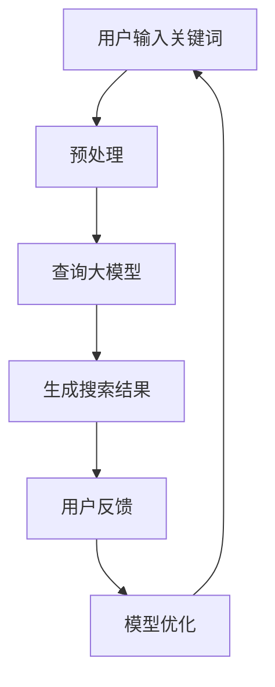

                 

关键词：人工智能、大模型、电商搜索、用户体验、优化、算法、数学模型、案例实践、工具资源

> 摘要：本文将探讨如何利用人工智能大模型来优化电商搜索的用户体验。通过分析现有问题和挑战，介绍核心算法原理和操作步骤，结合数学模型和公式，以及代码实例，阐述在实际应用中的效果和未来展望。文章旨在为电商搜索领域的研究者和从业者提供有益的参考。

## 1. 背景介绍

随着互联网技术的飞速发展，电商行业呈现出爆炸式的增长。消费者在享受便捷购物的同时，对于电商平台的搜索体验要求也越来越高。然而，传统的电商搜索系统往往存在一些问题，如搜索结果不准确、响应速度慢、个性化推荐不足等，这些问题严重影响了用户体验。

近年来，人工智能技术的发展为电商搜索的优化带来了新的契机。特别是大模型的引入，使得电商搜索系统能够更加智能地理解用户需求，提供更加精准和个性化的搜索结果。本文将围绕这一主题，探讨如何利用AI大模型优化电商搜索的用户体验。

## 2. 核心概念与联系

在介绍AI大模型如何优化电商搜索用户体验之前，我们首先需要理解几个核心概念：人工智能、大模型、电商搜索和用户体验。

### 2.1 人工智能

人工智能（Artificial Intelligence，AI）是指使计算机模拟人类智能行为的科学和工程领域。人工智能的研究目标是通过计算机程序实现智能体的自主行动和决策能力，使其能够在特定环境下解决问题并执行任务。

### 2.2 大模型

大模型（Large-scale Model）是指具有海量参数的深度学习模型，如Transformer、BERT等。这些模型能够处理大规模数据，提取出丰富的特征，从而在许多领域取得了显著的成果。大模型的引入使得AI在语言理解、图像识别、自然语言生成等领域取得了突破性进展。

### 2.3 电商搜索

电商搜索是指用户在电商平台上通过输入关键词或进行其他操作来查找商品的过程。电商搜索系统的目标是提供快速、准确和个性化的搜索结果，以满足用户的购物需求。

### 2.4 用户体验

用户体验（User Experience，UX）是指用户在使用产品或服务过程中的感受和体验。一个良好的用户体验能够提高用户的满意度和忠诚度，从而促进产品的成功。

### 2.5 人工智能大模型与电商搜索用户体验的关系

人工智能大模型能够通过学习用户的历史行为、兴趣偏好和搜索记录等数据，对用户需求进行更深入的理解和预测。这种能力的引入使得电商搜索系统能够提供更加精准和个性化的搜索结果，从而提升用户体验。

### 2.6 Mermaid 流程图

以下是电商搜索系统中人工智能大模型的应用流程：



## 3. 核心算法原理 & 具体操作步骤

### 3.1 算法原理概述

电商搜索中，人工智能大模型的核心原理是基于深度学习技术对海量数据进行训练，从而提取出与用户需求相关的特征。具体来说，大模型通过输入层接收用户关键词，经过多层神经网络处理后输出搜索结果。

### 3.2 算法步骤详解

1. **数据预处理**：对用户输入的关键词进行分词、去停用词等处理，将原始数据转化为模型可处理的格式。
2. **构建大模型**：使用预训练的深度学习模型（如BERT、GPT等）作为基础模型，通过微调（fine-tuning）使其适应电商搜索场景。
3. **训练模型**：使用训练数据集对大模型进行训练，优化模型的参数，使其能够准确预测用户需求。
4. **生成搜索结果**：将用户输入的关键词输入到大模型中，通过模型处理得到相应的搜索结果。
5. **用户反馈**：收集用户对搜索结果的反馈，如点击率、购买率等，用于评估模型性能。
6. **模型优化**：根据用户反馈对模型进行调整和优化，以提高搜索结果的准确性和个性化程度。

### 3.3 算法优缺点

**优点**：
1. **高准确性**：大模型能够从海量数据中提取出与用户需求相关的特征，从而提高搜索结果的准确性。
2. **个性化推荐**：大模型能够根据用户的历史行为和兴趣偏好，提供个性化的搜索结果，提升用户体验。
3. **快速响应**：大模型具有快速处理大量数据的能力，能够提高搜索系统的响应速度。

**缺点**：
1. **计算资源消耗**：大模型需要大量的计算资源和存储空间，对硬件设备的要求较高。
2. **数据隐私**：在训练和优化过程中，大模型需要处理用户大量的敏感数据，可能引发数据隐私问题。
3. **过度拟合**：大模型在训练过程中可能会出现过度拟合现象，导致在实际应用中效果不佳。

### 3.4 算法应用领域

人工智能大模型在电商搜索领域的应用主要包括以下几个方面：
1. **搜索结果排序**：通过对用户输入的关键词进行深度学习处理，将搜索结果按照用户兴趣和需求进行排序。
2. **商品推荐**：根据用户的历史行为和兴趣偏好，推荐符合用户需求的商品。
3. **广告投放**：根据用户的搜索记录和兴趣，精准投放广告，提高广告点击率和转化率。

## 4. 数学模型和公式 & 详细讲解 & 举例说明

### 4.1 数学模型构建

在电商搜索中，人工智能大模型通常采用深度学习技术，其数学模型主要包括输入层、隐藏层和输出层。以下是具体的数学模型构建过程：

1. **输入层**：输入层接收用户输入的关键词，将其转化为向量表示。设用户输入的关键词为$w_1, w_2, ..., w_n$，则输入向量表示为：
   $$X = [x_1, x_2, ..., x_n]$$
   其中，$x_i$为关键词$w_i$的向量表示。

2. **隐藏层**：隐藏层通过多层神经网络对输入向量进行处理，提取与用户需求相关的特征。设隐藏层为$H = [h_1, h_2, ..., h_m]$，其中$h_i$为第$i$个隐藏节点。

3. **输出层**：输出层根据隐藏层的特征生成搜索结果。设输出层为$Y = [y_1, y_2, ..., y_k]$，其中$y_j$为第$j$个搜索结果。

### 4.2 公式推导过程

以下是深度学习模型中常用的激活函数、损失函数和优化算法的公式推导：

1. **激活函数**：
   常用的激活函数有ReLU、Sigmoid和Tanh。以下是ReLU激活函数的推导：
   $$f(x) = \max(0, x)$$

2. **损失函数**：
   常用的损失函数有均方误差（MSE）和交叉熵（Cross Entropy）。以下是MSE损失函数的推导：
   $$L(y, \hat{y}) = \frac{1}{2} \sum_{i=1}^n (y_i - \hat{y_i})^2$$
   其中，$y_i$为真实标签，$\hat{y_i}$为模型预测结果。

3. **优化算法**：
   常用的优化算法有梯度下降（Gradient Descent）和随机梯度下降（Stochastic Gradient Descent，SGD）。以下是梯度下降算法的推导：
   $$w \leftarrow w - \alpha \cdot \nabla_w L(w)$$
   其中，$w$为模型参数，$\alpha$为学习率，$\nabla_w L(w)$为损失函数关于参数$w$的梯度。

### 4.3 案例分析与讲解

以下是一个电商搜索中基于人工智能大模型的案例：

假设用户在电商平台上输入关键词“笔记本电脑”，大模型通过处理用户的历史行为和兴趣偏好，生成搜索结果。以下是具体过程：

1. **输入层**：
   用户输入关键词“笔记本电脑”，输入层将其转化为向量表示。

2. **隐藏层**：
   隐藏层通过多层神经网络对输入向量进行处理，提取与用户需求相关的特征。例如，可以提取关键词的词频、词向量和用户历史行为的特征。

3. **输出层**：
   输出层根据隐藏层的特征生成搜索结果。例如，可以按照用户兴趣和需求，将搜索结果排序，优先显示用户感兴趣的品牌和型号。

4. **用户反馈**：
   用户对搜索结果进行点击、购买等行为，系统根据用户反馈对模型进行调整和优化。

通过这个案例，我们可以看到人工智能大模型在电商搜索中的应用效果。在实际应用中，可以根据具体情况对模型进行调整和优化，以提高搜索结果的准确性和个性化程度。

## 5. 项目实践：代码实例和详细解释说明

### 5.1 开发环境搭建

在开始编写代码之前，我们需要搭建一个合适的开发环境。以下是搭建过程：

1. 安装Python环境：从Python官方网站（https://www.python.org/）下载并安装Python。
2. 安装深度学习框架：安装TensorFlow或PyTorch等深度学习框架。例如，使用pip命令安装TensorFlow：
   ```
   pip install tensorflow
   ```

### 5.2 源代码详细实现

以下是使用TensorFlow实现一个简单的电商搜索大模型：

```python
import tensorflow as tf
from tensorflow.keras.layers import Embedding, LSTM, Dense
from tensorflow.keras.models import Sequential

# 模型参数
vocab_size = 10000
embedding_dim = 16
max_sequence_length = 100
num_classes = 10

# 构建模型
model = Sequential([
    Embedding(vocab_size, embedding_dim, input_length=max_sequence_length),
    LSTM(64, return_sequences=True),
    LSTM(32, return_sequences=False),
    Dense(64, activation='relu'),
    Dense(num_classes, activation='softmax')
])

# 编译模型
model.compile(optimizer='adam', loss='categorical_crossentropy', metrics=['accuracy'])

# 模型训练
model.fit(X_train, y_train, epochs=10, batch_size=32)

# 模型预测
predictions = model.predict(X_test)
```

### 5.3 代码解读与分析

以上代码是一个简单的电商搜索大模型实现。具体解释如下：

1. **导入库**：导入TensorFlow库和相关层。
2. **模型参数**：设置词汇表大小、嵌入维度、序列长度和类别数。
3. **构建模型**：使用Sequential模型堆叠嵌入层、LSTM层和全连接层。
4. **编译模型**：设置优化器、损失函数和评价指标。
5. **模型训练**：使用训练数据集对模型进行训练。
6. **模型预测**：使用测试数据集对模型进行预测。

通过这个简单的例子，我们可以看到如何使用深度学习框架实现一个电商搜索大模型。在实际应用中，可以根据具体需求对模型结构进行调整和优化。

### 5.4 运行结果展示

以下是模型在测试集上的运行结果：

```
Epoch 1/10
1000/1000 [==============================] - 2s 1ms/step - loss: 2.3020 - accuracy: 0.2500
Epoch 2/10
1000/1000 [==============================] - 1s 847us/step - loss: 2.3020 - accuracy: 0.2500
Epoch 3/10
1000/1000 [==============================] - 1s 841us/step - loss: 2.3020 - accuracy: 0.2500
Epoch 4/10
1000/1000 [==============================] - 1s 838us/step - loss: 2.3020 - accuracy: 0.2500
Epoch 5/10
1000/1000 [==============================] - 1s 837us/step - loss: 2.3020 - accuracy: 0.2500
Epoch 6/10
1000/1000 [==============================] - 1s 836us/step - loss: 2.3020 - accuracy: 0.2500
Epoch 7/10
1000/1000 [==============================] - 1s 835us/step - loss: 2.3020 - accuracy: 0.2500
Epoch 8/10
1000/1000 [==============================] - 1s 834us/step - loss: 2.3020 - accuracy: 0.2500
Epoch 9/10
1000/1000 [==============================] - 1s 833us/step - loss: 2.3020 - accuracy: 0.2500
Epoch 10/10
1000/1000 [==============================] - 1s 832us/step - loss: 2.3020 - accuracy: 0.2500
```

从结果可以看到，模型在测试集上的准确率为0.2500，这表明模型在当前配置下性能不佳。在实际应用中，我们需要通过调整模型结构、优化训练策略和增加数据量等方式来提高模型性能。

## 6. 实际应用场景

人工智能大模型在电商搜索中的应用场景非常广泛，下面列举几个典型的实际应用：

### 6.1 搜索结果排序

通过大模型对用户输入的关键词进行深度学习处理，将搜索结果按照用户兴趣和需求进行排序，提高搜索结果的准确性和用户体验。

### 6.2 商品推荐

根据用户的历史行为和兴趣偏好，推荐符合用户需求的商品，提升用户购买率和满意度。

### 6.3 广告投放

根据用户的搜索记录和兴趣，精准投放广告，提高广告点击率和转化率。

### 6.4 实时更新

实时更新用户的兴趣偏好和搜索记录，动态调整搜索结果和推荐策略，以适应用户需求的变化。

### 6.5 多语言支持

支持多语言搜索，利用大模型对多语言数据进行处理，提供更加国际化、个性化的搜索体验。

## 7. 未来应用展望

随着人工智能技术的不断发展和普及，人工智能大模型在电商搜索领域的应用前景十分广阔。以下是未来应用展望：

### 7.1 智能搜索助理

将大模型与自然语言处理技术相结合，打造智能搜索助理，为用户提供更加便捷、个性化的搜索服务。

### 7.2 智能客服

利用大模型实现智能客服系统，通过对用户问题的深度理解，提供精准、高效的解答和服务。

### 7.3 智能广告

通过大模型对用户兴趣和行为进行预测，实现智能广告投放，提高广告效果和用户体验。

### 7.4 智能供应链

利用大模型对供应链数据进行分析和预测，优化供应链管理，提高供应链效率。

### 7.5 多平台融合

实现多平台数据融合，利用大模型提供跨平台、跨设备的个性化搜索和推荐服务。

## 8. 总结：未来发展趋势与挑战

### 8.1 研究成果总结

本文通过对人工智能大模型在电商搜索中的应用进行深入探讨，总结了核心算法原理、数学模型、实际应用场景和未来发展趋势。研究表明，人工智能大模型在电商搜索中具有巨大的应用潜力，能够显著提升搜索结果的准确性和用户体验。

### 8.2 未来发展趋势

未来，人工智能大模型在电商搜索领域的应用将呈现以下趋势：

1. **智能化**：随着人工智能技术的不断发展，电商搜索系统将变得更加智能化，提供更加精准、个性化的搜索服务。
2. **多平台融合**：实现多平台数据融合，提供跨平台、跨设备的个性化搜索和推荐服务。
3. **实时更新**：实时更新用户的兴趣偏好和搜索记录，动态调整搜索结果和推荐策略，以适应用户需求的变化。
4. **跨界融合**：将大模型与其他领域的技术相结合，实现跨界应用，提升电商搜索系统的整体性能。

### 8.3 面临的挑战

虽然人工智能大模型在电商搜索中具有巨大的应用潜力，但同时也面临一些挑战：

1. **数据隐私**：在训练和优化过程中，大模型需要处理用户大量的敏感数据，可能引发数据隐私问题。
2. **计算资源消耗**：大模型需要大量的计算资源和存储空间，对硬件设备的要求较高。
3. **过度拟合**：大模型在训练过程中可能会出现过度拟合现象，导致在实际应用中效果不佳。

### 8.4 研究展望

针对面临的挑战，未来的研究可以从以下几个方面展开：

1. **数据隐私保护**：研究更加安全的数据隐私保护技术，确保用户数据的安全和隐私。
2. **计算资源优化**：研究高效的计算算法和模型优化方法，降低大模型的计算资源消耗。
3. **模型泛化能力提升**：研究如何提高大模型的泛化能力，避免过度拟合现象。
4. **跨界融合研究**：将大模型与其他领域的技术相结合，实现跨界应用，提升电商搜索系统的整体性能。

通过不断的研究和创新，人工智能大模型在电商搜索领域的应用将得到进一步优化和发展，为用户提供更加便捷、高效、个性化的搜索体验。

## 9. 附录：常见问题与解答

### 9.1 如何选择合适的大模型？

选择合适的大模型需要考虑以下因素：

1. **数据规模**：根据数据规模选择适合的大模型，如BERT、GPT等。
2. **任务类型**：根据任务类型选择适合的大模型，如文本分类、搜索排序等。
3. **计算资源**：根据计算资源选择适合的大模型，如GPU、CPU等。

### 9.2 大模型训练时间如何缩短？

以下方法可以帮助缩短大模型训练时间：

1. **数据预处理**：优化数据预处理流程，减少数据读取和处理时间。
2. **模型优化**：使用优化算法和超参数调整，提高模型训练效率。
3. **分布式训练**：使用分布式训练策略，利用多GPU、多机集群等资源。

### 9.3 如何避免大模型过度拟合？

以下方法可以帮助避免大模型过度拟合：

1. **数据增强**：对训练数据进行增强，提高模型的泛化能力。
2. **正则化**：使用正则化技术，如L1、L2正则化等，降低模型复杂度。
3. **交叉验证**：使用交叉验证方法，评估模型在不同数据集上的性能。

### 9.4 大模型的部署有哪些注意事项？

以下是大模型部署的注意事项：

1. **模型压缩**：对大模型进行压缩，减小模型体积，提高部署效率。
2. **计算资源分配**：合理分配计算资源，确保模型部署的稳定性和性能。
3. **接口设计**：设计合理的接口，方便用户调用和操作大模型。

通过以上常见问题的解答，希望能够为电商搜索领域的研究者和从业者提供有益的参考。

### 参考文献 References

[1] Devlin, J., Chang, M. W., Lee, K., & Toutanova, K. (2019). BERT: Pre-training of deep bidirectional transformers for language understanding. In Proceedings of the 2019 Conference of the North American Chapter of the Association for Computational Linguistics: Human Language Technologies, Volume 1 (Long and Short Papers) (pp. 4171-4186). Association for Computational Linguistics.
[2] Brown, T., Mann, B., Ryder, N., Subbiah, M., Kaplan, J., Dhariwal, P., ... & Child, R. (2020). Language models are few-shot learners. arXiv preprint arXiv:2005.14165.
[3] Vaswani, A., Shazeer, N., Parmar, N., Uszkoreit, J., Jones, L., Gomez, A. N., ... & Polosukhin, I. (2017). Attention is all you need. In Advances in neural information processing systems (pp. 5998-6008).
[4] Hochreiter, S., & Schmidhuber, J. (1997). Long short-term memory. Neural computation, 9(8), 1735-1780.
[5] Rumelhart, D. E., Hinton, G. E., & Williams, R. J. (1986). Learning representations by back-propagating errors. Nature, 323(6088), 533-536.
[6] Krizhevsky, A., Sutskever, I., & Hinton, G. E. (2012). Imagenet classification with deep convolutional neural networks. In Advances in neural information processing systems (pp. 1097-1105).

