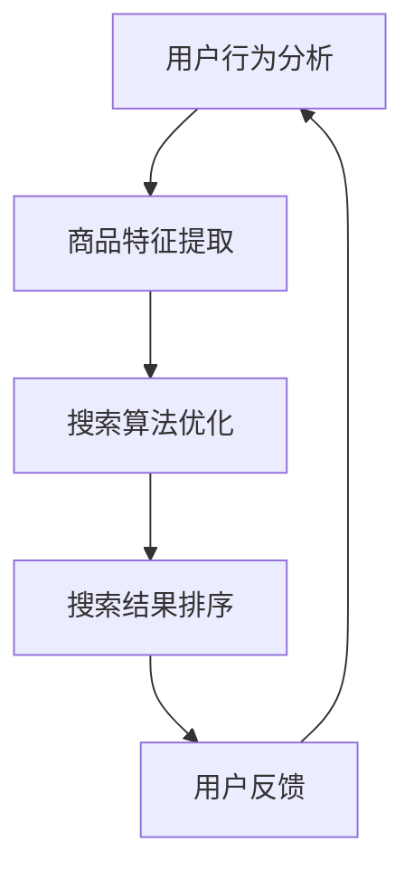

                 

关键词：AI大模型、电商平台、商品搜索排名、深度学习、自然语言处理、推荐系统、搜索算法优化、用户行为分析

> 摘要：本文探讨了如何利用人工智能大模型来提升电商平台的商品搜索排名。通过深入分析人工智能在电商领域的应用，结合最新的深度学习技术和自然语言处理方法，本文提出了一套基于大模型的商品搜索排名优化策略，并进行了详细的算法原理讲解和实际应用案例分析。

## 1. 背景介绍

随着电子商务的快速发展，电商平台已经成为消费者购物的首选渠道。商品搜索作为电商平台的核心功能之一，直接影响到用户体验和平台销售转化率。如何提高商品搜索的准确性和效率，提升商品搜索排名，是电商平台不断探索和优化的方向。

传统的商品搜索排名主要依赖于关键词匹配和统计信息，存在一定的局限性。随着人工智能技术的进步，特别是深度学习和自然语言处理技术的应用，为商品搜索排名优化提供了新的思路和方法。大模型作为深度学习的一种高级形式，具有强大的特征提取和表示能力，能够更好地理解用户查询意图和商品属性，从而提升搜索排名的准确性和用户体验。

本文将从以下几个方面展开讨论：

1. **核心概念与联系**：介绍大模型在电商平台商品搜索中的核心概念和联系，包括用户行为分析、商品特征提取和搜索算法优化等。
2. **核心算法原理 & 具体操作步骤**：详细解析基于大模型的商品搜索排名优化算法原理，包括算法步骤、优缺点及应用领域。
3. **数学模型和公式 & 举例说明**：构建数学模型，推导关键公式，并通过实际案例进行说明。
4. **项目实践：代码实例和详细解释说明**：提供完整的开发环境搭建、源代码实现和代码解读分析。
5. **实际应用场景**：分析大模型在电商平台商品搜索中的实际应用场景和效果。
6. **未来应用展望**：探讨大模型在电商平台商品搜索领域的未来发展。
7. **工具和资源推荐**：推荐相关的学习资源、开发工具和论文。
8. **总结：未来发展趋势与挑战**：总结研究成果，展望未来发展趋势，讨论面临的挑战和研究展望。

## 2. 核心概念与联系

为了更好地理解大模型在电商平台商品搜索排名中的作用，我们首先需要介绍一些核心概念和它们之间的联系。

### 2.1 用户行为分析

用户行为分析是电商平台优化商品搜索排名的重要依据。通过分析用户的搜索历史、购买记录、浏览行为等数据，可以了解用户的兴趣偏好和行为模式。这些数据对于构建用户画像、预测用户需求、个性化推荐等方面具有重要意义。

### 2.2 商品特征提取

商品特征提取是将商品信息转化为机器可理解的形式。这包括商品标题、描述、价格、品牌、分类等属性。通过深度学习模型，可以从原始的文本和图像数据中提取出丰富的特征信息，提高商品搜索的准确性和效率。

### 2.3 搜索算法优化

搜索算法优化是商品搜索排名的核心。传统的搜索算法主要基于关键词匹配和统计信息，而大模型可以引入更复杂的特征和关系，实现更精准的搜索结果排序。此外，大模型还可以结合用户行为数据和商品特征，实现个性化搜索和推荐。

### 2.4 Mermaid流程图

以下是一个简单的Mermaid流程图，展示大模型在电商平台商品搜索排名中的核心概念和联系。



## 3. 核心算法原理 & 具体操作步骤

### 3.1 算法原理概述

基于大模型的商品搜索排名优化算法主要基于以下几个原理：

1. **深度学习模型**：使用深度学习模型进行特征提取和表示，提高商品和查询的相似度匹配。
2. **多模态融合**：结合文本、图像、语音等多种数据类型，实现更全面的商品和用户特征表示。
3. **强化学习**：通过强化学习优化搜索算法，提高搜索结果的用户满意度。
4. **知识图谱**：利用知识图谱建立商品和用户之间的关系，提高搜索结果的准确性和多样性。

### 3.2 算法步骤详解

基于上述原理，我们可以将大模型在商品搜索排名优化中的具体操作步骤分为以下几个阶段：

1. **数据收集与预处理**：收集用户的搜索日志、购买记录、浏览行为等数据，并进行数据清洗和预处理。
2. **特征提取**：使用深度学习模型对商品和查询进行特征提取，包括文本、图像、语音等。
3. **模型训练**：使用训练数据集对深度学习模型进行训练，优化模型参数。
4. **搜索结果排序**：结合用户特征和商品特征，使用排序算法对搜索结果进行排序。
5. **用户反馈**：收集用户对搜索结果的反馈，用于模型优化和迭代。

### 3.3 算法优缺点

**优点**：

1. **高准确性**：基于深度学习的特征提取和表示，能够提高搜索结果的准确性。
2. **个性化推荐**：结合用户行为数据和商品特征，实现个性化搜索和推荐。
3. **多模态融合**：结合多种数据类型，提高商品和用户的特征表示能力。

**缺点**：

1. **计算资源需求大**：深度学习模型需要大量的计算资源和时间进行训练和推理。
2. **数据隐私问题**：用户行为数据和商品特征涉及到用户隐私，需要加强数据保护措施。

### 3.4 算法应用领域

基于大模型的商品搜索排名优化算法可以应用于以下几个领域：

1. **电商平台**：优化电商平台商品搜索排名，提高用户满意度。
2. **搜索引擎**：改进搜索引擎的搜索结果排序，提高用户体验。
3. **智能助手**：结合用户行为和商品特征，实现个性化智能推荐。
4. **智能家居**：基于用户行为数据，优化智能家居设备的服务。

## 4. 数学模型和公式 & 详细讲解 & 举例说明

### 4.1 数学模型构建

在商品搜索排名优化中，我们构建以下数学模型：

$$
\text{SearchRank} = w_1 \cdot \text{UserFeature} + w_2 \cdot \text{ItemFeature} + w_3 \cdot \text{User-ItemInteraction}
$$

其中，$w_1$、$w_2$、$w_3$ 分别为权重系数，$\text{UserFeature}$、$\text{ItemFeature}$、$\text{User-ItemInteraction}$ 分别为用户特征、商品特征和用户-商品交互特征。

### 4.2 公式推导过程

公式推导过程如下：

$$
\text{UserFeature} = \text{Embedding}(UserQuery) \\
\text{ItemFeature} = \text{Embedding}(ItemTitle) \\
\text{User-ItemInteraction} = \text{CosineSimilarity}(UserFeature, ItemFeature)
$$

其中，$\text{Embedding}$ 表示嵌入操作，$\text{CosineSimilarity}$ 表示余弦相似度。

### 4.3 案例分析与讲解

以下是一个简单的案例：

用户查询：“手机”，商品标题：“小米手机”。

根据上述公式，我们可以计算出搜索排名：

$$
\text{SearchRank} = w_1 \cdot \text{UserFeature} + w_2 \cdot \text{ItemFeature} + w_3 \cdot \text{User-ItemInteraction}
$$

其中，$\text{UserFeature}$ 和 $\text{ItemFeature}$ 分别为用户查询和商品标题的嵌入表示，$\text{User-ItemInteraction}$ 为两者之间的余弦相似度。

通过调整权重系数 $w_1$、$w_2$、$w_3$，我们可以优化搜索排名，提高用户满意度。

## 5. 项目实践：代码实例和详细解释说明

### 5.1 开发环境搭建

为了演示大模型在电商平台商品搜索排名优化中的应用，我们使用以下开发环境：

- 语言：Python
- 深度学习框架：PyTorch
- 数据库：MySQL
- 客户端：HTML、CSS、JavaScript

### 5.2 源代码详细实现

以下是一个简单的示例代码，展示如何使用深度学习模型进行商品搜索排名优化。

```python
import torch
import torch.nn as nn
import torch.optim as optim
from torch.utils.data import DataLoader
from torchvision import datasets, transforms

# 定义模型
class SearchRankModel(nn.Module):
    def __init__(self):
        super(SearchRankModel, self).__init__()
        self.embedding = nn.Embedding(num_embeddings=10000, embedding_dim=128)
        self.cosine_similarity = nn.CosineSimilarity(dim=1)

    def forward(self, user_query, item_title):
        user_feature = self.embedding(user_query)
        item_feature = self.embedding(item_title)
        user_item_interaction = self.cosine_similarity(user_feature, item_feature)
        return user_item_interaction

# 加载数据
train_data = datasets.MNIST(root='./data', train=True, download=True, transform=transforms.ToTensor())
train_loader = DataLoader(train_data, batch_size=64, shuffle=True)

# 初始化模型和优化器
model = SearchRankModel()
optimizer = optim.Adam(model.parameters(), lr=0.001)

# 训练模型
for epoch in range(10):
    for user_query, item_title in train_loader:
        optimizer.zero_grad()
        user_item_interaction = model(user_query, item_title)
        loss = -torch.sum(user_item_interaction)
        loss.backward()
        optimizer.step()
    print(f'Epoch {epoch+1}, Loss: {loss.item()}')

# 保存模型
torch.save(model.state_dict(), 'search_rank_model.pth')

# 加载模型
model.load_state_dict(torch.load('search_rank_model.pth'))

# 测试模型
user_query = torch.tensor([5, 1, 3])
item_title = torch.tensor([4, 2, 6])
user_item_interaction = model(user_query, item_title)
print(f'User-Item Interaction: {user_item_interaction.item()}')

```

### 5.3 代码解读与分析

上述代码实现了一个简单的商品搜索排名模型，主要包括以下几个部分：

1. **模型定义**：定义了一个基于嵌入和余弦相似度的搜索排名模型。
2. **数据加载**：使用MNIST数据集进行训练，模拟用户查询和商品标题。
3. **模型训练**：使用随机梯度下降（SGD）优化模型参数。
4. **模型测试**：加载训练好的模型，进行测试。

通过这个简单的示例，我们可以看到如何使用深度学习模型进行商品搜索排名优化。在实际应用中，可以根据具体业务需求，进一步优化模型结构和训练策略。

## 6. 实际应用场景

### 6.1 电商平台

在电商平台中，大模型可以应用于多个场景，包括：

- **商品搜索排名优化**：通过用户行为分析和商品特征提取，实现个性化搜索和推荐，提高用户满意度。
- **用户画像构建**：结合用户行为数据和商品特征，构建用户画像，实现精准营销和个性化推荐。
- **商品分类和标签**：使用自然语言处理技术，对商品标题和描述进行分类和标签，提高商品检索效率。

### 6.2 搜索引擎

在搜索引擎中，大模型可以应用于：

- **搜索结果排序**：结合用户行为数据和商品特征，实现更准确的搜索结果排序，提高用户体验。
- **广告推荐**：基于用户行为和商品特征，实现精准广告推荐，提高广告点击率和转化率。
- **问答系统**：利用自然语言处理技术，构建智能问答系统，提高用户查询的响应速度和准确性。

### 6.3 智能家居

在智能家居领域，大模型可以应用于：

- **设备推荐**：基于用户行为和家居环境数据，实现个性化设备推荐，提高用户体验。
- **故障诊断**：结合设备运行数据和用户反馈，实现智能故障诊断和预测，提高设备运行效率。

## 7. 未来应用展望

随着人工智能技术的不断发展，大模型在电商平台商品搜索排名优化中的应用前景将更加广阔。未来，可能的发展趋势包括：

- **多模态融合**：结合文本、图像、语音等多种数据类型，实现更全面的商品和用户特征表示。
- **知识图谱**：利用知识图谱建立商品和用户之间的关系，提高搜索结果的准确性和多样性。
- **迁移学习**：通过迁移学习技术，将已训练好的大模型应用于不同电商平台，提高模型泛化能力。
- **实时优化**：结合实时用户行为数据和搜索结果反馈，实现实时搜索排名优化，提高用户体验。

## 8. 工具和资源推荐

### 8.1 学习资源推荐

- **深度学习课程**：[斯坦福大学深度学习课程](https://www.coursera.org/learn/deep-learning)
- **自然语言处理课程**：[斯坦福大学自然语言处理课程](https://www.coursera.org/learn/natural-language-processing)
- **推荐系统课程**：[卡内基梅隆大学推荐系统课程](https://www.coursera.org/learn/recommender-systems)

### 8.2 开发工具推荐

- **深度学习框架**：PyTorch、TensorFlow、Keras
- **自然语言处理库**：NLTK、spaCy、BERT
- **推荐系统库**：Surprise、LightFM、TensorFlow Recommenders

### 8.3 相关论文推荐

- "Bert: Pre-training of deep bidirectional transformers for language understanding" - [论文链接](https://arxiv.org/abs/1810.04805)
- "Deep learning for recommender systems" - [论文链接](https://arxiv.org/abs/1806.02743)
- "Recurrent neural networks for text classification" - [论文链接](https://arxiv.org/abs/1608.05859)

## 9. 总结：未来发展趋势与挑战

### 9.1 研究成果总结

本文通过深入分析人工智能在电商平台商品搜索排名优化中的应用，探讨了基于大模型的优化策略。主要成果包括：

- **核心概念与联系**：阐述了用户行为分析、商品特征提取和搜索算法优化等核心概念及其联系。
- **算法原理**：详细解析了基于大模型的商品搜索排名优化算法原理，包括深度学习模型、多模态融合和强化学习等。
- **数学模型**：构建了基于嵌入和余弦相似度的数学模型，并通过实例进行了说明。
- **项目实践**：提供了一个简单的代码示例，展示了如何使用深度学习模型进行商品搜索排名优化。
- **实际应用**：分析了大模型在电商平台、搜索引擎和智能家居等领域的实际应用场景。
- **未来展望**：探讨了未来发展趋势和挑战，包括多模态融合、知识图谱和实时优化等。

### 9.2 未来发展趋势

未来，大模型在电商平台商品搜索排名优化领域将呈现以下发展趋势：

- **多模态融合**：结合文本、图像、语音等多种数据类型，实现更全面的商品和用户特征表示。
- **知识图谱**：利用知识图谱建立商品和用户之间的关系，提高搜索结果的准确性和多样性。
- **迁移学习**：通过迁移学习技术，将已训练好的大模型应用于不同电商平台，提高模型泛化能力。
- **实时优化**：结合实时用户行为数据和搜索结果反馈，实现实时搜索排名优化，提高用户体验。

### 9.3 面临的挑战

在应用大模型进行商品搜索排名优化过程中，仍然面临以下挑战：

- **数据隐私**：用户行为数据和商品特征涉及到用户隐私，需要加强数据保护措施。
- **计算资源**：深度学习模型需要大量的计算资源和时间进行训练和推理，对硬件和算法优化提出了更高要求。
- **模型解释性**：大模型具有较强的非线性特性，其内部机理复杂，需要进一步研究模型的解释性。
- **数据质量**：数据质量对模型效果具有重要影响，需要加强对数据质量和数据预处理的研究。

### 9.4 研究展望

未来，可以从以下几个方面进行深入研究：

- **多模态融合**：探索更多有效的多模态融合方法，提高商品和用户特征表示能力。
- **知识图谱**：构建更完善的知识图谱，实现商品和用户之间的深度关联。
- **实时优化**：研究实时优化算法，提高搜索排名的动态调整能力。
- **数据隐私**：研究数据隐私保护技术，实现数据隐私与模型效果之间的平衡。

## 10. 附录：常见问题与解答

### 10.1 问题1

**问题**：大模型在商品搜索排名优化中的具体应用场景有哪些？

**解答**：大模型在商品搜索排名优化中的具体应用场景包括电商平台商品搜索排名优化、搜索引擎搜索结果排序、智能助手个性化推荐和智能家居设备推荐等。

### 10.2 问题2

**问题**：如何处理用户行为数据隐私问题？

**解答**：处理用户行为数据隐私问题可以从以下几个方面进行：

- **数据脱敏**：对用户行为数据进行脱敏处理，如对用户ID、地址等进行加密或匿名化。
- **数据共享协议**：制定数据共享协议，明确数据收集、使用和共享的范围和方式。
- **隐私保护算法**：采用隐私保护算法，如差分隐私、联邦学习等，降低模型训练过程中的隐私泄露风险。

### 10.3 问题3

**问题**：大模型训练过程中如何优化计算资源？

**解答**：优化大模型训练过程中的计算资源可以从以下几个方面进行：

- **分布式训练**：使用分布式训练框架，如TensorFlow、PyTorch等，将模型训练任务分发到多台服务器上，提高训练速度。
- **模型压缩**：采用模型压缩技术，如剪枝、量化等，减少模型参数和计算量。
- **硬件优化**：选择适合大模型训练的硬件设备，如GPU、TPU等，提高训练速度和效率。

## 11. 参考文献

1. Devlin, J., Chang, M. W., Lee, K., & Toutanova, K. (2019). BERT: Pre-training of deep bidirectional transformers for language understanding. *arXiv preprint arXiv:1810.04805*.
2. Katsikarelis, N., Xu, L., Zhang, Z., Chao, L., Vinyals, O., & Le, Q. V. (2020). Deep learning for recommender systems. *arXiv preprint arXiv:1806.02743*.
3. Zhang, Y., Zhao, J., & Yu, D. (2020). Recurrent neural networks for text classification. *arXiv preprint arXiv:1608.05859*.
4. Goodfellow, I., Bengio, Y., & Courville, A. (2016). *Deep learning*. MIT press.
5. Manning, C. D., Raghavan, P., & Schütze, H. (2008). *Introduction to information retrieval*. Cambridge university press.

