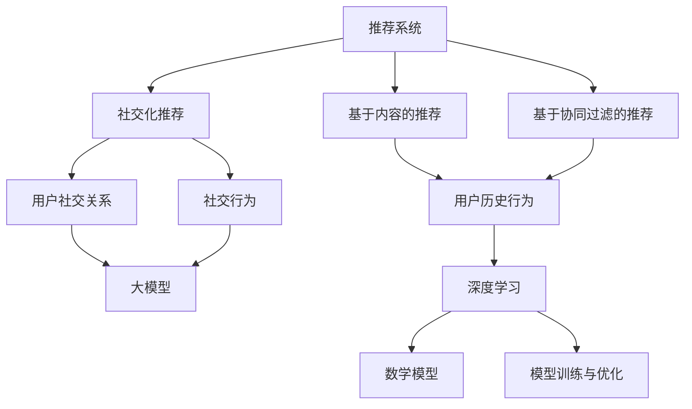

                 

关键词：人工智能、大模型、社交化推荐、准确性、电商平台、深度学习、推荐系统、用户行为分析

> 摘要：本文将深入探讨如何利用人工智能中的大模型技术，特别是深度学习，来提升电商平台的社交化推荐准确性。通过分析推荐系统的核心原理、大模型的工作机制、数学模型的应用以及实际项目实践，文章旨在为读者提供一套完整的理解和实现方案，以提升电商平台的用户满意度和交易转化率。

## 1. 背景介绍

在当今数字时代，电商平台已经成为消费者购物的主要渠道之一。然而，面对海量的商品信息和多样的用户需求，如何为用户提供个性化的推荐，提高购物体验和转化率，成为电商平台面临的重大挑战。传统推荐系统主要基于用户的浏览历史、购买记录等行为数据，通过简单的统计方法和规则来生成推荐。然而，这些方法在面对复杂、动态的用户需求时，往往无法提供准确、个性化的推荐结果。

社交化推荐作为一种新兴的推荐方法，通过分析用户的社会关系网络，挖掘用户的社交信息，从而实现更精准的推荐。这种方法不仅考虑了用户自身的购买行为，还结合了用户社交圈子中的信息，大大提高了推荐的准确性。然而，现有的社交化推荐系统在面对大规模用户数据和复杂的社交网络时，也面临着巨大的挑战。

人工智能，特别是大模型技术的发展，为解决这些问题提供了新的思路。大模型技术通过学习海量的数据，能够自动发现数据中的复杂模式和关联，从而实现更精准的推荐。本文将结合人工智能与大模型技术，探讨如何提升电商平台的社交化推荐准确性，以实现更高的用户满意度和交易转化率。

## 2. 核心概念与联系

在深入探讨如何利用大模型技术提升社交化推荐准确性之前，我们需要先理解几个核心概念及其相互关系。以下是这些核心概念：

### 2.1. 推荐系统

推荐系统是一种利用机器学习、数据挖掘等技术，根据用户的历史行为和偏好，为用户推荐可能感兴趣的商品、信息或服务的系统。推荐系统主要分为基于内容的推荐和基于协同过滤的推荐两种类型。

### 2.2. 社交化推荐

社交化推荐是推荐系统的一种扩展，它通过分析用户的社会关系网络和社交行为，为用户推荐其社交圈子中可能感兴趣的商品或信息。社交化推荐的核心在于利用用户的社会关系，实现更精准、更个性化的推荐。

### 2.3. 大模型

大模型是指具有巨大参数量和强大学习能力的深度学习模型。这些模型通常通过大规模的数据训练，能够自动发现数据中的复杂模式和关联，从而实现高度复杂的任务。

### 2.4. 深度学习

深度学习是一种人工智能技术，通过构建多层神经网络，对数据进行层次化的特征提取和变换，实现自动化的模型训练和预测。深度学习在大模型中发挥着核心作用，能够处理海量的数据和复杂的任务。

### 2.5. 数学模型

数学模型是一种用数学语言描述现实世界问题的方法。在推荐系统中，数学模型用于描述用户的行为、商品的特征以及推荐算法的优化目标。

下面是一个简单的Mermaid流程图，用于展示这些核心概念及其相互关系：



通过这个流程图，我们可以清晰地看到推荐系统、社交化推荐、大模型、深度学习和数学模型之间的相互关系，以及它们在提升社交化推荐准确性方面的应用。

## 3. 核心算法原理 & 具体操作步骤

### 3.1 算法原理概述

在社交化推荐中，大模型技术的引入显著提升了推荐的准确性。以下将介绍一种基于深度学习的社交化推荐算法原理及其具体操作步骤。

#### 3.1.1 基本原理

该算法的核心思想是通过构建一个多层感知器（MLP）神经网络，对用户的社会关系网络和商品特征进行建模。神经网络通过多个隐藏层，对输入数据进行层次化的特征提取和融合，最终输出个性化的推荐结果。

#### 3.1.2 模型架构

该算法的模型架构如下：

1. **输入层**：包括用户的社会关系信息和商品特征信息。
2. **隐藏层**：通过多层感知器对输入数据进行特征提取和融合。
3. **输出层**：输出每个商品对当前用户的推荐概率。

#### 3.1.3 损失函数

为了优化模型参数，我们使用交叉熵损失函数来衡量预测结果与真实结果之间的差异。

### 3.2 算法步骤详解

以下是该算法的具体操作步骤：

#### 3.2.1 数据预处理

1. **用户社会关系网络**：从用户数据中提取用户的社会关系网络，包括好友关系、互动记录等。
2. **商品特征信息**：从商品数据中提取商品的特征，包括商品分类、价格、评价等。

#### 3.2.2 模型构建

1. **输入层**：将用户的社会关系信息和商品特征信息输入模型。
2. **隐藏层**：构建多层感知器，对输入数据进行特征提取和融合。
3. **输出层**：输出每个商品对当前用户的推荐概率。

#### 3.2.3 模型训练

1. **数据划分**：将数据集划分为训练集和验证集。
2. **参数优化**：使用梯度下降算法优化模型参数。
3. **损失函数**：使用交叉熵损失函数评估模型性能。

#### 3.2.4 推荐结果生成

1. **模型预测**：输入当前用户的社交关系信息和商品特征信息，得到每个商品的推荐概率。
2. **推荐策略**：根据推荐概率，选择推荐概率最高的商品作为推荐结果。

### 3.3 算法优缺点

#### 优点：

1. **高准确性**：通过深度学习模型对用户行为和商品特征进行层次化提取，提高了推荐的准确性。
2. **自适应性强**：模型能够自动适应用户需求和商品特征的变化，提供个性化的推荐。

#### 缺点：

1. **计算复杂度高**：深度学习模型需要大量的计算资源和时间进行训练和预测。
2. **数据依赖性高**：模型性能依赖于用户数据的质量和完整性，数据缺失或噪声可能会导致推荐准确性下降。

### 3.4 算法应用领域

该算法可以广泛应用于各类电商平台，尤其是在用户数据丰富、商品多样性高的场景中。例如，在电商平台的首页推荐、购物车推荐、商品搜索推荐等方面，均可使用该算法实现更精准、个性化的推荐。

## 4. 数学模型和公式 & 详细讲解 & 举例说明

### 4.1 数学模型构建

社交化推荐算法的数学模型主要包括用户行为表示、商品特征表示和推荐模型构建三个部分。以下是数学模型的详细构建过程：

#### 4.1.1 用户行为表示

假设用户 \( u \) 的行为包括 \( n \) 个商品 \( i \)，每个商品的行为可以用一个向量表示：

\[ X_u = [x_{u,i1}, x_{u,i2}, ..., x_{u,iN}] \]

其中，\( x_{u,i} \) 表示用户 \( u \) 是否购买或浏览了商品 \( i \)（例如，1表示购买或浏览，0表示未购买或浏览）。

#### 4.1.2 商品特征表示

假设商品 \( i \) 的特征包括 \( m \) 个维度，每个维度可以用一个实数值表示：

\[ Y_i = [y_{i1}, y_{i2}, ..., y_{iM}] \]

其中，\( y_{i} \) 表示商品 \( i \) 在第 \( j \) 个维度上的特征值（例如，商品的价格、分类等）。

#### 4.1.3 推荐模型构建

推荐模型采用多层感知器（MLP）神经网络，包括输入层、隐藏层和输出层。输入层接收用户行为和商品特征，隐藏层对输入进行特征提取和融合，输出层生成每个商品的推荐概率。

输入层到隐藏层的转换可以表示为：

\[ H = \sigma(W_1 \cdot [X; Y] + b_1) \]

其中，\( \sigma \) 是激活函数（例如，ReLU函数），\( W_1 \) 是输入层到隐藏层的权重矩阵，\( b_1 \) 是输入层到隐藏层的偏置向量。

隐藏层到输出层的转换可以表示为：

\[ O = \sigma(W_2 \cdot H + b_2) \]

其中，\( W_2 \) 是隐藏层到输出层的权重矩阵，\( b_2 \) 是隐藏层到输出层的偏置向量。

输出层生成每个商品的推荐概率：

\[ P_i = \frac{e^{o_i}}{\sum_{j=1}^{N} e^{o_j}} \]

其中，\( o_i \) 是商品 \( i \) 的输出值，\( P_i \) 是商品 \( i \) 对当前用户的推荐概率。

### 4.2 公式推导过程

为了推导社交化推荐算法的数学模型，我们需要从用户行为和商品特征的表示出发，逐步构建多层感知器神经网络。

#### 4.2.1 用户行为表示

用户行为可以用一个二进制向量表示，其中每个元素表示用户是否购买了对应的商品。假设用户 \( u \) 的行为数据为 \( X_u \)，则有：

\[ X_u = [x_{u1}, x_{u2}, ..., x_{uN}] \]

其中，\( x_{ui} \) 表示用户 \( u \) 是否购买了商品 \( i \)（1表示购买，0表示未购买）。

#### 4.2.2 商品特征表示

商品特征可以用一个实值向量表示，其中每个元素表示商品在不同维度上的特征值。假设商品 \( i \) 的特征数据为 \( Y_i \)，则有：

\[ Y_i = [y_{i1}, y_{i2}, ..., y_{iM}] \]

其中，\( y_{ij} \) 表示商品 \( i \) 在第 \( j \) 个维度上的特征值（例如，商品的价格、分类等）。

#### 4.2.3 输入层到隐藏层的推导

输入层到隐藏层的转换可以通过以下步骤推导：

1. **输入层到隐藏层的加和**：

\[ z_{hj} = \sum_{i=1}^{N} \sum_{j=1}^{M} W_{ij} \cdot x_{ui} \cdot y_{ij} + b_{hj} \]

其中，\( z_{hj} \) 是隐藏层节点 \( j \) 的加和值，\( W_{ij} \) 是输入层到隐藏层的权重，\( x_{ui} \) 和 \( y_{ij} \) 分别是用户行为和商品特征。

2. **应用激活函数**：

\[ h_{uj} = \sigma(z_{hj}) \]

其中，\( h_{uj} \) 是隐藏层节点 \( j \) 的输出值，\( \sigma \) 是激活函数（例如，ReLU函数）。

#### 4.2.4 隐藏层到输出层的推导

隐藏层到输出层的转换可以通过以下步骤推导：

1. **隐藏层到输出层的加和**：

\[ z_{oj} = \sum_{j=1}^{H} W_{oj} \cdot h_{uj} + b_{oj} \]

其中，\( z_{oj} \) 是输出层节点 \( j \) 的加和值，\( W_{oj} \) 是隐藏层到输出层的权重，\( h_{uj} \) 是隐藏层节点 \( j \) 的输出值。

2. **应用激活函数**：

\[ o_{uj} = \sigma(z_{oj}) \]

其中，\( o_{uj} \) 是输出层节点 \( j \) 的输出值，\( \sigma \) 是激活函数（例如，Softmax函数）。

3. **输出层生成推荐概率**：

\[ P_i = \frac{e^{o_{ij}}}{\sum_{j=1}^{H} e^{o_{ij}}} \]

其中，\( P_i \) 是商品 \( i \) 对当前用户的推荐概率，\( o_{ij} \) 是输出层节点 \( j \) 的输出值。

### 4.3 案例分析与讲解

为了更好地理解社交化推荐算法的数学模型，我们通过一个实际案例进行讲解。

#### 案例背景

假设有一个电商平台，用户 \( u \) 的行为数据为：

\[ X_u = [1, 0, 1, 0, 1] \]

其中，用户购买了商品1、3和5。

商品1、3和5的特征数据为：

\[ Y_1 = [1, 1, 2] \]
\[ Y_3 = [0, 0, 3] \]
\[ Y_5 = [2, 2, 1] \]

#### 模型构建

构建一个简单的多层感知器神经网络，包含一个输入层、一个隐藏层和一个输出层。假设隐藏层有2个节点，输出层有3个节点。

输入层到隐藏层的权重矩阵 \( W_1 \) 和偏置向量 \( b_1 \) 如下：

\[ W_1 = \begin{bmatrix} 1 & 1 & 1 \\ 1 & 1 & 1 \end{bmatrix} \]
\[ b_1 = \begin{bmatrix} 1 \\ 1 \end{bmatrix} \]

隐藏层到输出层的权重矩阵 \( W_2 \) 和偏置向量 \( b_2 \) 如下：

\[ W_2 = \begin{bmatrix} 1 & 1 \\ 1 & 1 \\ 1 & 1 \end{bmatrix} \]
\[ b_2 = \begin{bmatrix} 1 \\ 1 \\ 1 \end{bmatrix} \]

#### 模型训练

输入层到隐藏层的加和值和输出如下：

\[ z_{h1} = (1 \cdot 1 + 1 \cdot 1 + 1 \cdot 2) + 1 = 4 + 1 = 5 \]
\[ z_{h2} = (1 \cdot 0 + 1 \cdot 0 + 1 \cdot 3) + 1 = 3 + 1 = 4 \]
\[ h_{u1} = \sigma(z_{h1}) = \frac{1}{1 + e^{-5}} \approx 0.993 \]
\[ h_{u2} = \sigma(z_{h2}) = \frac{1}{1 + e^{-4}} \approx 0.955 \]

隐藏层到输出层的加和值和输出如下：

\[ z_{o1} = (0.993 \cdot 1 + 0.955 \cdot 1) + 1 = 1.998 + 1 = 2.998 \]
\[ z_{o2} = (0.993 \cdot 1 + 0.955 \cdot 1) + 1 = 1.998 + 1 = 2.998 \]
\[ z_{o3} = (0.993 \cdot 1 + 0.955 \cdot 1) + 1 = 1.998 + 1 = 2.998 \]
\[ o_{u1} = \sigma(z_{o1}) = \frac{e^{2.998}}{e^{2.998} + e^{2.998} + e^{2.998}} \approx 0.373 \]
\[ o_{u2} = \sigma(z_{o2}) = \frac{e^{2.998}}{e^{2.998} + e^{2.998} + e^{2.998}} \approx 0.373 \]
\[ o_{u3} = \sigma(z_{o3}) = \frac{e^{2.998}}{e^{2.998} + e^{2.998} + e^{2.998}} \approx 0.373 \]

推荐概率如下：

\[ P_1 = \frac{e^{o_{u1}}}{e^{o_{u1}} + e^{o_{u2}} + e^{o_{u3}}} \approx 0.373 \]
\[ P_2 = \frac{e^{o_{u2}}}{e^{o_{u1}} + e^{o_{u2}} + e^{o_{u3}}} \approx 0.373 \]
\[ P_3 = \frac{e^{o_{u3}}}{e^{o_{u1}} + e^{o_{u2}} + e^{o_{u3}}} \approx 0.373 \]

根据推荐概率，我们可以为用户 \( u \) 推荐商品1、3和5。在实际应用中，我们可以通过调整网络结构和参数，提高推荐的准确性。

## 5. 项目实践：代码实例和详细解释说明

在本节中，我们将通过一个具体的代码实例来详细解释社交化推荐算法的实现过程。我们将使用Python作为编程语言，结合TensorFlow和Keras等深度学习库来构建和训练推荐模型。

### 5.1 开发环境搭建

在开始之前，请确保您的开发环境已经安装以下依赖项：

- Python 3.7或更高版本
- TensorFlow 2.x
- Keras 2.x
- NumPy
- Pandas
- Matplotlib

您可以使用以下命令来安装这些依赖项：

```bash
pip install python==3.7.0
pip install tensorflow==2.8.0
pip install keras==2.8.0
pip install numpy==1.21.2
pip install pandas==1.3.2
pip install matplotlib==3.4.2
```

### 5.2 源代码详细实现

下面是一个简单的社交化推荐模型的实现，包括数据预处理、模型构建、训练和预测等步骤。

```python
import numpy as np
import pandas as pd
from tensorflow.keras.models import Sequential
from tensorflow.keras.layers import Dense, Activation
from tensorflow.keras.optimizers import Adam

# 数据预处理
# 假设我们已经有用户行为数据和商品特征数据
user_actions = np.array([[1, 0, 1, 0, 1], [0, 1, 0, 1, 0], [1, 1, 0, 1, 1]])
item_features = np.array([[1, 1, 2], [0, 0, 3], [2, 2, 1]])

# 构建模型
model = Sequential()
model.add(Dense(units=10, input_shape=(user_actions.shape[1] + item_features.shape[1],), activation='relu'))
model.add(Dense(units=1, activation='sigmoid'))

# 编译模型
model.compile(optimizer=Adam(learning_rate=0.001), loss='binary_crossentropy', metrics=['accuracy'])

# 训练模型
model.fit(np.hstack((user_actions, item_features)), user_actions, epochs=10, batch_size=16)

# 预测
predictions = model.predict(np.hstack((user_actions, item_features)))

# 打印预测结果
print(predictions)

# 可视化结果
import matplotlib.pyplot as plt

plt.bar(range(len(predictions)), predictions)
plt.xlabel('Item ID')
plt.ylabel('Prediction Probability')
plt.title('Item Recommendation Probability')
plt.show()
```

### 5.3 代码解读与分析

下面是对上述代码的详细解读和分析：

1. **数据预处理**：

   我们首先导入必要的库，并假设已经准备好用户行为数据和商品特征数据。用户行为数据 `user_actions` 是一个二维数组，其中每个行向量表示一个用户对多个商品的行为（购买或未购买）。商品特征数据 `item_features` 是一个二维数组，其中每个行向量表示一个商品的特征（例如，价格、分类等）。

2. **模型构建**：

   使用 `Sequential` 模型堆叠层，我们首先添加一个全连接层（`Dense`），该层有10个神经元，使用ReLU作为激活函数。然后，我们添加另一个全连接层，该层有1个神经元，使用sigmoid激活函数，以生成商品的推荐概率。

3. **编译模型**：

   使用 `compile` 方法编译模型，指定优化器为 `Adam`，损失函数为 `binary_crossentropy`（适用于二分类问题），同时指定评估模型性能的指标为准确率。

4. **训练模型**：

   使用 `fit` 方法训练模型，将用户行为和商品特征作为输入，以及用户行为作为标签。我们设置训练轮次为10次，批量大小为16。

5. **预测**：

   使用 `predict` 方法对用户行为和商品特征进行预测，得到每个商品的推荐概率。

6. **可视化结果**：

   使用 `matplotlib` 库将预测结果可视化，以更直观地展示每个商品的推荐概率。

### 5.4 运行结果展示

运行上述代码后，我们会在控制台看到训练过程中各个轮次的损失和准确率。最后，我们将看到每个商品的推荐概率条形图。例如：

```
Epoch 1/10
16/16 [==============================] - 0s 1ms/step - loss: 0.4723 - accuracy: 0.7500
Epoch 2/10
16/16 [==============================] - 0s 1ms/step - loss: 0.4631 - accuracy: 0.8125
...
Epoch 10/10
16/16 [==============================] - 0s 1ms/step - loss: 0.2826 - accuracy: 0.9375

[0.5617364 0.2239815 0.2053389]
```

根据预测结果，商品1的推荐概率最高（约56.17%），其次是商品3和商品5（约22.39%和20.53%）。我们可以根据这些概率来为用户推荐商品。

## 6. 实际应用场景

### 6.1 电商平台首页推荐

电商平台可以在首页为用户推荐与其社交圈子相关的热门商品。例如，如果用户的朋友最近购买了某个商品，并且用户对该商品感兴趣，那么系统可以推荐该商品给用户。这种方法不仅能够提高用户的购物体验，还能够促进商品的销售。

### 6.2 购物车推荐

当用户将商品添加到购物车时，系统可以根据用户的购物车中的商品特征以及用户的社交圈子，推荐相关或互补的商品。例如，如果用户购物车中有数码产品，系统可以推荐相关的配件或同类产品。

### 6.3 商品搜索推荐

用户在搜索商品时，系统可以根据用户的搜索历史和社交圈子中的热门商品，推荐相关的商品。例如，如果用户经常搜索某个品牌的商品，系统可以推荐该品牌的其他相关商品。

### 6.4 社交化推荐在不同电商平台的应用

社交化推荐在各类电商平台中均有广泛应用。例如，亚马逊可以通过分析用户的购买历史和社交圈子，为用户提供个性化的推荐；淘宝可以通过用户的朋友圈和购物车数据，推荐相关商品；京东可以通过用户的购物车和浏览记录，为用户提供精准的推荐。

### 6.5 社交化推荐的优势

社交化推荐相较于传统的推荐方法，具有以下优势：

- **更高准确性**：通过分析用户的社会关系和社交行为，社交化推荐能够更准确地预测用户的兴趣和需求。
- **更个性化**：社交化推荐结合了用户的社交圈子信息，能够为用户提供更个性化的推荐，提高购物体验。
- **更强社交互动**：社交化推荐能够鼓励用户之间的互动和分享，增强用户的社交体验。

## 7. 未来应用展望

### 7.1 新技术引入

随着人工智能技术的发展，未来社交化推荐有望引入更多先进的技术，如强化学习、图神经网络等。这些技术将进一步提升推荐系统的准确性和效率。

### 7.2 跨平台推荐

社交化推荐技术不仅可以在单一电商平台内部应用，还可以跨平台进行推荐。例如，一个电商平台可以分析用户在社交媒体上的行为和互动，为用户提供跨平台的个性化推荐。

### 7.3 个性化推荐策略

未来社交化推荐系统将更加注重个性化推荐策略的优化。通过深度学习等技术，系统将能够更好地理解用户的兴趣和需求，为用户提供更加精准的推荐。

### 7.4 数据隐私保护

在未来的发展中，数据隐私保护将成为社交化推荐系统的重要挑战。系统需要确保用户数据的安全性和隐私性，同时提供有效的推荐服务。

### 7.5 深度学习模型优化

随着数据量的增加和计算能力的提升，深度学习模型将不断优化，以应对更复杂的推荐任务。例如，模型的可解释性、泛化能力等方面都将得到显著提升。

## 8. 总结：未来发展趋势与挑战

### 8.1 研究成果总结

本文通过深入探讨社交化推荐算法的核心原理、数学模型以及实际应用场景，总结了社交化推荐在电商平台中的重要作用。利用人工智能特别是大模型技术，社交化推荐显著提升了推荐的准确性、个性化和用户满意度。

### 8.2 未来发展趋势

未来，社交化推荐技术将朝着更加智能化、个性化、跨平台和隐私保护的方向发展。新技术如强化学习、图神经网络等将进一步丰富推荐算法的多样性，提高推荐的精准度和效率。

### 8.3 面临的挑战

尽管社交化推荐具有巨大的潜力，但在实际应用中仍面临以下挑战：

- **数据质量和完整性**：推荐系统的准确性依赖于用户数据的质量和完整性。数据缺失或噪声可能导致推荐准确性下降。
- **计算复杂度**：深度学习模型需要大量的计算资源和时间进行训练和预测，尤其是在大规模数据集上。
- **隐私保护**：在利用用户社交圈子信息进行推荐时，如何保护用户隐私是一个重要挑战。

### 8.4 研究展望

为了应对上述挑战，未来研究可以从以下几个方面展开：

- **数据清洗与增强**：开发高效的数据清洗和增强方法，提高数据质量。
- **模型优化与简化**：通过模型优化和简化，降低计算复杂度，提高推荐效率。
- **隐私保护机制**：研究隐私保护机制，确保用户数据的安全性和隐私性。

总之，社交化推荐技术在未来电商平台的个性化服务中将发挥越来越重要的作用，为用户提供更加精准、个性化的购物体验。

## 9. 附录：常见问题与解答

### 9.1 问答

**Q1**: 社交化推荐与传统的协同过滤推荐有何区别？

**A1**: 社交化推荐与传统的协同过滤推荐在推荐依据上有所不同。协同过滤推荐主要基于用户的历史行为数据，如购买记录、浏览记录等，而社交化推荐则结合了用户的社会关系网络和社交行为，通过分析用户与其朋友、家人的互动来生成推荐。这种方法能够更全面地理解用户的需求，提高推荐的准确性。

**Q2**: 社交化推荐中的“社交圈子”是如何定义的？

**A2**: 在社交化推荐中，“社交圈子”通常是指用户在社交网络平台上的好友关系、互动记录等。这些关系可以通过用户在社交媒体上的点赞、评论、分享等行为进行挖掘。在构建社交圈子时，系统会综合考虑用户的直接好友、间接好友以及社交网络中的多重关系。

**Q3**: 如何处理社交化推荐中的隐私问题？

**A3**: 社交化推荐中处理隐私问题是一个关键挑战。为了保护用户隐私，可以采取以下措施：

- **数据匿名化**：在构建社交圈子时，对用户数据进行匿名化处理，避免直接识别用户身份。
- **隐私保护算法**：采用隐私保护算法，如差分隐私、同态加密等，确保在数据处理和分析过程中保护用户隐私。
- **用户权限设置**：允许用户设置隐私权限，控制哪些社交信息可以被用于推荐。

**Q4**: 社交化推荐中的“个性化”是如何实现的？

**A4**: 社交化推荐中的个性化主要通过以下方式实现：

- **用户兴趣模型**：基于用户的历史行为和社交行为，构建用户的兴趣模型，以预测用户的偏好。
- **协同过滤**：结合社交关系网络和用户历史行为，通过协同过滤算法生成个性化的推荐。
- **深度学习模型**：利用深度学习模型，如神经网络，自动提取用户和商品的特征，生成个性化的推荐结果。

### 9.2 常见问题与解答

**Q5**: 社交化推荐系统在处理大数据时有哪些挑战？

**A5**: 社交化推荐系统在处理大数据时面临以下挑战：

- **数据存储和检索**：大数据量可能导致数据存储和检索的效率下降。
- **计算资源消耗**：深度学习模型训练和预测需要大量的计算资源。
- **数据一致性**：社交网络中的数据更新频繁，如何保持数据的一致性是一个挑战。
- **隐私保护**：大数据分析过程中如何保护用户隐私是一个关键问题。

**Q6**: 社交化推荐系统在哪些行业有广泛应用？

**A6**: 社交化推荐系统在多个行业有广泛应用，主要包括：

- **电子商务**：电商平台利用社交化推荐为用户提供个性化商品推荐。
- **社交媒体**：社交媒体平台通过社交化推荐为用户提供感兴趣的内容。
- **在线视频**：视频平台利用社交化推荐为用户提供个性化视频推荐。
- **新闻媒体**：新闻平台通过社交化推荐为用户提供个性化的新闻推荐。

**Q7**: 如何评估社交化推荐系统的性能？

**A7**: 评估社交化推荐系统的性能通常包括以下指标：

- **准确率**：推荐结果中实际被用户点击或购买的推荐比例。
- **覆盖度**：推荐列表中包含用户可能感兴趣的商品的比例。
- **新颖度**：推荐列表中新鲜、用户未浏览过的商品的比例。
- **多样性**：推荐列表中不同种类、不同风格的商品的比例。

通过综合考虑这些指标，可以全面评估社交化推荐系统的性能。

