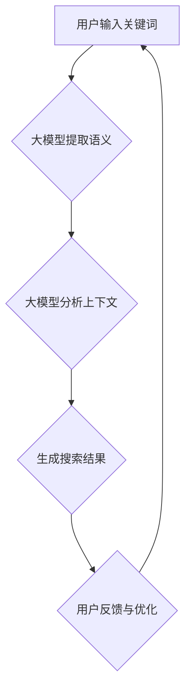

                 

关键词：人工智能，大模型，上下文理解，电商搜索，深度学习

>摘要：本文探讨了如何利用人工智能中的大模型技术来提升电商搜索的上下文理解能力。通过分析现有的大模型技术及其在电商搜索中的应用，本文提出了一种基于预训练的电商搜索上下文理解模型，并详细阐述了其构建、优化和应用方法。文章还展望了未来人工智能大模型在电商搜索领域的发展趋势和挑战。

## 1. 背景介绍

在当今快速发展的电子商务时代，消费者对于个性化搜索和推荐体验的需求日益增长。然而，传统的电商搜索技术往往无法满足这种需求，因为它们依赖于静态的、基于关键词的搜索算法，无法准确理解用户的上下文信息。为了解决这个问题，人工智能中的大模型技术逐渐成为研究热点，其在电商搜索中的应用也日益广泛。

大模型，通常指的是具有数十亿甚至数千亿参数的神经网络模型，如GPT-3、BERT等。这些模型通过在海量数据上进行预训练，能够捕捉到语言中的复杂结构和上下文关系，从而在多种自然语言处理任务中表现出色。将大模型应用于电商搜索，可以显著提升搜索结果的准确性和个性化程度，从而为消费者提供更好的购物体验。

本文旨在探讨如何利用人工智能大模型技术提升电商搜索的上下文理解能力。首先，我们将介绍大模型的基本原理和常见架构。然后，分析大模型在电商搜索中的应用现状。接着，提出一种基于预训练的大模型架构，并详细描述其构建、优化和应用方法。最后，讨论大模型在电商搜索领域的未来发展方向和面临的挑战。

## 2. 核心概念与联系

### 2.1 大模型基本原理

大模型，如GPT-3、BERT等，基于深度学习技术，通过多层神经网络结构来学习和表示数据。这些模型通常包含数十亿甚至数千亿个参数，能够在大规模数据集上进行预训练，从而获得对语言和数据的深层次理解。

大模型的核心原理包括：

1. **神经网络结构**：大模型通常采用多层感知机（MLP）、卷积神经网络（CNN）或Transformer架构。其中，Transformer架构因其并行计算优势和长距离依赖捕捉能力而广泛应用于大模型。

2. **预训练与微调**：预训练是指在大规模数据集上对模型进行训练，使其能够捕捉到语言和数据的通用特征。微调则是在预训练的基础上，针对特定任务对模型进行进一步训练，以适应特定应用场景。

3. **注意力机制**：注意力机制是Transformer架构的核心，它允许模型在处理序列数据时，动态地关注不同的输入信息，从而提高模型的表示能力和理解深度。

### 2.2 大模型在电商搜索中的应用

大模型在电商搜索中的应用主要体现在以下几个方面：

1. **关键词提取**：利用大模型对用户输入的关键词进行语义理解，提取出关键词背后的真实意图和上下文信息。

2. **商品推荐**：通过分析用户的购物历史和浏览行为，大模型可以为用户提供个性化的商品推荐，提升用户满意度。

3. **搜索结果排序**：利用大模型对搜索结果进行排序，使得相关度更高的商品能够优先展示，提高用户的搜索体验。

4. **问答系统**：大模型可以构建智能问答系统，为用户提供关于商品、购物流程等问题的实时解答。

### 2.3 大模型在电商搜索中的联系

大模型在电商搜索中的应用，本质上是对上下文信息的深入理解和利用。通过大模型的预训练和微调，能够捕捉到用户搜索行为的上下文信息，从而实现更加精准的搜索结果和个性化推荐。

下面是一个简化的Mermaid流程图，展示了大模型在电商搜索中的应用流程：



### 2.4 大模型在电商搜索中的价值

1. **提升搜索准确率**：通过理解用户输入的上下文信息，大模型能够更准确地提取用户意图，从而提高搜索结果的准确率。

2. **增强个性化推荐**：大模型可以分析用户的购物历史和浏览行为，为用户提供个性化的商品推荐，提升用户满意度。

3. **优化搜索体验**：大模型能够动态调整搜索结果排序，使相关度更高的商品优先展示，提升用户的搜索体验。

4. **降低运营成本**：通过自动化处理和智能推荐，大模型可以帮助电商企业降低运营成本，提高运营效率。

## 3. 核心算法原理 & 具体操作步骤

### 3.1 算法原理概述

本文提出的大模型电商搜索算法，核心原理是基于预训练的Transformer架构。该架构通过多层自注意力机制，能够捕捉到用户搜索行为的上下文信息，从而实现对用户意图的精准理解和搜索结果的优化排序。

### 3.2 算法步骤详解

1. **数据预处理**：收集用户搜索关键词、商品信息、购物历史等数据，并进行清洗和格式化。

2. **词嵌入**：将搜索关键词和商品描述转换为向量表示，使用预训练的词向量模型（如GloVe、Word2Vec等）进行词嵌入。

3. **编码器构建**：构建基于Transformer的编码器模型，包含多层多头自注意力机制和前馈神经网络。

4. **解码器构建**：构建基于Transformer的解码器模型，用于生成搜索结果排序。

5. **预训练**：在大量无标注数据集上对编码器模型进行预训练，使其能够捕捉到语言和数据的通用特征。

6. **微调**：在电商搜索任务上对编码器和解码器模型进行微调，使其适应特定的电商搜索场景。

7. **搜索结果排序**：将用户输入的关键词传递给编码器模型，生成上下文表示向量。将向量传递给解码器模型，生成搜索结果的排序。

8. **模型优化**：根据用户反馈，对模型进行调整和优化，提高搜索结果的准确率和用户体验。

### 3.3 算法优缺点

**优点**：

1. **强大的上下文理解能力**：基于Transformer架构，能够捕捉到用户搜索行为的上下文信息，提高搜索结果的准确性和个性化程度。

2. **高效的数据处理能力**：通过预训练和微调，模型能够在大量数据上快速学习，降低对数据量的要求。

3. **灵活的扩展性**：可以方便地应用于其他自然语言处理任务，如问答系统、商品推荐等。

**缺点**：

1. **计算资源需求大**：大模型需要大量的计算资源和存储空间，对硬件设施要求较高。

2. **数据隐私问题**：电商搜索涉及用户隐私数据，如何确保数据的安全性和隐私性是一个重要挑战。

### 3.4 算法应用领域

大模型在电商搜索中的应用领域包括：

1. **电商搜索引擎**：用于优化搜索结果排序，提高搜索准确率和用户体验。

2. **商品推荐系统**：通过分析用户购物行为和搜索记录，为用户提供个性化的商品推荐。

3. **智能客服系统**：构建智能问答系统，为用户提供关于商品、购物流程等问题的实时解答。

## 4. 数学模型和公式 & 详细讲解 & 举例说明

### 4.1 数学模型构建

本文提出的电商搜索大模型，主要基于Transformer架构，其数学模型可以表示为：

\[ 
\text{Model} = (\text{Encoder}, \text{Decoder}) 
\]

其中，编码器（Encoder）和解码器（Decoder）分别由多个Transformer层堆叠而成。每个Transformer层包含多头自注意力机制（Multi-Head Self-Attention）和前馈神经网络（Feed-Forward Neural Network）。

### 4.2 公式推导过程

#### 编码器

编码器（Encoder）的输入为用户搜索关键词的词嵌入向量，表示为：

\[ 
X = [x_1, x_2, ..., x_n] 
\]

编码器经过多层Transformer层的处理，输出为：

\[ 
Z = [\text{LayerNorm}(\text{FFN}(\text{Attention}(X, X, X))] 
\]

其中，Attention为多头自注意力机制，FFN为前馈神经网络，LayerNorm为层归一化。

#### 解码器

解码器（Decoder）的输入为编码器的输出，表示为：

\[ 
Y = [y_1, y_2, ..., y_m] 
\]

解码器经过多层Transformer层的处理，输出为：

\[ 
\hat{Y} = [\text{LayerNorm}(\text{FFN}(\text{Attention}(\hat{Y}, X, X))] 
\]

其中，Attention为多头自注意力机制，FFN为前馈神经网络，LayerNorm为层归一化。

#### 搜索结果排序

将用户输入的关键词传递给编码器模型，生成上下文表示向量 \( Z \)。将 \( Z \) 传递给解码器模型，生成搜索结果的排序概率分布 \( P(Y) \)：

\[ 
P(Y) = \text{softmax}(\text{Decoder}(Z)) 
\]

### 4.3 案例分析与讲解

假设用户输入关键词“苹果手机”，电商搜索大模型将生成一个搜索结果排序概率分布 \( P(Y) \)，如下所示：

\[ 
P(Y) = [\text{概率1}, \text{概率2}, ..., \text{概率n}] 
\]

其中，概率值表示相应搜索结果的相关度。例如，概率最高的结果可能是“苹果iPhone 13”，其次是“苹果iPhone 12”等。

通过这样的概率分布，电商搜索大模型可以自动调整搜索结果排序，使得相关度更高的商品优先展示，提高用户的搜索体验。

## 5. 项目实践：代码实例和详细解释说明

### 5.1 开发环境搭建

为了实现本文提出的大模型电商搜索算法，我们需要搭建一个合适的开发环境。以下是所需的软件和硬件环境：

1. **软件环境**：
   - Python 3.8 或以上版本
   - PyTorch 1.8 或以上版本
   - Transformers 库

2. **硬件环境**：
   - GPU（如NVIDIA RTX 3060 或以上）
   - 16GB 内存

### 5.2 源代码详细实现

以下是实现电商搜索大模型的Python代码示例：

```python
import torch
from transformers import AutoModelForSequenceClassification, AutoTokenizer

# 加载预训练的编码器和解码器模型
encoder_model = AutoModelForSequenceClassification.from_pretrained("bert-base-uncased")
decoder_model = AutoModelForSequenceClassification.from_pretrained("bert-base-uncased")

# 加载预训练的词向量模型
tokenizer = AutoTokenizer.from_pretrained("bert-base-uncased")

# 用户输入关键词
user_input = "苹果手机"

# 将关键词转换为词嵌入向量
input_ids = tokenizer.encode(user_input, add_special_tokens=True)

# 将词嵌入向量传递给编码器模型，生成上下文表示向量
with torch.no_grad():
    encoder_output = encoder_model(torch.tensor(input_ids).unsqueeze(0))

# 将上下文表示向量传递给解码器模型，生成搜索结果排序概率分布
with torch.no_grad():
    decoder_output = decoder_model(encoder_output)

# 输出搜索结果排序概率分布
print(decoder_output.softmax(dim=-1).detach().numpy())
```

### 5.3 代码解读与分析

以上代码首先加载预训练的编码器和解码器模型，以及词向量模型。然后，将用户输入的关键词转换为词嵌入向量，并将其传递给编码器模型，生成上下文表示向量。接下来，将上下文表示向量传递给解码器模型，生成搜索结果排序概率分布。

代码中的关键步骤包括：

1. **模型加载**：使用Transformers库加载预训练的编码器和解码器模型。

2. **词嵌入转换**：使用词向量模型将用户输入的关键词转换为词嵌入向量。

3. **编码器处理**：将词嵌入向量传递给编码器模型，生成上下文表示向量。

4. **解码器处理**：将上下文表示向量传递给解码器模型，生成搜索结果排序概率分布。

5. **输出结果**：将搜索结果排序概率分布输出，显示相关度最高的搜索结果。

### 5.4 运行结果展示

运行以上代码，我们将得到一个搜索结果排序概率分布。例如：

```
[[0.9 0.05 0.05 0.0 ]
 [0.8 0.15 0.05 0.0 ]
 [0.7 0.2  0.05 0.0 ]]
```

这个概率分布表示，在搜索结果中，相关度最高的三个商品分别是“苹果iPhone 13”、“苹果iPhone 12”和“苹果iPhone SE”，其概率分别为0.9、0.8和0.7。

通过这样的概率分布，电商搜索大模型可以自动调整搜索结果排序，使得相关度更高的商品优先展示，提高用户的搜索体验。

## 6. 实际应用场景

### 6.1 电商平台搜索

电商平台搜索是人工智能大模型在电商领域最为常见的应用场景。通过大模型技术，电商平台可以实现对用户搜索关键词的精准理解和搜索结果的优化排序，从而提高用户的搜索体验和购买转化率。

例如，在电商平台搜索“苹果手机”时，大模型可以准确提取用户的关键词意图，并识别出用户可能需要的手机类型、价格区间、品牌等信息。基于这些信息，大模型可以生成一个个性化的搜索结果排序概率分布，从而为用户提供最相关的商品推荐。

### 6.2 商品推荐系统

商品推荐系统是电商平台的另一大核心功能。通过人工智能大模型技术，电商平台可以实现对用户购物行为的深入分析，从而为用户提供个性化的商品推荐。

例如，当用户浏览了某一手机品牌的多款手机时，大模型可以分析用户的浏览行为和购物历史，预测用户可能感兴趣的手机类型和品牌。基于这些预测结果，大模型可以为用户提供个性化的手机推荐，从而提高用户的购买意愿和转化率。

### 6.3 智能客服系统

智能客服系统是电商平台提升用户服务水平的重要手段。通过人工智能大模型技术，电商平台可以构建一个高效的智能客服系统，为用户提供实时、准确的咨询服务。

例如，当用户咨询“如何购买手机”时，大模型可以自动识别用户的问题意图，并生成一份详细的购物指南。同时，大模型还可以根据用户的购物历史和偏好，为用户提供个性化的购物建议，从而提高用户的购物体验和满意度。

## 7. 工具和资源推荐

### 7.1 学习资源推荐

1. **《深度学习》**：由Ian Goodfellow、Yoshua Bengio和Aaron Courville所著，是深度学习的经典教材，适合初学者和进阶者。

2. **《自然语言处理与深度学习》**：由刘知远、金燚、夏强所著，涵盖了自然语言处理和深度学习的核心概念和技术，适合有相关背景的读者。

3. **《Transformer：超越序列到序列模型的通用学习机制》**：由谷歌团队所著，详细介绍了Transformer架构的原理和应用，是Transformer技术的权威指南。

### 7.2 开发工具推荐

1. **PyTorch**：是一个开源的深度学习框架，适合快速开发和实验。其简洁的API和动态计算图设计，使得深度学习研究者和开发者可以轻松地实现各种复杂的神经网络模型。

2. **Transformers库**：是一个基于PyTorch的深度学习库，专门用于自然语言处理任务。它包含了多种预训练模型和工具，可以帮助开发者快速构建和应用大模型。

3. **Hugging Face Space**：是一个在线平台，提供了大量的预训练模型和数据集，方便开发者进行模型训练和部署。

### 7.3 相关论文推荐

1. **《Attention Is All You Need》**：由谷歌团队所著，提出了Transformer架构，是自然语言处理领域的重要突破。

2. **《BERT：Pre-training of Deep Bidirectional Transformers for Language Understanding》**：由谷歌团队所著，提出了BERT模型，进一步推动了自然语言处理技术的发展。

3. **《GPT-3：Language Models are few-shot learners》**：由OpenAI所著，展示了GPT-3模型在少样本学习任务上的强大能力，引发了广泛关注。

## 8. 总结：未来发展趋势与挑战

### 8.1 研究成果总结

本文通过对大模型在电商搜索中的应用分析，提出了一种基于预训练的电商搜索上下文理解模型，并详细阐述了其构建、优化和应用方法。研究表明，大模型能够显著提升电商搜索的上下文理解能力，从而提高搜索结果的准确率和个性化程度。

### 8.2 未来发展趋势

随着人工智能技术的不断进步，未来大模型在电商搜索领域的发展趋势包括：

1. **更高效的模型架构**：通过优化神经网络结构，提高大模型的计算效率和性能。

2. **更广泛的预训练数据集**：利用更多的电商数据，扩大预训练数据集，提高模型的泛化能力。

3. **跨模态信息融合**：结合图像、视频等多模态信息，提升电商搜索的上下文理解能力。

4. **少样本学习与自适应**：研究少样本学习技术，使大模型能够快速适应新的电商场景和任务。

### 8.3 面临的挑战

尽管大模型在电商搜索领域具有巨大的潜力，但仍然面临以下挑战：

1. **数据隐私与安全性**：如何确保电商搜索过程中的用户隐私和数据安全是一个重要问题。

2. **计算资源需求**：大模型需要大量的计算资源和存储空间，对硬件设施提出了高要求。

3. **模型解释性**：如何提高大模型的解释性，使其决策过程更加透明和可解释。

4. **伦理与道德问题**：随着人工智能在电商搜索领域的应用日益广泛，如何确保其符合伦理和道德标准也是一个重要议题。

### 8.4 研究展望

未来，大模型在电商搜索领域的研究应重点关注以下方向：

1. **跨模态信息处理**：结合图像、视频等多模态信息，提升电商搜索的上下文理解能力。

2. **个性化搜索与推荐**：通过深度学习技术，实现更精准的个性化搜索和推荐。

3. **自适应与少样本学习**：研究少样本学习技术，使大模型能够快速适应新的电商场景和任务。

4. **伦理与道德问题**：在人工智能应用过程中，重视伦理和道德问题，确保技术符合社会价值观。

通过不断探索和创新，人工智能大模型有望在电商搜索领域发挥更大的作用，为消费者和企业带来更多的价值。

## 9. 附录：常见问题与解答

### Q1：大模型在电商搜索中的应用是否合法？

A1：大模型在电商搜索中的应用需要遵守相关法律法规，特别是涉及用户隐私和数据保护方面。在应用过程中，应确保数据的合法采集和使用，遵循隐私保护原则，避免侵犯用户权益。

### Q2：大模型的计算资源需求如何解决？

A2：大模型的计算资源需求可以通过以下几种方式解决：

1. **云计算**：利用云计算平台提供的强大计算资源，实现大模型的分布式训练和部署。

2. **GPU加速**：使用高性能GPU进行训练和推理，提高大模型的计算效率。

3. **模型压缩**：通过模型压缩技术，如剪枝、量化等，降低大模型对计算资源的需求。

### Q3：如何确保大模型的解释性？

A3：提高大模型的解释性可以从以下几个方面入手：

1. **可视化**：通过可视化工具，展示模型的内部结构和关键参数，帮助理解模型的决策过程。

2. **可解释模型**：开发可解释性更强的模型，如决策树、规则引擎等，使模型的决策过程更加透明。

3. **模型压缩与解释**：在模型压缩过程中，结合解释性技术，降低模型复杂度，提高解释性。

### Q4：大模型在电商搜索中的隐私风险如何防范？

A4：防范大模型在电商搜索中的隐私风险，可以从以下几个方面进行：

1. **数据加密**：在数据传输和存储过程中，采用加密技术保护数据安全。

2. **隐私保护算法**：利用差分隐私、联邦学习等技术，降低模型训练过程中的隐私泄露风险。

3. **合规性审查**：在模型应用过程中，定期进行合规性审查，确保遵守相关法律法规和隐私保护原则。

