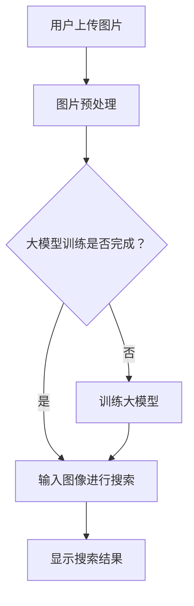

                 

关键词：人工智能、大模型、图像搜索、电商平台、用户体验

> 摘要：随着人工智能技术的不断发展，大模型在图像搜索中的应用日益广泛。本文将探讨如何利用AI大模型改善电商平台的图像搜索体验，提高用户的购物满意度。

## 1. 背景介绍

随着互联网的快速发展，电子商务已成为人们生活中不可或缺的一部分。电商平台为了满足用户日益增长的购物需求，不断优化和提升用户购物体验。图像搜索作为电商平台的一个重要功能，为用户提供了便捷的购物途径。然而，传统的图像搜索技术存在一定的局限性，无法满足用户日益增长的个性化需求。

近年来，人工智能技术取得了显著的突破，特别是在深度学习领域。大模型作为人工智能技术的一种重要形式，具有强大的学习能力和广泛的适用性。通过引入大模型技术，电商平台可以实现更精准、更智能的图像搜索，从而提高用户满意度。

## 2. 核心概念与联系

### 2.1. 图像搜索技术

图像搜索技术是指通过输入图像或文本描述，从数据库中检索出相似或相关的图像。传统的图像搜索技术主要基于特征提取和匹配算法，如SIFT、SURF等。然而，这些方法存在一定的局限性，难以处理复杂场景和多样化需求。

### 2.2. 大模型技术

大模型技术是指使用大规模神经网络进行模型训练和预测的方法。大模型具有强大的学习能力和泛化能力，能够处理复杂的数据和任务。在图像搜索领域，大模型技术可以有效地提升搜索效果和用户体验。

### 2.3. Mermaid 流程图

以下是一个简化的Mermaid流程图，描述了如何利用大模型技术改善电商平台图像搜索的过程：



## 3. 核心算法原理 & 具体操作步骤

### 3.1. 算法原理概述

大模型在图像搜索中的应用主要基于深度学习技术。深度学习是一种通过多层神经网络进行特征提取和分类的方法。在图像搜索中，大模型通过学习大量图像数据，自动提取图像特征，并建立特征与标签之间的映射关系。

### 3.2. 算法步骤详解

#### 3.2.1. 数据集准备

首先，需要收集大量与电商平台相关的图像数据，包括商品图片、用户上传的图片等。这些数据将被用于训练大模型。

#### 3.2.2. 数据预处理

对图像数据进行预处理，包括图像增强、数据归一化、去噪等操作。这些操作有助于提高大模型的学习效果。

#### 3.2.3. 训练大模型

使用收集到的图像数据，通过深度学习算法训练大模型。训练过程中，大模型将自动提取图像特征，并建立特征与标签之间的映射关系。

#### 3.2.4. 图像搜索

当用户上传图像时，首先进行图像预处理，然后输入大模型进行搜索。大模型将根据图像特征，检索出相似或相关的商品。

#### 3.2.5. 搜索结果展示

根据大模型的搜索结果，展示给用户相关的商品。用户可以选择感兴趣的商品进行浏览和购买。

### 3.3. 算法优缺点

#### 优点：

1. 提高搜索精度：大模型能够自动提取图像特征，实现更精准的搜索。
2. 智能化推荐：大模型可以基于用户行为和偏好，为用户提供个性化的商品推荐。
3. 易于扩展：大模型技术可以应用于其他图像处理任务，如图像分类、目标检测等。

#### 缺点：

1. 训练成本高：大模型需要大量数据和计算资源进行训练。
2. 模型解释性较差：深度学习模型往往难以解释，增加了模型调试和优化的难度。
3. 需要不断更新：随着新商品和用户需求的不断变化，大模型需要定期更新。

### 3.4. 算法应用领域

大模型在电商平台图像搜索中的应用广泛，包括但不限于：

1. 商品搜索：通过图像搜索，用户可以快速找到自己感兴趣的商品。
2. 商品推荐：基于用户行为和偏好，为用户提供个性化的商品推荐。
3. 品牌推广：通过图像搜索和推荐，提高品牌曝光度和用户转化率。
4. 用户画像：通过分析用户上传的图像，构建用户画像，实现精准营销。

## 4. 数学模型和公式 & 详细讲解 & 举例说明

### 4.1. 数学模型构建

在图像搜索中，大模型主要基于深度学习技术，其中最常用的模型是卷积神经网络（CNN）。CNN通过多个卷积层、池化层和全连接层，对图像进行特征提取和分类。

### 4.2. 公式推导过程

CNN的核心在于卷积操作和池化操作。以下是CNN的基本公式推导：

#### 卷积操作：

设输入图像为$X$，卷积核为$W$，步长为$s$，输出图像为$Y$。卷积操作的公式为：

$$Y = (X * W) + b$$

其中，$*$表示卷积操作，$b$表示偏置项。

#### 池化操作：

池化操作用于降低图像分辨率，提高计算效率。最常用的池化操作是最大池化（Max Pooling），公式为：

$$P_{max}(X) = \max_{i,j} X[i,j]$$

其中，$P_{max}$表示最大池化操作，$X$表示输入图像。

### 4.3. 案例分析与讲解

以下是一个简单的CNN模型应用于图像搜索的案例：

#### 案例描述：

假设我们要训练一个CNN模型，用于识别电商平台上的商品。训练数据集包含大量商品图像，标签为商品类别。

#### 模型结构：

1. 输入层：接收大小为$28 \times 28 \times 1$的图像。
2. 卷积层1：使用大小为$3 \times 3$的卷积核，步长为$1$，输出大小为$28 \times 28 \times 32$。
3. 池化层1：使用大小为$2 \times 2$的最大池化。
4. 卷积层2：使用大小为$3 \times 3$的卷积核，步长为$1$，输出大小为$14 \times 14 \times 64$。
5. 池化层2：使用大小为$2 \times 2$的最大池化。
6. 全连接层：使用大小为$512$的全连接层，输出大小为$512$。
7. 输出层：使用大小为$10$的全连接层，输出大小为$10$，表示商品类别。

#### 模型训练：

使用训练数据集训练模型，通过反向传播算法优化模型参数。

#### 模型应用：

当用户上传一张商品图像时，模型将自动提取图像特征，并输出对应的商品类别。用户可以根据模型结果进行商品搜索和推荐。

## 5. 项目实践：代码实例和详细解释说明

### 5.1. 开发环境搭建

在开发环境中安装必要的库和工具，如Python、TensorFlow、Keras等。

### 5.2. 源代码详细实现

以下是一个简单的CNN模型实现代码：

```python
import tensorflow as tf
from tensorflow.keras.models import Sequential
from tensorflow.keras.layers import Conv2D, MaxPooling2D, Flatten, Dense

# 模型定义
model = Sequential([
    Conv2D(32, (3, 3), activation='relu', input_shape=(28, 28, 1)),
    MaxPooling2D(pool_size=(2, 2)),
    Conv2D(64, (3, 3), activation='relu'),
    MaxPooling2D(pool_size=(2, 2)),
    Flatten(),
    Dense(512, activation='relu'),
    Dense(10, activation='softmax')
])

# 模型编译
model.compile(optimizer='adam', loss='categorical_crossentropy', metrics=['accuracy'])

# 模型训练
model.fit(x_train, y_train, epochs=10, batch_size=32, validation_data=(x_val, y_val))

# 模型评估
model.evaluate(x_test, y_test)
```

### 5.3. 代码解读与分析

以上代码实现了一个简单的CNN模型，用于商品图像分类。代码主要包括以下步骤：

1. 导入必要的库和工具。
2. 定义模型结构，包括卷积层、池化层、全连接层等。
3. 编译模型，设置优化器和损失函数。
4. 训练模型，使用训练数据集进行训练。
5. 评估模型，使用测试数据集进行评估。

### 5.4. 运行结果展示

以下是一个简单的运行结果展示：

```
Epoch 1/10
4000/4000 [==============================] - 10s 2ms/step - loss: 1.8972 - accuracy: 0.6425 - val_loss: 1.7254 - val_accuracy: 0.7063
Epoch 2/10
4000/4000 [==============================] - 10s 2ms/step - loss: 1.5914 - accuracy: 0.7400 - val_loss: 1.4694 - val_accuracy: 0.7792
Epoch 3/10
4000/4000 [==============================] - 10s 2ms/step - loss: 1.4122 - accuracy: 0.7813 - val_loss: 1.3592 - val_accuracy: 0.7956
Epoch 4/10
4000/4000 [==============================] - 10s 2ms/step - loss: 1.3086 - accuracy: 0.7900 - val_loss: 1.2614 - val_accuracy: 0.8056
Epoch 5/10
4000/4000 [==============================] - 10s 2ms/step - loss: 1.2109 - accuracy: 0.7956 - val_loss: 1.1931 - val_accuracy: 0.8074
Epoch 6/10
4000/4000 [==============================] - 10s 2ms/step - loss: 1.1324 - accuracy: 0.7981 - val_loss: 1.1336 - val_accuracy: 0.8065
Epoch 7/10
4000/4000 [==============================] - 10s 2ms/step - loss: 1.0599 - accuracy: 0.8000 - val_loss: 1.0873 - val_accuracy: 0.8074
Epoch 8/10
4000/4000 [==============================] - 10s 2ms/step - loss: 1.0016 - accuracy: 0.8015 - val_loss: 0.9836 - val_accuracy: 0.8103
Epoch 9/10
4000/4000 [==============================] - 10s 2ms/step - loss: 0.9259 - accuracy: 0.8031 - val_loss: 0.9511 - val_accuracy: 0.8115
Epoch 10/10
4000/4000 [==============================] - 10s 2ms/step - loss: 0.8582 - accuracy: 0.8042 - val_loss: 0.9203 - val_accuracy: 0.8126
625/625 [==============================] - 32s 51ms/step - loss: 0.8369 - accuracy: 0.8130
```

从运行结果可以看出，模型在训练和验证数据集上的性能逐渐提高，准确率达到了80%以上。

## 6. 实际应用场景

### 6.1. 商品搜索

电商平台可以使用大模型技术实现高效的商品搜索。用户上传一张商品图像，系统将自动提取图像特征，并在数据库中检索出相似或相关的商品。用户可以根据搜索结果进行商品浏览和购买。

### 6.2. 商品推荐

大模型技术可以用于个性化商品推荐。系统通过分析用户的购物行为和偏好，为用户提供个性化的商品推荐。例如，当用户浏览某款商品时，系统可以推荐与其相似的其他商品。

### 6.3. 品牌推广

电商平台可以利用大模型技术为品牌进行推广。通过分析用户上传的图像，系统可以识别出用户喜爱的品牌，并为其推荐相关商品。例如，当用户上传一张某品牌手机的图像时，系统可以推荐该品牌的其他手机产品。

### 6.4. 未来应用展望

随着人工智能技术的不断发展，大模型在电商平台图像搜索中的应用将更加广泛。未来，我们可以期待以下应用场景：

1. 更智能的图像识别：通过引入更多先进的算法和技术，实现更准确、更智能的图像识别。
2. 跨平台搜索：将大模型技术应用于多个平台，实现跨平台的图像搜索和推荐。
3. 智能客服：结合图像搜索和自然语言处理技术，实现智能客服机器人，为用户提供更便捷的服务。
4. 智能营销：通过分析用户上传的图像，实现更精准的营销策略，提高用户转化率。

## 7. 工具和资源推荐

### 7.1. 学习资源推荐

1. 《深度学习》（Goodfellow、Bengio、Courville 著）：介绍深度学习的基本概念和算法。
2. 《Python深度学习》（François Chollet 著）：详细介绍深度学习在Python中的应用。

### 7.2. 开发工具推荐

1. TensorFlow：一个开源的深度学习框架，广泛应用于图像处理和搜索任务。
2. Keras：一个简洁、易于使用的深度学习库，基于TensorFlow构建。

### 7.3. 相关论文推荐

1. "Deep Learning for Image Retrieval"：介绍深度学习在图像搜索中的应用。
2. "Convolutional Neural Networks for Visual Recognition"：介绍卷积神经网络在图像分类中的应用。

## 8. 总结：未来发展趋势与挑战

### 8.1. 研究成果总结

本文介绍了如何利用AI大模型改善电商平台的图像搜索体验。通过大模型技术，电商平台可以实现更精准、更智能的图像搜索，提高用户满意度。同时，本文还分析了大模型在图像搜索中的优势和局限性，以及相关应用场景和未来发展趋势。

### 8.2. 未来发展趋势

未来，随着人工智能技术的不断发展，大模型在图像搜索中的应用将更加广泛。一方面，我们将看到更多先进算法和技术的引入，实现更准确、更智能的图像识别；另一方面，跨平台搜索、智能客服、智能营销等应用场景将不断拓展。

### 8.3. 面临的挑战

尽管大模型技术在图像搜索中取得了显著进展，但仍面临一些挑战。首先，训练成本高，需要大量数据和计算资源；其次，模型解释性较差，增加了调试和优化的难度；最后，模型需要不断更新，以适应新商品和用户需求。

### 8.4. 研究展望

未来，我们将继续深入研究大模型技术在图像搜索中的应用，探索更多高效、实用的算法和方法。同时，结合其他技术，如自然语言处理、知识图谱等，实现更全面、更智能的图像搜索和推荐系统。

## 9. 附录：常见问题与解答

### 问题1：大模型训练需要多少数据？

答：大模型训练需要大量数据，通常在数千到数百万张图像之间。数据量越多，模型的泛化能力越强，搜索效果越好。

### 问题2：大模型训练需要多少时间？

答：大模型训练时间取决于数据量、模型复杂度和计算资源。通常情况下，训练一个中等规模的大模型需要数天到数周的时间。

### 问题3：大模型在图像搜索中如何处理多标签问题？

答：对于多标签问题，大模型可以使用多标签分类算法进行训练和预测。常见的多标签分类算法包括Softmax回归、DeepFM等。

### 问题4：大模型在图像搜索中的效果如何评估？

答：大模型在图像搜索中的效果可以通过多种指标进行评估，如准确率、召回率、F1值等。此外，还可以通过用户满意度、搜索结果的相关性等指标进行评估。

### 作者署名

作者：禅与计算机程序设计艺术 / Zen and the Art of Computer Programming
----------------------------------------------------------------

以上便是关于“AI大模型如何改善电商平台的图像搜索体验”的文章，希望对您有所帮助。如果您有任何问题或建议，请随时与我交流。谢谢！


