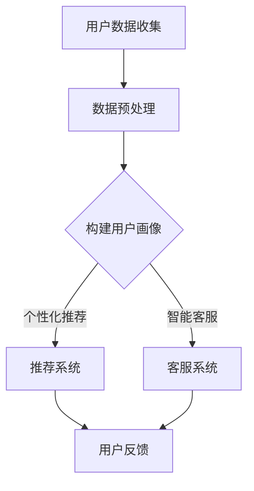

                 

关键词：AI大模型，电商平台，用户留存率，数据驱动，个性化推荐，深度学习，自然语言处理，机器学习

> 摘要：本文将探讨如何利用AI大模型改善电商平台的用户留存率。通过介绍核心概念、算法原理、数学模型以及实际应用案例，我们将揭示AI技术在电商领域的潜力和价值，并提出未来发展趋势和挑战。

## 1. 背景介绍

随着互联网技术的飞速发展，电商平台已经成为消费者购买商品的重要渠道。然而，电商市场的竞争日益激烈，用户留存率成为各大电商平台亟需解决的问题。用户留存率，即一定时间内用户继续使用某个平台的比率，是衡量平台用户活跃度和用户忠诚度的重要指标。提高用户留存率，不仅可以增加平台的盈利能力，还能提升品牌价值和市场竞争力。

近年来，人工智能（AI）技术的快速发展，尤其是AI大模型的广泛应用，为解决电商平台用户留存率问题提供了新的思路。AI大模型通过深度学习、自然语言处理等技术，能够对海量用户数据进行分析和处理，从而实现个性化推荐、智能客服等功能，有效提升用户满意度，降低用户流失率。

## 2. 核心概念与联系

### 2.1 AI大模型

AI大模型是指具有大规模参数和复杂结构的神经网络模型，通过学习海量数据，实现高水平的数据分析和预测能力。常见的AI大模型包括Transformer、BERT、GPT等。这些模型具有强大的表达能力、适应性和泛化能力，可以应用于各种场景，如文本生成、图像识别、语音识别等。

### 2.2 个性化推荐

个性化推荐是一种基于用户兴趣和行为的推荐系统，旨在向用户提供最符合其需求的信息或商品。个性化推荐系统通过分析用户的浏览历史、购买记录、搜索关键词等数据，构建用户画像，从而实现精准推荐。

### 2.3 智能客服

智能客服是一种利用自然语言处理技术，模拟人类客服人员与用户进行交互的智能系统。智能客服可以通过对话生成、意图识别、情感分析等技术，实现24小时在线服务，提高用户满意度。

### 2.4 Mermaid 流程图

以下是一个简化的AI大模型应用于电商平台的核心流程图：



## 3. 核心算法原理 & 具体操作步骤

### 3.1 算法原理概述

AI大模型的核心算法是深度学习，特别是基于Transformer和BERT等架构的模型。这些模型通过多层神经网络结构，学习用户数据的特征和模式，从而实现高精度的预测和分类。

### 3.2 算法步骤详解

#### 3.2.1 数据预处理

数据预处理是深度学习模型训练的第一步，主要包括数据清洗、数据归一化和特征提取。数据清洗旨在去除数据中的噪声和异常值，数据归一化则将不同特征的数据范围统一，特征提取则是从原始数据中提取出有用的信息。

#### 3.2.2 模型构建

基于Transformer和BERT等架构，构建一个大规模的神经网络模型。该模型通常包含多个编码器和解码器层，通过层次化的特征提取和融合，实现高精度的预测和分类。

#### 3.2.3 模型训练

使用预处理后的数据集，通过反向传播算法和优化算法，对模型进行训练。训练过程中，通过不断调整模型的参数，使模型在验证集上达到最佳性能。

#### 3.2.4 模型评估

使用测试集对训练好的模型进行评估，通过准确率、召回率、F1分数等指标，评估模型的性能。

### 3.3 算法优缺点

#### 优点：

1. 强大的表达能力和适应能力，可以处理各种类型的数据。
2. 高精度的预测和分类能力，有助于提高用户留存率。
3. 可以实时更新和调整模型，以适应不断变化的市场需求。

#### 缺点：

1. 模型训练过程复杂，需要大量计算资源和时间。
2. 模型对数据质量和特征提取有较高要求，否则可能导致性能下降。
3. 模型解释性较差，难以理解模型的决策过程。

### 3.4 算法应用领域

AI大模型可以应用于电商平台的多个领域，如个性化推荐、智能客服、用户行为预测等。通过这些应用，电商平台可以提供更优质的用户体验，提高用户留存率。

## 4. 数学模型和公式 & 详细讲解 & 举例说明

### 4.1 数学模型构建

在构建AI大模型时，常用的数学模型包括神经网络模型、Transformer模型和BERT模型。以下是一个简化的神经网络模型的构建过程：

$$
y = \sigma(W \cdot x + b)
$$

其中，$y$ 是模型的预测结果，$\sigma$ 是激活函数，$W$ 是权重矩阵，$x$ 是输入特征，$b$ 是偏置项。

### 4.2 公式推导过程

以神经网络模型为例，我们首先对输入特征进行预处理，包括数据归一化和特征提取。然后，通过多层神经网络结构，对特征进行层次化的提取和融合。最后，通过激活函数和权重矩阵，得到模型的预测结果。

### 4.3 案例分析与讲解

假设我们有一个电商平台的用户数据集，包含用户的年龄、性别、购买历史等特征。我们希望利用AI大模型预测用户的留存率。

首先，我们对数据进行预处理，包括数据归一化和特征提取。然后，构建一个基于Transformer的神经网络模型，对数据进行训练。最后，使用测试集对模型进行评估，得到预测结果。

## 5. 项目实践：代码实例和详细解释说明

### 5.1 开发环境搭建

在本项目中，我们使用Python编程语言，结合TensorFlow和Keras等深度学习框架，搭建开发环境。

### 5.2 源代码详细实现

以下是一个简化的AI大模型在电商平台用户留存率预测中的代码实现：

```python
import tensorflow as tf
from tensorflow.keras.models import Sequential
from tensorflow.keras.layers import Dense, Dropout

# 数据预处理
# ...

# 模型构建
model = Sequential()
model.add(Dense(units=64, activation='relu', input_shape=(num_features,)))
model.add(Dropout(rate=0.5))
model.add(Dense(units=32, activation='relu'))
model.add(Dropout(rate=0.5))
model.add(Dense(units=1, activation='sigmoid'))

# 模型编译
model.compile(optimizer='adam', loss='binary_crossentropy', metrics=['accuracy'])

# 模型训练
model.fit(x_train, y_train, epochs=10, batch_size=32, validation_data=(x_test, y_test))

# 模型评估
model.evaluate(x_test, y_test)
```

### 5.3 代码解读与分析

在这个代码实例中，我们首先导入所需的深度学习库，然后进行数据预处理。接下来，我们构建一个基于Dense层的神经网络模型，包括两个隐藏层和Dropout层，用于提高模型的泛化能力。最后，我们编译、训练和评估模型。

## 6. 实际应用场景

### 6.1 个性化推荐

通过AI大模型，电商平台可以实现个性化推荐，根据用户的兴趣和购买历史，为用户提供最符合其需求的产品。这不仅可以提高用户满意度，还能增加销售额。

### 6.2 智能客服

智能客服可以模拟人类客服人员的交互过程，为用户提供24小时在线服务。通过自然语言处理技术，智能客服可以理解用户的问题，并提供相应的解决方案。

### 6.3 用户行为预测

AI大模型还可以预测用户的留存率，电商平台可以根据预测结果，采取相应的策略，如推送促销活动、增加用户互动等，以降低用户流失率。

## 7. 工具和资源推荐

### 7.1 学习资源推荐

- 《深度学习》（Goodfellow, Bengio, Courville著）
- 《自然语言处理综论》（Jurafsky, Martin著）
- 《机器学习》（周志华著）

### 7.2 开发工具推荐

- TensorFlow
- Keras
- PyTorch

### 7.3 相关论文推荐

- "Attention Is All You Need"
- "BERT: Pre-training of Deep Bidirectional Transformers for Language Understanding"
- "Generative Pre-trained Transformer for Chinese Language Modeling"

## 8. 总结：未来发展趋势与挑战

### 8.1 研究成果总结

近年来，AI大模型在电商平台用户留存率改善方面取得了显著成果。通过个性化推荐、智能客服和用户行为预测等技术，电商平台可以提供更优质的用户体验，提高用户留存率。

### 8.2 未来发展趋势

随着人工智能技术的不断发展，未来AI大模型在电商平台的应用将更加广泛和深入。例如，结合物联网技术，实现智能物流和库存管理；结合虚拟现实技术，提升用户购物体验。

### 8.3 面临的挑战

尽管AI大模型在电商平台用户留存率改善方面具有巨大潜力，但仍然面临一些挑战。例如，数据隐私和安全问题、模型解释性不足等。此外，电商平台需要不断提升技术水平和创新能力，以应对激烈的市场竞争。

### 8.4 研究展望

未来，我们可以期待AI大模型在电商平台用户留存率改善方面的进一步突破。通过不断优化算法、提升模型性能，结合多种技术手段，电商平台可以实现更高的用户留存率和更优质的用户体验。

## 9. 附录：常见问题与解答

### 9.1 如何提高AI大模型在电商平台的应用效果？

- 优化数据质量和特征提取，确保模型输入的有效性。
- 结合多种技术手段，如深度学习、自然语言处理等，提升模型性能。
- 定期更新和调整模型，以适应市场变化。

### 9.2 AI大模型在电商平台的应用前景如何？

AI大模型在电商平台的应用前景非常广阔。通过个性化推荐、智能客服和用户行为预测等技术，电商平台可以实现更高的用户留存率和更优质的用户体验。未来，随着人工智能技术的不断发展，AI大模型在电商平台的地位将日益重要。

## 参考文献

- Goodfellow, I., Bengio, Y., & Courville, A. (2016). *Deep Learning*. MIT Press.
- Jurafsky, D., & Martin, J. H. (2020). *Speech and Language Processing*. Prentice Hall.
- 周志华. (2016). *机器学习*. 清华大学出版社.
```

