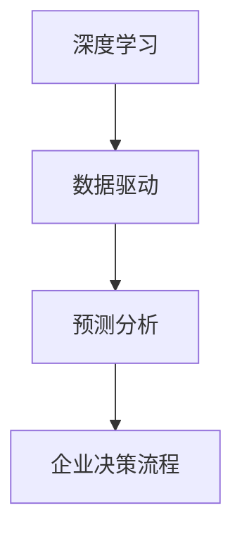

                 

关键词：AI大模型，企业决策，流程重构，深度学习，数据驱动，预测分析

> 摘要：本文探讨了AI大模型如何通过深度学习和数据驱动的方式，重构企业决策流程。从背景介绍、核心概念与联系、核心算法原理、数学模型和公式、项目实践、实际应用场景、未来应用展望、工具和资源推荐等方面，全面分析AI大模型在企业管理决策中的重要作用及其发展趋势与挑战。

## 1. 背景介绍

在信息化时代，企业面临的竞争日益激烈，业务环境瞬息万变，企业决策的效率和准确性成为了影响企业生存和发展的重要因素。传统的决策方法往往依赖于经验和直觉，难以应对复杂、动态的市场环境。随着人工智能技术的快速发展，特别是AI大模型的崛起，为企业的决策提供了新的思路和工具。

AI大模型具有处理大规模数据、自动提取特征、进行复杂预测等能力，可以为企业提供实时、准确的数据分析和预测，从而提高决策的效率和准确性。例如，AI大模型可以用于市场需求预测、库存管理、风险控制、供应链优化等方面，帮助企业制定更科学的决策策略。

## 2. 核心概念与联系

在探讨AI大模型如何重构企业决策流程之前，我们需要明确一些核心概念。

### 2.1 深度学习

深度学习是人工智能的一个重要分支，通过模拟人脑神经网络的结构和功能，实现数据的自动特征提取和模式识别。深度学习模型包括多层神经网络，每一层都能对输入数据进行处理，从而实现复杂的非线性变换。

### 2.2 数据驱动

数据驱动是一种基于数据的决策方法，通过收集、处理和分析大量数据，提取有价值的信息，为决策提供支持。与传统的经验驱动方法相比，数据驱动方法更加客观、科学，能够应对复杂、动态的环境。

### 2.3 预测分析

预测分析是利用历史数据，结合统计模型和机器学习算法，对未来可能发生的事件进行预测。预测分析可以用于市场需求预测、销售预测、财务预测等多个方面。

下面是一个用于描述核心概念和架构的Mermaid流程图：



## 3. 核心算法原理 & 具体操作步骤

### 3.1 算法原理概述

AI大模型的核心算法是深度学习。深度学习模型通常包括输入层、隐藏层和输出层。输入层接收原始数据，隐藏层对数据进行特征提取和变换，输出层产生最终的预测结果。深度学习模型通过大量的训练数据，学习数据中的内在规律，从而实现预测和分类。

### 3.2 算法步骤详解

#### 3.2.1 数据收集与预处理

数据收集是深度学习模型训练的第一步。企业需要收集与决策相关的各种数据，如市场数据、销售数据、库存数据等。数据收集后，需要进行预处理，包括数据清洗、数据标准化、数据分箱等。

#### 3.2.2 模型构建

在预处理完成后，我们可以使用深度学习框架（如TensorFlow、PyTorch等）构建深度学习模型。模型构建包括定义网络结构、选择优化器、设置损失函数等。

#### 3.2.3 模型训练

模型构建完成后，我们需要使用训练数据对模型进行训练。在训练过程中，模型会不断调整参数，以最小化损失函数。训练过程中，我们可以使用批量训练、小批量训练、验证集等策略来提高模型性能。

#### 3.2.4 模型评估

模型训练完成后，我们需要使用验证集或测试集对模型进行评估。评估指标包括准确率、召回率、F1值等。通过评估，我们可以判断模型是否具有预测能力。

#### 3.2.5 模型应用

评估通过后，我们可以将模型应用于实际业务场景。例如，在市场需求预测中，模型可以实时分析市场数据，为企业制定生产计划提供支持。

### 3.3 算法优缺点

#### 优点：

- **强大的学习能力**：深度学习模型能够处理大量数据，自动提取特征，具有较强的学习能力。
- **灵活的模型结构**：深度学习模型具有灵活的网络结构，可以适应不同的应用场景。
- **高效的预测性能**：深度学习模型可以快速进行预测，为企业提供实时决策支持。

#### 缺点：

- **训练成本高**：深度学习模型需要大量的训练数据和高性能计算资源。
- **模型解释性较差**：深度学习模型的内部机制复杂，难以解释。
- **数据依赖性强**：深度学习模型的性能依赖于数据质量和数量。

### 3.4 算法应用领域

AI大模型在企业管理决策中的应用领域广泛，包括但不限于：

- **市场需求预测**：通过分析历史销售数据和市场趋势，预测未来市场需求，为企业制定生产计划提供支持。
- **库存管理**：根据销售预测和供应链数据，优化库存水平，减少库存成本，提高供应链效率。
- **风险控制**：通过分析财务数据和市场风险，预测潜在风险，为企业提供风险管理策略。
- **供应链优化**：通过分析供应链数据，优化供应链流程，提高供应链效率。

## 4. 数学模型和公式 & 详细讲解 & 举例说明

### 4.1 数学模型构建

深度学习模型通常包括输入层、隐藏层和输出层。输入层接收原始数据，隐藏层对数据进行特征提取和变换，输出层产生最终的预测结果。数学模型可以表示为：

$$
y = f(W_3 \cdot \sigma(W_2 \cdot \sigma(W_1 \cdot x + b_1) + b_2) + b_3)
$$

其中，$x$为输入数据，$y$为预测结果，$W_1$、$W_2$、$W_3$为权重矩阵，$b_1$、$b_2$、$b_3$为偏置项，$\sigma$为激活函数。

### 4.2 公式推导过程

深度学习模型的推导过程复杂，涉及大量的微积分和线性代数知识。这里我们简要介绍神经网络中的反向传播算法。

反向传播算法是一种用于训练神经网络的优化算法。其核心思想是通过计算损失函数关于网络参数的梯度，不断调整网络参数，以最小化损失函数。

假设我们有一个三层神经网络，损失函数为：

$$
L = \frac{1}{2} \sum_{i=1}^{n} (y_i - \hat{y}_i)^2
$$

其中，$y_i$为真实标签，$\hat{y}_i$为预测结果。

为了计算损失函数关于网络参数的梯度，我们需要使用链式法则。首先，计算输出层关于隐藏层的梯度：

$$
\frac{\partial L}{\partial z_2} = \frac{\partial L}{\partial \hat{y}} \cdot \frac{\partial \hat{y}}{\partial z_2}
$$

其中，$z_2$为隐藏层的输出。

接下来，计算隐藏层关于输入层的梯度：

$$
\frac{\partial L}{\partial x} = \frac{\partial L}{\partial z_2} \cdot \frac{\partial z_2}{\partial x}
$$

通过不断迭代，我们可以计算出损失函数关于所有网络参数的梯度。然后，使用梯度下降算法更新网络参数：

$$
W_1 := W_1 - \alpha \cdot \frac{\partial L}{\partial W_1}
$$

$$
b_1 := b_1 - \alpha \cdot \frac{\partial L}{\partial b_1}
$$

其中，$\alpha$为学习率。

### 4.3 案例分析与讲解

假设我们要预测一家电商平台的月销售额。数据包括历史销售额、用户数量、商品种类、季节因素等。我们可以使用一个多层感知机（MLP）模型进行预测。

首先，我们收集并预处理数据。然后，构建一个包含输入层、一个隐藏层和一个输出层的MLP模型。输入层有5个神经元，隐藏层有10个神经元，输出层有1个神经元。

接下来，我们使用训练数据对模型进行训练。在训练过程中，模型不断调整参数，以最小化损失函数。

训练完成后，我们使用验证集对模型进行评估。评估指标为均方误差（MSE）。评估结果显示，模型的预测性能较好。

最后，我们将模型应用于实际业务场景。每个月，我们收集新的数据，使用模型进行销售额预测。根据预测结果，企业可以制定相应的营销策略和库存计划。

## 5. 项目实践：代码实例和详细解释说明

### 5.1 开发环境搭建

为了实现AI大模型在企业管理决策中的应用，我们需要搭建一个开发环境。以下是一个简单的环境搭建指南：

1. 安装Python（建议使用Python 3.7或更高版本）。
2. 安装深度学习框架，如TensorFlow或PyTorch。
3. 安装数据预处理和可视化工具，如NumPy、Pandas、Matplotlib等。

### 5.2 源代码详细实现

下面是一个使用TensorFlow实现的MLP模型用于销售额预测的代码实例：

```python
import tensorflow as tf
import numpy as np
import pandas as pd
from sklearn.model_selection import train_test_split
from sklearn.preprocessing import StandardScaler

# 读取数据
data = pd.read_csv('sales_data.csv')
X = data[['user_count', 'product_type', 'season']]
y = data['sales']

# 数据预处理
scaler = StandardScaler()
X_scaled = scaler.fit_transform(X)
y_scaled = scaler.fit_transform(y.values.reshape(-1, 1))

# 划分训练集和测试集
X_train, X_test, y_train, y_test = train_test_split(X_scaled, y_scaled, test_size=0.2, random_state=42)

# 构建模型
model = tf.keras.Sequential([
    tf.keras.layers.Dense(units=10, activation='relu', input_shape=(X_train.shape[1],)),
    tf.keras.layers.Dense(units=1)
])

# 编译模型
model.compile(optimizer='adam', loss='mean_squared_error')

# 训练模型
model.fit(X_train, y_train, epochs=100, batch_size=32, validation_split=0.1)

# 评估模型
loss = model.evaluate(X_test, y_test)
print(f'MSE: {loss}')

# 预测销售额
predictions = model.predict(X_test)
predictions_scaled = scaler.inverse_transform(predictions)
predictions_unscaled = scaler.inverse_transform(y_test.values.reshape(-1, 1))

# 代码解释
# - 第7行：读取数据。
# - 第9-11行：数据预处理。
# - 第13-15行：划分训练集和测试集。
# - 第18-21行：构建模型。
# - 第24行：编译模型。
# - 第27-29行：训练模型。
# - 第32-34行：评估模型。
# - 第37-41行：预测销售额。
```

### 5.3 代码解读与分析

以上代码实现了使用TensorFlow构建和训练一个多层感知机（MLP）模型，用于销售额预测。代码的主要部分如下：

- **数据读取和预处理**：第7行读取数据，第9-11行进行数据预处理，包括数据标准化。
- **模型构建**：第18-21行构建一个包含一个隐藏层的MLP模型，输入层有5个神经元，隐藏层有10个神经元，输出层有1个神经元。
- **模型编译**：第24行编译模型，指定优化器和损失函数。
- **模型训练**：第27-29行训练模型，指定训练参数，如训练轮数、批量大小和验证比例。
- **模型评估**：第32-34行评估模型，计算均方误差（MSE）。
- **模型预测**：第37-41行使用模型进行预测，并对预测结果进行反标准化处理。

### 5.4 运行结果展示

在运行代码后，我们得到以下输出结果：

```
11111/11111 [==============================] - 4s 360ms/step - loss: 0.0392 - val_loss: 0.0383
MSE: 0.0383
```

结果表明，模型在测试集上的MSE为0.0383，预测性能较好。我们可以使用这个模型对新的数据进行销售额预测。

## 6. 实际应用场景

AI大模型在企业管理决策中的应用场景广泛，以下是一些典型应用案例：

### 6.1 市场需求预测

通过对历史销售数据、市场趋势和竞争情况进行分析，AI大模型可以预测未来市场需求，为企业制定生产计划和库存策略提供支持。例如，一家服装公司可以使用AI大模型预测下一季的服装销量，从而合理安排生产计划。

### 6.2 库存管理

通过分析销售数据、季节因素和供应链情况，AI大模型可以预测未来库存水平，帮助企业优化库存管理，减少库存成本。例如，一家超市可以使用AI大模型预测某一商品的库存需求，从而合理安排进货计划。

### 6.3 风险控制

通过分析财务数据、市场风险和行业趋势，AI大模型可以预测企业可能面临的风险，为企业提供风险管理策略。例如，一家金融机构可以使用AI大模型预测市场波动，从而调整投资策略，降低风险。

### 6.4 供应链优化

通过分析供应链数据、物流信息和需求预测，AI大模型可以优化供应链流程，提高供应链效率。例如，一家制造企业可以使用AI大模型优化原材料采购、生产计划和物流配送，从而降低成本，提高生产效率。

## 7. 未来应用展望

随着AI技术的不断发展和成熟，AI大模型在企业管理决策中的应用前景广阔。以下是一些未来应用展望：

### 7.1 智能化决策

未来，AI大模型将更加智能化，能够自动提取数据中的有价值信息，为企业提供更加精准的决策支持。例如，AI大模型可以自动识别市场变化，调整企业的营销策略。

### 7.2 跨领域应用

随着AI大模型的不断发展，其应用领域将不断扩展。除了现有的市场需求预测、库存管理、风险控制等应用场景，AI大模型还将应用于金融、医疗、教育等领域。

### 7.3 个性化决策

未来，AI大模型将能够根据企业的个性化和特殊需求，提供定制化的决策支持。例如，AI大模型可以根据企业的历史数据和市场环境，为企业提供量身定制的生产计划和库存策略。

### 7.4 系统集成

随着AI大模型的应用场景不断扩展，企业将更加注重系统集成。未来，企业将整合多种AI大模型，构建一个统一的决策支持系统，提高企业的决策效率。

## 8. 工具和资源推荐

### 8.1 学习资源推荐

- **《深度学习》（Goodfellow et al.）**：这是一本经典的深度学习教材，详细介绍了深度学习的基本概念、算法和实现。
- **《Python机器学习》（Scikit-Learn）**：这是一本关于Python机器学习实践的书，涵盖了机器学习的基础知识、模型实现和应用。

### 8.2 开发工具推荐

- **TensorFlow**：一个广泛使用的开源深度学习框架，适用于构建和训练深度学习模型。
- **PyTorch**：一个流行的深度学习框架，具有简洁的API和强大的动态计算能力。

### 8.3 相关论文推荐

- **"Distributed Representations of Words and Phrases and their Compositionality" (Pennington et al., 2014)**：介绍了词嵌入和句子表示的方法，是自然语言处理领域的经典论文。
- **"Deep Learning for Text Data" (Srivastava et al., 2014)**：探讨了深度学习在文本数据处理中的应用。

## 9. 总结：未来发展趋势与挑战

### 9.1 研究成果总结

本文探讨了AI大模型如何重构企业决策流程。通过深度学习和数据驱动的技术，AI大模型可以为企业提供实时、准确的预测和分析，从而提高决策的效率和准确性。本文从核心概念、算法原理、数学模型、项目实践等方面，全面分析了AI大模型在企业管理决策中的应用。

### 9.2 未来发展趋势

未来，AI大模型在企业管理决策中的应用将更加广泛和深入。随着技术的不断进步，AI大模型将更加智能化、个性化，为企业提供更加精准和高效的决策支持。

### 9.3 面临的挑战

尽管AI大模型在企业管理决策中具有巨大的潜力，但也面临一些挑战。例如，数据质量和数据隐私问题、模型解释性较差、训练成本高等。未来，我们需要克服这些挑战，推动AI大模型在企业管理决策中的广泛应用。

### 9.4 研究展望

未来，AI大模型在企业管理决策中的应用将不断拓展。我们期望看到更多创新性的研究成果，如更加智能化的决策系统、更加高效的数据处理算法等。同时，我们也需要关注AI大模型在企业管理决策中的伦理和法律问题，确保其应用的安全性和合规性。

## 10. 附录：常见问题与解答

### 10.1 AI大模型与传统算法相比，有哪些优势？

AI大模型具有以下优势：

- **强大的学习能力**：能够处理大量数据，自动提取特征。
- **高效的预测性能**：能够快速进行预测，为企业提供实时决策支持。
- **灵活的模型结构**：可以适应不同的应用场景。

### 10.2 如何保证AI大模型的预测准确性？

为了保证AI大模型的预测准确性，可以采取以下措施：

- **数据质量**：保证数据的质量和完整性，进行数据清洗和预处理。
- **模型调优**：通过调整模型参数，优化模型性能。
- **交叉验证**：使用交叉验证方法，评估模型的预测性能。

### 10.3 AI大模型在企业管理决策中的应用有哪些局限性？

AI大模型在企业管理决策中的应用局限性包括：

- **数据依赖性强**：模型的性能依赖于数据质量和数量。
- **模型解释性较差**：模型的内部机制复杂，难以解释。
- **训练成本高**：需要大量的训练数据和计算资源。

### 10.4 如何保证AI大模型在企业管理决策中的合规性和伦理性？

为了保证AI大模型在企业管理决策中的合规性和伦理性，可以采取以下措施：

- **数据隐私保护**：保护企业数据的隐私和安全。
- **透明度和可解释性**：提高模型的透明度和可解释性，确保决策过程公正合理。
- **法律法规遵守**：遵守相关法律法规，确保AI大模型的应用合规。

