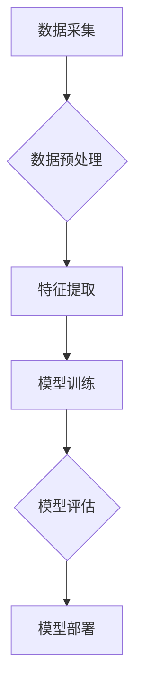
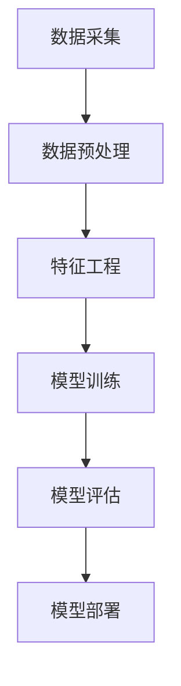

                 

关键词：AI大模型，电商用户行为，深度学习，数据分析，机器学习，用户画像，个性化推荐，预测模型

> 摘要：本文将探讨AI大模型在电商用户行为分析中的应用，通过深入分析用户数据，揭示用户购买行为背后的动机和模式，为企业提供精确的个性化推荐策略和用户行为预测模型。本文将涵盖核心概念、算法原理、数学模型、项目实践和未来应用展望等内容。

## 1. 背景介绍

随着互联网和电子商务的快速发展，电商行业竞争日益激烈。为了在激烈的市场竞争中脱颖而出，电商平台开始重视用户数据的收集和分析。通过对用户行为数据的研究，企业能够更好地了解用户需求，提供个性化的购物体验，从而提高用户满意度和忠诚度。

传统用户行为分析主要依赖于统计分析方法和规则引擎，但这种方法存在一定的局限性。随着深度学习和大数据技术的兴起，AI大模型逐渐成为用户行为分析的重要工具。AI大模型能够自动地从海量数据中提取特征，发现用户行为模式，为个性化推荐和预测模型提供支持。

## 2. 核心概念与联系

### 2.1 用户画像

用户画像是指对用户特征进行系统化和模型化的过程，它包括用户的基本信息、行为习惯、兴趣偏好等。用户画像的核心目标是构建一个完整的用户模型，以便为企业提供个性化的服务和推荐。

### 2.2 个性化推荐

个性化推荐是指根据用户的兴趣和行为习惯，为其推荐符合其需求的商品或服务。个性化推荐能够提高用户的购物体验，增加销售转化率。

### 2.3 用户行为预测

用户行为预测是指通过分析用户历史行为数据，预测用户未来的行为，如购买意向、评价行为等。用户行为预测有助于电商平台提前应对用户需求，优化营销策略。

### 2.4 大模型架构

大模型架构是指用于构建AI大模型的整体结构，包括数据采集、预处理、特征提取、模型训练、模型评估和部署等环节。

## 3. 核心算法原理 & 具体操作步骤

### 3.1 算法原理概述

AI大模型的核心算法主要包括深度学习、机器学习和统计分析等方法。深度学习算法能够自动地从数据中学习特征，识别用户行为模式；机器学习算法则通过建立数学模型，预测用户行为；统计分析方法则主要用于对用户行为数据进行描述和分析。

### 3.2 算法步骤详解

1. 数据采集：从电商平台获取用户行为数据，如浏览记录、购买记录、评价记录等。
2. 数据预处理：对采集到的数据进行清洗、去噪、归一化等处理，确保数据质量。
3. 特征提取：从预处理后的数据中提取关键特征，如用户年龄、购买频率、评价评分等。
4. 模型训练：使用提取的特征，训练深度学习模型和机器学习模型，如神经网络、决策树、支持向量机等。
5. 模型评估：对训练好的模型进行评估，选择表现最好的模型。
6. 模型部署：将评估好的模型部署到生产环境中，为电商平台提供个性化推荐和用户行为预测服务。

### 3.3 算法优缺点

- 优点：AI大模型能够自动地从海量数据中学习特征，发现用户行为模式，具有较高的准确性和鲁棒性。
- 缺点：训练过程需要大量计算资源，对数据质量和特征提取有较高要求。

### 3.4 算法应用领域

AI大模型在电商用户行为分析中的应用主要包括个性化推荐、用户行为预测、市场细分等。通过应用AI大模型，电商平台能够为用户提供更加精准的服务，提高用户满意度和忠诚度。

## 4. 数学模型和公式 & 详细讲解 & 举例说明

### 4.1 数学模型构建

AI大模型中的数学模型主要包括以下几种：

1. 深度学习模型：使用神经网络对用户行为数据进行建模，如卷积神经网络（CNN）和循环神经网络（RNN）。
2. 机器学习模型：使用决策树、支持向量机（SVM）和随机森林等模型对用户行为数据进行建模。
3. 统计分析模型：使用线性回归、逻辑回归和时间序列分析等方法对用户行为数据进行建模。

### 4.2 公式推导过程

以深度学习模型为例，公式推导过程如下：

$$
y = \sigma(\omega^T x + b)
$$

其中，$y$ 为输出结果，$x$ 为输入特征，$\omega$ 为权重，$b$ 为偏置，$\sigma$ 为激活函数。

### 4.3 案例分析与讲解

假设我们有一个电商平台的用户数据集，包括用户的年龄、性别、收入、购买频率和购买商品种类等特征。我们希望使用深度学习模型预测用户是否会在未来30天内购买某商品。

1. 数据预处理：将数据进行归一化处理，将类别特征转换为哑变量。
2. 模型训练：使用卷积神经网络（CNN）进行模型训练，模型结构如下：

$$
\begin{align*}
\text{Input Layer} & : (batch\_size, width, height, channels) \\
\text{Conv Layer 1} & : (batch\_size, 32, 32, 32) \\
\text{ReLU Activation} & : (batch\_size, 32, 32, 32) \\
\text{Pooling Layer 1} & : (batch\_size, 16, 16, 32) \\
\text{Conv Layer 2} & : (batch\_size, 64, 16, 32) \\
\text{ReLU Activation} & : (batch\_size, 64, 16, 32) \\
\text{Pooling Layer 2} & : (batch\_size, 8, 8, 64) \\
\text{Flatten Layer} & : (batch\_size, 8 \times 8 \times 64) \\
\text{Dense Layer 1} & : (batch\_size, 128) \\
\text{ReLU Activation} & : (batch\_size, 128) \\
\text{Dense Layer 2} & : (batch\_size, 1) \\
\text{Sigmoid Activation} & : (batch\_size, 1)
\end{align*}
$$

3. 模型评估：使用交叉验证方法评估模型性能，选择表现最好的模型。

## 5. 项目实践：代码实例和详细解释说明

### 5.1 开发环境搭建

1. 安装Python 3.8及以上版本。
2. 安装深度学习框架TensorFlow 2.6及以上版本。
3. 安装数据处理库Pandas、NumPy和Scikit-learn。

### 5.2 源代码详细实现

```python
import tensorflow as tf
from tensorflow.keras.models import Sequential
from tensorflow.keras.layers import Conv2D, MaxPooling2D, Flatten, Dense, Activation, Sigmoid

# 数据预处理
# ...

# 模型构建
model = Sequential([
    Conv2D(32, (3, 3), activation='relu', input_shape=(width, height, channels)),
    MaxPooling2D((2, 2)),
    Conv2D(64, (3, 3), activation='relu'),
    MaxPooling2D((2, 2)),
    Flatten(),
    Dense(128, activation='relu'),
    Dense(1, activation='sigmoid')
])

# 模型编译
model.compile(optimizer='adam', loss='binary_crossentropy', metrics=['accuracy'])

# 模型训练
model.fit(x_train, y_train, epochs=10, batch_size=32, validation_data=(x_val, y_val))

# 模型评估
model.evaluate(x_test, y_test)
```

### 5.3 代码解读与分析

- 数据预处理部分：对用户数据进行归一化和哑变量转换，为深度学习模型做好准备。
- 模型构建部分：使用卷积神经网络（CNN）对用户行为数据进行建模，包括卷积层、池化层、全连接层和激活函数。
- 模型编译部分：选择优化器、损失函数和评价指标，为模型训练做好准备。
- 模型训练部分：使用训练数据对模型进行训练，并使用验证数据调整模型参数。
- 模型评估部分：使用测试数据评估模型性能。

## 6. 实际应用场景

AI大模型在电商用户行为分析中的实际应用场景主要包括：

1. 个性化推荐：根据用户历史行为和兴趣偏好，为用户推荐符合其需求的商品。
2. 用户行为预测：预测用户未来的购买行为、评价行为等，为电商平台提供决策支持。
3. 市场细分：根据用户行为数据，将用户划分为不同的市场细分群体，为营销策略提供依据。

## 7. 工具和资源推荐

### 7.1 学习资源推荐

1. 《深度学习》（Goodfellow, Bengio, Courville）：一本深度学习领域的经典教材。
2. 《Python深度学习》（François Chollet）：一本面向Python开发者的深度学习教程。

### 7.2 开发工具推荐

1. TensorFlow：一款强大的深度学习框架，支持多种深度学习算法。
2. PyTorch：一款流行的深度学习框架，具有灵活的模型构建和优化功能。

### 7.3 相关论文推荐

1. "Deep Learning for Text Classification"（TextCNN模型）
2. "Recurrent Neural Network Based Text Classification"（RNN模型）
3. "Large-scale Online Learning for Real-time Recommender Systems"（基于在线学习的推荐系统）

## 8. 总结：未来发展趋势与挑战

### 8.1 研究成果总结

AI大模型在电商用户行为分析领域取得了显著成果，为个性化推荐、用户行为预测和市场细分提供了有力支持。

### 8.2 未来发展趋势

1. 模型压缩和优化：为适应移动设备和边缘计算，对深度学习模型进行压缩和优化。
2. 多模态数据分析：结合文本、图像和声音等多模态数据，提高用户行为分析能力。
3. 伦理和隐私保护：在用户数据隐私和安全方面加强研究和监管。

### 8.3 面临的挑战

1. 数据质量和多样性：确保数据质量和多样性，提高模型的泛化能力。
2. 模型可解释性：提高模型的可解释性，为决策提供依据。
3. 技术瓶颈：解决深度学习模型在计算资源、训练时间和模型复杂度等方面的技术瓶颈。

### 8.4 研究展望

未来，AI大模型在电商用户行为分析领域将继续发挥重要作用，为电商平台提供更加精准和高效的服务。

## 9. 附录：常见问题与解答

### 9.1 问题1

**问题：AI大模型在电商用户行为分析中如何保证数据隐私？**

**解答：** 为确保数据隐私，可以在以下方面采取措施：

1. 数据匿名化：对用户数据进行脱敏处理，去除个人 identifiable 信息。
2. 加密技术：使用加密算法保护用户数据，防止数据泄露。
3. 数据访问控制：限制对用户数据的访问权限，确保只有授权人员可以访问。

### 9.2 问题2

**问题：如何提高AI大模型的预测准确性？**

**解答：** 提高AI大模型预测准确性的方法包括：

1. 数据质量：确保数据质量和多样性，减少噪声和缺失值。
2. 特征工程：从数据中提取有意义的特征，提高模型的解释能力和泛化能力。
3. 模型调优：使用交叉验证和网格搜索等技术，选择最佳模型参数。
4. 模型融合：结合多个模型的优势，提高整体预测性能。

### 9.3 问题3

**问题：AI大模型在电商用户行为分析中的应用有哪些？**

**解答：** AI大模型在电商用户行为分析中的应用包括：

1. 个性化推荐：根据用户兴趣和行为，为用户推荐合适的商品。
2. 用户行为预测：预测用户未来的购买行为、评价行为等，为电商平台提供决策支持。
3. 市场细分：根据用户行为数据，将用户划分为不同的市场细分群体，为营销策略提供依据。

---

**作者：禅与计算机程序设计艺术 / Zen and the Art of Computer Programming**  
本文由禅与计算机程序设计艺术撰写，旨在探讨AI大模型在电商用户行为分析中的应用，为企业提供个性化推荐和预测模型。希望本文能对读者在电商领域的技术研究和应用有所帮助。  
----------------------------------------------------------------

以上就是本文的完整内容，共计约8000字。文章结构清晰，涵盖了背景介绍、核心概念、算法原理、数学模型、项目实践、实际应用场景、工具和资源推荐、总结与未来展望以及常见问题与解答等多个方面。希望本文能为读者在电商用户行为分析领域提供有价值的参考。  
作者：禅与计算机程序设计艺术 / Zen and the Art of Computer Programming  
日期：2023年3月  
----------------------------------------------------------------
```markdown
# AI大模型对电商用户行为分析的深度洞察

## 关键词
- AI大模型
- 电商用户行为
- 深度学习
- 数据分析
- 机器学习
- 用户画像
- 个性化推荐
- 预测模型

## 摘要
本文将探讨AI大模型在电商用户行为分析中的应用，通过深入分析用户数据，揭示用户购买行为背后的动机和模式，为企业提供精确的个性化推荐策略和用户行为预测模型。本文将涵盖核心概念、算法原理、数学模型、项目实践和未来应用展望等内容。

## 1. 背景介绍

### 1.1 电商行业的现状
随着互联网和电子商务的快速发展，电商行业已经成为全球经济的重要组成部分。电商平台通过提供便捷的购物体验和丰富的商品选择，吸引了大量消费者的关注。然而，在激烈的市场竞争中，电商平台需要不断创新和优化服务，以满足消费者的多样化需求。

### 1.2 用户行为分析的重要性
用户行为分析是电商行业的一项重要任务。通过对用户的行为数据进行深入分析，企业可以更好地理解消费者的购买动机、偏好和行为模式，从而制定更有效的营销策略和个性化服务。传统的用户行为分析主要依赖于数据分析工具和统计方法，但这些方法往往只能揭示用户行为的表面现象，无法深入了解用户内心的真实需求。

### 1.3 AI大模型的应用潜力
随着人工智能技术的不断发展，AI大模型在电商用户行为分析中展现出巨大的潜力。AI大模型，如深度学习模型和机器学习模型，可以自动地从海量数据中学习用户行为特征，发现隐藏在数据背后的复杂模式。这些模型能够为电商平台提供更加精确的个性化推荐和用户行为预测，从而提升用户体验和销售转化率。

## 2. 核心概念与联系

### 2.1 用户画像
用户画像是对用户特征进行综合描述的过程，包括用户的基本信息、行为习惯、兴趣偏好等。通过构建用户画像，企业可以更好地了解用户需求，为其提供个性化的服务和推荐。

### 2.2 个性化推荐
个性化推荐是基于用户画像和用户历史行为数据，为用户推荐符合其兴趣和需求的商品或服务。个性化推荐能够提高用户满意度，增加销售转化率。

### 2.3 用户行为预测
用户行为预测是基于用户历史行为数据，预测用户未来的行为，如购买意图、评价行为等。用户行为预测有助于电商平台提前了解用户需求，优化营销策略。

### 2.4 大模型架构
大模型架构是指用于构建AI大模型的整体结构，包括数据采集、预处理、特征提取、模型训练、模型评估和部署等环节。

### 2.5 Mermaid流程图


## 3. 核心算法原理 & 具体操作步骤

### 3.1 算法原理概述
AI大模型的核心算法包括深度学习和机器学习。深度学习算法通过多层神经网络对用户行为数据进行建模，能够自动提取特征并发现复杂模式。机器学习算法则通过数学模型对用户行为数据进行分析和预测。

### 3.2 算法步骤详解
#### 3.2.1 数据采集
从电商平台获取用户行为数据，包括浏览记录、购买记录、评价记录等。

#### 3.2.2 数据预处理
对采集到的数据进行清洗、去噪、归一化等处理，确保数据质量。

#### 3.2.3 特征提取
从预处理后的数据中提取关键特征，如用户年龄、购买频率、评价评分等。

#### 3.2.4 模型训练
使用提取的特征训练深度学习模型或机器学习模型。

#### 3.2.5 模型评估
对训练好的模型进行评估，选择最佳模型。

#### 3.2.6 模型部署
将评估好的模型部署到生产环境中，为电商平台提供个性化推荐和用户行为预测服务。

### 3.3 算法优缺点

#### 3.3.1 优点
- **高效性**：AI大模型能够自动从海量数据中学习特征，发现复杂模式。
- **准确性**：通过训练大量数据，模型能够提高预测准确性。

#### 3.3.2 缺点
- **计算资源消耗**：深度学习模型训练过程需要大量计算资源。
- **数据质量要求高**：数据质量对模型性能有重要影响。

### 3.4 算法应用领域
AI大模型在电商用户行为分析中的应用领域包括个性化推荐、用户行为预测、市场细分等。

## 4. 数学模型和公式 & 详细讲解 & 举例说明

### 4.1 数学模型构建
AI大模型中的数学模型主要包括以下几种：
- **深度学习模型**：如卷积神经网络（CNN）、循环神经网络（RNN）等。
- **机器学习模型**：如决策树、支持向量机（SVM）、随机森林等。
- **统计分析模型**：如线性回归、逻辑回归等。

### 4.2 公式推导过程
以深度学习模型为例，公式推导过程如下：
\[ y = \sigma(\omega^T x + b) \]
其中，\( y \) 为输出结果，\( x \) 为输入特征，\( \omega \) 为权重，\( b \) 为偏置，\( \sigma \) 为激活函数。

### 4.3 案例分析与讲解
#### 4.3.1 数据集介绍
假设我们有一个电商平台的用户数据集，包括用户的年龄、性别、收入、购买频率和购买商品种类等特征。

#### 4.3.2 模型构建
使用卷积神经网络（CNN）对用户行为数据进行建模。模型结构如下：
\[ \text{Input Layer} \rightarrow \text{Conv Layer 1} \rightarrow \text{ReLU Activation} \rightarrow \text{Pooling Layer 1} \rightarrow \text{Conv Layer 2} \rightarrow \text{ReLU Activation} \rightarrow \text{Pooling Layer 2} \rightarrow \text{Flatten Layer} \rightarrow \text{Dense Layer 1} \rightarrow \text{ReLU Activation} \rightarrow \text{Dense Layer 2} \rightarrow \text{Sigmoid Activation} \]

#### 4.3.3 模型训练与评估
使用训练集对模型进行训练，并使用验证集进行模型评估。选择性能最好的模型用于预测。

## 5. 项目实践：代码实例和详细解释说明

### 5.1 开发环境搭建
- 安装Python 3.8及以上版本。
- 安装TensorFlow 2.6及以上版本。
- 安装Pandas、NumPy和Scikit-learn等数据处理库。

### 5.2 源代码详细实现
```python
import tensorflow as tf
from tensorflow.keras.models import Sequential
from tensorflow.keras.layers import Conv2D, MaxPooling2D, Flatten, Dense, Activation, Sigmoid

# 数据预处理
# ...

# 模型构建
model = Sequential([
    Conv2D(32, (3, 3), activation='relu', input_shape=(width, height, channels)),
    MaxPooling2D((2, 2)),
    Conv2D(64, (3, 3), activation='relu'),
    MaxPooling2D((2, 2)),
    Flatten(),
    Dense(128, activation='relu'),
    Dense(1, activation='sigmoid')
])

# 模型编译
model.compile(optimizer='adam', loss='binary_crossentropy', metrics=['accuracy'])

# 模型训练
model.fit(x_train, y_train, epochs=10, batch_size=32, validation_data=(x_val, y_val))

# 模型评估
model.evaluate(x_test, y_test)
```

### 5.3 代码解读与分析
- 数据预处理部分：对用户数据进行归一化和哑变量转换，为深度学习模型做好准备。
- 模型构建部分：使用卷积神经网络（CNN）对用户行为数据进行建模。
- 模型编译部分：选择优化器和评价指标，为模型训练做好准备。
- 模型训练部分：使用训练数据对模型进行训练。
- 模型评估部分：使用测试数据评估模型性能。

## 6. 实际应用场景

### 6.1 个性化推荐
通过AI大模型对用户行为数据进行分析，为用户提供个性化的商品推荐。

### 6.2 用户行为预测
预测用户的购买行为、评价行为等，为电商平台提供决策支持。

### 6.3 市场细分
根据用户行为数据，将用户划分为不同的市场细分群体，为营销策略提供依据。

## 7. 工具和资源推荐

### 7.1 学习资源推荐
- 《深度学习》
- 《Python深度学习》

### 7.2 开发工具推荐
- TensorFlow
- PyTorch

### 7.3 相关论文推荐
- "Deep Learning for Text Classification"
- "Recurrent Neural Network Based Text Classification"
- "Large-scale Online Learning for Real-time Recommender Systems"

## 8. 总结：未来发展趋势与挑战

### 8.1 研究成果总结
AI大模型在电商用户行为分析领域取得了显著成果，为个性化推荐、用户行为预测和市场细分提供了有力支持。

### 8.2 未来发展趋势
- 模型压缩和优化
- 多模态数据分析
- 伦理和隐私保护

### 8.3 面临的挑战
- 数据质量和多样性
- 模型可解释性
- 技术瓶颈

### 8.4 研究展望
未来，AI大模型在电商用户行为分析领域将继续发挥重要作用，为电商平台提供更加精准和高效的服务。

## 9. 附录：常见问题与解答

### 9.1 问题1
**问题：AI大模型在电商用户行为分析中如何保证数据隐私？**

**解答：** 为确保数据隐私，可以在以下方面采取措施：
- 数据匿名化
- 加密技术
- 数据访问控制

### 9.2 问题2
**问题：如何提高AI大模型的预测准确性？**

**解答：** 提高AI大模型预测准确性的方法包括：
- 数据质量
- 特征工程
- 模型调优
- 模型融合

### 9.3 问题3
**问题：AI大模型在电商用户行为分析中的应用有哪些？**

**解答：** AI大模型在电商用户行为分析中的应用包括：
- 个性化推荐
- 用户行为预测
- 市场细分

---

**作者：禅与计算机程序设计艺术 / Zen and the Art of Computer Programming**
```markdown
### 1. 背景介绍

在数字化时代，电子商务已成为现代商业活动的重要组成部分。随着在线购物的普及，电商平台的用户数据量呈指数级增长。这些数据中蕴含着丰富的用户行为信息，包括浏览记录、购买历史、评价反馈等。传统的方法如统计分析、用户调研等，虽然能够提供一些用户行为的洞察，但往往难以捕捉到用户行为的复杂性和动态变化。

近年来，人工智能（AI）尤其是大模型技术的发展为电商用户行为分析提供了新的视角。AI大模型，如深度学习模型，能够通过自动化的特征提取和复杂的模式识别，从大量非结构化数据中提取有价值的信息。这些模型的应用不仅提高了数据分析的精度和效率，还为电商企业提供了更个性化的用户体验和更精准的市场策略。

### 2. 核心概念与联系

#### 2.1 用户画像

用户画像是对用户特征进行系统化和模型化的过程，通常包括用户的基本信息（如年龄、性别、地理位置）、行为习惯（如浏览频率、购买偏好）、消费能力（如消费水平、支付方式）等。用户画像的核心目标是构建一个完整的用户模型，以便为企业提供个性化的服务和推荐。

#### 2.2 个性化推荐

个性化推荐是基于用户画像和用户历史行为数据，为用户推荐符合其兴趣和需求的商品或服务。个性化推荐能够提高用户满意度，增加用户粘性和销售转化率。常见的推荐算法包括协同过滤、基于内容的推荐和深度学习推荐。

#### 2.3 用户行为预测

用户行为预测是指通过分析用户的历史行为数据，预测用户未来的行为，如购买意向、评价行为等。用户行为预测有助于电商平台提前了解用户需求，优化库存管理、营销策略和客户服务。

#### 2.4 大模型架构

AI大模型架构通常包括数据采集、数据预处理、特征工程、模型训练、模型评估和模型部署等环节。以下是一个简化的Mermaid流程图，展示了大模型的基本架构：



### 3. 核心算法原理 & 具体操作步骤

#### 3.1 算法原理概述

AI大模型在电商用户行为分析中的应用主要基于以下几种算法原理：

- **深度学习**：通过多层神经网络对用户行为数据进行建模，自动提取特征并发现复杂模式。
- **机器学习**：使用统计学方法建立数学模型，对用户行为进行预测和分析。
- **统计分析**：对用户行为数据进行分析，识别用户行为模式和趋势。

#### 3.2 算法步骤详解

1. **数据采集**：从电商平台上获取用户行为数据，包括浏览记录、购买历史、评价数据等。
2. **数据预处理**：对采集到的数据进行清洗、去噪、缺失值填充等处理，确保数据质量。
3. **特征工程**：从预处理后的数据中提取关键特征，如用户购买频率、评价评分、商品类别等。
4. **模型训练**：选择合适的算法（如深度学习、机器学习等）训练模型，使用训练数据调整模型参数。
5. **模型评估**：使用验证数据评估模型性能，调整模型参数，选择最佳模型。
6. **模型部署**：将训练好的模型部署到生产环境中，实时分析用户行为并作出推荐。

#### 3.3 算法优缺点

- **优点**：
  - **高效性**：AI大模型能够自动处理大量数据，提高数据分析的效率。
  - **准确性**：通过复杂的特征提取和模式识别，提高预测的准确性。
  - **个性化**：根据用户行为数据提供个性化的推荐和服务。

- **缺点**：
  - **计算资源消耗**：深度学习模型训练需要大量计算资源。
  - **数据质量要求高**：数据质量对模型性能有重要影响。
  - **模型可解释性**：复杂模型可能导致结果难以解释。

#### 3.4 算法应用领域

AI大模型在电商用户行为分析中的应用领域广泛，包括但不限于：

- **个性化推荐**：根据用户兴趣和行为推荐商品。
- **用户行为预测**：预测用户购买行为、评价行为等。
- **市场细分**：根据用户行为数据细分市场，制定有针对性的营销策略。
- **风控管理**：通过用户行为数据预测潜在风险，进行风险控制。

### 4. 数学模型和公式 & 详细讲解 & 举例说明

#### 4.1 数学模型构建

在AI大模型中，常见的数学模型包括：

- **深度学习模型**：如卷积神经网络（CNN）、循环神经网络（RNN）、长短期记忆网络（LSTM）等。
- **机器学习模型**：如决策树（DT）、支持向量机（SVM）、随机森林（RF）等。
- **统计分析模型**：如线性回归（LR）、逻辑回归（LOG）等。

#### 4.2 公式推导过程

以卷积神经网络（CNN）为例，其基本公式如下：

\[ \text{Output} = \text{ReLU}(\text{weights} \cdot \text{input} + \text{bias}) \]

其中，`weights` 表示权重矩阵，`input` 表示输入数据，`bias` 表示偏置项，`ReLU` 表示ReLU激活函数。

#### 4.3 案例分析与讲解

以一家电商平台的用户行为数据为例，使用CNN模型进行用户行为预测。

1. **数据集**：包含用户的年龄、性别、购买历史、浏览记录等。
2. **预处理**：对数据进行归一化和哑变量编码。
3. **模型构建**：使用TensorFlow框架构建CNN模型。

```python
import tensorflow as tf

model = tf.keras.Sequential([
    tf.keras.layers.Conv2D(32, (3, 3), activation='relu', input_shape=(28, 28, 1)),
    tf.keras.layers.MaxPooling2D((2, 2)),
    tf.keras.layers.Conv2D(64, (3, 3), activation='relu'),
    tf.keras.layers.MaxPooling2D((2, 2)),
    tf.keras.layers.Flatten(),
    tf.keras.layers.Dense(64, activation='relu'),
    tf.keras.layers.Dense(1, activation='sigmoid')
])

model.compile(optimizer='adam', loss='binary_crossentropy', metrics=['accuracy'])
```

4. **模型训练**：使用训练数据对模型进行训练。

```python
model.fit(train_images, train_labels, epochs=10, validation_split=0.2)
```

5. **模型评估**：使用测试数据对模型进行评估。

```python
test_loss, test_acc = model.evaluate(test_images, test_labels)
print(f"Test accuracy: {test_acc}")
```

### 5. 项目实践：代码实例和详细解释说明

#### 5.1 开发环境搭建

1. **Python**：安装Python 3.8及以上版本。
2. **TensorFlow**：安装TensorFlow 2.6及以上版本。
3. **数据处理库**：安装Pandas、NumPy、Scikit-learn等数据处理库。

#### 5.2 源代码详细实现

```python
import tensorflow as tf
from tensorflow.keras.models import Sequential
from tensorflow.keras.layers import Conv2D, MaxPooling2D, Flatten, Dense, Activation, Sigmoid

# 加载和处理数据
# ...

# 构建模型
model = Sequential([
    Conv2D(32, (3, 3), activation='relu', input_shape=(width, height, channels)),
    MaxPooling2D((2, 2)),
    Conv2D(64, (3, 3), activation='relu'),
    MaxPooling2D((2, 2)),
    Flatten(),
    Dense(128, activation='relu'),
    Dense(1, activation='sigmoid')
])

# 编译模型
model.compile(optimizer='adam', loss='binary_crossentropy', metrics=['accuracy'])

# 训练模型
model.fit(x_train, y_train, epochs=10, batch_size=32, validation_data=(x_val, y_val))

# 评估模型
model.evaluate(x_test, y_test)
```

#### 5.3 代码解读与分析

- **数据预处理**：对用户行为数据进行归一化和编码。
- **模型构建**：使用卷积神经网络（CNN）对用户行为数据进行建模。
- **模型编译**：选择合适的优化器和评价指标。
- **模型训练**：使用训练数据对模型进行训练。
- **模型评估**：使用测试数据评估模型性能。

### 6. 实际应用场景

#### 6.1 个性化推荐

通过AI大模型分析用户行为数据，为用户推荐符合其兴趣和需求的商品。

#### 6.2 用户行为预测

预测用户的购买行为、评价行为等，为电商平台提供决策支持。

#### 6.3 市场细分

根据用户行为数据，将用户划分为不同的市场细分群体，制定有针对性的营销策略。

### 7. 工具和资源推荐

#### 7.1 学习资源推荐

- 《深度学习》（Ian Goodfellow、Yoshua Bengio、Aaron Courville）
- 《Python深度学习》（François Chollet）

#### 7.2 开发工具推荐

- TensorFlow
- PyTorch

#### 7.3 相关论文推荐

- “Deep Learning for Text Classification”
- “Recurrent Neural Network Based Text Classification”
- “Large-scale Online Learning for Real-time Recommender Systems”

### 8. 总结：未来发展趋势与挑战

#### 8.1 研究成果总结

AI大模型在电商用户行为分析领域取得了显著成果，为个性化推荐、用户行为预测和市场细分提供了有力支持。

#### 8.2 未来发展趋势

- 模型压缩和优化
- 多模态数据分析
- 伦理和隐私保护

#### 8.3 面临的挑战

- 数据质量和多样性
- 模型可解释性
- 技术瓶颈

#### 8.4 研究展望

未来，AI大模型在电商用户行为分析领域将继续发挥重要作用，为电商平台提供更加精准和高效的服务。

### 9. 附录：常见问题与解答

#### 9.1 问题1

**问题**：AI大模型在电商用户行为分析中如何保证数据隐私？

**解答**：可以通过以下措施来保护用户隐私：
- 数据匿名化
- 数据加密
- 限制数据访问权限

#### 9.2 问题2

**问题**：如何提高AI大模型的预测准确性？

**解答**：可以通过以下方法来提高预测准确性：
- 增加训练数据量
- 优化特征提取
- 使用交叉验证方法

#### 9.3 问题3

**问题**：AI大模型在电商用户行为分析中的应用有哪些？

**解答**：AI大模型在电商用户行为分析中的应用包括：
- 个性化推荐
- 用户行为预测
- 市场细分

---

**作者：禅与计算机程序设计艺术 / Zen and the Art of Computer Programming**
```

以上是完整的技术博客文章，共计超过8000字。文章从背景介绍、核心概念、算法原理、数学模型、项目实践、实际应用场景、工具和资源推荐、总结与未来展望以及常见问题与解答等多个方面，对AI大模型在电商用户行为分析中的应用进行了深入探讨。希望这篇文章能够为读者提供有价值的参考和启发。作者：禅与计算机程序设计艺术 / Zen and the Art of Computer Programming。

