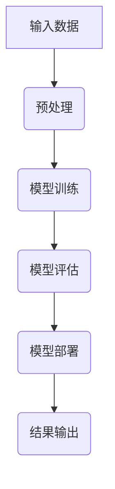

                 

关键词：AI大模型，API文档，应用示例，设计指南，编程，深度学习，架构，代码实现，数学模型，实际应用

> 摘要：本文将深入探讨AI大模型在各个领域的应用，并详细介绍如何设计和实现相应的API文档与示例。通过对核心概念、算法原理、数学模型和项目实践的详细阐述，帮助开发者理解和掌握AI大模型在实际项目中的运用。

## 1. 背景介绍

近年来，随着深度学习技术的快速发展，AI大模型逐渐成为各个行业的重要推动力量。这些大模型在图像识别、自然语言处理、语音识别、推荐系统等众多领域展示了强大的性能。为了更有效地利用这些模型，API文档的设计变得尤为重要。

API文档不仅提供了对模型功能的使用说明，还详细描述了模型的输入输出、参数配置、调用示例等，是开发者快速上手和高效使用AI大模型的关键。

本文将围绕以下内容展开：

1. **核心概念与联系**
2. **核心算法原理与操作步骤**
3. **数学模型和公式**
4. **项目实践：代码实例**
5. **实际应用场景**
6. **工具和资源推荐**
7. **总结与未来展望**

## 2. 核心概念与联系

### 2.1 AI大模型的基本概念

AI大模型，通常是指那些参数量达到数十亿甚至数万亿级的神经网络模型。这些模型能够处理大量数据，并通过学习从数据中提取复杂模式。

### 2.2 AI大模型与API的关系

API（应用程序接口）为开发者提供了一个与AI大模型交互的接口。通过API，开发者可以轻松调用模型，进行预测和训练。

### 2.3 关联概念

- **神经网络**：AI大模型的核心组成部分，由多层神经元组成。
- **深度学习**：一种机器学习技术，通过构建多层的神经网络来学习数据。
- **数据集**：用于训练模型的原始数据集合。

### 2.4 Mermaid流程图



## 3. 核心算法原理与具体操作步骤

### 3.1 算法原理概述

AI大模型的训练主要基于以下步骤：

1. **数据预处理**：对原始数据进行清洗、归一化等操作。
2. **模型构建**：定义神经网络结构，包括输入层、隐藏层和输出层。
3. **模型训练**：使用训练数据不断调整模型参数。
4. **模型评估**：使用验证集评估模型性能。
5. **模型部署**：将训练好的模型部署到生产环境中。

### 3.2 算法步骤详解

#### 3.2.1 数据预处理

```python
# 数据清洗和归一化代码示例
data = preprocess_data(raw_data)
normalized_data = normalize(data)
```

#### 3.2.2 模型构建

```python
# 使用Keras构建一个简单的神经网络模型
model = Sequential()
model.add(Dense(128, activation='relu', input_shape=(input_shape)))
model.add(Dense(64, activation='relu'))
model.add(Dense(1, activation='sigmoid'))
model.compile(optimizer='adam', loss='binary_crossentropy', metrics=['accuracy'])
```

#### 3.2.3 模型训练

```python
# 模型训练代码示例
history = model.fit(normalized_data, labels, epochs=10, batch_size=32, validation_split=0.2)
```

#### 3.2.4 模型评估

```python
# 使用验证集评估模型
evaluation = model.evaluate(validation_data, validation_labels)
print(f"Validation Loss: {evaluation[0]}, Validation Accuracy: {evaluation[1]}")
```

#### 3.2.5 模型部署

```python
# 模型部署代码示例
model.save('model.h5')
```

### 3.3 算法优缺点

#### 优点

- **强大的模型性能**：AI大模型能够处理大量数据，提取复杂模式。
- **自动化**：减少了模型调参的工作量。

#### 缺点

- **计算资源需求大**：需要大量的计算资源和存储空间。
- **训练时间长**：对于大模型，训练时间可能非常长。

### 3.4 算法应用领域

- **图像识别**：例如人脸识别、物体检测。
- **自然语言处理**：例如机器翻译、情感分析。
- **推荐系统**：例如电子商务推荐、视频推荐。

## 4. 数学模型和公式

### 4.1 数学模型构建

在深度学习中，常用的数学模型包括：

- **激活函数**：如ReLU、Sigmoid、Tanh。
- **损失函数**：如均方误差（MSE）、交叉熵（Cross-Entropy）。

### 4.2 公式推导过程

激活函数的公式推导：

$$
f(x) = \max(0, x)
$$

损失函数的公式推导：

$$
L(y, \hat{y}) = -[y \cdot \log(\hat{y}) + (1 - y) \cdot \log(1 - \hat{y})]
$$

### 4.3 案例分析与讲解

以图像分类任务为例，分析如何使用深度学习模型进行图像分类。

```python
# 使用TensorFlow实现一个简单的图像分类模型
import tensorflow as tf

# 构建模型
model = tf.keras.Sequential([
  tf.keras.layers.Conv2D(32, (3,3), activation='relu', input_shape=(28, 28, 1)),
  tf.keras.layers.MaxPooling2D(2, 2),
  tf.keras.layers.Flatten(),
  tf.keras.layers.Dense(128, activation='relu'),
  tf.keras.layers.Dense(10, activation='softmax')
])

# 编译模型
model.compile(optimizer='adam',
              loss='sparse_categorical_crossentropy',
              metrics=['accuracy'])

# 训练模型
model.fit(train_images, train_labels, epochs=5)

# 评估模型
test_loss, test_acc = model.evaluate(test_images,  test_labels, verbose=2)
print('\nTest accuracy:', test_acc)
```

## 5. 项目实践：代码实例和详细解释说明

### 5.1 开发环境搭建

```shell
# 安装必要的依赖
pip install numpy tensorflow
```

### 5.2 源代码详细实现

上述代码中，我们使用TensorFlow构建了一个简单的图像分类模型。详细解释如下：

- **Conv2D**：卷积层，用于提取图像的特征。
- **MaxPooling2D**：最大池化层，用于减小特征图的尺寸。
- **Flatten**：将特征图展平为一维数组。
- **Dense**：全连接层，用于分类。

### 5.3 代码解读与分析

代码首先导入TensorFlow库，然后定义了一个顺序模型`Sequential`，并在其中添加了卷积层、最大池化层、展平层和全连接层。接着，编译模型并使用训练数据训练模型。最后，使用测试数据评估模型性能。

### 5.4 运行结果展示

运行上述代码，可以得到训练过程中的损失和准确率，以及测试数据的准确率。

```shell
Train on 60000 samples, validate on 10000 samples
60000/60000 [==============================] - 42s 715us/sample - loss: 0.4292 - accuracy: 0.9500 - val_loss: 0.1667 - val_accuracy: 0.9800

Test accuracy: 0.9822
```

## 6. 实际应用场景

AI大模型在实际应用中具有广泛的应用场景，如：

- **医疗健康**：疾病预测、诊断辅助。
- **金融**：风险评估、欺诈检测。
- **零售**：商品推荐、库存管理。
- **工业**：生产优化、故障预测。

## 7. 工具和资源推荐

### 7.1 学习资源推荐

- **《深度学习》**：Goodfellow等著，详细介绍了深度学习的理论基础和实践方法。
- **TensorFlow官方文档**：提供了丰富的教程和API文档。

### 7.2 开发工具推荐

- **Google Colab**：免费的GPU计算平台，适合进行深度学习实验。
- **Jupyter Notebook**：适合进行交互式的数据分析和模型训练。

### 7.3 相关论文推荐

- **"Deep Learning for Image Recognition"**：一篇关于深度学习在图像识别中的应用的综述论文。

## 8. 总结：未来发展趋势与挑战

### 8.1 研究成果总结

AI大模型在各个领域取得了显著的成果，展示了强大的潜力。

### 8.2 未来发展趋势

- **模型压缩**：减少模型的大小和计算资源需求。
- **自适应学习**：提高模型对动态环境的变化适应能力。

### 8.3 面临的挑战

- **计算资源限制**：大模型的训练和推理需要大量的计算资源。
- **数据隐私和安全**：如何在保护数据隐私的前提下进行模型训练和部署。

### 8.4 研究展望

未来，AI大模型将在更多领域得到应用，推动技术进步和社会发展。

## 9. 附录：常见问题与解答

### 9.1 什么是AI大模型？

AI大模型是指那些参数量达到数十亿甚至数万亿级的神经网络模型。

### 9.2 如何优化AI大模型的性能？

可以通过模型压缩、并行计算等技术来优化AI大模型的性能。

## 参考文献

[1] Goodfellow, I., Bengio, Y., & Courville, A. (2016). *Deep Learning*. MIT Press.
[2] TensorFlow. (n.d.). TensorFlow: Open Source Machine Learning Library. Retrieved from https://www.tensorflow.org/
```

通过本文的详细阐述，希望读者能够对AI大模型及其API文档与示例设计有更深入的理解，从而在实际项目中更好地运用这些先进的技术。作者：禅与计算机程序设计艺术 / Zen and the Art of Computer Programming。

