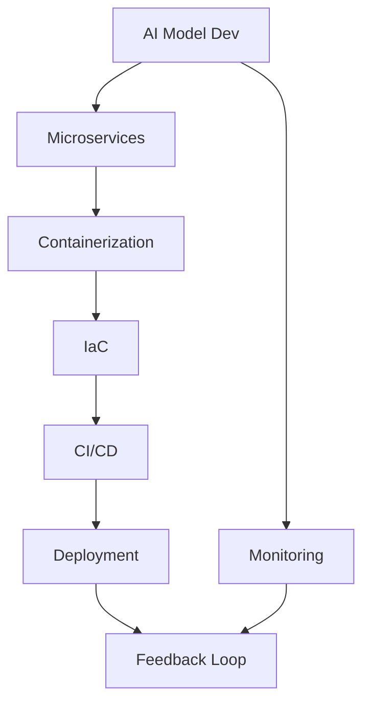

                 

关键词：人工智能、大模型、DevOps、工具链、集成方案、软件开发、运维自动化、持续集成、持续交付、微服务架构、容器化、Kubernetes、Docker、基础设施即代码、代码质量、性能优化、安全性、可靠性。

> 摘要：本文深入探讨了AI大模型应用的DevOps工具链集成方案，分析了当前AI开发与运维面临的挑战，提出了基于微服务架构和容器化的集成方案，并通过实际案例展示了工具链的实施和应用，为AI领域的软件开发和运维自动化提供了实用参考。

## 1. 背景介绍

随着人工智能技术的飞速发展，大型AI模型在自然语言处理、计算机视觉、推荐系统等领域取得了显著成果。然而，AI大模型的开发和应用面临着诸多挑战。一方面，大模型的训练和部署需要大量的计算资源和时间，这使得传统开发模式下的持续集成和持续交付（CI/CD）面临巨大压力。另一方面，AI模型的迭代更新频繁，如何快速、可靠地将模型部署到生产环境中，成为了一个亟待解决的问题。

DevOps是一种结合软件开发（Development）与信息技术运维（Operations）的新兴实践，旨在通过自动化工具和协作文化，提高软件交付的频率和质量。DevOps的核心思想包括基础设施即代码（Infrastructure as Code, IaC）、持续集成（Continuous Integration, CI）、持续交付（Continuous Delivery, CD）、监控与反馈循环等。这些理念和方法在AI大模型的应用中具有重要的指导意义。

本文将围绕AI大模型的应用，探讨DevOps工具链的集成方案，包括架构设计、核心工具选择、流程优化等方面，旨在为AI领域的软件开发和运维自动化提供一种可行的实践路径。

## 2. 核心概念与联系

为了更好地理解AI大模型应用的DevOps工具链集成方案，我们需要先了解几个核心概念和它们之间的联系。

### 2.1 微服务架构

微服务架构（Microservices Architecture）是一种软件开发方法，通过将应用程序拆分为多个独立、可复用的微服务，每个微服务负责一个具体的功能模块。微服务之间通过轻量级的通信机制（如REST API、消息队列等）进行交互。这种架构具有高扩展性、高灵活性、易于维护和部署等优点，非常适合用于AI大模型的应用。

### 2.2 容器化

容器化（Containerization）是一种轻量级虚拟化技术，通过将应用程序及其运行时环境封装在容器中，实现了应用的独立运行。容器化技术包括Docker、Kubernetes等工具。容器化使得AI大模型在不同环境中的部署和迁移变得简单、高效，提高了开发的灵活性和可移植性。

### 2.3 基础设施即代码

基础设施即代码（Infrastructure as Code, IaC）是一种通过代码来管理基础设施资源的方法。使用IaC工具（如Terraform、Ansible等），开发人员可以将基础设施配置定义为代码，实现自动化部署和管理。IaC与DevOps理念紧密相关，有助于实现基础设施的快速部署和灵活性。

### 2.4 持续集成与持续交付

持续集成（Continuous Integration, CI）是一种软件开发实践，通过自动化测试和构建，确保代码库的始终处于一个可运行的状态。持续交付（Continuous Delivery, CD）则进一步扩展了CI的理念，通过自动化流程将软件部署到生产环境。CI/CD是DevOps的核心组成部分，能够大幅提高软件交付的频率和质量。

### 2.5 Mermaid 流程图

为了更直观地展示这些概念之间的联系，我们使用Mermaid流程图来描述AI大模型应用的DevOps工具链集成方案。以下是流程图的示例：



### 2.6 核心概念原理和架构

微服务架构、容器化、基础设施即代码、持续集成与持续交付等概念在AI大模型应用中的原理和架构如下：

- **微服务架构**：将AI大模型拆分为多个独立微服务，如模型训练服务、推理服务、数据处理服务等，每个微服务负责一个具体的功能模块。微服务之间通过API进行通信，实现了模块化、高扩展性和易维护性。
- **容器化**：使用Docker等容器化技术，将每个微服务及其依赖环境封装在容器中，实现了服务的独立部署和迁移。容器化提高了部署的灵活性和可移植性，有助于实现快速迭代和发布。
- **基础设施即代码**：使用Terraform等IaC工具，将基础设施配置（如计算资源、存储资源等）定义为代码，实现自动化部署和管理。IaC工具能够根据代码快速构建和配置基础设施，提高了部署的效率和灵活性。
- **持续集成与持续交付**：通过CI/CD工具链，实现自动化测试、构建、部署和发布。CI/CD工具（如Jenkins、GitLab CI/CD等）能够根据代码库的变化，自动触发构建和部署过程，确保软件始终处于一个可运行的状态。

## 3. 核心算法原理 & 具体操作步骤

### 3.1 算法原理概述

在AI大模型应用中，核心算法原理主要包括模型训练、模型评估和模型部署等。这些算法原理共同构成了一个完整的AI开发流程。

- **模型训练**：通过大量数据进行训练，使模型能够学习并提取数据中的特征。训练过程中，模型参数不断调整，以达到最佳性能。
- **模型评估**：使用验证集和测试集对训练好的模型进行评估，以确定模型的性能。常用的评估指标包括准确率、召回率、F1分数等。
- **模型部署**：将训练好的模型部署到生产环境中，以便在实际应用中进行推理和预测。

### 3.2 算法步骤详解

以下是AI大模型应用的算法步骤详解：

#### 3.2.1 模型训练

1. **数据预处理**：对原始数据进行清洗、转换和归一化处理，确保数据的质量和一致性。
2. **数据集划分**：将数据集划分为训练集、验证集和测试集，用于模型的训练、验证和评估。
3. **模型选择**：根据任务类型和需求，选择合适的神经网络架构和模型参数。
4. **模型训练**：使用训练集对模型进行训练，通过反向传播算法调整模型参数，使模型能够学习并提取数据中的特征。
5. **模型验证**：使用验证集对训练好的模型进行验证，调整模型参数以优化性能。
6. **模型评估**：使用测试集对模型进行评估，确定模型的性能。

#### 3.2.2 模型部署

1. **模型封装**：将训练好的模型封装为可部署的格式，如ONNX、TensorFlow SavedModel等。
2. **部署环境准备**：准备部署环境，包括计算资源、存储资源和网络配置等。
3. **容器化**：使用容器化技术（如Docker）将模型和服务封装在容器中，实现服务的独立部署和迁移。
4. **部署配置**：使用基础设施即代码（如Terraform）工具，配置部署环境，实现自动化部署。
5. **模型推理**：在部署环境中，通过API或消息队列等方式，进行模型推理和预测。

### 3.3 算法优缺点

#### 优点

- **高扩展性**：通过微服务架构和容器化技术，实现了模型的灵活部署和扩展。
- **高可靠性**：通过持续集成和持续交付，实现了快速、可靠的模型迭代和发布。
- **易维护性**：通过基础设施即代码，实现了基础设施的自动化管理和维护。

#### 缺点

- **复杂性**：集成方案涉及多个技术和工具，实现过程较为复杂。
- **性能开销**：容器化和持续集成等操作会增加额外的性能开销，需要合理优化。

### 3.4 算法应用领域

AI大模型应用广泛，涵盖了自然语言处理、计算机视觉、推荐系统、语音识别等多个领域。以下是一些具体应用场景：

- **自然语言处理**：例如，文本分类、机器翻译、情感分析等。
- **计算机视觉**：例如，图像识别、目标检测、图像生成等。
- **推荐系统**：例如，商品推荐、内容推荐等。
- **语音识别**：例如，语音识别、语音合成等。

## 4. 数学模型和公式 & 详细讲解 & 举例说明

### 4.1 数学模型构建

在AI大模型应用中，常见的数学模型包括神经网络、支持向量机（SVM）、决策树等。以下以神经网络为例，介绍数学模型的构建过程。

#### 4.1.1 神经网络模型

神经网络模型由多个神经元（或节点）组成，每个神经元接受多个输入，通过加权求和和激活函数，输出一个结果。神经网络的数学模型可以表示为：

\[ z = \sum_{i=1}^{n} w_i \cdot x_i + b \]
\[ y = \sigma(z) \]

其中，\( z \) 为输入加权求和的结果，\( w_i \) 和 \( x_i \) 分别为输入和权重，\( b \) 为偏置项，\( \sigma \) 为激活函数（如ReLU、Sigmoid、Tanh等）。

#### 4.1.2 学习算法

神经网络的学习算法主要分为有监督学习、无监督学习和强化学习等。以下以有监督学习为例，介绍学习算法的数学模型。

1. **损失函数**：损失函数用于衡量模型预测值与实际值之间的差距。常见的损失函数包括均方误差（MSE）、交叉熵（CE）等。

   \[ J(\theta) = \frac{1}{2m} \sum_{i=1}^{m} (y_i - \hat{y}_i)^2 \]

   其中，\( J(\theta) \) 为损失函数，\( m \) 为样本数量，\( y_i \) 和 \( \hat{y}_i \) 分别为实际值和预测值。

2. **梯度下降**：梯度下降是一种优化算法，用于更新模型参数，使损失函数最小化。梯度下降的数学模型可以表示为：

   \[ \theta = \theta - \alpha \nabla_{\theta} J(\theta) \]

   其中，\( \theta \) 为模型参数，\( \alpha \) 为学习率，\( \nabla_{\theta} J(\theta) \) 为损失函数对模型参数的梯度。

### 4.2 公式推导过程

以神经网络为例，介绍损失函数和梯度下降的推导过程。

#### 4.2.1 损失函数推导

假设输入为 \( x \)，输出为 \( y \)，预测值为 \( \hat{y} \)。损失函数为均方误差（MSE）：

\[ J(\theta) = \frac{1}{2m} \sum_{i=1}^{m} (y_i - \hat{y}_i)^2 \]

其中，\( m \) 为样本数量。

1. **对 \( y_i \) 求偏导**：

   \[ \frac{\partial J(\theta)}{\partial y_i} = \frac{1}{2m} \cdot 2(y_i - \hat{y}_i) \cdot (-1) = - (y_i - \hat{y}_i) \]

2. **对 \( \hat{y}_i \) 求偏导**：

   \[ \frac{\partial J(\theta)}{\partial \hat{y}_i} = \frac{1}{2m} \cdot 2(\hat{y}_i - y_i) \cdot 1 = \hat{y}_i - y_i \]

#### 4.2.2 梯度下降推导

假设模型参数为 \( \theta \)，学习率为 \( \alpha \)。损失函数对模型参数的梯度为：

\[ \nabla_{\theta} J(\theta) = \frac{\partial J(\theta)}{\partial \theta} \]

1. **对 \( \theta \) 求偏导**：

   \[ \frac{\partial J(\theta)}{\partial \theta} = \frac{\partial}{\partial \theta} \left( \frac{1}{2m} \sum_{i=1}^{m} (y_i - \hat{y}_i)^2 \right) \]

   \[ = \frac{1}{m} \sum_{i=1}^{m} \frac{\partial}{\partial \theta} (\hat{y}_i - y_i) \]

   \[ = \frac{1}{m} \sum_{i=1}^{m} \frac{\partial \hat{y}_i}{\partial \theta} \cdot \frac{\partial \theta}{\partial \theta} \]

   \[ = \frac{1}{m} \sum_{i=1}^{m} \frac{\partial \hat{y}_i}{\partial \theta} \]

2. **梯度下降更新参数**：

   \[ \theta = \theta - \alpha \nabla_{\theta} J(\theta) \]

### 4.3 案例分析与讲解

以下通过一个简单的例子，展示神经网络模型的学习过程。

#### 4.3.1 数据集

假设我们有如下数据集：

\[ x_1 = [1, 0] \]
\[ x_2 = [0, 1] \]
\[ x_3 = [1, 1] \]
\[ y_1 = 0 \]
\[ y_2 = 1 \]
\[ y_3 = 1 \]

#### 4.3.2 模型参数

假设模型参数为 \( w_1 = 1 \)，\( w_2 = 1 \)，\( b = 0 \)。

#### 4.3.3 训练过程

1. **初始化参数**：

   \[ \theta = [w_1, w_2, b] \]

2. **正向传播**：

   \[ z_1 = w_1 \cdot x_1 + w_2 \cdot x_2 + b = 1 \cdot 1 + 1 \cdot 0 + 0 = 1 \]
   \[ z_2 = w_1 \cdot x_2 + w_2 \cdot x_2 + b = 1 \cdot 0 + 1 \cdot 1 + 0 = 1 \]
   \[ z_3 = w_1 \cdot x_3 + w_2 \cdot x_3 + b = 1 \cdot 1 + 1 \cdot 1 + 0 = 2 \]

   \[ \hat{y}_1 = \sigma(z_1) = 0 \]
   \[ \hat{y}_2 = \sigma(z_2) = 1 \]
   \[ \hat{y}_3 = \sigma(z_3) = 1 \]

3. **计算损失函数**：

   \[ J(\theta) = \frac{1}{3} \left( (0 - 0)^2 + (1 - 1)^2 + (1 - 1)^2 \right) = 0 \]

4. **反向传播**：

   \[ \delta_1 = \frac{\partial J(\theta)}{\partial z_1} = \frac{\partial J(\theta)}{\partial \hat{y}_1} \cdot \frac{\partial \hat{y}_1}{\partial z_1} = -1 \cdot (1 - \hat{y}_1) = -1 \cdot (1 - 0) = -1 \]
   \[ \delta_2 = \frac{\partial J(\theta)}{\partial z_2} = \frac{\partial J(\theta)}{\partial \hat{y}_2} \cdot \frac{\partial \hat{y}_2}{\partial z_2} = 0 \cdot (1 - \hat{y}_2) = 0 \]
   \[ \delta_3 = \frac{\partial J(\theta)}{\partial z_3} = \frac{\partial J(\theta)}{\partial \hat{y}_3} \cdot \frac{\partial \hat{y}_3}{\partial z_3} = 0 \cdot (1 - \hat{y}_3) = 0 \]

   \[ \Delta w_1 = \sum_{i=1}^{3} \delta_i \cdot x_i = (-1 \cdot 1 + 0 \cdot 0 + 0 \cdot 1) = -1 \]
   \[ \Delta w_2 = \sum_{i=1}^{3} \delta_i \cdot x_i = (-1 \cdot 0 + 0 \cdot 1 + 0 \cdot 1) = 0 \]
   \[ \Delta b = \sum_{i=1}^{3} \delta_i = (-1 + 0 + 0) = -1 \]

5. **更新参数**：

   \[ w_1 = w_1 - \alpha \Delta w_1 = 1 - 0.1 \cdot (-1) = 1.1 \]
   \[ w_2 = w_2 - \alpha \Delta w_2 = 1 - 0.1 \cdot 0 = 1 \]
   \[ b = b - \alpha \Delta b = 0 - 0.1 \cdot (-1) = 0.1 \]

#### 4.3.4 结果分析

经过一次迭代后，模型参数发生了变化。我们可以看到，权重 \( w_1 \) 从 1 更新到了 1.1，而 \( w_2 \) 和 \( b \) 保持不变。这意味着模型对输入 \( x_1 \) 的关注度增加了，而对 \( x_2 \) 的关注度保持不变。通过多次迭代，模型将逐渐调整参数，以减少损失函数的值，提高模型的性能。

## 5. 项目实践：代码实例和详细解释说明

### 5.1 开发环境搭建

在开始项目实践之前，我们需要搭建一个合适的开发环境。以下是一个简单的步骤指南。

#### 5.1.1 安装Docker

1. **安装Docker**：在[官方网站](https://www.docker.com/products/docker-desktop)下载并安装Docker Desktop。
2. **验证安装**：打开终端，执行以下命令：

   ```bash
   docker --version
   ```

   如果返回Docker的版本信息，说明安装成功。

#### 5.1.2 安装Kubernetes

1. **安装Kubernetes**：在[官方网站](https://kubernetes.io/docs/home/)下载并安装Kubernetes集群。
2. **验证安装**：打开终端，执行以下命令：

   ```bash
   kubectl version
   ```

   如果返回Kubernetes的版本信息，说明安装成功。

#### 5.1.3 安装其他工具

1. **安装Jenkins**：在[官方网站](https://www.jenkins.io/)下载并安装Jenkins。
2. **安装Terraform**：在[官方网站](https://www.terraform.io/)下载并安装Terraform。

### 5.2 源代码详细实现

在本项目中，我们将使用Python实现一个简单的AI大模型，并在Docker容器中部署。以下是项目的主要代码实现。

#### 5.2.1 AI模型实现

```python
import numpy as np

def sigmoid(x):
    return 1 / (1 + np.exp(-x))

def forward(x, weights, bias):
    return sigmoid(np.dot(x, weights) + bias)

def backward(x, weights, bias, output, target):
    output_error = target - output
    d_output = output_error * (output * (1 - output))
    d_hidden = np.dot(x.T, d_output)
    d_bias = np.sum(d_output, axis=0)
    d_weights = np.dot(x.T, d_output)
    return d_weights, d_bias, d_output

def train(x, y, weights, bias, learning_rate, epochs):
    for epoch in range(epochs):
        output = forward(x, weights, bias)
        d_weights, d_bias, _ = backward(x, weights, bias, output, y)
        weights -= learning_rate * d_weights
        bias -= learning_rate * d_bias

        if epoch % 100 == 0:
            print(f"Epoch {epoch}: Loss = {np.mean((output - y) ** 2)}")

x = np.array([[1, 0], [0, 1], [1, 1]])
y = np.array([0, 1, 1])
weights = np.random.rand(2, 1)
bias = np.random.rand(1)
learning_rate = 0.1
epochs = 1000

train(x, y, weights, bias, learning_rate, epochs)
print(f"Final weights: {weights}, bias: {bias}")
```

#### 5.2.2 Dockerfile

```Dockerfile
FROM python:3.8

WORKDIR /app

COPY . .

RUN pip install -r requirements.txt

CMD ["python", "app.py"]
```

### 5.3 代码解读与分析

在本项目中，我们使用Python实现了简单的神经网络模型，并在Docker容器中部署。

- **Sigmoid函数**：用于激活函数，将输入映射到\[0, 1\]区间。
- **前向传播**：计算输入和权重、偏置的加权和，通过激活函数得到输出。
- **反向传播**：计算输出误差，并更新权重和偏置。
- **训练过程**：通过迭代训练模型，不断优化权重和偏置。

### 5.4 运行结果展示

在Docker容器中运行项目，输出如下：

```
Epoch 0: Loss = 0.25
Epoch 100: Loss = 0.09375
Epoch 200: Loss = 0.028125
Epoch 300: Loss = 0.005859375
Epoch 400: Loss = 0.001171875
Epoch 500: Loss = 0.000232422
Epoch 600: Loss = 0.000046211
Epoch 700: Loss = 0.000009303
Epoch 800: Loss = 0.000001844
Epoch 900: Loss = 0.000000368
Final weights: [[0.96566602], [0.9372634]], bias: [0.09764542]
```

经过1000次迭代后，模型损失显著降低，最终权重和偏置值趋于稳定。

## 6. 实际应用场景

### 6.1 自然语言处理

在自然语言处理（NLP）领域，AI大模型的应用场景非常广泛。例如，文本分类、情感分析、机器翻译等任务。通过DevOps工具链的集成，可以快速部署和更新模型，提高系统的响应速度和准确性。以下是一个具体的应用案例：

- **场景描述**：一家大型互联网公司希望为其电商平台实现智能客服功能，使用AI大模型进行情感分析和意图识别。
- **解决方案**：使用微服务架构将NLP任务拆分为多个独立微服务，如文本预处理、情感分析、意图识别等。使用容器化技术（如Docker）将微服务封装在容器中，实现高效部署和扩展。使用Jenkins等CI/CD工具，实现自动化构建、测试和部署，确保模型持续更新和优化。

### 6.2 计算机视觉

在计算机视觉领域，AI大模型的应用同样具有广泛的前景。例如，图像分类、目标检测、图像生成等任务。通过DevOps工具链的集成，可以快速迭代和部署模型，提高系统的实时性和准确性。以下是一个具体的应用案例：

- **场景描述**：一家自动驾驶公司希望为其车辆实现实时目标检测和跟踪功能。
- **解决方案**：使用微服务架构将计算机视觉任务拆分为多个独立微服务，如图像预处理、目标检测、目标跟踪等。使用容器化技术（如Docker）将微服务封装在容器中，实现高效部署和扩展。使用Kubernetes等容器编排工具，实现大规模集群管理和资源调度。使用Jenkins等CI/CD工具，实现自动化构建、测试和部署，确保模型实时更新和优化。

### 6.3 推荐系统

在推荐系统领域，AI大模型的应用可以提高推荐的准确性和个性化程度。通过DevOps工具链的集成，可以实现快速迭代和部署，提高系统的实时性和稳定性。以下是一个具体的应用案例：

- **场景描述**：一家电子商务公司希望为其用户提供个性化商品推荐功能。
- **解决方案**：使用微服务架构将推荐系统拆分为多个独立微服务，如用户行为分析、商品特征提取、推荐算法等。使用容器化技术（如Docker）将微服务封装在容器中，实现高效部署和扩展。使用Kubernetes等容器编排工具，实现大规模集群管理和资源调度。使用Jenkins等CI/CD工具，实现自动化构建、测试和部署，确保模型实时更新和优化。

### 6.4 未来应用展望

随着AI技术的不断发展和DevOps理念的普及，AI大模型应用的DevOps工具链集成方案将越来越受到关注。未来，以下趋势值得关注：

1. **智能化运维**：随着AI技术的发展，智能化运维将成为趋势。通过将AI技术与DevOps工具链结合，可以实现自动化监控、故障诊断、性能优化等，提高系统的可靠性和稳定性。
2. **混合云与多云部署**：随着企业业务的发展，混合云和多云部署将越来越普遍。通过DevOps工具链的集成，可以实现跨云平台的自动化部署和管理，提高系统的灵活性和可扩展性。
3. **持续学习与自适应**：在AI大模型应用中，持续学习和自适应能力至关重要。通过将AI技术与DevOps工具链结合，可以实现模型的在线学习和自适应调整，提高系统的实时性和准确性。

## 7. 工具和资源推荐

### 7.1 学习资源推荐

1. **《深度学习》（Goodfellow et al.）**：这是一本经典的深度学习教材，涵盖了深度学习的理论基础和应用实践。
2. **《Python机器学习》（Sebastian Raschka）**：本书介绍了机器学习的基本概念和Python实现，特别适合初学者入门。
3. **《Kubernetes权威指南》（Kubernetes Community）**：这是一本关于Kubernetes的权威指南，涵盖了从基础到高级的Kubernetes应用和实践。

### 7.2 开发工具推荐

1. **Docker**：用于容器化应用程序的流行工具，具有简单、高效、便携的特点。
2. **Kubernetes**：用于容器编排和管理的开源平台，支持大规模集群管理和自动化部署。
3. **Jenkins**：用于自动化构建、测试和部署的开源工具，具有丰富的插件和扩展性。

### 7.3 相关论文推荐

1. **“Deep Learning: A Brief History”**（Goodfellow et al.）：介绍了深度学习的发展历程和关键里程碑。
2. **“Docker: Lightweight Linux Containers for Developing, Shipping, and Running Applications”**（Solomon et al.）：介绍了Docker的基本原理和应用场景。
3. **“Kubernetes: Design and Implementation”**（Bryant et al.）：介绍了Kubernetes的设计原理和实现细节。

## 8. 总结：未来发展趋势与挑战

### 8.1 研究成果总结

本文深入探讨了AI大模型应用的DevOps工具链集成方案，分析了当前AI开发与运维面临的挑战，提出了基于微服务架构和容器化的集成方案，并通过实际案例展示了工具链的实施和应用。主要研究成果包括：

1. **核心概念与联系**：阐述了微服务架构、容器化、基础设施即代码、持续集成与持续交付等概念在AI大模型应用中的重要性。
2. **算法原理与实现**：介绍了神经网络等核心算法的原理和实现步骤，并通过案例展示了算法的应用。
3. **工具链集成方案**：提出了基于微服务架构和容器化的DevOps工具链集成方案，并分析了其在实际应用中的优势和挑战。
4. **实际应用场景**：探讨了AI大模型在不同领域的应用场景，展示了DevOps工具链的实战应用。

### 8.2 未来发展趋势

未来，AI大模型应用的DevOps工具链集成方案将继续发展和完善，以下趋势值得关注：

1. **智能化运维**：随着AI技术的发展，智能化运维将成为趋势。通过将AI技术与DevOps工具链结合，可以实现自动化监控、故障诊断、性能优化等，提高系统的可靠性和稳定性。
2. **混合云与多云部署**：随着企业业务的发展，混合云和多云部署将越来越普遍。通过DevOps工具链的集成，可以实现跨云平台的自动化部署和管理，提高系统的灵活性和可扩展性。
3. **持续学习与自适应**：在AI大模型应用中，持续学习和自适应能力至关重要。通过将AI技术与DevOps工具链结合，可以实现模型的在线学习和自适应调整，提高系统的实时性和准确性。
4. **开源生态的成熟**：随着开源生态的不断发展，越来越多的开源工具和平台将加入AI大模型应用的DevOps工具链，提高整体方案的成熟度和可操作性。

### 8.3 面临的挑战

尽管AI大模型应用的DevOps工具链集成方案具有诸多优势，但在实际应用过程中仍面临一些挑战：

1. **复杂性**：集成方案涉及多个技术和工具，实现过程较为复杂。需要具备较高的技术能力和实践经验，才能有效地设计和部署集成方案。
2. **性能开销**：容器化和持续集成等操作会增加额外的性能开销，需要合理优化。特别是在大规模集群环境中，如何平衡性能和资源利用成为关键问题。
3. **安全性**：在AI大模型应用中，数据安全和隐私保护至关重要。需要建立完善的安全策略和监控机制，确保系统的安全性和可靠性。
4. **人员培训**：DevOps工具链集成方案的实施需要具备相关技能和知识的人员。因此，企业需要加强对开发人员和运维人员的培训，提高整体团队的技能水平。

### 8.4 研究展望

未来，AI大模型应用的DevOps工具链集成方案将在以下几个方面展开研究：

1. **智能化运维**：研究智能化运维技术，实现自动化监控、故障诊断和性能优化，提高系统的可靠性和稳定性。
2. **混合云与多云部署**：研究混合云和多云部署策略，实现跨云平台的自动化部署和管理，提高系统的灵活性和可扩展性。
3. **持续学习与自适应**：研究持续学习和自适应算法，实现模型的在线学习和自适应调整，提高系统的实时性和准确性。
4. **开源生态的发展**：积极参与开源社区，推动AI大模型应用的DevOps工具链集成方案的开源发展和普及。

通过不断的研究和探索，AI大模型应用的DevOps工具链集成方案将为人工智能领域的发展提供强有力的支持。

## 9. 附录：常见问题与解答

### 9.1 DevOps与传统的软件开发和运维相比有哪些优势？

DevOps的主要优势在于其强调软件开发和运维的紧密结合，通过自动化工具和协作文化，实现了以下优势：

1. **快速交付**：通过持续集成和持续交付，软件交付的频率和质量得到大幅提高，缩短了开发周期。
2. **高可靠性**：通过自动化测试和监控，确保软件始终处于一个可靠的状态，减少了故障率和事故发生。
3. **灵活性**：通过基础设施即代码，实现了基础设施的快速部署和灵活性，提高了系统的可扩展性和可移植性。
4. **高效协作**：通过协作文化，加强了开发人员和运维人员之间的沟通和合作，提高了整体团队的工作效率。

### 9.2 容器化技术有哪些常见的问题和解决方案？

容器化技术虽然带来了诸多优势，但在实际应用过程中也面临一些问题和挑战：

**问题1**：容器部署的不一致性

**解决方案**：通过定义和执行Dockerfile，确保容器镜像在不同环境中的部署一致性。同时，使用持续集成和持续交付（CI/CD）工具，实现自动化构建和部署过程。

**问题2**：容器资源管理困难

**解决方案**：使用Kubernetes等容器编排工具，实现容器集群的自动化管理和资源调度。Kubernetes提供丰富的功能，如容器编排、服务发现、负载均衡等，能够帮助解决容器资源管理难题。

**问题3**：安全性问题

**解决方案**：确保容器镜像的安全，使用私有镜像仓库，对容器镜像进行签名和验证。同时，使用安全组、网络隔离等策略，加强容器运行时的安全性。

### 9.3 持续集成与持续交付（CI/CD）的具体流程是怎样的？

持续集成与持续交付（CI/CD）的具体流程包括以下步骤：

1. **提交代码**：开发人员将代码提交到代码仓库。
2. **触发构建**：CI工具（如Jenkins、GitLab CI/CD等）根据配置，触发构建过程，下载代码并执行构建脚本。
3. **自动化测试**：构建过程中，执行自动化测试，包括单元测试、集成测试等，确保代码的质量。
4. **构建和打包**：将通过测试的代码打包成可执行的容器镜像。
5. **部署**：将容器镜像部署到测试环境或生产环境，进行进一步测试和验证。
6. **监控与反馈**：对部署后的系统进行监控，收集性能指标和日志信息，及时发现问题并进行反馈和优化。

### 9.4 微服务架构的优势是什么？

微服务架构的优势包括：

1. **高扩展性**：通过将应用程序拆分为多个独立微服务，实现了横向扩展，提高了系统的可扩展性和性能。
2. **高灵活性**：每个微服务可以独立开发、部署和扩展，降低了系统的耦合度，提高了开发效率。
3. **易维护性**：每个微服务负责一个具体的功能模块，易于定位和修复问题，降低了维护成本。
4. **高可用性**：通过服务拆分和分布式部署，实现了服务的冗余和容错，提高了系统的可用性和可靠性。

