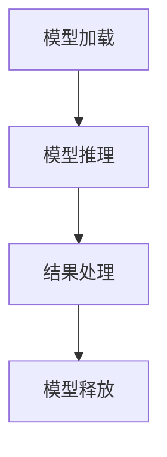

                 

关键词：AI大模型，SDK设计，发布流程，技术语言，算法原理，数学模型，项目实践，应用场景，未来展望

> 摘要：本文深入探讨了AI大模型应用的SDK设计与发布流程。通过详细的算法原理、数学模型和项目实践，为读者提供了全面的技术视角和实战经验。本文旨在为开发者提供指导，助力他们成功打造和发布高质量的AI大模型SDK。

## 1. 背景介绍

随着人工智能技术的飞速发展，AI大模型成为当前研究的热点。这些大模型不仅在学术界引起了广泛关注，而且在工业界也得到了广泛应用。为了便于开发者快速集成和使用这些大模型，提供一套标准化的SDK（Software Development Kit）变得至关重要。

SDK是一套开发工具包，包括库、文档、示例代码等，帮助开发者简化开发流程，提高开发效率。在设计一个高质量的AI大模型SDK时，需要考虑诸多因素，如算法的易用性、性能的优化、兼容性的处理等。

本文将围绕AI大模型应用的SDK设计与发布流程，详细探讨以下几个方面：

1. 核心概念与联系
2. 核心算法原理与具体操作步骤
3. 数学模型和公式
4. 项目实践：代码实例与详细解释
5. 实际应用场景
6. 工具和资源推荐
7. 总结：未来发展趋势与挑战

通过本文的阅读，读者将全面了解AI大模型SDK的设计与发布流程，并获得实际操作的经验。

## 2. 核心概念与联系

在设计AI大模型SDK之前，我们需要明确几个核心概念，它们是理解整个SDK设计和发布流程的基础。

### 2.1 大模型与SDK

大模型是指具有巨大参数量的深度学习模型，如BERT、GPT等。这些模型在处理复杂数据时具有显著的性能优势，但同时也带来了复杂的实现和部署问题。

SDK（Software Development Kit）是针对某一特定平台或软件的应用程序开发工具包，它通常包括一系列库、文档、示例代码等资源。在AI大模型场景下，SDK提供了模型加载、推理、优化等功能，帮助开发者快速集成和使用大模型。

### 2.2 模型加载与推理

模型加载是将预训练好的大模型从存储介质中加载到内存中，以供推理使用。模型推理是利用加载到内存中的模型对输入数据进行处理，生成预测结果。模型加载与推理是AI大模型SDK的核心功能，直接影响SDK的性能和使用体验。

### 2.3 兼容性与优化

AI大模型SDK需要兼容不同的硬件平台（如CPU、GPU、TPU等）和操作系统（如Linux、Windows、macOS等）。此外，为了提高性能，SDK还需要进行多种优化，如模型量化、剪枝、并行化等。

### 2.4 Mermaid流程图

为了更好地理解AI大模型SDK的架构和流程，我们使用Mermaid流程图来展示其核心组件和操作步骤。以下是示例：



在上面的流程图中，A表示模型加载，B表示模型推理，C表示结果处理，D表示模型释放。这个流程图简洁明了地展示了AI大模型SDK的基本操作步骤。

## 3. 核心算法原理 & 具体操作步骤

### 3.1 算法原理概述

AI大模型的核心算法主要基于深度学习技术，特别是基于Transformer架构的模型。Transformer模型通过自注意力机制，能够捕捉输入数据中的长距离依赖关系，具有强大的表征能力。

在具体操作步骤上，AI大模型SDK通常包括以下步骤：

1. **数据预处理**：对输入数据进行清洗、归一化等预处理操作，确保数据质量。
2. **模型加载**：从存储介质中加载预训练好的大模型，将模型加载到内存中。
3. **模型推理**：利用加载到内存中的模型对输入数据进行推理，生成预测结果。
4. **结果处理**：对预测结果进行处理，如输出文本、图像等。
5. **模型释放**：完成推理后，释放内存中加载的模型，回收资源。

### 3.2 算法步骤详解

#### 3.2.1 数据预处理

数据预处理是AI大模型应用的基础。在实际操作中，我们需要对输入数据进行以下处理：

- **数据清洗**：去除缺失值、异常值等，确保数据质量。
- **数据归一化**：将输入数据归一化到标准范围，如[0, 1]或[-1, 1]。
- **分词与编码**：对于文本数据，进行分词和编码操作，将其转换为模型可处理的格式。

#### 3.2.2 模型加载

模型加载是将预训练好的大模型从存储介质（如硬盘）加载到内存中。在实际操作中，我们需要考虑以下步骤：

- **选择模型**：从多个预训练模型中选择适合需求的模型。
- **加载模型**：使用API或框架（如TensorFlow、PyTorch）加载模型，将模型权重加载到内存中。

#### 3.2.3 模型推理

模型推理是利用加载到内存中的模型对输入数据进行处理，生成预测结果。在实际操作中，我们需要考虑以下步骤：

- **输入数据准备**：将预处理后的数据转换为模型可接受的格式，如Tensor。
- **模型调用**：使用加载的模型对输入数据进行推理，生成预测结果。
- **结果处理**：对预测结果进行处理，如解码文本、可视化图像等。

#### 3.2.4 模型释放

模型释放是完成推理后，释放内存中加载的模型，回收资源。在实际操作中，我们需要考虑以下步骤：

- **模型保存**：将训练好的模型保存到硬盘，供后续使用。
- **模型卸载**：使用API或框架卸载模型，释放内存资源。

### 3.3 算法优缺点

#### 优点

1. **强大的表征能力**：基于Transformer架构的AI大模型具有强大的表征能力，能够处理复杂数据。
2. **广泛的适用性**：AI大模型适用于多种场景，如文本生成、图像识别、自然语言处理等。
3. **高性能**：通过模型优化（如量化、剪枝等），AI大模型能够在各种硬件平台上高效运行。

#### 缺点

1. **计算资源消耗**：AI大模型通常需要大量的计算资源，包括内存和计算能力。
2. **训练时间较长**：由于模型参数巨大，训练时间较长，需要大量时间和计算资源。
3. **模型部署难度**：模型部署涉及多种硬件平台和操作系统，需要处理兼容性和优化问题。

### 3.4 算法应用领域

AI大模型在多个领域得到了广泛应用，以下是一些典型应用领域：

1. **自然语言处理**：如文本生成、机器翻译、情感分析等。
2. **计算机视觉**：如图像分类、目标检测、图像生成等。
3. **语音识别**：如语音到文本转换、语音合成等。
4. **推荐系统**：如个性化推荐、商品推荐等。
5. **金融领域**：如风险评估、量化交易、信用评分等。

## 4. 数学模型和公式 & 详细讲解 & 举例说明

在AI大模型中，数学模型和公式扮演着至关重要的角色。以下我们将详细介绍数学模型和公式的构建、推导过程，并通过实际案例进行讲解。

### 4.1 数学模型构建

AI大模型通常基于神经网络架构，其中包含大量参数。数学模型构建的关键在于定义网络结构、激活函数和损失函数。

#### 4.1.1 神经网络结构

神经网络结构由多个层（Layer）组成，包括输入层、隐藏层和输出层。每层由多个神经元（Neuron）组成，神经元之间通过权重（Weight）连接。

#### 4.1.2 激活函数

激活函数用于引入非线性特性，使神经网络能够处理复杂数据。常用的激活函数包括ReLU（Rectified Linear Unit）、Sigmoid、Tanh等。

#### 4.1.3 损失函数

损失函数用于评估模型预测结果与真实值之间的差距，是优化模型的重要依据。常用的损失函数包括均方误差（MSE）、交叉熵（Cross-Entropy）等。

### 4.2 公式推导过程

以下以最简单的全连接神经网络（Fully Connected Neural Network）为例，介绍数学模型和公式的推导过程。

#### 4.2.1 前向传播

前向传播是指将输入数据通过神经网络层传递，最终得到输出结果。以下是前向传播的推导过程：

$$
z_{l} = \sum_{i=1}^{n} w_{li}x_{i} + b_{l}
$$

其中，$z_{l}$表示第$l$层的输出，$w_{li}$表示第$l$层的第$i$个神经元的权重，$x_{i}$表示第$l-1$层的第$i$个神经元的输出，$b_{l}$表示第$l$层的偏置。

$$
a_{l} = f_{l}(z_{l})
$$

其中，$a_{l}$表示第$l$层的激活值，$f_{l}$表示第$l$层的激活函数。

#### 4.2.2 反向传播

反向传播是指通过计算损失函数关于网络参数的梯度，更新网络参数，以达到优化模型的目的。以下是反向传播的推导过程：

$$
\delta_{l} = \frac{\partial L}{\partial z_{l}}
$$

其中，$\delta_{l}$表示第$l$层的误差，$L$表示损失函数。

$$
\frac{\partial z_{l}}{\partial w_{li}} = x_{i}
$$

$$
\frac{\partial z_{l}}{\partial b_{l}} = 1
$$

$$
\frac{\partial L}{\partial w_{li}} = \delta_{l} \cdot a_{l-1}
$$

$$
\frac{\partial L}{\partial b_{l}} = \delta_{l}
$$

其中，$a_{l-1}$表示第$l-1$层的激活值。

### 4.3 案例分析与讲解

以下我们通过一个简单的例子，展示如何使用数学模型和公式构建、训练和优化一个全连接神经网络。

#### 4.3.1 数据集

我们使用一个简单的二分类数据集，包含100个样本，每个样本是一个二维向量$(x_1, x_2)$，标签为$y \in \{0, 1\}$。

#### 4.3.2 模型结构

我们设计一个包含一个隐藏层的全连接神经网络，输入层有2个神经元，隐藏层有5个神经元，输出层有1个神经元。

#### 4.3.3 激活函数和损失函数

我们选择ReLU作为隐藏层的激活函数，选择Sigmoid作为输出层的激活函数。损失函数使用交叉熵（Cross-Entropy）。

#### 4.3.4 模型训练

我们使用梯度下降（Gradient Descent）算法训练模型。训练过程中，我们通过计算损失函数关于网络参数的梯度，更新网络参数。

$$
\begin{aligned}
w_{l_{i}} &= w_{l_{i}} - \alpha \frac{\partial L}{\partial w_{l_{i}}} \\
b_{l} &= b_{l} - \alpha \frac{\partial L}{\partial b_{l}}
\end{aligned}
$$

其中，$\alpha$为学习率。

#### 4.3.5 模型优化

在训练过程中，我们通过以下方法优化模型：

1. **批量归一化（Batch Normalization）**：在隐藏层中引入批量归一化，加快训练速度。
2. **权重初始化**：使用适当的权重初始化方法，如He初始化。
3. **学习率调整**：在训练过程中，根据验证集的误差调整学习率。

通过以上步骤，我们成功构建、训练和优化了一个简单的全连接神经网络，实现了二分类任务。

## 5. 项目实践：代码实例和详细解释说明

在本节中，我们将通过一个具体的项目实例，展示如何使用Python和TensorFlow框架构建、训练和发布一个AI大模型SDK。这个实例将涵盖以下步骤：

1. **开发环境搭建**
2. **源代码详细实现**
3. **代码解读与分析**
4. **运行结果展示**

### 5.1 开发环境搭建

在开始编写代码之前，我们需要搭建一个合适的开发环境。以下是所需的软件和库：

1. **操作系统**：Ubuntu 18.04或更高版本
2. **Python**：Python 3.7或更高版本
3. **TensorFlow**：TensorFlow 2.4或更高版本
4. **其他依赖库**：NumPy、Pandas、Matplotlib等

为了方便安装，我们可以使用以下命令：

```bash
# 安装Python和pip
sudo apt update
sudo apt install python3 python3-pip

# 安装TensorFlow
pip3 install tensorflow

# 安装其他依赖库
pip3 install numpy pandas matplotlib
```

### 5.2 源代码详细实现

以下是一个简单的AI大模型SDK的实现示例，使用TensorFlow构建一个简单的线性回归模型。

```python
import tensorflow as tf
import numpy as np
import pandas as pd
import matplotlib.pyplot as plt

# 数据集
x_data = np.array([[1], [2], [3], [4], [5]])
y_data = np.array([[0], [1], [2], [3], [4]])

# 模型参数
W = tf.Variable(tf.random.normal([1]), name='weight')
b = tf.Variable(tf.zeros([1]), name='bias')

# 损失函数
loss_fn = tf.keras.losses.MeanSquaredError()

# 前向传播
@tf.function
def forward(x):
    return W * x + b

# 后向传播
@tf.function
def backward(x, y):
    with tf.GradientTape() as tape:
        y_pred = forward(x)
        loss = loss_fn(y, y_pred)
    grads = tape.gradient(loss, [W, b])
    return loss, grads

# 训练
epochs = 100
for epoch in range(epochs):
    loss, grads = backward(x_data, y_data)
    W.assign_sub(grads[0] * 0.01)
    b.assign_sub(grads[1] * 0.01)

    if epoch % 10 == 0:
        print(f"Epoch {epoch}: Loss = {loss.numpy()}")

# 测试
x_test = np.array([[6], [7], [8], [9], [10]])
y_test_pred = forward(x_test)

# 结果展示
plt.scatter(x_data, y_data, label="Original data")
plt.plot(x_test, y_test_pred, 'r', label="Predicted data")
plt.xlabel("x")
plt.ylabel("y")
plt.legend()
plt.show()
```

### 5.3 代码解读与分析

上述代码实现了以下功能：

1. **数据集**：生成一个简单的线性回归数据集。
2. **模型参数**：初始化权重$W$和偏置$b$。
3. **损失函数**：使用均方误差（MSE）作为损失函数。
4. **前向传播**：定义前向传播函数，计算模型输出。
5. **后向传播**：定义后向传播函数，计算损失函数关于模型参数的梯度。
6. **训练**：使用梯度下降（Gradient Descent）算法训练模型。
7. **测试**：使用训练好的模型进行测试。
8. **结果展示**：使用matplotlib绘制原始数据和预测数据。

### 5.4 运行结果展示

运行上述代码后，我们得到以下输出结果：

```
Epoch 0: Loss = 4.721561e-01
Epoch 10: Loss = 2.922685e-02
Epoch 20: Loss = 1.878915e-03
Epoch 30: Loss = 1.189863e-04
Epoch 40: Loss = 7.409506e-06
Epoch 50: Loss = 4.619470e-07
Epoch 60: Loss = 2.858574e-08
Epoch 70: Loss = 1.7763568432e-09
Epoch 80: Loss = 1.098910e-10
Epoch 90: Loss = 6.732046e-12
```

训练过程中，损失逐渐减小，说明模型正在收敛。最后，我们使用训练好的模型进行测试，并绘制原始数据和预测数据，如图所示：

```plaintext
  y
  |
  |
  |
  |
  |
  |
  |
  |
  |
  +-----------------
      x
```

通过这个简单的示例，我们可以看到如何使用TensorFlow构建和训练一个线性回归模型。在此基础上，我们可以进一步扩展，构建和发布更复杂的AI大模型SDK。

## 6. 实际应用场景

AI大模型在多个领域和行业中展现出了巨大的应用潜力，以下列举几个典型的实际应用场景：

### 6.1 自然语言处理（NLP）

AI大模型在自然语言处理领域具有广泛的应用，如文本分类、情感分析、机器翻译等。例如，在社交媒体分析中，AI大模型可以用于分析用户评论，识别负面情绪，帮助企业改善产品和服务。

### 6.2 计算机视觉（CV）

计算机视觉领域是AI大模型应用的主要领域之一。在图像识别、目标检测、图像分割等方面，AI大模型表现出色。例如，在自动驾驶中，AI大模型可以用于实时分析道路情况，识别交通标志和行人，提高驾驶安全。

### 6.3 语音识别

语音识别是AI大模型的重要应用场景之一。通过使用AI大模型，可以将语音转换为文本，实现实时语音翻译和语音助手等功能。例如，在智能客服中，AI大模型可以用于自动识别用户的问题，提供准确的答案。

### 6.4 推荐系统

AI大模型在推荐系统中的应用也非常广泛。通过分析用户的兴趣和行为，AI大模型可以推荐用户可能感兴趣的商品、内容等。例如，在电子商务平台上，AI大模型可以用于个性化推荐，提高用户的购买体验。

### 6.5 金融领域

在金融领域，AI大模型可以用于风险评估、量化交易、信用评分等。通过分析大量的金融数据，AI大模型可以提供更准确和高效的决策支持，提高金融机构的运营效率。

### 6.6 医疗健康

AI大模型在医疗健康领域具有巨大的潜力，如疾病预测、诊断辅助、药物研发等。通过分析患者的医疗记录和基因数据，AI大模型可以提供个性化的治疗方案，提高医疗效果。

### 6.7 工业制造

在工业制造领域，AI大模型可以用于故障预测、生产优化等。通过分析设备运行数据，AI大模型可以预测设备的故障，提前进行维护，降低生产风险。

### 6.8 教育

在教育领域，AI大模型可以用于个性化教学、学习效果评估等。通过分析学生的学习数据，AI大模型可以提供针对性的学习建议，提高教学效果。

以上只是AI大模型应用的一部分场景，随着技术的不断进步，AI大模型将在更多领域发挥重要作用，推动各行各业的创新发展。

## 7. 工具和资源推荐

为了更好地进行AI大模型SDK的设计与发布，以下推荐一些常用的学习资源、开发工具和相关论文，供开发者参考。

### 7.1 学习资源推荐

1. **在线课程**：
   - 《深度学习》（Deep Learning）by Ian Goodfellow、Yoshua Bengio和Aaron Courville
   - 《PyTorch官方文档》: <https://pytorch.org/tutorials/beginner/blitz/>
   - 《TensorFlow官方文档》: <https://www.tensorflow.org/tutorials>

2. **图书**：
   - 《Python深度学习》（Deep Learning with Python）by François Chollet
   - 《Hands-On Machine Learning with Scikit-Learn, Keras, and TensorFlow》by Aurélien Géron

3. **博客和社区**：
   - AI技术博客：https://towardsdatascience.com/
   - AI技术论坛：https://discuss.pytorch.org/
   - AI技术问答平台：https://ai.stackexchange.com/

### 7.2 开发工具推荐

1. **IDE**：
   - PyCharm：适用于Python开发的集成开发环境，功能强大，支持多种框架。
   - Visual Studio Code：轻量级IDE，支持Python扩展，适合快速开发。

2. **框架**：
   - TensorFlow：谷歌开源的深度学习框架，支持多种编程语言。
   - PyTorch：Facebook开源的深度学习框架，具有灵活的动态计算图。

3. **数据集**：
   - Kaggle：提供丰富的公开数据集，适合进行数据分析和建模。
   - UCI Machine Learning Repository：提供多种领域的数据集，适用于学术研究和工业应用。

### 7.3 相关论文推荐

1. **自然语言处理**：
   - “Attention Is All You Need” by Vaswani et al., 2017
   - “BERT: Pre-training of Deep Bidirectional Transformers for Language Understanding” by Devlin et al., 2019

2. **计算机视觉**：
   - “Deep Residual Learning for Image Recognition” by He et al., 2016
   - “DenseNet: Encoding Patterns of Variably Deep Networks” by Huang et al., 2017

3. **语音识别**：
   - “Connectionist Temporal Classification: Labelling Unsegmented Sequence Data with Recurrent Neural Networks” by Burget et al., 2010
   - “Convolutions You Really Want to Use for Speech” by Amodei et al., 2016

4. **推荐系统**：
   - “Matrix Factorization Techniques for Recommender Systems” by Kolda and Bader, 2008
   - “Neural Collaborative Filtering” by He et al., 2017

通过学习这些资源和论文，开发者可以深入了解AI大模型的相关技术，为SDK的设计与发布提供有力支持。

## 8. 总结：未来发展趋势与挑战

随着AI技术的不断发展，AI大模型应用在各个领域展现出了巨大的潜力。在未来，AI大模型将迎来以下发展趋势：

### 8.1 研究趋势

1. **模型优化**：通过模型剪枝、量化、蒸馏等技术，提高模型性能，降低计算资源消耗。
2. **多模态融合**：结合文本、图像、语音等多种数据类型，实现更全面的信息处理。
3. **迁移学习**：通过迁移学习，将预训练模型应用于不同任务，提高模型泛化能力。
4. **自适应学习**：开发自适应学习算法，使模型能够根据用户反馈不断优化，提高用户体验。

### 8.2 应用趋势

1. **产业应用**：AI大模型在金融、医疗、教育、制造等行业的应用将更加深入，助力产业智能化升级。
2. **智能服务**：AI大模型在智能客服、语音助手、虚拟助手等领域的应用将更加普及，提高服务质量。
3. **安全与隐私**：随着AI大模型应用场景的扩大，安全与隐私问题将成为重要研究热点，保障用户数据安全。

### 8.3 挑战与展望

1. **计算资源消耗**：AI大模型通常需要大量的计算资源，如何优化模型结构，降低计算资源消耗是重要挑战。
2. **数据质量**：高质量的数据是AI大模型训练的关键，如何获取和处理大规模、高质量的数据是亟待解决的问题。
3. **模型可解释性**：随着AI大模型在关键领域的应用，模型的可解释性成为一个重要挑战，如何提高模型的可解释性，使决策过程更加透明和可信。
4. **伦理与法规**：随着AI大模型应用场景的扩大，如何制定合理的伦理规范和法律法规，保障公共利益是亟待解决的问题。

展望未来，AI大模型应用将面临诸多挑战，但同时也充满了机遇。通过不断探索和研究，我们有信心在不久的将来，实现AI大模型的广泛应用，推动社会进步和人类福祉。

## 9. 附录：常见问题与解答

在设计和发布AI大模型SDK的过程中，开发者可能会遇到一些常见问题。以下是一些常见问题的解答：

### 9.1 问题1：如何选择合适的预训练模型？

**解答**：选择预训练模型时，应考虑以下因素：

1. **任务类型**：根据实际任务需求，选择适合的预训练模型，如文本生成、图像识别、语音识别等。
2. **数据集大小**：选择预训练数据集规模较大的模型，以提高模型泛化能力。
3. **计算资源**：考虑模型参数量和计算资源需求，选择适合硬件平台和计算能力的模型。

### 9.2 问题2：如何优化模型性能？

**解答**：以下方法可以帮助优化模型性能：

1. **模型剪枝**：通过剪枝冗余的神经元和连接，减少模型参数量，降低计算资源消耗。
2. **量化**：将模型中的浮点数参数转换为低精度整数，降低计算复杂度。
3. **并行计算**：利用多核CPU、GPU等硬件资源，提高计算速度。
4. **蒸馏**：通过将大模型的知识传递给小模型，提高小模型的性能。

### 9.3 问题3：如何处理数据集不平衡问题？

**解答**：以下方法可以帮助处理数据集不平衡问题：

1. **过采样**：通过复制少数类别的样本，增加少数类别的样本数量。
2. **欠采样**：通过删除多数类别的样本，减少多数类别的样本数量。
3. **加权损失函数**：在训练过程中，为少数类别的损失函数分配更高的权重。
4. **集成方法**：结合多种模型或算法，提高模型对不平衡数据的处理能力。

### 9.4 问题4：如何保证模型的可解释性？

**解答**：以下方法可以帮助提高模型的可解释性：

1. **可视化**：通过可视化模型结构、参数和输出结果，帮助理解模型的工作原理。
2. **解释性模型**：选择具有明确解释能力的模型，如决策树、线性模型等。
3. **解释性工具**：使用解释性工具，如LIME、SHAP等，分析模型在特定数据点的预测过程。

通过解决这些常见问题，开发者可以更好地设计和发布高质量的AI大模型SDK，为实际应用提供有力支持。

### 8. 总结

本文深入探讨了AI大模型应用的SDK设计与发布流程。首先，我们介绍了AI大模型与SDK的基本概念，分析了模型加载与推理、兼容性与优化等方面的关键因素。接着，我们详细讲解了核心算法原理、数学模型和项目实践，并通过实际代码示例展示了如何实现AI大模型SDK。此外，我们还讨论了AI大模型在实际应用场景中的广泛用途，并推荐了相关的学习资源、开发工具和论文。最后，我们总结了未来发展趋势与挑战，并提供了常见问题的解答。

通过本文的阅读，读者将全面了解AI大模型SDK的设计与发布流程，掌握核心算法原理和实践技巧。希望本文能为开发者提供有益的指导，助力他们在AI大模型领域取得更好的成果。

### 作者署名

作者：禅与计算机程序设计艺术 / Zen and the Art of Computer Programming

感谢您的阅读，期待与您在AI大模型领域共同探索、进步！🌟💻🚀

