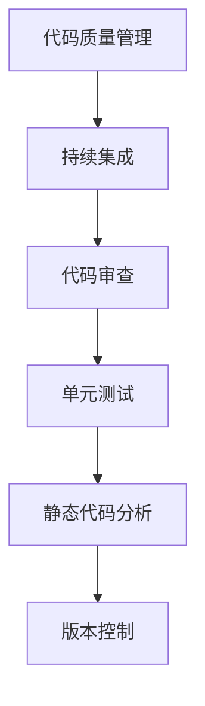

                 

关键词：AI大模型，代码质量，最佳实践，质量保证，持续集成，代码审查，单元测试，静态代码分析，版本控制。

> 摘要：随着人工智能技术的迅猛发展，大模型的应用越来越广泛。然而，大规模的代码管理和质量控制成为了一大挑战。本文将探讨AI大模型应用的代码质量管理最佳实践，包括核心概念、算法原理、数学模型、项目实践以及未来展望，为开发者提供实用的指导。

## 1. 背景介绍

### 大模型时代的到来

随着深度学习技术的成熟和计算资源的不断提升，人工智能（AI）领域迎来了大模型的时代。大模型，尤其是Transformer架构的模型，如GPT、BERT等，已经成为许多任务中的主力军。这些模型在自然语言处理、计算机视觉、推荐系统等领域展现了强大的性能。

### 代码管理的挑战

大模型的应用不仅仅是算法和模型参数的调整，更重要的是大规模的代码管理和质量控制。大规模的代码库、复杂的依赖关系、频繁的版本更新，以及不同开发者的协作，使得代码质量管理变得尤为重要。

### 代码质量的重要性

代码质量是软件项目成功的关键因素。高质量的代码不仅有助于提高开发效率，减少维护成本，还能降低项目风险。在大模型应用中，代码质量的重要性更加凸显，因为错误和缺陷可能会对模型的性能产生严重影响。

## 2. 核心概念与联系

### Mermaid流程图



### 核心概念

- **持续集成（Continuous Integration）**：通过自动化构建和测试，将代码变更频繁地集成到主干分支。
- **代码审查（Code Review）**：通过同行评审，确保代码质量和一致性。
- **单元测试（Unit Testing）**：对代码的独立部分进行测试，确保其功能正确。
- **静态代码分析（Static Code Analysis）**：在不执行代码的情况下，分析代码的语法和结构，找出潜在的问题。
- **版本控制（Version Control）**：跟踪和管理代码变更，确保代码历史的可追溯性。

## 3. 核心算法原理 & 具体操作步骤

### 3.1 算法原理概述

代码质量管理涉及多种算法和工具。以下简要介绍其中几个核心算法的原理。

#### 持续集成

持续集成是一种软件开发实践，通过自动化构建和测试，确保代码库始终处于可运行状态。其主要原理是每次代码提交后，自动触发构建和测试流程，确保新代码不会破坏现有功能。

#### 代码审查

代码审查是一种同行评审过程，通过团队成员之间的交流和反馈，确保代码质量。其原理是基于一系列代码规范和最佳实践，对代码进行详细的检查。

#### 单元测试

单元测试是一种对代码模块进行验证的方法。其原理是设计一系列测试用例，覆盖代码的各个功能点，确保其正常工作。

#### 静态代码分析

静态代码分析是一种在代码未运行时分析其质量和安全性的方法。其原理是使用各种工具，如代码检查器、代码风格检查器，分析代码的语法和结构。

#### 版本控制

版本控制是一种管理代码历史和变更的方法。其原理是记录每一次代码的提交和修改，确保代码的可追溯性和完整性。

### 3.2 算法步骤详解

1. **持续集成**：
   - 定期或实时触发构建和测试。
   - 运行自动化测试套件。
   - 根据测试结果决定是否合并代码。

2. **代码审查**：
   - 提交代码后，由负责人或评审团队进行审查。
   - 提出改进建议和修复建议。
   - 根据评审结果决定是否合并代码。

3. **单元测试**：
   - 设计测试用例。
   - 运行测试用例。
   - 根据测试结果评估代码质量。

4. **静态代码分析**：
   - 使用代码检查器分析代码。
   - 根据报告找出潜在问题。
   - 修复或忽略问题。

5. **版本控制**：
   - 提交代码变更。
   - 查看代码历史和变更记录。
   - 管理代码分支和合并。

### 3.3 算法优缺点

每种算法和工具都有其优缺点。以下简要介绍几种常用算法的优缺点。

#### 持续集成

- 优点：提高代码质量，减少集成风险。
- 缺点：构建和测试时间较长，可能影响开发效率。

#### 代码审查

- 优点：确保代码质量，提高团队协作。
- 缺点：耗时较长，可能影响开发进度。

#### 单元测试

- 优点：快速发现代码缺陷，提高代码可靠性。
- 缺点：测试用例设计复杂，可能难以覆盖所有情况。

#### 静态代码分析

- 优点：无需运行代码，快速发现潜在问题。
- 缺点：可能误报和漏报，依赖工具的质量。

#### 版本控制

- 优点：确保代码历史可追溯，方便协作。
- 缺点：管理复杂，可能引入不必要的分支。

### 3.4 算法应用领域

这些算法和工具广泛应用于各种领域，包括但不限于：

- 软件开发
- 系统集成
- 测试和质量保证
- 代码维护和升级

## 4. 数学模型和公式 & 详细讲解 & 举例说明

### 4.1 数学模型构建

在代码质量管理中，常用的数学模型包括代码复杂度模型、代码质量模型等。以下是一个简单的代码复杂度模型：

$$
C = f(n, L, A)
$$

其中，$C$ 表示代码复杂度，$n$ 表示代码规模，$L$ 表示代码行数，$A$ 表示抽象级别。

### 4.2 公式推导过程

代码复杂度的计算通常基于代码结构。以下是一个简单的推导过程：

$$
C = n \times L \times A
$$

其中，$n$ 表示代码规模，$L$ 表示代码行数，$A$ 表示抽象级别。这个公式假设代码规模、代码行数和抽象级别成正比。

### 4.3 案例分析与讲解

假设我们有一个包含1000行代码的模块，其抽象级别为3。根据上述公式，该模块的代码复杂度为：

$$
C = 1000 \times 3 = 3000
$$

这个值越大，表示代码的复杂度越高。在实际开发中，我们应该尽量降低代码复杂度，以提高代码的可维护性和可读性。

## 5. 项目实践：代码实例和详细解释说明

### 5.1 开发环境搭建

在开始项目实践之前，我们需要搭建一个合适的开发环境。以下是一个简单的步骤：

1. 安装操作系统（如Linux或macOS）。
2. 安装编程语言（如Python或Java）。
3. 安装代码质量管理工具（如Jenkins、Git等）。
4. 配置版本控制工具（如Git）。

### 5.2 源代码详细实现

以下是一个简单的Python代码实例，用于实现一个简单的持续集成过程：

```python
import subprocess

def run_tests():
    # 运行单元测试
    subprocess.run(["python", "test.py"])

def check_code_quality():
    # 运行静态代码分析
    subprocess.run(["python", "code_quality.py"])

def main():
    # 检查代码质量
    check_code_quality()
    # 运行测试
    run_tests()

if __name__ == "__main__":
    main()
```

### 5.3 代码解读与分析

这个示例代码实现了基本的代码质量检查和测试过程。首先，我们定义了两个函数：`run_tests` 和 `check_code_quality`。这两个函数分别用于运行单元测试和静态代码分析。

在 `main` 函数中，我们首先调用 `check_code_quality` 函数，检查代码质量。然后，调用 `run_tests` 函数，运行单元测试。这两个过程都是使用Python的 `subprocess` 模块来调用外部命令。

### 5.4 运行结果展示

运行此代码后，我们将看到一系列输出，包括单元测试的结果和静态代码分析的报告。根据这些结果，我们可以评估代码的质量和发现问题。

## 6. 实际应用场景

### 6.1 软件开发

在软件开发的整个生命周期中，代码质量管理是至关重要的。通过持续集成、代码审查、单元测试、静态代码分析和版本控制，我们可以确保代码的质量和一致性。

### 6.2 自动化测试

在大模型应用中，自动化测试尤为重要。通过编写和运行自动化测试脚本，我们可以快速验证模型的性能和功能。

### 6.3 团队协作

在大规模项目中，团队合作是关键。通过代码审查和版本控制，我们可以确保团队成员之间的代码协同工作。

### 6.4 代码维护

随着项目的不断迭代和更新，代码维护变得尤为重要。通过良好的代码质量和文档，我们可以更轻松地维护和更新代码。

## 7. 工具和资源推荐

### 7.1 学习资源推荐

- 《代码大全》（《The Pragmatic Programmer: From Journeyman to Master》）
- 《敏捷软件开发》（《Agile Software Development: Principles, Patterns, and Practices》）
- 《测试驱动的软件开发》（《Test-Driven Development: By Example》）

### 7.2 开发工具推荐

- 持续集成工具：Jenkins、Travis CI、Circle CI
- 代码审查工具：GitHub、GitLab、Gerrit
- 单元测试工具：JUnit、TestNG、PyTest
- 静态代码分析工具：SonarQube、Checkstyle、PMD

### 7.3 相关论文推荐

- "Continuous Integration in Software Engineering" by Per Ingemar Larsson and Gojko Adzic
- "Code Review: A survey" by Dimiter Gueorguiev, Ulf Wiger, and Mats Gejlerup
- "Static Code Analysis: A Survey" by Zbigniew Kaniewski and Krzysztof Czarnecki

## 8. 总结：未来发展趋势与挑战

### 8.1 研究成果总结

随着人工智能技术的不断发展，代码质量管理的相关研究也在不断深入。持续集成、代码审查、单元测试、静态代码分析和版本控制等技术已经得到了广泛的应用。然而，如何在大规模项目中更有效地应用这些技术，以及如何应对新的挑战，仍然是当前研究的重点。

### 8.2 未来发展趋势

1. **自动化和智能化**：未来的代码质量管理将更加自动化和智能化。通过人工智能技术，我们可以实现更精确的代码质量预测和更智能的代码审查。

2. **跨平台和多云支持**：随着云计算和多云架构的普及，代码质量管理工具将更加适应跨平台和多云环境。

3. **社区和开源**：开源社区将在代码质量管理领域发挥更大的作用。更多的开源工具和框架将出现，为开发者提供更多的选择。

### 8.3 面临的挑战

1. **复杂性和多样性**：随着项目的规模和复杂性的增加，代码质量管理将面临更大的挑战。如何处理多样化的代码库和依赖关系，是一个重要的课题。

2. **性能和可扩展性**：随着代码库的扩大，代码质量管理的工具和算法需要具备更高的性能和可扩展性。

3. **安全性和隐私**：在大数据时代，代码质量管理工具需要确保代码的安全性和隐私。如何防止数据泄露和攻击，是一个重要的挑战。

### 8.4 研究展望

未来的研究将在以下几个方面展开：

1. **智能化代码质量预测**：通过机器学习和大数据分析，实现更准确的代码质量预测。

2. **智能化的代码审查**：利用自然语言处理和人工智能技术，实现更高效的代码审查。

3. **跨平台的代码质量管理**：研究如何在跨平台和多云环境中实现高效的代码质量管理。

4. **代码安全和隐私保护**：研究如何在保证代码质量和效率的同时，确保代码的安全性和隐私。

## 9. 附录：常见问题与解答

### 问题 1：什么是持续集成？

**解答**：持续集成是一种软件开发实践，通过自动化构建和测试，确保代码库始终处于可运行状态。每次代码提交后，自动触发构建和测试流程，确保新代码不会破坏现有功能。

### 问题 2：代码审查的重要性是什么？

**解答**：代码审查是一种同行评审过程，通过团队成员之间的交流和反馈，确保代码质量。它可以提高代码一致性，减少错误和缺陷，提高开发效率。

### 问题 3：如何进行单元测试？

**解答**：单元测试是对代码的独立部分进行测试，确保其功能正确。通常，我们会编写测试用例，覆盖代码的各个功能点。然后，运行测试用例，根据测试结果评估代码质量。

### 问题 4：静态代码分析的作用是什么？

**解答**：静态代码分析是一种在代码未运行时分析其质量和安全性的方法。它可以帮助我们快速发现潜在的问题，如代码冗余、安全漏洞等，从而提高代码质量。

### 问题 5：版本控制的主要功能是什么？

**解答**：版本控制是一种管理代码历史和变更的方法。它可以帮助我们跟踪代码的每一次变更，确保代码历史的可追溯性，从而方便协作和代码维护。

---

作者：禅与计算机程序设计艺术 / Zen and the Art of Computer Programming

