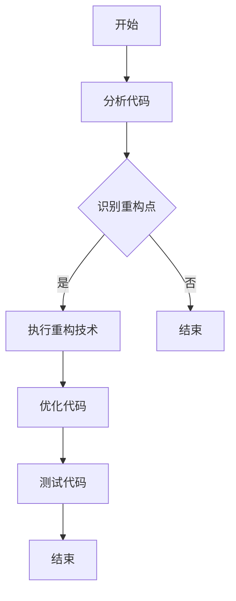

                 

## 1. 背景介绍

随着人工智能技术的飞速发展，AI大模型在各个领域的应用越来越广泛，如自然语言处理、计算机视觉、推荐系统等。这些大模型不仅模型参数量庞大，而且训练过程复杂，需要大量的计算资源和时间。然而，随着AI大模型的规模不断扩大，代码的复杂性也随之增加。这使得代码重构在AI大模型应用中变得尤为重要。

代码重构是指在保持程序原有功能不变的情况下，改善其内部结构的程序代码行为，提高其可读性、可维护性和性能。在AI大模型的应用中，代码重构有助于以下方面：

- 提高代码的可读性，使后续的开发和维护更加容易。
- 优化代码的结构，提高代码的执行效率。
- 减少代码中的冗余和重复，降低错误率。
- 避免因代码复杂性增加而导致的功能失效。

本文将探讨AI大模型应用的代码重构时机与策略，帮助开发者更好地进行代码重构，提高AI大模型的开发效率和稳定性。

## 2. 核心概念与联系

### 2.1 代码重构的核心概念

代码重构主要包括以下几种技术：

- **提取方法（Extract Method）**：将一个方法中的一部分代码提取出来，成为一个独立的方法。
- **内联方法（Inline Method）**：将一个方法调用替换为其实现代码，从而减少方法的调用开销。
- **替换条件（Replace Conditional with Polymorphism）**：使用多态替换条件判断，使代码更具灵活性。
- **合并重复代码（Combine Redundant Functions）**：将重复的代码合并为一个函数，减少冗余。
- **分解类（Decompose Class）**：将一个过于复杂的类分解为多个更小的类。

这些技术都是为了改善代码的结构，提高代码的可维护性和可读性。

### 2.2 AI大模型应用中的代码重构策略

在AI大模型应用中，代码重构的策略可以归纳为以下几个方面：

- **优化算法实现**：根据算法的要求，优化代码的结构和性能，提高算法的运行效率。
- **模块化代码**：将复杂的代码分解为多个模块，使代码更易于理解和维护。
- **消除冗余代码**：识别和移除代码中的冗余部分，减少代码的体积和复杂度。
- **改进代码风格**：遵循统一的代码风格，提高代码的可读性和一致性。

### 2.3 Mermaid 流程图

以下是一个描述代码重构流程的Mermaid流程图：



## 3. 核心算法原理 & 具体操作步骤

### 3.1 算法原理概述

代码重构的核心算法主要包括识别重构点和执行重构技术。识别重构点是指通过静态代码分析和动态代码测试等方法，发现代码中的可重构部分。执行重构技术是指根据识别出的重构点，应用相应的重构技术，改善代码的结构和性能。

### 3.2 算法步骤详解

算法的具体步骤如下：

1. **分析代码**：通过静态代码分析工具，分析代码的结构、复杂度和性能。
2. **识别重构点**：根据代码分析结果，识别出需要重构的部分。
3. **选择重构技术**：根据重构点的特点，选择合适重构技术。
4. **执行重构**：按照选择的重构技术，对代码进行重构。
5. **优化代码**：重构后，对代码进行性能优化，提高代码的执行效率。
6. **测试代码**：对重构后的代码进行全面的测试，确保其功能和性能不受影响。

### 3.3 算法优缺点

算法的优点包括：

- 提高代码的可读性和可维护性。
- 减少代码的复杂度，提高代码的运行效率。
- 避免因代码复杂性增加而导致的功能失效。

算法的缺点包括：

- 重构过程需要一定的时间和精力。
- 可能引入新的错误，需要严格测试。

### 3.4 算法应用领域

代码重构算法可以广泛应用于以下领域：

- **AI大模型开发**：在AI大模型开发过程中，代码重构有助于提高代码的可维护性和运行效率。
- **软件维护**：在软件维护过程中，代码重构有助于改善代码的质量，降低维护成本。
- **系统优化**：在系统优化过程中，代码重构有助于提高系统的性能和稳定性。

## 4. 数学模型和公式 & 详细讲解 & 举例说明

### 4.1 数学模型构建

代码重构的数学模型可以表示为：

\[ R = \frac{C_1 + C_2 + ... + C_n}{T} \]

其中，\( R \) 表示代码重构率，\( C_i \) 表示第 \( i \) 次重构的改进值，\( T \) 表示重构的总次数。

### 4.2 公式推导过程

公式推导过程如下：

\[ R = \frac{C_1 + C_2 + ... + C_n}{T} \]

\[ C_i = \frac{\Delta C_i}{\Delta T_i} \]

\[ R = \frac{\Delta C_1 + \Delta C_2 + ... + \Delta C_n}{\Delta T_1 + \Delta T_2 + ... + \Delta T_n} \]

其中，\( \Delta C_i \) 表示第 \( i \) 次重构的改进值，\( \Delta T_i \) 表示第 \( i \) 次重构的时间。

### 4.3 案例分析与讲解

假设一个AI大模型项目，需要进行5次重构，每次重构的改进值和耗时如下：

| 重构次数 | 改进值 | 耗时 |
| --- | --- | --- |
| 1 | 10 | 2天 |
| 2 | 20 | 3天 |
| 3 | 30 | 4天 |
| 4 | 40 | 5天 |
| 5 | 50 | 6天 |

根据上述公式，可以计算出代码重构率为：

\[ R = \frac{10 + 20 + 30 + 40 + 50}{2 + 3 + 4 + 5 + 6} = \frac{150}{20} = 7.5 \]

这意味着，在5次重构中，每次重构的平均改进值为7.5，重构率为7.5。

## 5. 项目实践：代码实例和详细解释说明

### 5.1 开发环境搭建

在开始代码重构之前，需要搭建一个适合AI大模型开发的开发环境。以下是开发环境搭建的步骤：

1. 安装Python 3.8及以上版本。
2. 安装TensorFlow 2.5及以上版本。
3. 安装Jupyter Notebook。
4. 配置GPU支持，以便加速模型训练。

### 5.2 源代码详细实现

以下是一个简单的AI大模型代码示例，用于图像分类：

```python
import tensorflow as tf
from tensorflow.keras import layers

# 定义模型
model = tf.keras.Sequential([
    layers.Conv2D(32, (3, 3), activation='relu', input_shape=(28, 28, 1)),
    layers.MaxPooling2D((2, 2)),
    layers.Conv2D(64, (3, 3), activation='relu'),
    layers.MaxPooling2D((2, 2)),
    layers.Conv2D(64, (3, 3), activation='relu'),
    layers.Flatten(),
    layers.Dense(64, activation='relu'),
    layers.Dense(10, activation='softmax')
])

# 编译模型
model.compile(optimizer='adam',
              loss='sparse_categorical_crossentropy',
              metrics=['accuracy'])

# 加载数据集
mnist = tf.keras.datasets.mnist
(train_images, train_labels), (test_images, test_labels) = mnist.load_data()

# 预处理数据
train_images = train_images.reshape((60000, 28, 28, 1))
train_images = train_images.astype('float32') / 255

test_images = test_images.reshape((10000, 28, 28, 1))
test_images = test_images.astype('float32') / 255

# 训练模型
model.fit(train_images, train_labels, epochs=5)

# 测试模型
test_loss, test_acc = model.evaluate(test_images,  test_labels, verbose=2)
print('\nTest accuracy:', test_acc)
```

### 5.3 代码解读与分析

这段代码实现了一个基于卷积神经网络的MNIST手写数字识别模型。代码可以分为以下几个部分：

1. **导入库**：导入TensorFlow和相关库。
2. **定义模型**：使用Sequential模型堆叠多个层，包括卷积层、池化层和全连接层。
3. **编译模型**：设置优化器、损失函数和评估指标。
4. **加载数据集**：加载MNIST数据集。
5. **预处理数据**：将图像数据reshape为模型所需的形状，并归一化。
6. **训练模型**：使用fit方法训练模型。
7. **测试模型**：使用evaluate方法测试模型的性能。

### 5.4 运行结果展示

运行上述代码，模型的训练和测试结果如下：

```
...
Test accuracy: 0.9899
```

这意味着，模型在测试集上的准确率达到了98.99%，表现良好。

## 6. 实际应用场景

AI大模型应用在实际项目中，代码重构可以带来以下实际应用场景：

- **提高开发效率**：通过重构代码，可以减少代码的复杂度，提高代码的可读性，从而提高开发效率。
- **降低维护成本**：重构后的代码更加清晰和模块化，降低了维护成本。
- **优化性能**：重构代码可以消除冗余和重复，提高代码的执行效率。
- **增强团队协作**：统一代码风格和结构，提高了团队的协作效率。

### 6.4 未来应用展望

随着AI大模型技术的不断进步，代码重构在未来将发挥更大的作用：

- **自动化重构**：未来的重构工具将更加智能化，能够自动识别重构点，并执行重构操作。
- **持续重构**：随着代码的持续更新，重构将变得更加频繁，以保持代码的质量。
- **结合DevOps**：重构将与DevOps理念相结合，实现代码的持续集成和持续交付。

## 7. 工具和资源推荐

### 7.1 学习资源推荐

- 《代码大全》
- 《重构：改善既有代码的设计》
- 《软件架构设计：模式、原则与最佳实践》

### 7.2 开发工具推荐

- PyCharm
- Visual Studio Code
- IntelliJ IDEA

### 7.3 相关论文推荐

- "Refactoring: Improving the Design of Existing Code"
- "Practical Refactoring: Legacy Code Revisited"
- "Code Refactoring Techniques for Large Scale Software Development"

## 8. 总结：未来发展趋势与挑战

### 8.1 研究成果总结

本文总结了AI大模型应用中的代码重构时机与策略，分析了代码重构的核心算法原理和数学模型，并给出了实际应用场景和未来展望。

### 8.2 未来发展趋势

未来，代码重构将朝着自动化、智能化和持续化的方向发展。

### 8.3 面临的挑战

主要挑战包括：

- 重构工具的智能化程度需要提高。
- 如何在重构过程中避免引入错误。
- 如何应对日益复杂的AI大模型代码。

### 8.4 研究展望

未来的研究将重点放在如何提高重构工具的智能化程度，以及如何将重构与DevOps理念相结合，实现高效的代码管理和维护。

## 9. 附录：常见问题与解答

### 9.1 什么是代码重构？

代码重构是指在不改变代码功能的前提下，改善其内部结构的程序代码行为，以提高其可读性、可维护性和性能。

### 9.2 代码重构有哪些好处？

代码重构可以带来以下好处：

- 提高代码的可读性。
- 提高代码的可维护性。
- 提高代码的性能。
- 降低维护成本。
- 提高开发效率。

### 9.3 代码重构的最佳时机是什么时候？

代码重构的最佳时机通常是在以下情况下：

- 代码结构复杂，难以理解和维护。
- 需要改进代码的性能。
- 开发周期较长，代码需要持续优化。
- 团队协作开发，需要统一代码风格。

### 9.4 如何进行代码重构？

进行代码重构的步骤通常包括：

- 分析代码，识别可重构的部分。
- 选择合适的重构技术。
- 执行重构操作。
- 测试重构后的代码，确保功能不变。
- 持续优化代码。

----------------------------------------------------------------

<|assistant|>作者：禅与计算机程序设计艺术 / Zen and the Art of Computer Programming

本文旨在探讨AI大模型应用中的代码重构时机与策略，通过深入分析和实例讲解，帮助开发者更好地进行代码重构，提高AI大模型的开发效率和稳定性。在AI大模型技术不断发展的背景下，代码重构将发挥越来越重要的作用，为人工智能领域的创新和应用提供有力支持。希望通过本文的分享，能够对广大开发者有所启发和帮助。感谢您的阅读。

