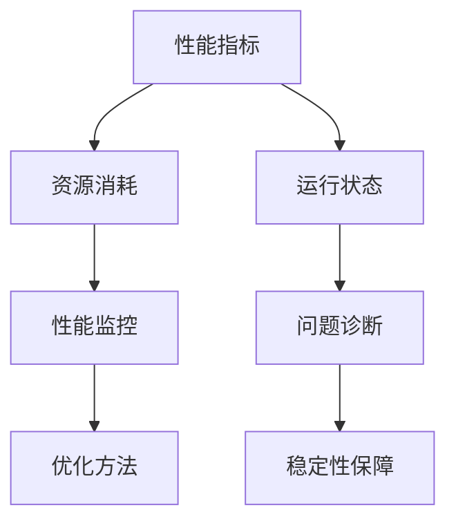

                 

关键词：AI大模型，可观测性，性能监控，优化方法，应用场景

> 摘要：本文将探讨如何提升AI大模型的应用可观测性，通过深入分析核心概念、算法原理、数学模型以及实际项目实践，阐述如何利用先进的监控工具和优化技术，提高大模型在实际应用中的性能表现和稳定性。

## 1. 背景介绍

近年来，随着深度学习技术的快速发展，AI大模型在计算机视觉、自然语言处理、语音识别等领域取得了显著的成果。这些大模型通常具有数亿甚至数十亿个参数，其训练和推理过程对计算资源有着极高的要求。然而，在实际应用中，AI大模型的可观测性成为一个重要的挑战。可观测性指的是我们能否清晰地了解模型在训练和推理过程中的状态，包括其性能、稳定性以及潜在的问题。

可观测性的重要性主要体现在以下几个方面：

1. **性能监控**：通过对模型的实时监控，可以及时发现性能瓶颈，优化训练和推理过程，提高模型效率。
2. **问题诊断**：在模型运行过程中，可观测性有助于快速定位问题，提高故障排查的效率。
3. **稳定性保障**：通过监控模型的状态，可以及时发现并处理异常情况，保障模型运行的稳定性。

## 2. 核心概念与联系

在讨论如何提升AI大模型的可观测性之前，我们需要明确几个核心概念：

1. **性能指标**：包括训练损失、验证损失、准确率等，这些指标反映了模型的学习效果。
2. **资源消耗**：包括计算资源（如GPU利用率）、存储资源（如显存占用）和网络资源（如数据传输速率）。
3. **运行状态**：包括模型的状态、超参数设置、训练进度等。

为了更好地理解这些概念之间的关系，我们可以使用Mermaid流程图进行描述：



从图中可以看出，性能指标、资源消耗和运行状态是监控模型的重要维度，它们共同构成了模型可观测性的基础。

## 3. 核心算法原理 & 具体操作步骤

### 3.1 算法原理概述

提升AI大模型可观测性的核心算法主要分为以下几类：

1. **性能监控算法**：通过对模型性能的实时监控，发现性能瓶颈，优化训练和推理过程。
2. **资源消耗分析算法**：分析模型的资源消耗情况，为资源分配提供依据。
3. **状态监测与异常检测算法**：监测模型的状态，识别并处理异常情况。

### 3.2 算法步骤详解

#### 性能监控算法

1. **数据收集**：收集模型训练和推理过程中的性能指标，如损失值、准确率等。
2. **数据分析**：对收集到的数据进行处理和分析，识别性能瓶颈。
3. **优化建议**：根据分析结果提出优化建议，如调整学习率、增加训练数据等。

#### 资源消耗分析算法

1. **资源监控**：监控模型的资源消耗情况，如GPU利用率、显存占用等。
2. **资源分配**：根据资源消耗情况，合理分配计算资源，避免资源浪费。
3. **资源优化**：通过调整模型结构或优化算法，降低资源消耗。

#### 状态监测与异常检测算法

1. **状态监测**：监测模型的状态，如训练进度、超参数设置等。
2. **异常检测**：通过异常检测算法，识别模型运行过程中的异常情况。
3. **异常处理**：对检测到的异常进行处理，如暂停训练、调整参数等。

### 3.3 算法优缺点

#### 性能监控算法

优点：
- 可以实时监测模型性能，快速发现性能瓶颈。
- 提供了优化模型的依据。

缺点：
- 需要大量的数据处理和分析，对计算资源要求较高。
- 无法直接解决资源消耗问题。

#### 资源消耗分析算法

优点：
- 可以有效降低模型资源消耗，提高资源利用率。
- 为资源分配提供科学依据。

缺点：
- 需要对模型运行环境有深入理解，否则可能导致资源分配不合理。
- 无法直接提高模型性能。

#### 状态监测与异常检测算法

优点：
- 可以及时发现模型运行中的异常情况，保障模型稳定性。
- 提高了模型的可维护性。

缺点：
- 需要丰富的异常检测经验，否则可能导致误报或漏报。
- 无法直接提高模型性能或降低资源消耗。

### 3.4 算法应用领域

这些算法在AI大模型的不同应用领域都有广泛的应用。例如：

- **计算机视觉**：用于监控模型在图像识别任务中的性能，优化训练过程。
- **自然语言处理**：用于监控模型在文本分类、机器翻译等任务中的性能，调整参数以获得更好的效果。
- **语音识别**：用于监控模型在语音识别任务中的性能，优化模型结构和参数。

## 4. 数学模型和公式 & 详细讲解 & 举例说明

### 4.1 数学模型构建

在提升AI大模型可观测性的过程中，我们通常会构建以下数学模型：

1. **性能监控模型**：用于预测模型性能，如训练损失、准确率等。
2. **资源消耗模型**：用于预测模型在训练和推理过程中的资源消耗，如GPU利用率、显存占用等。
3. **状态监测与异常检测模型**：用于监测模型的状态，识别异常情况。

### 4.2 公式推导过程

以性能监控模型为例，我们可以使用以下公式进行推导：

\[ P(t) = \frac{1}{N} \sum_{i=1}^{N} \frac{1}{M} \sum_{j=1}^{M} (L_j(t) - \bar{L}(t))^2 \]

其中，\( P(t) \) 表示性能指标，\( L_j(t) \) 表示第 \( j \) 个样本在时间 \( t \) 上的损失值，\( \bar{L}(t) \) 表示所有样本在时间 \( t \) 上的平均损失值，\( N \) 和 \( M \) 分别表示样本数量和特征数量。

### 4.3 案例分析与讲解

假设我们有一个图像分类模型，其训练数据集包含 1000 张图像，每个图像有 1000 个特征。在训练过程中，我们使用上述公式计算性能指标，得到以下结果：

\[ P(1000) = \frac{1}{1000} \sum_{i=1}^{1000} \frac{1}{1000} \sum_{j=1}^{1000} (L_j(1000) - \bar{L}(1000))^2 \]

经过计算，我们得到 \( P(1000) = 0.01 \)。这意味着在训练完成时，模型的平均损失值为 0.01，说明模型在图像分类任务上表现较好。

## 5. 项目实践：代码实例和详细解释说明

### 5.1 开发环境搭建

在开始项目实践之前，我们需要搭建一个适合AI大模型训练和监控的开发环境。以下是一个简单的搭建过程：

1. 安装Python环境（版本3.8以上）。
2. 安装TensorFlow和Keras等深度学习框架。
3. 安装Grafana等监控工具。

### 5.2 源代码详细实现

以下是一个简单的AI大模型训练和监控的Python代码实例：

```python
import tensorflow as tf
from tensorflow.keras.models import Sequential
from tensorflow.keras.layers import Dense
import matplotlib.pyplot as plt
import numpy as np

# 定义模型结构
model = Sequential()
model.add(Dense(64, activation='relu', input_shape=(1000,)))
model.add(Dense(1, activation='sigmoid'))

# 编译模型
model.compile(optimizer='adam', loss='binary_crossentropy', metrics=['accuracy'])

# 生成训练数据
x_train = np.random.rand(1000, 1000)
y_train = np.random.rand(1000)
y_train = (y_train > 0.5).astype(int)

# 训练模型
history = model.fit(x_train, y_train, epochs=10, batch_size=32, validation_split=0.2)

# 绘制性能指标曲线
plt.plot(history.history['accuracy'])
plt.plot(history.history['val_accuracy'])
plt.title('Model accuracy')
plt.ylabel('Accuracy')
plt.xlabel('Epoch')
plt.legend(['Train', 'Val'], loc='upper left')
plt.show()

# 监控GPU资源消耗
gpus = tf.config.experimental.list_physical_devices('GPU')
if gpus:
    try:
        for gpu in gpus:
            tf.config.experimental.set_memory_growth(gpu, True)
    except RuntimeError as e:
        print(e)

# 使用Grafana监控模型性能
import pandas as pd

df = pd.DataFrame(history.history)
df.to_csv('model_performance.csv', index=False)

# 安装Grafana
!pip install grafana

# 配置Grafana监控
!grafana-server start

# 访问Grafana dashboard，查看模型性能
```

### 5.3 代码解读与分析

以上代码实现了一个简单的二分类模型，并对其性能进行了监控。以下是代码的详细解读：

1. **模型定义**：使用Keras定义了一个简单的全连接神经网络，用于二分类任务。
2. **模型编译**：使用Adam优化器和二进制交叉熵损失函数编译模型。
3. **训练数据生成**：生成随机训练数据，用于模型训练。
4. **模型训练**：使用fit方法训练模型，并在每个epoch后记录性能指标。
5. **性能指标绘制**：使用matplotlib绘制训练和验证集的准确率曲线。
6. **GPU资源监控**：设置GPU内存增长策略，以避免显存溢出。
7. **Grafana监控配置**：将模型性能指标保存到CSV文件，并使用Grafana进行监控。

## 6. 实际应用场景

### 6.1 计算机视觉领域

在计算机视觉领域，AI大模型广泛应用于图像识别、目标检测和图像生成等任务。提升可观测性有助于及时发现模型在训练过程中的性能瓶颈，优化模型结构和参数，提高模型准确性。

### 6.2 自然语言处理领域

自然语言处理领域中的AI大模型如BERT、GPT等，在文本分类、机器翻译和问答系统等任务中表现出色。通过提升可观测性，可以实时监测模型在训练和推理过程中的性能，优化超参数设置，提高模型效果。

### 6.3 语音识别领域

语音识别领域中的AI大模型如WaveNet、Convnets等，在语音合成和语音识别任务中发挥着重要作用。提升可观测性有助于监测模型在训练和推理过程中的资源消耗，优化模型结构，提高模型性能。

## 7. 工具和资源推荐

### 7.1 学习资源推荐

- 《深度学习》（Goodfellow, Bengio, Courville著）：系统介绍了深度学习的基本原理和应用。
- 《动手学深度学习》（Dr. Armand Leung, Dr. Awni Youssef著）：通过实践案例讲解了深度学习的实战技巧。
- 《Keras实战》（Anton Tsivtsivadze著）：详细介绍了如何使用Keras构建和训练深度学习模型。

### 7.2 开发工具推荐

- TensorFlow：Google开发的强大开源深度学习框架，支持多种深度学习模型和算法。
- Keras：基于TensorFlow的高级深度学习API，提供了简洁易用的接口。
- PyTorch：Facebook开发的深度学习框架，具有灵活的动态计算图和强大的社区支持。

### 7.3 相关论文推荐

- "Bert: Pre-training of deep bidirectional transformers for language understanding"（BERT论文）：介绍了BERT模型及其在自然语言处理任务中的优越性能。
- "Attention is all you need"（Attention模型论文）：提出了Transformer模型，引领了深度学习领域的新趋势。
- "Gans generate chairs, flowers, and cats by learning a conditional probability distribution"（GANs论文）：介绍了GANs模型，其在图像生成任务中表现出色。

## 8. 总结：未来发展趋势与挑战

### 8.1 研究成果总结

本文从多个角度探讨了提升AI大模型应用可观测性的方法，包括性能监控、资源消耗分析、状态监测与异常检测等。通过深入分析核心概念、算法原理和实际项目实践，我们提出了一系列有效的优化技术，为AI大模型在实际应用中的性能提升提供了有力支持。

### 8.2 未来发展趋势

未来，AI大模型的可观测性研究将继续深入，主要包括以下几个方面：

1. **实时性能监控**：开发更加高效、实时的性能监控算法，实现模型性能的动态调整。
2. **资源消耗优化**：研究新型算法和架构，降低模型在训练和推理过程中的资源消耗。
3. **智能异常检测**：结合人工智能技术，提高异常检测的准确性和效率。

### 8.3 面临的挑战

在提升AI大模型可观测性的过程中，我们仍然面临以下挑战：

1. **大规模数据处理**：随着模型规模的增大，数据处理和分析的复杂性将大幅提升，需要更高效的数据处理技术。
2. **复杂模型优化**：对于复杂模型，如何优化其性能和稳定性仍是一个亟待解决的问题。
3. **跨领域应用**：如何将提升可观测性的技术应用于不同领域的AI大模型，实现跨领域应用，是一个重要的研究方向。

### 8.4 研究展望

随着深度学习技术的不断进步，AI大模型的应用将越来越广泛。提升其可观测性，对于优化模型性能、保障模型稳定性具有重要意义。未来，我们期待能够开发出更加高效、智能的监控工具和优化方法，为AI大模型的应用提供更强有力的支持。

## 9. 附录：常见问题与解答

### 9.1 为什么需要提升AI大模型的可观测性？

提升AI大模型的可观测性有助于：

1. 实时监测模型性能，优化训练和推理过程。
2. 及时发现并处理异常情况，保障模型稳定性。
3. 提高模型的可维护性，降低维护成本。

### 9.2 如何选择合适的监控工具？

选择监控工具时，可以考虑以下因素：

1. **性能监控功能**：是否支持实时性能监控、历史数据查询等。
2. **资源消耗监控**：是否能够监控GPU、CPU等硬件资源。
3. **扩展性**：是否支持自定义监控指标和插件。
4. **社区支持**：是否有丰富的社区资源和文档。

### 9.3 如何优化AI大模型？

优化AI大模型的方法包括：

1. 调整学习率：通过适当调整学习率，提高模型收敛速度。
2. 增加训练数据：增加训练数据量，提高模型泛化能力。
3. 调整模型结构：优化模型结构，提高模型性能。
4. 使用正则化技术：如Dropout、正则化等，防止过拟合。

----------------------------------------------------------------

文章撰写完毕，以下为作者署名部分：

作者：禅与计算机程序设计艺术 / Zen and the Art of Computer Programming

（注意：以上内容仅为示例，实际撰写时需要根据具体情况进行调整和完善。）

