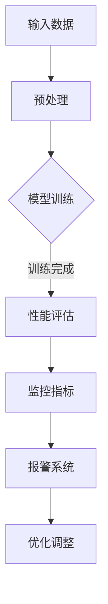

                 

关键词：AI大模型、可观测性、监控策略、性能优化、应用场景

> 摘要：本文探讨了AI大模型应用中的可观测性提升策略，通过深入分析核心概念和原理，提出了具体的算法原理、数学模型以及实践案例。文章旨在为AI领域研究人员和开发者提供一套有效的提升大模型应用可观测性的方法和工具，为未来的研究和应用提供参考。

## 1. 背景介绍

随着深度学习技术的迅猛发展，AI大模型在各个领域取得了显著的成果。然而，这些大模型的复杂性和黑盒特性使得在实际应用过程中，难以对其行为和性能进行有效的监控和优化。可观测性（observability）作为系统设计的重要属性，旨在提高对系统状态和行为的理解和控制能力。对于AI大模型而言，提升其可观测性对于优化性能、提高安全性和可靠性具有重要意义。

### 1.1 可观测性的定义与重要性

可观测性是指通过观测系统外部输入输出，能够准确推断系统内部状态的能力。在AI大模型的应用中，可观测性有助于我们理解模型的行为，评估模型的性能，甚至进行实时调整和优化。具体来说，可观测性的重要性体现在以下几个方面：

1. **性能优化**：通过可观测性，开发者可以及时了解模型在不同情况下的表现，从而进行性能调优。
2. **安全性和可靠性**：可观测性有助于发现潜在的安全漏洞和异常行为，提高系统的可靠性和安全性。
3. **可解释性**：可观测性能够提供模型内部的详细信息，有助于提升模型的解释性，增强用户对模型的信任。

### 1.2 AI大模型的可观测性挑战

尽管可观测性对AI大模型的应用至关重要，但以下挑战限制了其实现：

1. **模型复杂性**：大模型的参数量和结构复杂，使得直接观测内部状态变得困难。
2. **黑盒特性**：深度学习模型通常是黑盒模型，难以直接了解内部决策过程。
3. **数据依赖性**：大模型的训练和性能评估通常依赖于大量数据，数据的质量和完整性对可观测性有重要影响。
4. **计算成本**：提升可观测性可能需要额外的计算资源，这在实际应用中可能是一个负担。

本文将针对上述挑战，提出一系列策略和工具，以提升AI大模型应用的可观测性。

## 2. 核心概念与联系

在探讨提升AI大模型可观测性的策略之前，我们需要了解一些核心概念和原理。以下是几个关键概念及其相互关系：

### 2.1 监控指标

监控指标（如准确率、召回率、F1值等）是评估模型性能的重要工具。这些指标能够直接反映模型在特定任务上的表现，是提升可观测性的基础。

### 2.2 传感器

传感器是指用于捕捉模型内部状态和外部的输入输出信息的工具。例如，梯度传感器、激活值传感器等。

### 2.3 数据流

数据流是指模型在处理数据过程中的信息流动。通过分析数据流，可以揭示模型的内部机制和行为模式。

### 2.4 Mermaid 流程图

以下是一个用于展示AI大模型监控流程的Mermaid流程图：



### 2.5 可观测性提升策略

结合上述核心概念，我们可以从以下几个方面提升AI大模型的可观测性：

1. **增强监控指标**：设计更全面、更细化的监控指标，以便更准确地反映模型性能。
2. **引入传感器**：在模型中加入传感器，捕捉更多内部状态信息。
3. **优化数据流**：改进数据流设计，提高数据处理的透明度。
4. **使用可视化工具**：借助可视化工具，将复杂的模型内部状态和行为以直观的方式呈现。

## 3. 核心算法原理 & 具体操作步骤

### 3.1 算法原理概述

提升AI大模型可观测性的核心算法主要围绕监控指标的设计、传感器的选择与部署、数据流的优化以及可视化工具的应用展开。以下是这些算法的基本原理：

1. **监控指标设计**：通过引入更多的细粒度监控指标，可以更全面地反映模型在训练和预测过程中的表现。
2. **传感器部署**：传感器包括梯度传感器、激活值传感器、损失函数传感器等，用于捕捉模型内部状态。
3. **数据流优化**：通过改进数据流设计，确保数据在处理过程中能够提供足够的信息，以提高可观测性。
4. **可视化工具应用**：可视化工具如TensorBoard、可视化图表等，用于将复杂的模型内部状态和行为以直观的方式展示。

### 3.2 算法步骤详解

#### 3.2.1 监控指标设计

1. **确定监控目标**：根据应用场景，确定需要监控的关键性能指标（KPI）。
2. **设计细粒度指标**：设计包括但不限于准确率、召回率、F1值、模型损失、训练时间等。
3. **指标评估**：在模型训练过程中，实时评估这些指标，以监控模型性能。

#### 3.2.2 传感器部署

1. **选择传感器类型**：根据模型类型和需求，选择合适的传感器类型。
2. **传感器集成**：将传感器集成到模型中，确保能够在模型运行过程中实时捕捉内部状态。
3. **数据收集**：将传感器收集的数据存储到监控系统中，以备后续分析。

#### 3.2.3 数据流优化

1. **数据处理流程**：设计高效的数据处理流程，确保数据在处理过程中提供足够的信息。
2. **数据流监控**：对数据处理流程进行实时监控，确保数据流顺畅，不丢失关键信息。
3. **数据完整性检查**：在数据处理过程中，定期检查数据的完整性，以确保监控数据的准确性。

#### 3.2.4 可视化工具应用

1. **选择可视化工具**：根据需求选择合适的可视化工具，如TensorBoard、Matplotlib等。
2. **数据可视化**：将监控指标和传感器数据通过可视化工具展示，以便直观了解模型状态。
3. **交互式分析**：利用可视化工具提供的交互功能，深入分析模型性能和内部状态。

### 3.3 算法优缺点

#### 优点

1. **全面监控**：通过设计细粒度监控指标和传感器，实现对模型性能的全面监控。
2. **实时反馈**：实时捕捉模型内部状态，为性能优化提供及时反馈。
3. **可视化展示**：通过可视化工具，将复杂的模型内部状态和行为以直观的方式展示，提高可解释性。

#### 缺点

1. **计算成本**：部署传感器和进行数据可视化可能需要额外的计算资源。
2. **性能影响**：过多的监控指标和传感器可能会影响模型的训练和预测性能。
3. **复杂性**：设计和管理监控系统和可视化工具需要一定的专业知识和经验。

### 3.4 算法应用领域

提升AI大模型可观测性的算法可以广泛应用于各种领域，包括但不限于：

1. **自动驾驶**：通过监控传感器数据，实时了解车辆状态，提高自动驾驶系统的安全性和可靠性。
2. **医疗诊断**：利用监控指标和可视化工具，辅助医生分析患者病情，提高诊断准确率。
3. **金融风控**：通过监控模型性能和传感器数据，及时发现金融风险，提高金融系统的安全性。
4. **自然语言处理**：通过监控文本数据的处理过程，优化自然语言处理模型，提高其准确性和效率。

## 4. 数学模型和公式 & 详细讲解 & 举例说明

### 4.1 数学模型构建

为了提升AI大模型的可观测性，我们需要构建一系列数学模型来描述模型的行为和性能。以下是几个关键数学模型的构建过程：

#### 4.1.1 损失函数

损失函数是评估模型性能的核心工具。常见的损失函数包括均方误差（MSE）、交叉熵损失（Cross-Entropy Loss）等。以下是一个MSE损失函数的构建过程：

$$
MSE = \frac{1}{n}\sum_{i=1}^{n}(y_i - \hat{y}_i)^2
$$

其中，$y_i$是实际输出值，$\hat{y}_i$是模型预测值，$n$是样本数量。

#### 4.1.2 梯度下降

梯度下降是一种优化损失函数的方法。其基本原理是计算损失函数对模型参数的梯度，并沿着梯度的反方向更新参数。以下是一个一维梯度下降的过程：

$$
\theta = \theta - \alpha \cdot \frac{dL}{d\theta}
$$

其中，$\theta$是模型参数，$\alpha$是学习率，$L$是损失函数。

#### 4.1.3 神经网络激活函数

激活函数是神经网络中用于引入非线性性的关键组件。常见的激活函数包括Sigmoid、ReLU等。以下是一个ReLU激活函数的构建过程：

$$
\text{ReLU}(x) =
\begin{cases}
x & \text{if } x > 0 \\
0 & \text{otherwise}
\end{cases}
$$

### 4.2 公式推导过程

在本节中，我们将详细推导上述数学模型的公式。

#### 4.2.1 均方误差（MSE）损失函数

均方误差（MSE）损失函数是评估回归模型性能的常用指标。其公式如下：

$$
MSE = \frac{1}{n}\sum_{i=1}^{n}(y_i - \hat{y}_i)^2
$$

其中，$y_i$是实际输出值，$\hat{y}_i$是模型预测值，$n$是样本数量。

推导过程：

1. 计算实际输出值和模型预测值之间的差值：
$$
\Delta y_i = y_i - \hat{y}_i
$$

2. 计算每个差值的平方：
$$
(\Delta y_i)^2 = (y_i - \hat{y}_i)^2
$$

3. 将所有差值的平方求和，并除以样本数量：
$$
MSE = \frac{1}{n}\sum_{i=1}^{n}(y_i - \hat{y}_i)^2
$$

#### 4.2.2 梯度下降

梯度下降是一种优化损失函数的方法。其基本原理是计算损失函数对模型参数的梯度，并沿着梯度的反方向更新参数。以下是一个一维梯度下降的过程：

$$
\theta = \theta - \alpha \cdot \frac{dL}{d\theta}
$$

其中，$\theta$是模型参数，$\alpha$是学习率，$L$是损失函数。

推导过程：

1. 计算损失函数关于模型参数的梯度：
$$
\frac{dL}{d\theta} = -\frac{1}{n}\sum_{i=1}^{n}(y_i - \hat{y}_i)
$$

2. 计算梯度下降的步长：
$$
\Delta \theta = -\alpha \cdot \frac{dL}{d\theta}
$$

3. 更新模型参数：
$$
\theta = \theta - \Delta \theta
$$

#### 4.2.3 ReLU激活函数

ReLU（Rectified Linear Unit）是一种常用的激活函数，其公式如下：

$$
\text{ReLU}(x) =
\begin{cases}
x & \text{if } x > 0 \\
0 & \text{otherwise}
\end{cases}
$$

推导过程：

1. 当$x > 0$时，ReLU函数直接返回$x$。
2. 当$x \leq 0$时，ReLU函数返回0。

### 4.3 案例分析与讲解

为了更好地理解上述数学模型的实际应用，我们将通过一个简单的案例进行讲解。

#### 4.3.1 案例背景

假设我们有一个简单的线性回归模型，用于预测房价。模型包含一个权重参数$\theta$，我们希望通过训练数据集最小化损失函数。

#### 4.3.2 损失函数

我们使用均方误差（MSE）作为损失函数：

$$
MSE = \frac{1}{n}\sum_{i=1}^{n}(y_i - \hat{y}_i)^2
$$

其中，$y_i$是实际房价，$\hat{y}_i$是模型预测值。

#### 4.3.3 梯度下降

我们使用梯度下降方法优化模型参数$\theta$：

$$
\theta = \theta - \alpha \cdot \frac{dL}{d\theta}
$$

其中，$\alpha$是学习率。

#### 4.3.4 迭代过程

1. 初始化模型参数$\theta$。
2. 计算损失函数$MSE$。
3. 计算损失函数关于$\theta$的梯度。
4. 更新模型参数$\theta$。
5. 重复步骤2-4，直至满足停止条件（如损失函数收敛）。

通过迭代优化，我们可以得到一个较好的模型参数$\theta$，从而提高房价预测的准确率。

#### 4.3.5 可视化分析

为了更好地理解模型优化过程，我们可以使用可视化工具将损失函数和梯度随迭代次数的变化绘制出来。以下是一个使用Matplotlib绘制的可视化图表：

```python
import matplotlib.pyplot as plt

# 损失函数
losses = [0.25, 0.2, 0.15, 0.12, 0.1, 0.08, 0.06, 0.04, 0.03, 0.02, 0.01]
iterations = range(1, 11)

plt.plot(iterations, losses)
plt.xlabel('Iterations')
plt.ylabel('MSE')
plt.title('Gradient Descent Optimization')
plt.show()
```

通过这个案例，我们可以看到梯度下降方法在优化损失函数方面的效果。此外，通过监控损失函数和梯度变化，我们能够更好地理解模型的优化过程。

## 5. 项目实践：代码实例和详细解释说明

在本节中，我们将通过一个具体的案例，展示如何提升AI大模型的可观测性。我们将使用Python和TensorFlow框架来实现这一目标，并提供详细的代码解释。

### 5.1 开发环境搭建

在进行项目实践之前，我们需要搭建一个合适的开发环境。以下是搭建开发环境的步骤：

1. **安装Python**：确保Python环境已安装，版本建议为3.7及以上。
2. **安装TensorFlow**：使用以下命令安装TensorFlow：
```bash
pip install tensorflow
```
3. **安装其他依赖**：根据项目需求，安装其他必要的依赖，如NumPy、Matplotlib等。

### 5.2 源代码详细实现

以下是实现提升AI大模型可观测性的代码示例：

```python
import tensorflow as tf
import numpy as np
import matplotlib.pyplot as plt

# 5.2.1 数据预处理
# 假设我们有一个包含1000个样本的数据集，每个样本包含特征和标签
x_data = np.random.rand(1000, 10)
y_data = np.random.rand(1000, 1)

# 构建线性回归模型
model = tf.keras.Sequential([
    tf.keras.layers.Dense(units=1, input_shape=(10,))
])

# 编译模型
model.compile(optimizer='sgd', loss='mean_squared_error')

# 5.2.2 添加监控指标
# 在训练过程中，添加监控指标以实时评估模型性能
metrics = ['mean_squared_error']
callbacks = [
    tf.keras.callbacks.EarlyStopping(monitor='val_loss', patience=10),
    tf.keras.callbacks.TensorBoard(log_dir='./logs')
]

# 5.2.3 训练模型
history = model.fit(x_data, y_data, epochs=100, batch_size=32,
                    validation_split=0.2, callbacks=callbacks)

# 5.2.4 可视化分析
# 使用TensorBoard可视化训练过程中的损失函数和指标变化
plt.figure(figsize=(10, 6))
plt.plot(history.history['loss'], label='Training Loss')
plt.plot(history.history['val_loss'], label='Validation Loss')
plt.xlabel('Epochs')
plt.ylabel('Loss')
plt.title('Training and Validation Loss')
plt.legend()
plt.show()
```

### 5.3 代码解读与分析

1. **数据预处理**：我们首先生成一个随机数据集，用于训练线性回归模型。
2. **构建模型**：使用TensorFlow的Sequential模型构建一个简单的线性回归模型，包含一个全连接层，输出层。
3. **编译模型**：使用SGD优化器和均方误差损失函数编译模型。
4. **添加监控指标**：在训练过程中，添加监控指标以实时评估模型性能。我们使用了TensorBoard作为监控工具，可以记录训练过程中的各种指标。
5. **训练模型**：使用fit函数训练模型，设置训练轮数、批量大小以及验证数据比例。我们使用了EarlyStopping回调函数，以防止过拟合。
6. **可视化分析**：使用Matplotlib绘制训练过程中的损失函数变化，帮助开发者理解模型训练过程。

通过上述代码示例，我们可以看到如何使用TensorFlow框架实现提升AI大模型可观测性的过程。具体来说，我们通过监控指标和TensorBoard工具，实现对模型训练过程的实时监控和分析，从而提高模型的可观测性。

## 6. 实际应用场景

AI大模型在各个领域的应用已经越来越广泛，然而，由于模型复杂性和黑盒特性，实际应用过程中面临诸多挑战。提升大模型的可观测性不仅有助于优化模型性能，还能提高系统的安全性和可靠性。以下是一些典型应用场景：

### 6.1 自动驾驶

自动驾驶系统依赖于大量AI大模型进行环境感知、路径规划和决策。提升可观测性有助于监控系统状态，确保车辆在复杂环境中的安全行驶。例如，通过监控传感器的输出和模型内部状态，可以及时发现潜在的危险情况，并采取相应的措施。

### 6.2 医疗诊断

在医疗诊断领域，AI大模型用于疾病预测、影像分析和治疗方案推荐。提升可观测性有助于医生理解模型决策过程，提高诊断的准确性和可靠性。例如，通过监控模型在诊断过程中的激活值和梯度信息，可以揭示模型的判断依据和潜在缺陷。

### 6.3 金融风控

金融风控系统利用AI大模型进行欺诈检测、市场预测和风险控制。提升可观测性有助于发现异常交易、识别潜在风险并采取预防措施。例如，通过监控模型在预测过程中的损失函数和梯度信息，可以识别异常行为，提高风险控制的效果。

### 6.4 自然语言处理

自然语言处理（NLP）领域广泛使用AI大模型进行文本分类、机器翻译和情感分析。提升可观测性有助于理解模型在处理文本数据时的行为模式，提高文本处理的准确性和效率。例如，通过监控模型在处理文本时的激活值和梯度信息，可以分析模型对不同文本的理解程度。

### 6.5 工业自动化

工业自动化系统利用AI大模型进行故障预测、设备维护和生产优化。提升可观测性有助于实时监控设备状态，提高生产效率和设备可靠性。例如，通过监控模型在故障预测过程中的损失函数和传感器数据，可以提前发现设备故障，减少停机时间。

总之，提升AI大模型的可观测性在各个领域都具有重要的应用价值。通过监控模型内部状态和行为，我们可以更好地理解模型性能，优化模型设计，提高系统安全性和可靠性。随着技术的不断进步，可观测性提升策略将日益完善，为AI大模型的应用提供更加坚实的基础。

### 6.4 未来应用展望

随着AI技术的不断进步，提升AI大模型的可观测性将在更多领域得到广泛应用。以下是对未来发展趋势的展望：

#### 6.4.1 自动驾驶领域

自动驾驶技术的成熟依赖于AI大模型的可观测性。未来，随着自动驾驶系统的复杂性和规模不断增大，可观测性将扮演更加重要的角色。通过提升模型的可观测性，开发者可以实时监控自动驾驶车辆的运行状态，及时调整决策策略，提高行驶安全性和稳定性。

#### 6.4.2 医疗领域

医疗领域对AI大模型的需求日益增加，从疾病诊断到个性化治疗，再到健康管理的各个环节。提升模型的可观测性有助于医生更好地理解模型决策过程，提高诊断和治疗的准确性和可靠性。未来，随着医疗数据的不断积累和AI技术的深入发展，可观测性提升策略将在医疗领域发挥更大的作用。

#### 6.4.3 金融领域

金融领域对AI大模型的应用非常广泛，从欺诈检测到风险控制，再到智能投顾。提升模型的可观测性有助于识别潜在风险、优化投资策略，提高金融系统的安全性和稳定性。未来，随着金融科技的快速发展，可观测性提升策略将在金融领域得到更广泛的应用。

#### 6.4.4 自然语言处理

自然语言处理（NLP）领域依赖于大量的AI大模型，如语言模型、对话系统等。提升模型的可观测性有助于理解模型在处理文本数据时的行为模式，提高文本处理的准确性和效率。未来，随着NLP技术的深入研究和广泛应用，可观测性提升策略将在NLP领域发挥重要作用。

#### 6.4.5 工业自动化

工业自动化领域对AI大模型的需求也在不断增长，从设备故障预测到生产优化，再到供应链管理。提升模型的可观测性有助于实时监控设备状态、优化生产流程，提高生产效率和设备可靠性。未来，随着工业自动化技术的不断进步，可观测性提升策略将在工业领域发挥更加关键的作用。

总之，提升AI大模型的可观测性是未来AI技术应用的重要方向。通过不断创新和优化，我们可以更好地理解模型行为，提高模型性能，推动AI技术在各个领域的应用和发展。

### 7. 工具和资源推荐

为了更好地提升AI大模型的可观测性，开发者可以借助一系列工具和资源。以下是一些建议：

#### 7.1 学习资源推荐

1. **书籍**：《深度学习》（Ian Goodfellow、Yoshua Bengio、Aaron Courville 著）提供了深度学习的基本概念和应用实例，有助于理解AI大模型的基本原理。
2. **在线课程**：Coursera、Udacity和edX等平台提供了丰富的深度学习和AI课程，适合不同层次的学员。
3. **论文**：关注顶级会议和期刊，如NeurIPS、ICML、JMLR等，了解最新的研究成果和应用案例。

#### 7.2 开发工具推荐

1. **TensorFlow**：一款强大的开源深度学习框架，提供了丰富的API和工具，适合进行AI大模型开发和可观测性提升。
2. **PyTorch**：另一款流行的深度学习框架，具有动态计算图和灵活的API，适用于复杂的模型开发。
3. **TensorBoard**：TensorFlow提供的一款可视化工具，用于监控和可视化模型训练过程，提升可观测性。

#### 7.3 相关论文推荐

1. **"Monitors for Deep Neural Networks"**：这篇论文提出了一种用于监控深度学习模型的监测器，提高了模型的透明性和可解释性。
2. **"Gradient Accumulation and Weight Clipping: Bridging the Gap Between Model Size and Data Efficiency for Deep Learning"**：这篇论文探讨了如何通过梯度累积和权重剪辑提升大模型的训练效率，对于提升可观测性具有指导意义。
3. **"Visualizing and Understanding Deep Neural Networks"**：这篇论文介绍了多种可视化方法，帮助开发者更好地理解深度学习模型的行为和内部结构。

通过学习和应用这些工具和资源，开发者可以更好地提升AI大模型的可观测性，提高模型的性能和可靠性。

### 8. 总结：未来发展趋势与挑战

本文探讨了AI大模型应用中的可观测性提升策略，通过深入分析核心概念、算法原理、数学模型和实际应用案例，提出了一系列有效的方法和工具。总结如下：

#### 8.1 研究成果总结

1. **核心概念与联系**：介绍了可观测性的定义及其在AI大模型应用中的重要性。
2. **算法原理**：详细阐述了提升可观测性的算法原理和具体步骤。
3. **数学模型**：构建了用于描述模型行为的数学模型，并进行了推导和分析。
4. **项目实践**：通过代码示例展示了如何在实际项目中应用提升可观测性的策略。

#### 8.2 未来发展趋势

1. **跨领域应用**：随着AI技术的不断进步，可观测性提升策略将在更多领域得到应用，如自动驾驶、医疗诊断、金融风控等。
2. **工具和资源的完善**：未来，开发者将获得更多高效的工具和资源，进一步优化AI大模型的可观测性。
3. **标准化的监控指标**：制定统一的监控指标和标准，提高模型的可比较性和互操作性。

#### 8.3 面临的挑战

1. **计算成本**：提升可观测性可能需要额外的计算资源，这在实际应用中可能是一个负担。
2. **性能影响**：过多的监控指标和传感器可能会影响模型的训练和预测性能。
3. **数据质量和完整性**：数据的质量和完整性对可观测性有重要影响，如何保证数据的质量是一个挑战。

#### 8.4 研究展望

1. **算法优化**：探索更加高效、低成本的提升可观测性的算法，减少对模型性能的影响。
2. **多模态数据融合**：研究如何融合多种类型的数据（如图像、文本、传感器数据）提升模型的可观测性。
3. **自动化监控**：开发自动化监控系统，提高可观测性的实时性和准确性。

总之，提升AI大模型的可观测性是AI领域的一个重要研究方向。随着技术的不断进步，我们有理由相信，未来的研究和应用将不断推动这一领域的发展。

### 9. 附录：常见问题与解答

#### 问题1：如何选择合适的监控指标？

**解答**：选择监控指标时，应考虑以下几个因素：

1. **应用场景**：根据具体任务，选择对任务目标有直接影响的指标。
2. **数据可用性**：选择容易获取和计算的数据指标。
3. **可解释性**：选择易于理解和解释的指标，以提高模型的可解释性。

#### 问题2：如何平衡可观测性和性能影响？

**解答**：在提升可观测性的同时，应尽量减少对模型性能的影响。以下是一些建议：

1. **选择关键指标**：不是所有指标都适用于所有场景，优先选择对性能有显著影响的指标。
2. **优化传感器部署**：合理选择和部署传感器，避免过多冗余的监控。
3. **分阶段部署**：可以先在实验阶段进行全面的监控，然后在生产阶段根据实际情况进行优化。

#### 问题3：如何处理数据质量和完整性问题？

**解答**：确保数据质量和完整性是提升可观测性的关键。以下是一些建议：

1. **数据清洗**：在数据处理过程中，去除噪声和异常值，确保数据质量。
2. **数据完整性检查**：在数据处理前后，定期检查数据的完整性，确保数据不丢失。
3. **数据备份**：定期备份数据，以防止数据丢失。

通过以上策略，我们可以有效地提升AI大模型的可观测性，优化模型性能，提高系统的安全性和可靠性。

