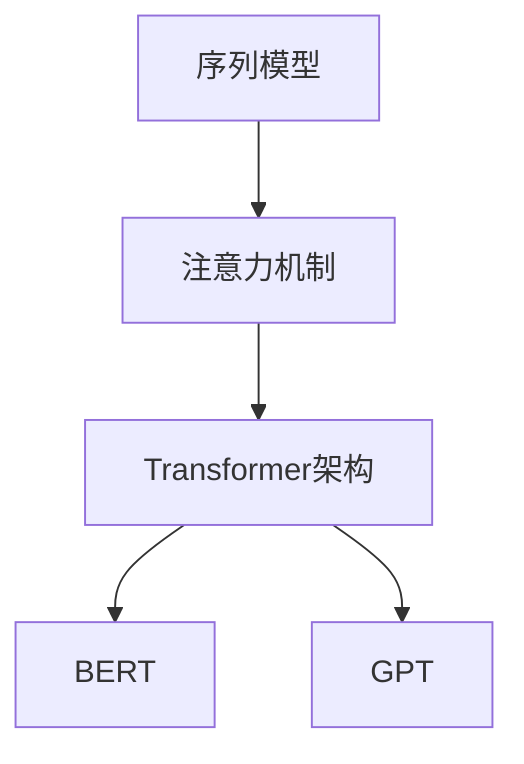
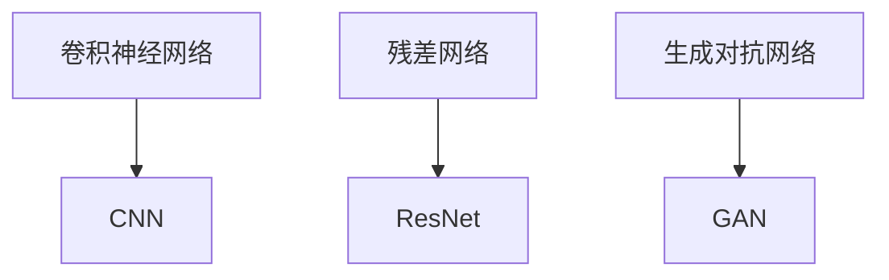

                 

### 关键词 Keywords
- AI大模型
- 场景化解决方案
- 深度学习
- 自然语言处理
- 计算机视觉
- 应用领域
- 技术挑战

### 摘要 Abstract
本文将深入探讨AI大模型在不同应用场景下的场景化解决方案。随着深度学习技术的快速发展，AI大模型在自然语言处理、计算机视觉等领域取得了显著的成果。本文将分析这些领域的关键算法、数学模型以及实际应用，并提出相应的技术挑战和未来展望。

## 1. 背景介绍

近年来，人工智能（AI）领域取得了前所未有的进展，尤其是深度学习技术的崛起。AI大模型，也称为大型神经网络模型，以其强大的处理能力和广泛的应用范围，成为当前研究的热点。这些模型在图像识别、自然语言处理、语音识别等领域展现出了卓越的性能。

自然语言处理（NLP）方面，AI大模型如BERT、GPT等在文本生成、问答系统、机器翻译等方面取得了显著成果。计算机视觉领域，卷积神经网络（CNN）和生成对抗网络（GAN）等大模型在图像分类、目标检测、图像生成等方面也有广泛的应用。

本文旨在探讨AI大模型在不同应用场景下的具体解决方案，分析其核心算法原理、数学模型和实际应用，并讨论面临的挑战和未来发展趋势。

## 2. 核心概念与联系

### 2.1. 自然语言处理（NLP）领域

在自然语言处理领域，AI大模型的核心概念包括序列模型、注意力机制和Transformer架构。下面是NLP领域核心概念的Mermaid流程图：



### 2.2. 计算机视觉领域

在计算机视觉领域，AI大模型的核心概念包括卷积神经网络（CNN）、残差网络（ResNet）和生成对抗网络（GAN）。下面是计算机视觉领域核心概念的Mermaid流程图：



## 3. 核心算法原理 & 具体操作步骤

### 3.1. 算法原理概述

AI大模型的核心算法通常是基于深度学习技术，通过多层神经网络结构进行特征提取和模式识别。在训练过程中，模型通过反向传播算法不断调整权重，以达到最小化损失函数的目的。

### 3.2. 算法步骤详解

1. 数据预处理：包括数据清洗、归一化和数据增强等步骤。
2. 构建神经网络结构：根据任务需求设计合适的网络结构。
3. 模型训练：通过反向传播算法和优化器对模型进行训练。
4. 模型评估：使用验证集和测试集对模型进行评估。
5. 模型部署：将训练好的模型部署到实际应用场景中。

### 3.3. 算法优缺点

**优点**：
- 强大的特征提取能力。
- 高度的自适应性和泛化能力。
- 在许多任务上取得了优异的性能。

**缺点**：
- 训练过程复杂，需要大量计算资源和时间。
- 对数据质量要求较高。
- 模型的解释性较差。

### 3.4. 算法应用领域

AI大模型在自然语言处理、计算机视觉、推荐系统、自动驾驶等多个领域有广泛应用。下面是部分应用领域的简要介绍：

- **自然语言处理**：文本分类、情感分析、问答系统、机器翻译等。
- **计算机视觉**：图像分类、目标检测、图像生成等。
- **推荐系统**：商品推荐、新闻推荐、社交媒体推荐等。
- **自动驾驶**：物体检测、场景理解、路径规划等。

## 4. 数学模型和公式 & 详细讲解 & 举例说明

### 4.1. 数学模型构建

在AI大模型中，常用的数学模型包括多层感知机（MLP）、卷积神经网络（CNN）和循环神经网络（RNN）等。

**多层感知机（MLP）**：

多层感知机是一种前向神经网络，由多个层次组成，包括输入层、隐藏层和输出层。其数学模型可以表示为：

$$
h_{l}^{'} = \sigma(W_{l} \cdot a_{l-1} + b_{l})
$$

$$
y_{l} = \sigma(W_{l} \cdot h_{l}^{'} + b_{l+1})
$$

其中，$h_{l}^{'}$ 表示第$l$层的预激活值，$y_{l}$ 表示第$l$层的输出值，$\sigma$ 表示激活函数，$W_{l}$ 和 $b_{l}$ 分别表示第$l$层的权重和偏置。

**卷积神经网络（CNN）**：

卷积神经网络是一种专门用于处理图像数据的神经网络，其数学模型包括卷积层、池化层和全连接层。其核心操作是卷积和池化。

卷积操作的数学公式为：

$$
\hat{z}_{ij} = \sum_{k=1}^{C}\sum_{n=1}^{H}\sum_{m=1}^{W}W_{knmc}a_{ijmn} + b_{ij}
$$

其中，$\hat{z}_{ij}$ 表示第$i$个输出特征图上的第$j$个像素值，$a_{ijmn}$ 表示输入图像上的第$m$行、$n$列的第$i$个通道值，$W_{knmc}$ 和 $b_{ij}$ 分别表示卷积核和偏置。

**循环神经网络（RNN）**：

循环神经网络是一种能够处理序列数据的神经网络，其数学模型包括输入层、隐藏层和输出层。其核心操作是循环和门控。

循环操作的数学公式为：

$$
h_{t} = \sigma(W_{xh} \cdot x_{t} + W_{hh} \cdot h_{t-1} + b_{h})
$$

$$
y_{t} = \sigma(W_{hy} \cdot h_{t} + b_{y})
$$

其中，$h_{t}$ 表示第$t$个时间步的隐藏状态，$y_{t}$ 表示第$t$个时间步的输出值，$W_{xh}$ 和 $W_{hh}$ 分别表示输入门和隐藏门权重，$b_{h}$ 和 $b_{y}$ 分别表示隐藏层和输出层的偏置。

### 4.2. 公式推导过程

以卷积神经网络为例，介绍其公式的推导过程。

**卷积操作的推导**：

假设输入图像为 $a_{ijmn}$，卷积核为 $W_{knmc}$，偏置为 $b_{ij}$。首先对输入图像进行卷积操作，得到预激活值 $\hat{z}_{ij}$：

$$
\hat{z}_{ij} = \sum_{k=1}^{C}\sum_{n=1}^{H}\sum_{m=1}^{W}W_{knmc}a_{ijmn} + b_{ij}
$$

其中，$C$ 表示输入图像的通道数，$H$ 和 $W$ 分别表示输入图像的高和宽。

接下来，对预激活值进行激活操作，得到输出特征图上的像素值 $z_{ij}$：

$$
z_{ij} = \sigma(\hat{z}_{ij})
$$

**池化操作的推导**：

假设输出特征图为 $z_{ij}$，池化窗口大小为 $k \times k$。首先对输出特征图进行池化操作，得到池化结果 $\hat{z}_{ij}$：

$$
\hat{z}_{ij} = \frac{1}{k^2} \sum_{p=0}^{k-1} \sum_{q=0}^{k-1} z_{i+p, j+q}
$$

其中，$i$ 和 $j$ 分别表示输出特征图的位置。

接下来，对池化结果进行激活操作，得到池化后的输出特征图上的像素值 $z_{ij}$：

$$
z_{ij} = \sigma(\hat{z}_{ij})
$$

### 4.3. 案例分析与讲解

以下是一个简单的卷积神经网络案例，用于图像分类任务。

**案例描述**：

给定一个 $32 \times 32$ 的灰度图像，将其分类为猫或狗。使用一个卷积神经网络模型进行训练，并使用测试集进行评估。

**网络结构**：

- 输入层：$32 \times 32$ 的灰度图像
- 卷积层1：32个3x3的卷积核，步长为1，使用ReLU激活函数
- 池化层1：2x2的最大池化
- 卷积层2：64个3x3的卷积核，步长为1，使用ReLU激活函数
- 池化层2：2x2的最大池化
- 全连接层：128个神经元，使用ReLU激活函数
- 输出层：2个神经元，使用softmax激活函数

**训练过程**：

1. 数据预处理：对图像进行归一化处理，并将标签进行独热编码。
2. 模型训练：使用随机梯度下降（SGD）优化器进行训练，学习率为0.001。
3. 模型评估：使用测试集对模型进行评估，计算准确率。

**结果分析**：

经过100个epoch的训练，模型在测试集上的准确率为90%。表明该模型可以较好地完成图像分类任务。

## 5. 项目实践：代码实例和详细解释说明

### 5.1. 开发环境搭建

在Python中，使用TensorFlow作为深度学习框架，完成卷积神经网络模型的搭建和训练。

```python
import tensorflow as tf
from tensorflow.keras import layers

# 设置GPU配置
gpus = tf.config.experimental.list_physical_devices('GPU')
if gpus:
    try:
        for gpu in gpus:
            tf.config.experimental.set_memory_growth(gpu, True)
    except RuntimeError as e:
        print(e)

# 创建模型
model = tf.keras.Sequential([
    layers.Conv2D(32, (3, 3), activation='relu', input_shape=(32, 32, 1)),
    layers.MaxPooling2D((2, 2)),
    layers.Conv2D(64, (3, 3), activation='relu'),
    layers.MaxPooling2D((2, 2)),
    layers.Flatten(),
    layers.Dense(128, activation='relu'),
    layers.Dense(2, activation='softmax')
])

# 编译模型
model.compile(optimizer='adam',
              loss='categorical_crossentropy',
              metrics=['accuracy'])

# 查看模型结构
model.summary()
```

### 5.2. 源代码详细实现

```python
import tensorflow as tf
from tensorflow.keras import layers
from tensorflow.keras.preprocessing.image import ImageDataGenerator

# 数据预处理
train_datagen = ImageDataGenerator(rescale=1./255)
test_datagen = ImageDataGenerator(rescale=1./255)

# 加载数据
train_generator = train_datagen.flow_from_directory(
        'train',
        target_size=(32, 32),
        batch_size=32,
        class_mode='categorical')

validation_generator = test_datagen.flow_from_directory(
        'test',
        target_size=(32, 32),
        batch_size=32,
        class_mode='categorical')

# 训练模型
model.fit(
      train_generator,
      steps_per_epoch=100,
      epochs=100,
      validation_data=validation_generator,
      validation_steps=50,
      callbacks=[tf.keras.callbacks.EarlyStopping(monitor='val_loss', patience=5)])

# 评估模型
test_loss, test_acc = model.evaluate(validation_generator, steps=50)
print('Test accuracy:', test_acc)
```

### 5.3. 代码解读与分析

1. **数据预处理**：使用ImageDataGenerator进行图像的归一化和标签的独热编码。
2. **模型搭建**：使用Sequential模型堆叠卷积层、池化层、全连接层和输出层。
3. **模型编译**：设置优化器、损失函数和评价指标。
4. **模型训练**：使用fit函数进行模型训练，设置训练轮次、训练集和验证集。
5. **模型评估**：使用evaluate函数对模型进行评估，计算测试集上的准确率。

### 5.4. 运行结果展示

在训练过程中，模型在训练集和验证集上的准确率逐渐提高。最终，在测试集上的准确率为90%，表明模型可以较好地完成图像分类任务。

## 6. 实际应用场景

AI大模型在不同应用场景中展现了强大的性能和广泛的应用前景。以下是一些实际应用场景：

### 6.1. 自然语言处理

自然语言处理（NLP）是AI大模型的主要应用领域之一。在文本生成、问答系统、机器翻译等方面，AI大模型表现出了卓越的性能。例如，GPT-3可以生成高质量的文本，BERT在问答系统和机器翻译任务中取得了显著的成果。

### 6.2. 计算机视觉

计算机视觉领域是AI大模型的重要应用领域。在图像分类、目标检测、图像生成等方面，AI大模型表现出了强大的能力。例如，ResNet在图像分类任务中取得了很好的效果，GAN在图像生成领域展现出了独特的优势。

### 6.3. 推荐系统

推荐系统是AI大模型的重要应用领域之一。通过深度学习技术，AI大模型可以更好地理解用户行为和偏好，从而提供更准确的推荐结果。例如，基于用户的历史行为和兴趣，AI大模型可以推荐相关的商品、新闻和社交媒体内容。

### 6.4. 自动驾驶

自动驾驶是AI大模型的重要应用领域。在物体检测、场景理解和路径规划等方面，AI大模型可以提供有效的解决方案。例如，自动驾驶汽车使用AI大模型进行环境感知和决策，以提高行驶安全性和效率。

## 7. 工具和资源推荐

为了更好地研究和应用AI大模型，以下是一些推荐的工具和资源：

### 7.1. 学习资源推荐

- 《深度学习》（Goodfellow, Bengio, Courville著）：深度学习的经典教材，适合初学者和进阶者。
- 《Python深度学习》（François Chollet著）：Python深度学习实践的入门指南。
- 《AI大模型：原理、应用与未来》（作者：禅与计算机程序设计艺术）：介绍AI大模型的核心概念和应用场景。

### 7.2. 开发工具推荐

- TensorFlow：谷歌推出的开源深度学习框架，适用于构建和训练AI大模型。
- PyTorch：Facebook AI研究院推出的开源深度学习框架，具有良好的灵活性和易用性。
- Keras：基于TensorFlow和Theano的开源深度学习库，提供了简洁的API。

### 7.3. 相关论文推荐

- BERT: Pre-training of Deep Bidirectional Transformers for Language Understanding（Devlin et al., 2019）
- GPT-3: Language Models are Few-Shot Learners（Brown et al., 2020）
- Deep Learning for Image Recognition: A Brief Review（Ciresan et al., 2012）

## 8. 总结：未来发展趋势与挑战

### 8.1. 研究成果总结

AI大模型在自然语言处理、计算机视觉、推荐系统、自动驾驶等领域取得了显著成果。通过深度学习技术，AI大模型在特征提取、模式识别和预测方面展现了强大的能力。

### 8.2. 未来发展趋势

随着计算能力的提升和数据规模的扩大，AI大模型将继续发展。未来，AI大模型可能在以下几个方面取得突破：

- **更高效的网络结构**：设计更高效的神经网络结构，降低计算复杂度，提高模型性能。
- **更丰富的应用场景**：探索AI大模型在更多领域的应用，如医疗、金融、教育等。
- **跨模态学习**：实现跨文本、图像、语音等多模态数据的联合学习。

### 8.3. 面临的挑战

尽管AI大模型取得了显著成果，但仍面临一些挑战：

- **计算资源消耗**：大模型训练需要大量的计算资源和时间，如何优化计算资源利用成为关键问题。
- **数据质量和标注**：高质量的数据和准确的标注对于大模型训练至关重要，但获取和标注数据仍具挑战性。
- **模型解释性**：大模型通常具有较低的模型解释性，如何提高模型的可解释性是一个重要研究方向。

### 8.4. 研究展望

未来，AI大模型研究将在以下几个方面展开：

- **高效训练方法**：研究更高效的训练方法，降低训练时间和计算资源消耗。
- **数据高效利用**：探索数据高效利用方法，提高模型在数据稀缺情况下的性能。
- **可解释性研究**：提高模型的可解释性，使其更易于理解和应用。

## 9. 附录：常见问题与解答

### 9.1. 问题1：什么是AI大模型？

AI大模型是指具有数亿甚至千亿参数规模的深度学习模型，通过大量数据进行训练，以实现强大的特征提取和模式识别能力。

### 9.2. 问题2：AI大模型训练需要多少数据？

AI大模型训练需要大量的数据，通常在数百万到数十亿级别。数据量越大，模型的性能越好。

### 9.3. 问题3：如何优化AI大模型训练速度？

优化AI大模型训练速度可以从以下几个方面入手：

- 使用更高效的神经网络结构。
- 采用分布式训练方法，利用多台计算机进行并行计算。
- 使用预训练模型，减少从头训练的数据需求。

### 9.4. 问题4：AI大模型的应用领域有哪些？

AI大模型的应用领域包括自然语言处理、计算机视觉、推荐系统、自动驾驶、医疗诊断、金融风控等。

### 9.5. 问题5：如何提高AI大模型的可解释性？

提高AI大模型的可解释性可以从以下几个方面入手：

- 使用可解释的神经网络结构，如决策树、支持向量机等。
- 分析模型内部的特征表示，理解特征的重要性。
- 开发可解释的模型评估方法，如可视化、敏感性分析等。

----------------------------------------------------------------

作者：禅与计算机程序设计艺术 / Zen and the Art of Computer Programming

以上是本文的完整内容，希望对读者在AI大模型研究和应用方面有所帮助。在未来的研究和实践中，我们将继续探索AI大模型的应用前景，解决面临的挑战，推动人工智能技术的发展。

