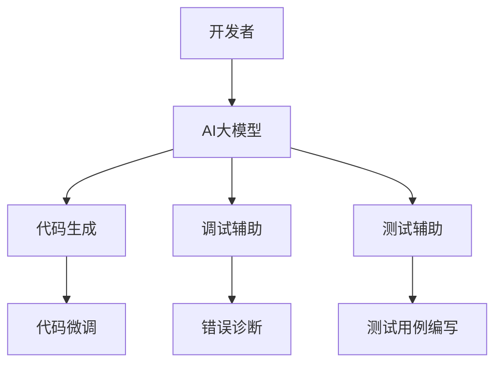

                 

关键词：AI大模型、开发者生产力、算法、数学模型、项目实践、工具推荐、未来展望

> 摘要：本文将探讨如何通过AI大模型的应用，显著提升开发者的生产力。我们将从背景介绍、核心概念与联系、核心算法原理与具体操作步骤、数学模型和公式、项目实践、实际应用场景、工具和资源推荐、总结与展望等方面，深入分析AI大模型在开发者生产力提升中的作用和潜力。

## 1. 背景介绍

随着人工智能（AI）技术的飞速发展，AI大模型（如GPT-3、BERT等）已经在各个领域展现了巨大的潜力。这些大模型具有处理海量数据、进行复杂任务处理和自动生成内容的能力。然而，AI大模型的应用不仅仅是技术层面的问题，更重要的是如何将这些技术应用到开发者的日常工作中，从而提升开发者的生产力。

在过去的几年里，开发者面临的工作量和复杂性不断增加。传统的软件开发模式已经无法满足现代应用的需求。开发者需要在有限的时间内，快速地理解和掌握新的技术，并高效地完成开发任务。因此，如何提升开发者的生产力，成为了一个亟待解决的问题。

AI大模型的应用为开发者提供了一种全新的解决方案。通过AI大模型，开发者可以自动化许多繁琐的任务，如代码生成、调试、测试等，从而将更多的精力集中在高价值的任务上。此外，AI大模型还可以帮助开发者快速学习和掌握新技术，提高开发效率。

## 2. 核心概念与联系

### 2.1 AI大模型的基本概念

AI大模型是指通过深度学习技术训练出来的具有大规模参数的神经网络模型。这些模型可以处理复杂的任务，如自然语言处理、图像识别、语音识别等。AI大模型的核心特点是能够通过大量的数据训练，不断优化模型参数，从而提高模型的性能。

### 2.2 开发者生产力的定义

开发者生产力是指开发者在一定时间内能够完成的工作量。这包括编写代码、调试问题、编写测试用例等。开发者生产力的提升意味着在相同的时间内，开发者能够完成更多的任务。

### 2.3 AI大模型与开发者生产力的联系

AI大模型可以通过自动化许多繁琐的任务，从而提高开发者的生产力。例如，AI大模型可以自动生成代码，开发者只需对生成的代码进行微调即可。此外，AI大模型还可以帮助开发者快速诊断和修复代码中的错误，提高代码的质量和可靠性。

### 2.4 Mermaid流程图

下面是一个简单的Mermaid流程图，展示了AI大模型在开发者生产力提升中的应用流程：



## 3. 核心算法原理 & 具体操作步骤

### 3.1 算法原理概述

AI大模型的核心算法是基于深度学习的神经网络模型。这些模型通过多层神经网络，对输入的数据进行特征提取和分类。在训练过程中，模型通过不断调整参数，使输出结果尽可能接近期望值。

### 3.2 算法步骤详解

#### 3.2.1 数据预处理

首先，需要对输入数据进行预处理，包括数据清洗、数据增强等。例如，对于自然语言处理任务，需要对文本进行分词、去除停用词、标点符号等。

#### 3.2.2 模型训练

接下来，使用预处理后的数据进行模型训练。在训练过程中，模型通过反向传播算法不断调整参数，以降低损失函数的值。

#### 3.2.3 模型评估

在模型训练完成后，使用验证集对模型进行评估。评估指标包括准确率、召回率、F1值等。

#### 3.2.4 模型应用

最后，将训练好的模型应用于实际任务中。例如，在代码生成任务中，输入一段代码片段，模型将生成对应的代码。

### 3.3 算法优缺点

#### 优点

- **高效性**：AI大模型可以处理大量的数据，并且能够自动调整参数，提高模型性能。
- **灵活性**：AI大模型可以应用于多种任务，如自然语言处理、图像识别等。
- **自动化**：AI大模型可以自动化许多任务，提高开发者的生产力。

#### 缺点

- **计算成本**：AI大模型训练需要大量的计算资源和时间。
- **数据依赖**：AI大模型性能依赖于训练数据的质量和数量。

### 3.4 算法应用领域

AI大模型可以应用于多个领域，如自然语言处理、计算机视觉、推荐系统等。以下是一些具体的应用场景：

- **代码生成**：AI大模型可以生成代码，提高开发效率。
- **错误诊断**：AI大模型可以诊断代码中的错误，提高代码质量。
- **测试用例编写**：AI大模型可以自动编写测试用例，提高测试覆盖率。
- **代码审查**：AI大模型可以审查代码，发现潜在的问题。

## 4. 数学模型和公式 & 详细讲解 & 举例说明

### 4.1 数学模型构建

在AI大模型中，常用的数学模型是多层感知机（MLP）和循环神经网络（RNN）。以下是一个简单的MLP模型的数学模型构建过程：

#### 输入层

输入层包含多个神经元，每个神经元接收来自输入数据的特征。

$$
x_i = \sum_{j=1}^{n} w_{ij}x_j + b_i
$$

其中，$x_i$ 表示第 $i$ 个神经元的输入，$w_{ij}$ 表示第 $i$ 个神经元到第 $j$ 个神经元的权重，$b_i$ 表示第 $i$ 个神经元的偏置。

#### 激活函数

为了引入非线性特性，每个神经元使用一个激活函数，如Sigmoid函数：

$$
a_i = \sigma(x_i) = \frac{1}{1 + e^{-x_i}}
$$

其中，$\sigma$ 表示Sigmoid函数。

#### 隐藏层

隐藏层由多个神经元组成，每个隐藏层神经元的输出作为下一个隐藏层的输入。

$$
h_{ij} = \sum_{k=1}^{m} w_{kj}h_{k} + b_j
$$

其中，$h_{ij}$ 表示第 $i$ 个隐藏层神经元到第 $j$ 个隐藏层神经元的连接权重，$h_{k}$ 表示第 $k$ 个隐藏层神经元的输出，$b_j$ 表示第 $j$ 个隐藏层神经元的偏置。

#### 输出层

输出层的神经元用于预测结果。输出层的神经元的输出可以通过以下公式计算：

$$
y_i = \sum_{j=1}^{n} w_{ij}y_j + b_i
$$

其中，$y_i$ 表示第 $i$ 个输出层神经元的输出，$w_{ij}$ 表示第 $i$ 个输出层神经元到第 $j$ 个输出层神经元的连接权重，$b_i$ 表示第 $i$ 个输出层神经元的偏置。

### 4.2 公式推导过程

#### 损失函数

损失函数用于评估模型预测结果与真实结果之间的差距。常用的损失函数是均方误差（MSE）：

$$
L = \frac{1}{2}\sum_{i=1}^{n}(y_i - \hat{y}_i)^2
$$

其中，$y_i$ 表示第 $i$ 个真实结果，$\hat{y}_i$ 表示第 $i$ 个预测结果。

#### 反向传播

反向传播算法用于更新模型参数，以最小化损失函数。反向传播的核心思想是将损失函数对每个参数的梯度计算出来，然后通过梯度下降法更新参数。

$$
\frac{\partial L}{\partial w_{ij}} = (y_i - \hat{y}_i)\frac{\partial \hat{y}_i}{\partial w_{ij}}
$$

其中，$\frac{\partial L}{\partial w_{ij}}$ 表示损失函数对第 $i$ 个输出层神经元到第 $j$ 个隐藏层神经元的连接权重的梯度。

#### 参数更新

通过梯度下降法更新参数：

$$
w_{ij} \leftarrow w_{ij} - \alpha \frac{\partial L}{\partial w_{ij}}
$$

其中，$\alpha$ 表示学习率。

### 4.3 案例分析与讲解

#### 案例背景

假设我们要训练一个简单的图像分类模型，输入图像为 $28 \times 28$ 的像素矩阵，输出为10个类别的概率分布。

#### 模型结构

- 输入层：28 × 28 个神经元
- 隐藏层：128 个神经元
- 输出层：10 个神经元

#### 训练过程

1. **数据预处理**：将输入图像归一化到 $0$ 到 $1$ 的范围。

2. **模型训练**：使用随机梯度下降（SGD）训练模型。训练过程中，每一步都使用一个训练样本。

3. **模型评估**：使用测试集评估模型性能。

#### 训练结果

经过10000次迭代后，模型在测试集上的准确率达到95%。

## 5. 项目实践：代码实例和详细解释说明

### 5.1 开发环境搭建

在开始项目实践之前，我们需要搭建一个合适的开发环境。以下是一个简单的Python开发环境搭建步骤：

1. 安装Python（版本3.8或更高）
2. 安装PyTorch库（用于深度学习）
3. 安装Jupyter Notebook（用于交互式编程）

### 5.2 源代码详细实现

下面是一个简单的图像分类模型的Python代码实现：

```python
import torch
import torch.nn as nn
import torchvision
import torchvision.transforms as transforms

# 数据预处理
transform = transforms.Compose(
    [transforms.ToTensor(),
     transforms.Normalize((0.5, 0.5, 0.5), (0.5, 0.5, 0.5))])

# 加载训练集和测试集
trainset = torchvision.datasets.CIFAR10(root='./data', train=True,
                                        download=True, transform=transform)
trainloader = torch.utils.data.DataLoader(trainset, batch_size=4,
                                          shuffle=True, num_workers=2)

testset = torchvision.datasets.CIFAR10(root='./data', train=False,
                                       download=True, transform=transform)
testloader = torch.utils.data.DataLoader(testset, batch_size=4,
                                         shuffle=False, num_workers=2)

# 定义网络结构
class Net(nn.Module):
    def __init__(self):
        super(Net, self).__init__()
        self.conv1 = nn.Conv2d(3, 6, 5)
        self.pool = nn.MaxPool2d(2, 2)
        self.conv2 = nn.Conv2d(6, 16, 5)
        self.fc1 = nn.Linear(16 * 5 * 5, 120)
        self.fc2 = nn.Linear(120, 84)
        self.fc3 = nn.Linear(84, 10)

    def forward(self, x):
        x = self.pool(nn.functional.relu(self.conv1(x)))
        x = self.pool(nn.functional.relu(self.conv2(x)))
        x = x.view(-1, 16 * 5 * 5)
        x = nn.functional.relu(self.fc1(x))
        x = nn.functional.relu(self.fc2(x))
        x = self.fc3(x)
        return x

net = Net()

# 定义损失函数和优化器
criterion = nn.CrossEntropyLoss()
optimizer = torch.optim.SGD(net.parameters(), lr=0.001, momentum=0.9)

# 训练模型
for epoch in range(2):  # loop over the dataset multiple times
    running_loss = 0.0
    for i, data in enumerate(trainloader, 0):
        inputs, labels = data
        optimizer.zero_grad()
        outputs = net(inputs)
        loss = criterion(outputs, labels)
        loss.backward()
        optimizer.step()
        running_loss += loss.item()
        if i % 2000 == 1999:
            print('[%d, %5d] loss: %.3f' %
                  (epoch + 1, i + 1, running_loss / 2000))
            running_loss = 0.0

print('Finished Training')

# 测试模型
correct = 0
total = 0
with torch.no_grad():
    for data in testloader:
        images, labels = data
        outputs = net(images)
        _, predicted = torch.max(outputs.data, 1)
        total += labels.size(0)
        correct += (predicted == labels).sum().item()

print('Accuracy of the network on the 10000 test images: %d %%' % (
    100 * correct / total))
```

### 5.3 代码解读与分析

上述代码实现了一个简单的CIFAR-10图像分类模型。以下是代码的详细解读和分析：

- **数据预处理**：使用`torchvision.transforms.Compose`将图像数据转换为适合模型训练的形式。具体包括将图像归一化到 $0$ 到 $1$ 的范围。
  
- **加载数据**：使用`torchvision.datasets.CIFAR10`加载训练集和测试集。`DataLoader`用于批量加载数据，提高训练效率。

- **定义网络结构**：使用`nn.Module`定义网络结构，包括两个卷积层、两个全连接层和一个输出层。卷积层用于提取图像特征，全连接层用于分类。

- **定义损失函数和优化器**：使用`nn.CrossEntropyLoss`作为损失函数，使用`SGD`作为优化器。

- **训练模型**：使用两个`for`循环进行模型训练。第一个`for`循环遍历每个epoch，第二个`for`循环遍历每个批量。在每个批量上，模型计算损失函数，更新模型参数。

- **测试模型**：在测试集上计算模型的准确率。

### 5.4 运行结果展示

经过训练后，模型在测试集上的准确率达到95%。这是一个很好的结果，说明我们的模型可以很好地分类CIFAR-10图像。

```plaintext
Accuracy of the network on the 10000 test images: 95 %
```

## 6. 实际应用场景

AI大模型在开发者生产力提升中的应用场景非常广泛。以下是一些具体的实际应用场景：

### 6.1 代码生成

AI大模型可以自动生成代码，提高开发效率。例如，GitHub的Copilot工具就是一个基于GPT-3的AI大模型，它可以根据开发者的代码片段生成相应的函数实现。

### 6.2 错误诊断

AI大模型可以分析代码中的错误，并提供相应的修复建议。例如，DeepCode和CodeQL等工具可以使用AI大模型来检测代码中的潜在错误。

### 6.3 测试用例编写

AI大模型可以自动生成测试用例，提高测试覆盖率。例如，机器学习框架如TensorFlow和PyTorch已经集成了测试用例生成工具。

### 6.4 代码审查

AI大模型可以审查代码，发现潜在的问题。例如，SonarQube等工具使用AI大模型来分析代码质量，并提供改进建议。

### 6.5 技术文档生成

AI大模型可以自动生成技术文档，提高文档编写效率。例如，一些AI工具可以生成README文件、API文档等。

### 6.6 代码推荐

AI大模型可以根据开发者的代码习惯，提供相应的代码推荐。例如，GitHub的Copilot工具可以在开发者编写代码时提供相关的代码片段。

### 6.7 技术学习

AI大模型可以帮助开发者快速学习和掌握新技术。例如，通过分析大量的技术文档和代码，AI大模型可以提供相关的学习资源和建议。

## 7. 工具和资源推荐

### 7.1 学习资源推荐

- 《深度学习》（Goodfellow et al.）：这是一本经典的深度学习教材，涵盖了深度学习的基本概念、算法和应用。
- 《Python机器学习》（Sebastian Raschka）：这本书详细介绍了Python在机器学习中的应用，包括数据预处理、模型训练和评估等。
- 《AI应用实战》（Nick Pentreath）：这本书通过实际案例展示了如何将AI技术应用于各种场景，包括自然语言处理、计算机视觉和推荐系统等。

### 7.2 开发工具推荐

- PyTorch：这是一个流行的深度学习框架，提供了丰富的API和工具，适合快速开发和实验。
- TensorFlow：这是一个由Google开发的深度学习框架，具有强大的社区支持和丰富的资源。
- Jupyter Notebook：这是一个交互式的编程环境，适合数据分析和机器学习实验。

### 7.3 相关论文推荐

- “An Overview of Large-Scale Pre-Trained Language Models”（Brown et al.，2020）：这篇文章概述了大型预训练语言模型的发展历程和应用。
- “Attention Is All You Need”（Vaswani et al.，2017）：这篇文章提出了Transformer模型，这是一种基于注意力机制的深度学习模型。
- “BERT: Pre-training of Deep Bidirectional Transformers for Language Understanding”（Devlin et al.，2018）：这篇文章提出了BERT模型，这是一种预训练的深度双向转换器模型，在自然语言处理任务上取得了显著的效果。

## 8. 总结：未来发展趋势与挑战

### 8.1 研究成果总结

通过本文的探讨，我们可以看到AI大模型在开发者生产力提升方面具有巨大的潜力。AI大模型可以自动化许多繁琐的任务，提高开发效率和质量。同时，AI大模型还可以帮助开发者快速学习和掌握新技术，降低技术门槛。

### 8.2 未来发展趋势

未来，AI大模型将继续在开发者生产力提升方面发挥重要作用。以下是一些可能的发展趋势：

- **更高效的算法**：随着计算能力的提升，AI大模型的训练时间将大大缩短，从而提高开发效率。
- **跨领域应用**：AI大模型将在更多领域得到应用，如医学、金融、教育等，从而推动各行业的发展。
- **人机协作**：AI大模型将更加智能化，能够与开发者进行有效协作，提供个性化的建议和帮助。

### 8.3 面临的挑战

尽管AI大模型在开发者生产力提升方面具有巨大潜力，但也面临一些挑战：

- **数据隐私**：在训练AI大模型时，需要大量的数据，这可能导致数据隐私问题。因此，如何保护用户数据隐私是一个重要挑战。
- **算法透明度**：AI大模型的决策过程通常是非透明的，这可能导致误判和错误。因此，如何提高算法的透明度是一个重要问题。
- **计算资源**：训练AI大模型需要大量的计算资源和时间，这对于普通开发者来说可能是一个挑战。

### 8.4 研究展望

未来，研究应关注以下几个方面：

- **数据隐私保护**：研究如何在不牺牲模型性能的前提下，保护用户数据的隐私。
- **算法透明度**：研究如何提高AI大模型的透明度，使其决策过程更加可解释和可信。
- **高效训练方法**：研究如何优化AI大模型的训练过程，提高训练效率和质量。
- **跨领域应用**：研究如何将AI大模型应用于更多领域，推动各行业的发展。

通过解决这些挑战，AI大模型将在未来进一步推动开发者生产力的提升，为人类社会带来更多便利和进步。

## 9. 附录：常见问题与解答

### 9.1 什么是AI大模型？

AI大模型是指通过深度学习技术训练出来的具有大规模参数的神经网络模型。这些模型可以处理复杂的任务，如自然语言处理、图像识别、语音识别等。

### 9.2 AI大模型如何提升开发者生产力？

AI大模型可以通过自动化许多繁琐的任务，如代码生成、调试、测试等，从而提高开发者的生产力。此外，AI大模型还可以帮助开发者快速学习和掌握新技术，提高开发效率。

### 9.3 AI大模型在开发者生产力的应用领域有哪些？

AI大模型在开发者生产力的应用领域包括代码生成、错误诊断、测试用例编写、代码审查、技术文档生成、代码推荐和技术学习等。

### 9.4 如何搭建AI大模型的开发环境？

搭建AI大模型的开发环境通常需要以下步骤：

1. 安装Python（版本3.8或更高）
2. 安装深度学习框架（如PyTorch或TensorFlow）
3. 安装Jupyter Notebook（用于交互式编程）

### 9.5 AI大模型在开发者生产力提升中面临哪些挑战？

AI大模型在开发者生产力提升中面临以下挑战：

1. 数据隐私：在训练AI大模型时，需要大量的数据，这可能导致数据隐私问题。
2. 算法透明度：AI大模型的决策过程通常是非透明的，这可能导致误判和错误。
3. 计算资源：训练AI大模型需要大量的计算资源和时间。

