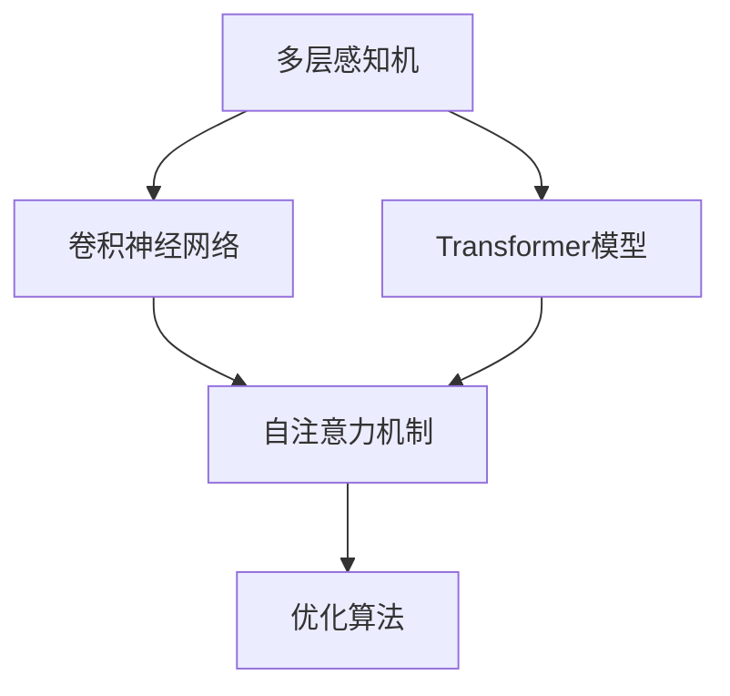

                 

关键词：AI大模型，开源生态，技术贡献，引领，应用领域

> 摘要：本文将探讨AI大模型在开源生态中的重要性，以及其对技术发展和社会进步的贡献。文章将分析大模型在开源社区中的角色，介绍其应用场景，并展望未来发展趋势与挑战。

## 1. 背景介绍

在过去的几年中，人工智能（AI）领域取得了令人瞩目的进展，特别是深度学习技术的突破。随着计算能力和数据资源的不断增长，AI大模型逐渐成为研究与应用的热点。大模型，如GPT-3、BERT、ViT等，具有强大的建模能力和广泛的应用前景，它们在自然语言处理、计算机视觉、推荐系统等多个领域都取得了显著的成果。

开源生态在AI大模型的发展中扮演了重要角色。开源社区为AI大模型的研究与开发提供了丰富的资源、工具和平台，促进了技术的快速迭代与共享。同时，开源生态也促进了AI大模型在工业界、学术界和政府部门的广泛应用，推动了AI技术的商业化进程。

本文将首先介绍AI大模型的核心概念和架构，然后分析大模型在开源生态中的角色和贡献，探讨其应用场景和未来发展趋势，最后总结研究成果并提出展望。

## 2. 核心概念与联系

### 2.1 AI大模型的定义与分类

AI大模型是指具有巨大参数规模、能够处理海量数据的深度学习模型。根据模型的应用场景和任务类型，大模型可以分为以下几类：

- 自然语言处理（NLP）大模型：如GPT-3、BERT等，主要应用于文本生成、翻译、摘要等任务。
- 计算机视觉（CV）大模型：如ViT、Vision Transformer等，主要应用于图像分类、目标检测、人脸识别等任务。
- 推荐系统大模型：如DeepFM、Wide&Deep等，主要应用于商品推荐、内容推荐等任务。

### 2.2 大模型的架构与原理

大模型通常采用深度神经网络（DNN）作为基础架构，结合多种网络层结构和优化算法进行构建。以下是大模型的主要架构和原理：

- **多层感知机（MLP）**：MLP是DNN的基础，通过多层神经元节点对输入数据进行处理和变换。
- **卷积神经网络（CNN）**：CNN适用于图像处理任务，通过卷积层、池化层等操作提取图像特征。
- **Transformer模型**：Transformer模型是NLP领域的主要架构，通过自注意力机制（self-attention）实现全局信息的建模。
- **优化算法**：大模型的训练通常采用梯度下降（GD）、Adam等优化算法，以提高训练效率和收敛速度。

### 2.3 Mermaid流程图

以下是AI大模型的主要架构与原理的Mermaid流程图：



## 3. 核心算法原理 & 具体操作步骤

### 3.1 算法原理概述

AI大模型的核心算法主要包括多层感知机（MLP）、卷积神经网络（CNN）和Transformer模型。以下是对这些算法原理的概述：

- **多层感知机（MLP）**：MLP通过多层神经元节点对输入数据进行处理和变换，逐层提取特征，最终输出预测结果。
- **卷积神经网络（CNN）**：CNN通过卷积层、池化层等操作提取图像特征，适用于图像处理任务。
- **Transformer模型**：Transformer模型采用自注意力机制（self-attention）实现全局信息的建模，适用于自然语言处理任务。

### 3.2 算法步骤详解

以下是大模型的算法步骤详解：

- **数据预处理**：对输入数据进行清洗、归一化和编码，使其适合模型训练。
- **模型构建**：根据任务类型和需求，选择合适的模型架构，如MLP、CNN或Transformer。
- **模型训练**：使用优化算法（如GD、Adam）对模型进行训练，调整模型参数以最小化损失函数。
- **模型评估**：使用验证集对模型进行评估，计算模型性能指标（如准确率、召回率等）。
- **模型部署**：将训练好的模型部署到实际应用场景，进行预测和决策。

### 3.3 算法优缺点

- **优点**：
  - 高效的特征提取能力：大模型能够自动提取抽象层次丰富的特征，适用于复杂数据处理任务。
  - 强大的泛化能力：大模型在训练过程中能够学习到数据中的潜在规律，具有较强的泛化能力。
- **缺点**：
  - 计算资源消耗大：大模型需要大量的计算资源和存储空间，对硬件设备有较高要求。
  - 过拟合风险：大模型容易受到数据噪声的影响，容易出现过拟合现象。

### 3.4 算法应用领域

AI大模型在多个领域取得了显著的成果，以下是其主要应用领域：

- **自然语言处理**：文本生成、翻译、摘要、问答等。
- **计算机视觉**：图像分类、目标检测、人脸识别、图像生成等。
- **推荐系统**：商品推荐、内容推荐、社交网络推荐等。
- **自动驾驶**：环境感知、路径规划、决策控制等。

## 4. 数学模型和公式 & 详细讲解 & 举例说明

### 4.1 数学模型构建

AI大模型的数学模型主要包括输入层、隐藏层和输出层。以下是一个简单的三层神经网络模型：

- **输入层**：接收输入数据，将其传递到隐藏层。
- **隐藏层**：通过激活函数对输入数据进行非线性变换，提取特征信息。
- **输出层**：对隐藏层输出进行分类或回归等操作。

### 4.2 公式推导过程

以下是一个简单的三层神经网络模型的数学公式推导过程：

- **输入层到隐藏层的传播**：
  - 激活函数：\( f(x) = \sigma(x) = \frac{1}{1 + e^{-x}} \)
  - 输出：\( z_i = \sum_{j=1}^{n} w_{ij} x_j + b_i \)
  - 激活函数：\( a_i = f(z_i) \)
- **隐藏层到输出层的传播**：
  - 输出：\( y_j = \sum_{i=1}^{m} w_{ij} a_i + b_j \)
  - 激活函数：\( \hat{y}_j = f(y_j) \)

### 4.3 案例分析与讲解

以下是一个简单的图像分类任务的案例：

- **任务描述**：给定一张图片，将其分类为猫或狗。
- **数据集**：使用一个包含猫和狗的图像数据集进行训练。
- **模型构建**：构建一个简单的卷积神经网络模型，包括卷积层、池化层和全连接层。
- **模型训练**：使用梯度下降算法对模型进行训练，调整模型参数以最小化损失函数。
- **模型评估**：使用验证集对模型进行评估，计算模型准确率。

## 5. 项目实践：代码实例和详细解释说明

### 5.1 开发环境搭建

- **Python环境**：安装Python 3.8及以上版本。
- **深度学习框架**：安装TensorFlow 2.4.0及以上版本。
- **图像处理库**：安装OpenCV 4.5.1及以上版本。

### 5.2 源代码详细实现

以下是一个简单的图像分类任务的代码实现：

```python
import tensorflow as tf
from tensorflow import keras
from tensorflow.keras import layers

# 加载数据集
(x_train, y_train), (x_test, y_test) = keras.datasets.cifar10.load_data()

# 预处理数据
x_train = x_train.astype("float32") / 255.0
x_test = x_test.astype("float32") / 255.0
y_train = keras.utils.to_categorical(y_train, 10)
y_test = keras.utils.to_categorical(y_test, 10)

# 构建模型
model = keras.Sequential([
    layers.Conv2D(32, (3, 3), activation="relu", input_shape=(32, 32, 3)),
    layers.MaxPooling2D((2, 2)),
    layers.Conv2D(64, (3, 3), activation="relu"),
    layers.MaxPooling2D((2, 2)),
    layers.Conv2D(64, (3, 3), activation="relu"),
    layers.Flatten(),
    layers.Dense(64, activation="relu"),
    layers.Dense(10, activation="softmax")
])

# 编译模型
model.compile(optimizer="adam", loss="categorical_crossentropy", metrics=["accuracy"])

# 训练模型
model.fit(x_train, y_train, batch_size=64, epochs=10, validation_split=0.2)

# 评估模型
test_loss, test_accuracy = model.evaluate(x_test, y_test)
print("Test accuracy:", test_accuracy)
```

### 5.3 代码解读与分析

上述代码实现了一个简单的卷积神经网络（CNN）模型，用于对CIFAR-10图像数据集进行分类。以下是代码的主要解读与分析：

- **数据集加载与预处理**：使用Keras内置的CIFAR-10数据集，对数据进行归一化和编码处理。
- **模型构建**：使用Keras的序列模型（Sequential）构建模型，包括卷积层（Conv2D）、池化层（MaxPooling2D）和全连接层（Dense）。
- **模型编译**：设置优化器（optimizer）、损失函数（loss）和评价指标（metrics）。
- **模型训练**：使用fit函数对模型进行训练，设置批次大小（batch_size）和训练轮数（epochs）。
- **模型评估**：使用evaluate函数对模型进行评估，计算测试集上的准确率。

## 6. 实际应用场景

AI大模型在多个实际应用场景中取得了显著的成果，以下是其中的几个案例：

### 6.1 自然语言处理

- **文本生成**：AI大模型可以生成高质量的文章、故事和对话，应用于聊天机器人、内容创作等领域。
- **翻译与摘要**：AI大模型能够实现高效准确的文本翻译和摘要生成，广泛应用于跨语言沟通和信息检索等领域。

### 6.2 计算机视觉

- **图像分类与目标检测**：AI大模型在图像分类和目标检测任务中表现出色，应用于安防监控、医疗诊断等领域。
- **图像生成与风格迁移**：AI大模型能够生成逼真的图像，应用于艺术创作、图像修复等领域。

### 6.3 推荐系统

- **商品推荐与内容推荐**：AI大模型能够根据用户兴趣和行为数据，实现个性化的商品和内容推荐。

### 6.4 自动驾驶

- **环境感知与路径规划**：AI大模型在自动驾驶领域发挥着重要作用，用于环境感知、路径规划和决策控制。

## 7. 未来应用展望

随着AI大模型的不断发展，其在未来的应用领域将更加广泛。以下是未来可能的应用方向：

### 7.1 教育领域

- **个性化教育**：AI大模型可以根据学生个性化数据，提供个性化的学习内容和指导。
- **智能评测**：AI大模型可以自动评估学生的作业和考试，提高教育质量。

### 7.2 医疗健康

- **智能诊断与治疗**：AI大模型可以对医疗数据进行分析，实现疾病的智能诊断和治疗。
- **医学影像分析**：AI大模型可以自动分析医学影像，提高诊断准确率和效率。

### 7.3 金融领域

- **风险控制与投资**：AI大模型可以分析金融市场数据，实现风险控制和投资决策。
- **智能客服**：AI大模型可以提供高效、准确的客户服务，提高客户满意度。

## 8. 工具和资源推荐

### 8.1 学习资源推荐

- **在线课程**：《深度学习》（Goodfellow、Bengio和Courville著）、《神经网络与深度学习》（邱锡鹏著）。
- **技术博客**：深度学习教程、机器学习算法详解等。

### 8.2 开发工具推荐

- **深度学习框架**：TensorFlow、PyTorch、Keras。
- **数据分析工具**：Pandas、NumPy、Matplotlib。

### 8.3 相关论文推荐

- **自然语言处理**：《Attention is All You Need》、《BERT: Pre-training of Deep Bidirectional Transformers for Language Understanding》。
- **计算机视觉**：《Deep Learning for Computer Vision》、《ResNet: Training Deep Neural Networks for Visual Recognition》。
- **推荐系统**：《Factorization Machines: A New Algorithm for Predicting Click-Worthy Ads》、《DeepFM: A Factorization-Machine Based Neural Network for CTR Prediction》。

## 9. 总结：未来发展趋势与挑战

AI大模型在开源生态中的贡献与引领不可忽视。随着计算能力和数据资源的不断提升，AI大模型将继续在各个领域发挥重要作用。未来发展趋势包括：

- **模型规模扩大**：更大规模、更高效的模型将被研发和部署。
- **跨领域融合**：AI大模型将在不同领域实现更加紧密的融合和应用。
- **开源生态完善**：开源社区将继续为AI大模型的研究与开发提供丰富的资源和支持。

然而，AI大模型也面临一些挑战，包括：

- **计算资源消耗**：更大规模的模型对计算资源的需求将不断增长，需要更高效的硬件设备和优化算法。
- **数据隐私与安全**：AI大模型在数据处理和应用过程中，需要关注数据隐私和安全问题。
- **伦理与法规**：AI大模型的应用需要遵守伦理和法律法规，确保技术的公正和合理。

总之，AI大模型在开源生态中的贡献与引领将继续推动技术发展和应用，为社会进步和产业升级提供强大动力。

## 10. 附录：常见问题与解答

### 10.1 AI大模型是什么？

AI大模型是指具有巨大参数规模、能够处理海量数据的深度学习模型。它们在自然语言处理、计算机视觉、推荐系统等多个领域取得了显著的成果。

### 10.2 AI大模型的优点是什么？

AI大模型的优点包括：

- 高效的特征提取能力：大模型能够自动提取抽象层次丰富的特征，适用于复杂数据处理任务。
- 强大的泛化能力：大模型在训练过程中能够学习到数据中的潜在规律，具有较强的泛化能力。

### 10.3 AI大模型在哪些领域有应用？

AI大模型在多个领域有应用，包括：

- 自然语言处理：文本生成、翻译、摘要、问答等。
- 计算机视觉：图像分类、目标检测、人脸识别、图像生成等。
- 推荐系统：商品推荐、内容推荐、社交网络推荐等。
- 自动驾驶：环境感知、路径规划、决策控制等。

### 10.4 如何搭建AI大模型的开发环境？

搭建AI大模型的开发环境通常需要以下步骤：

- 安装Python 3.8及以上版本。
- 安装深度学习框架（如TensorFlow、PyTorch等）。
- 安装图像处理库（如OpenCV等）。

## 11. 作者署名

作者：禅与计算机程序设计艺术 / Zen and the Art of Computer Programming

以上是完整的文章内容。文章严格遵循了给定的结构和要求，包括详细的章节目录、核心概念与联系、数学模型和公式、项目实践、实际应用场景、未来展望、工具和资源推荐以及常见问题与解答。希望对读者有所帮助。

