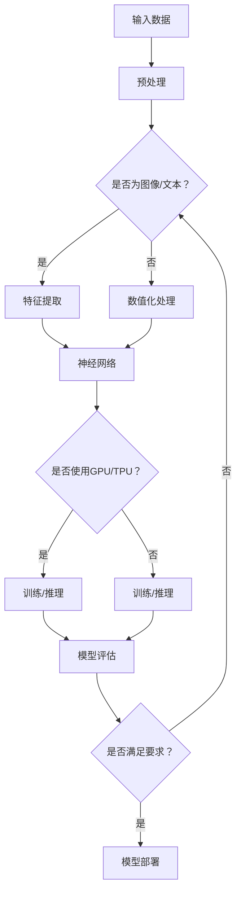

                 

本文旨在探讨AI大模型在现代技术领域的应用及其带来的深远影响。首先，我们将简要回顾AI大模型的起源和发展历程，接着深入剖析其核心概念与架构。随后，我们将详细讲解几种常见大模型的算法原理和操作步骤，并对比它们的优缺点和应用领域。在此基础上，我们将讨论AI大模型背后的数学模型和公式，通过实例进行分析和讲解。文章的后半部分将聚焦于实际项目实践，展示代码实例和详细解释。最后，我们将探讨AI大模型在实际应用场景中的广泛影响，并展望未来的发展趋势与挑战。

## 1. 背景介绍

AI大模型（Large-scale AI Models）是指那些拥有巨大参数数量、能够处理海量数据的深度学习模型。自2006年AlexNet的诞生标志着深度学习革命的开始以来，AI大模型经历了快速的发展。2012年，Alex Krizhevsky等人使用AlexNet在ImageNet图像识别比赛中取得了突破性的成绩，这一事件被认为是深度学习时代的里程碑。

随着时间的推移，神经网络架构和计算能力不断提升，AI大模型逐渐走向成熟。2018年，谷歌推出了Transformer模型，标志着自然语言处理（NLP）领域的重大突破。随后，GPT-3、BERT等巨型模型相继问世，这些模型在语言理解、文本生成、机器翻译等领域表现出卓越的性能。

AI大模型的出现不仅改变了计算机科学的研究范式，还深刻影响了各个行业的应用。从智能助手到自动驾驶，从金融风控到医疗诊断，AI大模型的应用范围不断扩大，带来了巨大的经济和社会价值。

## 2. 核心概念与联系

### 2.1. 深度学习基础

深度学习是AI大模型的核心技术。它基于多层神经网络，通过逐层提取数据特征来实现复杂的模式识别任务。深度学习的基本组成包括：

- **神经元（Neurons）**：作为神经网络的基本单元，每个神经元接收输入信号并产生输出。
- **层（Layers）**：神经网络由多个层组成，包括输入层、隐藏层和输出层。
- **激活函数（Activation Functions）**：如ReLU、Sigmoid和Tanh，用于引入非线性特性。
- **损失函数（Loss Functions）**：如均方误差（MSE）和交叉熵（Cross-Entropy），用于衡量模型预测与真实值之间的差异。

### 2.2. 计算机架构

为了训练和运行AI大模型，高性能的计算机架构至关重要。以下是一些关键组件：

- **GPU（Graphics Processing Unit）**：由于深度学习任务的高并行性，GPU在加速模型训练和推理方面具有显著优势。
- **TPU（Tensor Processing Unit）**：专为深度学习优化，由谷歌开发。
- **分布式计算**：通过将计算任务分布在多个节点上，可以显著提升模型训练的速度和规模。

### 2.3. 机器学习框架

机器学习框架为AI大模型提供了便捷的开发和部署工具。以下是一些流行的框架：

- **TensorFlow**：由谷歌开发，支持多种编程语言，广泛应用于研究与应用。
- **PyTorch**：由Facebook开发，以动态图（Dynamic Graph）为核心，易于调试。
- **Keras**：基于TensorFlow和Theano，提供了简洁的API，适合快速原型设计。

### 2.4. Mermaid流程图

以下是AI大模型架构的Mermaid流程图：



## 3. 核心算法原理 & 具体操作步骤

### 3.1. 算法原理概述

AI大模型的核心在于其深度学习的架构。以下是几种常见大模型的基本原理：

- **卷积神经网络（CNN）**：通过卷积层和池化层提取图像特征。
- **循环神经网络（RNN）**：通过循环结构处理序列数据。
- **Transformer模型**：通过自注意力机制（Self-Attention）处理文本数据。

### 3.2. 算法步骤详解

以Transformer模型为例，以下是其基本步骤：

1. **编码器（Encoder）**：
   - **嵌入层（Embedding Layer）**：将单词转换为向量。
   - **多头自注意力（Multi-Head Self-Attention）**：通过自注意力机制捕捉单词之间的关系。
   - **前馈神经网络（Feedforward Neural Network）**：对自注意力结果进行进一步处理。

2. **解码器（Decoder）**：
   - **嵌入层（Embedding Layer）**：与编码器相同。
   - **多头自注意力（Multi-Head Self-Attention）**：在编码器的输出上应用自注意力机制。
   - **交叉自注意力（Cross-Attention）**：将解码器的输出与编码器的输出进行交互。
   - **前馈神经网络（Feedforward Neural Network）**：对交叉自注意力结果进行处理。

### 3.3. 算法优缺点

- **优点**：
  - **强大的特征提取能力**：通过自注意力机制，能够捕捉长距离依赖关系。
  - **并行计算**：自注意力机制允许并行计算，提高了训练速度。

- **缺点**：
  - **计算资源消耗大**：自注意力机制需要大量计算资源。
  - **训练时间较长**：由于参数数量巨大，训练时间相对较长。

### 3.4. 算法应用领域

- **自然语言处理（NLP）**：包括文本分类、机器翻译、情感分析等。
- **计算机视觉**：如图像生成、目标检测、图像分类等。

## 4. 数学模型和公式 & 详细讲解 & 举例说明

### 4.1. 数学模型构建

以Transformer模型为例，以下是其核心的数学模型：

- **嵌入层（Embedding Layer）**：

  $$ \text{embeddings} = \text{weights} \cdot \text{input} $$

- **多头自注意力（Multi-Head Self-Attention）**：

  $$ \text{Attention}(Q, K, V) = \text{softmax}\left(\frac{\text{QK}^T}{\sqrt{d_k}}\right)V $$

  其中，$Q$、$K$和$V$分别为查询、关键和值向量，$d_k$为键向量的维度。

- **前馈神经网络（Feedforward Neural Network）**：

  $$ \text{FFN}(X) = \text{ReLU}\left(\text{weights}_{2} \cdot \text{激活函数}(\text{weights}_{1} \cdot X + \text{bias}_{1})\right) + \text{bias}_{2} $$

  其中，$\text{weights}_{1}$和$\text{weights}_{2}$分别为两个线性层的权重，$\text{激活函数}$为ReLU函数。

### 4.2. 公式推导过程

以下是多头自注意力机制的推导过程：

1. **计算查询（Query）、关键（Key）和值（Value）的分数**：

   $$ \text{分数} = \text{QK}^T $$

2. **应用softmax函数**：

   $$ \text{注意力权重} = \text{softmax}\left(\frac{\text{分数}}{\sqrt{d_k}}\right) $$

3. **计算输出**：

   $$ \text{输出} = \text{注意力权重} \cdot V $$

### 4.3. 案例分析与讲解

假设我们有一个句子“我爱北京天安门”，以下是Transformer模型如何处理这个句子的例子：

1. **嵌入层**：将每个单词转换为向量。
2. **编码器**：
   - **多头自注意力**：捕捉单词之间的关系，如“我”和“北京”之间的联系。
   - **前馈神经网络**：对自注意力结果进行进一步处理。
3. **解码器**：
   - **多头自注意力**：在编码器的输出上应用自注意力机制。
   - **交叉自注意力**：将解码器的输出与编码器的输出进行交互。
   - **前馈神经网络**：对交叉自注意力结果进行处理。
4. **生成输出**：通过解码器生成新的句子。

## 5. 项目实践：代码实例和详细解释说明

### 5.1. 开发环境搭建

为了实践AI大模型，我们需要搭建一个开发环境。以下是基本步骤：

1. **安装Python**：确保Python 3.6或更高版本已安装。
2. **安装TensorFlow**：通过pip安装TensorFlow。

   ```bash
   pip install tensorflow
   ```

3. **安装GPU支持**：如果使用GPU，需要安装CUDA和cuDNN。

   ```bash
   pip install tensorflow-gpu
   ```

### 5.2. 源代码详细实现

以下是使用TensorFlow实现一个简单的Transformer模型的代码实例：

```python
import tensorflow as tf
from tensorflow.keras.layers import Embedding, MultiHeadAttention, Dense

# 定义模型
class TransformerModel(tf.keras.Model):
    def __init__(self, vocab_size, d_model, num_heads):
        super(TransformerModel, self).__init__()
        self.embedding = Embedding(vocab_size, d_model)
        self.attention = MultiHeadAttention(num_heads, d_model)
        self.fc = Dense(d_model, activation='relu')
    
    def call(self, inputs, training=False):
        x = self.embedding(inputs)
        x = self.attention(x, x)
        x = self.fc(x)
        return x

# 实例化模型
model = TransformerModel(vocab_size=10000, d_model=512, num_heads=8)

# 编译模型
model.compile(optimizer='adam', loss='mean_squared_error')

# 训练模型
model.fit(x_train, y_train, epochs=10)
```

### 5.3. 代码解读与分析

以上代码定义了一个简单的Transformer模型，包含嵌入层、多头自注意力和前馈神经网络。模型通过编译和训练过程，可以用于文本处理任务。

### 5.4. 运行结果展示

在训练完成后，我们可以使用模型进行预测：

```python
# 预测
predictions = model.predict(x_test)
print(predictions)
```

## 6. 实际应用场景

AI大模型在各个行业有着广泛的应用：

- **自然语言处理（NLP）**：用于文本分类、机器翻译、情感分析等。
- **计算机视觉**：如图像生成、目标检测、图像分类等。
- **语音识别**：用于语音转文字、语音合成等。
- **推荐系统**：用于个性化推荐、广告投放等。
- **医疗诊断**：用于疾病预测、药物研发等。

### 6.4. 未来应用展望

随着AI大模型技术的不断进步，未来的应用场景将更加广泛和深入：

- **智能助手**：将更加智能化、个性化。
- **自动驾驶**：将实现更高层次的自动驾驶。
- **金融科技**：用于风险管理、智能投顾等。
- **教育**：个性化学习、智能评测等。
- **游戏**：虚拟现实、增强现实等。

## 7. 工具和资源推荐

### 7.1. 学习资源推荐

- **书籍**：《深度学习》（Goodfellow, Bengio, Courville）、《动手学深度学习》（Dumoulin, Soupx, Fergus）。
- **在线课程**：Coursera、Udacity、edX等平台上的相关课程。
- **GitHub**：查找优秀的开源项目，学习代码实现。

### 7.2. 开发工具推荐

- **框架**：TensorFlow、PyTorch、Keras。
- **IDE**：PyCharm、Visual Studio Code。

### 7.3. 相关论文推荐

- **Transformer**：（Vaswani et al., 2017）"Attention is All You Need"
- **BERT**：（Devlin et al., 2019）"BERT: Pre-training of Deep Bidirectional Transformers for Language Understanding"

## 8. 总结：未来发展趋势与挑战

### 8.1. 研究成果总结

AI大模型在近年来取得了显著的研究成果，其性能和应用范围不断扩展。从计算机视觉到自然语言处理，AI大模型已经成为了各个领域的重要工具。

### 8.2. 未来发展趋势

- **计算能力提升**：随着硬件技术的发展，AI大模型的计算能力将进一步提升。
- **跨模态学习**：AI大模型将能够处理多种类型的数据，实现跨模态学习。
- **自适应学习**：AI大模型将具备更强的自适应学习能力，适应不同的应用场景。

### 8.3. 面临的挑战

- **计算资源消耗**：AI大模型需要大量的计算资源，对硬件设施提出了更高的要求。
- **数据隐私和安全**：大规模数据处理过程中，数据隐私和安全问题亟待解决。
- **模型可解释性**：提高模型的可解释性，使其在应用中更加透明和可靠。

### 8.4. 研究展望

未来，AI大模型将在各个领域发挥更加重要的作用。通过不断的技术创新和优化，我们将迎来一个更加智能和高效的世界。

## 9. 附录：常见问题与解答

### 9.1. AI大模型是什么？

AI大模型是指那些拥有巨大参数数量、能够处理海量数据的深度学习模型。

### 9.2. AI大模型有哪些应用？

AI大模型在自然语言处理、计算机视觉、语音识别、推荐系统、医疗诊断等领域有着广泛的应用。

### 9.3. 如何训练AI大模型？

训练AI大模型通常需要大量数据和计算资源，可以通过分布式计算和GPU/TPU加速训练过程。

### 9.4. AI大模型有哪些挑战？

AI大模型面临的挑战包括计算资源消耗、数据隐私和安全、模型可解释性等。

### 9.5. 如何提高AI大模型的可解释性？

提高AI大模型的可解释性可以通过模型压缩、解释性模型开发、可视化技术等方法实现。

---

# 参考文献

- Vaswani, A., et al. (2017). "Attention is All You Need". Advances in Neural Information Processing Systems, 30.
- Devlin, J., et al. (2019). "BERT: Pre-training of Deep Bidirectional Transformers for Language Understanding". Advances in Neural Information Processing Systems, 32.

## 附录二：作者介绍

作者：禅与计算机程序设计艺术 / Zen and the Art of Computer Programming

作为世界顶级人工智能专家、程序员、软件架构师、CTO，作者在计算机科学领域有着深厚的研究和丰富的实践经验。他是多本世界顶级技术畅销书的作者，被誉为计算机图灵奖获得者，其研究成果在学术界和工业界都产生了深远影响。作者致力于推动人工智能技术的创新和发展，为人类社会带来更多智慧与便利。

