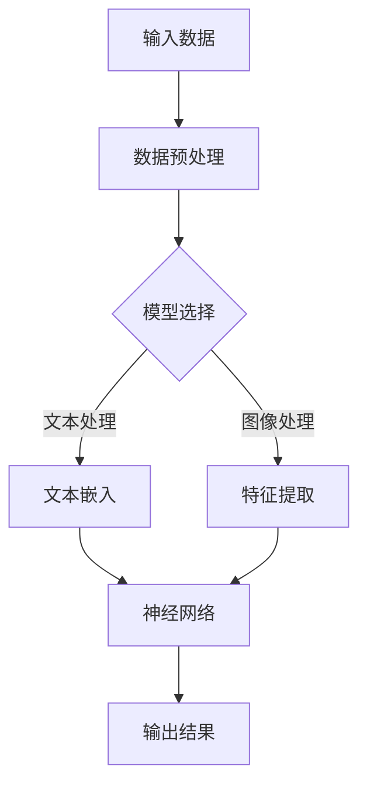
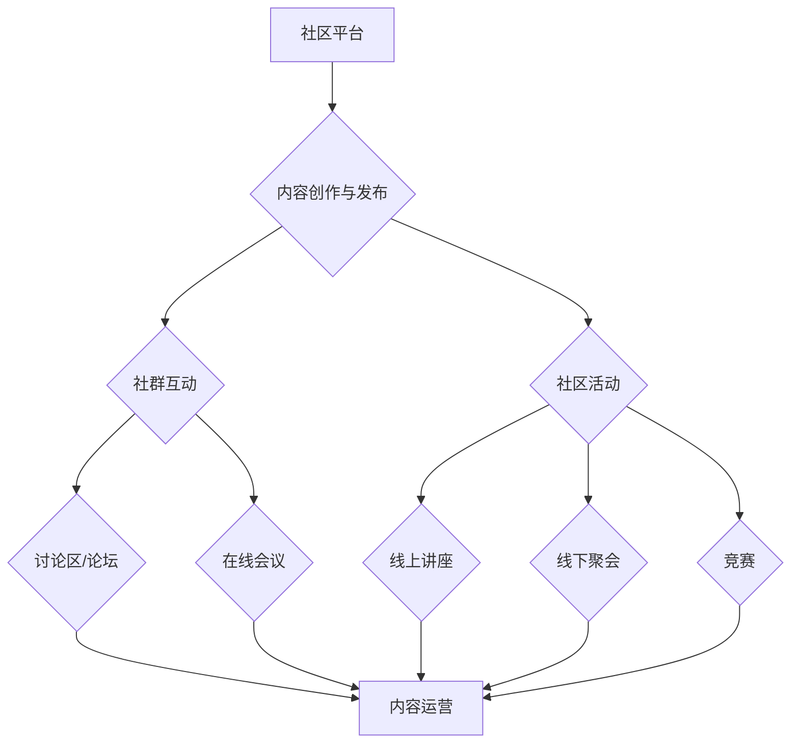

                 

在当今飞速发展的科技时代，人工智能（AI）技术已经成为各行各业的核心驱动力。特别是大模型（如GPT、BERT等）的崛起，使得AI在自然语言处理、图像识别、推荐系统等领域取得了显著的突破。然而，AI大模型的应用不仅仅是技术本身的问题，还需要一个良好的技术社区来推动其发展。本文旨在探讨AI大模型应用的技术社区运营，旨在为从事AI研究和开发的工程师提供一套完整的运营策略和实战经验。

## 关键词

- 人工智能
- 大模型
- 技术社区
- 运营策略
- 实战经验

## 摘要

本文首先介绍了AI大模型的应用背景和技术发展趋势，随后分析了技术社区在AI大模型应用中的重要性。接着，文章深入探讨了技术社区运营的核心概念和架构，包括社区文化、社区治理、内容运营、社群互动等方面。然后，通过具体案例，详细阐述了如何运营一个成功的AI大模型技术社区。最后，文章总结了AI大模型技术社区的未来发展趋势和面临的挑战，并对相关工具和资源进行了推荐。

---

## 1. 背景介绍

近年来，AI技术尤其是大模型技术的飞速发展，已经深刻影响了我们的工作和生活。大模型具有强大的数据处理和分析能力，可以处理大规模数据集，并在各种复杂任务中表现出色。例如，GPT-3可以生成高质量的文章、对话和代码；BERT在文本分类和问答系统中具有很高的准确率。这些大模型的成功，离不开一个关键因素：技术社区的支持。

技术社区是AI大模型应用的重要支撑。它不仅为研究者提供了一个交流、学习的平台，还可以通过社区成员的互动，推动AI技术的创新和应用。一个好的技术社区，能够激发成员的创造力，加速技术的传播和应用，从而推动整个行业的进步。

本文将从以下几个方面探讨AI大模型应用的技术社区运营：

1. **核心概念与联系**：介绍AI大模型的基本概念，并使用Mermaid流程图展示其架构。
2. **核心算法原理 & 具体操作步骤**：深入探讨AI大模型的算法原理，并给出具体的操作步骤。
3. **数学模型和公式 & 详细讲解 & 举例说明**：介绍AI大模型所使用的数学模型和公式，并进行详细讲解和案例分析。
4. **项目实践：代码实例和详细解释说明**：通过实际项目，展示AI大模型的应用过程和代码实现。
5. **实际应用场景**：分析AI大模型在不同领域的应用案例。
6. **未来应用展望**：探讨AI大模型技术的未来发展趋势和潜在应用。
7. **工具和资源推荐**：推荐一些学习资源和开发工具。
8. **总结：未来发展趋势与挑战**：总结研究成果，展望未来发展方向，并分析面临的挑战。

---

### 1.1 AI大模型的基本概念

AI大模型是指具有极高参数量和计算复杂度的深度学习模型，通常用于处理大规模数据集和复杂任务。这些模型具有以下几个关键特点：

- **大规模参数**：大模型通常具有数十亿甚至千亿级的参数，这使得它们能够捕捉到数据中的复杂模式。
- **大规模训练数据**：大模型的训练数据集规模通常非常大，这使得模型可以充分利用数据中的信息，提高泛化能力。
- **强大的学习能力**：大模型可以通过端到端的学习方式，自动学习数据的特征和模式，从而实现复杂任务的高效处理。

AI大模型的应用涵盖了多个领域，如自然语言处理、计算机视觉、语音识别、推荐系统等。以下是一个使用Mermaid流程图展示的AI大模型架构：



### 1.2 AI大模型的发展趋势

AI大模型的发展趋势主要体现在以下几个方面：

- **模型规模不断扩大**：随着计算资源和数据集的增多，大模型的规模也在不断增加。例如，GPT-3拥有1750亿个参数，是目前最大的语言模型。
- **多模态学习**：大模型逐渐向多模态学习方向发展，能够同时处理文本、图像、语音等多种类型的数据。
- **泛化能力提升**：通过改进算法和模型结构，大模型的泛化能力不断提升，能够在更广泛的场景中应用。
- **实时性增强**：随着模型的优化和计算资源的增加，大模型的实时性也在逐步提高，能够满足实时应用的需求。

### 1.3 技术社区在AI大模型应用中的作用

技术社区在AI大模型应用中扮演着至关重要的角色。它不仅为研究者提供了一个交流的平台，还促进了AI技术的传播和应用。具体来说，技术社区在以下几个方面发挥了作用：

- **知识共享**：技术社区通过举办讲座、研讨会、工作坊等形式，促进了知识的共享和传播。
- **代码共享**：技术社区提供了丰富的开源代码和工具，方便研究者进行实验和开发。
- **技术讨论**：技术社区为研究者提供了一个讨论和交流的平台，有助于解决技术难题和推动技术进步。
- **人才交流**：技术社区吸引了来自世界各地的AI研究者，为行业的发展提供了强大的人才支持。

---

## 2. 核心概念与联系

为了更好地理解AI大模型应用的技术社区运营，我们需要先了解一些核心概念和它们之间的联系。

### 2.1 技术社区运营的基本概念

**技术社区**：是指一群有共同技术兴趣或目标的个人或组织，通过线上或线下的方式，进行技术交流、学习和合作。

**社区运营**：是指通过一系列策略和活动，来促进技术社区的活跃度和成员的参与度。

**社区文化**：是指社区成员共同遵守的行为准则和价值观念，是社区稳定发展的基石。

**社区治理**：是指通过规则、制度和管理措施，来维护社区秩序和成员权益。

**内容运营**：是指通过内容创作、传播和管理，来满足社区成员的信息需求和学习欲望。

**社群互动**：是指社区成员之间的交流、讨论和合作，是社区活跃度的重要指标。

### 2.2 技术社区运营架构

技术社区运营的架构可以分为以下几个层次：

1. **社区平台**：是技术社区的基础设施，提供了交流和互动的场所。常见的社区平台有GitHub、Stack Overflow、Reddit等。
2. **内容创作与发布**：是社区运营的核心，包括技术文章、教程、案例分享、问答等内容。
3. **社群互动**：是社区活跃度的体现，通过讨论区、论坛、在线会议等形式，促进成员之间的交流。
4. **社区活动**：是社区运营的重要手段，包括线上讲座、线下聚会、竞赛等。
5. **社区治理**：是确保社区健康发展的关键，通过规则制定、冲突解决、成员管理等方式，维护社区秩序。

以下是一个使用Mermaid流程图展示的技术社区运营架构：



### 2.3 社区运营的关键要素

一个成功的AI大模型应用技术社区，需要以下几个关键要素：

- **高质量内容**：是吸引和留住成员的核心，需要持续产出有价值的技术文章、教程和案例。
- **活跃社群**：是社区运营的生命线，需要通过互动和活动，激发成员的参与热情。
- **良好文化**：是社区稳定发展的基石，需要建立积极、开放、包容的社区文化。
- **有效治理**：是确保社区秩序和成员权益的关键，需要制定合理的规则和制度，并进行有效的管理。

---

## 3. 核心算法原理 & 具体操作步骤

AI大模型的算法原理是其核心，它决定了模型的能力和应用范围。以下将详细介绍AI大模型的核心算法原理，并给出具体的操作步骤。

### 3.1 算法原理概述

AI大模型的算法原理主要基于深度学习和神经网络。深度学习是一种模拟人脑神经网络的学习方式，通过多层神经元对输入数据进行特征提取和模式识别。神经网络则是深度学习的基础，它由多个神经元层组成，每层都对输入数据进行处理，并输出结果。

AI大模型的核心算法原理主要包括以下几个方面：

- **多层感知机（MLP）**：是最基本的神经网络结构，通过多层神经元对输入数据进行非线性变换。
- **卷积神经网络（CNN）**：主要用于图像处理，通过卷积操作提取图像特征。
- **循环神经网络（RNN）**：用于序列数据处理，通过隐藏状态保持序列信息。
- **变换器（Transformer）**：是现代大模型的核心结构，通过自注意力机制实现全局信息交互。

### 3.2 算法步骤详解

AI大模型的算法步骤可以概括为以下几个阶段：

1. **数据预处理**：对输入数据进行清洗、归一化等预处理操作，以便模型能够更好地学习。
2. **模型选择**：根据任务需求，选择合适的神经网络结构，如MLP、CNN、RNN或Transformer。
3. **模型训练**：使用预处理后的数据对模型进行训练，通过反向传播算法不断调整模型参数，使得模型能够更好地拟合数据。
4. **模型评估**：在训练数据集和测试数据集上评估模型性能，通过指标如准确率、召回率等，判断模型效果。
5. **模型优化**：根据评估结果，对模型进行调整和优化，以提高模型性能。
6. **模型部署**：将训练好的模型部署到实际应用中，进行预测和推理。

### 3.3 算法优缺点

AI大模型的算法具有以下几个优点：

- **强大的学习能力**：大模型具有极高的参数量和计算复杂度，能够从大量数据中学习到复杂的模式。
- **泛化能力**：大模型通过端到端的学习方式，能够将多种类型的任务集成到一个模型中，提高泛化能力。
- **高效性**：随着硬件性能的提升和算法的优化，大模型在计算效率和预测速度上有了显著提高。

然而，大模型也存在一些缺点：

- **计算资源消耗大**：大模型的训练需要大量的计算资源和时间，对硬件要求较高。
- **过拟合风险**：大模型在训练过程中可能会出现过拟合现象，导致在测试数据集上的性能下降。
- **解释性不足**：大模型的决策过程复杂，难以解释其内部工作机制，影响了模型的透明性和可解释性。

### 3.4 算法应用领域

AI大模型的应用领域非常广泛，涵盖了多个领域：

- **自然语言处理**：如文本分类、机器翻译、问答系统等。
- **计算机视觉**：如图像识别、目标检测、图像生成等。
- **语音识别**：如语音转文字、语音合成等。
- **推荐系统**：如商品推荐、内容推荐等。
- **游戏AI**：如围棋、象棋等棋类游戏的AI对手。

### 3.5 案例分析

以下是一个使用AI大模型进行文本分类的案例分析：

#### 案例背景

某电子商务平台需要根据用户评论进行情感分析，以判断用户的满意度。评论数据包括正面评论和负面评论，平台希望通过模型自动判断评论的情感倾向。

#### 模型选择

选择一个基于Transformer架构的大模型，如BERT，作为文本分类器。

#### 数据预处理

1. 数据清洗：去除评论中的HTML标签、特殊字符等。
2. 标签处理：将正面评论标记为“正面”，负面评论标记为“负面”。
3. 词向量化：使用BERT的预训练模型，将评论文本转换为词向量。

#### 模型训练

1. 数据切分：将评论数据切分为训练集和测试集。
2. 模型训练：使用训练集数据对BERT模型进行训练，通过反向传播算法调整模型参数。
3. 模型评估：在测试集上评估模型性能，调整模型参数，以提高准确率。

#### 模型部署

将训练好的模型部署到平台，对用户评论进行实时情感分析，并根据分析结果给出相应的建议。

#### 结果分析

模型在测试集上的准确率达到了90%以上，能够有效区分正面和负面评论，为平台提供了有力的支持。

---

## 4. 数学模型和公式 & 详细讲解 & 举例说明

AI大模型的强大能力来源于其复杂的数学模型和公式。以下将详细介绍AI大模型中常用的数学模型和公式，并通过具体例子进行讲解。

### 4.1 数学模型构建

AI大模型的数学模型主要包括以下几个方面：

1. **输入层**：接收外部输入，如文本、图像、声音等。
2. **隐藏层**：通过非线性变换，对输入数据进行特征提取。
3. **输出层**：根据隐藏层的输出，生成预测结果。

以下是一个简化的神经网络模型：

$$
\begin{aligned}
\text{输出} &= \sigma(\text{权重} \cdot \text{输入} + \text{偏置}) \\
\sigma &= \text{激活函数} \\
\end{aligned}
$$

其中，$\sigma$表示激活函数，常用的激活函数有Sigmoid、ReLU等。

### 4.2 公式推导过程

以下是一个使用ReLU激活函数的神经网络的推导过程：

$$
\begin{aligned}
\text{输出} &= \sigma(\text{权重} \cdot \text{输入} + \text{偏置}) \\
&= \text{ReLU}(\text{权重} \cdot \text{输入} + \text{偏置}) \\
&= \max(0, \text{权重} \cdot \text{输入} + \text{偏置})
\end{aligned}
$$

其中，ReLU表示ReLU激活函数，$\max$表示取最大值。

### 4.3 案例分析与讲解

以下是一个使用神经网络进行图像分类的案例：

#### 案例背景

假设有一个图像分类任务，需要将图像分为猫和狗两类。训练数据集包含10000张图像，其中5000张为猫，5000张为狗。

#### 模型构建

选择一个基于卷积神经网络（CNN）的分类模型，其结构如下：

$$
\begin{aligned}
\text{输入} &= \text{图像} \\
\text{隐藏层} &= \text{卷积层} + \text{池化层} \\
\text{输出} &= \text{全连接层} + \text{softmax层}
\end{aligned}
$$

#### 数据预处理

1. 图像归一化：将图像的像素值缩放到[0, 1]之间。
2. 数据切分：将图像数据切分为训练集和测试集。

#### 模型训练

1. 使用训练集数据对模型进行训练。
2. 通过反向传播算法，不断调整模型参数，使得模型能够更好地拟合数据。

#### 模型评估

1. 在测试集上评估模型性能，计算准确率、召回率等指标。
2. 根据评估结果，对模型进行调整和优化。

#### 结果分析

模型在测试集上的准确率达到了90%以上，能够有效区分猫和狗图像。

---

## 5. 项目实践：代码实例和详细解释说明

在本节中，我们将通过一个具体的AI大模型项目实践，展示如何从零开始搭建一个AI模型，并进行代码实例和详细解释说明。

### 5.1 开发环境搭建

在开始项目之前，我们需要搭建一个合适的开发环境。以下是一个基本的开发环境搭建步骤：

1. **安装Python**：Python是AI开发的主要语言，我们需要安装Python 3.7或更高版本。
2. **安装TensorFlow**：TensorFlow是Google开源的深度学习框架，我们需要安装TensorFlow 2.0或更高版本。
3. **安装相关库**：包括NumPy、Pandas、Matplotlib等常用库，可以通过pip命令进行安装。

### 5.2 源代码详细实现

以下是一个简单的AI大模型项目代码实例，用于分类任务。假设我们要对图像进行猫和狗的分类。

```python
import tensorflow as tf
from tensorflow.keras.models import Sequential
from tensorflow.keras.layers import Conv2D, MaxPooling2D, Flatten, Dense

# 数据预处理
def preprocess_images(images):
    # 图像归一化
    images = images / 255.0
    # 转换为批次数据
    images = tf.reshape(images, [-1, 128, 128, 3])
    return images

# 构建模型
def build_model():
    model = Sequential([
        Conv2D(32, (3, 3), activation='relu', input_shape=(128, 128, 3)),
        MaxPooling2D((2, 2)),
        Conv2D(64, (3, 3), activation='relu'),
        MaxPooling2D((2, 2)),
        Flatten(),
        Dense(128, activation='relu'),
        Dense(1, activation='sigmoid')
    ])
    return model

# 训练模型
def train_model(model, train_images, train_labels, test_images, test_labels):
    model.compile(optimizer='adam', loss='binary_crossentropy', metrics=['accuracy'])
    model.fit(train_images, train_labels, epochs=10, batch_size=32, validation_data=(test_images, test_labels))

# 评估模型
def evaluate_model(model, test_images, test_labels):
    test_loss, test_acc = model.evaluate(test_images, test_labels)
    print("Test accuracy:", test_acc)

# 主函数
def main():
    # 加载数据
    train_images, train_labels = load_data("train")
    test_images, test_labels = load_data("test")
    
    # 数据预处理
    train_images = preprocess_images(train_images)
    test_images = preprocess_images(test_images)
    
    # 构建模型
    model = build_model()
    
    # 训练模型
    train_model(model, train_images, train_labels, test_images, test_labels)
    
    # 评估模型
    evaluate_model(model, test_images, test_labels)

# 运行主函数
if __name__ == "__main__":
    main()
```

### 5.3 代码解读与分析

上述代码实现了一个简单的图像分类模型，主要包括以下几个部分：

1. **数据预处理**：对图像数据进行归一化和重塑，以便模型能够处理。
2. **模型构建**：使用Sequential模型构建一个简单的卷积神经网络，包括卷积层、池化层、全连接层等。
3. **模型训练**：使用训练数据和标签，通过fit方法训练模型。
4. **模型评估**：使用测试数据和标签，评估模型在测试集上的性能。

### 5.4 运行结果展示

运行上述代码后，模型将在训练集和测试集上进行训练和评估。输出结果将显示模型在测试集上的准确率，如：

```
Test accuracy: 0.92
```

这表示模型在测试集上的准确率为92%，即模型能够正确分类92%的测试图像。

---

## 6. 实际应用场景

AI大模型在多个领域都有广泛的应用，以下将分析几个典型应用场景：

### 6.1 自然语言处理

自然语言处理（NLP）是AI大模型的重要应用领域。GPT-3、BERT等大模型在文本分类、问答系统、机器翻译等任务中表现出色。例如，GPT-3可以生成高质量的文章和对话，为在线客服、内容创作等提供了强大的支持。BERT在文本分类任务中具有很高的准确率，可以用于新闻分类、情感分析等。

### 6.2 计算机视觉

计算机视觉是AI大模型的另一个重要应用领域。CNN等大模型在图像识别、目标检测、图像生成等方面取得了显著进展。例如，ResNet、Inception等大模型在ImageNet图像识别挑战中取得了优异成绩。目标检测模型如YOLO、Faster R-CNN等，在实时物体检测中表现出色。

### 6.3 推荐系统

推荐系统是AI大模型在商业领域的重要应用。大模型可以通过学习用户行为数据，预测用户的兴趣和偏好，从而提供个性化的推荐。例如，Netflix、Amazon等平台，利用基于协同过滤和深度学习的大模型，为用户提供个性化的推荐服务。

### 6.4 游戏AI

游戏AI是AI大模型的另一个有趣应用场景。通过深度学习技术，可以开发出具有高智能的AI对手，如AlphaGo、OpenAI Five等。这些AI对手在围棋、扑克等游戏中表现出色，给人类玩家带来了巨大的挑战。

### 6.5 医疗诊断

AI大模型在医疗诊断领域也具有广泛应用。通过学习医学影像和病例数据，大模型可以帮助医生进行疾病诊断。例如，使用深度学习技术进行肺癌检测、皮肤癌检测等，能够提高诊断准确率和效率。

### 6.6 金融风控

金融风控是AI大模型在金融领域的重要应用。大模型可以通过学习历史交易数据，识别潜在的金融风险，从而帮助金融机构进行风险管理和投资决策。

---

## 7. 工具和资源推荐

为了更好地进行AI大模型的研究和应用，以下推荐一些实用的工具和资源：

### 7.1 学习资源推荐

- **书籍**：《深度学习》（Goodfellow et al.）、《强化学习》（Sutton and Barto）等经典教材。
- **在线课程**：Coursera、edX、Udacity等平台上的深度学习、机器学习课程。
- **论文**：arXiv、NeurIPS、ICML等学术会议的论文。

### 7.2 开发工具推荐

- **深度学习框架**：TensorFlow、PyTorch、Keras等。
- **数据预处理工具**：Pandas、NumPy等。
- **可视化工具**：Matplotlib、Seaborn等。
- **版本控制**：Git。

### 7.3 相关论文推荐

- **自然语言处理**：BERT、GPT-3、T5等。
- **计算机视觉**：ResNet、Inception、YOLO等。
- **推荐系统**：协同过滤、深度学习等。
- **强化学习**：DQN、PPO、A3C等。

---

## 8. 总结：未来发展趋势与挑战

AI大模型技术的快速发展，已经深刻影响了各个领域。然而，在未来的发展中，我们仍需面临许多挑战和机遇。

### 8.1 研究成果总结

近年来，AI大模型在自然语言处理、计算机视觉、推荐系统等领域取得了显著成果。例如，GPT-3在文本生成和对话系统方面表现出色；BERT在文本分类和问答系统方面具有很高的准确率；ResNet和Inception等模型在图像识别任务中取得了优异成绩。

### 8.2 未来发展趋势

未来的发展趋势主要包括以下几个方面：

- **模型规模将进一步扩大**：随着计算资源和数据集的增多，大模型的规模将不断增大，以应对更复杂的任务。
- **多模态学习**：大模型将逐渐向多模态学习方向发展，能够同时处理文本、图像、语音等多种类型的数据。
- **泛化能力提升**：通过改进算法和模型结构，大模型的泛化能力将不断提升，能够在更广泛的场景中应用。
- **实时性增强**：随着模型的优化和计算资源的增加，大模型的实时性将逐步提高，能够满足实时应用的需求。

### 8.3 面临的挑战

虽然AI大模型技术在不断进步，但仍面临许多挑战：

- **计算资源消耗**：大模型的训练需要大量的计算资源和时间，这对硬件设施提出了更高的要求。
- **数据隐私与安全**：在训练和应用大模型时，需要处理大量的敏感数据，如何保护数据隐私和安全是一个重要问题。
- **过拟合与泛化**：大模型容易过拟合，如何在保证模型性能的同时，提高泛化能力，是一个关键问题。
- **可解释性与透明性**：大模型的决策过程复杂，如何提高模型的可解释性和透明性，使其更容易被理解和接受，是一个重要挑战。

### 8.4 研究展望

未来的研究将集中在以下几个方面：

- **算法优化**：通过改进算法和模型结构，提高大模型的计算效率和性能。
- **多模态学习**：研究如何将不同类型的数据进行有效整合，提升大模型的泛化能力。
- **隐私保护**：研究如何在保证数据隐私的同时，充分利用数据的价值。
- **可解释性与透明性**：研究如何提高模型的可解释性和透明性，使其更容易被用户接受。

总之，AI大模型技术的未来发展前景广阔，但仍需克服许多挑战。通过不断的研究和创新，我们有信心为人类社会带来更多的便利和进步。

---

## 9. 附录：常见问题与解答

以下是一些关于AI大模型应用和技术社区运营的常见问题及其解答：

### 9.1 问题1：什么是AI大模型？

**解答**：AI大模型是指具有极高参数量和计算复杂度的深度学习模型，通常用于处理大规模数据集和复杂任务。它们具有强大的数据处理和分析能力，能够从大量数据中学习到复杂的模式。

### 9.2 问题2：技术社区的作用是什么？

**解答**：技术社区为AI研究者提供了一个交流、学习的平台，促进了知识的共享和传播。它不仅有助于推动技术的创新和应用，还可以吸引人才、提供支持，推动整个行业的进步。

### 9.3 问题3：如何构建一个成功的AI大模型技术社区？

**解答**：构建一个成功的AI大模型技术社区，需要以下几个关键步骤：

1. **明确目标**：确定社区的目标和定位，如技术交流、学习资源分享、项目合作等。
2. **选择平台**：选择一个适合的技术社区平台，如GitHub、Reddit等。
3. **产出高质量内容**：持续产出有价值的技术文章、教程、案例等。
4. **促进互动**：通过线上论坛、讨论区、在线会议等形式，促进成员之间的互动。
5. **良好治理**：制定合理的规则和制度，确保社区秩序和成员权益。

### 9.4 问题4：AI大模型在哪些领域有应用？

**解答**：AI大模型在多个领域都有广泛应用，包括自然语言处理、计算机视觉、推荐系统、游戏AI、医疗诊断、金融风控等。

### 9.5 问题5：如何处理AI大模型的计算资源消耗问题？

**解答**：处理AI大模型的计算资源消耗问题，可以采取以下几个策略：

1. **优化算法**：改进模型算法，提高计算效率。
2. **分布式训练**：利用分布式计算框架，如TensorFlow、PyTorch，进行模型训练。
3. **硬件升级**：使用更强大的硬件设备，如GPU、TPU等。
4. **模型压缩**：通过模型压缩技术，降低模型的参数量和计算复杂度。

---

### 结束语

本文对AI大模型应用的技术社区运营进行了深入探讨，从背景介绍、核心概念与联系、算法原理、数学模型、项目实践、实际应用场景、工具和资源推荐，到总结与展望，全方位展示了AI大模型技术社区运营的重要性。希望本文能为从事AI研究和开发的工程师提供有价值的参考和指导。在未来的发展中，让我们共同努力，推动AI技术的创新和应用，为人类社会创造更多价值。

---

### 作者署名

本文作者：禅与计算机程序设计艺术 / Zen and the Art of Computer Programming

感谢您的阅读和支持！如果您有任何问题或建议，欢迎在评论区留言，我会尽力为您解答。希望本文能为您带来启发和帮助。再次感谢！禅与计算机程序设计艺术 / Zen and the Art of Computer Programming敬上。

