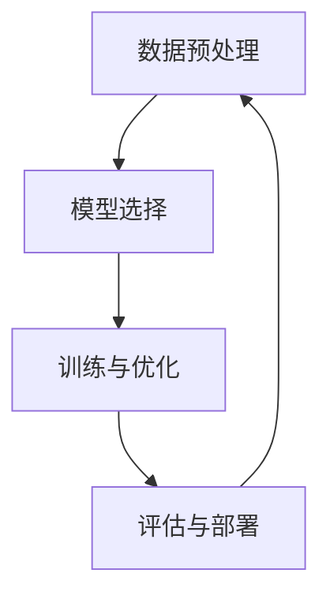

                 

关键词：人工智能、大模型、技术选型、算法原理、数学模型、应用场景、工具推荐

> 摘要：本文旨在为人工智能领域的开发者提供一套全面的技术选型决策指南，帮助他们在选择和构建AI大模型时能够做出科学、合理的决策。文章涵盖了AI大模型应用的技术原理、核心算法、数学模型、实际应用案例以及未来发展趋势，为读者提供了全方位的技术指导。

## 1. 背景介绍

人工智能（AI）作为一门前沿的科学技术，近年来取得了飞速的发展。特别是深度学习技术的崛起，使得AI在图像识别、自然语言处理、推荐系统等众多领域取得了突破性成果。随着计算能力的提升和数据量的增加，AI大模型的应用场景越来越广泛，成为了各行各业竞相追捧的对象。然而，面对复杂多变的AI应用需求，如何进行技术选型成为了一个亟待解决的问题。

技术选型决策不仅关系到AI大模型的效果和性能，还涉及到开发成本、资源利用、维护难度等多个方面。因此，本文将从技术原理、算法选择、数学模型构建、实际应用案例等多个角度，全面探讨AI大模型应用的技术选型决策方法，为开发者提供实用的参考。

## 2. 核心概念与联系

在AI大模型应用中，有几个核心概念和联系需要了解，包括数据预处理、模型选择、训练与优化、评估与部署等。下面，我们将使用Mermaid流程图来展示这些核心概念之间的联系。



### 2.1 数据预处理

数据预处理是AI大模型应用的基础，它包括数据清洗、数据归一化、特征提取等步骤。良好的数据预处理能够提高模型的训练效果和性能。

### 2.2 模型选择

模型选择是技术选型决策中的关键环节，涉及到模型的架构、参数设置等。常见的模型包括神经网络、决策树、支持向量机等。开发者需要根据具体应用场景选择合适的模型。

### 2.3 训练与优化

训练与优化是模型构建的核心环节，包括损失函数、优化算法等。优化的目标是使模型在训练数据上达到较好的性能。

### 2.4 评估与部署

评估与部署是对模型性能的检验和应用。评估包括准确率、召回率、F1值等指标。部署是将模型应用到实际场景中，包括部署环境、部署策略等。

## 3. 核心算法原理 & 具体操作步骤

### 3.1 算法原理概述

AI大模型的核心算法主要包括神经网络、深度学习、强化学习等。其中，神经网络是最基本的算法，它通过多层神经元的组合，实现从输入到输出的映射。深度学习是神经网络的一种扩展，通过增加网络层数，实现更加复杂的函数映射。强化学习则是一种基于试错和奖励机制的算法，通过不断尝试和反馈，优化策略。

### 3.2 算法步骤详解

下面以神经网络为例，详细讲解其基本原理和操作步骤：

#### 3.2.1 神经网络结构

神经网络由输入层、隐藏层和输出层组成。输入层接收外部输入数据，隐藏层通过一系列权重和激活函数进行处理，输出层产生最终的输出。

#### 3.2.2 损失函数

损失函数是评估模型性能的关键指标，常用的损失函数包括均方误差（MSE）、交叉熵（Cross Entropy）等。

#### 3.2.3 优化算法

优化算法用于调整模型参数，使损失函数达到最小。常用的优化算法有梯度下降（Gradient Descent）、Adam优化器等。

#### 3.2.4 激活函数

激活函数用于引入非线性因素，使神经网络能够拟合更加复杂的函数。常用的激活函数有Sigmoid、ReLU等。

### 3.3 算法优缺点

神经网络和深度学习算法在处理复杂问题时表现出强大的能力，但同时也存在一些不足，如参数量大、训练时间较长等。

### 3.4 算法应用领域

神经网络和深度学习算法在图像识别、自然语言处理、推荐系统等领域得到了广泛应用。例如，在图像识别中，卷积神经网络（CNN）可以提取图像中的特征；在自然语言处理中，循环神经网络（RNN）和长短时记忆网络（LSTM）可以处理序列数据。

## 4. 数学模型和公式 & 详细讲解 & 举例说明

### 4.1 数学模型构建

神经网络的核心是神经元之间的连接和激活函数。假设一个简单的神经网络包含一个输入层、一个隐藏层和一个输出层，其中输入层有n个神经元，隐藏层有m个神经元，输出层有k个神经元。我们可以用以下数学模型来表示：

$$
\begin{aligned}
z &= \text{激活函数}(W_1 \cdot x + b_1) \\
y &= \text{激活函数}(W_2 \cdot z + b_2)
\end{aligned}
$$

其中，$W_1$ 和 $W_2$ 分别是隐藏层和输出层的权重矩阵，$b_1$ 和 $b_2$ 分别是隐藏层和输出层的偏置项，$\cdot$ 表示矩阵乘法，$\text{激活函数}$ 可以是Sigmoid、ReLU等。

### 4.2 公式推导过程

假设我们使用均方误差（MSE）作为损失函数，目标是最小化损失函数。我们可以通过梯度下降法来优化模型参数。首先，我们需要计算损失函数关于每个参数的梯度：

$$
\begin{aligned}
\frac{\partial L}{\partial W_1} &= 2 \cdot (z - y) \cdot \text{激活函数的导数}(z) \cdot x \\
\frac{\partial L}{\partial W_2} &= 2 \cdot (y - z) \cdot \text{激活函数的导数}(z) \cdot z
\end{aligned}
$$

其中，$L$ 表示损失函数，$\text{激活函数的导数}(z)$ 表示激活函数关于输入的导数。

### 4.3 案例分析与讲解

假设我们有一个二分类问题，输入数据是 $x \in \mathbb{R}^n$，输出数据是 $y \in \{0, 1\}$。我们可以使用一个简单的神经网络模型来解决这个问题。

#### 案例一：使用Sigmoid激活函数

假设隐藏层有10个神经元，输出层有1个神经元，使用Sigmoid作为激活函数。我们可以使用以下步骤来训练模型：

1. 初始化权重矩阵 $W_1$ 和 $W_2$ 以及偏置项 $b_1$ 和 $b_2$。
2. 前向传播，计算隐藏层和输出层的输出。
3. 计算损失函数。
4. 计算损失函数关于每个参数的梯度。
5. 更新参数。
6. 重复步骤2-5，直到模型收敛。

#### 案例二：使用ReLU激活函数

相比Sigmoid激活函数，ReLU激活函数可以加速模型的训练，提高模型的性能。我们可以使用以下步骤来训练模型：

1. 初始化权重矩阵 $W_1$ 和 $W_2$ 以及偏置项 $b_1$ 和 $b_2$。
2. 前向传播，计算隐藏层和输出层的输出。
3. 计算损失函数。
4. 计算损失函数关于每个参数的梯度。
5. 更新参数。
6. 重复步骤2-5，直到模型收敛。

## 5. 项目实践：代码实例和详细解释说明

### 5.1 开发环境搭建

在开始编写代码之前，我们需要搭建一个适合AI大模型开发的环境。这里，我们选择Python作为主要编程语言，并使用以下工具和库：

- Python 3.x
- TensorFlow 2.x
- NumPy
- Matplotlib

安装完以上工具和库后，我们就可以开始编写代码了。

### 5.2 源代码详细实现

下面是一个简单的神经网络模型的实现代码，用于解决二分类问题。

```python
import tensorflow as tf
import numpy as np
import matplotlib.pyplot as plt

# 初始化参数
n_inputs = 2
n_hidden = 10
n_outputs = 1

# 初始化权重和偏置
W1 = tf.random.normal([n_inputs, n_hidden])
b1 = tf.zeros([n_hidden])
W2 = tf.random.normal([n_hidden, n_outputs])
b2 = tf.zeros([n_outputs])

# 定义激活函数
activation = tf.nn.sigmoid

# 前向传播
def forward(x):
    z1 = activation(tf.matmul(x, W1) + b1)
    z2 = activation(tf.matmul(z1, W2) + b2)
    return z2

# 损失函数
def loss(y_true, y_pred):
    return tf.reduce_mean(tf.square(y_true - y_pred))

# 梯度下降
optimizer = tf.optimizers.SGD(learning_rate=0.1)

# 训练模型
for epoch in range(1000):
    with tf.GradientTape() as tape:
        y_pred = forward(x_train)
        loss_value = loss(y_train, y_pred)
    grads = tape.gradient(loss_value, [W1, b1, W2, b2])
    optimizer.apply_gradients(zip(grads, [W1, b1, W2, b2]))

    if epoch % 100 == 0:
        print(f"Epoch {epoch}, Loss: {loss_value.numpy()}")

# 测试模型
y_pred = forward(x_test)
print(f"Test Loss: {loss(y_test, y_pred).numpy()}")

# 可视化结果
plt.scatter(x_train[:, 0], x_train[:, 1], c=y_train, cmap=plt.cm.Spectral)
plt.scatter(x_test[:, 0], x_test[:, 1], c=y_test, cmap=plt.cm.Spectral, alpha=0.5)
plt.show()
```

### 5.3 代码解读与分析

这段代码实现了一个简单的神经网络模型，用于解决二分类问题。具体步骤如下：

1. 导入所需的库。
2. 初始化参数。
3. 定义激活函数。
4. 定义前向传播函数。
5. 定义损失函数。
6. 定义优化器。
7. 训练模型。
8. 测试模型。
9. 可视化结果。

### 5.4 运行结果展示

运行代码后，我们会在命令行中看到训练过程中的损失值。同时，在可视化窗口中，我们会看到训练集和测试集的散点图，其中不同颜色的点表示不同的类别。

## 6. 实际应用场景

AI大模型的应用场景非常广泛，包括但不限于以下几个方面：

### 6.1 图像识别

图像识别是AI大模型的重要应用领域之一。通过卷积神经网络（CNN），AI可以识别出图像中的物体、场景、情感等信息。例如，人脸识别、图像分类、图像分割等。

### 6.2 自然语言处理

自然语言处理（NLP）是AI大模型应用的另一个重要领域。通过循环神经网络（RNN）和长短时记忆网络（LSTM），AI可以处理自然语言文本，实现文本分类、情感分析、机器翻译等功能。

### 6.3 推荐系统

推荐系统是AI大模型在商业领域的典型应用。通过协同过滤、矩阵分解等算法，AI可以预测用户对商品、内容等的喜好，从而为用户提供个性化的推荐。

### 6.4 医疗健康

医疗健康是AI大模型应用的另一个重要领域。通过深度学习技术，AI可以辅助医生进行疾病诊断、病情预测等，提高医疗效率和质量。

## 7. 工具和资源推荐

为了更好地进行AI大模型的技术选型决策，开发者需要掌握一系列工具和资源。下面是一些建议：

### 7.1 学习资源推荐

- 《深度学习》（Goodfellow, Bengio, Courville著）
- 《神经网络与深度学习》（邱锡鹏著）
- 《Python机器学习》（赛吉·博斯蒂克著）

### 7.2 开发工具推荐

- TensorFlow：开源深度学习框架，适用于各种AI应用。
- PyTorch：开源深度学习框架，支持动态计算图，适用于研究和开发。
- Keras：基于TensorFlow和PyTorch的简洁易用的深度学习库。

### 7.3 相关论文推荐

- "Deep Learning" by Ian Goodfellow, Yoshua Bengio, Aaron Courville
- "Convolutional Neural Networks for Visual Recognition" by Karen Simonyan and Andrew Zisserman
- "Long Short-Term Memory" by Sepp Hochreiter and Jürgen Schmidhuber

## 8. 总结：未来发展趋势与挑战

### 8.1 研究成果总结

近年来，AI大模型在多个领域取得了显著的成果，推动了人工智能的发展。未来，随着计算能力的提升、数据量的增加和算法的创新，AI大模型将有望在更多领域发挥重要作用。

### 8.2 未来发展趋势

- 更高效的算法：未来，AI大模型将朝着更高效、更准确的算法方向发展，如增量学习、迁移学习等。
- 更智能的应用场景：AI大模型将在更多智能应用场景中得到应用，如智能机器人、自动驾驶等。
- 更开放的平台：AI大模型将更加开放，支持多种编程语言和开发框架，方便开发者进行技术选型决策。

### 8.3 面临的挑战

- 数据隐私与安全：随着AI大模型的应用越来越广泛，数据隐私和安全问题将日益突出。
- 可解释性：如何提高AI大模型的可解释性，使其更加透明、可靠，是未来需要解决的问题。
- 资源消耗：AI大模型的训练和推理过程需要大量的计算资源和数据存储，如何优化资源利用是一个挑战。

### 8.4 研究展望

未来，AI大模型的研究将朝着以下几个方向展开：

- 算法的创新：探索更高效的算法，提高AI大模型的性能。
- 应用场景拓展：研究AI大模型在不同领域的应用，推动人工智能技术的普及。
- 可解释性与透明性：提高AI大模型的可解释性，使其更加透明、可靠。
- 资源优化：研究如何优化AI大模型的训练和推理过程，降低资源消耗。

## 9. 附录：常见问题与解答

### 9.1 什么是AI大模型？

AI大模型是指具有大规模参数、复杂结构的人工智能模型。这些模型通常具有强大的学习能力和广泛的应用场景。

### 9.2 AI大模型有哪些类型？

AI大模型主要包括神经网络、深度学习、强化学习等类型。其中，神经网络是最基础的算法，深度学习是神经网络的扩展，强化学习则是一种基于奖励机制的算法。

### 9.3 如何进行AI大模型的技术选型决策？

进行AI大模型的技术选型决策需要考虑以下几个方面：

- 应用场景：根据具体应用场景选择合适的算法和模型。
- 性能要求：根据性能要求选择适当的参数设置。
- 开发成本：根据开发成本选择合适的工具和框架。
- 维护难度：考虑维护成本和可维护性。

### 9.4 AI大模型有哪些应用领域？

AI大模型的应用领域非常广泛，包括图像识别、自然语言处理、推荐系统、医疗健康、自动驾驶等。未来，随着技术的不断发展，AI大模型将在更多领域发挥重要作用。

---

### 作者署名

作者：禅与计算机程序设计艺术 / Zen and the Art of Computer Programming

---

以上，就是本文的完整内容。希望通过本文的介绍，读者能够对AI大模型应用的技术选型决策有更深入的了解。希望本文能够为您的AI大模型开发之路提供一些有用的指导和建议。感谢您的阅读！

