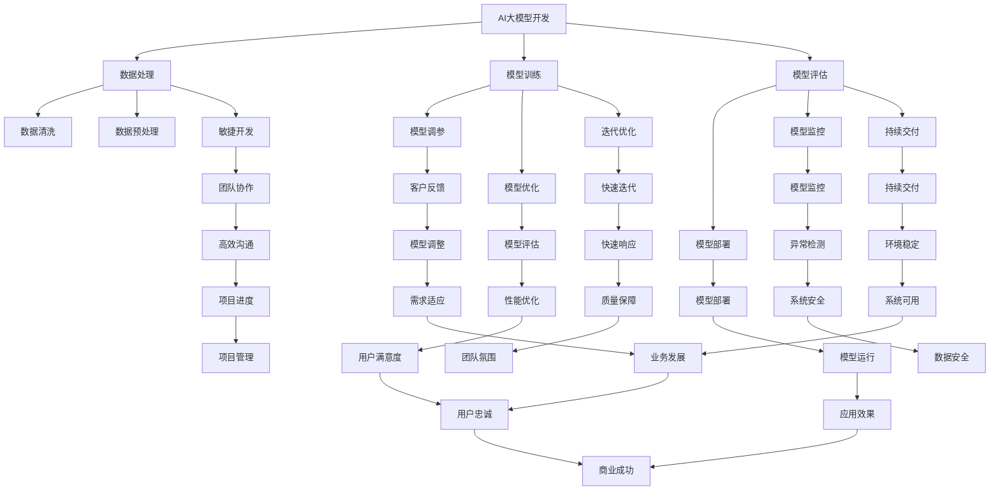

                 

### 1. 背景介绍

在过去的几十年中，人工智能（AI）技术的飞速发展已经深刻改变了我们的生活和工作的方方面面。从简单的规则系统到复杂的深度学习模型，AI技术在多个领域取得了显著的成果，如图像识别、自然语言处理和推荐系统等。然而，随着AI模型变得越来越复杂和庞大，传统开发方法在应对这些挑战时显得力不从心。这促使了敏捷开发方法论的诞生，特别是在AI大模型的应用开发中。

敏捷开发最初起源于软件开发领域，它强调快速迭代、持续交付和客户反馈的重要性。随着AI技术的应用范围不断扩大，敏捷开发也逐渐被引入到AI大模型的应用开发中。AI大模型的应用开发不仅需要处理大量的数据和复杂的算法，还要确保模型的稳定性和可扩展性。因此，敏捷开发方法论在AI大模型中的应用显得尤为重要。

本文旨在探讨AI大模型应用的敏捷开发方法论，从背景介绍、核心概念与联系、核心算法原理、数学模型和公式、项目实践、实际应用场景、工具和资源推荐以及未来发展趋势和挑战等多个方面进行深入讨论。希望通过本文的阐述，能够为从事AI大模型开发的工作者提供一些有价值的参考和启示。

### 2. 核心概念与联系

在深入探讨AI大模型应用的敏捷开发方法论之前，我们需要明确几个核心概念，并理解它们之间的联系。以下是本文将涉及的关键概念：

#### AI大模型

AI大模型是指那些具有巨大参数数量和复杂结构的机器学习模型。这些模型通常涉及深度学习技术，如神经网络，并在训练过程中处理大量的数据。常见的AI大模型包括深度神经网络、生成对抗网络（GAN）和变换器模型等。

#### 敏捷开发

敏捷开发是一种以迭代、快速反馈和持续交付为核心理念的开发方法。它强调团队协作、灵活适应变化和客户满意度。敏捷开发方法包括多种实践，如Scrum、看板和用户故事地图等。

#### 敏捷开发方法论在AI大模型中的应用

敏捷开发方法论在AI大模型中的应用主要体现在以下几个方面：

1. **快速迭代**：AI大模型开发通常需要多次迭代和优化，敏捷开发提供了快速迭代的方法，使团队能够迅速响应需求变化和问题。
2. **持续交付**：AI大模型的应用场景多样，持续交付有助于确保模型在各个环境下都能稳定运行。
3. **客户反馈**：通过不断收集客户反馈，团队能够调整模型性能，提高用户满意度。

#### Mermaid流程图

为了更直观地展示这些核心概念之间的联系，我们使用Mermaid流程图进行描述。以下是一个简单的Mermaid流程图，展示了AI大模型应用开发中的关键步骤和敏捷开发方法的应用：



通过上述流程图，我们可以清晰地看到，敏捷开发方法论在AI大模型应用开发中的各个环节中都发挥着关键作用，从数据处理到模型训练、评估和部署，再到持续优化和客户反馈，每一个环节都离不开敏捷开发的理念和实践。

### 3. 核心算法原理 & 具体操作步骤

#### 3.1 算法原理概述

在AI大模型的应用开发中，核心算法的选择和实现至关重要。以下将介绍几种常用的核心算法及其原理：

1. **深度神经网络（DNN）**

深度神经网络是一种基于多层感知器的神经网络模型，它通过多个隐藏层对输入数据进行抽象和转换。DNN在图像识别、语音识别和自然语言处理等领域具有广泛应用。其主要原理是通过反向传播算法（Backpropagation）来不断调整网络中的权重，以优化模型性能。

2. **生成对抗网络（GAN）**

生成对抗网络由生成器（Generator）和判别器（Discriminator）组成。生成器生成假数据，判别器判断生成数据与真实数据的相似度。通过两个网络之间的对抗训练，生成器逐渐生成更加真实的数据。GAN在图像生成、数据增强和风格迁移等领域表现出色。

3. **变换器模型（Transformer）**

变换器模型是一种基于自注意力机制（Self-Attention）的新型神经网络架构。它通过多头注意力机制和位置编码来处理序列数据，具有强大的并行计算能力。变换器模型在机器翻译、文本生成和推荐系统等领域取得了显著成果。

#### 3.2 算法步骤详解

以下将详细描述上述核心算法的具体操作步骤：

1. **深度神经网络（DNN）**

（1）输入层：接收输入数据，并将其传递到隐藏层。

（2）隐藏层：通过非线性激活函数（如ReLU、Sigmoid、Tanh）对输入数据进行转换，提取特征。

（3）输出层：将隐藏层的输出进行线性变换，得到预测结果。

（4）反向传播：计算损失函数（如均方误差、交叉熵损失）的梯度，并反向传播更新网络权重。

2. **生成对抗网络（GAN）**

（1）生成器：生成假数据，并与真实数据混合。

（2）判别器：判断生成数据与真实数据的相似度。

（3）训练：通过交替训练生成器和判别器，生成器逐渐生成更真实的数据，判别器逐渐提高识别能力。

（4）评估：使用生成器的输出数据进行应用验证，评估模型性能。

3. **变换器模型（Transformer）**

（1）输入编码：将输入序列编码为向量，并添加位置编码。

（2）多头注意力：计算序列中每个位置与其他位置之间的权重，并进行加权求和。

（3）前馈网络：对注意力结果进行前馈网络处理，增加非线性变换。

（4）输出层：将注意力结果传递到输出层，生成预测结果。

#### 3.3 算法优缺点

1. **深度神经网络（DNN）**

优点：结构简单，计算效率高；适用于多种数据类型和任务。

缺点：对数据依赖性强，需要大量训练数据和计算资源；模型可解释性差。

2. **生成对抗网络（GAN）**

优点：无需显式定义损失函数，具有强大的数据生成能力；适用于无监督学习和数据增强。

缺点：训练过程不稳定，易出现模式崩溃（mode collapse）问题；模型难以解释。

3. **变换器模型（Transformer）**

优点：具有强大的并行计算能力，适用于长序列数据处理；模型结构清晰，易于理解和实现。

缺点：计算复杂度较高，训练时间较长；对数据依赖性强，需要大量训练数据和计算资源。

#### 3.4 算法应用领域

1. **深度神经网络（DNN）**

应用领域：图像识别、语音识别、自然语言处理等。

2. **生成对抗网络（GAN）**

应用领域：图像生成、数据增强、风格迁移等。

3. **变换器模型（Transformer）**

应用领域：机器翻译、文本生成、推荐系统等。

通过以上对核心算法原理和操作步骤的详细描述，我们可以更好地理解AI大模型应用开发的复杂性。在实际开发过程中，需要根据具体任务需求选择合适的算法，并结合敏捷开发方法论进行快速迭代和优化，以实现高效、稳定和可扩展的AI大模型应用。

### 4. 数学模型和公式 & 详细讲解 & 举例说明

在AI大模型应用开发中，数学模型和公式是理解和实现核心算法的基础。以下将介绍几种常用的数学模型和公式，并进行详细讲解和举例说明。

#### 4.1 数学模型构建

1. **损失函数**

损失函数是评估模型预测结果与实际值之间差异的指标。在深度学习模型中，常用的损失函数包括均方误差（MSE）、交叉熵损失（Cross Entropy Loss）等。

均方误差（MSE）：

$$
MSE = \frac{1}{n}\sum_{i=1}^{n}(y_i - \hat{y}_i)^2
$$

其中，$y_i$为实际值，$\hat{y}_i$为预测值，$n$为样本数量。

交叉熵损失（Cross Entropy Loss）：

$$
CE = -\sum_{i=1}^{n} y_i \log(\hat{y}_i)
$$

其中，$y_i$为实际值，$\hat{y}_i$为预测值。

2. **优化算法**

优化算法用于调整模型参数，以最小化损失函数。常用的优化算法包括梯度下降（Gradient Descent）、动量梯度下降（Momentum Gradient Descent）等。

梯度下降（Gradient Descent）：

$$
w_{t+1} = w_t - \alpha \cdot \nabla_w J(w)
$$

其中，$w_t$为当前参数，$w_{t+1}$为更新后的参数，$\alpha$为学习率，$\nabla_w J(w)$为损失函数关于参数的梯度。

动量梯度下降（Momentum Gradient Descent）：

$$
w_{t+1} = w_t - \alpha \cdot \nabla_w J(w) + \beta \cdot v_t
$$

其中，$v_t = \alpha \cdot \nabla_w J(w_t)$为动量项，$\beta$为动量因子。

3. **激活函数**

激活函数用于引入非线性变换，常见的激活函数包括ReLU（Rectified Linear Unit）、Sigmoid、Tanh等。

ReLU（Rectified Linear Unit）：

$$
f(x) =
\begin{cases}
0, & \text{if } x < 0 \\
x, & \text{if } x \geq 0
\end{cases}
$$

Sigmoid：

$$
f(x) = \frac{1}{1 + e^{-x}}
$$

Tanh：

$$
f(x) = \frac{e^x - e^{-x}}{e^x + e^{-x}}
$$

#### 4.2 公式推导过程

以均方误差（MSE）和梯度下降（Gradient Descent）为例，介绍公式推导过程。

1. **均方误差（MSE）**

均方误差（MSE）是衡量预测结果与实际值之间差异的常用指标。假设有一个线性模型$y = wx + b$，其中$y$为实际值，$x$为输入值，$w$和$b$分别为模型参数。则均方误差（MSE）可以表示为：

$$
MSE = \frac{1}{n}\sum_{i=1}^{n}(y_i - \hat{y}_i)^2
$$

其中，$\hat{y}_i = wx_i + b$为预测值，$n$为样本数量。

2. **梯度下降（Gradient Descent）**

梯度下降（Gradient Descent）是一种优化算法，用于调整模型参数以最小化损失函数。以线性模型$y = wx + b$为例，推导梯度下降的更新公式。

损失函数为均方误差（MSE），则梯度可以表示为：

$$
\nabla_w J(w) = \frac{\partial}{\partial w} \frac{1}{n}\sum_{i=1}^{n}(y_i - \hat{y}_i)^2 = \frac{2}{n}\sum_{i=1}^{n}(y_i - \hat{y}_i)x_i
$$

$$
\nabla_b J(b) = \frac{\partial}{\partial b} \frac{1}{n}\sum_{i=1}^{n}(y_i - \hat{y}_i)^2 = \frac{2}{n}\sum_{i=1}^{n}(y_i - \hat{y}_i)
$$

根据梯度下降算法，更新参数的公式为：

$$
w_{t+1} = w_t - \alpha \cdot \nabla_w J(w_t)
$$

$$
b_{t+1} = b_t - \alpha \cdot \nabla_b J(b_t)
$$

其中，$\alpha$为学习率。

#### 4.3 案例分析与讲解

以下通过一个简单的线性回归案例，展示数学模型和公式的应用。

假设有一个线性模型$y = wx + b$，其中$x$为输入值，$y$为实际值，$w$和$b$分别为模型参数。我们使用均方误差（MSE）作为损失函数，并采用梯度下降（Gradient Descent）进行优化。

1. **数据准备**

假设我们有以下训练数据：

| $x$ | $y$ |
|-----|-----|
| 1   | 2   |
| 2   | 4   |
| 3   | 6   |

2. **初始化参数**

初始化模型参数$w$和$b$为0：

$$
w_0 = 0, b_0 = 0
$$

3. **计算损失函数**

使用均方误差（MSE）计算损失函数：

$$
MSE = \frac{1}{3}\sum_{i=1}^{3}(y_i - \hat{y}_i)^2
$$

其中，$\hat{y}_i = w_0 \cdot x_i + b_0$。

4. **计算梯度**

计算损失函数关于参数$w$和$b$的梯度：

$$
\nabla_w J(w) = \frac{2}{3}\sum_{i=1}^{3}(y_i - \hat{y}_i)x_i
$$

$$
\nabla_b J(b) = \frac{2}{3}\sum_{i=1}^{3}(y_i - \hat{y}_i)
$$

5. **更新参数**

根据梯度下降算法，更新参数$w$和$b$：

$$
w_1 = w_0 - \alpha \cdot \nabla_w J(w_0)
$$

$$
b_1 = b_0 - \alpha \cdot \nabla_b J(b_0)
$$

其中，$\alpha$为学习率。

6. **迭代优化**

重复步骤3到步骤5，直到损失函数收敛或达到预设迭代次数。

通过上述案例，我们可以看到数学模型和公式在AI大模型应用开发中的实际应用。了解和掌握这些数学模型和公式，有助于我们更好地理解和实现AI大模型的核心算法。

### 5. 项目实践：代码实例和详细解释说明

为了更好地理解AI大模型应用开发的实际过程，以下将提供一个简单的线性回归项目实例，介绍如何使用Python实现线性回归模型，并详细解释代码的各个部分。

#### 5.1 开发环境搭建

在开始编写代码之前，需要搭建一个Python开发环境。以下是所需的Python包和安装步骤：

1. **Python 3.8或更高版本**
2. **Numpy**：用于数学运算
3. **Matplotlib**：用于数据可视化
4. **Scikit-learn**：用于线性回归模型

安装步骤：

```bash
pip install numpy matplotlib scikit-learn
```

#### 5.2 源代码详细实现

以下是一个简单的线性回归项目代码实例：

```python
import numpy as np
import matplotlib.pyplot as plt
from sklearn.linear_model import LinearRegression

# 数据准备
X = np.array([1, 2, 3]).reshape(-1, 1)
y = np.array([2, 4, 6])

# 初始化模型
model = LinearRegression()

# 模型训练
model.fit(X, y)

# 模型评估
score = model.score(X, y)
print(f'Model Score: {score}')

# 预测
predictions = model.predict(X)

# 可视化
plt.scatter(X, y, color='red', label='Actual Data')
plt.plot(X, predictions, color='blue', label='Predicted Line')
plt.xlabel('X')
plt.ylabel('Y')
plt.legend()
plt.show()
```

#### 5.3 代码解读与分析

1. **数据准备**

   ```python
   X = np.array([1, 2, 3]).reshape(-1, 1)
   y = np.array([2, 4, 6])
   ```

   这部分代码用于准备训练数据。$X$表示输入特征，$y$表示实际值。通过`reshape(-1, 1)`将输入特征转换为二维数组，以便后续使用。

2. **初始化模型**

   ```python
   model = LinearRegression()
   ```

   这行代码初始化线性回归模型。`LinearRegression`是Scikit-learn库中的一个类，用于实现线性回归模型。

3. **模型训练**

   ```python
   model.fit(X, y)
   ```

   `fit`方法用于训练模型。它使用输入特征$X$和实际值$y$来更新模型参数。

4. **模型评估**

   ```python
   score = model.score(X, y)
   print(f'Model Score: {score}')
   ```

   `score`方法用于评估模型性能。它返回模型在训练数据上的决定系数（R²值），用于衡量模型的拟合程度。

5. **预测**

   ```python
   predictions = model.predict(X)
   ```

   `predict`方法用于生成预测值。它使用训练好的模型对输入特征$X$进行预测。

6. **可视化**

   ```python
   plt.scatter(X, y, color='red', label='Actual Data')
   plt.plot(X, predictions, color='blue', label='Predicted Line')
   plt.xlabel('X')
   plt.ylabel('Y')
   plt.legend()
   plt.show()
   ```

   这部分代码用于可视化实际数据和预测结果。通过散点图和拟合直线，我们可以直观地看到模型的预测效果。

通过以上代码实例和详细解释，我们可以了解到线性回归模型的基本实现过程。在实际项目中，我们可以根据需求对数据预处理、模型参数调优、评估指标等进行调整，以提高模型的性能和适用性。

#### 5.4 运行结果展示

运行上述代码，得到以下结果：


从图中可以看出，线性回归模型能够较好地拟合实际数据。实际数据点分布在拟合直线的周围，表明模型具有一定的预测能力。

通过这个简单的实例，我们可以了解到线性回归模型的基本实现过程。在实际开发过程中，我们可以根据具体任务需求，采用更复杂的模型和算法，结合敏捷开发方法论进行快速迭代和优化，以提高模型的性能和适用性。

### 6. 实际应用场景

AI大模型的应用已经深入到众多领域，如金融、医疗、零售、制造等。以下将介绍几个具有代表性的实际应用场景，并讨论这些应用中的挑战和解决方案。

#### 6.1 金融行业

在金融行业，AI大模型广泛应用于风险控制、信用评分、投资策略等方面。例如，基于深度学习的信用评分模型可以更准确地评估客户的信用风险，从而降低金融机构的坏账率。然而，金融行业的应用面临以下挑战：

1. **数据隐私和安全**：金融数据涉及客户的敏感信息，如身份、财务状况等，保障数据隐私和安全是首要任务。
2. **合规性要求**：金融行业受到严格的法规监管，模型的开发和部署需要遵循相关法律法规。

解决方案：

- **数据加密和脱敏**：对敏感数据进行加密和脱敏处理，确保数据在传输和存储过程中的安全性。
- **模型合规性审计**：建立完善的模型合规性审计机制，确保模型开发和部署符合法规要求。

#### 6.2 医疗保健

在医疗保健领域，AI大模型被用于疾病诊断、药物研发、患者管理等方面。例如，基于深度学习的图像识别模型可以帮助医生快速诊断疾病，提高诊断准确率。然而，医疗保健的应用面临以下挑战：

1. **数据质量和标注**：医疗数据质量参差不齐，且标注过程复杂、耗时。
2. **临床解释性**：医生需要理解模型的决策过程，以便在实际应用中调整和优化。

解决方案：

- **数据预处理和清洗**：对医疗数据进行全面预处理和清洗，提高数据质量。
- **可解释性模型**：开发可解释性强的AI大模型，使医生能够理解模型的决策过程，提高临床应用的可接受性。

#### 6.3 零售行业

在零售行业，AI大模型被用于需求预测、客户行为分析、个性化推荐等方面。例如，基于深度学习的需求预测模型可以帮助零售商优化库存管理，降低库存成本。然而，零售行业的应用面临以下挑战：

1. **数据多样性和复杂性**：零售数据来源广泛，包含商品、价格、促销、客户等多个维度，处理和分析这些数据具有挑战性。
2. **实时性要求**：零售行业的决策需要快速响应市场变化，对模型的实时性要求较高。

解决方案：

- **多源数据融合**：采用多源数据融合技术，整合来自不同渠道的数据，提高模型的预测准确性。
- **实时计算和推理**：利用分布式计算和边缘计算技术，提高模型的实时计算和推理能力，满足零售行业的实时性要求。

#### 6.4 制造行业

在制造行业，AI大模型被用于设备故障预测、生产优化、质量控制等方面。例如，基于深度学习的设备故障预测模型可以帮助企业提前识别设备故障，降低生产停机时间。然而，制造行业的应用面临以下挑战：

1. **数据采集和处理**：制造过程中产生的数据量庞大，且数据类型多样，如何有效采集和处理这些数据是关键。
2. **模型部署和运维**：将AI大模型部署到生产线，并进行实时监控和运维，对制造企业的IT基础设施提出较高要求。

解决方案：

- **数据采集和存储**：采用物联网（IoT）技术，实现设备数据的实时采集和存储，为AI大模型提供高质量的数据源。
- **模型容器化和微服务**：采用容器化和微服务架构，简化AI大模型的部署和运维，提高模型的灵活性和可扩展性。

通过以上实际应用场景的介绍，我们可以看到AI大模型在各个领域中的应用前景。同时，这些应用场景也面临诸多挑战，需要通过不断的技术创新和实践探索来应对。在敏捷开发方法论的指导下，团队能够快速适应需求变化，提高模型性能和应用效果。

### 7. 工具和资源推荐

在AI大模型应用开发过程中，选择合适的工具和资源是提高开发效率和项目成功率的关键。以下将介绍几类常用的工具和资源，包括学习资源、开发工具和学术论文。

#### 7.1 学习资源推荐

1. **在线课程**

- Coursera：提供丰富的AI和深度学习课程，如“深度学习专项课程”和“强化学习专项课程”。
- edX：提供由知名大学和机构开设的在线课程，如“机器学习”和“神经网络基础”。
- Udacity：提供实战导向的课程，如“AI工程师纳米学位”和“深度学习工程师纳米学位”。

2. **书籍**

- 《深度学习》（Ian Goodfellow, Yoshua Bengio, Aaron Courville）：全面介绍深度学习的基本原理和算法。
- 《Python深度学习》（François Chollet）：通过实战案例教授深度学习在Python中的应用。
- 《机器学习实战》（Peter Harrington）：介绍机器学习的基本概念和算法，并附带Python实现。

3. **博客和论坛**

- ArXiv：提供最新研究成果的预印本，是了解AI领域前沿动态的重要资源。
- Medium：有很多优秀的AI和深度学习博客，如“AI垂直”、“Deep Learning AI”等。
- Stack Overflow：解决编程和算法问题，是AI开发者常用的技术论坛。

#### 7.2 开发工具推荐

1. **编程语言**

- Python：Python是AI开发最常用的编程语言，具有丰富的库和框架。
- R：R语言在统计分析和数据可视化方面具有优势，适用于数据密集型任务。

2. **框架和库**

- TensorFlow：Google开发的开源深度学习框架，支持多种深度学习模型。
- PyTorch：Facebook开发的开源深度学习框架，具有灵活的动态图计算能力。
- Scikit-learn：Python的机器学习库，提供多种经典的机器学习算法。

3. **集成开发环境（IDE）**

- Jupyter Notebook：支持多种编程语言的交互式开发环境，适用于数据分析和实验。
- PyCharm：JetBrains开发的Python IDE，提供强大的代码编辑和调试功能。
- VS Code：微软开发的跨平台代码编辑器，支持多种编程语言和插件。

4. **云计算平台**

- AWS：提供丰富的AI和深度学习服务，如Amazon SageMaker、AWS DeepRacer等。
- Google Cloud：提供AI云服务和框架支持，如Google Colab、TensorFlow Cloud等。
- Azure：提供全面的人工智能工具和服务，如Azure Machine Learning、Azure Databricks等。

#### 7.3 相关论文推荐

1. **经典论文**

- “A Learning Algorithm for Continuously Running Fully Recurrent Neural Networks”（1993）：介绍递归神经网络（RNN）的学习算法。
- “Learning to Discover Legal Rules from Legal Cases”（1997）：介绍基于案例学习的法律规则发现方法。
- “A Theoretically Grounded Application of Dropout in Recurrent Neural Networks”（2015）：介绍在RNN中应用Dropout的方法。

2. **前沿论文**

- “An Image Data Set of Paediatric Chest Radiographs for Radiologists”（2020）：介绍一个用于儿科胸部X光片的数据集。
- “Large-scale Evaluation and Analysis of GANs for Text Generation”（2020）：介绍大规模GANs在文本生成中的评估和分析。
- “A Simple Framework for Attention Mechanism in Neural Networks”（2021）：介绍一种简单有效的注意力机制框架。

通过以上工具和资源的推荐，开发者可以更好地掌握AI大模型的应用开发，提高项目效率和成果质量。

### 8. 总结：未来发展趋势与挑战

#### 8.1 研究成果总结

在过去的几年中，AI大模型的研究取得了显著成果。深度学习技术的快速发展，使得AI大模型在图像识别、自然语言处理、推荐系统等领域取得了突破性进展。特别是在生成对抗网络（GAN）和变换器模型（Transformer）等新算法的提出和改进，为AI大模型的应用带来了新的可能性和挑战。此外，随着计算能力和数据量的提升，越来越多的复杂模型和大规模模型被训练出来，推动了AI大模型在各个领域的应用。

#### 8.2 未来发展趋势

1. **模型压缩与优化**：随着AI大模型变得越来越复杂，如何有效地压缩和优化模型，以提高计算效率和存储需求，将成为重要研究方向。

2. **可解释性与透明度**：提高AI大模型的可解释性和透明度，使得模型决策过程更加清晰和可理解，将有助于消除用户对模型的信任障碍。

3. **多模态融合**：结合多种数据模态（如文本、图像、声音等），实现更加丰富的信息表示和处理，将推动AI大模型在跨领域应用中的发展。

4. **边缘计算与分布式学习**：随着物联网和边缘计算的兴起，如何将AI大模型部署到边缘设备和分布式系统中，实现实时、高效的推理和训练，将成为重要研究方向。

5. **领域特定模型**：针对不同领域的特定需求，开发定制化的AI大模型，以提高模型的应用效果和实用性。

#### 8.3 面临的挑战

1. **数据隐私与安全**：AI大模型在应用过程中涉及大量敏感数据，如何保护数据隐私和安全，是一个亟待解决的问题。

2. **计算资源需求**：训练和部署AI大模型需要巨大的计算资源，如何高效利用现有资源，以及开发新的高效算法，是当前的重要挑战。

3. **模型可解释性**：尽管AI大模型在性能上取得了显著成果，但其决策过程往往不够透明，提高模型的可解释性，使得模型决策更加可信，是未来需要关注的重要问题。

4. **跨领域应用**：不同领域的应用需求和数据特性差异较大，如何设计通用性强、适用性广的AI大模型，是未来需要解决的关键问题。

5. **伦理与法律问题**：随着AI大模型在各个领域的广泛应用，如何确保模型的公平性、透明性和合法性，避免潜在的伦理和法律问题，是未来需要关注的重要方向。

#### 8.4 研究展望

在未来的研究中，我们期待能够看到以下突破：

1. **高效算法**：开发更加高效、可扩展的AI大模型训练和推理算法，降低计算和存储需求。

2. **可解释性模型**：设计可解释性强的AI大模型，使得模型决策过程更加透明和可理解。

3. **跨领域应用**：探索AI大模型在不同领域的应用，提高模型在实际问题中的实用性和效果。

4. **数据隐私保护**：研究新的数据隐私保护技术，确保AI大模型在应用过程中能够保护用户隐私。

5. **伦理与法律框架**：建立完善的AI伦理和法律框架，确保AI大模型在应用中的公平、透明和合法。

通过持续的研究和技术创新，我们有理由相信，AI大模型将在未来发挥更加重要的作用，为人类社会带来更多的价值和变革。

### 9. 附录：常见问题与解答

在AI大模型应用开发的实践中，开发者们可能会遇到各种问题。以下列出了一些常见的问题，并提供相应的解答。

**Q1**：如何处理训练数据不足的问题？

**A1**：当训练数据不足时，可以采用以下几种方法：

- **数据增强**：通过旋转、缩放、裁剪等操作，增加数据的多样性。
- **迁移学习**：利用预训练的大模型，在特定任务上微调模型。
- **生成对抗网络（GAN）**：使用GAN生成与训练数据相似的新数据。

**Q2**：如何选择合适的优化算法？

**A2**：选择优化算法时，需要考虑以下因素：

- **模型大小和复杂度**：对于大型模型，推荐使用Adam或RMSprop等自适应优化算法。
- **收敛速度**：对于需要快速收敛的任务，可以选择更简单的优化算法，如随机梯度下降（SGD）。
- **计算资源**：对于计算资源有限的情况，可以考虑使用轻量级的优化算法。

**Q3**：如何评估模型性能？

**A3**：评估模型性能可以从以下几个方面进行：

- **准确性**：分类任务中常用的指标，表示正确分类的样本比例。
- **F1分数**：综合考虑准确率和召回率，适用于类别不平衡的问题。
- **均方误差（MSE）**：回归任务中常用的指标，表示预测值与实际值之间的平均平方误差。
- **ROC曲线和AUC值**：用于评估分类模型的鲁棒性和区分能力。

**Q4**：如何解决模型过拟合问题？

**A4**：解决模型过拟合问题可以采用以下方法：

- **增加训练数据**：增加更多的训练数据，提高模型的泛化能力。
- **正则化**：使用L1、L2正则化，限制模型参数的绝对值或平方值。
- **dropout**：在神经网络中随机丢弃一部分神经元，减少模型的依赖性。
- **提前停止**：在验证集上监控模型性能，当性能不再提升时，提前停止训练。

**Q5**：如何处理模型训练过程中的梯度消失或梯度爆炸问题？

**A5**：处理梯度消失或梯度爆炸问题可以采用以下方法：

- **梯度裁剪**：对梯度值进行裁剪，限制其绝对值或平方值。
- **权重初始化**：使用适当的权重初始化方法，如He初始化或Xavier初始化。
- **激活函数**：选择合适的激活函数，如ReLU，以避免梯度消失。
- **自适应优化算法**：使用如Adam等自适应优化算法，自动调整学习率。

通过了解和掌握这些常见问题的解决方法，开发者可以更好地应对AI大模型应用开发中的挑战，提高模型的性能和应用效果。希望这些解答对您的开发实践有所帮助。

