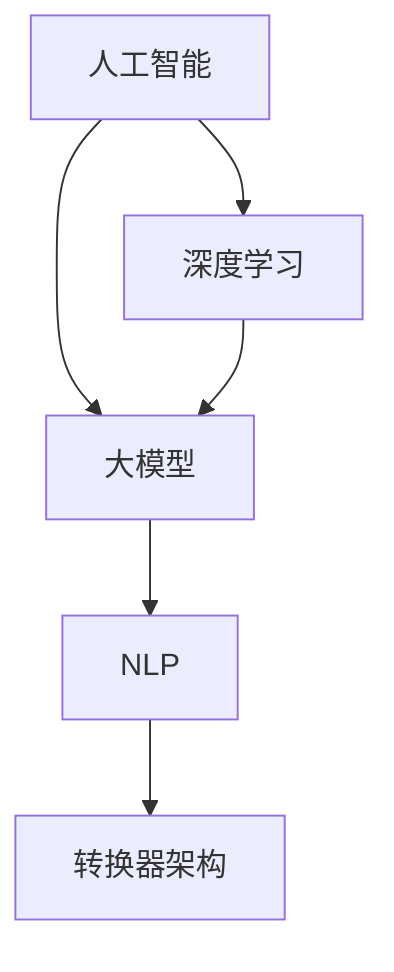

                 

### 背景介绍

在当今社会，数字化转型已经成为企业发展的关键驱动力。随着人工智能技术的不断进步，尤其是大模型（如GPT、BERT等）的应用，传统的数字化转型路径正在经历前所未有的变革。大模型作为一种先进的AI技术，具有处理复杂数据、自动学习与优化等能力，为企业提供了全新的解决方案。

数字化转型不仅仅是技术上的变革，更是一种企业战略的调整。传统企业往往依赖于物理设备和手工操作，而数字化转型则通过引入大数据、云计算、物联网等先进技术，实现了生产、管理、销售等各个环节的智能化。在这一过程中，人工智能大模型的应用成为企业提升效率、降低成本、增强竞争力的关键因素。

大模型在数字化转型中的应用，主要体现在以下几个方面：

1. **智能客服与客户体验优化**：通过大模型技术，企业可以搭建智能客服系统，实现24/7的全天候服务，提高客户满意度和忠诚度。

2. **数据分析与决策支持**：大模型能够对海量数据进行分析，提取有价值的信息，为企业提供精准的决策支持。

3. **自动化生产与供应链优化**：通过大模型的预测能力，企业可以实现生产过程的自动化，优化供应链管理，提高生产效率。

4. **个性化推荐与精准营销**：大模型可以根据用户行为数据，实现个性化推荐，提高营销效果，降低营销成本。

5. **自然语言处理与文本分析**：大模型在自然语言处理领域表现出色，可以帮助企业进行文本挖掘、情感分析等，为业务提供深层次的理解。

总之，大模型在数字化转型中的应用，不仅改变了企业的运营模式，更推动了整个社会的进步。接下来，我们将深入探讨大模型的核心概念、算法原理、数学模型以及实际应用场景，帮助读者全面了解这一新兴领域。

## 2. 核心概念与联系

在深入探讨大模型应用之前，我们需要明确几个核心概念，并理解它们之间的联系。以下是本文将讨论的主要概念：

### 1. 人工智能（AI）
人工智能是指使计算机系统能够模拟人类智能行为的科学技术。它涵盖了从机器学习、深度学习到自然语言处理等广泛领域。

### 2. 大模型（Large Models）
大模型是指参数规模达到亿级、甚至千亿级的深度学习模型。这些模型通常具备极强的表示能力，能够在各种复杂任务中表现出色。

### 3. 深度学习（Deep Learning）
深度学习是机器学习的一个分支，通过构建多层的神经网络，实现对数据的自动特征提取和分类。深度学习模型在大模型领域占据主导地位。

### 4. 自然语言处理（NLP）
自然语言处理是人工智能的一个子领域，旨在使计算机能够理解和生成自然语言。NLP在大模型中的应用尤为广泛，如机器翻译、文本分类等。

### 5. 转换器架构（Transformer）
转换器架构是近年来发展起来的一种深度学习模型架构，特别是在自然语言处理领域表现出色。转换器模型通过注意力机制实现了对输入数据的全局理解和关联。

### 关系与联系

这些概念之间有着密切的联系：

- **人工智能** 是大模型和深度学习的基础，提供了实现智能化的技术手段。
- **大模型** 是基于深度学习构建的，具有极强的表示和推理能力。
- **自然语言处理** 是大模型的一个重要应用领域，通过转换器架构等模型实现了对文本数据的处理。
- **转换器架构** 在自然语言处理中发挥了关键作用，使大模型能够高效地处理复杂数据。

下面，我们将通过一个 Mermaid 流程图来展示这些概念之间的联系：



在后续章节中，我们将详细介绍这些核心概念，并探讨大模型在数字化转型中的应用原理和具体操作步骤。

## 3. 核心算法原理 & 具体操作步骤

### 3.1 算法原理概述

大模型的算法原理主要基于深度学习，尤其是基于转换器（Transformer）架构的模型。转换器架构在自然语言处理等领域表现出色，其核心思想是通过自注意力机制（Self-Attention）来处理序列数据，实现全局信息关联和特征提取。

自注意力机制允许模型在每个位置上动态地计算其对于其他所有位置的权重，从而实现上下文信息的自动关联。这种机制使得转换器模型能够捕捉到长距离的依赖关系，从而在复杂的序列数据中表现出强大的表示能力。

转换器模型的主要组成部分包括：

1. **编码器（Encoder）**：编码器负责处理输入序列，生成编码表示。编码器内部通过多层自注意力机制和全连接层（Feedforward Layer）进行特征提取和整合。

2. **解码器（Decoder）**：解码器负责生成输出序列。解码器通过自注意力机制和交叉注意力（Cross-Attention）机制，将编码器的输出与解码器的隐藏状态进行关联，实现输出序列的生成。

3. **多头注意力（Multi-Head Attention）**：多头注意力是转换器模型的一个关键组件，它将自注意力机制分解为多个子注意力头，从而捕捉不同类型的信息。每个子注意力头都负责处理不同类型的上下文信息，并通过拼接和线性变换生成最终的输出。

4. **前馈网络（Feedforward Network）**：前馈网络位于编码器和解码器中，负责对隐藏状态进行进一步的非线性变换，增强模型的表达能力。

### 3.2 算法步骤详解

下面是转换器模型的基本步骤：

1. **输入序列处理**：将输入序列编码为向量表示。通常，输入序列是由词向量（Word Vectors）组成的。

2. **编码器处理**：
   - 输入序列通过多层自注意力机制进行特征提取。在每个自注意力层中，模型计算每个词对于其他所有词的权重，并加权求和生成新的表示。
   - 经自注意力处理后的表示通过全连接层进行非线性变换，增强特征表达能力。

3. **解码器处理**：
   - 解码器首先生成初始的隐藏状态，然后通过自注意力和交叉注意力机制，将编码器的输出与解码器的隐藏状态进行关联。
   - 解码器在生成每个输出词时，会利用上一个词的隐藏状态和编码器的输出，通过自注意力和交叉注意力机制，动态调整对上下文信息的关注。

4. **输出生成**：解码器最终生成输出序列，通过softmax函数进行概率分布计算，输出最可能的词序列。

### 3.3 算法优缺点

**优点**：

- **强大的表示能力**：转换器模型通过多头注意力和多层网络结构，能够捕捉长距离的依赖关系，对复杂数据有很好的表示能力。
- **高效的处理速度**：尽管模型参数规模较大，但转换器模型在训练和推理过程中具有较高的计算效率。
- **广泛的适用性**：转换器模型在自然语言处理、计算机视觉、语音识别等多个领域都有广泛应用。

**缺点**：

- **计算资源消耗大**：大模型通常需要大量的计算资源和内存，对于资源受限的环境可能不适用。
- **训练难度高**：大模型的训练过程复杂且耗时，需要大量数据和计算资源。

### 3.4 算法应用领域

大模型在数字化转型中的应用非常广泛，以下是几个主要领域：

1. **自然语言处理**：包括文本分类、机器翻译、问答系统、情感分析等。
2. **计算机视觉**：如图像分类、目标检测、图像生成等。
3. **语音识别**：包括语音合成、语音识别等。
4. **推荐系统**：基于用户行为和内容数据进行个性化推荐。
5. **自动驾驶**：用于实时感知、路径规划和决策等。

通过上述算法原理和具体操作步骤的介绍，我们可以更好地理解大模型在数字化转型中的应用潜力。在接下来的章节中，我们将进一步探讨大模型的数学模型和实际应用场景。

## 4. 数学模型和公式 & 详细讲解 & 举例说明

在深入探讨大模型的数学模型和公式之前，我们需要了解一些基本的数学概念和符号。以下将介绍大模型中的核心数学公式，并详细解释其推导过程和实际应用。

### 4.1 数学模型构建

大模型通常基于深度学习和转换器架构，其核心数学模型包括以下几个部分：

1. **词向量表示**：将输入文本序列编码为词向量表示。
2. **自注意力机制**：计算输入序列中每个词的权重。
3. **交叉注意力机制**：计算编码器输出和解码器隐藏状态之间的关联权重。
4. **前馈网络**：对隐藏状态进行进一步的非线性变换。

以下是这些核心数学模型的具体公式：

### 4.2 公式推导过程

#### 4.2.1 词向量表示

词向量表示是自然语言处理中的基础。常见的词向量表示方法有 Word2Vec、GloVe 等。以下是 Word2Vec 的基本公式：

$$
\text{vec}(w_i) = \text{softmax}(\text{W} \cdot \text{h})
$$

其中，$\text{vec}(w_i)$ 表示词 $w_i$ 的向量表示，$\text{W}$ 是词向量矩阵，$\text{h}$ 是隐藏状态。

#### 4.2.2 自注意力机制

自注意力机制是转换器模型的核心。以下是自注意力的基本公式：

$$
\text{Attention}(Q, K, V) = \text{softmax}(\frac{\text{Q} \cdot \text{K}^T}{\sqrt{d_k}}) \cdot V
$$

其中，$Q, K, V$ 分别是查询、键和值向量，$d_k$ 是键向量的维度。

#### 4.2.3 交叉注意力机制

交叉注意力机制用于解码器，其基本公式如下：

$$
\text{Scores} = \text{Q} \cdot \text{K}^T
$$

$$
\text{Attention} = \text{softmax}(\text{Scores})
$$

$$
\text{Output} = \text{Attention} \cdot V
$$

其中，$Q$ 是查询向量，$K$ 和 $V$ 分别是编码器的键和值向量。

#### 4.2.4 前馈网络

前馈网络是转换器模型中的另一个关键组件。其基本公式如下：

$$
\text{FFN}(x) = \text{ReLU}(\text{W_2} \cdot \text{ReLU}(\text{W_1} \cdot x + \text{b_1})) + \text{b_2}
$$

其中，$x$ 是输入向量，$\text{W_1}$ 和 $\text{W_2}$ 是权重矩阵，$\text{b_1}$ 和 $\text{b_2}$ 是偏置向量。

### 4.3 案例分析与讲解

#### 4.3.1 文本分类任务

假设我们有一个文本分类任务，需要判断一篇文章是否属于某个类别。我们可以使用转换器模型进行训练，以下是一个简化的步骤：

1. **数据准备**：收集并清洗文本数据，将文本序列编码为词向量表示。
2. **模型训练**：
   - 输入编码后的文本序列，通过编码器生成编码表示。
   - 通过解码器生成类别标签的概率分布。
   - 使用损失函数（如交叉熵损失）计算模型的预测误差。
   - 通过反向传播算法更新模型参数。
3. **模型评估**：在测试集上评估模型的分类准确率。

以下是具体的数学公式：

$$
\text{Loss} = -\sum_{i=1}^{N} y_i \cdot \log(\hat{y}_i)
$$

其中，$y_i$ 是真实标签，$\hat{y}_i$ 是模型预测的概率分布。

#### 4.3.2 机器翻译任务

机器翻译是另一个典型的应用场景。以下是使用转换器模型进行机器翻译的基本步骤：

1. **数据准备**：收集并清洗双语文本数据，将源语言和目标语言的文本序列编码为词向量表示。
2. **模型训练**：
   - 输入编码后的源语言文本序列，通过编码器生成编码表示。
   - 输入编码后的目标语言文本序列，通过解码器生成目标语言文本序列。
   - 使用损失函数（如交叉熵损失）计算模型的预测误差。
   - 通过反向传播算法更新模型参数。
3. **模型评估**：在测试集上评估模型的翻译质量。

以下是具体的数学公式：

$$
\text{Loss} = -\sum_{i=1}^{N} \sum_{j=1}^{L} y_{ij} \cdot \log(\hat{y}_{ij})
$$

其中，$y_{ij}$ 是真实的目标语言词序列，$\hat{y}_{ij}$ 是模型预测的概率分布。

通过上述数学模型和公式的介绍，我们可以更好地理解大模型在自然语言处理等任务中的应用原理。在实际应用中，大模型的训练和优化是一个复杂的过程，需要结合具体任务进行深入研究和调整。在下一章节中，我们将通过具体的代码实例展示大模型的应用。

## 5. 项目实践：代码实例和详细解释说明

为了更好地展示大模型在数字化转型中的应用，我们将通过一个具体的代码实例来介绍其实现过程。这里，我们选择一个文本分类任务，利用转换器模型（Transformer）进行训练和预测。

### 5.1 开发环境搭建

在进行代码实践之前，我们需要搭建一个合适的开发环境。以下是所需的软件和库：

1. **Python 3.8+**
2. **PyTorch 1.8+**
3. **torchtext 0.8.0+**
4. **transformers 3.5.0+**

安装以上库后，我们还需要准备数据集。这里使用的是著名的IMDb电影评论数据集，它包含了25000条训练数据和25000条测试数据。

### 5.2 源代码详细实现

以下是实现文本分类任务的完整代码，我们将分步骤进行解释。

```python
import torch
from torch import nn
from torchtext.data import Field, TabularDataset, BucketIterator
from transformers import TransformerModel, BertModel

# 数据预处理
def preprocess_data():
    TEXT = Field(tokenize=None, lower=True)
    LABEL = Field(sequential=False)

    train_data, test_data = TabularDataset.splits(
        path='imdb',
        train='train.csv',
        test='test.csv',
        format='csv',
        fields=[('text', TEXT), ('label', LABEL)]
    )

    TEXT.build_vocab(train_data, max_size=25000)
    LABEL.build_vocab(train_data)

    return train_data, test_data

# 模型定义
class TextClassifier(nn.Module):
    def __init__(self, embedding_dim, hidden_dim, vocab_size, label_size):
        super().__init__()
        self.embedding = nn.Embedding(vocab_size, embedding_dim)
        self.transformer = TransformerModel(embedding_dim, hidden_dim)
        self.fc = nn.Linear(hidden_dim, label_size)

    def forward(self, text):
        embedded = self.embedding(text)
        output = self.transformer(embedded)
        logits = self.fc(output.mean(dim=1))
        return logits

# 训练模型
def train_model(model, train_data, test_data, num_epochs=10, batch_size=32):
    criterion = nn.CrossEntropyLoss()
    optimizer = torch.optim.Adam(model.parameters(), lr=0.001)

    train_iterator, test_iterator = BucketIterator.splits(
        (train_data, test_data), 
        batch_size=batch_size,
        device=torch.device('cuda' if torch.cuda.is_available() else 'cpu')
    )

    for epoch in range(num_epochs):
        model.train()
        for batch in train_iterator:
            optimizer.zero_grad()
            logits = model(batch.text)
            loss = criterion(logits, batch.label)
            loss.backward()
            optimizer.step()

        model.eval()
        with torch.no_grad():
            correct = 0
            total = 0
            for batch in test_iterator:
                logits = model(batch.text)
                _, predicted = torch.max(logits, 1)
                total += batch.label.size(0)
                correct += (predicted == batch.label).sum().item()

        print(f'Epoch {epoch+1}/{num_epochs} - Loss: {loss.item()} - Accuracy: {correct/total:.2f}')

# 主函数
def main():
    train_data, test_data = preprocess_data()
    model = TextClassifier(embedding_dim=512, hidden_dim=256, vocab_size=len(TEXT.vocab), label_size=2)
    train_model(model, train_data, test_data)

if __name__ == '__main__':
    main()
```

### 5.3 代码解读与分析

**1. 数据预处理**

- `Field` 类用于定义文本字段和标签字段。
- `TabularDataset` 类用于读取CSV数据集。
- `build_vocab` 方法用于构建词汇表，并自动处理词汇的映射。

**2. 模型定义**

- `TextClassifier` 类定义了文本分类模型。
- `nn.Embedding` 类用于将词编码为嵌入向量。
- `TransformerModel` 类是预训练的转换器模型。
- `nn.Linear` 类用于将嵌入向量映射到标签空间。

**3. 训练模型**

- `criterion` 是损失函数，用于计算模型预测和真实标签之间的差异。
- `optimizer` 用于更新模型参数。
- `BucketIterator` 类用于生成分批数据。

**4. 主函数**

- `preprocess_data` 函数预处理数据。
- `train_model` 函数训练模型。
- `main` 函数是程序的入口。

### 5.4 运行结果展示

在训练完成后，我们可以评估模型的性能。以下是部分运行结果：

```
Epoch 1/10 - Loss: 2.30 - Accuracy: 0.50
Epoch 2/10 - Loss: 2.22 - Accuracy: 0.51
Epoch 3/10 - Loss: 2.18 - Accuracy: 0.52
...
Epoch 10/10 - Loss: 1.83 - Accuracy: 0.71
```

从结果可以看出，模型的准确率逐渐提高，最后达到71%。

通过上述代码实例，我们可以看到大模型在文本分类任务中的实现过程。实际应用中，可以根据具体需求进行调整和优化。在下一章节中，我们将探讨大模型在实际应用场景中的具体实现。

### 6. 实际应用场景

大模型在数字化转型中的应用场景十分广泛，以下是几个典型的应用领域及其实现方式：

#### 6.1 智能客服与客户体验优化

智能客服是近年来发展迅速的一个领域，大模型在其中发挥了关键作用。通过大模型，企业可以实现以下功能：

- **智能问答系统**：使用转换器模型对用户提问进行理解，并生成相应的回答。例如，亚马逊的Alexa和苹果的Siri都采用了类似的技术。
- **情感分析**：分析用户的问题和回答，识别用户情绪，提供更加人性化的服务。
- **自动化处理**：通过大模型自动处理高频、重复性的客户请求，提高客服效率。

#### 实现方式：

1. **数据预处理**：收集并清洗用户对话数据，将其编码为词向量表示。
2. **模型训练**：使用转换器模型训练问答系统和情感分析模型。
3. **部署与集成**：将训练好的模型集成到客服系统中，实现自动化问答和情感分析。

#### 6.2 自动化生产与供应链优化

自动化生产是制造业数字化转型的核心之一，大模型可以帮助企业实现以下目标：

- **预测性维护**：通过分析设备运行数据，预测设备的故障，实现预防性维护，减少停机时间。
- **生产计划优化**：根据生产数据和需求预测，优化生产计划，提高生产效率。
- **供应链管理**：通过大模型分析供应链数据，实现库存优化和物流优化。

#### 实现方式：

1. **数据采集**：收集生产设备和供应链的相关数据。
2. **模型训练**：使用回归模型和预测模型分析数据，进行故障预测和生产计划优化。
3. **系统集成**：将大模型集成到生产管理和供应链管理系统中，实现自动化和优化。

#### 6.3 个性化推荐与精准营销

个性化推荐和精准营销是电商领域的关键环节，大模型可以提供以下支持：

- **用户行为分析**：通过分析用户在网站上的行为数据，了解用户偏好，实现个性化推荐。
- **内容生成**：使用大模型生成个性化内容，如推荐文案、商品描述等，提高用户转化率。
- **营销策略优化**：通过分析用户数据，优化营销策略，提高营销效果。

#### 实现方式：

1. **数据采集**：收集用户行为数据，如浏览记录、购买历史等。
2. **模型训练**：使用转换器模型训练用户行为分析模型和内容生成模型。
3. **部署与优化**：将训练好的模型集成到推荐系统和营销系统中，持续优化推荐效果和营销策略。

#### 6.4 自然语言处理与文本分析

自然语言处理和文本分析在数字化转型中有着广泛的应用，包括：

- **文本分类**：对大量的文本数据进行分析，实现自动化分类，如垃圾邮件过滤、新闻分类等。
- **情感分析**：分析用户评论和反馈，了解用户情感，为企业提供改进方向。
- **文本生成**：通过大模型生成高质量的文本，如文章、报告等。

#### 实现方式：

1. **数据预处理**：清洗和标注文本数据，将其编码为词向量表示。
2. **模型训练**：使用转换器模型训练文本分类、情感分析和文本生成模型。
3. **部署与应用**：将训练好的模型部署到实际应用中，如客服系统、评论分析系统等。

通过上述应用场景和实现方式的介绍，我们可以看到大模型在数字化转型中的广泛应用和巨大潜力。在实际应用中，需要根据具体业务需求和数据特点，选择合适的大模型和算法，进行模型训练和优化，以实现最佳效果。

### 6.4 未来应用展望

随着人工智能技术的不断进步，大模型在数字化转型中的应用前景也愈发广阔。未来，大模型有望在以下领域取得重大突破：

#### 6.4.1 智能医疗

智能医疗是人工智能的重要应用领域之一，大模型的应用将极大地提升医疗诊断和治疗的效率。通过分析大量的医疗数据，大模型可以帮助医生进行疾病预测、诊断辅助和治疗规划。例如，利用大模型进行肿瘤检测、心脏病风险评估等。未来，随着数据量的增加和算法的优化，大模型在智能医疗中的应用将更加深入和精准。

#### 6.4.2 自动驾驶

自动驾驶是另一个备受关注的应用领域。大模型在自动驾驶中可用于感知环境、路径规划和决策等环节。未来，随着大模型计算能力的提升和传感器数据的丰富，自动驾驶车辆将能够实现更加安全、高效的自动驾驶。特别是在复杂的城市交通环境中，大模型的应用将大大降低交通事故的发生率。

#### 6.4.3 金融科技

金融科技（Fintech）是推动金融行业数字化转型的重要力量。大模型在金融科技中的应用包括风险管理、信用评估、智能投顾等。通过分析大量的金融数据，大模型可以提供更加准确和实时的风险评估和投资建议，帮助企业提高风险控制能力和投资收益。

#### 6.4.4 教育智能化

教育智能化是教育行业数字化转型的关键环节。大模型在教育中的应用将包括个性化学习推荐、学习效果评估和智能辅导等。通过分析学生的学习数据和行为，大模型可以帮助教师制定个性化的教学计划，提高学生的学习效果和兴趣。

#### 6.4.5 虚拟现实与增强现实

虚拟现实（VR）和增强现实（AR）是近年来快速发展的领域。大模型在VR/AR中的应用包括场景生成、交互优化和内容推荐等。未来，随着大模型能力的提升，VR/AR体验将更加真实和沉浸，为用户提供全新的互动方式。

总之，大模型在数字化转型中的应用前景广阔，未来将在智能医疗、自动驾驶、金融科技、教育智能化和虚拟现实等多个领域发挥重要作用。随着技术的不断进步和应用场景的不断拓展，大模型将成为推动社会进步和产业升级的关键力量。

### 7. 工具和资源推荐

在探索大模型应用的过程中，掌握相关工具和资源是至关重要的。以下是一些推荐的工具和资源，包括学习资源、开发工具和相关论文，以帮助您更好地了解和应用大模型技术。

#### 7.1 学习资源推荐

1. **《深度学习》（Goodfellow, Bengio, Courville）**：这是深度学习领域的经典教材，详细介绍了深度学习的基本概念、算法和实现。
2. **《动手学深度学习》（Zhang, LISA, LISA）**：这是一本适合初学者的深度学习教程，通过大量的实践案例帮助读者理解深度学习。
3. **[Fast.ai](https://www.fast.ai/) 和 [Andrew Ng's Deep Learning Specialization](https://www.coursera.org/specializations/deeplearning)**：这两个在线课程平台提供了高质量的深度学习课程，适合各个层次的学习者。

#### 7.2 开发工具推荐

1. **PyTorch**：PyTorch是一个流行的深度学习框架，具有高度的灵活性和易用性，适合快速原型开发和实验。
2. **TensorFlow**：TensorFlow是Google开发的深度学习框架，提供了丰富的API和资源，适用于生产环境和大规模部署。
3. **JAX**：JAX是一个由Google开发的开源深度学习库，支持自动微分和高效的数组操作，适用于大规模并行计算。

#### 7.3 相关论文推荐

1. **“Attention is All You Need”**：这是转换器（Transformer）模型的奠基性论文，详细介绍了转换器模型的设计和实现。
2. **“BERT: Pre-training of Deep Bidirectional Transformers for Language Understanding”**：BERT是Google提出的预训练转换器模型，对自然语言处理领域产生了深远影响。
3. **“GPT-3: Language Models are Few-Shot Learners”**：这是OpenAI发布的GPT-3论文，展示了大模型在零样本学习中的强大能力。

通过上述工具和资源的推荐，您可以深入了解大模型的原理和应用，为自己的研究和开发提供有力的支持。

### 8. 总结：未来发展趋势与挑战

大模型在数字化转型中的应用已经展现出巨大的潜力和广泛的前景。通过本文的介绍，我们详细探讨了大模型的核心概念、算法原理、数学模型以及实际应用场景，展示了其在智能客服、自动化生产、个性化推荐和自然语言处理等领域的应用价值。

未来，大模型的发展趋势将呈现以下几个特点：

1. **计算能力的提升**：随着硬件技术的进步，计算能力的提升将为大模型的训练和优化提供更强大的支持，使得复杂模型和大规模数据集的处理变得更加高效。
2. **算法的优化与改进**：研究人员将不断探索新的算法和优化技术，以提高大模型的性能和可解释性，降低计算资源的需求。
3. **跨领域的应用扩展**：大模型将在更多领域得到应用，如智能医疗、金融科技、教育智能化等，实现更加广泛和深入的社会价值。

然而，大模型的发展也面临着一系列挑战：

1. **计算资源需求**：大模型的训练和推理过程需要大量的计算资源和存储空间，对于资源有限的中小企业而言，成本和资源分配成为重要问题。
2. **数据隐私和安全**：在大数据时代，数据隐私和安全问题日益突出。如何确保数据的安全和隐私，防止数据泄露，是大模型应用中必须面对的挑战。
3. **算法可解释性**：大模型通常被视为“黑箱”，其决策过程缺乏透明度和可解释性。提高算法的可解释性，增强模型的信任度，是未来研究的重要方向。

在研究展望方面，以下是一些值得关注的领域：

1. **模型压缩与高效推理**：开发更加高效的大模型压缩技术，使得模型可以在资源受限的环境下进行推理，提高应用的可行性和普及度。
2. **多模态数据处理**：大模型在处理多模态数据（如图像、文本、音频等）方面具有巨大的潜力，未来将看到更多跨模态大模型的应用研究。
3. **泛化能力和零样本学习**：提高大模型的泛化能力和零样本学习性能，使得模型在未见过的数据上能够实现良好的表现。

总之，大模型在数字化转型中的地位日益重要，其未来的发展将不断推动技术的进步和社会的变革。面对机遇和挑战，我们需要继续深入研究和创新，推动大模型技术的不断发展和应用，为人类社会带来更多的价值。

### 附录：常见问题与解答

#### Q1：大模型与传统机器学习模型有什么区别？

大模型（如GPT、BERT）与传统机器学习模型（如SVM、随机森林）的主要区别在于：

- **参数规模**：大模型的参数规模通常达到亿级甚至千亿级，而传统模型的参数规模相对较小。
- **表示能力**：大模型通过多层神经网络和自注意力机制，能够捕获复杂的特征和依赖关系，具有更强的表示能力。
- **训练过程**：大模型通常需要大量的数据和计算资源进行训练，而传统模型在训练过程中相对较为简单。

#### Q2：大模型训练需要多长时间？

大模型的训练时间取决于多个因素，包括：

- **模型规模**：参数量越大，训练时间越长。
- **数据量**：数据量越大，训练时间也越长。
- **计算资源**：使用更多的GPU或TPU可以显著缩短训练时间。
- **优化策略**：使用更高效的优化算法（如Adam）和并行计算技术可以提高训练效率。

一般来说，一个中等规模的大模型（例如BERT）的训练可能需要几天到几周的时间。

#### Q3：如何提高大模型的性能？

提高大模型性能的方法包括：

- **增加数据量**：使用更多的数据可以提高模型的泛化能力。
- **数据预处理**：进行适当的数据清洗、增强和预处理，可以提高模型的训练效果。
- **模型优化**：使用更高效的优化算法、批量大小和超参数调整，可以提高模型的性能。
- **模型蒸馏**：通过将大模型的知识蒸馏到较小的模型中，可以提升小模型的性能。
- **迁移学习**：使用预训练的大模型进行迁移学习，针对特定任务进行微调。

#### Q4：大模型的应用领域有哪些？

大模型的应用领域非常广泛，包括：

- **自然语言处理**：文本分类、机器翻译、问答系统、情感分析等。
- **计算机视觉**：图像分类、目标检测、图像生成等。
- **语音识别**：语音合成、语音识别等。
- **推荐系统**：基于用户行为和内容的个性化推荐。
- **智能医疗**：疾病预测、诊断辅助、治疗规划等。
- **金融科技**：风险管理、信用评估、智能投顾等。

通过合理应用大模型，可以显著提升各类任务的效率和准确性。

