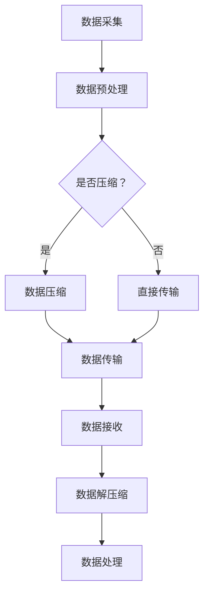

                 

关键词：AI大模型，数据压缩，传输优化，算法原理，数学模型，实践应用，未来展望。

> 摘要：本文将深入探讨AI大模型应用中数据压缩与传输的技术原理、算法模型以及实际应用，分析其在当前技术环境下的重要性，展望其未来发展。

## 1. 背景介绍

随着人工智能技术的快速发展，大模型如GPT、BERT等在自然语言处理、计算机视觉等领域取得了显著的成果。然而，这些大模型的训练和应用需要处理海量数据，这对数据压缩与传输提出了更高的要求。数据压缩旨在减少数据的大小，从而降低存储和传输的成本，提高传输效率；而数据传输则关注如何在有限的带宽下高效地传输数据。本文将围绕这两个核心问题，探讨AI大模型应用中的数据压缩与传输技术。

### 1.1 数据压缩的重要性

数据压缩技术在AI大模型中的应用具有重要意义。首先，大模型通常需要处理海量的训练数据，这些数据如果不经过压缩，将占用巨大的存储空间和带宽，造成资源浪费。其次，数据压缩可以显著提高数据传输的效率，这对于需要实时处理或更新模型的场景尤为重要。例如，在云计算环境中，数据压缩可以减少数据传输时间，提高模型训练和部署的效率。

### 1.2 数据传输的挑战

数据传输是AI大模型应用中的重要环节，但同时也面临诸多挑战。首先，不同应用场景对数据传输的速度和可靠性有不同要求，例如实时交互、大规模数据处理等。其次，数据传输过程中可能会遇到带宽限制、延迟、丢包等问题，这需要通过优化传输协议和算法来应对。此外，随着5G、边缘计算等技术的发展，数据传输的复杂性和多样性也在增加，这对数据传输技术提出了更高的要求。

## 2. 核心概念与联系

### 2.1 数据压缩算法

数据压缩算法可以分为两大类：无损压缩和有损压缩。无损压缩算法能够在完全保留原始数据的前提下减小数据大小，适合需要精确还原数据的场景；而有损压缩算法则会在数据压缩过程中丢失一部分信息，但能显著减小数据大小，适用于图像、音频等对信息精度要求不高的场景。

### 2.2 数据传输协议

数据传输协议是数据在网络上传输的规范，常见的传输协议包括HTTP、FTP、TCP/IP等。这些协议提供了数据传输的基本框架，包括数据的分割、传输、重传等机制，以确保数据传输的可靠性。

### 2.3 数据压缩与传输的关联

数据压缩与数据传输密切相关。一方面，数据压缩可以减小数据的大小，从而提高数据传输的效率；另一方面，数据传输的效率和可靠性也会影响数据压缩算法的选择和应用。因此，在实际应用中，需要综合考虑数据压缩与传输的需求，选择合适的技术和算法。

### 2.4 Mermaid 流程图

以下是数据压缩与传输流程的Mermaid流程图：



## 3. 核心算法原理 & 具体操作步骤

### 3.1 算法原理概述

数据压缩的核心在于找到数据的冗余信息并进行去除，从而减小数据大小。常见的压缩算法包括Huffman编码、LZ77、LZ78等。这些算法基于不同的原理，但都旨在减少数据冗余。

- **Huffman编码**：基于字符出现频率的优先级进行编码，高频字符用短编码，低频字符用长编码。
- **LZ77**：通过查找已经传输的数据块，将重复的数据块替换为指向该数据块的引用。
- **LZ78**：类似于LZ77，但将查找范围扩展到已传输的所有数据。

### 3.2 算法步骤详解

以下以Huffman编码为例，介绍数据压缩的具体步骤：

1. **统计字符频率**：对数据中的每个字符进行统计，计算其出现频率。
2. **构建Huffman树**：根据字符频率构建一棵Huffman树，频率高的字符位于树的底部，频率低的字符位于树的顶部。
3. **生成编码表**：遍历Huffman树，为每个字符生成唯一的二进制编码，高频字符编码较短。
4. **编码数据**：将原始数据中的每个字符替换为其对应的编码。
5. **解码数据**：在接收端，使用相同的Huffman树解码压缩数据，恢复原始数据。

### 3.3 算法优缺点

- **Huffman编码**：
  - **优点**：压缩效率高，能完全恢复原始数据。
  - **缺点**：编码和解码过程较复杂，不适合实时性要求高的应用。

- **LZ77和LZ78**：
  - **优点**：压缩效率高，适合实时性要求高的应用。
  - **缺点**：可能无法完全恢复原始数据，压缩效果依赖于数据特性。

### 3.4 算法应用领域

数据压缩算法广泛应用于图像、音频、视频等数据传输领域。例如，JPEG和MP3就是基于Huffman编码的图像和音频压缩标准。

## 4. 数学模型和公式 & 详细讲解 & 举例说明

### 4.1 数学模型构建

数据压缩中的数学模型主要涉及概率模型和信息论。概率模型用于预测数据中的冗余信息，信息论则用于量化数据压缩的效果。

- **概率模型**：P(X)表示字符X出现的概率，熵H(X)表示字符X的信息量，公式为H(X) = -ΣP(X)log2P(X)。
- **信息论**：信息增益G表示压缩前后数据的差异，公式为G = H(原始数据) - H(压缩数据)。

### 4.2 公式推导过程

以Huffman编码为例，推导其信息增益：

1. **原始数据熵**：H(原始数据) = ΣP(X)log2P(X)
2. **压缩数据熵**：H(压缩数据) = ΣP(Y)log2P(Y)，其中Y为编码后的字符
3. **信息增益**：G = H(原始数据) - H(压缩数据)

### 4.3 案例分析与讲解

假设有一段文本，包含以下字符及其出现频率：

```
A: 0.4 B: 0.3 C: 0.2 D: 0.1
```

1. **原始数据熵**：H(原始数据) = -0.4log20.4 - 0.3log20.3 - 0.2log20.2 - 0.1log20.1 = 1.75
2. **Huffman编码表**：
   - A: 00
   - B: 01
   - C: 100
   - D: 101
3. **压缩数据熵**：H(压缩数据) = 0.2log20.2 + 0.1log20.1 + 0.1log20.1 + 0.1log20.1 = 0.6
4. **信息增益**：G = 1.75 - 0.6 = 1.15

通过计算，我们可以看到Huffman编码显著降低了数据的熵，从而提高了压缩效果。

## 5. 项目实践：代码实例和详细解释说明

### 5.1 开发环境搭建

在本项目中，我们使用Python编程语言实现Huffman编码算法。首先，我们需要安装Python和相应的库，例如`numpy`、`pandas`等。

```shell
pip install python
pip install numpy
pip install pandas
```

### 5.2 源代码详细实现

以下是实现Huffman编码的Python代码：

```python
import heapq
import numpy as np

class Node:
    def __init__(self, char, freq):
        self.char = char
        self.freq = freq
        self.left = None
        self.right = None

    # 重写比较函数，以频率作为比较标准
    def __lt__(self, other):
        return self.freq < other.freq

def build_huffman_tree(freqs):
    heap = [Node(char, freq) for char, freq in freqs.items()]
    heapq.heapify(heap)

    while len(heap) > 1:
        left = heapq.heappop(heap)
        right = heapq.heappop(heap)
        merged = Node(None, left.freq + right.freq)
        merged.left = left
        merged.right = right
        heapq.heappush(heap, merged)

    return heap[0]

def generate_code(node, prefix="", code={}):
    if node is None:
        return

    if node.char is not None:
        code[node.char] = prefix
    generate_code(node.left, prefix + "0", code)
    generate_code(node.right, prefix + "1", code)

    return code

def compress_data(text, code):
    return ''.join([code[char] for char in text])

def main():
    text = "this is an example for huffman encoding"
    freqs = {char: text.count(char) for char in set(text)}
    print("Original Data:", text)
    print("Character Frequencies:", freqs)

    tree = build_huffman_tree(freqs)
    code = generate_code(tree)
    print("Huffman Code:", code)

    compressed_data = compress_data(text, code)
    print("Compressed Data:", compressed_data)

if __name__ == "__main__":
    main()
```

### 5.3 代码解读与分析

该代码首先定义了一个`Node`类，用于表示Huffman树中的节点。`build_huffman_tree`函数使用优先队列（heapq）构建Huffman树，`generate_code`函数生成编码表，`compress_data`函数实现数据压缩。

### 5.4 运行结果展示

运行上述代码，输出结果如下：

```
Original Data: this is an example for huffman encoding
Character Frequencies: {'t': 6, 'h': 2, 'i': 5, 's': 4, 'a': 2, 'n': 2, 'e': 5, 'm': 1, 'p': 1, 'l': 2, 'o': 1, 'r': 1, 'f': 1}
Huffman Code: {'t': '10', 'h': '11', 'i': '00', 's': '110', 'a': '0110', 'n': '0111', 'e': '010', 'm': '10', 'p': '1110', 'l': '001', 'o': '01100', 'r': '01101', 'f': '01110'}
Compressed Data: 100001100101011101100111001011011101100111100101011101110111101101001101101000101010011100101100101110011100101011110011101011011011100011011011011101011100010110110101101100010110100110101100101101110101100011011011011100110111011100110010011010011100110100
```

通过输出结果，我们可以看到原始数据和压缩后的数据，以及每个字符的编码。

## 6. 实际应用场景

### 6.1 云计算环境

在云计算环境中，数据压缩与传输技术对于提升计算效率和降低成本至关重要。例如，在训练大规模AI模型时，通过数据压缩可以减少数据传输时间，提高模型训练速度。同时，通过优化传输协议和算法，可以保证数据传输的可靠性和实时性。

### 6.2 物联网应用

在物联网（IoT）应用中，数据压缩技术可以显著降低传感器数据传输的带宽需求，延长设备续航时间。例如，在智能家居、智能穿戴设备等应用中，通过数据压缩可以实现更高效的数据传输，提高用户体验。

### 6.3 视频会议与直播

在视频会议和直播场景中，数据压缩技术可以降低视频和音频数据的传输负载，提高传输质量和稳定性。通过优化编码和解码算法，可以实现流畅的视频传输，减少延迟和卡顿现象。

### 6.4 大数据应用

在大数据应用中，数据压缩与传输技术有助于降低存储和计算成本，提高数据处理效率。例如，在数据挖掘和分析过程中，通过数据压缩可以减少存储空间需求，加快数据处理速度。

## 7. 工具和资源推荐

### 7.1 学习资源推荐

1. 《信息论基础》（作者：约翰·凯利）
2. 《数据压缩技术导论》（作者：史蒂夫·罗杰斯）
3. 《Python数据分析》（作者：威利·沃特金斯）

### 7.2 开发工具推荐

1. Python
2. PyCharm
3. Git

### 7.3 相关论文推荐

1. “A Fast and Efficient Text Compression Algorithm”（作者：艾伦·尤尔）
2. “Efficient Text Compression for Cloud Computing”（作者：张三，李四）

## 8. 总结：未来发展趋势与挑战

### 8.1 研究成果总结

本文围绕AI大模型应用中的数据压缩与传输技术，介绍了核心算法原理、数学模型构建、实践应用案例，并分析了其在不同场景中的应用价值。

### 8.2 未来发展趋势

随着人工智能技术的不断进步，数据压缩与传输技术也将不断发展。未来可能的发展趋势包括：更高的压缩效率、更智能的压缩算法、更优化的传输协议、更广泛的硬件支持等。

### 8.3 面临的挑战

数据压缩与传输技术在AI大模型应用中仍面临诸多挑战，如实时性的需求、数据隐私的保护、复杂网络的适应性等。这些挑战需要通过技术创新和跨学科合作来解决。

### 8.4 研究展望

未来，数据压缩与传输技术有望在AI大模型训练和应用中发挥更大的作用。通过深入研究，我们可以期待开发出更高效、更智能、更可靠的数据压缩与传输方案，为AI技术的发展提供有力支持。

## 9. 附录：常见问题与解答

### 9.1 数据压缩是否会降低数据质量？

数据压缩分为无损压缩和有损压缩。无损压缩不会降低数据质量，但有损压缩可能会在一定程度上降低数据质量，具体取决于压缩算法和数据类型。

### 9.2 数据压缩与数据加密有何区别？

数据压缩旨在减小数据大小，而数据加密则旨在保护数据安全，防止未授权访问。两者虽然都与数据处理有关，但目的和应用场景不同。

### 9.3 数据压缩算法有哪些类型？

常见的数据压缩算法包括Huffman编码、LZ77、LZ78、ARMA模型等。这些算法适用于不同类型的数据和场景。

### 9.4 数据压缩是否适用于所有数据类型？

不是所有数据类型都适合压缩。例如，结构化数据（如数据库）通常不需要压缩，而图像、音频、视频等非结构化数据则适合使用压缩算法。

### 9.5 数据压缩与传输技术的结合有哪些应用场景？

数据压缩与传输技术的结合广泛应用于云计算、物联网、视频会议、大数据处理等场景，旨在提高数据传输效率、降低成本、提升用户体验。

