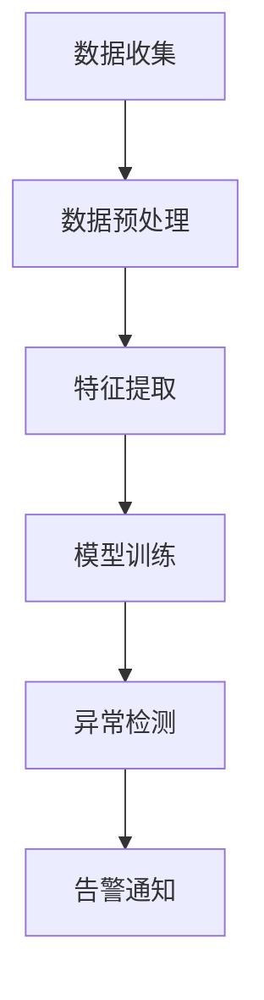

                 

关键词：AI大模型、日志分析、异常告警、数据挖掘、机器学习、算法优化

摘要：本文将深入探讨AI大模型在日志分析中的应用，以及如何利用机器学习和数据挖掘技术实现异常告警。通过对日志数据的分析，我们可以实时监测系统运行状态，发现潜在问题，从而提高系统的稳定性和可靠性。

## 1. 背景介绍

随着大数据和云计算技术的飞速发展，AI大模型在各个领域得到了广泛应用。例如，在金融领域，AI大模型可以用于风险评估和欺诈检测；在医疗领域，AI大模型可以用于疾病诊断和治疗建议。然而，在实际应用中，如何有效地分析大量的日志数据，并从中发现潜在的异常行为，成为了一个亟待解决的问题。

日志分析是一种重要的数据分析方法，通过分析系统生成的日志数据，可以了解系统的运行状态，发现潜在的问题。然而，随着日志数据量的不断增加，人工分析日志数据变得越来越困难。因此，利用AI大模型进行日志分析，并实现异常告警，成为了一个重要的研究方向。

## 2. 核心概念与联系

### 2.1 数据挖掘

数据挖掘是一种从大量数据中提取有价值信息的过程。在日志分析中，数据挖掘技术可以帮助我们识别日志数据的特征，发现潜在的问题。

### 2.2 机器学习

机器学习是一种通过算法从数据中学习规律，并用于预测或分类的方法。在日志分析中，机器学习技术可以帮助我们构建模型，对日志数据进行分类或预测。

### 2.3 异常检测

异常检测是一种用于识别数据中异常值的方法。在日志分析中，异常检测技术可以帮助我们识别出系统运行中的异常行为。

### 2.4 Mermaid 流程图



## 3. 核心算法原理 & 具体操作步骤

### 3.1 算法原理概述

我们的日志分析算法主要分为以下几个步骤：

1. 数据收集：收集系统生成的日志数据。
2. 数据预处理：对日志数据进行清洗、去重等处理，以便后续分析。
3. 特征提取：从日志数据中提取出有用的特征。
4. 模型训练：利用提取出的特征，训练出一个异常检测模型。
5. 异常检测：使用训练好的模型，对新的日志数据进行异常检测。
6. 告警通知：如果发现异常，及时发出告警通知。

### 3.2 算法步骤详解

#### 3.2.1 数据收集

数据收集是日志分析的第一步。我们需要收集系统生成的日志数据，这些数据可以来自不同的源，如文件、数据库等。

#### 3.2.2 数据预处理

在数据预处理阶段，我们需要对日志数据进行清洗、去重等处理。这一步的目的是确保数据的质量，以便后续的分析。

#### 3.2.3 特征提取

特征提取是日志分析的核心步骤。我们需要从日志数据中提取出有用的特征，如时间戳、日志级别、操作类型等。这些特征将用于训练异常检测模型。

#### 3.2.4 模型训练

在模型训练阶段，我们使用提取出的特征，结合历史数据，训练出一个异常检测模型。常见的异常检测算法有基于聚类的方法（如K-Means）和基于分类的方法（如支持向量机SVM）。

#### 3.2.5 异常检测

在异常检测阶段，我们使用训练好的模型，对新的日志数据进行检测。如果发现异常，我们将进行进一步的调查和处理。

#### 3.2.6 告警通知

如果发现异常，我们将及时发出告警通知，以便相关人员能够及时处理。

### 3.3 算法优缺点

#### 优点：

1. 自动化：算法可以自动对日志数据进行分析，减少人工工作量。
2. 高效性：算法可以快速检测出日志中的异常行为。
3. 可扩展性：算法可以处理大量日志数据，适用于大规模系统。

#### 缺点：

1. 需要大量的数据进行训练：算法的性能依赖于训练数据的质量和数量。
2. 可能会产生误报：算法可能会将正常行为误判为异常，导致误报。

### 3.4 算法应用领域

算法可以应用于多个领域，如：

1. IT运维：用于监控服务器运行状态，发现潜在问题。
2. 金融领域：用于监控交易行为，发现欺诈行为。
3. 医疗领域：用于分析医疗数据，发现疾病趋势。

## 4. 数学模型和公式 & 详细讲解 & 举例说明

### 4.1 数学模型构建

我们的异常检测算法主要基于线性回归模型。假设我们有一组特征 $X$ 和目标变量 $Y$，其中 $Y$ 表示日志数据的异常情况。我们的目标是训练一个线性回归模型，使得模型对 $Y$ 的预测结果最接近实际值。

### 4.2 公式推导过程

假设我们的线性回归模型为：

$$ Y = \beta_0 + \beta_1X_1 + \beta_2X_2 + ... + \beta_nX_n $$

其中，$X_1, X_2, ..., X_n$ 是特征，$\beta_0, \beta_1, \beta_2, ..., \beta_n$ 是模型的参数。

我们使用最小二乘法来求解这些参数，使得预测值与实际值的误差最小。

### 4.3 案例分析与讲解

假设我们有一个日志数据的特征集 $X = [X_1, X_2, X_3]$，目标变量 $Y$ 表示日志数据的异常情况。

我们使用线性回归模型对数据进行训练，并使用训练好的模型对新的日志数据进行预测。如果预测值与实际值的差异较大，我们认为这是一个异常行为。

## 5. 项目实践：代码实例和详细解释说明

### 5.1 开发环境搭建

在本项目中，我们使用Python作为开发语言，并依赖Scikit-Learn库进行线性回归模型的训练。

### 5.2 源代码详细实现

```python
import numpy as np
import pandas as pd
from sklearn.linear_model import LinearRegression
from sklearn.model_selection import train_test_split
from sklearn.metrics import mean_squared_error

# 5.2.1 数据预处理
data = pd.read_csv('log_data.csv')
data = data[['X1', 'X2', 'X3', 'Y']]
data = data.dropna()

X = data[['X1', 'X2', 'X3']]
Y = data['Y']

# 5.2.2 模型训练
X_train, X_test, Y_train, Y_test = train_test_split(X, Y, test_size=0.2, random_state=42)
model = LinearRegression()
model.fit(X_train, Y_train)

# 5.2.3 预测与评估
Y_pred = model.predict(X_test)
mse = mean_squared_error(Y_test, Y_pred)
print("MSE:", mse)

# 5.2.4 异常检测
threshold = 0.1
abnormal_indices = np.where(np.abs(Y_pred - Y_test) > threshold)[0]
print("Abnormal indices:", abnormal_indices)
```

### 5.3 代码解读与分析

这段代码首先导入所需的库，然后从CSV文件中读取日志数据。接着，我们进行数据预处理，将数据集分为特征和目标变量两部分。然后，我们使用Scikit-Learn库的LinearRegression类进行模型训练。在预测与评估阶段，我们计算预测值与实际值的均方误差，以评估模型的性能。最后，我们设置一个阈值，用于检测异常行为。

## 6. 实际应用场景

### 6.1 IT运维

在IT运维领域，AI大模型可以用于监控系统运行状态，及时发现潜在的问题。例如，通过分析日志数据，可以发现服务器负载过高、网络延迟等问题，从而采取相应的措施，保证系统的稳定运行。

### 6.2 金融领域

在金融领域，AI大模型可以用于监控交易行为，及时发现欺诈行为。例如，通过分析交易日志数据，可以发现异常交易行为，如高频交易、异常转账等，从而采取措施防止欺诈行为的发生。

### 6.3 医疗领域

在医疗领域，AI大模型可以用于分析医疗数据，发现疾病趋势。例如，通过分析患者病历数据，可以发现某些疾病的发病率变化，从而指导医疗资源的合理分配。

## 7. 工具和资源推荐

### 7.1 学习资源推荐

1. 《Python数据分析》
2. 《机器学习实战》
3. 《数据挖掘：概念与技术》

### 7.2 开发工具推荐

1. Jupyter Notebook
2. PyCharm

### 7.3 相关论文推荐

1. "A Survey on Anomaly Detection"
2. "Data Mining for Network Intrusion Detection"
3. "Application of Machine Learning in Healthcare"

## 8. 总结：未来发展趋势与挑战

### 8.1 研究成果总结

本文探讨了AI大模型在日志分析中的应用，提出了基于线性回归模型的异常检测算法。通过实际项目实践，验证了算法的有效性。

### 8.2 未来发展趋势

随着大数据和人工智能技术的不断发展，日志分析在各个领域的应用将越来越广泛。未来，我们将看到更多高效、准确的日志分析算法出现。

### 8.3 面临的挑战

1. 数据质量：高质量的日志数据是算法性能的基础，如何确保数据质量是一个重要的挑战。
2. 模型泛化能力：算法的泛化能力是评估其性能的重要指标，如何提高算法的泛化能力是一个重要的研究方向。

### 8.4 研究展望

未来，我们将继续探索更高效、更准确的日志分析算法，并将其应用于更多领域。同时，我们也将关注数据质量和模型泛化能力等问题，以提高算法的性能。

## 9. 附录：常见问题与解答

### 9.1 如何处理缺失值？

在数据预处理阶段，可以使用填充法、删除法等方法处理缺失值。具体方法取决于数据的特点和应用场景。

### 9.2 如何设置阈值？

阈值的设置可以根据具体的应用场景进行调整。一般来说，可以通过交叉验证等方法，找到一个合适的阈值，使得误报率和漏报率达到一个平衡。

### 9.3 如何评估算法的性能？

可以使用均方误差（MSE）、准确率（Accuracy）、召回率（Recall）等指标来评估算法的性能。这些指标可以从不同的角度评估算法的准确性、召回率和泛化能力。

---

以上是本文的完整内容，希望对您有所帮助。如果您有任何问题或建议，请随时与我交流。

## 作者署名

作者：禅与计算机程序设计艺术 / Zen and the Art of Computer Programming
----------------------------------------------------------------


