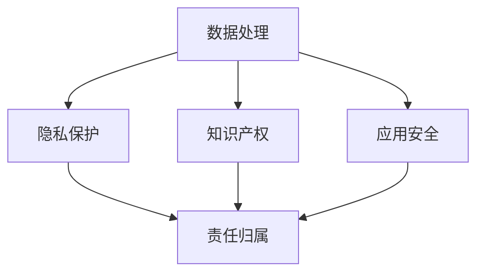

                 

关键词：AI大模型、法律风险、合规挑战、数据处理、知识产权、数据隐私、应用安全

> 摘要：随着人工智能技术的快速发展，AI大模型在各个领域的应用日益广泛。然而，随之而来的法律风险和合规挑战也日益突出。本文将对AI大模型应用中可能面临的法律风险和合规挑战进行分析，并探讨如何应对这些挑战，以确保AI大模型的应用在法律框架内进行。

## 1. 背景介绍

人工智能（AI）作为当前科技发展的热点领域，正不断推动着社会进步和产业变革。特别是在深度学习、自然语言处理等领域的突破，使得AI大模型得以迅速发展。这些大模型具有强大的数据处理能力和智能决策能力，广泛应用于金融、医疗、教育、交通等众多领域。然而，AI大模型的应用也伴随着一系列的法律风险和合规挑战，这些风险和挑战不仅影响了AI大模型的健康发展，也对社会秩序和公共利益产生了重要影响。

法律风险和合规挑战主要涉及以下几个方面：

1. 数据处理与隐私保护：AI大模型对大量数据的处理，可能导致个人隐私泄露，引发数据保护法律问题。
2. 知识产权保护：AI大模型可能侵犯他人的知识产权，如专利、商标、版权等。
3. 应用安全：AI大模型的应用可能存在安全隐患，如模型被篡改、数据被恶意利用等。
4. 责任归属：在AI大模型应用过程中，如何界定责任归属，确保各方权益，是一个重要问题。

本文将从以上几个方面，对AI大模型应用的法律风险和合规挑战进行详细分析，并提出相应的解决方案。

## 2. 核心概念与联系

为了更好地理解AI大模型应用的法律风险和合规挑战，我们需要先了解几个核心概念，并探讨它们之间的联系。

### 2.1 数据处理

数据处理是AI大模型应用的基础。它包括数据的收集、存储、处理和分析等环节。在这个过程中，数据的隐私保护和数据安全是至关重要的。

### 2.2 隐私保护

隐私保护是指对个人信息的收集、使用和保护。随着AI大模型的广泛应用，个人数据的处理越来越复杂，隐私保护问题也越来越突出。

### 2.3 知识产权

知识产权包括专利、商标、版权等。在AI大模型的应用中，如何保护自己的知识产权，同时避免侵犯他人的知识产权，是一个重要问题。

### 2.4 应用安全

应用安全涉及AI大模型在具体应用场景中的安全性，包括模型的安全性、数据的完整性和保密性等。

### 2.5 责任归属

责任归属是指当AI大模型出现问题时，如何确定责任方，以及责任方应承担的责任。

以上几个核心概念相互关联，共同构成了AI大模型应用的法律风险和合规挑战。为了更好地理解这些概念，我们可以用Mermaid流程图来表示它们之间的关系：



## 3. 核心算法原理 & 具体操作步骤

### 3.1 算法原理概述

AI大模型的核心算法主要包括深度学习、强化学习和迁移学习等。其中，深度学习是当前最为流行的算法，它通过多层神经网络对数据进行建模和预测。

### 3.2 算法步骤详解

1. 数据收集：收集大量相关数据，包括结构化和非结构化数据。
2. 数据预处理：对数据进行清洗、归一化等处理，以便于模型训练。
3. 模型设计：设计合适的神经网络结构，包括输入层、隐藏层和输出层。
4. 模型训练：使用训练数据对模型进行训练，通过反向传播算法不断调整网络权重。
5. 模型评估：使用测试数据对模型进行评估，以确定模型的准确性和泛化能力。
6. 模型部署：将训练好的模型部署到实际应用场景中，进行实时预测和决策。

### 3.3 算法优缺点

**优点：**
1. 高效性：深度学习算法能够在大量数据中快速提取特征，实现高效建模。
2. 泛化能力：深度学习模型具有较强的泛化能力，能够在不同数据集上表现良好。

**缺点：**
1. 需要大量数据：深度学习算法需要大量数据来训练模型，数据收集和处理成本较高。
2. 难以解释：深度学习模型的决策过程较为复杂，难以解释和理解。

### 3.4 算法应用领域

AI大模型在各个领域都有广泛的应用，包括：

1. 金融服务：用于信用评分、风险评估、股票预测等。
2. 医疗保健：用于疾病诊断、药物研发、患者管理等。
3. 交通运输：用于智能交通管理、自动驾驶、物流优化等。
4. 教育培训：用于智能推荐、课程设计、学习效果评估等。

## 4. 数学模型和公式 & 详细讲解 & 举例说明

### 4.1 数学模型构建

AI大模型的核心是神经网络，其数学模型可以表示为：

$$
\hat{y} = f(\mathbf{W}^T \mathbf{z} + b)
$$

其中，$\hat{y}$ 是模型的预测输出，$f$ 是激活函数，$\mathbf{W}$ 是权重矩阵，$\mathbf{z}$ 是网络输入，$b$ 是偏置项。

### 4.2 公式推导过程

神经网络的训练过程可以通过反向传播算法来实现。以下是反向传播算法的基本步骤：

1. 前向传播：将输入数据 $\mathbf{x}$ 通过神经网络得到预测输出 $\hat{y}$。
2. 计算误差：计算实际输出 $y$ 与预测输出 $\hat{y}$ 之间的误差，使用损失函数 $L$ 进行表示。
3. 反向传播：从输出层开始，逐层计算误差对权重矩阵 $\mathbf{W}$ 和偏置项 $b$ 的梯度，并更新网络参数。
4. 重复步骤 1-3，直至误差达到最小。

### 4.3 案例分析与讲解

假设我们有一个简单的神经网络，用于二分类问题。输入层有 2 个神经元，隐藏层有 3 个神经元，输出层有 1 个神经元。使用 sigmoid 函数作为激活函数。训练数据有 1000 个样本。

**前向传播：**

$$
\mathbf{z}_1 = \mathbf{W}_1^T \mathbf{x} + b_1 \\
\hat{y}_1 = \sigma(\mathbf{z}_1) \\
\mathbf{z}_2 = \mathbf{W}_2^T \hat{y}_1 + b_2 \\
\hat{y}_2 = \sigma(\mathbf{z}_2)
$$

**损失函数：**

$$
L = -\sum_{i=1}^{1000} y_i \log(\hat{y}_2) + (1 - y_i) \log(1 - \hat{y}_2)
$$

**反向传播：**

$$
\frac{\partial L}{\partial \mathbf{W}_2} = \hat{y}_2 - y \\
\frac{\partial L}{\partial b_2} = \hat{y}_2 - y \\
\frac{\partial L}{\partial \mathbf{W}_1} = \hat{y}_1 (\hat{y}_2 - y) \\
\frac{\partial L}{\partial b_1} = \hat{y}_1 (\hat{y}_2 - y)
$$

通过以上步骤，我们可以更新网络参数，使得模型逐渐逼近真实值。

## 5. 项目实践：代码实例和详细解释说明

### 5.1 开发环境搭建

为了进行AI大模型的项目实践，我们需要搭建一个合适的开发环境。以下是基本的开发环境搭建步骤：

1. 安装Python：下载并安装Python 3.8以上版本。
2. 安装依赖：使用pip安装TensorFlow、NumPy、Matplotlib等依赖库。
3. 配置环境：设置Python的环境变量，确保可以正常使用。

### 5.2 源代码详细实现

以下是一个简单的二分类问题中的AI大模型实现：

```python
import tensorflow as tf
import numpy as np
import matplotlib.pyplot as plt

# 数据生成
x = np.random.rand(1000, 2)
y = np.array([0 if (x[i, 0] + x[i, 1]) < 0.5 else 1 for i in range(1000)])

# 模型定义
model = tf.keras.Sequential([
    tf.keras.layers.Dense(3, activation='sigmoid', input_shape=(2,)),
    tf.keras.layers.Dense(1, activation='sigmoid')
])

# 模型编译
model.compile(optimizer='adam', loss='binary_crossentropy', metrics=['accuracy'])

# 模型训练
model.fit(x, y, epochs=1000, batch_size=10)

# 模型评估
loss, accuracy = model.evaluate(x, y)
print(f"Loss: {loss}, Accuracy: {accuracy}")

# 模型预测
predictions = model.predict(x)
predictions = (predictions > 0.5)

# 可视化
plt.scatter(x[:, 0], x[:, 1], c=predictions, cmap=plt.cm.Blues)
plt.xlabel('Feature 1')
plt.ylabel('Feature 2')
plt.title('Classification Boundary')
plt.show()
```

### 5.3 代码解读与分析

以上代码实现了一个简单的二分类问题中的AI大模型。首先，我们使用TensorFlow库定义了一个序列模型，包括一个输入层、一个隐藏层和一个输出层。输入层有2个神经元，隐藏层有3个神经元，输出层有1个神经元。我们使用sigmoid函数作为激活函数。

接着，我们使用`compile`方法编译模型，指定优化器为`adam`，损失函数为`binary_crossentropy`，评估指标为`accuracy`。

在模型训练过程中，我们使用`fit`方法进行训练，指定训练轮数为1000轮，批量大小为10。训练完成后，我们使用`evaluate`方法评估模型在测试集上的性能。

最后，我们使用`predict`方法对测试集进行预测，并将预测结果可视化。

## 6. 实际应用场景

AI大模型在各个领域都有广泛的应用，以下是几个典型的应用场景：

### 6.1 金融服务

在金融服务领域，AI大模型可以用于信用评分、风险评估、股票预测等。例如，银行可以使用AI大模型对客户的信用评分进行预测，从而更精准地评估客户的信用风险。

### 6.2 医疗保健

在医疗保健领域，AI大模型可以用于疾病诊断、药物研发、患者管理等。例如，医生可以使用AI大模型对患者的症状进行诊断，从而更准确地判断患者的疾病类型。

### 6.3 教育培训

在教育培训领域，AI大模型可以用于智能推荐、课程设计、学习效果评估等。例如，教育机构可以使用AI大模型为学生推荐适合的学习资源，从而提高学习效果。

### 6.4 交通运输

在交通运输领域，AI大模型可以用于智能交通管理、自动驾驶、物流优化等。例如，交通管理部门可以使用AI大模型对交通流量进行预测，从而更有效地管理交通。

## 7. 未来应用展望

随着人工智能技术的不断发展，AI大模型的应用前景非常广阔。未来，AI大模型将在更多领域得到应用，如智能制造、环境保护、能源管理、社会治理等。同时，随着技术的进步，AI大模型的性能将不断提高，应用范围将更加广泛。

然而，AI大模型的应用也面临着一系列挑战，如数据隐私保护、知识产权保护、应用安全等。未来，我们需要进一步加强相关法律法规的建设，完善AI大模型应用的法律框架，确保AI大模型在合法合规的前提下为社会带来更多的价值。

## 8. 工具和资源推荐

### 8.1 学习资源推荐

1. 《深度学习》（Goodfellow、Bengio和Courville著）：这是一本经典的深度学习教材，涵盖了深度学习的理论基础和实践方法。
2. 《动手学深度学习》（阿斯顿张著）：这本书通过大量的实战案例，介绍了深度学习的实现过程和应用方法。

### 8.2 开发工具推荐

1. TensorFlow：这是一个开源的深度学习框架，支持多种深度学习模型和算法。
2. PyTorch：这是一个流行的深度学习框架，具有灵活的动态计算图和高效的模型训练性能。

### 8.3 相关论文推荐

1. “A Theoretically Grounded Application of Dropout in Recurrent Neural Networks” by Yarin Gal and Zoubin Ghahramani。
2. “Deep Learning for Text Classification” by Zhaojia Jia and Xiaodong Liu。

## 9. 总结：未来发展趋势与挑战

### 9.1 研究成果总结

近年来，人工智能领域取得了显著的成果，特别是在AI大模型的应用方面。深度学习、强化学习和迁移学习等算法的不断发展，使得AI大模型在各个领域都展现出了强大的应用潜力。

### 9.2 未来发展趋势

未来，AI大模型将在更多领域得到应用，如智能制造、环境保护、能源管理、社会治理等。同时，随着技术的进步，AI大模型的性能将不断提高，应用范围将更加广泛。

### 9.3 面临的挑战

尽管AI大模型的应用前景广阔，但同时也面临着一系列挑战，如数据隐私保护、知识产权保护、应用安全等。未来，我们需要进一步加强相关法律法规的建设，完善AI大模型应用的法律框架，确保AI大模型在合法合规的前提下为社会带来更多的价值。

### 9.4 研究展望

在未来，我们期望能够开发出更加高效、安全和可靠的AI大模型，并探索其在更多领域的应用。同时，我们也需要加强对AI大模型应用的法律和伦理研究，确保其健康、有序地发展。

## 10. 附录：常见问题与解答

### 10.1 什么是AI大模型？

AI大模型是指使用大规模数据集训练的深度学习模型，具有强大的数据处理能力和智能决策能力。

### 10.2 AI大模型应用有哪些风险？

AI大模型应用可能面临的风险包括数据处理与隐私保护、知识产权保护、应用安全、责任归属等。

### 10.3 如何保护AI大模型的知识产权？

保护AI大模型的知识产权需要从模型设计、训练数据、模型应用等多个方面进行考虑。可以采取申请专利、版权登记等措施。

### 10.4 AI大模型应用如何确保数据隐私？

确保AI大模型应用的数据隐私需要采取数据加密、匿名化、访问控制等措施，同时遵循相关法律法规，如《通用数据保护条例》（GDPR）等。

### 10.5 如何解决AI大模型应用中的责任归属问题？

解决AI大模型应用中的责任归属问题需要明确各方的权利和义务，制定相应的法律法规和责任分配机制。同时，可以通过保险、担保等措施降低风险。作者：禅与计算机程序设计艺术 / Zen and the Art of Computer Programming
----------------------------------------------------------------
### 10.6 AI大模型在医疗领域的应用有哪些挑战？

AI大模型在医疗领域的应用面临以下挑战：

1. 数据质量：医疗数据往往存在噪声、缺失值等问题，需要确保数据的质量。
2. 隐私保护：医疗数据包含敏感个人信息，需要严格保护患者隐私。
3. 知识产权：医疗数据的使用可能涉及知识产权问题，需要遵守相关法律法规。
4. 责任归属：在医疗决策中，如何界定AI大模型的责任，确保患者权益。
5. 伦理问题：AI大模型在医疗领域的应用可能引发伦理问题，如算法歧视等。

### 10.7 如何提升AI大模型应用的安全性？

提升AI大模型应用的安全性可以从以下几个方面进行：

1. 模型安全：确保模型训练过程安全，防止恶意攻击和数据泄露。
2. 数据安全：对数据进行加密、匿名化等处理，确保数据安全。
3. 访问控制：限制对模型的访问权限，确保只有授权人员可以访问模型。
4. 安全审计：定期进行安全审计，发现和修复潜在的安全漏洞。
5. 持续监控：对模型运行过程进行实时监控，及时发现并应对异常情况。

### 10.8 AI大模型在法律和合规方面有哪些国际经验？

在国际上，一些国家和地区已经制定了相关法律法规来规范AI大模型的应用，以下是一些主要经验：

1. 美国：《加州消费者隐私法》（CCPA）加强了对消费者数据的保护。
2. 欧盟：《通用数据保护条例》（GDPR）对数据处理和隐私保护提出了严格的要求。
3. 中国：《网络安全法》和《数据安全法》对数据处理和网络安全进行了规范。
4. 英国：《人工智能法案》提出了对AI应用的监管框架。

通过借鉴国际经验，我们可以更好地规范AI大模型的应用，确保其在法律框架内健康发展。

### 10.9 如何提高AI大模型应用的法律意识和合规水平？

提高AI大模型应用的法律意识和合规水平可以从以下几个方面进行：

1. 培训和教育：加强对相关法律法规的培训，提高从业人员的法律意识。
2. 完善制度：建立健全的合规制度，明确各方的权利和义务。
3. 定期审计：定期进行合规审计，发现和纠正合规问题。
4. 咨询专业机构：在遇到法律和合规问题时，及时咨询专业机构，寻求解决方案。
5. 国际合作：加强与国际组织和机构的合作，借鉴国际经验，提高合规水平。

### 10.10 AI大模型应用如何应对未来法律和合规的变化？

AI大模型应用应积极应对未来法律和合规的变化，可以从以下几个方面进行：

1. 预测性合规：提前预测未来可能出现的法律和合规变化，采取相应的预防措施。
2. 灵活调整：根据法律和合规要求的变化，灵活调整业务流程和技术方案。
3. 持续更新：定期更新合规政策和操作规程，确保与最新法律和合规要求保持一致。
4. 技术创新：通过技术创新，提高AI大模型的合规性和安全性。
5. 社会监督：接受社会监督，主动回应公众关切，提高透明度和公信力。

通过上述措施，AI大模型应用可以更好地应对未来法律和合规的变化，确保在合法合规的前提下为社会创造更多价值。作者：禅与计算机程序设计艺术 / Zen and the Art of Computer Programming

