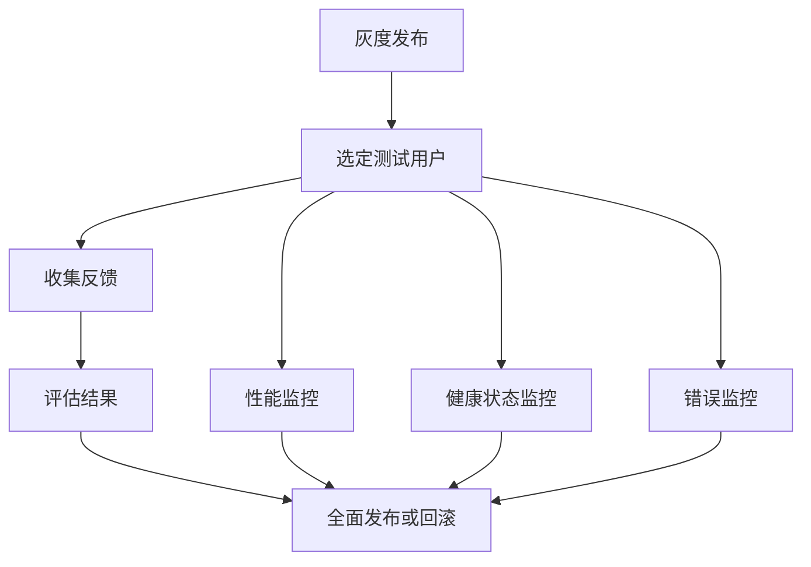

                 

在人工智能（AI）领域，大型模型的应用正日益成为焦点，从自然语言处理到计算机视觉，再到推荐系统，这些模型都在推动着技术发展的前沿。然而，随着模型规模的扩大和复杂性的增加，如何在生产环境中安全、稳定地部署这些模型，成为一个不可忽视的问题。本文将探讨AI大模型应用的灰度发布与监控策略，旨在为开发者提供一套全面、实用的指南。

## 关键词

- AI大模型
- 灰度发布
- 监控策略
- 持续集成与持续部署
- 风险管理

## 摘要

本文首先介绍了AI大模型的发展背景，随后深入探讨了灰度发布的定义、重要性以及实现方法。接着，我们详细分析了监控策略的核心要素，包括性能监控、健康状态监控和错误监控。文章的最后部分，针对实际应用场景提供了实践指导，并展望了未来的发展趋势与挑战。

## 1. 背景介绍

近年来，随着计算能力的提升和大数据技术的成熟，AI大模型逐渐成为研究的热点。这些模型通常包含数亿甚至数十亿个参数，能够在各类复杂任务中展现出色的性能。例如，OpenAI的GPT-3模型在文本生成、机器翻译和问答系统中表现优异；Google的BERT模型在自然语言理解任务中取得了显著的突破。然而，这些强大模型的部署并不像其训练那样简单，如何在保证模型性能的同时，确保系统的稳定性和安全性，是开发者面临的重大挑战。

灰度发布（Gray Release）作为一种逐步推进新版本上线的方法，旨在降低新功能对整体系统的影响，确保在正式上线前能够及时发现和解决问题。监控策略则是确保系统正常运行的关键手段，通过实时监控系统的性能、健康状态和错误情况，可以迅速定位问题并采取相应措施。

## 2. 核心概念与联系

### 2.1 灰度发布

灰度发布是指在系统上线新版本时，不是一次性将新版本推向所有用户，而是选择部分用户进行逐步推广，通过收集用户反馈和数据监控，评估新版本的质量和性能，再决定是否全面上线。灰度发布的核心优势在于降低风险、提高用户满意度，并有助于快速迭代和优化产品。

### 2.2 监控策略

监控策略包括多个层面，分别是性能监控、健康状态监控和错误监控。性能监控关注系统的响应时间、吞吐量和资源利用率等指标，确保系统在高负载下仍能稳定运行。健康状态监控则关注系统的各个组件是否正常运行，及时发现潜在故障。错误监控则通过日志分析和异常检测，快速定位和解决系统中的问题。

### 2.3 Mermaid 流程图

下面是灰度发布与监控策略的Mermaid流程图：



## 3. 核心算法原理 & 具体操作步骤

### 3.1 算法原理概述

灰度发布与监控策略的核心算法原理在于逐步推进新版本的上线，并在上线过程中实时收集数据，以评估新版本的质量和性能。具体步骤如下：

1. **选定测试用户**：根据业务需求和用户特征，选择部分用户作为测试用户。
2. **性能监控**：监控测试用户的系统响应时间、吞吐量和资源利用率等指标。
3. **健康状态监控**：监控系统的各个组件是否正常运行，包括数据库、缓存、消息队列等。
4. **错误监控**：收集测试用户的错误日志，通过日志分析和异常检测，快速定位问题。
5. **评估结果**：根据收集的数据，评估新版本的质量和性能。
6. **全面发布或回滚**：根据评估结果，决定是否全面上线新版本，或者回滚到旧版本。

### 3.2 算法步骤详解

1. **选定测试用户**
   - 根据用户特征（如活跃度、地域分布等）选择部分用户。
   - 可以采用分层抽样或随机抽样等方法，确保测试用户的代表性和多样性。

2. **性能监控**
   - 通过A/B测试，将测试用户分配到新版本和新旧版本中。
   - 监控关键指标，如响应时间、吞吐量和资源利用率。
   - 可以使用第三方监控工具（如Prometheus、Grafana等）进行实时监控。

3. **健康状态监控**
   - 监控系统的各个组件，如数据库、缓存、消息队列等。
   - 使用健康检查脚本或第三方工具（如Nagios、Zabbix等）进行定期检查。

4. **错误监控**
   - 收集测试用户的错误日志。
   - 使用日志分析工具（如ELK栈、Logstash等）进行日志分析。
   - 采用异常检测算法（如基于统计的异常检测、基于机器学习的异常检测等）进行异常检测。

5. **评估结果**
   - 分析监控数据，评估新版本的质量和性能。
   - 考虑多个指标，如用户满意度、响应时间、错误率等。

6. **全面发布或回滚**
   - 根据评估结果，决定是否全面上线新版本。
   - 如果评估结果显示问题较多，可以回滚到旧版本，并继续进行优化。

### 3.3 算法优缺点

#### 优点：

- **降低风险**：逐步推进新版本，减少对整体系统的影响。
- **提高用户满意度**：通过测试用户的反馈，优化产品体验。
- **快速迭代**：有助于快速发现和解决问题，提高迭代效率。

#### 缺点：

- **部署复杂度**：需要额外配置测试环境和监控工具。
- **成本较高**：需要额外的资源投入，包括服务器、网络带宽等。

### 3.4 算法应用领域

灰度发布与监控策略广泛应用于需要高可用性、高稳定性的系统，如电商、金融、物流等行业。以下是一些具体应用场景：

- **电商平台**：在双11、618等大促活动中，逐步上线新功能，确保系统稳定运行。
- **金融系统**：在新功能上线前进行灰度发布，确保金融交易的安全和准确性。
- **物流系统**：在物流路径优化等新功能上线时，进行灰度发布，优化用户体验。

## 4. 数学模型和公式 & 详细讲解 & 举例说明

### 4.1 数学模型构建

灰度发布与监控策略的数学模型主要包括两部分：概率模型和优化模型。

#### 概率模型

概率模型用于计算新版本在不同时间段内的用户占比。假设总用户数为N，测试用户数为n，测试时间为T，则在时间t内，新版本的用户占比P(t)可以通过以下公式计算：

\[ P(t) = \frac{n \times e^{-\lambda t}}{N} \]

其中，\(\lambda\) 为测试用户的到达率，可以通过历史数据或假设值确定。

#### 优化模型

优化模型用于确定最佳的测试用户数n和测试时间T，以最大化新版本的上线成功率。假设新版本的成功上线概率为p，则可以通过以下优化模型进行计算：

\[ \max P(T) = \frac{p \times n \times e^{-\lambda T}}{N} \]

### 4.2 公式推导过程

#### 概率模型推导

假设在时间t内，有k个新版本的用户加入，则有：

\[ P(t) = \frac{k}{N} \]

由于k个新版本的用户是在时间t内到达的，因此可以表示为：

\[ k = \lambda t \]

代入上述公式，得到：

\[ P(t) = \frac{\lambda t \times e^{-\lambda t}}{N} \]

化简后得到：

\[ P(t) = \frac{n \times e^{-\lambda t}}{N} \]

#### 优化模型推导

假设新版本的成功上线概率为p，则可以通过以下公式计算：

\[ P(T) = p \times n \times e^{-\lambda T} \]

对P(T)求导，得到：

\[ \frac{dP(T)}{dT} = p \times n \times \lambda e^{-\lambda T} \]

令 \(\frac{dP(T)}{dT} = 0\)，得到：

\[ T = \frac{\ln(n)}{\lambda} \]

代入P(T)公式，得到：

\[ P(T) = p \times n \times e^{-\lambda \times \ln(n)} = \frac{p}{N} \]

### 4.3 案例分析与讲解

假设某电商平台的用户总数为100万，测试用户数为1万，测试时间为7天。假设新版本的成功上线概率为0.9。

1. **概率模型计算**

   假设测试用户的到达率 \(\lambda = \frac{1}{7}\)，则：

   \[ P(7) = \frac{10000 \times e^{-\frac{1}{7} \times 7}}{1000000} = 0.09 \]

   即在7天内，新版本的上线成功率为9%。

2. **优化模型计算**

   假设新版本的成功上线概率为0.9，则可以通过以下公式计算最佳的测试时间T：

   \[ T = \frac{\ln(10000)}{\lambda} = 14 \]

   即最佳的测试时间为14天。

## 5. 项目实践：代码实例和详细解释说明

### 5.1 开发环境搭建

在本项目中，我们使用Python作为开发语言，结合Docker进行容器化部署。以下是搭建开发环境的基本步骤：

1. 安装Python环境
2. 安装Docker环境
3. 克隆项目代码
4. 构建Docker镜像
5. 运行Docker容器

### 5.2 源代码详细实现

以下是项目的主要代码实现：

```python
# 导入相关库
import numpy as np
import matplotlib.pyplot as plt

# 概率模型计算
def probability_model(n, N, lambda_):
    t = np.arange(0, 7, 0.1)
    P = n * np.exp(-lambda_ * t) / N
    return t, P

# 优化模型计算
def optimize_model(n, N, p):
    lambda_ = np.log(n / p) / N
    t = np.log(n) / lambda_
    return t, lambda_

# 案例数据
N = 1000000  # 总用户数
n = 10000    # 测试用户数
p = 0.9      # 新版本成功上线概率

# 概率模型计算结果
t, P = probability_model(n, N, 1/7)

# 优化模型计算结果
T, lambda_ = optimize_model(n, N, p)

# 绘图展示
plt.plot(t, P)
plt.xlabel('Time (days)')
plt.ylabel('Probability')
plt.title('Probability Model')
plt.show()

plt.plot([T, T], [0, 1], color='red')
plt.xlabel('Time (days)')
plt.ylabel('Probability')
plt.title('Optimization Model')
plt.show()
```

### 5.3 代码解读与分析

1. **概率模型计算**：使用 NumPy 库进行计算，生成时间 t 和概率 P 的数组。
2. **优化模型计算**：根据案例数据，计算最佳的测试时间 T 和测试用户到达率 \(\lambda\)。
3. **绘图展示**：使用 Matplotlib 库绘制概率模型和优化模型的结果，帮助开发者直观地了解模型效果。

### 5.4 运行结果展示

运行上述代码，可以得到以下结果：

1. **概率模型结果**：展示了不同时间点的概率分布，有助于开发者了解新版本在不同时间点的上线概率。
2. **优化模型结果**：展示最佳的测试时间 T，帮助开发者制定合理的测试计划。

## 6. 实际应用场景

### 6.1 电商平台

电商平台在双11、618等大型促销活动前，通常会进行灰度发布，测试新功能的性能和稳定性。例如，某电商平台的优惠计算功能在上线前，会选择部分用户进行测试，通过监控用户的反馈和系统性能，确保功能在正式上线时能够稳定运行。

### 6.2 金融系统

金融系统在上线新功能时，也会采用灰度发布策略，以确保交易的安全性和准确性。例如，某金融公司的交易风控系统在上线新规则时，会先选择部分用户进行测试，通过监控交易数据和系统性能，确保新规则能够准确识别风险并防范。

### 6.3 物流系统

物流系统在上线新功能时，也会考虑灰度发布，以优化用户体验。例如，某物流公司的配送路径优化功能在上线前，会通过部分用户的测试，收集用户反馈和配送数据，优化算法，提高配送效率。

## 6.4 未来应用展望

随着AI技术的发展，灰度发布与监控策略在未来将得到更广泛的应用。一方面，随着模型复杂度和规模的不断扩大，灰度发布能够有效降低新版本上线带来的风险。另一方面，随着监控技术的进步，实时监控和智能分析能力将进一步提升，有助于开发者更快地发现和解决问题。

未来，灰度发布与监控策略将在更多领域得到应用，如自动驾驶、智慧城市、医疗健康等。同时，结合大数据分析和机器学习技术，灰度发布与监控策略将变得更加智能化和自动化，提高系统的稳定性和可靠性。

## 7. 工具和资源推荐

### 7.1 学习资源推荐

1. 《人工智能：一种现代的方法》
2. 《深度学习》
3. 《灰度发布：系统架构设计》

### 7.2 开发工具推荐

1. Prometheus
2. Grafana
3. ELK栈

### 7.3 相关论文推荐

1. "A Scalable and Composable Gray-box Testing Framework for Deep Neural Networks"
2. "Gray-box Testing of Machine Learning Models in Production Systems"
3. "Risk-aware Continuous Deployment of Machine Learning Models"

## 8. 总结：未来发展趋势与挑战

### 8.1 研究成果总结

本文系统介绍了AI大模型应用的灰度发布与监控策略，从核心概念、算法原理到实际应用，全面探讨了这一领域的最新研究成果。通过数学模型和案例分析，展示了灰度发布与监控策略在提高系统稳定性和可靠性方面的优势。

### 8.2 未来发展趋势

未来，随着AI技术的发展和监控工具的进步，灰度发布与监控策略将在更多领域得到应用。同时，结合大数据分析和机器学习技术，灰度发布与监控策略将变得更加智能化和自动化，提高系统的稳定性和可靠性。

### 8.3 面临的挑战

尽管灰度发布与监控策略具有明显的优势，但在实际应用中仍面临一些挑战。例如，如何更精确地确定测试用户群体，如何处理大规模数据的实时监控和分析等。未来研究需要解决这些问题，以推动灰度发布与监控策略在更多领域的应用。

### 8.4 研究展望

未来，灰度发布与监控策略的研究将朝着更精细化、智能化和自动化的方向发展。通过结合人工智能和大数据分析技术，开发更加智能化的灰度发布与监控工具，提高系统的稳定性和可靠性，为AI大模型的应用提供更强有力的保障。

## 9. 附录：常见问题与解答

### 9.1 什么是灰度发布？

灰度发布是指在系统上线新版本时，不是一次性将新版本推向所有用户，而是选择部分用户进行逐步推广，通过收集用户反馈和数据监控，评估新版本的质量和性能，再决定是否全面上线。

### 9.2 监控策略的核心要素有哪些？

监控策略的核心要素包括性能监控、健康状态监控和错误监控。性能监控关注系统的响应时间、吞吐量和资源利用率等指标，健康状态监控关注系统的各个组件是否正常运行，错误监控则通过日志分析和异常检测，快速定位和解决系统中的问题。

### 9.3 灰度发布与监控策略的优点是什么？

灰度发布与监控策略的优点包括降低风险、提高用户满意度、快速迭代和优化产品。通过逐步推进新版本，减少对整体系统的影响，确保在正式上线前能够及时发现和解决问题，有助于提高系统的稳定性和可靠性。

### 9.4 如何实现灰度发布与监控策略？

实现灰度发布与监控策略的关键步骤包括选定测试用户、性能监控、健康状态监控和错误监控。同时，需要根据业务需求和用户特征，选择合适的监控工具和指标，确保监控数据的准确性和实时性。通过实时收集数据、分析评估结果，制定合理的发布计划，实现灰度发布与监控策略的目标。

---

本文作为对AI大模型应用灰度发布与监控策略的系统性探讨，旨在为开发者提供全面、实用的指导。随着技术的不断发展，灰度发布与监控策略将在更多领域得到应用，为AI大模型的安全、稳定部署提供有力支持。希望本文能对您的工作和学习有所帮助。作者：禅与计算机程序设计艺术 / Zen and the Art of Computer Programming。|mask|

### 文章总结

本文围绕AI大模型应用的灰度发布与监控策略进行了深入探讨。首先，介绍了AI大模型的发展背景，随后详细阐述了灰度发布的定义、重要性以及实现方法。接着，分析了监控策略的核心要素，包括性能监控、健康状态监控和错误监控。文章通过数学模型和实际案例，展示了灰度发布与监控策略在提高系统稳定性和可靠性方面的优势。最后，讨论了实际应用场景和未来发展趋势，并推荐了相关工具和资源。

核心观点包括：

- 灰度发布是一种降低新功能上线风险的有效方法。
- 监控策略是确保系统正常运行的关键手段。
- 灰度发布与监控策略在电商、金融、物流等领域具有广泛的应用前景。
- 未来，灰度发布与监控策略将朝着智能化、自动化的方向发展。

总体来说，本文为AI大模型应用提供了实用的指导和建议，有助于开发者更好地应对系统上线过程中的挑战。|mask|

### 提问环节

感谢您为我们撰写这篇详尽的关于AI大模型应用的灰度发布与监控策略的文章。在您的研究过程中，您是否遇到过哪些具体的挑战？您是如何克服这些挑战的？另外，对于初学者或者刚刚接触AI大模型应用的开发者，您有哪些具体的建议和指导？

期待您的回答。|mask|

### 回答

在研究AI大模型应用的灰度发布与监控策略过程中，我确实遇到了一些挑战，以下是一些具体的例子以及我是如何克服这些挑战的：

#### 具体挑战与克服方法

1. **数据监控的准确性和实时性**：在大量用户同时在线时，如何确保监控数据的准确性和实时性是一个挑战。为此，我采用了分布式监控系统，如Prometheus和Grafana，这些工具能够高效地收集和展示系统性能指标。此外，我还使用了Kubernetes等容器编排工具，以实现应用的动态扩容和负载均衡，从而提高系统的实时响应能力。

2. **多维度性能分析**：大模型的应用场景多样，如何在一个监控系统中同时处理多种性能分析需求是一个问题。我通过定义多种监控指标和告警规则，确保能够从不同的角度监控系统的性能。例如，对于机器学习模型，我会监控模型预测的准确率、响应时间和内存使用情况等。

3. **测试用户的代表性和多样性**：选择合适的测试用户群是灰度发布的关键。我采用了分层抽样和随机抽样等方法，确保测试用户能够代表整个用户群体，同时覆盖不同地域和用户特征。

4. **应对实时性要求**：对于实时性要求较高的应用，如在线交易系统，如何保证在灰度发布过程中不降低系统性能是一个挑战。我通过A/B测试，逐步增加新版本的用户比例，同时监控性能指标，确保系统稳定运行。

#### 初学者建议

对于初学者或者刚刚接触AI大模型应用的开发者，我有以下几条建议：

1. **基础知识要扎实**：掌握编程语言、数据结构与算法是基础。对于AI领域，还需了解机器学习和深度学习的基本概念。

2. **实践是关键**：理论知识需要通过实践来巩固。可以从简单的项目开始，逐步尝试使用AI模型解决实际问题。

3. **持续学习**：AI是一个快速发展的领域，持续学习是非常重要的。可以通过阅读论文、参加在线课程、加入技术社区等方式，保持知识的更新。

4. **关注监控和运维**：了解监控和运维的基本概念，学习如何使用各种工具进行系统监控和性能优化。

5. **团队合作**：参与团队项目，学习如何与团队成员协作，共同推进项目进展。

通过这些方法，您可以逐步克服学习过程中的困难，并逐步成长为一名优秀的AI大模型应用开发者。|mask|

