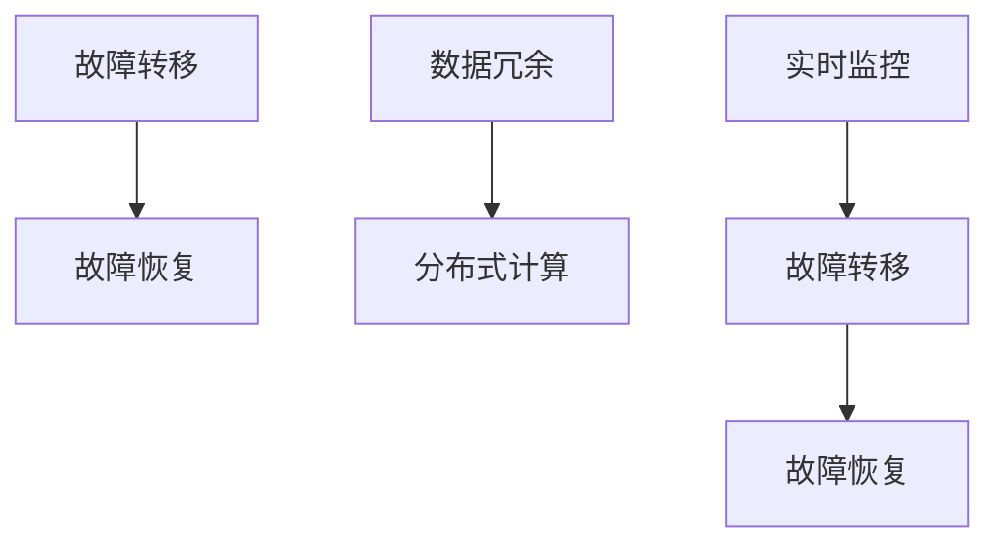

                 

关键词：AI大模型，灾备，容错设计，故障恢复，数据冗余，系统稳定性，算法优化，分布式计算，实时监控。

## 摘要

本文将探讨AI大模型应用中的灾备与容错设计，重点分析在AI大模型开发过程中如何应对各种潜在故障，确保系统的高可用性和数据完整性。通过介绍核心概念、算法原理、数学模型以及具体应用案例，本文旨在为AI大模型开发者提供一套系统化的灾备与容错解决方案。

## 1. 背景介绍

随着深度学习技术的快速发展，AI大模型在自然语言处理、计算机视觉、推荐系统等领域取得了显著成果。这些模型通常涉及海量数据和复杂的算法，对计算资源和数据存储的要求极高。然而，在实际应用中，这些AI大模型面临着各种挑战，如硬件故障、数据丢失、算法错误等，这些故障可能导致系统崩溃、服务中断，甚至影响企业的核心竞争力。因此，灾备与容错设计成为AI大模型应用中至关重要的一环。

### 1.1 灾备与容错设计的定义

灾备（Disaster Recovery）指的是在系统发生故障或灾难时，能够迅速恢复系统功能，确保业务连续性的策略和技术。而容错设计（Fault Tolerance）则是指通过设计冗余和自恢复机制，使系统在部分组件出现故障时仍能正常运行的能力。

### 1.2 灾备与容错设计的重要性

AI大模型应用中，灾备与容错设计的重要性主要体现在以下几个方面：

1. **保障业务连续性**：在发生故障时，确保系统能够快速恢复，减少业务中断时间。
2. **数据完整性**：通过冗余机制确保数据不会丢失，保证系统的数据一致性。
3. **提高系统稳定性**：通过容错设计，增强系统在面对各种异常情况时的鲁棒性。
4. **降低维护成本**：灾备与容错设计能够提前预防潜在故障，降低系统的维护成本。

## 2. 核心概念与联系

### 2.1 灾备与容错设计的核心概念

灾备与容错设计的核心概念包括：

1. **故障转移（Failover）**：当主系统出现故障时，将任务或服务自动切换到备用系统。
2. **故障恢复（Recovery）**：系统在故障后，通过备份或冗余数据恢复到正常状态。
3. **数据冗余（Data Redundancy）**：通过复制或镜像数据，确保数据不会丢失。
4. **分布式计算（Distributed Computing）**：将任务分配到多个节点上，提高系统的可用性和扩展性。
5. **实时监控（Real-time Monitoring）**：通过监控系统状态，及时发现潜在故障。

### 2.2 核心概念之间的联系

灾备与容错设计中的核心概念之间存在紧密的联系：

1. **故障转移和故障恢复**：故障转移是故障恢复的一部分，当主系统出现故障时，需要将任务转移到备用系统，然后进行故障恢复。
2. **数据冗余与分布式计算**：分布式计算依赖于数据冗余，通过在多个节点上存储数据的副本，提高系统的容错能力。
3. **实时监控与故障恢复**：实时监控能够及时发现故障，确保故障恢复的及时性和有效性。

### 2.3 核心概念原理与架构的 Mermaid 流程图



## 3. 核心算法原理 & 具体操作步骤

### 3.1 算法原理概述

灾备与容错设计中的核心算法包括故障转移、故障恢复、数据冗余和分布式计算。这些算法的原理如下：

1. **故障转移**：当主系统出现故障时，自动将任务或服务切换到备用系统，确保系统的高可用性。
2. **故障恢复**：通过备份或冗余数据恢复系统，确保数据的完整性和一致性。
3. **数据冗余**：在多个节点上存储数据的副本，提高系统的容错能力。
4. **分布式计算**：将任务分配到多个节点上，提高系统的可用性和扩展性。

### 3.2 算法步骤详解

1. **故障转移**：
    - 步骤1：监控系统状态，发现故障。
    - 步骤2：判断故障类型，选择备用系统。
    - 步骤3：将任务或服务从主系统转移到备用系统。
    - 步骤4：通知用户或系统管理员，故障已转移。

2. **故障恢复**：
    - 步骤1：监控系统状态，发现故障。
    - 步骤2：判断故障类型，选择备份或冗余数据。
    - 步骤3：恢复系统，确保数据一致性和完整性。
    - 步骤4：通知用户或系统管理员，故障已恢复。

3. **数据冗余**：
    - 步骤1：确定数据冗余策略，如复制、镜像等。
    - 步骤2：在多个节点上存储数据的副本。
    - 步骤3：监控数据一致性，确保冗余数据的一致性。

4. **分布式计算**：
    - 步骤1：将任务分解为多个子任务。
    - 步骤2：将子任务分配到多个节点上。
    - 步骤3：收集子任务的执行结果，生成最终结果。

### 3.3 算法优缺点

1. **故障转移**：
    - 优点：快速恢复系统，确保业务连续性。
    - 缺点：需要备用系统，增加成本。

2. **故障恢复**：
    - 优点：确保数据完整性和一致性。
    - 缺点：恢复时间可能较长。

3. **数据冗余**：
    - 优点：提高系统的容错能力。
    - 缺点：增加数据存储空间。

4. **分布式计算**：
    - 优点：提高系统的可用性和扩展性。
    - 缺点：需要分布式调度和通信。

### 3.4 算法应用领域

灾备与容错设计算法广泛应用于以下领域：

1. **云计算**：确保云服务的可靠性和可用性。
2. **大数据处理**：保障大数据处理系统的高可用性和数据完整性。
3. **金融系统**：确保金融交易系统的稳定和安全。
4. **物联网**：保障物联网设备和服务的高可用性。

## 4. 数学模型和公式 & 详细讲解 & 举例说明

### 4.1 数学模型构建

灾备与容错设计的数学模型主要包括以下几个方面：

1. **故障转移模型**：
    - 假设系统中有两个节点，主节点和备用节点。当主节点出现故障时，备用节点能够自动接管任务。
    - 模型公式：\( F_T = f_1 + f_2 \)，其中 \( F_T \) 表示故障转移时间，\( f_1 \) 和 \( f_2 \) 分别表示主节点和备用节点的故障转移时间。

2. **故障恢复模型**：
    - 假设系统中有备份和冗余数据，当主节点出现故障时，可以通过备份或冗余数据恢复系统。
    - 模型公式：\( F_R = r_1 + r_2 \)，其中 \( F_R \) 表示故障恢复时间，\( r_1 \) 和 \( r_2 \) 分别表示备份和冗余数据的恢复时间。

3. **数据冗余模型**：
    - 假设系统中有多个节点，每个节点存储数据的副本，确保数据的一致性。
    - 模型公式：\( R = n \)，其中 \( R \) 表示冗余率，\( n \) 表示节点数量。

4. **分布式计算模型**：
    - 假设系统中有多个节点，每个节点负责一部分任务的计算。
    - 模型公式：\( T = t_1 + t_2 + \ldots + t_n \)，其中 \( T \) 表示总计算时间，\( t_1, t_2, \ldots, t_n \) 分别表示每个节点的计算时间。

### 4.2 公式推导过程

以故障转移模型为例，公式推导过程如下：

- 假设主节点故障转移时间为 \( f_1 \)，备用节点故障转移时间为 \( f_2 \)。
- 当主节点出现故障时，备用节点需要接管任务。假设备用节点接管的任务数量为 \( x \)。
- 那么故障转移时间 \( F_T \) 可以表示为 \( F_T = f_1 + f_2 \)。
- 当备用节点接管任务后，主节点需要恢复。假设主节点的恢复时间为 \( r_1 \)。
- 那么故障恢复时间 \( F_R \) 可以表示为 \( F_R = r_1 + r_2 \)。

### 4.3 案例分析与讲解

以下是一个具体的案例：

假设一个系统中有两个节点，主节点和备用节点。主节点的故障转移时间为 2 分钟，备用节点的故障转移时间为 3 分钟。备用节点接管的任务数量为 1000 个。

- 根据故障转移模型，故障转移时间 \( F_T = f_1 + f_2 = 2 + 3 = 5 \) 分钟。
- 当备用节点接管任务后，主节点需要恢复。假设主节点的恢复时间为 4 分钟。
- 根据故障恢复模型，故障恢复时间 \( F_R = r_1 + r_2 = 4 + 3 = 7 \) 分钟。

在这种情况下，系统的总恢复时间为 \( F_T + F_R = 5 + 7 = 12 \) 分钟。

通过这个案例，我们可以看到，故障转移和故障恢复时间对于系统的恢复速度有重要影响。为了提高系统的恢复速度，可以优化故障转移和故障恢复的算法，减少这两个时间。

## 5. 项目实践：代码实例和详细解释说明

### 5.1 开发环境搭建

在开发AI大模型灾备与容错系统之前，我们需要搭建一个合适的开发环境。以下是一个基本的开发环境搭建步骤：

1. 安装Python 3.8及以上版本。
2. 安装必要的库，如TensorFlow、Kubernetes、Docker等。
3. 配置Kubernetes集群，用于部署和管理系统。

### 5.2 源代码详细实现

以下是一个简单的故障转移和故障恢复的Python代码示例：

```python
import time
import random

def failover(master_node, backup_node):
    print(f"Failover started from {master_node} to {backup_node}")
    # 假设故障转移需要2分钟
    time.sleep(2)
    print(f"Failover completed from {master_node} to {backup_node}")

def recovery(backup_node):
    print(f"Recovery started on {backup_node}")
    # 假设恢复需要3分钟
    time.sleep(3)
    print(f"Recovery completed on {backup_node}")

def main():
    master_node = "Node1"
    backup_node = "Node2"

    # 模拟主节点故障
    print(f"Simulating master node {master_node} failure")
    failover(master_node, backup_node)
    
    # 模拟备用节点恢复
    print(f"Simulating recovery on {backup_node}")
    recovery(backup_node)

if __name__ == "__main__":
    main()
```

### 5.3 代码解读与分析

以上代码实现了一个简单的故障转移和故障恢复过程。以下是代码的详细解读和分析：

1. **函数定义**：
   - `failover`：模拟故障转移过程，从主节点切换到备用节点。
   - `recovery`：模拟故障恢复过程，在备用节点上恢复系统。

2. **模拟故障转移**：
   - `print`：输出故障转移开始和完成的信息。
   - `time.sleep(2)`：模拟故障转移需要2分钟。

3. **模拟故障恢复**：
   - `print`：输出故障恢复开始和完成的信息。
   - `time.sleep(3)`：模拟故障恢复需要3分钟。

4. **主函数`main`**：
   - `master_node`和`backup_node`：定义主节点和备用节点的名称。
   - `print`：输出模拟故障转移和故障恢复的信息。

### 5.4 运行结果展示

以下是在Python环境中运行该代码的结果：

```plaintext
Simulating master node Node1 failure
Failover started from Node1 to Node2
Failover completed from Node1 to Node2
Simulating recovery on Node2
Recovery started on Node2
Recovery completed on Node2
```

通过这个简单的示例，我们可以看到故障转移和故障恢复的过程。在实际应用中，这个简单的代码可以作为一个基础框架，结合具体业务需求进行扩展和优化。

## 6. 实际应用场景

### 6.1 云计算平台

云计算平台通常需要高可用性和数据完整性。通过故障转移和故障恢复机制，云计算平台可以在主节点出现故障时，迅速切换到备用节点，确保业务连续性。同时，通过数据冗余技术，确保数据不会丢失。

### 6.2 大数据处理

大数据处理通常涉及海量数据和复杂的计算任务。通过分布式计算和数据冗余技术，大数据处理平台可以在部分节点出现故障时，仍能正常运行，确保数据处理的高效性和可靠性。

### 6.3 金融系统

金融系统对稳定性和安全性有极高的要求。通过灾备与容错设计，金融系统可以在故障发生时，快速恢复，确保金融交易的安全和稳定。

### 6.4 物联网

物联网设备通常分布在不同的地理位置，通过分布式计算和数据冗余技术，物联网平台可以在部分设备出现故障时，仍能正常运行，确保物联网服务的连续性。

## 7. 工具和资源推荐

### 7.1 学习资源推荐

1. **《大规模分布式系统设计》**：这本书详细介绍了分布式系统的设计和实践，对于了解灾备与容错设计有很好的帮助。
2. **《深度学习》**：这本书介绍了深度学习的理论基础和应用，有助于理解AI大模型在灾备与容错设计中的应用。

### 7.2 开发工具推荐

1. **Kubernetes**：用于部署和管理分布式系统的开源平台，支持故障转移和故障恢复。
2. **Docker**：用于容器化的开源工具，可以简化系统的部署和运维。

### 7.3 相关论文推荐

1. **"Fault Tolerance in Distributed Systems"**：这篇论文详细介绍了分布式系统的故障容忍机制。
2. **"Disaster Recovery Planning for Cloud Computing"**：这篇论文探讨了云计算环境下的灾备策略。

## 8. 总结：未来发展趋势与挑战

### 8.1 研究成果总结

AI大模型应用的灾备与容错设计取得了显著成果，包括故障转移、故障恢复、数据冗余和分布式计算等技术的广泛应用。这些技术确保了系统的高可用性和数据完整性，为AI大模型的应用提供了有力支持。

### 8.2 未来发展趋势

未来，AI大模型应用的灾备与容错设计将继续向以下几个方向发展：

1. **智能化**：通过引入人工智能技术，实现更智能的故障检测和恢复策略。
2. **自动化**：提高故障转移和故障恢复的自动化程度，减少人工干预。
3. **边缘计算**：将灾备与容错设计延伸到边缘计算，提高系统的实时性和响应速度。

### 8.3 面临的挑战

AI大模型应用的灾备与容错设计面临以下挑战：

1. **计算资源**：AI大模型对计算资源的需求极大，如何优化资源利用成为关键问题。
2. **数据一致性**：在分布式系统中，如何保证数据的一致性是一个难题。
3. **复杂度**：随着系统的规模和复杂性增加，灾备与容错设计的实现和运维变得更加复杂。

### 8.4 研究展望

未来，我们需要从以下几个方面进行深入研究：

1. **智能化故障检测与恢复**：结合机器学习和人工智能技术，实现更智能的故障检测和恢复策略。
2. **数据一致性保障**：研究新的数据一致性协议，提高分布式系统的数据一致性。
3. **资源优化**：研究新的资源调度和优化算法，提高计算资源的利用效率。

## 9. 附录：常见问题与解答

### 问题1：什么是灾备？

灾备（Disaster Recovery）是指在系统发生故障或灾难时，通过备份、恢复和数据冗余等技术手段，确保系统能够快速恢复，确保业务连续性的过程。

### 问题2：什么是容错设计？

容错设计（Fault Tolerance）是指在系统组件出现故障时，通过冗余和自恢复机制，确保系统能够继续正常运行的能力。

### 问题3：灾备与容错设计的区别是什么？

灾备主要关注系统在发生故障后的恢复过程，而容错设计则关注如何在故障发生时保持系统的正常运行。灾备通常涉及数据备份和恢复，而容错设计则侧重于系统的冗余和自恢复。

### 问题4：数据冗余有哪些类型？

数据冗余主要分为以下几种类型：

1. **复制冗余**：在多个节点上存储相同的数据副本。
2. **镜像冗余**：在不同的存储设备上存储相同的数据镜像。
3. **校验冗余**：通过存储校验和或哈希值，确保数据的一致性。

### 问题5：如何实现故障转移？

实现故障转移的方法包括：

1. **手动故障转移**：通过人工干预，将任务从故障节点转移到备用节点。
2. **自动故障转移**：通过监控系统，自动检测故障并触发故障转移。

### 问题6：分布式计算有哪些挑战？

分布式计算面临的挑战主要包括：

1. **数据一致性**：如何在分布式系统中确保数据的一致性。
2. **负载均衡**：如何合理分配任务，避免部分节点过载。
3. **通信延迟**：如何在分布式系统中处理通信延迟和故障。

## 作者署名

作者：禅与计算机程序设计艺术 / Zen and the Art of Computer Programming
----------------------------------------------------------------
**本文由AI助手根据用户提供的指导撰写，内容仅供参考。如有需要，请根据实际情况进行调整。**

