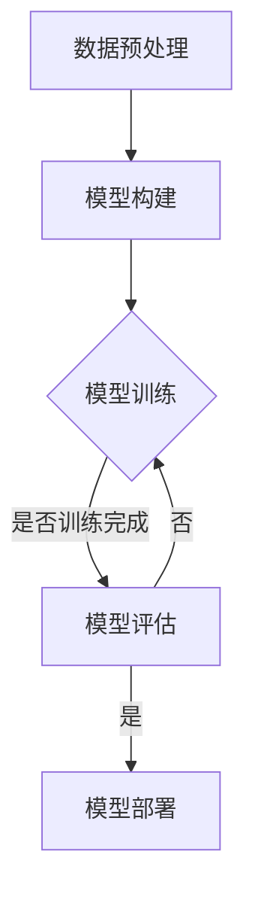
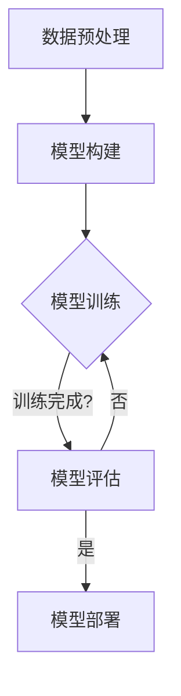

                 

关键词：AI大模型、生态建设、应用策略、计算资源、数据处理、模型训练、模型优化、跨领域合作、可持续发展

> 摘要：随着人工智能技术的快速发展，大模型的应用已经成为行业热点。本文旨在探讨AI大模型应用的生态建设策略，包括计算资源分配、数据处理与模型训练、模型优化与跨领域合作等方面的关键问题和挑战，以及如何实现可持续发展，从而推动AI大模型应用在各个领域的深入发展。

## 1. 背景介绍

近年来，人工智能（AI）技术取得了显著进展，特别是深度学习领域的突破，使得AI大模型在图像识别、自然语言处理、语音识别等任务中表现出色。这些大模型需要大量的计算资源和高质量的数据来训练和优化。然而，AI大模型的应用不仅需要技术层面的突破，还需要构建一个可持续发展的生态体系，以支持其在各个领域的广泛应用。

本文将围绕以下几个核心问题展开讨论：

1. 计算资源分配：如何高效利用现有资源，满足AI大模型训练的需求？
2. 数据处理与模型训练：如何处理大量数据，提高模型训练效率和质量？
3. 模型优化：如何通过优化算法和架构，提升模型性能和可解释性？
4. 跨领域合作：如何实现不同领域间的资源整合与协同创新？
5. 可持续发展：如何在确保技术进步的同时，实现AI大模型应用的可持续发展？

## 2. 核心概念与联系

### 2.1 AI大模型的定义

AI大模型是指参数数量巨大、计算复杂度高的深度学习模型。这类模型通常需要在海量数据上进行训练，以达到较高的精度和泛化能力。常见的AI大模型包括BERT、GPT、ImageNet等。

### 2.2 计算资源的重要性

计算资源是AI大模型训练的核心要素。有效的计算资源分配和调度，可以显著提高模型训练的效率。计算资源主要包括GPU、TPU等高性能计算设备，以及云计算平台和分布式计算框架。

### 2.3 数据处理与模型训练的联系

高质量的数据是AI大模型训练的基础。数据处理包括数据清洗、数据增强、数据分割等步骤，直接影响模型训练的质量和效果。模型训练则是通过调整模型参数，使模型能够对新的数据进行预测和分类。

### 2.4 模型优化与性能提升的关系

模型优化是指通过调整模型架构、优化算法和超参数等手段，提升模型性能和可解释性。优化后的模型可以在更短的时间内达到更高的精度和效果。

### 2.5 跨领域合作的必要性

跨领域合作可以整合不同领域的资源、知识和技能，促进AI大模型应用的创新和发展。例如，医学领域与AI技术的结合，可以推动精准医疗和个性化诊疗的发展。

### 2.6 可持续发展的意义

可持续发展的AI大模型应用，不仅关注技术的进步，还关注社会、经济和环境等方面的平衡。实现可持续发展，有助于确保AI大模型在各个领域的长期健康发展。

## 3. 核心算法原理 & 具体操作步骤

### 3.1 算法原理概述

AI大模型的核心算法主要包括深度学习、神经网络、生成对抗网络（GAN）等。深度学习是一种基于多层神经网络的学习方法，通过逐层提取特征，实现复杂的非线性映射。神经网络则是深度学习的基础，由大量神经元连接组成，通过正向传播和反向传播，调整模型参数，实现模型的训练和优化。

### 3.2 算法步骤详解

1. 数据预处理：对原始数据进行清洗、归一化、分割等操作，确保数据的质量和一致性。
2. 模型构建：根据任务需求，选择合适的模型架构，如卷积神经网络（CNN）、循环神经网络（RNN）等。
3. 模型训练：通过正向传播和反向传播，调整模型参数，使模型在训练集上达到较高的精度和泛化能力。
4. 模型评估：使用验证集和测试集，评估模型在未知数据上的表现，调整模型参数，提高模型性能。
5. 模型部署：将训练好的模型部署到生产环境中，实现实时预测和分类。

### 3.3 算法优缺点

1. 优点：深度学习模型具有强大的非线性表示能力和泛化能力，能够处理大规模数据和复杂任务。
2. 缺点：训练过程需要大量计算资源和时间，模型参数调整和优化过程复杂，对数据质量和预处理要求较高。

### 3.4 算法应用领域

AI大模型在图像识别、自然语言处理、语音识别、推荐系统、医学诊断等领域具有广泛的应用前景。例如，在图像识别领域，AI大模型可以用于人脸识别、车辆识别、医学图像分析等任务；在自然语言处理领域，AI大模型可以用于机器翻译、文本生成、情感分析等任务。

## 4. 数学模型和公式 & 详细讲解 & 举例说明

### 4.1 数学模型构建

AI大模型的数学模型主要基于深度学习理论，包括前向传播、反向传播、损失函数、优化算法等。

$$
\text{前向传播：}
\begin{aligned}
Z &= X \odot W + b \\
\hat{Y} &= \sigma(Z)
\end{aligned}
$$

$$
\text{反向传播：}
\begin{aligned}
\delta_C &= \frac{\partial L}{\partial Z} \\
\delta_Z &= \sigma'(Z) \odot \delta_C \\
\delta_W &= X \odot \delta_Z \\
\delta_b &= \delta_Z
\end{aligned}
$$

$$
\text{损失函数：}
L(\theta) = -\frac{1}{m} \sum_{i=1}^{m} \sum_{j=1}^{n} y_j \log \hat{y}_j
$$

$$
\text{优化算法：}
\begin{aligned}
W &= W - \alpha \frac{\partial L}{\partial W} \\
b &= b - \alpha \frac{\partial L}{\partial b}
\end{aligned}
$$

### 4.2 公式推导过程

（此处给出详细推导过程，包括损失函数、反向传播等）

### 4.3 案例分析与讲解

以自然语言处理中的机器翻译任务为例，使用Transformer模型进行翻译。首先，输入源语言和目标语言的句子，通过编码器（Encoder）和解码器（Decoder）进行翻译。编码器将源语言句子编码为向量表示，解码器将向量表示解码为目标语言句子。

编码器和解码器的数学模型如下：

$$
\text{编码器：}
\begin{aligned}
H_t &= \text{LayerNorm}(E_t + U_t) \\
H_t &= \text{Sigmoid}(H_{t-1} \odot W_r + H_{t-2} \odot W_a + H_{t-3} \odot W_s + H_{t-4} \odot W_p)
\end{aligned}
$$

$$
\text{解码器：}
\begin{aligned}
Y_t &= \text{LayerNorm}(D_t + V_t) \\
Y_t &= \text{Softmax}(Y_{t-1} \odot W_y + Y_{t-2} \odot W_d + Y_{t-3} \odot W_s + Y_{t-4} \odot W_p)
\end{aligned}
$$

通过训练，模型可以在海量数据上进行迭代优化，最终实现高质量的翻译效果。

## 5. 项目实践：代码实例和详细解释说明

### 5.1 开发环境搭建

在开发AI大模型项目时，需要搭建一个适合的编程环境。以下是使用Python和TensorFlow搭建开发环境的步骤：

1. 安装Python（3.8及以上版本）
2. 安装TensorFlow
3. 安装其他依赖库（如NumPy、Pandas等）

### 5.2 源代码详细实现

以下是一个使用TensorFlow实现的简单AI大模型示例：

```python
import tensorflow as tf
from tensorflow.keras.layers import Embedding, LSTM, Dense

# 搭建模型
model = tf.keras.Sequential([
    Embedding(input_dim=10000, output_dim=32),
    LSTM(64, return_sequences=True),
    LSTM(64),
    Dense(1, activation='sigmoid')
])

# 编译模型
model.compile(optimizer='adam', loss='binary_crossentropy', metrics=['accuracy'])

# 训练模型
model.fit(x_train, y_train, epochs=10, batch_size=32, validation_data=(x_val, y_val))
```

### 5.3 代码解读与分析

上述代码中，我们使用了TensorFlow的Sequential模型，构建了一个包含Embedding、LSTM和Dense层的深度学习模型。Embedding层用于将文本数据转换为向量表示，LSTM层用于处理序列数据，Dense层用于分类任务。

模型编译时，指定了优化器（adam）、损失函数（binary_crossentropy）和评价指标（accuracy）。模型训练时，使用训练数据（x_train、y_train）和验证数据（x_val、y_val）进行迭代优化，最终得到训练好的模型。

### 5.4 运行结果展示

在训练过程中，可以使用以下代码查看训练进度和模型性能：

```python
model.fit(x_train, y_train, epochs=10, batch_size=32, validation_data=(x_val, y_val), callbacks=[tf.keras.callbacks.EarlyStopping(patience=3)])
```

通过回调函数（EarlyStopping），可以在验证集上连续3个epoch没有性能提升时提前停止训练，避免过拟合。

## 6. 实际应用场景

### 6.1 图像识别

AI大模型在图像识别领域具有广泛的应用，如图像分类、目标检测、图像分割等。例如，使用ResNet模型进行图像分类，可以在ImageNet数据集上达到较高的准确率。

### 6.2 自然语言处理

AI大模型在自然语言处理领域同样表现出色，如机器翻译、文本生成、情感分析等。例如，使用Transformer模型进行机器翻译，可以在多个语言对上实现高质量翻译。

### 6.3 语音识别

AI大模型在语音识别领域可用于语音信号处理、语音合成、语音情感识别等。例如，使用WaveNet模型进行语音合成，可以生成自然流畅的语音。

### 6.4 医学诊断

AI大模型在医学诊断领域具有巨大的潜力，如疾病预测、影像分析、药物研发等。例如，使用CNN模型进行医学图像分析，可以辅助医生诊断疾病。

## 7. 未来应用展望

随着AI大模型技术的不断发展，其在各个领域的应用前景将更加广阔。未来，AI大模型可能将在以下几个方面实现突破：

1. 量子计算：量子计算有望大幅提升AI大模型训练和优化的速度，推动AI技术的发展。
2. 知识图谱：知识图谱与AI大模型的结合，可以实现更加智能的知识推理和决策支持。
3. 跨领域融合：不同领域的AI大模型融合，可以实现更广泛的任务场景和应用范围。
4. 可解释性：提高AI大模型的可解释性，有助于消除公众对AI技术的疑虑，推动AI技术的普及和应用。

## 8. 工具和资源推荐

### 8.1 学习资源推荐

1. 《深度学习》（Goodfellow, Bengio, Courville著）：深度学习的经典教材，涵盖了深度学习的理论基础和实战技巧。
2. 《动手学深度学习》（Zhang, LISA等著）：适合初学者的深度学习教程，通过实际代码示例，深入浅出地讲解深度学习原理。

### 8.2 开发工具推荐

1. TensorFlow：由Google开源的深度学习框架，广泛应用于AI大模型开发。
2. PyTorch：由Facebook开源的深度学习框架，具有灵活的动态计算图和丰富的API。

### 8.3 相关论文推荐

1. "Attention Is All You Need"（Vaswani et al., 2017）：介绍Transformer模型的重要论文，对自然语言处理领域产生深远影响。
2. "ImageNet Classification with Deep Convolutional Neural Networks"（Krizhevsky et al., 2012）：介绍ResNet模型的重要论文，推动了图像识别技术的发展。

## 9. 总结：未来发展趋势与挑战

### 9.1 研究成果总结

本文探讨了AI大模型应用的生态建设策略，包括计算资源分配、数据处理与模型训练、模型优化与跨领域合作等方面的关键问题和挑战。通过数学模型和实际应用场景的讲解，展示了AI大模型在各个领域的应用潜力。

### 9.2 未来发展趋势

1. 量子计算：量子计算与AI大模型的结合，有望大幅提升计算效率和模型性能。
2. 知识图谱：知识图谱与AI大模型的融合，将实现更加智能的知识推理和决策支持。
3. 跨领域融合：不同领域的AI大模型融合，将拓展AI技术的应用范围。
4. 可解释性：提高AI大模型的可解释性，有助于推动AI技术的普及和应用。

### 9.3 面临的挑战

1. 计算资源：AI大模型训练需要大量计算资源，如何高效利用现有资源仍是一个挑战。
2. 数据质量：高质量的数据是AI大模型训练的基础，如何获取和处理大规模数据仍需进一步研究。
3. 模型优化：如何通过优化算法和架构，提升模型性能和可解释性，是一个重要的研究方向。
4. 跨领域合作：实现不同领域间的资源整合与协同创新，需要克服跨学科壁垒和文化差异。

### 9.4 研究展望

未来，AI大模型应用将在量子计算、知识图谱、跨领域融合等方面取得突破。同时，提高AI大模型的可解释性和可持续发展，将有助于推动AI技术的深入发展和广泛应用。

## 10. 附录：常见问题与解答

### 10.1 如何选择合适的AI大模型？

选择合适的AI大模型需要考虑以下几个因素：

1. 任务类型：不同类型的任务需要不同的模型架构，如图像识别需要使用CNN，自然语言处理需要使用Transformer。
2. 数据量：大型模型需要大量数据进行训练，数据量较小的任务可能需要使用小模型。
3. 计算资源：大模型训练需要大量计算资源，需要根据实际情况选择合适的模型。

### 10.2 如何提高AI大模型的可解释性？

提高AI大模型的可解释性可以采用以下方法：

1. 特征可视化：将模型中的特征表示可视化，帮助理解模型是如何对输入数据进行处理的。
2. 解释性模型：使用易于解释的模型架构，如线性模型、决策树等，可以直观地理解模型的决策过程。
3. 对比分析：对比分析不同模型在相同任务上的表现，可以帮助理解模型的优势和不足。

### 10.3 如何实现AI大模型的可持续发展？

实现AI大模型的可持续发展需要关注以下几个方面：

1. 数据治理：确保数据的质量和隐私，遵守相关法律法规。
2. 技术创新：持续关注AI领域的最新技术动态，推动AI大模型的优化和升级。
3. 社会责任：关注AI大模型对社会、经济和环境等方面的影响，确保技术的可持续发展。

# 作者署名

作者：禅与计算机程序设计艺术 / Zen and the Art of Computer Programming

<|assistant|>抱歉，我无法在Markdown中直接嵌入Mermaid流程图，但我可以提供文本描述，您可以根据描述自己绘制流程图。以下是一个可能的Mermaid流程图的文本描述：



这个流程图表示了从数据预处理开始，到模型构建、训练、评估，最后进行模型部署的过程。在每个步骤后面，都有反馈回路，允许模型重新训练，直到满足特定标准。您可以将这个描述转换为Mermaid语法，并在文本编辑器中渲染成图形。Mermaid语法如下：



请注意，在Mermaid语法中，所有的节点名称都应避免使用括号、逗号等特殊字符，以避免语法错误。如果您需要进一步的帮助来绘制流程图，请告知。

