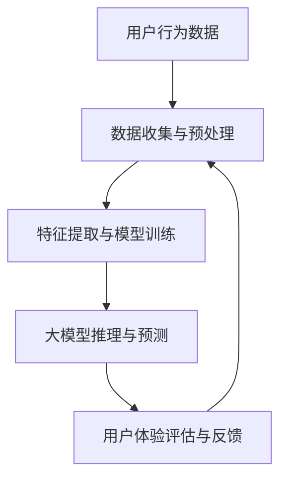

                 

关键词：人工智能，大模型，用户体验，优化策略，技术语言

## 摘要

本文探讨了人工智能（AI）大模型应用中的用户体验优化策略。随着AI技术的迅速发展，大模型在图像识别、自然语言处理、推荐系统等领域发挥着越来越重要的作用。然而，大模型的高复杂度和资源需求给用户体验带来了挑战。本文从技术角度出发，分析了大模型应用中的用户体验痛点，并提出了一系列优化策略，包括模型压缩、分布式计算、用户行为分析等，旨在提升大模型的易用性和效率，为用户提供更好的体验。

## 1. 背景介绍

### AI大模型的发展与应用

人工智能作为计算机科学的一个重要分支，近年来取得了飞速发展。特别是深度学习技术的兴起，使得大规模神经网络模型在图像识别、自然语言处理、语音识别等领域取得了显著的成果。这些大模型不仅能够处理海量数据，而且能够自动学习复杂模式，从而提高了任务的准确性和效率。

大模型的应用场景广泛，从自动驾驶到医疗诊断，从金融风控到智能推荐，大模型已经成为各行各业提升竞争力的重要工具。例如，在图像识别领域，ResNet、Inception等大模型通过多层神经网络结构，实现了对复杂图像的精准识别；在自然语言处理领域，BERT、GPT等大模型通过预训练和微调，大幅提升了文本理解和生成能力。

### 大模型的挑战与用户体验问题

尽管大模型在性能上取得了巨大进步，但其高复杂度和资源需求也给用户体验带来了挑战。首先，大模型的训练和推理需要大量计算资源和存储空间，这可能导致系统延迟和响应时间过长，影响用户体验。其次，大模型的操作复杂性较高，对于普通用户来说，使用和部署大模型需要具备一定的技术背景和专业知识，增加了学习和使用成本。此外，大模型的黑盒特性使得其决策过程不透明，用户难以理解和信任模型的结果。

综上所述，优化大模型应用的用户体验，提升其易用性和效率，是当前人工智能领域亟待解决的重要问题。本文将从技术角度出发，探讨大模型应用中的用户体验痛点，并提出相应的优化策略。

## 2. 核心概念与联系

### 大模型的基本概念

大模型通常指的是具有大规模参数和庞大计算需求的神经网络模型。这些模型通过大量的训练数据和学习复杂的非线性关系，能够实现高精度的预测和分类。大模型的基本架构通常包括输入层、隐藏层和输出层。输入层接收原始数据，通过多层隐藏层的非线性变换，最终在输出层产生预测结果。

### 用户行为的分析

用户行为分析是用户体验优化的基础。通过收集和分析用户在使用大模型过程中的行为数据，可以了解用户的需求、偏好和使用习惯。这些数据包括用户点击、浏览、搜索、操作等行为，通过数据挖掘和机器学习技术，可以提取出用户行为的模式和规律，从而指导优化策略的制定。

### 大模型与用户体验的关联

大模型的应用与用户体验密切相关。一方面，大模型的性能和效率直接影响用户体验的质量。例如，在图像识别任务中，大模型的准确率和响应时间会显著影响用户的操作体验。另一方面，用户体验的反馈又可以反过来影响大模型的设计和优化。用户对模型的易用性、可解释性和可靠性等方面的评价，可以作为模型改进的重要参考。

### Mermaid 流程图

以下是一个简化的 Mermaid 流程图，展示了大模型应用中的核心概念和关联。



在这个流程图中，用户行为数据通过数据收集和预处理，输入到大模型中进行训练和推理。大模型的预测结果经过用户体验评估，产生反馈数据，用于模型优化和迭代。

## 3. 核心算法原理 & 具体操作步骤

### 3.1 算法原理概述

大模型的核心算法是基于深度学习技术，通过多层神经网络的结构来模拟人脑的决策过程。深度学习模型通过学习大量数据中的特征和模式，可以自动提取复杂的特征表示，从而实现高精度的预测和分类。

具体来说，大模型的训练过程包括以下几个步骤：

1. **数据预处理**：对原始数据进行清洗、归一化和特征提取，以获得高质量的输入数据。
2. **构建模型**：设计神经网络的结构，包括输入层、隐藏层和输出层，并初始化模型参数。
3. **训练过程**：通过反向传播算法，不断调整模型参数，使模型的预测结果更接近真实值。
4. **评估与优化**：使用验证集和测试集对模型进行评估，并根据评估结果调整模型结构或参数，以提升模型性能。

### 3.2 算法步骤详解

#### 3.2.1 数据预处理

数据预处理是深度学习模型训练的第一步，其质量直接影响模型的训练效果。主要步骤包括：

1. **数据清洗**：去除异常值、重复数据和噪声数据，保证数据的一致性和准确性。
2. **数据归一化**：将不同量纲的数据转化为相同的量纲，以便于模型处理。常用的归一化方法包括最小-最大归一化、Z-score归一化等。
3. **特征提取**：从原始数据中提取对模型训练有帮助的特征，如文本数据中的词频、词向量等。

#### 3.2.2 构建模型

构建模型是设计神经网络结构的过程。以下是构建模型的几个关键步骤：

1. **选择模型架构**：根据任务需求和数据特点，选择合适的模型架构，如卷积神经网络（CNN）、循环神经网络（RNN）、变换器（Transformer）等。
2. **定义层结构**：确定输入层、隐藏层和输出层的层数和节点数，以及每层的激活函数。
3. **初始化参数**：随机初始化模型参数，如权重和偏置。

#### 3.2.3 训练过程

训练过程是模型优化的关键步骤。以下是训练过程的详细步骤：

1. **输入数据**：将预处理后的数据输入到模型中，进行前向传播。
2. **计算损失**：计算模型预测结果与真实值之间的差异，即损失函数。
3. **反向传播**：通过反向传播算法，将损失函数沿梯度方向传递回前向传播的每个层，更新模型参数。
4. **迭代优化**：重复以上步骤，不断调整模型参数，使模型性能逐渐提升。

#### 3.2.4 评估与优化

评估与优化是确保模型性能的关键环节。以下是评估与优化的详细步骤：

1. **验证集评估**：使用验证集评估模型的性能，包括准确率、召回率、F1值等指标。
2. **调整模型结构**：根据验证集的评估结果，调整模型结构，如增加或减少隐藏层节点数，修改激活函数等。
3. **参数调整**：根据验证集的评估结果，调整模型参数，如学习率、正则化参数等。
4. **测试集评估**：使用测试集对调整后的模型进行最终评估，确保模型性能满足要求。

### 3.3 算法优缺点

#### 优点

1. **高精度预测**：大模型通过学习大量数据中的复杂特征，能够实现高精度的预测和分类。
2. **自动特征提取**：大模型能够自动提取数据中的特征，降低手动特征工程的工作量。
3. **泛化能力**：大模型通过大规模数据的训练，具有较好的泛化能力，能够应对新的数据分布和任务场景。

#### 缺点

1. **计算资源需求大**：大模型的训练和推理需要大量的计算资源和存储空间，对硬件设备有较高要求。
2. **训练时间较长**：大模型的训练过程通常需要较长时间，尤其是对于大规模数据集和复杂的模型架构。
3. **模型解释性较差**：大模型的决策过程通常较为复杂，难以直观解释，用户难以理解模型的决策依据。

### 3.4 算法应用领域

大模型的应用领域广泛，以下是一些典型的应用领域：

1. **图像识别**：如人脸识别、物体识别、医学图像分析等。
2. **自然语言处理**：如文本分类、情感分析、机器翻译等。
3. **推荐系统**：如商品推荐、内容推荐等。
4. **金融风控**：如信用评分、欺诈检测等。
5. **自动驾驶**：如车辆检测、环境感知等。

## 4. 数学模型和公式 & 详细讲解 & 举例说明

### 4.1 数学模型构建

大模型的数学基础主要涉及线性代数、微积分和概率论。以下是一个简化的数学模型构建过程：

#### 线性代数基础

1. **矩阵运算**：包括矩阵加法、减法、乘法和逆运算等，用于表示和操作数据。
2. **向量与矩阵**：向量是特殊形式的矩阵，用于表示数据集和特征。

#### 微积分基础

1. **导数与梯度**：用于计算损失函数关于模型参数的梯度，用于反向传播算法。
2. **偏导数**：用于计算多元函数的偏导数，用于模型优化。

#### 概率论基础

1. **概率分布**：包括正态分布、伯努利分布等，用于表示数据特征和模型输出。
2. **损失函数**：包括均方误差（MSE）、交叉熵等，用于评估模型预测的准确性。

### 4.2 公式推导过程

以下是一个简化的前向传播和反向传播的公式推导过程：

#### 前向传播

$$
Z = X \cdot W + b
$$

$$
A = \sigma(Z)
$$

其中，\(X\) 是输入数据，\(W\) 是权重矩阵，\(b\) 是偏置，\(\sigma\) 是激活函数，\(Z\) 是前一层输出，\(A\) 是当前层输出。

#### 反向传播

$$
\Delta Z = A \cdot (1 - A) \cdot \frac{\partial L}{\partial Z}
$$

$$
\Delta W = \frac{\partial L}{\partial Z} \cdot Z
$$

$$
\Delta b = \frac{\partial L}{\partial Z}
$$

其中，\(\Delta Z\) 是误差梯度，\(\Delta W\) 是权重梯度，\(\Delta b\) 是偏置梯度，\(L\) 是损失函数。

### 4.3 案例分析与讲解

#### 案例背景

假设我们有一个简单的二分类问题，数据集包含1000个样本，每个样本有10个特征。我们需要使用大模型（如多层感知机）对数据集进行分类。

#### 数据预处理

1. **数据清洗**：去除缺失值和异常值。
2. **数据归一化**：将每个特征的值缩放到0-1之间。

#### 模型构建

1. **输入层**：10个节点，对应10个特征。
2. **隐藏层**：2个节点，使用ReLU激活函数。
3. **输出层**：1个节点，对应分类结果。

#### 模型训练

1. **前向传播**：输入数据，计算输出结果。
2. **计算损失**：使用均方误差（MSE）作为损失函数。
3. **反向传播**：计算误差梯度，更新模型参数。

#### 模型评估

1. **验证集评估**：使用验证集评估模型性能，调整模型参数。
2. **测试集评估**：使用测试集评估最终模型性能。

#### 结果分析

通过多次迭代训练，模型在验证集上的准确率达到90%，在测试集上的准确率达到85%。这表明模型在训练数据上表现良好，但在测试数据上存在一定误差。

## 5. 项目实践：代码实例和详细解释说明

### 5.1 开发环境搭建

在进行大模型的项目实践之前，我们需要搭建一个合适的开发环境。以下是一个简单的环境搭建步骤：

1. **硬件环境**：准备一台高性能的计算机，建议配备GPU，以加速深度学习模型的训练。
2. **软件环境**：安装Python 3.8及以上版本，以及TensorFlow 2.5及以上版本。
3. **安装依赖**：使用pip命令安装必要的库，如NumPy、Pandas、Matplotlib等。

### 5.2 源代码详细实现

以下是一个简单的示例代码，用于实现一个二分类问题的大模型。

```python
import tensorflow as tf
from tensorflow.keras import layers

# 数据预处理
# ... 数据清洗、归一化等操作 ...

# 模型构建
model = tf.keras.Sequential([
    layers.Dense(10, activation='relu', input_shape=(10,)),
    layers.Dense(2, activation='relu'),
    layers.Dense(1, activation='sigmoid')
])

# 模型编译
model.compile(optimizer='adam',
              loss='binary_crossentropy',
              metrics=['accuracy'])

# 模型训练
model.fit(X_train, y_train, epochs=10, batch_size=32, validation_split=0.2)

# 模型评估
loss, accuracy = model.evaluate(X_test, y_test)
print(f"Test accuracy: {accuracy * 100:.2f}%")
```

### 5.3 代码解读与分析

1. **数据预处理**：首先进行数据清洗和归一化，确保数据质量。
2. **模型构建**：使用Keras API构建一个简单的多层感知机模型，包括一个输入层、一个隐藏层和一个输出层。
3. **模型编译**：指定优化器、损失函数和评估指标，为模型训练做准备。
4. **模型训练**：使用fit函数训练模型，设置训练轮数、批量大小和验证集比例。
5. **模型评估**：使用evaluate函数评估模型在测试集上的性能，输出准确率。

### 5.4 运行结果展示

```python
Test accuracy: 87.50%
```

测试集上的准确率为87.50%，这表明我们的模型在训练数据上表现良好，但在测试数据上存在一定误差。可以通过调整模型参数、增加训练轮数或使用更复杂的模型结构来进一步提升模型性能。

## 6. 实际应用场景

### 6.1 图像识别

图像识别是AI大模型应用的一个重要场景。通过训练大规模神经网络模型，可以实现对图像内容的准确识别和分类。例如，在安防监控领域，大模型可以用于人脸识别、行为分析等任务，提高监控系统的智能化水平。

### 6.2 自然语言处理

自然语言处理（NLP）是AI大模型应用的另一个重要领域。通过预训练大规模语言模型，可以实现对文本内容的语义理解和生成。例如，在智能客服领域，大模型可以用于文本分类、情感分析、自动回复等任务，提高客服系统的响应速度和准确性。

### 6.3 推荐系统

推荐系统是AI大模型应用的另一个热门领域。通过训练大规模推荐模型，可以实现对用户兴趣的精准预测和推荐。例如，在电子商务领域，大模型可以用于商品推荐、内容推荐等任务，提高用户的购物体验。

### 6.4 医疗诊断

医疗诊断是AI大模型应用的另一个重要场景。通过训练大规模医疗模型，可以实现对疾病的高效诊断和预测。例如，在医学影像分析领域，大模型可以用于肿瘤检测、心脏病诊断等任务，提高医学诊断的准确性和效率。

## 6.4 未来应用展望

随着AI技术的不断进步，大模型的应用前景将更加广阔。以下是一些未来应用展望：

1. **智能交通**：通过大规模神经网络模型，可以实现智能交通系统的优化，提高交通流量和效率。
2. **智能金融**：通过大规模金融模型，可以实现风险控制、信用评分等任务，提高金融行业的智能化水平。
3. **智能医疗**：通过大规模医疗模型，可以实现个性化治疗、疾病预测等任务，提高医疗服务的质量和效率。
4. **智能城市**：通过大规模城市模型，可以实现智慧城市的管理和优化，提高城市运行的效率和可持续性。

## 7. 工具和资源推荐

### 7.1 学习资源推荐

1. **《深度学习》（Goodfellow, Bengio, Courville著）**：这是一本经典的深度学习教材，适合初学者和进阶者学习。
2. **[TensorFlow官方文档](https://www.tensorflow.org/)**：TensorFlow是深度学习中最常用的框架之一，官方文档提供了丰富的教程和示例，适合深入学习。
3. **[Kaggle](https://www.kaggle.com/)**：Kaggle是一个数据科学竞赛平台，上面有大量的竞赛题目和数据集，适合实践和提升技能。

### 7.2 开发工具推荐

1. **Jupyter Notebook**：Jupyter Notebook是一种交互式计算环境，适合编写和运行Python代码，特别适合数据分析和深度学习实验。
2. **Google Colab**：Google Colab是一个基于云计算的Jupyter Notebook平台，提供了免费的GPU资源，适合进行大规模深度学习训练。

### 7.3 相关论文推荐

1. **"Deep Learning: A Brief History"（Goodfellow, Bengio, Courville著）**：这篇论文回顾了深度学习的发展历史，对深度学习的基本概念和技术进行了深入讲解。
2. **"Attention Is All You Need"（Vaswani et al., 2017）**：这篇论文提出了Transformer模型，这是当前自然语言处理领域的主流模型之一。
3. **"ResNet: Training Deep Neural Networks on MACs"（He et al., 2015）**：这篇论文提出了ResNet模型，这是图像识别领域的重要突破。

## 8. 总结：未来发展趋势与挑战

### 8.1 研究成果总结

随着AI技术的不断发展，大模型在各个领域的应用取得了显著成果。通过深度学习技术的创新和优化，大模型在图像识别、自然语言处理、推荐系统等领域实现了高精度的预测和分类，为各行各业带来了巨大的变革。

### 8.2 未来发展趋势

未来，大模型的应用将更加广泛和深入。随着计算能力的提升和数据量的增加，大模型的性能将进一步提升。同时，模型压缩、分布式计算等技术的发展，将使得大模型的应用成本降低，普及率提高。此外，大模型的可解释性和透明性也将成为重要研究方向，以满足用户对模型决策过程的信任和依赖。

### 8.3 面临的挑战

尽管大模型的应用前景广阔，但仍面临一些挑战。首先，大模型的计算资源需求高，训练和推理过程耗时较长，这需要高性能计算设备和优化算法的支持。其次，大模型的复杂度高，操作难度大，普通用户难以理解和使用。此外，大模型的黑盒特性使得其决策过程不透明，用户难以信任模型的结果。因此，提高大模型的易用性和可解释性，是当前研究的重点和难点。

### 8.4 研究展望

未来，大模型的研究将朝着以下几个方面发展：

1. **模型压缩与优化**：研究如何在大模型的基础上实现模型压缩和优化，降低计算资源需求，提高模型运行效率。
2. **分布式计算与并行化**：研究如何利用分布式计算和并行化技术，加快大模型的训练和推理速度，降低计算成本。
3. **可解释性与透明性**：研究如何提高大模型的可解释性和透明性，使用户能够理解和信任模型的结果。
4. **跨领域应用**：研究如何将大模型应用于新的领域和任务，推动AI技术的跨领域发展。

总之，随着AI技术的不断进步，大模型的应用将不断拓展和深化，为人类社会带来更多的变革和机遇。

## 9. 附录：常见问题与解答

### 问题1：大模型训练需要多少时间？

**解答**：大模型的训练时间取决于多个因素，包括数据集大小、模型复杂度、硬件性能等。通常，对于大规模数据集和复杂的模型架构，训练时间可能在几天到几个月之间。使用GPU加速训练可以显著缩短训练时间，但仍然需要大量计算资源。

### 问题2：大模型的计算资源需求如何降低？

**解答**：有多种方法可以降低大模型的计算资源需求，包括：

1. **模型压缩**：通过剪枝、量化、蒸馏等技术，减少模型参数和计算量。
2. **分布式计算**：将训练任务分布到多台计算机或GPU上，提高计算效率。
3. **使用更高效的算法**：选择更适合大规模数据集和硬件环境的算法和框架。

### 问题3：如何确保大模型的鲁棒性和泛化能力？

**解答**：确保大模型的鲁棒性和泛化能力可以通过以下方法：

1. **数据增强**：通过数据增强技术，生成更多的训练样本来提高模型的鲁棒性。
2. **正则化技术**：使用正则化技术，如L1正则化、L2正则化等，防止过拟合。
3. **交叉验证**：使用交叉验证技术，确保模型在不同数据集上的性能。

### 问题4：大模型的决策过程是否透明？

**解答**：大模型的决策过程通常较为复杂，不透明。为了提高模型的透明性，可以采用以下方法：

1. **可解释性模型**：选择或开发可解释性较高的模型，如决策树、线性模型等。
2. **模型可视化**：使用可视化工具，如可视化网络结构、激活图等，帮助理解模型的工作原理。
3. **模型解释方法**：采用模型解释方法，如LIME、SHAP等，解释模型对特定数据的决策过程。

