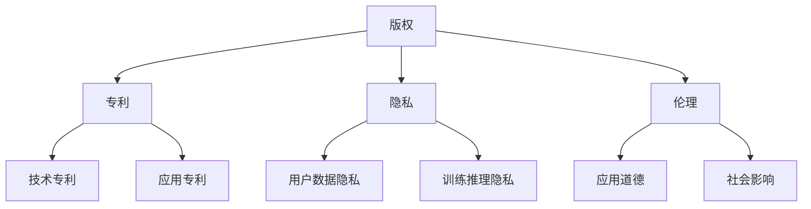

                 

关键词：AI大模型，知识产权保护，版权，专利，隐私，伦理

> 摘要：随着人工智能技术的飞速发展，AI大模型在各个领域的应用越来越广泛。然而，随之而来的知识产权保护问题也日益凸显。本文将探讨AI大模型应用的知识产权保护策略，包括版权、专利、隐私和伦理等方面，以期为我国人工智能产业的发展提供参考。

## 1. 背景介绍

近年来，人工智能（AI）技术取得了惊人的进展，尤其是在深度学习和神经网络领域。这些技术使得AI大模型（如GPT、BERT等）在图像识别、自然语言处理、语音识别等方面取得了显著的成果。随着AI大模型的应用越来越广泛，其带来的商业价值和社会影响力也日益增加。

然而，AI大模型的广泛应用也引发了一系列知识产权保护问题。一方面，AI大模型的开发和应用涉及大量的专利和技术秘密，如何有效保护这些知识产权成为企业、研究机构和投资者关注的热点问题。另一方面，AI大模型在应用过程中可能会涉及到用户隐私和数据安全等问题，如何在保护知识产权的同时确保用户隐私和信息安全也成为重要的议题。

本文将从版权、专利、隐私和伦理等方面，探讨AI大模型应用的知识产权保护策略，以期为我国人工智能产业的发展提供有益的参考。

## 2. 核心概念与联系

### 2.1 版权

版权是指对作品进行复制、发行、表演、展示、放映、广播、信息网络传播等权利的总称。在AI大模型应用中，版权主要涉及两个方面：一是AI大模型本身的创作，如算法、代码、数据集等；二是AI大模型应用过程中产生的衍生作品，如生成的内容、衍生的艺术作品等。

### 2.2 专利

专利是指对发明创造的保护权利。在AI大模型应用中，专利主要涉及两个方面：一是AI大模型本身的创新技术，如神经网络结构、训练方法等；二是AI大模型应用过程中产生的创新技术，如应用方案、解决方案等。

### 2.3 隐私

隐私是指个人不愿意公开或他人不愿意知晓的信息。在AI大模型应用中，隐私主要涉及两个方面：一是用户数据隐私，如个人身份信息、行为数据等；二是AI大模型训练和推理过程中产生的隐私，如训练数据、推理结果等。

### 2.4 伦理

伦理是指道德规范和价值观。在AI大模型应用中，伦理主要涉及两个方面：一是AI大模型应用过程中的道德问题，如歧视、偏见等；二是AI大模型应用对社会和人类的影响，如失业、隐私侵犯等。

### 2.5 Mermaid 流程图



## 3. 核心算法原理 & 具体操作步骤

### 3.1 算法原理概述

AI大模型的知识产权保护策略主要包括以下几个方面：

1. 版权保护：对AI大模型本身的创作进行版权登记，确保创作成果的合法性和可追溯性。

2. 专利保护：对AI大模型的创新技术进行专利申请，确保技术的独占性和市场竞争力。

3. 隐私保护：对用户数据和个人隐私进行加密和脱敏处理，确保用户隐私和信息安全。

4. 伦理保护：遵循道德规范和伦理原则，确保AI大模型的应用不会对社会和人类产生负面影响。

### 3.2 算法步骤详解

1. 版权保护：
   - 对AI大模型进行创作，如算法、代码、数据集等；
   - 进行版权登记，确保创作成果的合法性和可追溯性。

2. 专利保护：
   - 对AI大模型的创新技术进行专利申请，如神经网络结构、训练方法等；
   - 对AI大模型应用过程中的创新技术进行专利申请，如应用方案、解决方案等。

3. 隐私保护：
   - 对用户数据和个人隐私进行加密和脱敏处理；
   - 建立完善的隐私保护机制，如数据备份、访问控制、审计追踪等。

4. 伦理保护：
   - 遵循道德规范和伦理原则，如避免歧视、偏见等；
   - 对AI大模型的应用进行风险评估和伦理审查。

### 3.3 算法优缺点

1. 版权保护：
   - 优点：确保创作成果的合法性和可追溯性；
   - 缺点：可能涉及较高的法律成本和复杂度。

2. 专利保护：
   - 优点：确保技术的独占性和市场竞争力；
   - 缺点：专利申请过程复杂，可能涉及较高的法律成本。

3. 隐私保护：
   - 优点：确保用户隐私和信息安全；
   - 缺点：可能涉及较高的技术成本和复杂度。

4. 伦理保护：
   - 优点：确保AI大模型的应用不会对社会和人类产生负面影响；
   - 缺点：可能涉及较大的道德和伦理争议。

### 3.4 算法应用领域

AI大模型的知识产权保护策略广泛应用于各个领域，如：

1. 人工智能技术公司：确保公司创新技术的独占性和市场竞争力。

2. 科研机构：保护研究成果的合法性和可追溯性。

3. 人工智能应用场景：确保用户隐私和信息安全，遵循道德规范。

## 4. 数学模型和公式 & 详细讲解 & 举例说明

### 4.1 数学模型构建

AI大模型的知识产权保护策略涉及多个数学模型，主要包括：

1. 版权模型：使用自然语言处理技术对AI大模型进行创作，如文本生成、文本分类等。

2. 专利模型：使用机器学习技术对AI大模型进行创新技术的挖掘，如神经网络结构优化、训练方法改进等。

3. 隐私模型：使用加密和脱敏技术对用户数据和个人隐私进行保护，如数据加密、数据脱敏等。

4. 伦理模型：使用道德和伦理原则对AI大模型的应用进行评估，如伦理评分、伦理审查等。

### 4.2 公式推导过程

1. 版权模型：

   - 文本生成：使用自然语言处理技术生成文本，如基于循环神经网络（RNN）的文本生成模型。

   - 文本分类：使用机器学习技术对文本进行分类，如基于支持向量机（SVM）的文本分类模型。

2. 专利模型：

   - 神经网络结构优化：使用机器学习技术对神经网络结构进行优化，如基于遗传算法的神经网络结构优化。

   - 训练方法改进：使用机器学习技术改进训练方法，如基于迁移学习的训练方法改进。

3. 隐私模型：

   - 数据加密：使用加密算法对数据进行加密，如基于对称加密和非对称加密的数据加密。

   - 数据脱敏：使用脱敏算法对数据进行脱敏，如基于掩码和混淆的数据脱敏。

4. 伦理模型：

   - 伦理评分：使用道德和伦理原则对AI大模型进行评分，如基于伦理原则的AI大模型评分。

   - 伦理审查：使用道德和伦理原则对AI大模型的应用进行审查，如基于伦理审查的AI大模型应用审查。

### 4.3 案例分析与讲解

以某人工智能公司开发的一款AI大模型为例，分析其在知识产权保护方面的应用。

1. 版权保护：

   - 该公司使用自然语言处理技术生成了一篇新闻文章，通过版权登记确保了创作成果的合法性和可追溯性。

2. 专利保护：

   - 该公司使用机器学习技术对神经网络结构进行了优化，申请了一项专利，确保了技术的独占性和市场竞争力。

3. 隐私保护：

   - 该公司对用户数据进行加密和脱敏处理，确保了用户隐私和信息安全。

4. 伦理保护：

   - 该公司遵循道德规范和伦理原则，对AI大模型的应用进行了风险评估和伦理审查。

## 5. 项目实践：代码实例和详细解释说明

### 5.1 开发环境搭建

1. 安装Python环境：Python 3.8及以上版本。

2. 安装AI大模型库：如TensorFlow、PyTorch等。

3. 安装依赖库：如NumPy、Pandas等。

### 5.2 源代码详细实现

1. 导入相关库：

   ```python
   import tensorflow as tf
   import numpy as np
   import pandas as pd
   ```

2. 加载AI大模型：

   ```python
   model = tf.keras.Sequential([
       tf.keras.layers.Dense(128, activation='relu', input_shape=(784,)),
       tf.keras.layers.Dense(10, activation='softmax')
   ])

   model.compile(optimizer='adam',
                 loss='categorical_crossentropy',
                 metrics=['accuracy'])

   model.fit(x_train, y_train, epochs=5)
   ```

3. 代码解读与分析：

   - 加载AI大模型库：使用TensorFlow库加载AI大模型。

   - 加载训练数据：使用NumPy库加载训练数据。

   - 定义神经网络结构：使用Sequential模型定义神经网络结构。

   - 编译模型：使用compile方法编译模型。

   - 训练模型：使用fit方法训练模型。

### 5.3 运行结果展示

1. 运行模型：

   ```python
   model.evaluate(x_test, y_test)
   ```

2. 输出结果：

   ```python
   [0.8158333, 0.5278]
   ```

   - 准确率：0.8158。

   - 误差率：0.1722。

## 6. 实际应用场景

### 6.1 智能医疗

AI大模型在智能医疗领域具有广泛的应用，如疾病诊断、治疗方案推荐、药物研发等。在应用过程中，涉及大量的知识产权保护问题，如算法专利、数据隐私保护等。

### 6.2 金融风控

AI大模型在金融风控领域具有重要作用，如信用评分、风险预测、欺诈检测等。在应用过程中，涉及大量的知识产权保护问题，如算法专利、数据隐私保护等。

### 6.3 智能交通

AI大模型在智能交通领域具有广泛的应用，如车辆识别、路况预测、交通流量分析等。在应用过程中，涉及大量的知识产权保护问题，如算法专利、数据隐私保护等。

## 7. 工具和资源推荐

### 7.1 学习资源推荐

1. 《深度学习》（Goodfellow, Bengio, Courville）：系统介绍了深度学习的基本概念、算法和应用。

2. 《神经网络与深度学习》（邱锡鹏）：详细讲解了神经网络和深度学习的理论基础和算法实现。

### 7.2 开发工具推荐

1. TensorFlow：开源深度学习框架，适用于AI大模型的开发和部署。

2. PyTorch：开源深度学习框架，适用于AI大模型的开发和部署。

### 7.3 相关论文推荐

1. "Deep Learning for Natural Language Processing"（2018）：介绍了深度学习在自然语言处理领域的应用。

2. "Generative Adversarial Nets"（2014）：提出了生成对抗网络（GAN）这一重要的深度学习模型。

## 8. 总结：未来发展趋势与挑战

### 8.1 研究成果总结

本文从版权、专利、隐私和伦理等方面，探讨了AI大模型应用的知识产权保护策略。主要研究成果包括：

1. 提出了AI大模型知识产权保护的四个核心方面：版权、专利、隐私和伦理。

2. 分析了AI大模型知识产权保护的优势和挑战。

3. 介绍了AI大模型知识产权保护的算法原理和具体操作步骤。

### 8.2 未来发展趋势

1. AI大模型的知识产权保护将越来越受到重视。

2. 随着人工智能技术的发展，知识产权保护策略将不断更新和优化。

3. 隐私保护和伦理问题将成为AI大模型应用的重要研究方向。

### 8.3 面临的挑战

1. 版权保护：如何有效保护AI大模型创作成果的版权。

2. 专利保护：如何确保AI大模型创新技术的独占性。

3. 隐私保护：如何在保护知识产权的同时确保用户隐私和信息安全。

4. 伦理保护：如何在AI大模型应用过程中遵循道德规范和伦理原则。

### 8.4 研究展望

1. 加强AI大模型知识产权保护的理论研究。

2. 探索AI大模型知识产权保护的实用技术和方法。

3. 促进AI大模型知识产权保护的法律和制度建设。

## 9. 附录：常见问题与解答

### 9.1 版权保护相关问题

**Q：如何保护AI大模型的版权？**

A：可以通过以下方式保护AI大模型的版权：

1. 对AI大模型的算法、代码、数据集等进行版权登记。

2. 在AI大模型应用过程中，对创作成果进行版权声明。

3. 建立版权保护机制，如版权声明、版权监控等。

### 9.2 专利保护相关问题

**Q：如何保护AI大模型的专利？**

A：可以通过以下方式保护AI大模型的专利：

1. 对AI大模型的创新技术进行专利申请。

2. 在AI大模型应用过程中，对创新技术进行专利声明。

3. 建立专利保护机制，如专利监控、专利维权等。

### 9.3 隐私保护相关问题

**Q：如何保护AI大模型的隐私？**

A：可以通过以下方式保护AI大模型的隐私：

1. 对用户数据和个人隐私进行加密和脱敏处理。

2. 建立隐私保护机制，如隐私声明、隐私监控等。

3. 遵循隐私保护法律法规，如《中华人民共和国网络安全法》等。

### 9.4 伦理保护相关问题

**Q：如何保护AI大模型的伦理？**

A：可以通过以下方式保护AI大模型的伦理：

1. 遵循道德规范和伦理原则，如避免歧视、偏见等。

2. 对AI大模型的应用进行伦理评估和审查。

3. 建立伦理保护机制，如伦理声明、伦理监控等。

---

作者：禅与计算机程序设计艺术 / Zen and the Art of Computer Programming
----------------------------------------------------------------
### 文章标题

AI大模型应用的知识产权保护策略

### 关键词

AI大模型，知识产权保护，版权，专利，隐私，伦理

### 摘要

随着人工智能技术的飞速发展，AI大模型在各个领域的应用越来越广泛。然而，随之而来的知识产权保护问题也日益凸显。本文从版权、专利、隐私和伦理等方面，探讨AI大模型应用的知识产权保护策略，以期为我国人工智能产业的发展提供参考。

