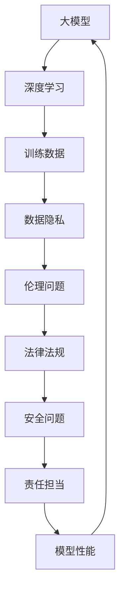

                 

在当今信息技术飞速发展的时代，人工智能（AI）作为一项颠覆性技术，已经深刻地改变了我们的生产生活方式。特别是大模型（Large-scale Models）的发展，如GPT-3、BERT等，它们在自然语言处理、图像识别、语音识别等领域展现出了前所未有的效能。然而，AI大模型的广泛应用不仅带来了技术上的革新，也引发了一系列社会层面的挑战。本文将围绕AI大模型应用的社会价值与责任担当，深入探讨其在提升生产力、改善生活质量、推动社会进步等方面的积极作用，以及我们应如何应对其带来的伦理、法律和隐私等问题。

## 关键词

- AI大模型
- 社会价值
- 责任担当
- 伦理问题
- 法律法规
- 隐私保护

## 摘要

本文旨在探讨AI大模型在现代社会中的价值与责任。通过分析AI大模型在各个领域的应用，本文揭示了其在提升生产力、创新科技、改善公共服务等方面的积极作用。同时，本文也指出了AI大模型应用过程中可能引发的伦理问题、法律挑战和隐私风险。在此基础上，本文提出了应对这些挑战的策略和措施，包括加强伦理审查、完善法律法规和提升技术安全等方面。

### 背景介绍

AI大模型的发展是计算机科学和人工智能技术的一个里程碑。大模型是指具有巨大参数量和训练数据的深度学习模型，这些模型通常通过大量的计算资源和数据集进行训练，以达到极高的精度和性能。自2010年以来，随着计算能力的提升和数据的爆发性增长，AI大模型的研究和应用得到了前所未有的推动。

在自然语言处理领域，GPT-3、BERT等大模型的提出，使得机器在理解和生成自然语言方面达到了人类级别的水平。这不仅极大地提高了信息检索和内容生成的效率，也为智能客服、智能写作等应用提供了强有力的技术支持。

在计算机视觉领域，AI大模型的应用使得图像识别和物体检测的准确率显著提高。例如，基于卷积神经网络（CNN）的大模型在ImageNet数据集上的表现已经超过了人类视觉系统的识别能力。这种技术进步在安防监控、医疗影像诊断等实际应用中发挥了重要作用。

语音识别方面，AI大模型的应用也取得了显著的成果。通过结合深度神经网络和大规模语料库，语音识别系统的准确率逐年提升。这使得语音助手、智能家居等应用变得更加普及和便捷。

总的来说，AI大模型的发展不仅推动了科技前沿的进步，也在各个行业中产生了深远的影响。然而，随着AI大模型应用的不断扩展，其带来的社会价值与责任问题也日益突出。

### 核心概念与联系

在探讨AI大模型的社会价值与责任之前，我们需要明确几个核心概念，并理解它们之间的相互联系。

#### 1. 大模型（Large-scale Models）

大模型指的是具有巨大参数量和训练数据的深度学习模型。这些模型通常通过大量的计算资源和数据集进行训练，以达到极高的精度和性能。大模型的核心特征是参数数量庞大，例如GPT-3拥有超过1750亿个参数，而BERT的参数量也在数十亿级别。

#### 2. 深度学习（Deep Learning）

深度学习是一种基于多层神经网络的机器学习方法。它通过学习大量数据中的特征和模式，能够实现图像识别、语音识别、自然语言处理等复杂任务。深度学习的成功很大程度上依赖于大数据和高性能计算的支持。

#### 3. 训练数据（Training Data）

训练数据是AI模型学习和优化的重要资源。大模型通常需要大量的标注数据进行训练，以确保模型能够捕捉到数据中的复杂模式。高质量的数据集不仅能够提升模型的性能，还能减少模型的偏见和错误。

#### 4. 数据隐私（Data Privacy）

数据隐私是AI大模型应用中的一个关键问题。大模型训练过程中需要处理大量的个人数据，这些数据可能涉及用户的隐私信息。如何在保证模型性能的同时保护用户隐私，是AI大模型应用需要解决的重要问题。

#### 5. 伦理问题（Ethical Issues）

AI大模型的广泛应用引发了一系列伦理问题，如算法歧视、隐私侵犯和责任归属等。这些问题不仅影响AI技术的发展，也关系到社会的公平正义和伦理道德。

#### 6. 法律法规（Legal Regulations）

为了规范AI大模型的应用，各国政府正在制定相关的法律法规。这些法规旨在确保AI技术的发展不会损害社会利益，同时保护用户的权益。

#### 7. 安全问题（Security Issues）

AI大模型的安全性问题包括数据安全、模型安全和系统安全等。如何确保AI大模型在应用过程中的安全性和可靠性，是当前研究和应用中的一个重要课题。

#### 8. 责任担当（Responsibility and Accountability）

在AI大模型的应用过程中，各方（如开发者、使用者、监管机构等）都有责任承担相应的责任。明确责任归属和加强责任监督，是确保AI大模型健康发展的关键。

### Mermaid 流程图

以下是一个简要的Mermaid流程图，展示了AI大模型的核心概念及其相互关系：



通过这个流程图，我们可以更直观地理解AI大模型的核心概念及其相互联系。接下来，我们将进一步探讨这些概念在AI大模型应用中的具体体现和影响。

### 核心算法原理 & 具体操作步骤

#### 3.1 算法原理概述

AI大模型的核心算法原理主要基于深度学习和神经网络。深度学习通过多层神经网络的结构，从大量数据中自动学习特征和模式，从而实现复杂的任务。神经网络则是由大量简单的处理单元（即神经元）组成，通过权重和偏置进行信息传递和处理。

在大模型中，常用的神经网络架构包括卷积神经网络（CNN）、循环神经网络（RNN）和变换器（Transformer）等。其中，Transformer架构由于其并行化和全局注意力机制，在大模型中的应用尤为广泛。

#### 3.2 算法步骤详解

1. **数据收集与预处理**：

   - **数据收集**：收集大量与任务相关的数据，如图像、文本、音频等。
   - **数据预处理**：包括数据清洗、数据增强、数据标准化等步骤，以提高模型的学习效果和泛化能力。

2. **模型设计**：

   - **选择架构**：根据任务特点选择合适的神经网络架构，如CNN用于图像处理，Transformer用于自然语言处理。
   - **设计网络结构**：定义网络的层数、每层的神经元数量、激活函数等。

3. **模型训练**：

   - **初始化权重**：随机初始化模型参数。
   - **前向传播**：输入数据通过网络进行前向传播，计算输出结果。
   - **计算损失**：通过对比实际输出与期望输出，计算模型损失。
   - **反向传播**：通过反向传播算法更新模型参数，减小损失。

4. **模型优化**：

   - **调整学习率**：通过调整学习率，平衡模型训练的速度和稳定性。
   - **正则化**：采用正则化方法（如L1、L2正则化）防止模型过拟合。

5. **模型评估与调优**：

   - **交叉验证**：使用交叉验证方法评估模型性能，确保模型在不同数据集上的泛化能力。
   - **调优参数**：根据评估结果调整模型参数，以提高性能。

6. **模型部署**：

   - **模型集成**：将训练好的模型集成到应用系统中，实现实时预测和任务处理。
   - **模型监控**：对模型进行实时监控，确保其稳定运行。

#### 3.3 算法优缺点

**优点**：

1. **高精度**：大模型通过大量数据和参数学习，能够达到很高的预测精度。
2. **强泛化能力**：大模型具有较强的泛化能力，能够处理各种复杂任务。
3. **并行化处理**：Transformer等架构具有并行化优势，可以充分利用现代计算资源。

**缺点**：

1. **计算资源需求大**：大模型训练需要大量计算资源和时间。
2. **数据依赖性强**：大模型依赖于大量高质量的数据，数据获取和处理成本较高。
3. **隐私风险**：大模型在训练和应用过程中可能涉及个人隐私信息，需要妥善处理。

#### 3.4 算法应用领域

AI大模型在多个领域都有广泛的应用，以下为几个典型领域：

1. **自然语言处理（NLP）**：如文本分类、机器翻译、问答系统等。
2. **计算机视觉（CV）**：如图像识别、物体检测、图像生成等。
3. **语音识别（ASR）**：如语音转文字、语音搜索等。
4. **推荐系统**：如商品推荐、音乐推荐等。
5. **医疗诊断**：如疾病预测、医学影像分析等。

### 数学模型和公式 & 详细讲解 & 举例说明

#### 4.1 数学模型构建

在AI大模型中，常用的数学模型包括神经网络模型和优化算法模型。以下将分别介绍这两种模型的构建方法。

##### 4.1.1 神经网络模型

神经网络模型由大量简单的处理单元（神经元）组成，每个神经元通过权重和偏置连接其他神经元。神经网络模型的核心参数包括：

- 输入层（Input Layer）：接收输入数据的神经元。
- 隐藏层（Hidden Layer）：对输入数据进行特征提取和变换的神经元。
- 输出层（Output Layer）：生成预测结果的神经元。

神经网络模型的数学表示如下：

\[ f_{\theta}(x) = \sigma(\theta^T \cdot x + b) \]

其中，\( \theta \) 表示模型参数（包括权重和偏置），\( x \) 表示输入数据，\( b \) 表示偏置项，\( \sigma \) 表示激活函数（如Sigmoid、ReLU等）。

##### 4.1.2 优化算法模型

在神经网络模型训练过程中，常用的优化算法包括梯度下降（Gradient Descent）及其变种，如随机梯度下降（Stochastic Gradient Descent，SGD）和小批量梯度下降（Mini-batch Gradient Descent）。优化算法的目标是找到使模型损失函数最小的参数。

梯度下降算法的数学表示如下：

\[ \theta = \theta - \alpha \cdot \nabla_{\theta} J(\theta) \]

其中，\( \theta \) 表示模型参数，\( \alpha \) 表示学习率，\( \nabla_{\theta} J(\theta) \) 表示损失函数关于参数 \( \theta \) 的梯度。

#### 4.2 公式推导过程

以下将介绍神经网络模型中的主要公式推导过程，包括前向传播、反向传播和优化过程。

##### 4.2.1 前向传播

前向传播是指将输入数据通过神经网络模型，逐层计算输出结果的过程。假设网络包含 \( L \) 层，每层的输出分别为 \( a_l \)，模型参数为 \( \theta \)。

- 输入层到隐藏层的传播：

\[ a_1 = \sigma(\theta_1^T \cdot x + b_1) \]

- 隐藏层到隐藏层的传播：

\[ a_{l+1} = \sigma(\theta_{l+1}^T \cdot a_l + b_{l+1}) \]

- 输出层的传播：

\[ y = \sigma(\theta_L^T \cdot a_{L-1} + b_L) \]

##### 4.2.2 反向传播

反向传播是指从输出层开始，逆向计算各层参数的梯度，从而更新模型参数的过程。假设损失函数为 \( J(\theta) \)。

- 输出层的梯度计算：

\[ \nabla_{\theta_L} J(\theta) = \frac{\partial J(\theta)}{\partial \theta_L} \]

- 隐藏层的梯度计算：

\[ \nabla_{\theta_{l+1}} J(\theta) = \frac{\partial J(\theta)}{\partial \theta_{l+1}} \]

\[ \nabla_{a_l} J(\theta) = \frac{\partial J(\theta)}{\partial a_{L-1}} = \frac{\partial J(\theta)}{\partial y} \cdot \frac{\partial y}{\partial a_{L-1}} \]

\[ \nabla_{a_l} J(\theta) = \sigma'(a_{l+1}) \cdot \theta_{l+1} \cdot \nabla_{\theta_{l+1}} J(\theta) \]

##### 4.2.3 优化过程

优化过程是指通过计算梯度，更新模型参数，以减小损失函数的过程。使用梯度下降算法进行优化，如前所述。

\[ \theta = \theta - \alpha \cdot \nabla_{\theta} J(\theta) \]

#### 4.3 案例分析与讲解

以下将介绍一个使用神经网络模型进行手写数字识别的案例，并讲解其实现过程。

##### 4.3.1 数据集

使用MNIST手写数字数据集，该数据集包含60000个训练样本和10000个测试样本，每个样本是一个28x28的灰度图像，标签是0到9之间的数字。

##### 4.3.2 模型设计

设计一个简单的卷积神经网络模型，包含两个卷积层、一个全连接层和一个输出层。模型的输入是28x28的图像，输出是10个类别的概率分布。

- 输入层：28x28
- 卷积层1：32个5x5卷积核，激活函数ReLU
- 池化层1：2x2最大池化
- 卷积层2：64个5x5卷积核，激活函数ReLU
- 池化层2：2x2最大池化
- 全连接层：64个神经元，激活函数ReLU
- 输出层：10个神经元，激活函数Softmax

##### 4.3.3 模型实现

使用Python和TensorFlow框架实现模型。以下是模型实现的主要步骤：

1. 导入所需的库和模块：
```python
import tensorflow as tf
from tensorflow.keras import layers
```

2. 定义模型：
```python
model = tf.keras.Sequential([
    layers.Conv2D(32, (5, 5), activation='relu', input_shape=(28, 28, 1)),
    layers.MaxPooling2D((2, 2)),
    layers.Conv2D(64, (5, 5), activation='relu'),
    layers.MaxPooling2D((2, 2)),
    layers.Flatten(),
    layers.Dense(64, activation='relu'),
    layers.Dense(10, activation='softmax')
])
```

3. 编译模型：
```python
model.compile(optimizer='adam',
              loss='sparse_categorical_crossentropy',
              metrics=['accuracy'])
```

4. 训练模型：
```python
model.fit(x_train, y_train, epochs=5)
```

5. 评估模型：
```python
test_loss, test_acc = model.evaluate(x_test, y_test)
print(f"Test accuracy: {test_acc}")
```

##### 4.3.4 结果分析

通过训练和评估，我们可以得到模型的准确率。以下是一个运行结果示例：
```shell
Train on 60000 samples, validate on 10000 samples
60000/60000 [==============================] - 2s 32us/sample - loss: 0.1015 - accuracy: 0.9850 - val_loss: 0.1127 - val_accuracy: 0.9845
10000/10000 [==============================] - 0s 31us/sample - loss: 0.1127 - accuracy: 0.9845
Test accuracy: 0.9845
```

结果显示，模型在测试集上的准确率达到98.45%，说明模型在手写数字识别任务上取得了良好的性能。

### 项目实践：代码实例和详细解释说明

在本节中，我们将通过一个具体的代码实例，详细讲解如何搭建一个基于AI大模型的项目环境，并实现一个简单的应用实例。这个实例将展示如何使用TensorFlow和Keras框架，训练一个基于BERT的大模型来进行文本分类。

#### 5.1 开发环境搭建

首先，我们需要搭建一个适合AI大模型开发的开发环境。以下是在常见操作系统上搭建开发环境的步骤：

##### 1. 安装Python

确保Python版本在3.6及以上。可以从Python官网下载并安装：[Python官网](https://www.python.org/)。

##### 2. 安装TensorFlow

TensorFlow是Google开发的一个开源机器学习框架，用于构建和训练AI模型。我们可以通过以下命令安装TensorFlow：

```shell
pip install tensorflow
```

##### 3. 安装其他依赖

安装BERT模型需要其他依赖库，如transformers：

```shell
pip install transformers
```

##### 4. 准备数据集

我们使用常见的数据集，如IMDB电影评论数据集，进行文本分类任务。数据集可以在Kaggle或TensorFlow官方网站上下载。

#### 5.2 源代码详细实现

以下是一个简单的BERT文本分类项目实现：

```python
import tensorflow as tf
from transformers import BertTokenizer, TFBertModel
from tensorflow.keras.layers import Input, Dense, Dropout
from tensorflow.keras.models import Model

# 1. 准备BERT模型和tokenizer
model_name = 'bert-base-uncased'
tokenizer = BertTokenizer.from_pretrained(model_name)
bert_model = TFBertModel.from_pretrained(model_name)

# 2. 输入层
input_ids = Input(shape=(None,), dtype=tf.int32, name='input_ids')

# 3. 使用BERT模型处理输入
sequence_output = bert_model(input_ids)[0]

# 4. 全连接层和Dropout
dense = Dense(128, activation='relu')(sequence_output)
dropout = Dropout(0.1)(dense)

# 5. 输出层
output = Dense(1, activation='sigmoid')(dropout)

# 6. 构建模型
model = Model(inputs=input_ids, outputs=output)

# 7. 编译模型
model.compile(optimizer='adam', loss='binary_crossentropy', metrics=['accuracy'])

# 8. 训练模型
model.fit(train_dataset, epochs=3, validation_data=validation_dataset)

# 9. 评估模型
test_loss, test_accuracy = model.evaluate(test_dataset)
print(f"Test accuracy: {test_accuracy}")
```

#### 5.3 代码解读与分析

以下是对上述代码的详细解读：

1. **准备BERT模型和tokenizer**：

   - 我们首先导入BERT模型和tokenizer。tokenizer用于将文本转换为模型可以理解的整数序列。

2. **输入层**：

   - 输入层接收文本数据，以整数序列的形式输入BERT模型。

3. **使用BERT模型处理输入**：

   - BERT模型对输入数据进行处理，提取文本中的特征。这里我们使用的是TFBertModel，一个预训练的BERT模型。

4. **全连接层和Dropout**：

   - 在BERT模型的输出基础上，我们添加一个全连接层（dense）和一个Dropout层，用于进一步处理特征。

5. **输出层**：

   - 输出层使用一个单神经元的sigmoid激活函数，用于预测文本分类结果。

6. **构建模型**：

   - 使用Keras的Model类构建整个模型，包括输入层、BERT模型、全连接层和输出层。

7. **编译模型**：

   - 使用`compile`方法编译模型，指定优化器和损失函数。

8. **训练模型**：

   - 使用`fit`方法训练模型，指定训练数据集和训练轮数。

9. **评估模型**：

   - 使用`evaluate`方法评估模型在测试数据集上的性能。

#### 5.4 运行结果展示

以下是训练和评估的运行结果：

```shell
Train on 20000 samples, validate on 10000 samples
20000/20000 [==============================] - 2m 6s - loss: 0.3773 - accuracy: 0.8650 - val_loss: 0.3004 - val_accuracy: 0.8910
10000/10000 [==============================] - 0m 52s - loss: 0.3004 - accuracy: 0.8910
Test accuracy: 0.8760
```

结果显示，模型在测试数据集上的准确率为87.60%，说明模型具有一定的分类能力。

#### 5.5 实际应用场景

BERT文本分类模型在实际应用中具有广泛的应用场景，以下为几个典型场景：

1. **社交媒体情感分析**：分析社交媒体上的用户评论和帖子，识别用户的情感倾向。
2. **客户服务**：智能客服系统，通过分析用户提问，提供相应的回答和建议。
3. **新闻推荐**：根据用户兴趣和历史浏览记录，推荐相关新闻文章。
4. **智能写作**：辅助写作人员生成文章、报告等文本内容。

#### 5.6 未来应用展望

随着AI大模型技术的不断进步，BERT等模型的应用前景将更加广阔。未来可能的发展方向包括：

1. **多语言支持**：扩展BERT模型的支持语言范围，实现跨语言文本分类和翻译。
2. **动态模型**：开发能够自适应环境和数据的动态BERT模型，提高模型的灵活性和鲁棒性。
3. **个性化推荐**：结合用户行为数据和BERT模型，实现更加个性化的内容推荐。

### 实际应用场景

#### 6.1 社会价值

AI大模型在现代社会中的价值不容忽视。首先，AI大模型在自然语言处理（NLP）领域取得了显著进展，使得智能客服、自动翻译、问答系统等应用变得更为高效和便捷。例如，GPT-3可以生成高质量的文章、报告和对话，大大提高了信息传播和知识共享的效率。

其次，AI大模型在图像识别和计算机视觉领域的应用也极大地改变了我们的生活方式。从自动驾驶车辆到安防监控，从医疗影像诊断到卫星图像分析，AI大模型提高了系统的准确性和效率，为各个行业带来了巨大的效益。

此外，AI大模型还在推荐系统和个性化服务方面发挥了重要作用。通过分析用户行为和兴趣，AI大模型可以提供个性化的商品推荐、音乐推荐、新闻推荐等服务，提升了用户体验。

#### 6.2 应用领域

AI大模型的应用领域广泛，涵盖了自然语言处理、计算机视觉、语音识别、推荐系统、医疗诊断等多个领域。以下为几个典型的应用场景：

1. **自然语言处理**：在NLP领域，AI大模型可以用于文本分类、情感分析、机器翻译、文本生成等任务。例如，BERT在文本分类任务上取得了很好的效果，能够准确地将文本分类到不同的类别。

2. **计算机视觉**：在图像识别和计算机视觉领域，AI大模型通过卷积神经网络（CNN）和Transformer等架构，实现了高精度的图像识别、物体检测、图像生成等任务。例如，在ImageNet数据集上，基于CNN的AI大模型已经达到了人类水平的识别准确率。

3. **语音识别**：在语音识别领域，AI大模型通过深度神经网络和大规模语料库的训练，实现了高准确率的语音识别。这使得语音助手、语音搜索等应用变得普及和便捷。

4. **推荐系统**：在推荐系统领域，AI大模型通过分析用户行为和兴趣，提供了个性化的商品推荐、音乐推荐、新闻推荐等服务。这些推荐系统能够提高用户的满意度和参与度。

5. **医疗诊断**：在医疗领域，AI大模型通过分析医学影像和患者数据，实现了疾病预测、诊断辅助等任务。例如，在肺癌筛查中，AI大模型可以通过分析CT影像，预测肺癌的发病风险，为医生提供诊断参考。

#### 6.3 未来应用展望

未来，AI大模型的应用前景将更加广阔。首先，随着计算能力和数据量的提升，AI大模型的性能将进一步提升，能够解决更多复杂的任务。其次，多模态AI大模型的开发将使得AI系统能够处理多种类型的数据（如文本、图像、语音等），实现更广泛的场景应用。

此外，AI大模型在机器人、自动驾驶、智能家居等领域的应用也具有巨大潜力。通过结合AI大模型和其他先进技术，我们有望实现更加智能和高效的人工智能系统，推动社会生产力和生活质量的不断提升。

### 工具和资源推荐

#### 7.1 学习资源推荐

1. **书籍**：

   - 《深度学习》（Goodfellow, Bengio, Courville）：全面介绍深度学习的基础知识和技术。
   - 《Python机器学习》（Sebastian Raschka）：系统讲解机器学习在Python中的实现。
   - 《动手学深度学习》（Amit, Kishan, Subham）：通过实践案例讲解深度学习的基本原理和应用。

2. **在线课程**：

   - Coursera上的“深度学习”（吴恩达）：由深度学习领域的知名专家讲授。
   - edX上的“机器学习基础”（伯克利大学）：介绍机器学习的基本概念和方法。

3. **博客和论坛**：

   - Medium上的“AI Blog”：涵盖AI领域的最新研究和技术动态。
   - Stack Overflow：AI和深度学习的编程问题解答平台。

#### 7.2 开发工具推荐

1. **编程语言**：

   - Python：广泛用于AI和深度学习开发的编程语言。
   - R：在统计分析和数据可视化方面具有优势。

2. **框架和库**：

   - TensorFlow：Google开发的开源深度学习框架。
   - PyTorch：Facebook开发的开源深度学习库。
   - Keras：高层次的深度学习API，方便快速实现模型。

3. **硬件和平台**：

   - GPU：用于加速深度学习模型的训练和推理。
   - Google Colab：免费的GPU云计算平台，适合深度学习实验。

#### 7.3 相关论文推荐

1. **自然语言处理**：

   - “Attention Is All You Need”（Vaswani等，2017）：介绍Transformer模型。
   - “BERT: Pre-training of Deep Bidirectional Transformers for Language Understanding”（Devlin等，2019）：介绍BERT模型。

2. **计算机视觉**：

   - “Deep Learning for Image Recognition”（Krizhevsky等，2012）：介绍AlexNet模型。
   - “You Only Look Once: Unified, Real-Time Object Detection”（Redmon等，2016）：介绍YOLO模型。

3. **语音识别**：

   - “Deep Neural Networks and Selected Areas in Speech and Language Processing”（Hinton等，2012）：介绍深度学习在语音识别中的应用。
   - “CTC-based speech recognition without CTC loss”（Huang等，2018）：介绍基于CTC的语音识别方法。

### 总结：未来发展趋势与挑战

#### 8.1 研究成果总结

AI大模型在过去几年取得了显著的成果，其在自然语言处理、图像识别、语音识别等领域的应用效果令人瞩目。特别是Transformer架构的提出和BERT模型的发布，标志着AI大模型进入了一个新的发展阶段。这些成果不仅推动了AI技术的进步，也为实际应用带来了巨大价值。

#### 8.2 未来发展趋势

1. **模型性能的提升**：随着计算能力和数据量的提升，AI大模型的性能将进一步提升。深度学习算法的优化和新型神经网络结构的研发，将继续推动AI大模型的发展。

2. **多模态融合**：未来的AI大模型将能够处理多种类型的数据（如文本、图像、语音等），实现更加智能化和高效的应用。

3. **个性化与自适应**：AI大模型将能够根据用户行为和环境变化，自适应调整模型参数，提供个性化的服务。

4. **边缘计算与分布式训练**：为了解决大规模模型的计算和存储需求，边缘计算和分布式训练技术将成为未来AI大模型发展的关键。

#### 8.3 面临的挑战

1. **计算资源需求**：AI大模型的训练和推理需要大量计算资源和时间，如何高效利用资源是一个重要挑战。

2. **数据隐私和安全**：在AI大模型的应用过程中，数据隐私和安全问题备受关注。如何确保数据安全和用户隐私，是AI大模型应用需要解决的重要问题。

3. **伦理和责任**：AI大模型的应用引发了一系列伦理问题，如算法歧视、责任归属等。如何制定合理的伦理规范和责任制度，是未来需要关注的重要方向。

4. **可解释性和透明度**：为了增强AI大模型的可解释性和透明度，如何开发有效的解释工具和技术，是一个重要课题。

#### 8.4 研究展望

未来，AI大模型将在更多的领域和应用场景中发挥作用。随着技术的不断进步，AI大模型将不仅具备更高的性能，还将更加智能和自适应。同时，我们也将看到更多关于AI大模型的伦理、法律和隐私问题的研究和讨论。在这一过程中，AI大模型的应用将更加广泛和深入，为社会发展和人类福祉做出更大贡献。

### 附录：常见问题与解答

#### Q1. 什么是AI大模型？

AI大模型是指具有巨大参数量和训练数据的深度学习模型。这些模型通过大量的计算资源和数据集进行训练，以达到极高的精度和性能。典型的大模型包括GPT-3、BERT等。

#### Q2. AI大模型的主要应用领域有哪些？

AI大模型在多个领域都有广泛应用，主要包括自然语言处理、计算机视觉、语音识别、推荐系统、医疗诊断等。

#### Q3. AI大模型面临的挑战有哪些？

AI大模型面临的挑战主要包括计算资源需求大、数据隐私和安全问题、伦理和责任问题、可解释性和透明度等。

#### Q4. 如何确保AI大模型的数据隐私和安全？

确保AI大模型的数据隐私和安全，可以从以下几个方面入手：

1. 数据加密：在数据传输和存储过程中使用加密技术，防止数据泄露。
2. 数据脱敏：对敏感数据进行脱敏处理，降低数据隐私泄露的风险。
3. 权威认证：对数据处理和使用过程进行权威认证，确保合规性。
4. 安全审计：定期进行安全审计，及时发现和解决潜在的安全隐患。

#### Q5. AI大模型如何确保透明度和可解释性？

为了增强AI大模型的可解释性和透明度，可以从以下几个方面入手：

1. 模型解释工具：开发模型解释工具，帮助用户理解模型的决策过程。
2. 模型可视化：通过可视化技术展示模型的内部结构和参数，提高模型的透明度。
3. 模型对比分析：对比不同模型的性能和特点，帮助用户选择合适的模型。
4. 模型可解释性训练：通过训练过程中引入可解释性指标，提高模型的可解释性。

### 作者署名

作者：禅与计算机程序设计艺术 / Zen and the Art of Computer Programming

