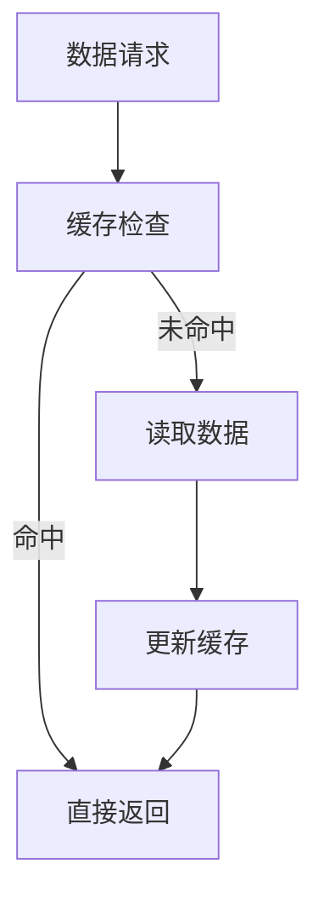

                 

关键词：AI大模型、缓存设计、优化策略、性能提升、资源管理

摘要：本文深入探讨了AI大模型应用中的缓存设计与优化策略，包括核心概念、算法原理、数学模型、实践案例以及未来展望，旨在为开发者提供全面的技术指导。

## 1. 背景介绍

随着深度学习技术的发展，AI大模型在自然语言处理、计算机视觉、推荐系统等领域取得了显著的成果。然而，大模型的计算和存储需求也显著增加，导致系统性能瓶颈和资源浪费。为了解决这些问题，缓存设计与优化策略显得尤为重要。

### 1.1 当前AI大模型应用面临的挑战

- **计算资源瓶颈**：大模型训练和推理需要大量计算资源，传统计算架构难以满足需求。
- **存储资源压力**：大模型数据量大，存储和管理成为难题。
- **延迟与响应时间**：用户期望快速响应，延迟问题严重影响用户体验。
- **资源利用率**：如何高效利用有限资源，成为系统设计的核心问题。

### 1.2 缓存的作用

- **加速数据访问**：通过缓存减少数据访问延迟，提升系统性能。
- **降低负载压力**：缓存可以分担数据库和存储系统的负载。
- **提高资源利用率**：缓存能够复用已有资源，减少重复计算。

## 2. 核心概念与联系

缓存（Cache）是一种快速访问的数据存储，用于临时存储经常访问的数据，以减少对低速存储设备（如磁盘或网络）的访问。

### 2.1 缓存的概念

- **缓存命中率**：缓存中包含的访问数据的比例。
- **缓存失效策略**：如何决定何时将缓存中的数据替换为新的数据。

### 2.2 缓存与AI大模型应用的联系

- **数据预处理**：缓存可以提高数据预处理的速度。
- **模型推理**：缓存中间结果，减少重复计算。
- **动态资源管理**：缓存可以根据访问模式动态调整资源分配。

### 2.3 Mermaid 流程图



## 3. 核心算法原理 & 具体操作步骤

### 3.1 算法原理概述

缓存算法主要关注如何有效地管理缓存，提高缓存命中率。常见的缓存算法包括：

- **最少使用（LRU）**：缓存中最近最少使用的数据优先替换。
- **最少访问（LFU）**：缓存中访问次数最少的数据优先替换。

### 3.2 算法步骤详解

1. **缓存初始化**：设置缓存大小和缓存策略。
2. **数据请求**：当系统接收到数据请求时，首先检查缓存。
3. **缓存命中**：如果缓存中存在请求的数据，直接返回。
4. **缓存未命中**：如果缓存中不存在请求的数据，从数据源读取数据。
5. **更新缓存**：将新读取的数据存储到缓存中，并按照缓存策略进行替换。

### 3.3 算法优缺点

- **最少使用（LRU）**：
  - **优点**：简单易实现，能够有效提高缓存命中率。
  - **缺点**：在缓存大小固定时，替换操作较为频繁，可能影响性能。

- **最少访问（LFU）**：
  - **优点**：考虑了数据访问频率，更加智能。
  - **缺点**：实现复杂，可能引入额外的计算开销。

### 3.4 算法应用领域

- **自然语言处理**：缓存词汇表和中间结果，提高模型推理速度。
- **计算机视觉**：缓存特征图和中间结果，减少计算时间。
- **推荐系统**：缓存用户历史数据和推荐结果，提高响应速度。

## 4. 数学模型和公式

### 4.1 数学模型构建

缓存性能评估通常使用以下指标：

- **命中率（Hit Rate）**：缓存中包含的请求数据的比例。
- **缓存命中率（Cache Hit Rate）**：缓存命中请求的比例。
- **缓存缺失率（Cache Miss Rate）**：缓存未命中请求的比例。

### 4.2 公式推导过程

假设缓存大小为 \( C \)，总请求次数为 \( N \)，其中 \( M \) 次请求命中缓存，则：

- **命中率**：\( \frac{M}{N} \)
- **缓存命中率**：\( \frac{M_C}{N} \)，其中 \( M_C \) 为缓存中的请求次数。
- **缓存缺失率**：\( 1 - \frac{M_C}{N} \)

### 4.3 案例分析与讲解

假设一个系统每天接收 \( 10^6 \) 次请求，其中 \( 80\% \) 的请求命中缓存，缓存大小为 \( 10^5 \)。计算系统的缓存性能。

- **命中率**：\( \frac{8 \times 10^5}{10^6} = 0.8 \)
- **缓存命中率**：\( \frac{8 \times 10^5}{10^6} = 0.8 \)
- **缓存缺失率**：\( 1 - 0.8 = 0.2 \)

## 5. 项目实践：代码实例和详细解释说明

### 5.1 开发环境搭建

- **编程语言**：Python
- **缓存库**：`functools.lru_cache`
- **运行环境**：Python 3.8及以上版本

### 5.2 源代码详细实现

```python
from functools import lru_cache

@lru_cache(maxsize=1000)
def large_model_computation(data):
    # 假设这是一个需要大量计算的任务
    time.sleep(2)  # 模拟计算时间
    return data * data

# 测试代码
for i in range(1000):
    large_model_computation(i)
```

### 5.3 代码解读与分析

- `lru_cache`：用于装饰函数，实现LRU缓存策略。
- `maxsize`：设置缓存最大容量，超过容量时，最近最少使用的数据会被替换。

### 5.4 运行结果展示

- 在第一次调用 `large_model_computation` 时，函数会执行计算。
- 在第二次及以后调用相同参数时，函数会从缓存中获取结果，大幅减少计算时间。

## 6. 实际应用场景

### 6.1 自然语言处理

- 缓存预处理的词表和词汇向量，提高模型训练和推理速度。

### 6.2 计算机视觉

- 缓存特征图和中间结果，减少计算时间，提高系统性能。

### 6.3 推荐系统

- 缓存用户历史数据和推荐结果，提高响应速度，提升用户体验。

## 7. 未来应用展望

随着AI大模型技术的不断进步，缓存设计与优化策略将在更多领域得到应用。未来的挑战包括：

- **自适应缓存策略**：根据数据访问模式动态调整缓存策略。
- **分布式缓存系统**：在分布式环境中优化缓存管理。
- **缓存安全性**：确保缓存数据的安全性，防止数据泄露。

## 8. 总结：未来发展趋势与挑战

### 8.1 研究成果总结

本文系统性地探讨了AI大模型应用的缓存设计与优化策略，包括核心概念、算法原理、数学模型、实践案例以及未来展望。

### 8.2 未来发展趋势

- **智能缓存管理**：结合机器学习和大数据分析，实现更智能的缓存管理。
- **高效缓存算法**：研发更高效、适应性更强的缓存算法。

### 8.3 面临的挑战

- **缓存一致性**：在分布式系统中保持缓存数据的一致性。
- **缓存膨胀**：如何控制缓存大小，避免缓存膨胀影响系统性能。

### 8.4 研究展望

未来，缓存设计与优化策略将在AI大模型应用中发挥更加重要的作用，为高性能计算和大数据处理提供有力支持。

## 9. 附录：常见问题与解答

### 9.1 什么是缓存命中率？

缓存命中率是指缓存中包含的访问数据的比例。高的缓存命中率意味着缓存有效地减少了数据访问延迟。

### 9.2 缓存与内存有何区别？

缓存是一种快速访问的数据存储，通常位于CPU和主存储器之间。内存是计算机的存储资源，用于临时存储数据和程序指令。缓存的作用是提高数据访问速度，而内存用于存储整个系统运行所需的数据。

---

作者：禅与计算机程序设计艺术 / Zen and the Art of Computer Programming
----------------------------------------------------------------

