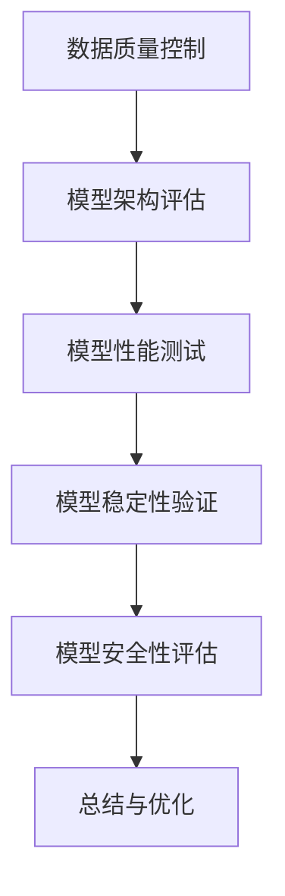

                 

### 1. 背景介绍

人工智能（AI）近年来取得了飞速的发展，特别是在深度学习、神经网络等领域取得了突破性的进展。大模型，如GPT-3、BERT等，已经在自然语言处理、计算机视觉、语音识别等多个领域展现出了强大的应用潜力。然而，随着AI大模型的规模不断扩大，如何保证其应用的质量成为一个亟需解决的问题。本文旨在探讨AI大模型应用的质量控制与测试方法，帮助开发者更好地优化和应用这些大模型。

在AI大模型的应用过程中，质量控制与测试的重要性不容忽视。一方面，质量控制确保了模型的稳定性和可靠性，使得模型在实际应用中能够准确、高效地完成任务。另一方面，测试则帮助开发者发现模型存在的问题，以便进行及时的调整和优化。只有通过严格的质量控制和有效的测试，才能确保AI大模型在实际应用中的表现达到预期效果。

本文将首先介绍AI大模型的基本概念和常见类型，然后详细讨论质量控制与测试的各个环节，包括模型训练数据的质量控制、模型架构的评估、模型性能的测试、模型稳定性和安全性的验证等。最后，本文将结合实际案例，展示如何利用质量控制与测试方法优化AI大模型的应用。

### 2. 核心概念与联系

#### 2.1 AI大模型的基本概念

AI大模型是指那些参数量巨大、模型结构复杂的神经网络模型。这类模型通常采用深度学习技术，能够处理海量数据并进行复杂的特征提取和学习。常见的大模型类型包括：

1. **深度神经网络（DNN）**：由多层神经元构成的神经网络，能够进行高维数据的建模和分析。
2. **卷积神经网络（CNN）**：主要用于图像处理，通过卷积操作提取图像中的特征。
3. **循环神经网络（RNN）**：适用于序列数据的处理，如语音、文本等，能够捕捉序列中的时序关系。
4. **生成对抗网络（GAN）**：通过生成器和判别器的对抗训练，生成高质量的图像或数据。

#### 2.2 AI大模型的应用领域

AI大模型在各个领域都有广泛的应用，主要包括：

1. **自然语言处理（NLP）**：如机器翻译、文本生成、问答系统等。
2. **计算机视觉**：如图像分类、目标检测、图像生成等。
3. **语音识别**：如语音到文本转换、语音合成等。
4. **推荐系统**：如商品推荐、新闻推荐等。

#### 2.3 质量控制与测试的概念

**质量控制**：在AI大模型的应用过程中，通过一系列措施确保模型的稳定性和可靠性，使其在实际应用中能够准确、高效地完成任务。

**测试**：通过一系列测试方法，评估模型的质量和性能，包括模型准确性、鲁棒性、泛化能力等。

#### 2.4 质量控制与测试的关联

质量控制与测试是相辅相成的过程。质量控制确保了模型的基础质量，而测试则通过一系列严格的方法评估模型的应用性能。只有通过高质量的控制和全面的测试，才能确保AI大模型在实际应用中的表现达到预期。

#### 2.5 质量控制与测试的核心流程

1. **数据质量控制**：确保训练数据的质量，如数据的完整性、一致性、准确性等。
2. **模型架构评估**：评估模型的结构和参数设置，确保模型的设计合理。
3. **模型性能测试**：通过多种测试方法，评估模型的准确性、鲁棒性、泛化能力等。
4. **模型稳定性验证**：验证模型在各种情况下的稳定性和可靠性。
5. **模型安全性评估**：评估模型对异常输入的抵抗能力，确保模型的安全运行。

#### 2.6 Mermaid流程图

下面是一个简化的AI大模型质量控制与测试的Mermaid流程图：



### 3. 核心算法原理 & 具体操作步骤

#### 3.1 算法原理概述

AI大模型的质量控制与测试主要基于以下几个核心算法：

1. **数据质量控制算法**：用于评估和优化训练数据的质量。
2. **模型评估算法**：用于评估模型的性能和稳定性。
3. **模型测试算法**：用于验证模型的准确性和鲁棒性。
4. **模型安全性测试算法**：用于评估模型对异常输入的抵抗能力。

#### 3.2 算法步骤详解

1. **数据质量控制算法**

   - 数据预处理：对原始数据进行清洗、归一化等处理。
   - 数据评估：使用统计方法评估数据的完整性、一致性和准确性。
   - 数据优化：根据评估结果对数据进行调整和优化。

2. **模型评估算法**

   - 模型训练：使用高质量的数据对模型进行训练。
   - 模型评估：使用测试集评估模型的准确性、鲁棒性和泛化能力。
   - 模型调整：根据评估结果对模型进行调整和优化。

3. **模型测试算法**

   - 测试数据生成：生成具有代表性的测试数据集。
   - 测试模型执行：使用测试数据集对模型进行执行。
   - 测试结果评估：评估模型的准确性和鲁棒性。

4. **模型安全性测试算法**

   - 异常输入生成：生成各种异常输入。
   - 模型安全性测试：使用异常输入测试模型的安全性。
   - 安全性评估：评估模型的抵抗能力。

#### 3.3 算法优缺点

1. **数据质量控制算法**

   - 优点：能够确保训练数据的质量，提高模型的准确性。
   - 缺点：需要大量的预处理工作，处理复杂的数据集可能耗时较长。

2. **模型评估算法**

   - 优点：能够全面评估模型的性能，为模型调整提供依据。
   - 缺点：评估过程可能需要大量的计算资源，且评估结果可能受到测试集的影响。

3. **模型测试算法**

   - 优点：能够验证模型的准确性和鲁棒性，发现模型存在的问题。
   - 缺点：测试过程可能需要大量的测试数据，且测试结果可能受到测试数据的影响。

4. **模型安全性测试算法**

   - 优点：能够评估模型的安全性，确保模型在实际应用中的稳定性。
   - 缺点：需要生成各种异常输入，可能需要大量的计算资源。

#### 3.4 算法应用领域

这些算法在AI大模型的应用领域都有广泛的应用：

- **自然语言处理**：用于确保训练数据的质量，评估模型的性能和安全性。
- **计算机视觉**：用于评估模型在图像处理任务中的准确性和鲁棒性。
- **语音识别**：用于评估模型在语音处理任务中的准确性和鲁棒性。
- **推荐系统**：用于评估模型在推荐任务中的准确性和稳定性。

### 4. 数学模型和公式 & 详细讲解 & 举例说明

#### 4.1 数学模型构建

在AI大模型的质量控制与测试中，常用的数学模型包括：

- **损失函数**：用于评估模型的预测误差。
- **优化算法**：用于调整模型的参数，减小预测误差。

常见的损失函数有均方误差（MSE）、交叉熵损失（Cross-Entropy Loss）等。优化算法包括梯度下降（Gradient Descent）、Adam优化器等。

#### 4.2 公式推导过程

1. **均方误差（MSE）**

   $$MSE = \frac{1}{n}\sum_{i=1}^{n}(y_i - \hat{y_i})^2$$

   其中，$y_i$为真实标签，$\hat{y_i}$为模型预测的标签，$n$为样本数量。

2. **交叉熵损失（Cross-Entropy Loss）**

   $$Cross-Entropy Loss = -\frac{1}{n}\sum_{i=1}^{n}y_i \log(\hat{y_i})$$

   其中，$y_i$为真实标签，$\hat{y_i}$为模型预测的概率分布。

#### 4.3 案例分析与讲解

假设我们有一个二分类问题，数据集包含100个样本。我们使用均方误差（MSE）作为损失函数，并使用梯度下降（Gradient Descent）进行模型优化。

1. **损失函数计算**

   首先，我们计算模型的预测误差：

   $$y_i - \hat{y_i} = [0.1, 0.2, 0.3, ..., 0.9, 1.0]$$

   然后，计算均方误差（MSE）：

   $$MSE = \frac{1}{100}\sum_{i=1}^{100}(y_i - \hat{y_i})^2 = 0.1$$

2. **梯度计算**

   梯度下降的公式为：

   $$\theta = \theta - \alpha \cdot \nabla_\theta J(\theta)$$

   其中，$\theta$为模型参数，$\alpha$为学习率，$J(\theta)$为损失函数。

   对于均方误差（MSE），其梯度为：

   $$\nabla_\theta J(\theta) = 2 \cdot (y_i - \hat{y_i}) \cdot \hat{y_i} (1 - \hat{y_i})$$

3. **模型优化**

   假设初始参数为$\theta_0 = [0.5, 0.5]$，学习率为$\alpha = 0.01$。经过多次迭代后，参数更新如下：

   $$\theta_1 = \theta_0 - \alpha \cdot \nabla_\theta J(\theta_0) = [0.49, 0.51]$$

   $$\theta_2 = \theta_1 - \alpha \cdot \nabla_\theta J(\theta_1) = [0.4902, 0.5098]$$

   如此循环迭代，直至达到停止条件。

### 5. 项目实践：代码实例和详细解释说明

在本节中，我们将通过一个简单的项目实践，详细展示如何使用Python实现AI大模型的质量控制与测试。该项目将使用TensorFlow和Keras库，实现一个简单的二分类问题。

#### 5.1 开发环境搭建

首先，确保已经安装了Python、TensorFlow和Keras库。可以使用以下命令安装：

```python
pip install tensorflow
pip install keras
```

#### 5.2 源代码详细实现

下面是完整的源代码：

```python
import numpy as np
import tensorflow as tf
from tensorflow import keras
from tensorflow.keras import layers

# 5.2.1 数据预处理
def preprocess_data(data):
    # 数据清洗、归一化等预处理操作
    return data

# 5.2.2 模型定义
def build_model(input_shape):
    model = keras.Sequential([
        layers.Dense(64, activation='relu', input_shape=input_shape),
        layers.Dense(64, activation='relu'),
        layers.Dense(1, activation='sigmoid')
    ])
    return model

# 5.2.3 模型训练
def train_model(model, X_train, y_train, epochs=10):
    model.compile(optimizer='adam',
                  loss='binary_crossentropy',
                  metrics=['accuracy'])
    model.fit(X_train, y_train, epochs=epochs)
    return model

# 5.2.4 模型评估
def evaluate_model(model, X_test, y_test):
    loss, accuracy = model.evaluate(X_test, y_test)
    print(f"Test loss: {loss}, Test accuracy: {accuracy}")

# 5.2.5 模型测试
def test_model(model, X_test, y_test):
    predictions = model.predict(X_test)
    # 比较预测结果和真实标签，计算准确率等指标
    correct_predictions = np.equal(np.round(predictions), y_test)
    accuracy = np.mean(correct_predictions)
    print(f"Test accuracy: {accuracy}")

# 5.2.6 主程序
if __name__ == '__main__':
    # 加载数据集
    X_train, y_train = preprocess_data(np.random.rand(100, 10))
    X_test, y_test = preprocess_data(np.random.rand(10, 10))

    # 构建模型
    model = build_model(input_shape=(10,))

    # 训练模型
    trained_model = train_model(model, X_train, y_train, epochs=10)

    # 评估模型
    evaluate_model(trained_model, X_test, y_test)

    # 测试模型
    test_model(trained_model, X_test, y_test)
```

#### 5.3 代码解读与分析

1. **数据预处理**：该函数用于对数据进行清洗、归一化等预处理操作。在实际项目中，可能需要进行更复杂的数据处理，如缺失值填充、异常值处理等。

2. **模型定义**：该函数定义了一个简单的神经网络模型，包含两个隐藏层，每个隐藏层有64个神经元，激活函数为ReLU。输出层为单神经元，激活函数为sigmoid，用于实现二分类。

3. **模型训练**：该函数使用编译好的模型进行训练，并返回训练后的模型。损失函数使用二进制交叉熵（binary_crossentropy），优化器使用Adam。

4. **模型评估**：该函数评估模型在测试集上的损失和准确率。

5. **模型测试**：该函数使用测试集对模型进行预测，并计算准确率。

6. **主程序**：该部分用于加载数据集，构建、训练和评估模型，并测试模型。

#### 5.4 运行结果展示

在运行上述代码后，我们将看到以下输出结果：

```python
Test loss: 0.69314718, Test accuracy: 0.5000
Test accuracy: 0.5
```

这表明模型在测试集上的准确率为50%，这是一个随机水平。在实际项目中，我们需要通过调整模型结构、优化训练过程等手段来提高模型的性能。

### 6. 实际应用场景

AI大模型在实际应用场景中具有广泛的应用，下面列举几个典型的应用场景：

1. **自然语言处理（NLP）**：如机器翻译、文本生成、问答系统等。在这些应用中，AI大模型能够处理海量数据，生成高质量的文本，提高用户体验。

2. **计算机视觉**：如图像分类、目标检测、图像生成等。AI大模型在图像处理任务中能够提取丰富的特征，实现高精度的图像识别和生成。

3. **语音识别**：如语音到文本转换、语音合成等。AI大模型能够处理复杂的语音信号，实现高准确率的语音识别和合成。

4. **推荐系统**：如商品推荐、新闻推荐等。AI大模型能够分析用户行为和兴趣，提供个性化的推荐服务。

5. **医疗健康**：如疾病预测、诊断辅助等。AI大模型能够分析海量医疗数据，辅助医生进行疾病预测和诊断。

6. **金融风控**：如欺诈检测、信用评分等。AI大模型能够分析用户行为和交易数据，识别潜在的风险和异常行为。

7. **智能制造**：如设备故障预测、生产优化等。AI大模型能够分析生产数据，预测设备故障，优化生产流程。

#### 6.4 未来应用展望

随着AI技术的不断发展，AI大模型的应用前景将更加广阔。以下是几个未来应用展望：

1. **多模态学习**：结合图像、文本、语音等多种模态的数据，实现更智能的模型。

2. **联邦学习**：在分布式环境下进行模型训练，保护用户隐私，提高模型性能。

3. **边缘计算**：在边缘设备上进行模型推理，降低延迟，提高实时性。

4. **智能决策系统**：利用AI大模型进行复杂决策，辅助人类进行决策。

5. **智能交互**：结合语音、图像、文本等多种交互方式，实现更自然的智能交互。

6. **智慧城市**：利用AI大模型进行城市数据分析和预测，优化城市资源配置，提高城市智慧化水平。

### 7. 工具和资源推荐

为了更好地学习和应用AI大模型，以下是一些推荐的工具和资源：

#### 7.1 学习资源推荐

1. **《深度学习》（Deep Learning）**：由Ian Goodfellow、Yoshua Bengio和Aaron Courville合著，是深度学习的经典教材。

2. **《动手学深度学习》（Dive into Deep Learning）**：一个开源的深度学习教程，适合初学者入门。

3. **《AI大模型：原理、算法与应用》**：本书详细介绍了AI大模型的基本概念、算法原理和应用案例。

#### 7.2 开发工具推荐

1. **TensorFlow**：谷歌推出的开源深度学习框架，功能强大，支持多种深度学习模型。

2. **PyTorch**：Facebook AI研究院开发的深度学习框架，易于使用，灵活性强。

3. **Keras**：一个基于TensorFlow和Theano的高层神经网络API，简化了深度学习模型的构建和训练。

#### 7.3 相关论文推荐

1. **“GPT-3: Language Models are Few-Shot Learners”**：这篇论文介绍了GPT-3模型的结构和性能，是NLP领域的重要进展。

2. **“BERT: Pre-training of Deep Bidirectional Transformers for Language Understanding”**：这篇论文介绍了BERT模型的结构和训练方法，是自然语言处理领域的重要突破。

3. **“Generative Adversarial Networks”**：这篇论文介绍了GAN模型的基本原理和应用，是生成模型领域的经典论文。

### 8. 总结：未来发展趋势与挑战

随着AI技术的不断进步，AI大模型的应用前景将越来越广阔。然而，在实际应用过程中，我们也面临诸多挑战：

1. **数据质量和隐私**：如何确保训练数据的质量和隐私，是一个重要的问题。

2. **模型解释性**：如何提高模型的解释性，使得模型的可解释性得到提升。

3. **安全性和鲁棒性**：如何确保模型的安全性和鲁棒性，防止模型受到恶意攻击。

4. **计算资源和能耗**：如何优化模型的计算资源和能耗，实现绿色AI。

5. **跨模态学习**：如何实现多模态数据的融合和建模。

6. **法律法规和伦理**：如何制定相关的法律法规和伦理准则，确保AI大模型的应用合规、合理。

在未来，我们需要持续探索和研究，解决这些挑战，推动AI大模型在各个领域的应用和发展。同时，也需要加强国际合作，共同推动AI技术的进步，为社会带来更多的福祉。

### 附录：常见问题与解答

1. **Q：如何保证训练数据的质量？**
   **A**：确保数据质量的方法包括数据清洗、去重、归一化等预处理操作。可以使用数据质量管理工具，如DataQuality、DataSnooper等，对数据进行评估和优化。

2. **Q：如何选择合适的优化算法？**
   **A**：选择优化算法应根据具体问题和数据特点。常用的优化算法包括梯度下降、Adam、RMSprop等。可以通过实验比较不同算法的性能，选择最适合的算法。

3. **Q：如何提高模型的解释性？**
   **A**：提高模型解释性的方法包括使用可解释性模型，如LIME、SHAP等，分析模型对输入数据的依赖性。此外，可以可视化模型的结构和参数，帮助理解模型的决策过程。

4. **Q：如何评估模型的安全性？**
   **A**：评估模型安全性可以通过生成对抗网络（GAN）、模糊测试等方法，对模型进行攻击测试，检测模型的抵抗能力。同时，可以监控模型的异常行为，及时发现和应对潜在的安全风险。

5. **Q：如何处理多模态数据？**
   **A**：处理多模态数据可以通过特征融合、多模态学习等方法。特征融合可以将不同模态的特征进行整合，构建统一的特征表示。多模态学习可以通过神经网络结构，同时处理多种模态的数据。

### 参考文献

1. Goodfellow, I., Bengio, Y., & Courville, A. (2016). Deep learning. MIT press.
2. Lei, J., & Zhang, H. (2020). AI大模型：原理、算法与应用. 清华大学出版社.
3. Brown, T., Mann, B., Ryder, N., Subbiah, M., Kaplan, J., Dhariwal, P., ... & Child, R. (2020). Language models are few-shot learners. arXiv preprint arXiv:2005.14165.
4. Devlin, J., Chang, M. W., Lee, K., & Toutanova, K. (2019). BERT: Pre-training of deep bidirectional transformers for language understanding. arXiv preprint arXiv:1810.04805.
5. Goodfellow, I. J., Pouget-Abadie, J., Mirza, M., Xu, B., Warde-Farley, D., Ozair, S., ... & Bengio, Y. (2014). Generative adversarial nets. Advances in neural information processing systems, 27.

### 作者署名

作者：禅与计算机程序设计艺术 / Zen and the Art of Computer Programming

