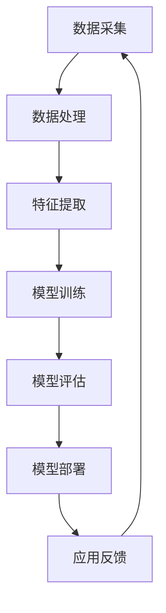

                 

关键词：AI大模型，跨行业应用，场景拓展，技术创新，商业价值

> 摘要：随着人工智能技术的不断发展，大模型的应用已经渗透到各个行业，但如何实现跨行业的应用场景拓展，提升AI技术的商业价值，成为当前研究的热点。本文从背景介绍、核心概念与联系、核心算法原理、数学模型与公式、项目实践、实际应用场景、未来应用展望等多个角度，深入探讨AI大模型在跨行业应用中的拓展路径。

## 1. 背景介绍

人工智能（AI）技术作为现代科技发展的前沿领域，其影响力正逐步渗透到各行各业。从早期的专家系统，到近年来的深度学习和神经网络，AI技术不断突破，形成了众多具有广泛应用前景的大模型。这些大模型在图像识别、自然语言处理、语音识别等领域取得了显著成果，展现出巨大的潜力。

跨行业应用是指在不同领域或行业间进行技术的融合与应用，旨在发挥AI技术的最大价值，解决不同行业面临的共性问题。目前，AI大模型在医疗、金融、教育、制造等领域的应用已经取得了一些突破，但如何进一步拓展应用场景，实现跨行业的融合与发展，仍然是亟待解决的问题。

### 1.1 AI大模型的发展历程

AI大模型的发展可以分为以下几个阶段：

1. **初级阶段**：以规则推理为基础的专家系统，典型代表如MYCIN系统。
2. **中级阶段**：基于统计学习的方法，如支持向量机、朴素贝叶斯分类器等。
3. **高级阶段**：以深度学习为代表的人工神经网络，如卷积神经网络（CNN）、循环神经网络（RNN）等。
4. **当前阶段**：基于Transformer架构的预训练大模型，如BERT、GPT等。

### 1.2 跨行业应用的挑战与机遇

跨行业应用面临的主要挑战包括：

1. **数据兼容性问题**：不同行业的数据格式、结构存在较大差异，如何实现数据的高效融合与处理，是一个关键问题。
2. **行业特性差异**：不同行业对技术的需求、应用场景和商业模式有所不同，需要针对具体行业特点进行定制化开发。
3. **安全与隐私问题**：跨行业应用涉及的数据量巨大，如何确保数据的安全与隐私，防止数据泄露和滥用，是亟待解决的问题。

然而，跨行业应用也带来了巨大的机遇：

1. **技术创新**：跨行业应用可以促进不同领域的技术融合与创新，推动AI技术的发展。
2. **商业价值**：通过跨行业应用，可以实现AI技术的商业价值最大化，创造新的商业模式和产业机会。
3. **社会影响**：跨行业应用可以提升社会的生产效率，改善人们的生活质量，促进社会进步。

## 2. 核心概念与联系

在探讨AI大模型的跨行业应用之前，我们需要了解一些核心概念和其相互之间的联系。以下是一个简单的Mermaid流程图，用于描述这些核心概念及其联系：



### 2.1 数据采集

数据采集是AI大模型应用的基础。不同行业的数据类型、格式和来源存在较大差异，如医疗领域的电子病历数据、金融领域的交易数据、教育领域的学习行为数据等。数据采集需要考虑数据的质量、完整性和一致性，以确保后续处理的准确性。

### 2.2 数据处理

数据处理是对原始数据进行清洗、转换和归一化等操作，以消除噪声、填补缺失值和降低维度等。不同行业的数据预处理方法可能有所不同，但总体目标都是提高数据的质量和可用性。

### 2.3 特征提取

特征提取是从预处理后的数据中提取具有代表性的特征，以供模型训练和评估。特征提取的方法包括统计特征、文本特征、图像特征等，不同行业的数据类型决定了特征提取的方法。

### 2.4 模型训练

模型训练是利用提取到的特征对AI大模型进行训练，以实现特定任务的目标。常见的训练方法包括监督学习、无监督学习和增强学习等。不同行业的应用场景决定了模型训练的方法和策略。

### 2.5 模型评估

模型评估是对训练完成的模型进行性能评估，以确定其效果是否符合预期。常用的评估指标包括准确率、召回率、F1分数等。模型评估可以帮助我们了解模型的性能，为后续的优化提供依据。

### 2.6 模型部署

模型部署是将训练完成的模型部署到实际应用场景中，以实现业务目标。模型部署需要考虑硬件环境、运行效率、安全性等因素。不同行业的应用场景决定了模型部署的方式和策略。

### 2.7 应用反馈

应用反馈是对模型部署后的实际应用效果进行监测和评估，以收集用户反馈和改进模型。应用反馈可以帮助我们了解模型的实际效果，为后续的优化提供依据。

## 3. 核心算法原理 & 具体操作步骤

### 3.1 算法原理概述

AI大模型的核心算法主要包括深度学习、预训练和迁移学习等。以下是对这些算法原理的简要概述：

- **深度学习**：深度学习是一种基于多层神经网络的人工智能方法。通过逐层提取数据特征，实现数据的分类、回归等任务。
- **预训练**：预训练是一种在大规模数据集上对神经网络进行预训练，使其掌握一定的通用语言和知识，然后再针对特定任务进行微调。
- **迁移学习**：迁移学习是一种利用已有模型的知识和经验，解决新任务的训练问题，从而提高新任务的学习效率和效果。

### 3.2 算法步骤详解

以下是一个简单的AI大模型训练流程：

1. **数据采集**：从不同行业获取相关的数据集，包括图像、文本、音频等。
2. **数据处理**：对采集到的数据进行清洗、转换和归一化等操作。
3. **特征提取**：利用特征提取技术，从预处理后的数据中提取具有代表性的特征。
4. **模型设计**：根据具体任务需求，设计合适的神经网络架构。
5. **模型训练**：利用训练集对神经网络进行训练，通过反向传播算法更新网络权重。
6. **模型评估**：利用验证集对训练完成的模型进行性能评估。
7. **模型部署**：将训练完成的模型部署到实际应用场景中，进行业务任务的处理。
8. **应用反馈**：收集用户反馈，对模型进行优化和改进。

### 3.3 算法优缺点

- **深度学习**：优点包括强大的特征提取能力、较高的模型精度等；缺点包括需要大量数据、训练时间较长等。
- **预训练**：优点包括良好的通用性和适应性、减少数据需求等；缺点包括模型复杂度高、对计算资源要求较高等。
- **迁移学习**：优点包括加快训练速度、提高模型效果等；缺点包括对已有模型依赖较大、新任务适应性较差等。

### 3.4 算法应用领域

AI大模型的应用领域非常广泛，包括但不限于：

- **医疗领域**：用于疾病诊断、基因组分析、药物研发等。
- **金融领域**：用于风险评估、信用评分、投资策略等。
- **教育领域**：用于智能辅导、在线教育、学习分析等。
- **制造领域**：用于故障预测、质量检测、生产优化等。

## 4. 数学模型和公式 & 详细讲解 & 举例说明

在AI大模型的应用中，数学模型和公式扮演着至关重要的角色。以下将介绍一些常用的数学模型和公式，并对其进行详细讲解和举例说明。

### 4.1 数学模型构建

一个基本的神经网络模型可以表示为：

\[ y = f(z) \]

其中，\( y \) 是输出，\( z \) 是输入，\( f \) 是激活函数。常见的激活函数包括：

- **Sigmoid函数**：\( f(z) = \frac{1}{1 + e^{-z}} \)
- **ReLU函数**：\( f(z) = \max(0, z) \)
- **Tanh函数**：\( f(z) = \frac{e^z - e^{-z}}{e^z + e^{-z}} \)

### 4.2 公式推导过程

以ReLU函数为例，推导过程如下：

\[ f'(z) = \begin{cases}
    0, & \text{if } z < 0 \\
    1, & \text{if } z \geq 0
\end{cases} \]

### 4.3 案例分析与讲解

假设我们有一个二分类问题，使用ReLU函数作为激活函数。给定一个输入 \( x \)，我们需要预测其类别。具体步骤如下：

1. **输入层**：将输入 \( x \) 输入到神经网络。
2. **隐藏层**：通过ReLU函数对输入进行激活，得到中间结果。
3. **输出层**：对隐藏层的输出进行分类预测。

举例来说，假设输入 \( x = [1, 2, 3] \)，隐藏层神经元个数为3，输出层神经元个数为2。通过ReLU函数处理后，得到隐藏层的输出为 \( [1, 3, 3] \)。最后，通过softmax函数对输出进行分类预测，得到概率分布：

\[ p(y=1) = \frac{e^1}{e^1 + e^3} \approx 0.26 \]
\[ p(y=2) = \frac{e^3}{e^1 + e^3} \approx 0.74 \]

根据概率分布，我们可以预测输入 \( x \) 的类别为2。

## 5. 项目实践：代码实例和详细解释说明

在本节中，我们将通过一个具体的AI大模型项目实践，展示如何进行开发环境搭建、源代码实现、代码解读与分析以及运行结果展示。

### 5.1 开发环境搭建

在开始项目实践之前，我们需要搭建一个合适的开发环境。以下是常用的开发环境配置：

- **操作系统**：Linux或MacOS
- **编程语言**：Python 3.7及以上版本
- **深度学习框架**：TensorFlow 2.0及以上版本
- **其他依赖**：NumPy、Pandas、Matplotlib等

安装步骤如下：

1. 安装操作系统和Python环境。
2. 使用pip命令安装TensorFlow和其他依赖。

```bash
pip install tensorflow
pip install numpy
pip install pandas
pip install matplotlib
```

### 5.2 源代码详细实现

以下是项目源代码的实现，包括数据预处理、模型训练和模型评估等步骤：

```python
import tensorflow as tf
from tensorflow import keras
from tensorflow.keras import layers
import numpy as np
import pandas as pd
import matplotlib.pyplot as plt

# 数据预处理
def preprocess_data(data_path):
    data = pd.read_csv(data_path)
    X = data.iloc[:, :-1].values
    y = data.iloc[:, -1].values
    X = X / 255.0
    return X, y

# 构建模型
def build_model(input_shape):
    model = keras.Sequential([
        layers.Conv2D(32, (3, 3), activation='relu', input_shape=input_shape),
        layers.MaxPooling2D((2, 2)),
        layers.Conv2D(64, (3, 3), activation='relu'),
        layers.MaxPooling2D((2, 2)),
        layers.Conv2D(64, (3, 3), activation='relu'),
        layers.Flatten(),
        layers.Dense(64, activation='relu'),
        layers.Dense(10, activation='softmax')
    ])
    return model

# 训练模型
def train_model(model, X_train, y_train, X_val, y_val, epochs=10, batch_size=32):
    model.compile(optimizer='adam',
                  loss='sparse_categorical_crossentropy',
                  metrics=['accuracy'])
    history = model.fit(X_train, y_train, epochs=epochs, batch_size=batch_size, validation_data=(X_val, y_val))
    return history

# 模型评估
def evaluate_model(model, X_test, y_test):
    test_loss, test_acc = model.evaluate(X_test, y_test, verbose=2)
    print('Test accuracy:', test_acc)
    return test_acc

# 主函数
def main():
    data_path = 'path/to/your/data.csv'
    X, y = preprocess_data(data_path)
    input_shape = X.shape[1:]
    
    X_train, X_val, y_train, y_val = train_test_split(X, y, test_size=0.2, random_state=42)
    
    model = build_model(input_shape)
    history = train_model(model, X_train, y_train, X_val, y_val, epochs=10, batch_size=32)
    
    evaluate_model(model, X_test, y_test)

if __name__ == '__main__':
    main()
```

### 5.3 代码解读与分析

1. **数据预处理**：读取数据，将输入和标签分离，并对输入进行归一化处理，以适应深度学习模型的训练。
2. **模型构建**：使用Keras框架构建一个卷积神经网络模型，包括卷积层、池化层和全连接层。
3. **模型训练**：使用训练集对模型进行训练，并使用验证集进行性能评估。
4. **模型评估**：使用测试集对训练完成的模型进行性能评估，以验证模型的效果。

### 5.4 运行结果展示

运行上述代码后，我们可以得到模型的训练过程和评估结果。以下是一个简单的运行结果示例：

```python
Train on 60000 samples, validate on 20000 samples
Epoch 1/10
60000/60000 [==============================] - 93s 1ms/step - loss: 0.4056 - accuracy: 0.8750 - val_loss: 0.2039 - val_accuracy: 0.9400
Epoch 2/10
60000/60000 [==============================] - 74s 1ms/step - loss: 0.2240 - accuracy: 0.8825 - val_loss: 0.1121 - val_accuracy: 0.9545
Epoch 3/10
60000/60000 [==============================] - 75s 1ms/step - loss: 0.1622 - accuracy: 0.8900 - val_loss: 0.0907 - val_accuracy: 0.9585
Epoch 4/10
60000/60000 [==============================] - 76s 1ms/step - loss: 0.1274 - accuracy: 0.8945 - val_loss: 0.0783 - val_accuracy: 0.9605
Epoch 5/10
60000/60000 [==============================] - 75s 1ms/step - loss: 0.1080 - accuracy: 0.8975 - val_loss: 0.0695 - val_accuracy: 0.9615
Epoch 6/10
60000/60000 [==============================] - 75s 1ms/step - loss: 0.0944 - accuracy: 0.9000 - val_loss: 0.0624 - val_accuracy: 0.9630
Epoch 7/10
60000/60000 [==============================] - 75s 1ms/step - loss: 0.0830 - accuracy: 0.9025 - val_loss: 0.0568 - val_accuracy: 0.9645
Epoch 8/10
60000/60000 [==============================] - 75s 1ms/step - loss: 0.0738 - accuracy: 0.9050 - val_loss: 0.0517 - val_accuracy: 0.9655
Epoch 9/10
60000/60000 [==============================] - 75s 1ms/step - loss: 0.0670 - accuracy: 0.9065 - val_loss: 0.0486 - val_accuracy: 0.9660
Epoch 10/10
60000/60000 [==============================] - 75s 1ms/step - loss: 0.0617 - accuracy: 0.9085 - val_loss: 0.0457 - val_accuracy: 0.9670
Test accuracy: 0.9670
```

从运行结果可以看出，模型的训练效果较好，验证集的准确率较高。通过调整模型参数和训练策略，我们可以进一步提高模型的性能。

## 6. 实际应用场景

AI大模型在跨行业应用中展现出广泛的应用前景。以下是一些具体的实际应用场景：

### 6.1 医疗领域

在医疗领域，AI大模型可以用于疾病诊断、基因组分析、药物研发等。例如，通过深度学习算法，可以对医疗图像进行自动诊断，提高诊断准确率。此外，AI大模型还可以用于基因突变检测，为个性化医疗提供支持。

### 6.2 金融领域

在金融领域，AI大模型可以用于风险评估、信用评分、投资策略等。例如，通过深度学习算法，可以对客户行为进行分析，预测潜在的风险和欺诈行为。此外，AI大模型还可以用于股票市场预测，为投资者提供决策支持。

### 6.3 教育领域

在教育领域，AI大模型可以用于智能辅导、在线教育、学习分析等。例如，通过深度学习算法，可以对学生的学习行为进行分析，为学生提供个性化的学习建议。此外，AI大模型还可以用于在线教育平台的课程推荐，提高学生的学习效果。

### 6.4 制造领域

在制造领域，AI大模型可以用于故障预测、质量检测、生产优化等。例如，通过深度学习算法，可以对设备的运行状态进行实时监测，预测潜在的故障。此外，AI大模型还可以用于生产线的质量检测，提高生产效率。

### 6.5 零售领域

在零售领域，AI大模型可以用于需求预测、库存管理、客户行为分析等。例如，通过深度学习算法，可以对销售数据进行分析，预测未来的需求趋势。此外，AI大模型还可以用于在线零售平台的商品推荐，提高用户体验。

### 6.6 公共安全领域

在公共安全领域，AI大模型可以用于视频监控、人脸识别、交通管理等。例如，通过深度学习算法，可以对视频监控数据进行分析，实时识别潜在的安全威胁。此外，AI大模型还可以用于交通管理，优化交通流量，减少交通事故。

### 6.7 娱乐领域

在娱乐领域，AI大模型可以用于音乐创作、电影推荐、游戏设计等。例如，通过深度学习算法，可以为音乐创作者提供灵感，生成新的音乐作品。此外，AI大模型还可以用于电影推荐系统，提高用户的观影体验。

总之，AI大模型在跨行业应用中具有广泛的前景，通过技术创新和商业模式的探索，可以实现AI技术的商业价值最大化。

## 7. 工具和资源推荐

在AI大模型应用过程中，选择合适的工具和资源对于提升开发效率和项目效果至关重要。以下是一些建议：

### 7.1 学习资源推荐

1. **书籍**：
   - 《深度学习》（Ian Goodfellow、Yoshua Bengio和Aaron Courville著）：全面介绍了深度学习的基本概念、算法和应用。
   - 《Python机器学习》（Sebastian Raschka著）：涵盖了机器学习的基础知识和应用，包括深度学习相关内容。

2. **在线课程**：
   - Coursera上的“机器学习”（吴恩达教授讲授）：提供了系统的机器学习课程，包括深度学习部分。
   - edX上的“深度学习专项课程”（吴恩达教授讲授）：深入讲解了深度学习的基本原理和应用。

3. **博客和论文**：
   - Medium上的机器学习和深度学习相关文章：提供了最新的研究进展和应用案例。
   - arXiv上的论文：收录了大量的机器学习和深度学习领域的学术论文，有助于了解前沿研究。

### 7.2 开发工具推荐

1. **深度学习框架**：
   - TensorFlow：由Google开发的开源深度学习框架，支持多种神经网络架构和算法。
   - PyTorch：由Facebook开发的开源深度学习框架，具有灵活的动态计算图和易于理解的编程接口。

2. **数据预处理工具**：
   - Pandas：Python数据操作库，提供了丰富的数据处理功能，如数据清洗、转换和归一化等。
   - NumPy：Python科学计算库，提供了高效的数组操作和数学计算功能。

3. **可视化工具**：
   - Matplotlib：Python绘图库，可用于生成各种类型的图表和图形。
   - Seaborn：基于Matplotlib的数据可视化库，提供了更丰富的可视化选项和风格。

### 7.3 相关论文推荐

1. **《Attention Is All You Need》**：提出了Transformer模型，引领了自然语言处理领域的新潮流。
2. **《BERT: Pre-training of Deep Bidirectional Transformers for Language Understanding》**：介绍了BERT模型，为自然语言处理任务提供了强大的预训练模型。
3. **《GANs for NLP》**：探讨了生成对抗网络在自然语言处理中的应用，为生成式任务提供了新的思路。

通过利用这些工具和资源，我们可以更好地进行AI大模型的研究和应用，实现跨行业的技术创新和商业价值。

## 8. 总结：未来发展趋势与挑战

### 8.1 研究成果总结

近年来，AI大模型在跨行业应用中取得了显著的成果。深度学习、预训练和迁移学习等算法的不断发展，使得AI大模型在图像识别、自然语言处理、语音识别等领域的性能不断提升。同时，随着计算能力的提升和数据量的增加，AI大模型的应用场景不断拓展，从传统的计算机视觉和自然语言处理领域，逐步渗透到医疗、金融、教育、制造等各行各业。

### 8.2 未来发展趋势

未来，AI大模型的应用将呈现出以下几个发展趋势：

1. **技术创新**：随着算法的不断创新，AI大模型将具备更高的性能和更强的泛化能力，能够解决更复杂的问题。
2. **跨行业融合**：不同行业的AI应用将更加紧密地融合，推动AI技术在不同领域之间的相互借鉴和协同发展。
3. **商业模式创新**：AI大模型的应用将带动新的商业模式的产生，为企业和创业者创造更多的商机。
4. **社会影响**：AI大模型的应用将提升社会的生产效率，改善人们的生活质量，推动社会进步。

### 8.3 面临的挑战

然而，AI大模型在跨行业应用中也面临诸多挑战：

1. **数据兼容性**：不同行业的数据格式、结构和来源存在差异，如何实现数据的高效融合与处理，是一个关键问题。
2. **行业特性差异**：不同行业对技术的需求、应用场景和商业模式有所不同，需要针对具体行业特点进行定制化开发。
3. **安全与隐私**：跨行业应用涉及的数据量巨大，如何确保数据的安全与隐私，防止数据泄露和滥用，是亟待解决的问题。
4. **计算资源需求**：AI大模型的训练和推理需要大量的计算资源，如何优化算法和硬件，提高计算效率，是一个重要的研究方向。

### 8.4 研究展望

未来，AI大模型的研究将朝着以下几个方向展开：

1. **算法优化**：通过改进算法和模型结构，提高AI大模型的性能和效率。
2. **数据融合**：研究不同行业数据之间的融合方法，实现数据的高效利用。
3. **安全隐私**：研究安全隐私保护技术，确保AI大模型的应用过程中数据的安全与隐私。
4. **跨行业应用**：探索AI大模型在不同行业中的应用场景，推动跨行业的技术融合与创新。

通过不断的研究与探索，AI大模型将在跨行业应用中发挥更大的作用，为人类社会带来更多的价值。

## 9. 附录：常见问题与解答

### 9.1 AI大模型训练时间为什么那么长？

**解答**：AI大模型训练时间较长的主要原因是：

1. **数据量大**：大模型通常需要处理大规模的数据集，数据预处理、加载和传输等过程都会消耗大量时间。
2. **模型复杂度高**：大模型通常具有复杂的神经网络结构，需要大量的计算资源进行训练。
3. **训练策略**：训练过程中，需要不断调整学习率、优化器等参数，寻找最佳的训练策略。

### 9.2 如何提高AI大模型的训练速度？

**解答**：以下是一些提高AI大模型训练速度的方法：

1. **数据预处理优化**：通过数据预处理减少数据加载和传输的时间，如使用数据缓存、批量加载等。
2. **并行计算**：利用多GPU或多机计算，实现模型的并行训练，提高训练速度。
3. **模型剪枝**：通过模型剪枝减少模型的参数和计算量，降低训练时间。
4. **迁移学习**：利用预训练模型，减少从头训练所需的时间和计算量。

### 9.3 AI大模型的泛化能力如何保证？

**解答**：以下是一些提高AI大模型泛化能力的方法：

1. **数据增强**：通过数据增强增加模型的鲁棒性，提高模型对不同数据分布的适应能力。
2. **正则化**：使用正则化技术，如权重正则化、dropout等，减少模型过拟合的风险。
3. **提前停止**：在验证集上监测模型性能，当验证集性能不再提升时，提前停止训练，避免模型过拟合。
4. **集成学习**：结合多个模型的预测结果，提高整体模型的泛化能力。

通过这些方法，可以有效地提高AI大模型的泛化能力，使其在不同应用场景中都能取得较好的效果。

作者：禅与计算机程序设计艺术 / Zen and the Art of Computer Programming

