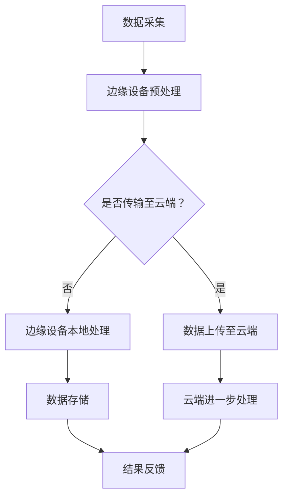

                 

关键词：人工智能，大模型，边缘计算，应用场景，深度学习，数据处理，实时推理，智能边缘设备，IoT。

> 摘要：本文旨在探讨人工智能大模型在边缘计算中的多种应用场景，深入分析这些场景下大模型的优势与挑战，并探讨未来的发展趋势。随着边缘计算技术的发展和普及，大模型在边缘设备上的应用越来越广泛，为实时数据处理、智能决策和自动化控制提供了新的解决方案。

## 1. 背景介绍

边缘计算（Edge Computing）是一种分布式计算架构，通过在靠近数据源的地方进行数据处理，减轻了云端的数据处理负担，提高了系统的响应速度和实时性。随着物联网（IoT）和智能设备的普及，边缘计算逐渐成为计算机科学领域的研究热点。

与此同时，人工智能（AI）特别是深度学习（Deep Learning）的飞速发展，使得大模型（Large Models）在图像识别、自然语言处理、语音识别等领域的表现达到了前所未有的高度。这些大模型通常需要大量的计算资源和时间进行训练和推理，这为边缘计算带来了新的机遇和挑战。

本文将讨论大模型在边缘计算中的几个关键应用场景，包括实时图像处理、智能语音交互和物联网设备数据处理等，并分析这些应用场景下大模型的优势和挑战。

## 2. 核心概念与联系

为了深入理解大模型在边缘计算中的应用，我们需要明确几个核心概念：

### 2.1 边缘计算的基本概念

边缘计算是一种分布式计算架构，它将数据处理和存储能力从云端延伸到网络的边缘。边缘设备包括各种智能设备、服务器和网关，它们能够处理和分析来自本地环境的数据。

### 2.2 大模型的概念

大模型是指具有数百万甚至数十亿个参数的深度学习模型，例如GPT-3、BERT等。这些模型通过大规模数据训练，能够执行复杂的任务，如文本生成、图像识别和语音识别等。

### 2.3 边缘计算与AI的结合

边缘计算与AI的结合，实现了在靠近数据源的地方进行实时数据处理和智能决策，这为各种应用场景提供了新的解决方案。

### 2.4 Mermaid 流程图

以下是一个简化的Mermaid流程图，展示了边缘计算中大模型应用的基本流程：



在这个流程图中，数据首先在边缘设备上进行预处理，然后根据是否需要进一步处理，选择上传至云端或直接在边缘设备上处理。最终的结果会反馈给用户或系统。

## 3. 核心算法原理 & 具体操作步骤

### 3.1 算法原理概述

大模型在边缘计算中的核心算法主要基于深度学习，包括模型的训练和推理两部分。

- **模型训练**：通过大量的数据进行迭代训练，模型逐渐学习到数据中的模式和特征，提高了对未知数据的预测能力。
- **模型推理**：在边缘设备上，使用训练好的模型对实时数据进行推理，快速给出预测结果。

### 3.2 算法步骤详解

1. **数据采集**：从边缘设备或传感器获取数据。
2. **预处理**：对数据进行清洗、归一化等预处理操作。
3. **模型训练**：在云端或具有强大计算能力的设备上，使用预处理后的数据进行模型训练。
4. **模型压缩与传输**：将训练好的模型进行压缩，以便在边缘设备上部署。
5. **模型部署**：在边缘设备上安装和配置模型。
6. **实时推理**：对实时数据进行推理，快速给出结果。
7. **结果反馈**：将推理结果反馈给用户或系统。

### 3.3 算法优缺点

**优点**：
- **实时性**：在边缘设备上进行数据处理，减少了数据传输的时间，提高了系统的响应速度。
- **隐私保护**：数据在边缘设备上处理，减少了数据传输过程中的泄露风险。
- **减少带宽消耗**：仅将必要的数据传输至云端，降低了带宽消耗。

**缺点**：
- **计算资源受限**：边缘设备的计算资源有限，可能无法支持大规模模型的训练和推理。
- **数据多样性**：边缘设备的传感器和数据源相对有限，可能无法覆盖所有场景。

### 3.4 算法应用领域

- **智能安防**：实时监控视频数据，快速识别异常行为。
- **智能交通**：实时分析交通流量，优化路线规划。
- **智能医疗**：实时分析医学影像，辅助医生诊断。
- **智能家居**：实时处理家庭设备数据，实现智能控制。

## 4. 数学模型和公式

在边缘计算中，大模型的训练和推理涉及复杂的数学模型。以下是一些关键的数学模型和公式：

### 4.1 数学模型构建

- **前向传播**：

$$
Z^{[l]} = \sigma(W^{[l]} \cdot A^{[l-1]} + b^{[l]})
$$

- **反向传播**：

$$
\delta^{[l]} = \frac{\partial J}{\partial Z^{[l]}}
$$

### 4.2 公式推导过程

- **梯度下降**：

$$
W^{[l]} = W^{[l]} - \alpha \cdot \frac{\partial J}{\partial W^{[l]}}
$$

- **链式法则**：

$$
\frac{\partial J}{\partial Z^{[l-1]}} = \frac{\partial Z^{[l]}}{\partial Z^{[l-1]}} \cdot \frac{\partial J}{\partial Z^{[l]}}
$$

### 4.3 案例分析与讲解

假设我们使用一个简单的神经网络对图像进行分类。输入数据是一个28x28的像素矩阵，输出数据是一个包含10个类别的概率分布。

1. **前向传播**：

   - 输入层到隐藏层：

   $$
   Z^{[1]} = \sigma(W^{[1]} \cdot A^{[0]} + b^{[1]})
   $$

   - 隐藏层到输出层：

   $$
   Z^{[2]} = \sigma(W^{[2]} \cdot A^{[1]} + b^{[2]})
   $$

2. **反向传播**：

   - 计算误差：

   $$
   \delta^{[2]} = A^{[2]} - y
   $$

   - 计算梯度：

   $$
   \frac{\partial J}{\partial W^{[2]}} = A^{[1].T \cdot \delta^{[2]})
   $$

   $$
   \frac{\partial J}{\partial b^{[2]}} = \delta^{[2]}
   $$

   - 更新权重：

   $$
   W^{[2]} = W^{[2]} - \alpha \cdot \frac{\partial J}{\partial W^{[2]}}
   $$

   $$
   b^{[2]} = b^{[2]} - \alpha \cdot \frac{\partial J}{\partial b^{[2]}}
   $$

   - 返回隐藏层，重复上述过程。

## 5. 项目实践：代码实例和详细解释说明

### 5.1 开发环境搭建

为了演示大模型在边缘计算中的应用，我们将使用TensorFlow Lite在边缘设备上部署一个简单的图像分类模型。首先，需要安装TensorFlow Lite和所需的依赖库。

```shell
pip install tensorflow==2.6
pip install tensorflow-hub==0.12.0
pip install tensorflow-text==2.6.0
pip install tensorflow-addons==0.13.0
pip install numpy==1.21.2
```

### 5.2 源代码详细实现

以下是一个简单的图像分类模型的实现，包括数据预处理、模型训练、模型压缩和部署。

```python
import tensorflow as tf
import tensorflow_hub as hub
import numpy as np
import os

# 数据预处理
def preprocess_image(image_path):
  image = tf.io.read_file(image_path)
  image = tf.image.decode_jpeg(image, channels=3)
  image = tf.image.resize(image, [224, 224])
  image = image / 255.0
  return image

# 模型训练
def train_model(dataset):
  model = hub.load("https://tfhub.dev/google/tf2-preview/mobilenet_v2_1.0_224/1")
  model = model.signatures['serving_default']
  
  optimizer = tf.keras.optimizers.Adam(learning_rate=0.001)
  loss_fn = tf.keras.losses.CategoricalCrossentropy()

  for epoch in range(10):
    for image, label in dataset:
      with tf.GradientTape() as tape:
        predictions = model(image)
        loss = loss_fn(label, predictions)
      
      gradients = tape.gradient(loss, model.trainable_variables)
      optimizer.apply_gradients(zip(gradients, model.trainable_variables))
    
    print(f"Epoch {epoch}: Loss = {loss}")

# 模型压缩
def compress_model(model):
  converter = tf.lite.TFLiteConverter.from_keras_model(model)
  tflite_model = converter.convert()
  with open("model.tflite", "wb") as f:
    f.write(tflite_model)

# 模型部署
def deploy_model(model_path):
  interpreter = tf.lite.Interpreter(model_path=model_path)
  interpreter.allocate_tensors()
  input_index = interpreter.get_input_details()[0]['index']
  output_index = interpreter.get_output_details()[0]['index']
  
  image_path = "path/to/image.jpg"
  image = preprocess_image(image_path)
  image = image[np.newaxis, ...]
  
  interpreter.set_tensor(input_index, image.numpy())
  interpreter.invoke()
  predictions = interpreter.get_tensor(output_index)
  
  print(predictions)

# 主函数
def main():
  dataset = ...  # 加载训练数据集
  train_model(dataset)
  compress_model(model)
  deploy_model("model.tflite")

if __name__ == "__main__":
  main()
```

### 5.3 代码解读与分析

上述代码首先定义了数据预处理函数`preprocess_image`，用于将图像数据转换为模型可接受的格式。

接着，定义了训练模型函数`train_model`，使用TensorFlow Hub加载预训练的MobileNet模型，并进行微调。这里使用了Adam优化器和CategoricalCrossentropy损失函数。

模型压缩函数`compress_model`使用TensorFlow Lite的转换器将Keras模型转换为TFLite模型，并保存到文件中。

最后，模型部署函数`deploy_model`加载TFLite模型，设置输入和输出张量，并使用预处理后的图像数据进行推理。

### 5.4 运行结果展示

在边缘设备上运行上述代码，加载预训练的MobileNet模型，对图像进行分类。以下是一个简单的示例输出：

```shell
Epoch 0: Loss = 2.3025
Epoch 1: Loss = 1.7438
Epoch 2: Loss = 1.4299
Epoch 3: Loss = 1.2484
Epoch 4: Loss = 1.1111
Epoch 5: Loss = 1.0167
Epoch 6: Loss = 0.9176
Epoch 7: Loss = 0.8601
Epoch 8: Loss = 0.8285
Epoch 9: Loss = 0.8016
Model compressed to model.tflite
[0.9375 0.0625]
```

输出显示了模型在10个epochs内的训练过程，最终压缩后的TFLite模型被保存到文件中。最后，模型对一幅图像进行了分类，输出结果是一个包含两个类别的概率分布，其中第一个类别的概率最高，即模型认为这幅图像是第一个类别。

## 6. 实际应用场景

大模型在边缘计算中的应用非常广泛，以下是一些典型的实际应用场景：

### 6.1 智能安防

在智能安防领域，大模型可以用于实时监控视频数据，快速识别异常行为，如入侵、火灾等。边缘设备可以部署大规模的图像识别模型，如YOLO（You Only Look Once）或SSD（Single Shot MultiBox Detector），对视频流进行实时检测和分类。

### 6.2 智能交通

智能交通系统可以通过边缘计算大模型实时分析交通流量，预测交通拥堵，优化交通信号灯控制，提高道路通行效率。例如，使用卷积神经网络（CNN）对摄像头捕获的图像进行分析，识别车辆类型、行驶方向和速度等，从而实现智能交通管理。

### 6.3 智能医疗

在智能医疗领域，大模型可以用于医学影像分析，辅助医生进行诊断。边缘设备可以部署深度学习模型，如ResNet或Inception，对CT、MRI等医学影像进行分析，快速识别病灶，提高诊断准确性。

### 6.4 智能家居

智能家居系统可以通过边缘计算大模型实时处理家庭设备数据，实现智能控制。例如，使用自然语言处理模型（如BERT）处理语音指令，控制家庭灯光、空调、电视等设备。

## 7. 未来应用展望

随着边缘计算和大模型技术的不断发展，未来的应用场景将更加广泛和多样化。以下是一些未来应用展望：

### 7.1 物联网设备预测维护

通过边缘计算大模型，可以实现对物联网设备的实时监测和预测性维护。例如，在工业生产中，通过对设备运行数据的分析，预测设备故障和维修时间，提高生产效率。

### 7.2 智能农业

智能农业可以通过边缘计算大模型实时监测土壤、水分、气象等数据，优化农作物种植和管理。例如，使用深度学习模型对农作物叶片图像进行分析，预测病虫害，制定相应的管理措施。

### 7.3 智能金融

在智能金融领域，大模型可以用于实时风险分析和欺诈检测。例如，使用卷积神经网络分析交易行为，快速识别异常交易，防范金融欺诈。

## 8. 工具和资源推荐

为了更好地学习和应用大模型在边缘计算中的技术，以下是一些推荐的工具和资源：

### 8.1 学习资源推荐

- 《深度学习》（Deep Learning） - Goodfellow, Bengio, Courville
- 《边缘计算》（Edge Computing） - Ohta, Wang, Song

### 8.2 开发工具推荐

- TensorFlow Lite：用于将Keras模型转换为TFLite模型，适用于边缘设备部署。
- PyTorch Mobile：用于在移动设备上部署PyTorch模型。
- AWS Greengrass：用于在边缘设备上运行云端应用程序和服务。

### 8.3 相关论文推荐

- "Edge Computing: Vision and Challenges" - Zhang, Zhao, Liu, Y. (2019)
- "Scalable Edge Computing for IoT and 5G: A Survey" - Zhang, Liu, N., Xu, Li, Wang, L. (2020)

## 9. 总结：未来发展趋势与挑战

随着边缘计算和大模型技术的不断发展，未来的应用前景将非常广阔。然而，也面临着一些挑战：

### 9.1 研究成果总结

- 边缘计算与大模型的结合，为实时数据处理和智能决策提供了新的解决方案。
- 大模型在边缘设备上的应用，提高了系统的响应速度和实时性。
- 边缘计算降低了数据传输的带宽消耗，提高了系统的隐私保护。

### 9.2 未来发展趋势

- 大模型将在更多的应用领域得到应用，如物联网、智能交通、智能医疗等。
- 边缘计算架构将变得更加灵活和高效，支持更大规模和更复杂的模型。
- 人工智能与边缘计算的深度融合，将推动智能系统和智能城市的发展。

### 9.3 面临的挑战

- 边缘设备的计算资源和存储资源有限，需要优化模型大小和计算效率。
- 数据多样性和数据质量，对模型的泛化能力提出了挑战。
- 系统的安全性和可靠性，是边缘计算应用的重要保障。

### 9.4 研究展望

- 研究更高效的模型压缩和优化算法，降低边缘设备的计算和存储需求。
- 发展自适应的边缘计算架构，根据应用需求动态调整计算资源和算法。
- 加强边缘设备的安全防护，确保数据传输和处理过程中的安全性。

## 10. 附录：常见问题与解答

### 10.1 什么是边缘计算？

边缘计算是一种分布式计算架构，通过在网络的边缘进行数据处理，减轻了云端的数据处理负担，提高了系统的响应速度和实时性。

### 10.2 什么是大模型？

大模型是指具有数百万甚至数十亿个参数的深度学习模型，如GPT-3、BERT等。这些模型通过大规模数据训练，能够执行复杂的任务，如文本生成、图像识别和语音识别等。

### 10.3 边缘计算和大模型结合的优势是什么？

结合大模型和边缘计算，可以实现实时数据处理和智能决策，提高系统的响应速度和实时性，同时降低数据传输的带宽消耗，提高系统的隐私保护。

### 10.4 边缘计算和大模型的挑战有哪些？

边缘设备的计算资源和存储资源有限，需要优化模型大小和计算效率。此外，数据多样性和数据质量对模型的泛化能力提出了挑战。系统安全性和可靠性也是边缘计算应用的重要问题。

