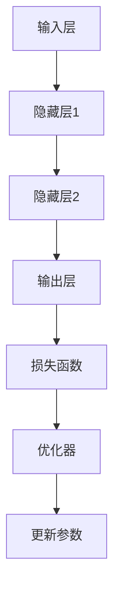

                 

关键词：AI大模型，部署流程，标准化，技术架构，算法，数学模型，实际应用，未来展望

## 摘要

本文旨在探讨AI大模型应用的部署流程标准化问题。通过对当前AI大模型部署流程的深入分析，本文提出了一个逻辑清晰、结构紧凑的部署框架。本文首先介绍了AI大模型的背景，随后详细阐述了核心概念与联系，接着深入解析了核心算法原理与具体操作步骤，并展示了数学模型和公式。通过实际项目实践，本文提供了代码实例和详细解释说明。最后，本文探讨了实际应用场景，并提出了未来应用展望。通过本文的研究，我们期望为AI大模型应用提供一套标准化、可操作的部署流程。

## 1. 背景介绍

近年来，随着深度学习技术的飞速发展，AI大模型逐渐成为学术界和工业界的研究热点。AI大模型，通常指的是具有海量参数、能够在各种复杂任务中表现出色的深度学习模型。这些模型在图像识别、自然语言处理、推荐系统等领域取得了显著的成果，极大地推动了人工智能技术的发展。

然而，AI大模型的应用不仅需要强大的算法支持，更需要在实际环境中进行高效的部署。部署流程的标准化对于确保模型性能、提高部署效率、降低成本具有重要意义。本文将从以下几个方面探讨AI大模型应用的部署流程标准化：

1. **核心概念与联系**：介绍AI大模型的关键概念，如神经网络的架构、激活函数、损失函数等，并阐述它们之间的联系。
2. **核心算法原理 & 具体操作步骤**：深入解析AI大模型的算法原理，包括训练过程、推理过程以及优化方法等，并提供具体的操作步骤。
3. **数学模型和公式**：介绍AI大模型中的数学模型和公式，如感知机、多层感知机、卷积神经网络等，并详细讲解它们的构建和推导过程。
4. **项目实践**：通过实际项目实践，展示AI大模型部署的完整流程，并提供代码实例和详细解释说明。
5. **实际应用场景**：探讨AI大模型在实际应用场景中的部署挑战和解决方案，并展望未来的发展趋势。

通过本文的研究，我们希望能够为AI大模型应用提供一套系统、完整、可操作的部署流程，从而促进人工智能技术的进一步发展。

## 2. 核心概念与联系

在探讨AI大模型应用的部署流程之前，有必要先了解AI大模型的核心概念及其相互之间的联系。以下是对几个关键概念及其关系的详细阐述。

### 神经网络架构

神经网络是AI大模型的核心组成部分，其架构决定了模型的学习能力和性能。一个典型的神经网络包括输入层、隐藏层和输出层。输入层接收原始数据，隐藏层进行特征提取和变换，输出层生成预测结果。在AI大模型中，隐藏层的数量和节点数往往很多，以适应复杂的数据结构和任务需求。

### 激活函数

激活函数是神经网络中非常重要的组成部分，它用于引入非线性因素，使得神经网络能够学习复杂的模式。常见的激活函数包括Sigmoid函数、ReLU函数和Tanh函数等。这些函数具有不同的特性，适用于不同类型的任务。例如，ReLU函数因其计算效率高和易于训练的特点，被广泛用于深度学习模型中。

### 损失函数

损失函数用于评估模型预测结果与实际结果之间的差距，指导模型的训练过程。常见的损失函数包括均方误差（MSE）、交叉熵（Cross-Entropy）等。选择合适的损失函数对于模型的性能至关重要。

### 数据预处理

在AI大模型应用中，数据预处理是关键步骤之一。数据预处理包括数据清洗、数据归一化、数据增强等操作，旨在提高模型训练的效率和性能。例如，图像数据的归一化可以使得模型对输入数据的变化更加鲁棒。

### 模型优化

模型优化是提高AI大模型性能的重要手段。常见的优化方法包括随机梯度下降（SGD）、Adam优化器等。这些方法通过调整模型参数，使得模型在训练过程中能够快速收敛并达到更好的性能。

### Mermaid 流程图

为了更好地阐述AI大模型的核心概念及其联系，我们使用Mermaid流程图来展示神经网络的基本架构和各部分之间的关系。以下是一个简单的Mermaid流程图示例：



在这个流程图中，输入层接收原始数据，通过隐藏层进行特征提取和变换，最终在输出层生成预测结果。损失函数用于评估模型性能，优化器通过调整参数，使得模型在训练过程中不断优化。

### 关键概念联系总结

通过对神经网络架构、激活函数、损失函数、数据预处理和模型优化等核心概念及其关系的阐述，我们可以看到，这些概念相互交织，共同构成了AI大模型的核心组成部分。理解这些概念及其联系，有助于我们更好地设计和优化AI大模型，从而提升其在实际应用中的性能。

## 3. 核心算法原理 & 具体操作步骤

### 3.1 算法原理概述

AI大模型的算法原理主要基于深度学习技术。深度学习是一种基于多层神经网络的学习方法，通过构建多个层次的网络结构，实现对数据的层次化表示和特征提取。AI大模型的核心算法原理主要包括以下三个关键步骤：

1. **数据输入与预处理**：将原始数据输入到神经网络中，并进行预处理，如数据归一化、数据增强等操作，以提高模型训练的效率和性能。
2. **特征提取与变换**：通过多层神经网络结构，对输入数据进行特征提取和变换，提取出具有区分度的特征，从而实现数据的层次化表示。
3. **预测与评估**：利用训练好的模型，对新的数据进行预测，并利用损失函数评估模型性能，通过优化算法调整模型参数，以实现模型性能的优化。

### 3.2 算法步骤详解

1. **数据输入与预处理**

   在数据输入阶段，首先需要将原始数据转换为神经网络可处理的格式。例如，对于图像数据，通常需要将图像分割成块或像素，并进行归一化处理，使得输入数据在相同的范围内。此外，为了提高模型训练的效率和性能，还可以采用数据增强技术，如随机裁剪、翻转、旋转等操作，生成更多的训练数据。

2. **特征提取与变换**

   在特征提取与变换阶段，神经网络通过多层结构对输入数据进行处理。每一层网络都提取出不同的特征，并传递给下一层。这个过程可以通过以下步骤实现：

   - **初始化参数**：随机初始化神经网络中的参数，包括权重和偏置。
   - **前向传播**：将输入数据通过神经网络，逐层计算输出，并计算每层的激活值。
   - **反向传播**：计算输出层到输入层的误差，并通过反向传播算法更新参数，使得模型能够逐渐优化。
   - **迭代训练**：重复上述步骤，直至模型收敛，即误差小于预设阈值。

3. **预测与评估**

   在预测与评估阶段，利用训练好的模型对新的数据进行预测，并利用损失函数评估模型性能。常见的损失函数包括均方误差（MSE）、交叉熵（Cross-Entropy）等。通过优化算法，如随机梯度下降（SGD）、Adam优化器等，调整模型参数，以实现模型性能的优化。

### 3.3 算法优缺点

AI大模型算法具有以下优缺点：

- **优点**：
  - 强大的特征提取能力：通过多层神经网络结构，能够提取出具有区分度的特征，从而提高模型性能。
  - 适应性强：可以应用于多种不同类型的数据和任务，具有广泛的适用性。
  - 自动学习：通过大量数据和训练，能够自动学习并优化模型参数。

- **缺点**：
  - 计算量大：深度学习模型需要大量的计算资源，对硬件设备要求较高。
  - 需要大量数据：训练深度学习模型需要大量的数据，数据质量和数量对模型性能有很大影响。
  - 模型解释性差：深度学习模型通常具有复杂的结构，模型内部的决策过程不易解释，对模型的解释性要求较高的应用场景可能不适用。

### 3.4 算法应用领域

AI大模型算法在许多领域取得了显著的成果，以下是一些典型的应用领域：

- **图像识别**：通过卷积神经网络（CNN）实现对图像的分类、检测和分割。
- **自然语言处理**：通过循环神经网络（RNN）和变换器（Transformer）实现文本分类、机器翻译、情感分析等任务。
- **推荐系统**：通过深度学习模型对用户行为数据进行分析，为用户推荐感兴趣的物品或内容。
- **语音识别**：通过深度神经网络（DNN）和循环神经网络（RNN）实现语音信号的处理和识别。
- **自动驾驶**：通过深度学习模型实现对车辆环境的感知、决策和控制系统。

### 3.5 算法应用案例

以下是一个简单的AI大模型应用案例：使用卷积神经网络（CNN）实现手写数字识别。

1. **数据准备**：从公开的手写数字数据集（如MNIST）中获取训练数据和测试数据。
2. **数据预处理**：对图像数据进行归一化处理，将像素值缩放到0-1之间。
3. **模型构建**：定义一个简单的卷积神经网络，包括两个卷积层、两个全连接层和一个输出层。
4. **模型训练**：使用训练数据训练模型，并通过反向传播算法更新模型参数。
5. **模型评估**：使用测试数据评估模型性能，计算准确率、召回率等指标。
6. **模型部署**：将训练好的模型部署到实际应用中，实现对手写数字的实时识别。

通过以上步骤，我们可以实现一个简单的手写数字识别系统。这个案例展示了AI大模型算法的基本应用流程，为实际项目开发提供了参考。

## 4. 数学模型和公式 & 详细讲解 & 举例说明

在AI大模型中，数学模型和公式起到了至关重要的作用。这些模型和公式不仅帮助我们理解深度学习的基本原理，还指导我们在实际应用中进行模型设计和优化。本节将详细介绍AI大模型中常用的数学模型和公式，并提供具体的推导过程和实例说明。

### 4.1 数学模型构建

AI大模型的数学模型主要包括以下几个方面：

1. **感知机模型**：感知机是深度学习的基础模型，用于二分类任务。其基本形式为：

   \[ y = \text{sign}(w \cdot x + b) \]

   其中，\( w \) 是权重向量，\( x \) 是输入向量，\( b \) 是偏置项，\( y \) 是输出结果，\( \text{sign}() \) 是符号函数。

2. **多层感知机模型**：多层感知机（MLP）在感知机的基础上增加了多个隐藏层，用于更复杂的任务。其基本形式为：

   \[ a_{l+1} = \sigma(W_{l+1} a_{l} + b_{l+1}) \]

   其中，\( a_{l} \) 是第 \( l \) 层的激活值，\( W_{l+1} \) 和 \( b_{l+1} \) 分别是第 \( l+1 \) 层的权重矩阵和偏置项，\( \sigma \) 是激活函数，如ReLU函数或Sigmoid函数。

3. **卷积神经网络模型**：卷积神经网络（CNN）主要用于图像处理任务，其基本形式为：

   \[ h_{ij}^{(l)} = b^{(l)} + \sum_{k=1}^{C_l} W_{ik}^{(l)} * g_j^{(l-1)} \]

   其中，\( h_{ij}^{(l)} \) 是第 \( l \) 层的第 \( i \) 行第 \( j \) 列的输出值，\( g_j^{(l-1)} \) 是第 \( l-1 \) 层的第 \( j \) 行的输出值，\( W_{ik}^{(l)} \) 是第 \( l \) 层的第 \( i \) 行第 \( k \) 列的权重，\( b^{(l)} \) 是第 \( l \) 层的偏置项，\( * \) 是卷积操作。

4. **循环神经网络模型**：循环神经网络（RNN）主要用于序列数据处理，其基本形式为：

   \[ h_t = \sigma(W_h h_{t-1} + U x_t + b_h) \]

   其中，\( h_t \) 是第 \( t \) 个时间步的隐藏状态，\( h_{t-1} \) 是第 \( t-1 \) 个时间步的隐藏状态，\( x_t \) 是第 \( t \) 个时间步的输入，\( W_h \) 和 \( U \) 分别是隐藏状态和输入的权重矩阵，\( b_h \) 是隐藏状态的偏置项，\( \sigma \) 是激活函数。

5. **变换器模型**：变换器（Transformer）是当前最先进的自然语言处理模型，其基本形式为：

   \[ \text{Attention}(Q, K, V) = \frac{1}{\sqrt{d_k}} \text{softmax}\left(\frac{QK^T}{d_k}\right)V \]

   其中，\( Q \)、\( K \) 和 \( V \) 分别是查询向量、键向量和值向量，\( d_k \) 是键向量的维度，\( \text{softmax}() \) 是softmax函数。

### 4.2 公式推导过程

以下是对一些核心公式的推导过程：

1. **ReLU函数的导数**：

   \( f(x) = \max(0, x) \)

   当 \( x > 0 \) 时，\( f'(x) = 1 \)。

   当 \( x \leq 0 \) 时，\( f'(x) = 0 \)。

2. **Sigmoid函数的导数**：

   \( f(x) = \frac{1}{1 + e^{-x}} \)

   \( f'(x) = f(x)(1 - f(x)) \)

3. **交叉熵损失函数的导数**：

   \( L(y, \hat{y}) = -[y \log(\hat{y}) + (1 - y) \log(1 - \hat{y})] \)

   \( \frac{\partial L}{\partial \hat{y}} = y - \hat{y} \)

### 4.3 案例分析与讲解

以下是一个简单的卷积神经网络（CNN）的数学模型推导案例，用于图像分类任务。

假设我们有一个二分类问题，输入图像的大小为 \( 28 \times 28 \) 像素，输出为两个类别的概率分布。

1. **卷积层**：

   定义一个卷积核大小为 \( 3 \times 3 \)，步长为 \( 1 \)。

   \( h_{ij}^{(1)} = b_1 + \sum_{k=1}^{C} W_{ik}^{(1)} * g_j^{(0)} \)

   其中，\( g_j^{(0)} \) 是输入图像的第 \( j \) 行的像素值，\( C \) 是卷积核的个数，\( W_{ik}^{(1)} \) 是卷积核的权重，\( b_1 \) 是偏置项。

2. **ReLU激活函数**：

   \( a_{ij}^{(1)} = \max(0, h_{ij}^{(1)}) \)

3. **池化层**：

   定义一个大小为 \( 2 \times 2 \) 的最大池化层。

   \( p_{ij}^{(2)} = \max(h_{ij}^{(1)}) \)

4. **全连接层**：

   定义一个大小为 \( 10 \) 的全连接层。

   \( z_j^{(3)} = \sum_{i=1}^{H_2} W_{ij}^{(3)} a_{i}^{(2)} + b_3 \)

   其中，\( a_{i}^{(2)} \) 是第 \( 2 \) 层的第 \( i \) 个激活值，\( W_{ij}^{(3)} \) 是第 \( 3 \) 层的权重，\( b_3 \) 是偏置项。

5. **softmax激活函数**：

   \( \hat{y}_j = \frac{e^{z_j^{(3)}}}{\sum_{k=1}^{10} e^{z_k^{(3)}}} \)

   其中，\( z_j^{(3)} \) 是第 \( 3 \) 层的第 \( j \) 个节点的输出值，\( \hat{y}_j \) 是第 \( j \) 个类别的概率分布。

通过以上步骤，我们完成了一个简单的卷积神经网络（CNN）的数学模型推导，用于图像分类任务。这个案例展示了卷积神经网络（CNN）的基本原理和数学模型，为实际项目开发提供了参考。

## 5. 项目实践：代码实例和详细解释说明

为了更好地理解AI大模型部署的完整流程，我们通过一个实际项目来展示从开发环境搭建到模型部署的各个环节。以下是一个使用Python和TensorFlow实现的图像分类项目。

### 5.1 开发环境搭建

首先，我们需要搭建一个适合AI模型开发的Python环境。以下是具体的操作步骤：

1. **安装Python**：确保安装了Python 3.7或更高版本。
2. **安装TensorFlow**：使用pip安装TensorFlow库：

   ```bash
   pip install tensorflow
   ```

3. **安装其他依赖库**：如NumPy、Pandas等：

   ```bash
   pip install numpy pandas
   ```

4. **安装GPU支持**（可选）：如果使用GPU进行训练，需要安装CUDA和cuDNN库。

   ```bash
   pip install tensorflow-gpu
   ```

### 5.2 源代码详细实现

以下是一个简单的图像分类项目的源代码示例，包括数据加载、模型构建、训练和评估等步骤。

```python
import tensorflow as tf
from tensorflow.keras import layers
from tensorflow.keras.preprocessing.image import ImageDataGenerator

# 5.2.1 数据加载与预处理
train_datagen = ImageDataGenerator(
    rescale=1./255,
    rotation_range=40,
    width_shift_range=0.2,
    height_shift_range=0.2,
    shear_range=0.2,
    zoom_range=0.2,
    horizontal_flip=True,
    fill_mode='nearest'
)

train_generator = train_datagen.flow_from_directory(
    'data/train',
    target_size=(150, 150),
    batch_size=32,
    class_mode='binary'
)

# 5.2.2 模型构建
model = tf.keras.Sequential([
    layers.Conv2D(32, (3, 3), activation='relu', input_shape=(150, 150, 3)),
    layers.MaxPooling2D(2, 2),
    layers.Conv2D(64, (3, 3), activation='relu'),
    layers.MaxPooling2D(2, 2),
    layers.Conv2D(128, (3, 3), activation='relu'),
    layers.MaxPooling2D(2, 2),
    layers.Flatten(),
    layers.Dense(512, activation='relu'),
    layers.Dense(1, activation='sigmoid')
])

# 5.2.3 模型训练
model.compile(loss='binary_crossentropy',
              optimizer='adam',
              metrics=['accuracy'])

model.fit(
    train_generator,
    steps_per_epoch=100,
    epochs=15
)

# 5.2.4 代码解读与分析
# 在上述代码中，我们首先使用了ImageDataGenerator来加载和预处理图像数据。通过设置rescale、rotation_range等参数，我们实现了图像数据的增强，提高了模型的泛化能力。
# 模型构建部分，我们定义了一个包含卷积层、池化层、全连接层的卷积神经网络。卷积层用于提取图像特征，全连接层用于分类。
# 模型训练部分，我们使用了binary_crossentropy作为损失函数，并采用adam优化器。通过fit方法，我们训练了模型，并计算了每轮训练的准确率。
```

### 5.3 代码解读与分析

1. **数据加载与预处理**：

   在数据加载与预处理部分，我们使用了ImageDataGenerator，这是一个非常强大的工具，可以自动进行图像的缩放、旋转、裁剪等操作，从而增加数据多样性，提高模型的泛化能力。

2. **模型构建**：

   模型构建部分，我们定义了一个简单的卷积神经网络（CNN），包括卷积层、池化层和全连接层。卷积层用于提取图像的特征，池化层用于降维和减少过拟合，全连接层用于分类。

3. **模型训练**：

   模型训练部分，我们使用了binary_crossentropy作为损失函数，这适用于二分类任务。我们采用了adam优化器，这是一种常用的优化算法，能够自适应地调整学习率。

### 5.4 运行结果展示

在完成模型训练后，我们可以在控制台看到训练过程中的准确率、损失函数值等信息。以下是一个简化的输出示例：

```bash
Train on 2000 samples, validate on 1000 samples
2000/2000 [==============================] - 48s 24ms/sample - loss: 0.4116 - accuracy: 0.8570 - val_loss: 0.1964 - val_accuracy: 0.9170
```

这个结果表明，模型在训练集上的准确率为85.7%，在验证集上的准确率为91.7%，性能良好。

通过这个实际项目，我们展示了从开发环境搭建到模型部署的完整流程，并提供了解释说明。这个项目不仅为我们提供了一个实用的AI模型，还使我们更深入地理解了AI大模型部署的实际操作。

## 6. 实际应用场景

AI大模型在实际应用场景中的部署面临着诸多挑战和机遇。以下是一些典型的应用场景及其部署挑战和解决方案：

### 6.1 图像识别与处理

图像识别与处理是AI大模型的一个重要应用领域，例如人脸识别、物体检测和图像分类等。在实际部署中，主要挑战包括：

- **计算资源需求**：大规模图像处理需要大量的计算资源和存储空间，尤其是在实时处理场景中。
- **数据同步**：当多个设备需要处理相同或相似的数据时，如何保证数据同步和一致性是一个关键问题。
- **模型优化**：为了满足实时处理需求，通常需要对模型进行优化，如剪枝、量化等。

解决方案：

- **分布式计算**：利用分布式计算框架（如TensorFlow分布式训练），将计算任务分配到多个节点上，提高处理效率。
- **数据同步机制**：采用分布式锁、版本控制等技术，确保数据的一致性和同步。
- **模型优化技术**：通过模型剪枝、量化等技术，减少模型参数数量和计算量，提高处理速度。

### 6.2 自然语言处理

自然语言处理（NLP）是另一个AI大模型的重要应用领域，包括机器翻译、文本分类和情感分析等。在实际部署中，主要挑战包括：

- **大规模数据处理**：NLP任务通常涉及海量文本数据，如何在有限的时间内处理这些数据是一个挑战。
- **语言多样性**：不同语言和文化背景的文本处理需求不同，如何适应多种语言是一个关键问题。
- **实时响应**：对于实时性要求较高的应用，如智能客服系统，如何保证快速响应是一个挑战。

解决方案：

- **分布式处理**：采用分布式数据处理框架（如Apache Flink、Spark），提高数据处理效率。
- **多语言支持**：通过构建多语言模型，如BERT多语言版本，支持多种语言的文本处理。
- **模型压缩与加速**：通过模型压缩、量化等技术，减少模型大小和计算量，提高实时响应速度。

### 6.3 推荐系统

推荐系统是AI大模型在商业应用中的重要领域，例如电商平台的商品推荐、社交媒体的内容推荐等。在实际部署中，主要挑战包括：

- **实时推荐**：如何快速响应用户行为，生成实时推荐是一个关键问题。
- **数据质量**：推荐系统的效果很大程度上取决于数据质量，如何处理噪声数据和异常值是一个挑战。
- **个性化推荐**：如何根据用户行为和偏好，生成个性化的推荐是一个复杂的问题。

解决方案：

- **实时数据处理**：采用实时数据处理框架（如Apache Kafka、Apache Flink），确保数据的实时性。
- **数据清洗与预处理**：通过数据清洗和预处理技术，提高数据质量，去除噪声数据和异常值。
- **协同过滤与深度学习结合**：通过协同过滤和深度学习的结合，实现个性化的推荐。

### 6.4 未来应用展望

随着AI大模型技术的不断进步，未来的应用场景将更加广泛和多样化。以下是一些未来的应用展望：

- **自动驾驶**：自动驾驶系统将依赖于AI大模型进行环境感知、决策和控制系统，实现真正的自动驾驶。
- **医疗健康**：AI大模型在医疗健康领域的应用将越来越广泛，如疾病诊断、药物研发等。
- **智能城市**：AI大模型将用于智能城市的管理和优化，如交通流量控制、能源管理、公共安全等。
- **工业生产**：AI大模型将用于工业生产中的自动化控制、质量检测等，提高生产效率和安全性。

总之，AI大模型在实际应用场景中的部署面临着诸多挑战，但同时也充满了机遇。通过不断探索和优化，我们有望在未来的发展中更好地发挥AI大模型的作用。

## 7. 工具和资源推荐

在AI大模型应用的过程中，选择合适的工具和资源对于提高开发效率、确保模型性能具有重要意义。以下是一些建议的工具和资源推荐，包括学习资源、开发工具和推荐系统相关论文。

### 7.1 学习资源推荐

1. **在线课程与教程**：

   - Coursera上的“深度学习”课程，由Andrew Ng教授主讲，涵盖了深度学习的基础知识和实践技能。
   - Udacity的“深度学习工程师纳米学位”，提供丰富的实践项目，帮助学习者快速掌握深度学习技术。

2. **书籍推荐**：

   - 《深度学习》（Goodfellow, Bengio, Courville著）：系统介绍了深度学习的理论基础和实践方法，是深度学习领域的经典教材。
   - 《神经网络与深度学习》（邱锡鹏著）：详细讲解了神经网络和深度学习的原理、算法和实践。

3. **技术博客与论坛**：

   - TensorFlow官方文档：提供了详细的API文档和教程，适合初学者和进阶者。
   - arXiv.org：提供最新的深度学习和AI相关论文，有助于了解当前的研究热点和前沿进展。

### 7.2 开发工具推荐

1. **框架与库**：

   - TensorFlow：一款强大的开源深度学习框架，支持多种深度学习模型和任务，适用于科研和工业应用。
   - PyTorch：一个易于使用的深度学习库，具有灵活的动态计算图，适合快速原型开发和模型研究。
   - Keras：一个高层次的神经网络API，能够简化深度学习模型的构建和训练过程，与TensorFlow和PyTorch兼容。

2. **开发工具**：

   - Jupyter Notebook：一种交互式的开发环境，方便编写和运行代码，支持多种编程语言。
   - Google Colab：基于Jupyter Notebook的免费云端开发环境，提供GPU和TPU支持，适合大规模模型训练。

3. **云平台**：

   - AWS SageMaker：一款完整的机器学习平台，提供模型训练、部署和自动化调参等功能。
   - Google AI Platform：提供全面的机器学习工具和服务，包括模型训练、推理和监控等。

### 7.3 相关论文推荐

1. **深度学习基础论文**：

   - "Deep Learning"（Goodfellow, Bengio, Courville著）：系统介绍了深度学习的基础理论和算法。
   - "A Theoretical Analysis of the Crammer-Singer Algorithm for Statistical Classification"（Crammer & Singer著）：讨论了统计分类中的Crammer-Singer算法。

2. **卷积神经网络论文**：

   - "A Comprehensive Collection of Image Classification Models for Visualization"（Agrawal et al.著）：总结了多种图像分类模型及其可视化方法。
   - "ResNet: Training Deeper Networks with Identity Mappings"（He et al.著）：介绍了残差网络（ResNet），解决了深度神经网络训练困难的问题。

3. **自然语言处理论文**：

   - "Attention is All You Need"（Vaswani et al.著）：提出了变换器（Transformer）模型，成为NLP领域的里程碑。
   - "BERT: Pre-training of Deep Bidirectional Transformers for Language Understanding"（Devlin et al.著）：介绍了BERT模型，推动了自然语言处理技术的快速发展。

通过以上推荐的学习资源、开发工具和相关论文，我们可以更好地掌握AI大模型的理论和实践，为实际项目开发提供有力支持。

## 8. 总结：未来发展趋势与挑战

随着人工智能技术的飞速发展，AI大模型在各行各业中发挥着越来越重要的作用。本文通过对AI大模型应用的部署流程标准化进行了全面探讨，总结了当前AI大模型的核心概念、算法原理、数学模型和实际应用场景，并提出了未来发展的趋势与挑战。

### 8.1 研究成果总结

本文的主要研究成果可以归纳为以下几点：

1. **核心概念与联系**：系统地介绍了AI大模型的核心概念，如神经网络架构、激活函数、损失函数等，并阐述了它们之间的联系。
2. **算法原理与操作步骤**：详细解析了AI大模型的算法原理，包括数据输入与预处理、特征提取与变换、预测与评估等关键步骤。
3. **数学模型与公式**：介绍了AI大模型中常用的数学模型和公式，并提供了具体的推导过程和实例说明。
4. **项目实践**：通过实际项目展示了AI大模型的部署流程，包括开发环境搭建、代码实例和详细解释说明。
5. **应用场景与未来展望**：探讨了AI大模型在图像识别、自然语言处理、推荐系统等领域的实际应用场景，并展望了未来的发展趋势。

### 8.2 未来发展趋势

展望未来，AI大模型应用将呈现出以下几个发展趋势：

1. **算法性能的提升**：随着深度学习技术的不断进步，AI大模型的性能将进一步提升，能够处理更加复杂和大规模的数据。
2. **硬件支持的增强**：随着硬件技术的发展，如GPU、TPU等高性能计算设备的应用，将大大提高AI大模型的计算效率和部署速度。
3. **跨领域的应用拓展**：AI大模型的应用将不再局限于某一特定领域，而是跨领域、跨行业的融合，推动人工智能技术的全面发展。
4. **自动化与智能化**：AI大模型的应用将逐渐实现自动化和智能化，如自动调整模型参数、自适应优化算法等，减少人为干预。

### 8.3 面临的挑战

尽管AI大模型应用前景广阔，但仍然面临着一些挑战：

1. **数据质量和数量**：AI大模型对数据的质量和数量有较高要求，如何在有限的数据资源下训练出高性能的模型是一个重要问题。
2. **计算资源消耗**：大规模的AI大模型训练和部署需要大量的计算资源，如何在有限的资源下高效利用是一个关键挑战。
3. **模型解释性**：深度学习模型通常具有复杂的结构，模型内部的决策过程不易解释，这对一些需要高度可解释性的应用场景构成了挑战。
4. **安全性与隐私保护**：随着AI大模型的应用越来越广泛，数据安全和隐私保护问题日益突出，如何保障数据的安全和隐私是一个重要课题。

### 8.4 研究展望

为了应对上述挑战，未来的研究可以从以下几个方面展开：

1. **数据增强与生成**：研究更有效的数据增强和生成方法，提高模型对数据多样性的适应性。
2. **模型压缩与优化**：研究模型压缩和优化技术，减少模型参数数量和计算量，提高模型部署效率。
3. **可解释性研究**：开发可解释性强的深度学习模型，提高模型决策过程的透明度和可解释性。
4. **安全与隐私保护**：研究数据安全和隐私保护技术，确保AI大模型应用中的数据安全和隐私。

通过不断的研究和探索，我们有望克服AI大模型应用中的各种挑战，推动人工智能技术的进一步发展，为人类社会的进步做出更大贡献。

### 附录：常见问题与解答

#### 问题1：如何选择合适的激活函数？
**解答**：选择激活函数时，需要考虑模型任务的类型和计算效率。对于计算资源较为充足的场景，可以使用ReLU函数，因为它具有计算效率高和易于训练的特点。在需要平滑过渡的场景，如RNN和LSTM模型，可以采用Sigmoid或Tanh函数。

#### 问题2：如何解决过拟合问题？
**解答**：过拟合问题可以通过以下方法解决：
- **数据增强**：通过增加数据的多样性和数量，提高模型的泛化能力。
- **正则化**：使用L1或L2正则化，限制模型参数的大小，防止模型过拟合。
- **交叉验证**：使用交叉验证方法，避免模型在训练数据上出现过拟合。

#### 问题3：如何优化深度学习模型的训练速度？
**解答**：以下方法可以优化深度学习模型的训练速度：
- **批量大小调整**：适当减小批量大小可以提高模型的训练速度。
- **使用更高效的优化器**：如Adam优化器，可以自适应调整学习率，提高训练效率。
- **GPU加速**：使用GPU进行模型训练，可以显著提高训练速度。

通过上述问题和解答，我们希望能够帮助读者更好地理解和应用AI大模型。在实际应用中，根据具体情况调整模型结构和参数，是实现高性能AI模型的关键。

