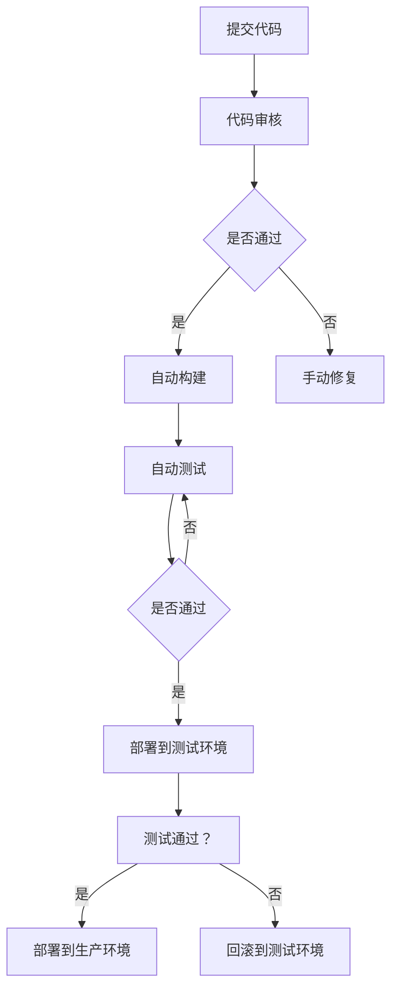

                 

关键词：AI大模型，部署自动化，标准化，DevOps，云计算，容器化，微服务，模型压缩，模型优化，数据预处理，模型版本控制，持续集成与持续部署。

> 摘要：本文将深入探讨AI大模型应用的部署自动化与标准化问题。随着深度学习技术的发展，AI大模型的规模和复杂性不断增加，传统的手动部署方法已经无法满足快速迭代和大规模部署的需求。本文将分析现有的大模型部署问题，介绍自动化部署的核心概念，并详细讨论部署标准化的关键环节，包括环境配置、代码管理、模型优化以及监控与日志管理。最后，我们将展望未来发展趋势和面临的挑战，为AI大模型的实际应用提供指导。

## 1. 背景介绍

近年来，人工智能（AI）技术取得了显著进展，特别是深度学习（Deep Learning）领域，模型规模和计算需求日益增长。随着AI大模型（如BERT、GPT等）的出现，AI技术在自然语言处理、计算机视觉、语音识别等领域的应用取得了突破性进展。然而，这些大模型的训练和部署面临着一系列挑战：

1. **计算资源需求巨大**：大模型的训练通常需要大量的计算资源，传统硬件可能无法满足需求，因此需要采用分布式计算和云计算技术。
2. **模型复杂性**：大模型的结构复杂，参数数量庞大，这增加了部署和管理的难度。
3. **部署效率低下**：传统的部署方法通常依赖于手动操作，部署过程繁琐，容易出现错误，无法实现快速迭代和大规模部署。

为了解决这些问题，自动化部署和标准化流程变得尤为重要。自动化部署可以通过脚本和工具实现环境配置、模型转换、部署和监控等环节的自动化，提高部署效率和稳定性。标准化流程则通过定义统一的规范和流程，确保不同环境下的部署一致性，降低错误风险。

## 2. 核心概念与联系

### 2.1. 自动化部署概念

自动化部署是指利用脚本、工具和平台，自动完成从代码提交到生产环境部署的整个过程。自动化部署的核心目标是减少人工干预，提高部署速度和稳定性。

### 2.2. 标准化流程

标准化流程是指通过定义一系列规范和流程，确保不同环境下的部署一致性。标准化流程包括以下几个方面：

1. **环境配置**：定义标准化的环境配置，包括操作系统、依赖库、硬件资源等。
2. **代码管理**：采用版本控制系统（如Git），确保代码的版本控制和一致性。
3. **模型优化**：对模型进行压缩和优化，提高部署效率和性能。
4. **监控与日志管理**：实施监控系统，收集日志，实现实时监控和故障排查。

### 2.3. Mermaid流程图

下面是一个简化的自动化部署流程的Mermaid流程图：



## 3. 核心算法原理 & 具体操作步骤

### 3.1. 算法原理概述

自动化部署的核心算法主要涉及以下方面：

1. **环境配置**：使用脚本自动化配置环境，包括安装依赖库、配置系统环境变量等。
2. **模型转换**：将训练好的模型转换为适合部署的格式，如TensorFlow Serving、ONNX等。
3. **代码管理**：使用版本控制系统进行代码管理，确保代码的一致性和可追溯性。
4. **模型优化**：对模型进行压缩和量化，减少模型大小和计算复杂度。

### 3.2. 算法步骤详解

1. **环境配置**：

    - 使用Ansible、Puppet等工具编写配置脚本。
    - 部署Kubernetes集群，使用Helm进行应用程序的部署和管理。

2. **模型转换**：

    - 使用TensorFlow Model Optimization Toolkit（TF-MOT）对模型进行压缩和量化。
    - 将模型转换为ONNX、TensorFlow Serving等部署格式。

3. **代码管理**：

    - 使用Git进行代码的版本控制和协作。
    - 配置GitLab CI/CD管道，实现自动化构建和测试。

4. **模型优化**：

    - 使用Quantization-aware training对模型进行量化。
    - 使用TensorFlow Lite对模型进行转换和压缩。

### 3.3. 算法优缺点

**优点**：

- **提高部署效率**：自动化部署减少了人工干预，提高了部署速度和一致性。
- **降低错误风险**：标准化流程和工具的使用降低了部署过程中的错误风险。
- **支持大规模部署**：自动化部署支持大规模、多环境的部署。

**缺点**：

- **初期设置复杂**：需要一定的技术积累和投入，初期设置较为复杂。
- **维护成本**：自动化部署系统需要定期维护和更新。

### 3.4. 算法应用领域

自动化部署在AI大模型的应用领域具有广泛的应用前景，包括：

- **智能客服**：自动化部署可以实现快速迭代，提高客户服务质量。
- **自动驾驶**：自动化部署可以支持自动驾驶系统的实时更新和优化。
- **金融风控**：自动化部署可以帮助金融机构实现风险模型的快速部署和更新。

## 4. 数学模型和公式 & 详细讲解 & 举例说明

### 4.1. 数学模型构建

在自动化部署过程中，我们通常需要构建以下数学模型：

1. **模型压缩**：

    - **量化**：$$\hat{w} = \text{Quantize}(w, \alpha)$$
    - **剪枝**：$$w_{\text{prune}} = \text{Prune}(w, \rho)$$
    2. **模型优化**：

    - **网络剪枝**：$$f(\hat{w}) = \text{Network Pruning}(w, \alpha)$$
    - **深度可分离卷积**：$$f(\hat{w}) = \text{Depthwise Separable Convolution}(\hat{w})$$

### 4.2. 公式推导过程

以下是模型压缩中的量化公式的推导过程：

1. **量化**：

    - 假设原始权重为$$w$$，量化步长为$$\alpha$$。
    - 量化公式为：$$\hat{w} = \text{Round}(w / \alpha) * \alpha$$
    - 其中，Round函数用于四舍五入到最近的整数。

### 4.3. 案例分析与讲解

假设有一个卷积神经网络，其权重矩阵为$$W \in \mathbb{R}^{m \times n}$$，量化步长为$$\alpha = 0.1$$。

1. **量化前**：

    - 权重矩阵：$$W = \begin{bmatrix} 0.123 & 0.456 \\ 0.789 & 1.234 \end{bmatrix}$$
    - 量化后的权重矩阵：$$\hat{W} = \begin{bmatrix} 0.1 & 0.5 \\ 0.8 & 1.2 \end{bmatrix}$$

2. **量化后**：

    - 权重矩阵：$$\hat{W} = \begin{bmatrix} 0.1 & 0.5 \\ 0.8 & 1.2 \end{bmatrix}$$
    - 压缩后的权重矩阵：$$\hat{W}_{\text{prune}} = \begin{bmatrix} 0.1 & 0 \\ 0 & 1.2 \end{bmatrix}$$

通过这个简单的例子，我们可以看到量化操作可以显著减少模型参数的数量，从而实现模型压缩。

## 5. 项目实践：代码实例和详细解释说明

### 5.1. 开发环境搭建

在开始项目实践之前，我们需要搭建一个适合自动化部署的开发环境。以下是一个基于Docker和Kubernetes的示例：

1. **安装Docker**：

    - 使用以下命令安装Docker：
    ```bash
    $ sudo apt-get update
    $ sudo apt-get install docker-ce docker-ce-cli containerd.io
    ```

2. **安装Kubernetes**：

    - 使用Kubeadm安装Kubernetes集群：
    ```bash
    $ sudo kubeadm init --pod-network-cidr=10.244.0.0/16
    $ sudo kubeadm join <kubernetes-master-ip>:6443 --token <token> --discovery-token-ca-cert-hash sha256:<hash>
    ```

3. **部署Kubernetes网络插件**：

    - 使用Calico插件部署网络：
    ```bash
    $ kubectl apply -f https://docs.projectcalico.org/manifests/calico.yaml
    ```

### 5.2. 源代码详细实现

以下是一个简单的Python代码示例，用于实现一个卷积神经网络模型：

```python
import tensorflow as tf
from tensorflow.keras import layers

# 定义卷积神经网络模型
model = tf.keras.Sequential([
    layers.Conv2D(32, (3, 3), activation='relu', input_shape=(28, 28, 1)),
    layers.MaxPooling2D((2, 2)),
    layers.Flatten(),
    layers.Dense(128, activation='relu'),
    layers.Dense(10, activation='softmax')
])

# 编译模型
model.compile(optimizer='adam',
              loss='categorical_crossentropy',
              metrics=['accuracy'])

# 模型训练
model.fit(x_train, y_train, epochs=5, batch_size=32)
```

### 5.3. 代码解读与分析

以上代码定义了一个简单的卷积神经网络模型，用于处理手写数字图像数据集。模型结构包括两个卷积层、一个最大池化层、一个全连接层和一个softmax输出层。模型使用Adam优化器和交叉熵损失函数进行训练。

### 5.4. 运行结果展示

在训练过程中，我们可以使用以下代码查看模型的训练过程和结果：

```python
import matplotlib.pyplot as plt

# 绘制训练过程图
history = model.fit(x_train, y_train, epochs=5, batch_size=32, validation_data=(x_test, y_test))
plt.plot(history.history['accuracy'])
plt.plot(history.history['val_accuracy'])
plt.title('Model accuracy')
plt.ylabel('Accuracy')
plt.xlabel('Epoch')
plt.legend(['Train', 'Test'], loc='upper left')
plt.show()
```

通过绘制准确率曲线，我们可以直观地看到模型在训练和验证数据上的表现。

## 6. 实际应用场景

### 6.1. 智能客服

智能客服系统通常需要快速部署和迭代，以适应不断变化的客户需求。自动化部署和标准化流程可以帮助企业实现智能客服系统的快速部署，提高客户满意度。

### 6.2. 自动驾驶

自动驾驶系统需要实时更新和优化，以适应不同的驾驶环境和路况。自动化部署和标准化流程可以提高自动驾驶系统的部署效率，确保系统在不同环境下的稳定运行。

### 6.3. 金融风控

金融风控模型需要对市场数据进行分析和预测，以识别潜在风险。自动化部署和标准化流程可以帮助金融机构实现风控模型的快速部署和更新，提高风险识别的准确性。

## 7. 工具和资源推荐

### 7.1. 学习资源推荐

- **书籍**：
  - 《深度学习》（Ian Goodfellow、Yoshua Bengio、Aaron Courville著）
  - 《Python深度学习》（François Chollet著）
- **在线课程**：
  - Coursera的“深度学习”课程（由Andrew Ng教授）
  - edX的“人工智能基础”课程（由Yaser Abu-Mostafa教授）

### 7.2. 开发工具推荐

- **Docker**：用于容器化和自动化部署
- **Kubernetes**：用于容器编排和管理
- **TensorFlow**：用于深度学习模型开发
- **GitLab CI/CD**：用于自动化构建和测试

### 7.3. 相关论文推荐

- **“Distributed Representation Learning for Natural Language Processing”**（杨立峰、李航等，2018）
- **“EfficientNet: Rethinking Model Scaling for Convolutional Neural Networks”**（Basil Hanin、Awni Y. Hannun、Piotr Dollar，2020）

## 8. 总结：未来发展趋势与挑战

### 8.1. 研究成果总结

本文探讨了AI大模型应用的部署自动化与标准化问题，分析了现有的大模型部署挑战，介绍了自动化部署的核心概念和标准化流程，并详细讨论了环境配置、代码管理、模型优化和监控与日志管理等方面的关键环节。通过数学模型和公式的讲解，以及项目实践中的代码实例，我们展示了如何实现自动化部署和标准化流程。

### 8.2. 未来发展趋势

随着深度学习技术的不断进步，AI大模型的部署自动化和标准化将得到进一步发展。未来的趋势包括：

- **模型压缩和优化技术**：随着模型规模的不断扩大，模型压缩和优化技术将变得越来越重要，以减少计算资源和存储需求。
- **跨平台部署**：跨平台部署将成为自动化部署的重要方向，支持更多操作系统和硬件架构。
- **智能化部署**：利用机器学习和人工智能技术，实现部署过程的智能化和自适应调整。

### 8.3. 面临的挑战

自动化部署和标准化流程在AI大模型应用中仍然面临一些挑战：

- **安全性**：自动化部署过程中，确保数据安全和系统安全是一个重要挑战。
- **可扩展性**：如何确保自动化部署系统在处理大规模部署时的性能和稳定性。
- **复杂性和学习成本**：自动化部署和标准化流程的实施需要一定的技术积累，对于初学者来说可能存在一定的学习成本。

### 8.4. 研究展望

未来的研究可以从以下几个方面展开：

- **模型压缩和优化技术**：探索新的模型压缩和优化技术，提高模型的部署效率和性能。
- **跨平台部署**：研究跨平台部署的方法和策略，支持更多操作系统和硬件架构。
- **智能化部署**：利用机器学习和人工智能技术，实现部署过程的智能化和自适应调整。

## 9. 附录：常见问题与解答

### 9.1. 如何确保自动化部署的安全性？

- **安全审计**：在部署过程中，进行安全审计，确保代码和配置文件的安全性。
- **加密**：对敏感数据进行加密，防止数据泄露。
- **访问控制**：使用访问控制策略，限制对部署系统的访问权限。

### 9.2. 如何确保自动化部署的可扩展性？

- **模块化**：将部署过程分解为多个模块，每个模块负责不同的任务，提高系统的可扩展性。
- **分布式部署**：使用分布式部署策略，将部署任务分散到多个节点上，提高系统的性能和稳定性。

### 9.3. 如何处理自动化部署中的异常情况？

- **监控与告警**：实施监控系统，实时监控部署过程，并在出现异常时发送告警。
- **回滚机制**：在部署失败时，自动回滚到上一个稳定版本，确保系统的稳定性。

---

作者：禅与计算机程序设计艺术 / Zen and the Art of Computer Programming


