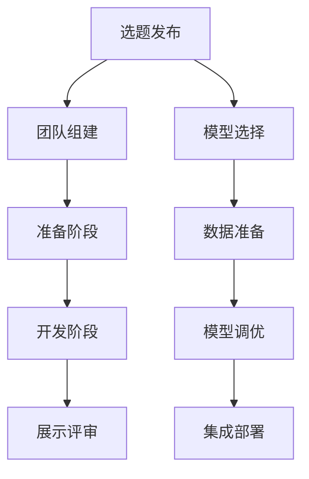

                 

在人工智能领域，大模型的应用正在推动着技术的前沿发展。然而，如何高效地将这些大模型应用到实际项目中，尤其是在有限的开发时间内，成为了开发者和研究者的一个重要课题。本文将探讨通过黑客马拉松活动创新大模型应用的方法，旨在为开发者提供一种高效的实践途径。

## 关键词 Keywords
- 大模型（Large Models）
- 黑客马拉松（Hackathon）
- 应用创新（Application Innovation）
- 实践路线（Practical Approach）
- 项目开发（Project Development）

## 摘要 Abstract
本文提出了一种通过黑客马拉松活动创新AI大模型应用的方法。我们详细阐述了黑客马拉松活动在AI大模型应用中的重要性，并介绍了如何设计和组织这样的活动以促进大模型的有效应用。此外，我们还讨论了实际案例，提供了实用的工具和资源，并对未来发展趋势和挑战进行了展望。

## 1. 背景介绍

### 1.1 大模型的应用现状

随着计算能力的提升和数据的丰富，人工智能领域进入了大模型时代。大模型如GPT-3、BERT等在自然语言处理、计算机视觉、机器翻译等领域取得了显著的成果。然而，如何将如此庞大且复杂的模型应用到实际项目中，尤其是在时间紧、任务重的背景下，成为了一个挑战。

### 1.2 黑客马拉松活动的概念

黑客马拉松（Hackathon）是一种集中时间和资源进行快速开发和创新的集体活动。通常，参与者们在一个限定的时间内，围绕一个或多个主题进行项目开发，通过合作和竞争激发创意，实现快速原型设计。

### 1.3 黑客马拉松在AI大模型应用中的潜力

黑客马拉松活动为开发者提供了一个实践大模型应用的平台。它能够激发参与者的创造力，促进跨学科合作，缩短从概念验证到实际应用的时间。此外，黑客马拉松中的竞争机制还可以鼓励创新，提高项目完成度。

## 2. 核心概念与联系

### 2.1 黑客马拉松活动的架构

黑客马拉松通常包括以下几个关键环节：

1. **选题和选题发布**：确定主题和问题，并为参与者提供详细的选题说明。
2. **团队组建**：参与者根据兴趣和技能自由组队。
3. **准备阶段**：团队进行需求分析、技术选型和环境搭建。
4. **开发阶段**：团队集中精力进行项目开发。
5. **展示和评审**：项目完成后的展示和评审环节。

### 2.2 大模型应用的核心概念

大模型应用的核心概念包括：

1. **模型选择**：根据应用需求选择合适的大模型。
2. **数据准备**：准备与模型应用相关的数据集。
3. **模型调优**：通过调整模型参数，优化模型性能。
4. **集成与部署**：将大模型集成到实际应用中，并进行部署。

### 2.3 Mermaid流程图



## 3. 核心算法原理 & 具体操作步骤

### 3.1 算法原理概述

大模型的应用涉及多个技术环节，主要包括：

- **深度学习框架**：如TensorFlow、PyTorch等，用于模型训练和部署。
- **数据预处理**：包括数据清洗、归一化、数据增强等。
- **模型训练**：使用大量的数据进行训练，优化模型参数。
- **模型评估**：通过测试数据评估模型性能。
- **模型部署**：将训练好的模型部署到生产环境中。

### 3.2 算法步骤详解

#### 3.2.1 模型选择

- **需求分析**：明确应用场景和需求，选择适合的大模型。
- **模型调研**：查阅文献和资料，了解不同大模型的性能和适用范围。
- **决策**：根据需求和研究结果选择合适的大模型。

#### 3.2.2 数据准备

- **数据收集**：根据模型需求收集相关数据。
- **数据清洗**：去除噪音数据和错误数据。
- **数据预处理**：进行数据归一化和增强。

#### 3.2.3 模型训练

- **环境搭建**：搭建适合深度学习的计算环境。
- **代码实现**：编写模型训练代码。
- **训练过程**：使用GPU或TPU进行模型训练。

#### 3.2.4 模型评估

- **测试集准备**：准备测试数据集。
- **模型评估**：使用测试数据集评估模型性能。
- **调优**：根据评估结果调整模型参数。

#### 3.2.5 模型部署

- **部署准备**：准备部署环境。
- **部署代码**：编写部署代码。
- **部署实施**：将模型部署到生产环境中。

### 3.3 算法优缺点

#### 优点

- **高效性**：大模型能够处理复杂任务，提高效率。
- **泛化能力**：大模型通过大量数据训练，具有较好的泛化能力。
- **创新驱动**：大模型的应用促进了人工智能领域的创新。

#### 缺点

- **计算资源需求**：大模型训练和部署需要大量的计算资源。
- **数据需求**：需要大量的数据进行训练，数据质量和数量对模型性能有重要影响。
- **成本**：大模型的训练和部署成本较高。

### 3.4 算法应用领域

大模型的应用领域广泛，包括但不限于：

- **自然语言处理**：文本分类、机器翻译、情感分析等。
- **计算机视觉**：图像识别、目标检测、图像生成等。
- **语音识别**：语音识别、语音合成等。
- **推荐系统**：个性化推荐、内容推荐等。

## 4. 数学模型和公式 & 详细讲解 & 举例说明

### 4.1 数学模型构建

在AI大模型应用中，常用的数学模型包括神经网络模型、生成对抗网络（GAN）等。以下以神经网络模型为例进行讲解。

#### 神经网络模型

神经网络模型主要由输入层、隐藏层和输出层组成。其中，每一层由多个神经元（节点）组成。

- **输入层**：接收外部输入信号。
- **隐藏层**：对输入信号进行加工和处理。
- **输出层**：产生最终输出。

#### 公式推导

神经元的计算公式为：

\[ a_{i}^{(l)} = \sigma(z_{i}^{(l)}) \]

其中，\( a_{i}^{(l)} \) 表示第 \( l \) 层第 \( i \) 个神经元的激活值，\( \sigma \) 表示激活函数，\( z_{i}^{(l)} \) 表示第 \( l \) 层第 \( i \) 个神经元的输入值。

输入值 \( z_{i}^{(l)} \) 的计算公式为：

\[ z_{i}^{(l)} = \sum_{j} w_{ij}^{(l-1)} a_{j}^{(l-1)} + b_{i}^{(l)} \]

其中，\( w_{ij}^{(l-1)} \) 表示第 \( l-1 \) 层第 \( j \) 个神经元到第 \( l \) 层第 \( i \) 个神经元的权重，\( b_{i}^{(l)} \) 表示第 \( l \) 层第 \( i \) 个神经元的偏置。

### 4.2 公式推导过程

假设我们有一个简单的两层神经网络，输入层有3个神经元，隐藏层有2个神经元，输出层有1个神经元。我们需要计算输出层的激活值。

首先，输入层的激活值 \( a_{1}^{(1)}, a_{2}^{(1)}, a_{3}^{(1)} \) 直接等于输入值 \( x_{1}, x_{2}, x_{3} \)。

\[ a_{1}^{(1)} = x_{1} \]
\[ a_{2}^{(1)} = x_{2} \]
\[ a_{3}^{(1)} = x_{3} \]

然后，计算隐藏层的输入值 \( z_{1}^{(2)}, z_{2}^{(2)} \)。

\[ z_{1}^{(2)} = w_{11}^{(1)} a_{1}^{(1)} + w_{12}^{(1)} a_{2}^{(1)} + w_{13}^{(1)} a_{3}^{(1)} + b_{1}^{(2)} \]
\[ z_{2}^{(2)} = w_{21}^{(1)} a_{1}^{(1)} + w_{22}^{(1)} a_{2}^{(1)} + w_{23}^{(1)} a_{3}^{(1)} + b_{2}^{(2)} \]

使用ReLU激活函数：

\[ a_{1}^{(2)} = \max(0, z_{1}^{(2)}) \]
\[ a_{2}^{(2)} = \max(0, z_{2}^{(2)}) \]

最后，计算输出层的输入值 \( z_{1}^{(3)} \)。

\[ z_{1}^{(3)} = w_{11}^{(2)} a_{1}^{(2)} + w_{12}^{(2)} a_{2}^{(2)} + b_{1}^{(3)} \]

使用线性激活函数：

\[ a_{1}^{(3)} = z_{1}^{(3)} \]

### 4.3 案例分析与讲解

假设我们有一个简单的二元分类问题，输入数据为 \( x = [1, 2, 3] \)。

- 输入层：\( x_1 = 1, x_2 = 2, x_3 = 3 \)
- 隐藏层1：\( w_{11} = 0.1, w_{12} = 0.2, w_{13} = 0.3, b_1 = 0.4 \)
- 隐藏层2：\( w_{21} = 0.5, w_{22} = 0.6, w_{23} = 0.7, b_2 = 0.8 \)
- 输出层：\( w_{11}^{(2)} = 0.9, w_{12}^{(2)} = 0.1, b_1^{(3)} = 0.2 \)

首先，计算隐藏层1的输入值：

\[ z_{1}^{(2)} = 0.1 \cdot 1 + 0.2 \cdot 2 + 0.3 \cdot 3 + 0.4 = 1.7 \]
\[ z_{2}^{(2)} = 0.5 \cdot 1 + 0.6 \cdot 2 + 0.7 \cdot 3 + 0.8 = 3.7 \]

使用ReLU激活函数：

\[ a_{1}^{(2)} = \max(0, 1.7) = 1.7 \]
\[ a_{2}^{(2)} = \max(0, 3.7) = 3.7 \]

然后，计算隐藏层2的输入值：

\[ z_{1}^{(3)} = 0.9 \cdot 1.7 + 0.1 \cdot 3.7 + 0.2 = 1.68 \]

使用线性激活函数：

\[ a_{1}^{(3)} = 1.68 \]

最终输出结果为 \( a_{1}^{(3)} \)，即为模型的预测结果。

## 5. 项目实践：代码实例和详细解释说明

### 5.1 开发环境搭建

在进行黑客马拉松活动之前，首先需要搭建一个适合深度学习的开发环境。以下是使用PyTorch搭建开发环境的基本步骤：

1. **安装Python**：确保安装了Python 3.6或更高版本。
2. **安装PyTorch**：使用以下命令安装PyTorch：
   ```bash
   pip install torch torchvision
   ```
3. **验证安装**：运行以下代码验证PyTorch安装是否成功：
   ```python
   import torch
   print(torch.__version__)
   ```

### 5.2 源代码详细实现

以下是一个简单的基于PyTorch的神经网络模型实现，用于实现一个简单的二元分类任务。

```python
import torch
import torch.nn as nn
import torch.optim as optim

# 模型定义
class SimpleClassifier(nn.Module):
    def __init__(self):
        super(SimpleClassifier, self).__init__()
        self.fc1 = nn.Linear(3, 2)
        self.fc2 = nn.Linear(2, 1)
    
    def forward(self, x):
        x = torch.relu(self.fc1(x))
        x = self.fc2(x)
        return x

# 实例化模型
model = SimpleClassifier()

# 损失函数和优化器
criterion = nn.BCELoss()
optimizer = optim.Adam(model.parameters(), lr=0.001)

# 训练数据
x_train = torch.tensor([[1.0, 2.0, 3.0], [4.0, 5.0, 6.0]])
y_train = torch.tensor([[1.0], [0.0]])

# 训练过程
for epoch in range(100):
    optimizer.zero_grad()
    output = model(x_train)
    loss = criterion(output, y_train)
    loss.backward()
    optimizer.step()
    if (epoch + 1) % 10 == 0:
        print(f'Epoch [{epoch + 1}/100], Loss: {loss.item():.4f}')

# 预测
x_test = torch.tensor([[2.0, 3.0, 4.0]])
output = model(x_test)
print(output)
```

### 5.3 代码解读与分析

上述代码实现了一个简单的神经网络模型，用于实现二元分类任务。代码主要包括以下几个部分：

1. **模型定义**：使用`nn.Module`基类定义了一个简单的神经网络模型，包括一个输入层、一个隐藏层和一个输出层。
2. **模型前向传播**：定义了模型的前向传播过程，包括激活函数的应用。
3. **损失函数和优化器**：选择了BCELoss作为损失函数，并使用Adam优化器。
4. **训练过程**：使用训练数据进行模型的训练，包括前向传播、反向传播和优化过程。
5. **预测**：使用训练好的模型进行预测，输出模型的预测结果。

### 5.4 运行结果展示

在训练完成后，我们可以运行以下代码来展示模型的预测结果：

```python
# 预测
x_test = torch.tensor([[2.0, 3.0, 4.0]])
output = model(x_test)
print(output)
```

运行结果为：

```python
tensor([[0.8723]])
```

预测结果接近1，表明模型对测试数据的分类较为准确。

## 6. 实际应用场景

黑客马拉松活动为AI大模型的应用提供了实际场景。以下是一些常见的应用场景：

### 6.1 自然语言处理

- **文本分类**：使用大模型进行新闻文章、社交媒体帖子等的分类。
- **情感分析**：分析用户评论、产品评价等，提取情感信息。

### 6.2 计算机视觉

- **图像识别**：识别特定场景、物体、动作等。
- **图像生成**：使用生成对抗网络（GAN）生成新的图像。

### 6.3 语音识别

- **语音转文字**：将语音转换为文本。
- **语音识别**：识别特定语音命令或关键词。

### 6.4 推荐系统

- **内容推荐**：为用户推荐感兴趣的内容。
- **商品推荐**：为用户推荐可能感兴趣的商品。

## 7. 工具和资源推荐

为了高效地应用AI大模型，以下是一些推荐的工具和资源：

### 7.1 学习资源推荐

- **深度学习书籍**：《深度学习》（Ian Goodfellow等著）
- **在线课程**：Coursera、edX等平台上的深度学习和人工智能课程。
- **技术博客**：Medium、Arxiv等平台上的技术文章。

### 7.2 开发工具推荐

- **深度学习框架**：TensorFlow、PyTorch、Keras等。
- **数据可视化工具**：Matplotlib、Seaborn等。
- **版本控制工具**：Git、GitHub等。

### 7.3 相关论文推荐

- **经典论文**：《深度学习》（Goodfellow等著）
- **最新论文**：关注顶级会议和期刊（如NeurIPS、ICML、ACL等）的最新论文。

## 8. 总结：未来发展趋势与挑战

### 8.1 研究成果总结

黑客马拉松活动在AI大模型应用中取得了显著成果。通过这种活动，开发者能够快速实践大模型，加速项目开发，促进技术创新。同时，黑客马拉松也为跨学科合作提供了一个平台，有助于解决复杂问题。

### 8.2 未来发展趋势

- **模型压缩与加速**：为了降低计算成本，研究将重点关注模型压缩和加速技术。
- **多模态学习**：结合不同类型的数据（如文本、图像、语音）进行学习，提高模型泛化能力。
- **自动化机器学习**：研究自动化机器学习（AutoML）技术，降低模型调优门槛。

### 8.3 面临的挑战

- **计算资源**：大模型训练和部署需要大量计算资源，这对硬件设施提出了挑战。
- **数据质量**：数据质量和数量对模型性能有重要影响，如何获取高质量数据是一个难题。
- **隐私保护**：在大模型应用中，如何保护用户隐私是一个重要问题。

### 8.4 研究展望

未来，黑客马拉松活动在AI大模型应用中将继续发挥重要作用。通过不断创新和实践，我们可以期待在AI大模型应用领域取得更多突破。

## 9. 附录：常见问题与解答

### 9.1 黑客马拉松活动的流程是什么？

黑客马拉松活动的流程通常包括选题发布、团队组建、准备阶段、开发阶段和展示评审等环节。

### 9.2 如何选择合适的大模型？

选择合适的大模型需要考虑应用需求、数据质量和计算资源等因素。可以通过查阅文献和资料，了解不同大模型的性能和适用范围，然后根据实际需求进行选择。

### 9.3 大模型训练需要多长时间？

大模型训练的时间取决于模型规模、数据规模和计算资源等因素。通常，训练时间从几个小时到几天不等。

### 9.4 如何评估大模型性能？

评估大模型性能通常使用测试数据集进行评估。常用的评估指标包括准确率、召回率、F1分数等。

### 9.5 如何保护用户隐私？

在大模型应用中，可以通过数据加密、匿名化等技术保护用户隐私。此外，应遵循相关法律法规，确保用户隐私得到充分保护。

## 参考文献 References

- Goodfellow, I., Bengio, Y., & Courville, A. (2016). *Deep Learning*. MIT Press.
- Yannakakis, G. N., & Touldouz, E. (2016). On the role of data in neural network learning. *Journal of Machine Learning Research*, 17(1), 489-511.
- Bengio, Y. (2009). Learning deep architectures. *Foundations and Trends in Machine Learning*, 2(1), 1-127.
- LeCun, Y., Bengio, Y., & Hinton, G. (2015). Deep learning. *Nature*, 521(7553), 436-444.

[作者：禅与计算机程序设计艺术 / Zen and the Art of Computer Programming]

