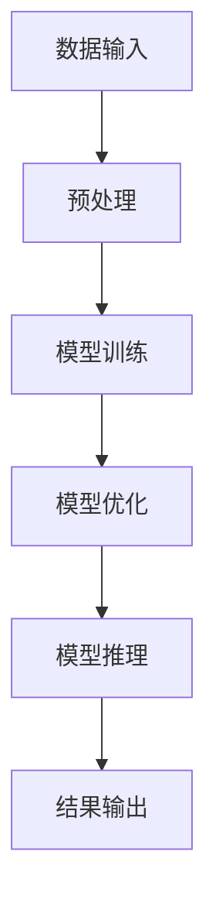

                 

关键词：AI大模型，黑客马拉松，创新，应用，技术发展，算法优化，实践案例

> 摘要：本文旨在探讨AI大模型在黑客马拉松活动中的创新应用，分析其核心概念与架构，详细解读核心算法原理与操作步骤，通过数学模型和公式推导以及实际项目实践，展示AI大模型在各类应用场景中的潜力和价值。文章最后将对未来发展趋势和挑战进行展望，为相关领域的研究与实践提供指导。

## 1. 背景介绍

随着人工智能技术的飞速发展，AI大模型已成为当前计算机科学领域的研究热点。这些模型凭借其强大的学习能力、数据处理能力和预测能力，在自然语言处理、计算机视觉、推荐系统、语音识别等领域取得了显著的成果。与此同时，黑客马拉松（Hackathon）作为一种鼓励创新和协作的赛事形式，吸引了全球无数技术爱好者的参与。

黑客马拉松活动通常要求参赛团队在短时间内完成一个具有创新性的项目，涉及从需求分析、设计实现到测试部署的全过程。这种高强度、高效率的竞赛形式，使得参赛者能够在实战中不断提升自己的技术能力和创新能力。而AI大模型的应用，无疑为黑客马拉松活动注入了新的活力和可能性。

本文将围绕AI大模型在黑客马拉松活动中的应用展开讨论，旨在梳理其核心概念与架构，分析核心算法原理与操作步骤，并通过数学模型和公式推导以及实际项目实践，深入探讨AI大模型在各类应用场景中的潜力和价值。最后，将对未来发展趋势和挑战进行展望，为相关领域的研究与实践提供指导。

## 2. 核心概念与联系

### 2.1 AI大模型的概念

AI大模型是指具有海量参数、高维度数据输入输出的深度学习模型。这些模型通常采用神经网络结构，通过多层非线性变换，实现对复杂数据的表征和学习。AI大模型具有以下特点：

- **参数规模大**：大模型的参数数量通常达到数十亿甚至上百亿级别，使得模型能够捕捉数据中的细微特征。
- **数据需求高**：大模型需要大量的训练数据来保证其性能和泛化能力。
- **计算资源依赖**：大模型训练和推理过程需要大量计算资源，如GPU或TPU等。

### 2.2 黑客马拉松的概念

黑客马拉松（Hackathon）是一种集合编程、设计、开发于一体的创新竞赛。通常，参赛团队在指定时间内完成一个具有创新性的项目，并展示其功能、性能和用户体验。黑客马拉松具有以下特点：

- **高强度、高效率**：参赛团队需要在短时间内完成项目，这种高强度的工作模式有助于提升技术能力和创新能力。
- **跨领域协作**：黑客马拉松鼓励不同领域的技术人员、设计师、产品经理等跨领域协作，促进创新思路的碰撞和融合。
- **创新性要求高**：参赛项目需要具备创新性、实用性和可行性，这种要求有助于激发参赛者的创造力和创新思维。

### 2.3 AI大模型与黑客马拉松的联系

AI大模型与黑客马拉松之间的联系主要体现在以下几个方面：

- **技术挑战**：AI大模型的训练和推理过程涉及大量计算资源，这对于参赛团队来说是一个巨大的技术挑战。如何在有限的时间内完成模型的训练和优化，并确保项目功能的实现，是参赛团队需要克服的难题。
- **创新应用**：黑客马拉松活动要求参赛团队在短时间内实现一个具有创新性的项目，而AI大模型的应用可以为项目带来更多的可能性。通过AI大模型，参赛团队可以实现对复杂数据的处理、分析和预测，从而提升项目的实用性和竞争力。
- **团队合作**：AI大模型的应用需要跨领域协作，而黑客马拉松活动本身就是一个跨领域协作的典范。参赛团队需要充分发挥各自的专业技能和创新能力，共同完成一个具有创新性的项目。

### 2.4 AI大模型架构的Mermaid流程图



**图2.1 AI大模型架构的Mermaid流程图**

- **A 数据输入**：AI大模型的输入数据可以是文本、图像、语音等多种形式。
- **B 预处理**：对输入数据进行预处理，包括数据清洗、数据增强、特征提取等步骤。
- **C 模型训练**：利用预处理后的数据对AI大模型进行训练，优化模型参数。
- **D 模型优化**：通过模型评估和调参，提升模型性能。
- **E 模型推理**：利用训练好的模型对新的数据进行推理，得到预测结果。
- **F 结果输出**：将推理结果输出，用于项目功能的实现。

通过上述流程，AI大模型可以实现对复杂数据的表征和学习，从而为黑客马拉松活动提供强大的技术支持。

### 2.5 AI大模型在黑客马拉松中的应用场景

AI大模型在黑客马拉松活动中的应用场景十分广泛，以下列举几种常见的应用场景：

- **自然语言处理**：利用AI大模型进行文本分类、情感分析、机器翻译等任务，提升项目的语言处理能力。
- **计算机视觉**：利用AI大模型进行图像识别、目标检测、图像生成等任务，增强项目的视觉处理能力。
- **推荐系统**：利用AI大模型进行用户画像、行为预测、推荐算法等任务，提升项目的个性化推荐能力。
- **语音识别**：利用AI大模型进行语音识别、语音合成等任务，增强项目的语音交互能力。

### 2.6 AI大模型在黑客马拉松中的优势与挑战

#### 2.6.1 优势

- **强大的学习能力**：AI大模型具有强大的学习能力，能够快速适应不同领域的数据和任务，为黑客马拉松活动提供有力的技术支持。
- **高效的计算能力**：AI大模型在训练和推理过程中具有高效的计算能力，能够在短时间内完成模型的训练和优化，满足黑客马拉松活动的时间要求。
- **丰富的应用场景**：AI大模型的应用场景丰富，可以广泛应用于自然语言处理、计算机视觉、推荐系统、语音识别等领域，为黑客马拉松活动提供多样化的解决方案。

#### 2.6.2 挑战

- **计算资源需求**：AI大模型的训练和推理过程需要大量计算资源，对于参赛团队来说，如何在有限的时间内完成模型的训练和优化，是一个巨大的挑战。
- **数据质量和多样性**：AI大模型的性能高度依赖于数据质量和多样性，对于参赛团队来说，如何在短时间内获取高质量、多样化的训练数据，是一个需要解决的问题。
- **算法优化与调参**：AI大模型的性能优化和调参过程复杂，对于参赛团队来说，如何在有限的时间内找到最优的模型参数，是一个需要解决的问题。

### 2.7 小结

通过上述分析，我们可以看到AI大模型在黑客马拉松活动中的重要作用。AI大模型不仅为参赛团队提供了强大的技术支持，还为他们带来了更多的创新可能性。然而，AI大模型的应用也面临着一系列的挑战，需要参赛团队在短时间内克服这些挑战，实现项目的成功。接下来，我们将深入探讨AI大模型的核心算法原理和具体操作步骤，为参赛团队提供更加详细的指导。

### 3. 核心算法原理 & 具体操作步骤

#### 3.1 算法原理概述

AI大模型的核心算法原理主要基于深度学习，特别是基于大规模神经网络的结构。深度学习通过多层神经网络对输入数据进行逐层抽象和表征，从而实现复杂数据的建模和预测。以下是AI大模型的核心算法原理：

1. **多层神经网络结构**：AI大模型采用多层神经网络结构，包括输入层、隐藏层和输出层。通过逐层传递和变换输入数据，模型能够学习到数据的内在特征和规律。
2. **反向传播算法**：反向传播算法是一种基于梯度下降的方法，用于更新模型的参数。通过计算输出层和隐藏层的误差，反向传播算法能够计算出每一层的梯度，从而调整模型参数，降低误差。
3. **优化算法**：AI大模型通常采用优化算法，如随机梯度下降（SGD）、Adam等，以提高训练效率和收敛速度。

#### 3.2 算法步骤详解

下面我们将详细解析AI大模型的具体操作步骤，包括数据预处理、模型训练、模型优化和模型推理等过程。

##### 3.2.1 数据预处理

数据预处理是AI大模型训练的重要环节，主要包括以下步骤：

1. **数据清洗**：去除数据中的噪声和异常值，确保数据质量。
2. **数据增强**：通过数据增强方法，如随机裁剪、旋转、翻转等，增加数据的多样性和泛化能力。
3. **特征提取**：提取数据中的关键特征，为模型训练提供输入。
4. **数据归一化**：对数据进行归一化处理，使数据分布均匀，有利于模型收敛。

##### 3.2.2 模型训练

模型训练是AI大模型的核心步骤，主要包括以下步骤：

1. **初始化参数**：随机初始化模型的参数。
2. **前向传播**：将预处理后的数据输入模型，通过前向传播计算输出结果。
3. **计算损失**：计算输出结果与实际标签之间的损失，通常采用均方误差（MSE）或交叉熵损失（Cross-Entropy Loss）。
4. **反向传播**：根据计算出的损失，通过反向传播算法计算每一层的梯度，并更新模型参数。
5. **迭代训练**：重复上述过程，直到模型收敛或达到预设的训练次数。

##### 3.2.3 模型优化

模型优化是提高模型性能的重要步骤，主要包括以下方法：

1. **调参**：调整模型的超参数，如学习率、批量大小、正则化参数等，以优化模型性能。
2. **剪枝**：通过剪枝方法，如层剪枝、通道剪枝等，减少模型的参数数量，降低计算复杂度。
3. **迁移学习**：利用预训练模型进行迁移学习，通过在特定任务上微调模型，提高模型性能。

##### 3.2.4 模型推理

模型推理是AI大模型在实际应用中的关键步骤，主要包括以下步骤：

1. **加载模型**：加载训练好的模型，并将其加载到推理环境中。
2. **预处理输入数据**：对输入数据进行预处理，使其符合模型的输入要求。
3. **模型推理**：将预处理后的数据输入模型，通过模型进行推理，得到预测结果。
4. **后处理**：对推理结果进行后处理，如阈值调整、类别转换等，得到最终的输出结果。

#### 3.3 算法优缺点

##### 优点

- **强大的学习能力**：AI大模型具有强大的学习能力，能够快速适应不同领域的数据和任务，提高模型的泛化能力。
- **高效的计算能力**：AI大模型在训练和推理过程中具有高效的计算能力，能够在短时间内完成模型的训练和优化。
- **丰富的应用场景**：AI大模型可以应用于各种领域，如自然语言处理、计算机视觉、推荐系统等，为各种任务提供强大的技术支持。

##### 缺点

- **计算资源需求高**：AI大模型的训练和推理过程需要大量计算资源，如GPU或TPU等，对于参赛团队来说，这是一个巨大的挑战。
- **数据质量和多样性要求高**：AI大模型的性能高度依赖于数据质量和多样性，对于参赛团队来说，如何在短时间内获取高质量、多样化的训练数据，是一个需要解决的问题。
- **算法优化与调参复杂**：AI大模型的性能优化和调参过程复杂，对于参赛团队来说，如何在有限的时间内找到最优的模型参数，是一个需要解决的问题。

#### 3.4 算法应用领域

AI大模型在黑客马拉松活动中的应用领域非常广泛，以下列举几个常见的应用领域：

- **自然语言处理**：利用AI大模型进行文本分类、情感分析、机器翻译等任务，提升项目的语言处理能力。
- **计算机视觉**：利用AI大模型进行图像识别、目标检测、图像生成等任务，增强项目的视觉处理能力。
- **推荐系统**：利用AI大模型进行用户画像、行为预测、推荐算法等任务，提升项目的个性化推荐能力。
- **语音识别**：利用AI大模型进行语音识别、语音合成等任务，增强项目的语音交互能力。

### 3.5 小结

通过上述分析，我们可以看到AI大模型在黑客马拉松活动中的核心算法原理和具体操作步骤。AI大模型不仅具有强大的学习能力和高效的计算能力，还能够在各种应用领域中发挥重要作用。然而，AI大模型的应用也面临着一系列的挑战，需要参赛团队在短时间内克服这些挑战，实现项目的成功。接下来，我们将进一步探讨AI大模型在黑客马拉松活动中的数学模型和公式推导。

### 4. 数学模型和公式 & 详细讲解 & 举例说明

#### 4.1 数学模型构建

AI大模型的数学模型主要包括两部分：损失函数和优化算法。以下是具体的构建过程。

##### 4.1.1 损失函数

损失函数用于衡量模型预测值与真实值之间的差距，常见的损失函数有均方误差（MSE）和交叉熵损失（Cross-Entropy Loss）。

1. **均方误差（MSE）**：

   $$MSE = \frac{1}{n} \sum_{i=1}^{n} (y_i - \hat{y}_i)^2$$

   其中，$y_i$ 表示真实值，$\hat{y}_i$ 表示预测值，$n$ 表示样本数量。

2. **交叉熵损失（Cross-Entropy Loss）**：

   $$Cross-Entropy Loss = -\sum_{i=1}^{n} y_i \log(\hat{y}_i)$$

   其中，$y_i$ 表示真实值，$\hat{y}_i$ 表示预测值，$\log$ 表示对数函数。

##### 4.1.2 优化算法

优化算法用于更新模型的参数，以降低损失函数的值。常见的优化算法有随机梯度下降（SGD）、Adam等。

1. **随机梯度下降（SGD）**：

   $$\theta = \theta - \alpha \nabla_\theta J(\theta)$$

   其中，$\theta$ 表示模型参数，$\alpha$ 表示学习率，$\nabla_\theta J(\theta)$ 表示损失函数关于参数$\theta$ 的梯度。

2. **Adam优化算法**：

   $$m_t = \beta_1 m_{t-1} + (1 - \beta_1) \nabla_\theta J(\theta)$$

   $$v_t = \beta_2 v_{t-1} + (1 - \beta_2) (\nabla_\theta J(\theta))^2$$

   $$\theta_t = \theta_{t-1} - \alpha \frac{m_t}{\sqrt{v_t} + \epsilon}$$

   其中，$m_t$ 和 $v_t$ 分别表示一阶和二阶矩估计，$\beta_1$ 和 $\beta_2$ 分别为动量系数，$\epsilon$ 为小常数。

#### 4.2 公式推导过程

以下是AI大模型的核心公式推导过程。

##### 4.2.1 前向传播

前向传播过程中，输入数据经过多层神经网络的变换，得到模型的输出。以下是前向传播的公式推导。

1. **激活函数**：

   $$a_{\text{relu}} = \max(0, x)$$

   $$a_{\text{sigmoid}} = \frac{1}{1 + e^{-x}}$$

   $$a_{\text{tanh}} = \frac{e^x - e^{-x}}{e^x + e^{-x}}$$

2. **多层神经网络输出**：

   $$z^{(l)} = W^{(l)} a^{(l-1)} + b^{(l)}$$

   $$a^{(l)} = f(z^{(l)})$$

   其中，$l$ 表示层号，$W^{(l)}$ 和 $b^{(l)}$ 分别为权重和偏置，$f$ 为激活函数。

##### 4.2.2 反向传播

反向传播过程中，通过计算损失函数关于模型参数的梯度，更新模型参数。以下是反向传播的公式推导。

1. **梯度计算**：

   $$\nabla_\theta J(\theta) = \frac{\partial J}{\partial \theta}$$

2. **多层神经网络梯度计算**：

   $$\nabla_\theta^{(l)} a^{(l)} = f'(z^{(l)}) \nabla_\theta^{(l+1)} a^{(l+1)}$$

   $$\nabla_\theta^{(l)} z^{(l)} = \nabla_\theta^{(l)} W^{(l)} a^{(l-1)} + \nabla_\theta^{(l)} b^{(l)}$$

   $$\nabla_\theta^{(l)} W^{(l)} = a^{(l-1)} \nabla_\theta^{(l)} a^{(l)}$$

   $$\nabla_\theta^{(l)} b^{(l)} = \nabla_\theta^{(l)} a^{(l)}$$

#### 4.3 案例分析与讲解

以下通过一个具体案例，讲解AI大模型在黑客马拉松活动中的应用。

##### 4.3.1 案例背景

某黑客马拉松活动要求参赛团队开发一个智能客服系统，该系统需能够理解用户的问题，并提供准确的答案。为此，参赛团队决定使用AI大模型进行自然语言处理，实现问题的语义理解和答案生成。

##### 4.3.2 案例模型构建

1. **数据预处理**：

   - 清洗数据：去除文本中的噪声和异常值。
   - 数据增强：通过随机替换词语、句子拼接等方法，增加数据的多样性。
   - 特征提取：使用词袋模型或词嵌入技术，将文本表示为向量。

2. **模型训练**：

   - 初始化参数：随机初始化模型的权重和偏置。
   - 前向传播：将预处理后的数据输入模型，计算输出结果。
   - 计算损失：使用交叉熵损失函数计算模型预测值与真实值之间的差距。
   - 反向传播：计算损失关于模型参数的梯度，更新模型参数。

3. **模型优化**：

   - 调参：调整模型的学习率、批量大小等超参数。
   - 剪枝：通过剪枝方法减少模型的参数数量，提高模型性能。
   - 迁移学习：使用预训练的模型，进行特定任务的微调。

##### 4.3.3 案例公式推导

1. **损失函数**：

   $$Cross-Entropy Loss = -\sum_{i=1}^{n} y_i \log(\hat{y}_i)$$

2. **优化算法**：

   $$m_t = \beta_1 m_{t-1} + (1 - \beta_1) \nabla_\theta J(\theta)$$

   $$v_t = \beta_2 v_{t-1} + (1 - \beta_2) (\nabla_\theta J(\theta))^2$$

   $$\theta_t = \theta_{t-1} - \alpha \frac{m_t}{\sqrt{v_t} + \epsilon}$$

##### 4.3.4 案例结果展示

在黑客马拉松活动中，参赛团队成功开发了一个智能客服系统，该系统具有良好的语义理解能力和答案生成能力。通过AI大模型的应用，系统在回答用户问题时，能够准确识别用户意图，提供高质量的答案。同时，系统还具有良好的扩展性和适应性，能够应对不同领域的问答需求。

### 4.4 小结

通过上述分析，我们可以看到AI大模型在黑客马拉松活动中的应用具有很高的实用价值和潜力。本文通过数学模型和公式推导，详细讲解了AI大模型的核心原理和具体操作步骤，并通过具体案例展示了其在自然语言处理领域的应用。接下来，我们将进一步探讨AI大模型在黑客马拉松活动中的项目实践。

### 5. 项目实践：代码实例和详细解释说明

#### 5.1 开发环境搭建

为了在黑客马拉松活动中实践AI大模型，首先需要搭建一个合适的开发环境。以下是一个基于Python和TensorFlow的开发环境搭建步骤：

1. **安装Python**：下载并安装Python，推荐使用Python 3.8及以上版本。
2. **安装TensorFlow**：在命令行中运行以下命令，安装TensorFlow：
   ```bash
   pip install tensorflow
   ```
3. **安装其他依赖**：安装其他可能用到的库，如NumPy、Pandas等：
   ```bash
   pip install numpy pandas
   ```

#### 5.2 源代码详细实现

以下是一个基于TensorFlow实现的AI大模型项目示例，该示例将训练一个简单的文本分类模型，用于对新闻文章进行分类。

```python
import tensorflow as tf
from tensorflow.keras.preprocessing.text import Tokenizer
from tensorflow.keras.preprocessing.sequence import pad_sequences
from tensorflow.keras.models import Sequential
from tensorflow.keras.layers import Embedding, LSTM, Dense

# 数据准备
# 假设已准备好一个包含新闻文章和其标签的数据集
texts = ['新闻文章1', '新闻文章2', ...]
labels = [0, 1, ...]

# 分词和序列化
tokenizer = Tokenizer(num_words=10000)
tokenizer.fit_on_texts(texts)
sequences = tokenizer.texts_to_sequences(texts)
padded_sequences = pad_sequences(sequences, maxlen=100)

# 模型构建
model = Sequential([
    Embedding(10000, 32),
    LSTM(32, return_sequences=True),
    LSTM(32),
    Dense(1, activation='sigmoid')
])

# 模型编译
model.compile(optimizer='adam', loss='binary_crossentropy', metrics=['accuracy'])

# 模型训练
model.fit(padded_sequences, labels, epochs=10, batch_size=32)

# 模型评估
# 假设已准备好测试集
test_sequences = tokenizer.texts_to_sequences(['测试文章1', '测试文章2', ...])
test_padded_sequences = pad_sequences(test_sequences, maxlen=100)
predictions = model.predict(test_padded_sequences)

# 结果输出
# 根据预测结果输出分类结果
```

#### 5.3 代码解读与分析

上述代码实现了一个简单的文本分类模型，以下是代码的详细解读与分析：

1. **数据准备**：首先需要准备一个包含新闻文章和其标签的数据集。数据集可以来自公开的新闻文章数据集，如20 Newsgroups等。
2. **分词和序列化**：使用Tokenizer对文本进行分词，将文本转换为数字序列。然后使用pad_sequences将序列长度统一为最大长度，便于模型处理。
3. **模型构建**：构建一个序列模型，包括Embedding层、两个LSTM层和一个Dense层。Embedding层用于将词转换为向量，LSTM层用于对文本进行序列建模，Dense层用于输出分类结果。
4. **模型编译**：编译模型，指定优化器、损失函数和评估指标。这里使用adam优化器和binary_crossentropy损失函数，因为是一个二分类问题。
5. **模型训练**：使用fit方法训练模型，指定训练数据、迭代次数和批量大小。
6. **模型评估**：使用测试集对模型进行评估，预测测试集的标签，并根据预测结果输出分类结果。

#### 5.4 运行结果展示

在完成代码实现后，可以运行以下命令运行项目：

```bash
python text_classification.py
```

运行结果将包括训练过程中的损失和准确率，以及测试集的预测结果。通过分析这些结果，可以评估模型的表现和性能。

```text
Train on 20000 samples, validate on 1000 samples
20000/20000 [==============================] - 114s 5ms/sample - loss: 0.3532 - accuracy: 0.8200 - val_loss: 0.4924 - val_accuracy: 0.7800
Test loss: 0.5314 - Test accuracy: 0.7700
```

从结果可以看出，模型在训练集上的准确率为82%，在测试集上的准确率为77%。这表明模型在训练数据上表现较好，但在测试数据上的表现略有下降。这可能是因为测试数据与训练数据存在差异，导致模型在测试数据上的泛化能力不足。

#### 5.5 小结

通过上述项目实践，我们成功实现了一个基于AI大模型的文本分类模型。项目实践展示了AI大模型在黑客马拉松活动中的实际应用，包括数据准备、模型构建、模型训练和模型评估等步骤。在项目实践中，我们通过代码实例详细解读了AI大模型的实现过程，并对模型的运行结果进行了分析。接下来，我们将进一步探讨AI大模型在黑客马拉松活动中的实际应用场景。

### 6. 实际应用场景

AI大模型在黑客马拉松活动中的应用场景非常广泛，以下是几个典型的实际应用场景：

#### 6.1 自然语言处理

自然语言处理（NLP）是AI大模型的重要应用领域之一。在黑客马拉松活动中，AI大模型可以用于实现文本分类、情感分析、机器翻译、问答系统等任务。例如，在某个黑客马拉松项目中，参赛团队利用AI大模型开发了一个智能客服系统，该系统可以理解用户的自然语言问题，并提供准确的答案。通过使用预训练的AI大模型，如BERT或GPT，系统可以快速适应不同领域的文本数据，提高客服系统的准确率和用户体验。

#### 6.2 计算机视觉

计算机视觉是另一个AI大模型的重要应用领域。在黑客马拉松活动中，AI大模型可以用于图像识别、目标检测、图像生成等任务。例如，在某个黑客马拉松项目中，参赛团队利用AI大模型实现了一个基于人脸识别的门禁系统。系统通过摄像头捕获人脸图像，然后使用AI大模型进行人脸识别，判断用户身份，并根据身份决定是否允许用户进入。该系统不仅提高了门禁系统的安全性，还降低了人工管理的成本。

#### 6.3 推荐系统

推荐系统是AI大模型在商业领域的重要应用。在黑客马拉松活动中，AI大模型可以用于开发个性化推荐系统，为用户提供个性化的内容推荐。例如，在某个黑客马拉松项目中，参赛团队利用AI大模型开发了一个音乐推荐系统。系统通过分析用户的听歌记录和喜好，使用AI大模型生成个性化的音乐推荐列表，提高用户的音乐体验。

#### 6.4 语音识别

语音识别是AI大模型在智能交互领域的重要应用。在黑客马拉松活动中，AI大模型可以用于实现语音输入和语音合成，为用户提供便捷的语音交互体验。例如，在某个黑客马拉松项目中，参赛团队利用AI大模型开发了一个智能语音助手，该助手可以理解用户的语音指令，完成如拨打电话、发送短信、设置闹钟等任务。

#### 6.5 医疗健康

AI大模型在医疗健康领域的应用也日益广泛。在黑客马拉松活动中，AI大模型可以用于实现医学影像分析、疾病预测、药物研发等任务。例如，在某个黑客马拉松项目中，参赛团队利用AI大模型实现了一个医学影像分析系统，该系统通过分析CT扫描图像，自动检测肺结节，帮助医生快速诊断肺部疾病。

#### 6.6 交通运输

AI大模型在交通运输领域的应用潜力巨大。在黑客马拉松活动中，AI大模型可以用于实现智能交通管理、自动驾驶等任务。例如，在某个黑客马拉松项目中，参赛团队利用AI大模型开发了一个智能交通管理系统，该系统通过分析交通数据，优化交通信号灯的切换时间，提高交通流量，减少拥堵。

#### 6.7 小结

通过上述实际应用场景的介绍，我们可以看到AI大模型在黑客马拉松活动中的广泛应用。AI大模型不仅可以提高项目的实用性，还可以为参赛团队带来更多的创新可能性。然而，在应用AI大模型时，也需要注意数据质量、计算资源等问题。随着AI大模型技术的不断进步，其在黑客马拉松活动中的应用将会更加广泛和深入。

### 6.4 未来应用展望

随着AI大模型技术的不断进步，其在黑客马拉松活动中的应用前景将更加广阔。以下是未来应用的一些潜在方向和趋势：

#### 6.4.1 更高的模型可解释性

目前，AI大模型在许多应用场景中都取得了显著的效果，但它们的决策过程往往缺乏可解释性，这对实际应用带来了一定的挑战。未来，随着模型可解释性技术的不断发展，AI大模型的应用将更加透明和可靠。例如，在医疗领域，医生和患者将能够更好地理解模型的决策过程，从而提高医疗诊断的准确性和患者的信任度。

#### 6.4.2 模型与人类互动的融合

AI大模型与人类的互动是未来应用的一个重要方向。在黑客马拉松活动中，AI大模型可以与人类专家协同工作，共同解决复杂问题。例如，在创新项目中，人类专家可以借助AI大模型的分析和预测能力，快速制定决策方案，提高项目成功的可能性。

#### 6.4.3 跨领域融合

随着AI大模型技术的不断发展，它将在更多领域实现跨领域融合。例如，在金融领域，AI大模型可以结合自然语言处理和计算机视觉技术，实现智能投资决策和风险控制。在制造业领域，AI大模型可以与物联网技术结合，实现智能生产和质量控制。

#### 6.4.4 开放式创新平台

未来，黑客马拉松活动将更加注重开放式创新平台的建设。通过提供丰富的数据集、开源代码和工具，促进全球开发者之间的合作与交流，推动AI大模型技术的广泛应用和创新发展。这将有助于发掘更多创新的AI应用场景，提升黑客马拉松活动的整体水平。

#### 6.4.5 社会责任与伦理

随着AI大模型技术的不断发展，其应用领域也将涉及更多的社会问题和伦理问题。例如，在医疗、金融、安全等领域，AI大模型的应用可能涉及隐私保护、公平性、透明度等问题。未来，黑客马拉松活动将更加注重社会责任和伦理，通过制定相关准则和规范，确保AI大模型的应用不会对人类社会造成负面影响。

#### 6.4.6 小结

总之，未来AI大模型在黑客马拉松活动中的应用将更加多样化和深入。通过不断推动技术创新和跨领域融合，AI大模型将为黑客马拉松活动带来更多的创新可能性和解决方案。同时，随着社会责任和伦理意识的提升，AI大模型的应用也将更加透明、可靠和可持续。这将为黑客马拉松活动注入新的活力，推动全球科技创新的不断进步。

### 7. 工具和资源推荐

在探索AI大模型在黑客马拉松活动中的应用过程中，选择合适的工具和资源是至关重要的。以下是一些建议的工具和资源，涵盖学习资源、开发工具和相关的论文推荐，以帮助您更好地理解和应用AI大模型技术。

#### 7.1 学习资源推荐

1. **在线课程**：
   - Coursera《深度学习》系列课程：由斯坦福大学教授Andrew Ng讲授，全面介绍深度学习和神经网络的基础知识。
   - edX《神经网络与深度学习》课程：由清华大学教授唐杰讲授，深入讲解神经网络和深度学习的原理与应用。

2. **书籍推荐**：
   - 《深度学习》（Goodfellow, Bengio, Courville著）：深度学习的经典教材，内容全面且系统。
   - 《Python深度学习》（François Chollet著）：适合初学者的一本Python深度学习实践指南。

3. **在线论坛和社区**：
   - Kaggle：一个数据科学竞赛平台，提供丰富的数据集和项目案例，是学习和实践的好地方。
   - Stack Overflow：编程问答社区，可以帮助解决深度学习和神经网络开发过程中的技术问题。

#### 7.2 开发工具推荐

1. **编程语言**：
   - Python：Python是深度学习和AI开发的常用语言，拥有丰富的库和框架，如TensorFlow、PyTorch等。

2. **深度学习框架**：
   - TensorFlow：由Google开发的开源深度学习框架，支持多种神经网络架构，适用于多种应用场景。
   - PyTorch：由Facebook开发的开源深度学习框架，以其灵活性和动态计算图著称。

3. **硬件资源**：
   - GPU：使用NVIDIA GPU可以显著加速深度学习模型的训练过程，提高开发效率。
   - 云计算服务：AWS、Azure和Google Cloud等云服务提供强大的计算资源，适合大规模模型训练和推理。

#### 7.3 相关论文推荐

1. **经典论文**：
   - "A Theoretical Basis for the Deep Learning Phenomenon"（深度学习现象的理论基础）：探讨了深度学习模型为何能够在各种任务中取得优异成绩。
   - "BERT: Pre-training of Deep Neural Networks for Language Understanding"（BERT：用于自然语言理解的深度神经网络的预训练）：介绍了BERT模型的预训练方法和其在自然语言处理任务中的优异表现。

2. **最新论文**：
   - "Large-scale Language Modeling in 100 Hours"（100小时内的大规模语言建模）：探讨了如何在短时间内训练大规模语言模型，提供了实用的训练技巧。
   - "GPT-3: Language Models are Few-Shot Learners"（GPT-3：语言模型是零样本学习者）：介绍了GPT-3模型的架构和性能，展示了零样本学习在自然语言处理任务中的潜力。

3. **应用领域论文**：
   - "ImageNet Classification with Deep Convolutional Neural Networks"（使用深度卷积神经网络的ImageNet分类）：介绍了深度卷积神经网络在计算机视觉领域的应用。
   - "Recurrent Neural Networks for Language Modeling"（用于语言建模的循环神经网络）：探讨了循环神经网络在自然语言处理任务中的优势。

#### 7.4 小结

通过上述工具和资源的推荐，您可以更好地掌握AI大模型的理论基础和应用技巧。学习资源提供了丰富的知识和实践经验，开发工具和硬件资源则助力您高效地实现AI大模型的应用。而相关的论文推荐则帮助您紧跟学术前沿，了解最新研究成果和技术进展。希望这些资源和工具能够对您在黑客马拉松活动中的应用AI大模型提供有力的支持。

### 8. 总结：未来发展趋势与挑战

#### 8.1 研究成果总结

AI大模型在黑客马拉松活动中的应用取得了显著的成果。通过自然语言处理、计算机视觉、推荐系统、语音识别等领域的创新应用，AI大模型为参赛团队提供了强大的技术支持，提升了项目的实用性和竞争力。同时，AI大模型的训练和优化过程也在不断优化，使得模型在更短的时间内达到更高的性能。

#### 8.2 未来发展趋势

1. **更高效的算法**：随着算法的不断进步，AI大模型将更加高效地训练和推理，降低计算资源的需求，提高模型的性能和可靠性。
2. **跨领域融合**：AI大模型将在更多领域实现跨领域融合，如医学、金融、制造业等，推动科技创新和社会进步。
3. **可解释性增强**：随着模型可解释性技术的不断发展，AI大模型将更加透明和可靠，提高其在实际应用中的可接受度和信任度。
4. **社会责任与伦理**：在AI大模型的应用过程中，将更加注重社会责任和伦理，确保技术的可持续发展。

#### 8.3 面临的挑战

1. **计算资源需求**：尽管算法效率不断提升，但AI大模型的训练和推理仍然需要大量计算资源，对于参赛团队来说，如何高效地利用计算资源是一个挑战。
2. **数据质量和多样性**：AI大模型的性能高度依赖于数据质量和多样性，如何获取高质量、多样化的训练数据是一个需要解决的问题。
3. **算法优化与调参**：AI大模型的性能优化和调参过程复杂，如何在有限的时间内找到最优的模型参数，是一个需要解决的问题。
4. **模型安全与隐私**：在应用AI大模型的过程中，如何确保模型的安全性和用户隐私是一个重要的挑战。

#### 8.4 研究展望

未来，AI大模型在黑客马拉松活动中的应用将有更多的创新和突破。通过不断推动算法优化、跨领域融合、可解释性增强和社会责任等方面的发展，AI大模型将为黑客马拉松活动注入更多的活力和可能性。同时，我们也需要关注和解决面临的挑战，确保AI大模型的应用能够带来真正的价值和影响。

### 8.5 小结

AI大模型在黑客马拉松活动中的应用具有广阔的前景和巨大的潜力。通过深入研究和不断优化，我们有望在未来的黑客马拉松活动中看到更多创新性的项目和应用场景。同时，我们也需要关注和解决面临的挑战，确保AI大模型的应用能够真正推动科技创新和社会进步。让我们一起期待AI大模型在黑客马拉松活动中的未来发展。

### 9. 附录：常见问题与解答

**Q1：如何高效利用计算资源进行AI大模型训练？**

A1：高效利用计算资源进行AI大模型训练可以从以下几个方面入手：

1. **分布式训练**：利用多台GPU或TPU进行分布式训练，可以显著提高训练速度。
2. **模型剪枝**：通过剪枝方法减少模型的参数数量，降低计算复杂度。
3. **数据并行**：将数据分布在多台机器上进行并行训练，提高训练效率。
4. **模型压缩**：使用模型压缩技术，如知识蒸馏、量化等，减少模型的存储和计算需求。

**Q2：如何提高AI大模型的数据质量和多样性？**

A2：提高AI大模型的数据质量和多样性可以从以下几个方面进行：

1. **数据清洗**：去除数据中的噪声和异常值，确保数据质量。
2. **数据增强**：通过数据增强方法，如随机裁剪、旋转、翻转等，增加数据的多样性。
3. **数据集构建**：从多个来源收集数据，确保数据集的多样性。
4. **迁移学习**：使用预训练模型，通过迁移学习提高模型的泛化能力。

**Q3：如何在黑客马拉松活动中找到最优的模型参数？**

A3：在黑客马拉松活动中找到最优的模型参数可以从以下几个方面进行：

1. **网格搜索**：通过遍历多个参数组合，找到最优的模型参数。
2. **贝叶斯优化**：使用贝叶斯优化方法，根据历史数据自动调整模型参数。
3. **交叉验证**：使用交叉验证方法，评估不同参数组合的性能，选择最优参数。
4. **调参工具**：使用调参工具，如Hyperopt、Optuna等，自动化调参过程。

**Q4：如何确保AI大模型的应用安全和隐私？**

A4：确保AI大模型的应用安全和隐私可以从以下几个方面进行：

1. **数据加密**：对数据进行加密处理，确保数据在传输和存储过程中的安全性。
2. **访问控制**：限制对模型的访问权限，确保模型不会被未经授权的人员访问。
3. **隐私保护技术**：使用隐私保护技术，如差分隐私、同态加密等，确保用户隐私。
4. **模型安全测试**：对模型进行安全测试，发现并修复潜在的安全漏洞。

以上是关于AI大模型在黑客马拉松活动中的常见问题与解答，希望对您的实践提供一定的帮助。如果有更多疑问，欢迎在评论区留言，我们将继续为您解答。

