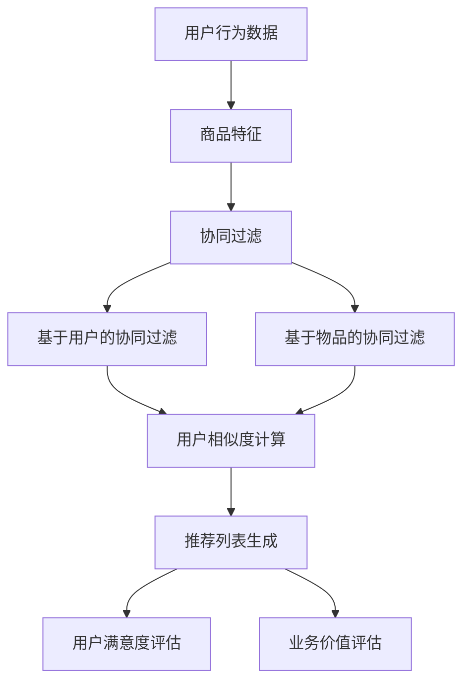

                 

## 摘要

随着人工智能技术的飞速发展，尤其是大模型（如GPT、BERT等）的广泛应用，电商搜索推荐系统在用户体验、业务增长和市场营销等方面取得了显著的提升。本文旨在探讨AI大模型在电商搜索推荐领域的业务价值评估方法，通过对相关核心概念、算法原理、数学模型、实践案例以及应用场景的分析，为电商企业优化推荐系统提供理论支持和实践指导。本文将深入探讨以下几个方面：

1. **背景介绍**：概述电商搜索推荐系统的发展历程及其在现代电商运营中的重要性。
2. **核心概念与联系**：详细介绍与电商搜索推荐相关的主要概念，并运用Mermaid流程图展示其关系。
3. **核心算法原理与具体操作步骤**：解析主流推荐算法的工作原理及优化方法，并提供具体操作步骤。
4. **数学模型与公式**：阐述推荐系统的数学模型构建及公式推导，结合实际案例进行说明。
5. **项目实践**：通过代码实例展示算法在实际项目中的应用，并进行分析和解读。
6. **实际应用场景**：探讨AI大模型在电商推荐中的具体应用，以及未来应用的展望。
7. **工具和资源推荐**：为读者提供学习资源、开发工具和相关论文推荐。
8. **总结与展望**：总结研究成果，展望未来发展趋势及面临的挑战。

<|assistant|>## 1. 背景介绍

电商搜索推荐系统是电子商务领域的重要组成部分，它通过分析用户的历史行为和偏好，向用户推荐相关的商品或服务。随着互联网的普及和消费者对个性化体验需求的增加，推荐系统在电商业务中的作用日益凸显。

### 1.1 发展历程

电商搜索推荐系统的发展可以追溯到20世纪90年代末。最初，推荐系统主要依赖于基于内容的推荐方法，即通过分析商品的特征和用户的兴趣来推荐相似的商品。然而，这种方法存在明显的局限性，无法满足用户日益增长的个性化需求。

进入21世纪，随着大数据和机器学习技术的崛起，基于协同过滤和基于模型的推荐方法相继出现。协同过滤方法通过分析用户之间的行为模式来推荐商品，而基于模型的方法则通过构建用户和商品之间的相似度模型进行推荐。这些方法在一定程度上提高了推荐系统的准确性和效果。

近年来，随着AI大模型的兴起，推荐系统迎来了新的变革。大模型，如GPT、BERT等，凭借其强大的文本处理能力和自学习能力，能够更好地理解用户的意图和需求，从而提供更为精准和个性化的推荐。例如，GPT-3已经能够生成高度个性化的商品描述和推荐文案，极大地提升了用户体验和转化率。

### 1.2 现代电商运营的重要性

在当今的电商市场中，推荐系统已经成为提升用户粘性和转化率的关键手段。通过精准的推荐，电商企业不仅能够提高用户的购物满意度，还能有效降低营销成本，提升业务增长。

首先，推荐系统能够为用户提供个性化的购物体验。通过分析用户的历史行为和兴趣，推荐系统能够为每位用户量身定制推荐列表，从而提高用户的满意度和忠诚度。

其次，推荐系统有助于电商企业优化库存管理和供应链。通过预测用户的需求，电商企业可以更准确地调整库存策略，减少库存积压和商品过时的风险。

此外，推荐系统还能够提高广告投放的效果。通过分析用户的行为数据和兴趣标签，推荐系统可以帮助电商企业精准投放广告，提高广告的点击率和转化率。

总之，随着AI大模型技术的不断成熟，电商搜索推荐系统在电商运营中的重要性将日益凸显。企业只有不断提升推荐系统的质量和效果，才能在激烈的市场竞争中脱颖而出。

### 1.3 文章结构概述

本文将首先介绍电商搜索推荐系统的相关核心概念，并通过Mermaid流程图展示它们之间的关系。随后，我们将深入探讨AI大模型在推荐系统中的应用原理和操作步骤。在此基础上，本文将详细解析推荐系统的数学模型和公式，并通过实际案例进行说明。最后，本文将总结研究成果，展望未来发展趋势和面临的挑战，并推荐相关的学习资源和开发工具。

## 2. 核心概念与联系

在探讨AI大模型在电商搜索推荐领域的业务价值评估方法之前，有必要对与推荐系统相关的一系列核心概念进行详细介绍，并运用Mermaid流程图展示它们之间的联系。这些概念包括用户行为数据、商品特征、协同过滤、基于模型的推荐方法等。

### 2.1 用户行为数据

用户行为数据是推荐系统的基石。它包括用户在电商平台上的一系列操作，如浏览历史、购买记录、搜索关键词、点击行为等。通过分析这些数据，推荐系统可以了解用户的兴趣和偏好，从而为其提供个性化的推荐。

### 2.2 商品特征

商品特征是指商品的各种属性，如价格、品牌、分类、评分等。这些特征是构建用户与商品之间相似度模型的重要依据。通过分析商品特征，推荐系统可以找到与用户兴趣相匹配的商品。

### 2.3 协同过滤

协同过滤是一种基于用户行为的推荐方法。它通过分析用户之间的相似度，找出相似用户的共同喜好，并将其推荐给目标用户。协同过滤主要分为两种：基于用户的协同过滤（User-Based CF）和基于物品的协同过滤（Item-Based CF）。

### 2.4 基于模型的推荐方法

基于模型的推荐方法通过构建用户与商品之间的预测模型，来实现个性化推荐。常见的基于模型的推荐方法包括矩阵分解、K-最近邻（KNN）算法、决策树、神经网络等。这些方法通过学习和预测用户的行为模式，为用户提供精准的推荐。

### 2.5 Mermaid流程图

为了更好地展示这些核心概念之间的联系，我们可以使用Mermaid流程图来描述它们。以下是一个简化的Mermaid流程图示例：



在这个流程图中，用户行为数据和商品特征是推荐系统的输入，它们经过协同过滤和基于模型的推荐方法处理后，生成推荐列表。推荐列表的质量通过用户满意度评估和业务价值评估进行反馈和优化。

### 2.6 大模型在推荐系统中的作用

随着AI大模型技术的发展，大模型在推荐系统中的应用越来越广泛。例如，GPT-3可以通过理解用户的语言表达，生成个性化的推荐文案；BERT可以通过分析用户的浏览历史和搜索关键词，为用户提供更精准的推荐。大模型的应用不仅提高了推荐系统的效果，还极大地丰富了推荐系统的功能，使其能够更好地满足用户的个性化需求。

通过上述核心概念的介绍和Mermaid流程图的展示，我们可以更清晰地理解电商搜索推荐系统的整体架构和运作机制。接下来，本文将深入探讨AI大模型在推荐系统中的应用原理和具体操作步骤。

## 3. 核心算法原理与具体操作步骤

在电商搜索推荐系统中，算法的选择和优化直接影响到推荐效果和用户体验。本节将介绍几种主流的推荐算法，包括协同过滤、矩阵分解、K-最近邻（KNN）算法以及神经网络等，并详细解析其工作原理和操作步骤。

### 3.1 协同过滤算法

协同过滤（Collaborative Filtering）是一种基于用户行为和商品交互数据的推荐方法。它的核心思想是通过分析用户之间的相似度，将其他用户喜欢的商品推荐给目标用户。

#### 3.1.1 基于用户的协同过滤（User-Based CF）

**原理**：基于用户的协同过滤通过计算用户之间的相似度，找到与目标用户最相似的其他用户，然后推荐这些用户喜欢的商品。

**操作步骤**：

1. **用户相似度计算**：使用余弦相似度、皮尔逊相关系数等方法计算用户之间的相似度。
2. **推荐列表生成**：对每个用户，找到与其最相似的K个用户，推荐这些用户喜欢的商品。
3. **推荐效果评估**：通过用户点击率、购买率等指标评估推荐效果，并根据反馈调整推荐策略。

#### 3.1.2 基于物品的协同过滤（Item-Based CF）

**原理**：基于物品的协同过滤通过计算商品之间的相似度，将其他用户喜欢的相似商品推荐给目标用户。

**操作步骤**：

1. **商品相似度计算**：使用余弦相似度、余弦相似度、Jaccard系数等方法计算商品之间的相似度。
2. **推荐列表生成**：对每个用户，找到其当前商品与哪些其他商品相似，推荐这些相似商品。
3. **推荐效果评估**：同基于用户的协同过滤。

#### 3.1.3 协同过滤的优缺点

**优点**：

- **简单易实现**：协同过滤算法的原理相对简单，易于理解和实现。
- **效果较好**：在数据量较大时，协同过滤能够有效地提高推荐精度。

**缺点**：

- **冷启动问题**：对于新用户或新商品，由于缺乏历史数据，协同过滤效果较差。
- **可扩展性差**：随着用户和商品数量的增加，协同过滤算法的计算复杂度急剧上升。

### 3.2 矩阵分解算法

矩阵分解（Matrix Factorization）是一种将用户-商品评分矩阵分解为低维用户特征矩阵和商品特征矩阵的推荐方法。通过这种方式，可以更好地理解用户和商品之间的潜在关系。

#### 3.2.1 原理

矩阵分解通过求解最小二乘问题，将原始的高维用户-商品评分矩阵分解为两个低维矩阵的乘积。用户特征矩阵和商品特征矩阵中的元素表示用户和商品的潜在特征。

#### 3.2.2 操作步骤

1. **初始化参数**：随机初始化用户特征矩阵和商品特征矩阵。
2. **梯度下降优化**：使用梯度下降或随机梯度下降（SGD）方法，最小化预测误差。
3. **预测评分**：通过用户特征矩阵和商品特征矩阵的乘积，预测用户对商品的评分。
4. **推荐列表生成**：根据预测评分，为用户生成推荐列表。
5. **推荐效果评估**：同协同过滤。

#### 3.2.3 优缺点

**优点**：

- **可扩展性好**：矩阵分解能够处理大规模的用户和商品数据，具有良好的可扩展性。
- **性能稳定**：通过优化参数，矩阵分解能够取得较好的推荐效果。

**缺点**：

- **计算复杂度高**：矩阵分解的计算复杂度较高，对于大规模数据集，训练时间较长。
- **特征解释性差**：矩阵分解得到的特征矩阵难以解释，不易于理解用户和商品之间的潜在关系。

### 3.3 K-最近邻（KNN）算法

K-最近邻（K-Nearest Neighbors，KNN）算法是一种基于实例的推荐方法。它的核心思想是找到与目标用户最近的K个邻居，然后推荐这些邻居喜欢的商品。

#### 3.3.1 原理

KNN算法通过计算目标用户与其他用户的距离（如欧氏距离、曼哈顿距离等），找到距离最近的K个用户，然后推荐这些用户喜欢的商品。

#### 3.3.2 操作步骤

1. **距离计算**：计算目标用户与其他用户之间的距离。
2. **邻居选择**：选择距离最近的K个用户作为邻居。
3. **推荐列表生成**：根据邻居用户的喜好，为用户生成推荐列表。
4. **推荐效果评估**：同协同过滤。

#### 3.3.3 优缺点

**优点**：

- **简单易实现**：KNN算法的原理简单，易于理解和实现。
- **适用于冷启动问题**：对于新用户或新商品，KNN算法通过计算距离，能够较好地处理冷启动问题。

**缺点**：

- **效果不稳定**：KNN算法的推荐效果容易受到噪声数据的影响。
- **计算复杂度高**：在用户和商品数量较多时，KNN算法的计算复杂度较高。

### 3.4 神经网络算法

神经网络（Neural Networks）是一种基于数据驱动的推荐方法。它通过多层神经网络模型，学习用户和商品之间的复杂关系。

#### 3.4.1 原理

神经网络通过多层神经元，模拟人脑的学习过程，学习用户和商品之间的特征和关系。常见的神经网络模型包括多层感知机（MLP）、卷积神经网络（CNN）和循环神经网络（RNN）等。

#### 3.4.2 操作步骤

1. **数据预处理**：对用户和商品数据进行预处理，包括缺失值处理、数据标准化等。
2. **模型构建**：构建多层神经网络模型，包括输入层、隐藏层和输出层。
3. **模型训练**：使用梯度下降等优化方法，训练神经网络模型。
4. **预测评分**：通过训练好的神经网络模型，预测用户对商品的评分。
5. **推荐列表生成**：根据预测评分，为用户生成推荐列表。
6. **推荐效果评估**：同协同过滤。

#### 3.4.3 优缺点

**优点**：

- **强大的表达能力**：神经网络能够学习复杂的用户和商品关系，提高推荐精度。
- **可扩展性好**：神经网络模型能够处理大规模的用户和商品数据。

**缺点**：

- **计算复杂度高**：神经网络模型的训练过程复杂，计算资源需求高。
- **特征解释性差**：神经网络模型的内部结构复杂，难以解释模型预测结果。

综上所述，每种推荐算法都有其独特的优缺点。在实际应用中，根据业务需求和数据特点，选择合适的推荐算法，并结合多种算法的优点，可以构建更为高效和准确的推荐系统。

### 3.5 大模型在推荐系统中的应用

随着AI大模型技术的发展，大模型在推荐系统中的应用越来越广泛。大模型，如GPT、BERT等，通过其强大的文本处理能力和自学习能力，能够为推荐系统带来以下优势：

- **文本生成能力**：GPT等大模型可以生成高度个性化的商品描述和推荐文案，提升用户体验和转化率。
- **语义理解能力**：BERT等大模型能够深入理解用户的语言表达和需求，提供更为精准的推荐。
- **自动化处理能力**：大模型可以自动化处理大量用户行为数据和商品特征，提高推荐系统的效率和效果。

在实际应用中，大模型通常与其他推荐算法相结合，以充分发挥其优势。例如，可以将GPT用于生成推荐文案，将BERT用于用户意图分析，从而提升推荐系统的整体效果。

总之，通过深入理解各种推荐算法的原理和操作步骤，并结合大模型的技术优势，我们可以构建出高效、准确的电商搜索推荐系统，为用户提供优质的购物体验。

## 4. 数学模型和公式

在推荐系统中，数学模型和公式是理解和优化推荐算法的基础。本节将详细阐述推荐系统的数学模型构建、公式推导过程，并结合实际案例进行说明。

### 4.1 数学模型构建

推荐系统的数学模型主要包括用户-商品评分矩阵、相似度计算、预测评分等。

#### 4.1.1 用户-商品评分矩阵

设用户集合为 \( U = \{u_1, u_2, ..., u_m\} \)，商品集合为 \( I = \{i_1, i_2, ..., i_n\} \)，用户-商品评分矩阵为 \( R \in \mathbb{R}^{m \times n} \)，其中 \( R_{ui} \) 表示用户 \( u_i \) 对商品 \( i_j \) 的评分。

#### 4.1.2 相似度计算

相似度计算是推荐系统中的核心步骤，常用的相似度计算方法包括余弦相似度、皮尔逊相关系数等。

- **余弦相似度**：

  \[ \cos(\theta) = \frac{\sum_{i=1}^{n} R_{ui} R_{uj}}{\sqrt{\sum_{i=1}^{n} R_{ui}^2} \sqrt{\sum_{i=1}^{n} R_{uj}^2}} \]

- **皮尔逊相关系数**：

  \[ \rho(u_i, u_j) = \frac{\sum_{i=1}^{n} (R_{ui} - \bar{R}_i) (R_{uj} - \bar{R}_j)}{\sqrt{\sum_{i=1}^{n} (R_{ui} - \bar{R}_i)^2} \sqrt{\sum_{i=1}^{n} (R_{uj} - \bar{R}_j)^2}} \]

  其中，\( \bar{R}_i \) 和 \( \bar{R}_j \) 分别表示用户 \( u_i \) 和 \( u_j \) 的平均评分。

#### 4.1.3 预测评分

预测评分是推荐系统的最终目标，常用的预测方法包括基于模型的推荐、基于实例的推荐等。

- **基于模型的推荐**：

  假设用户 \( u_i \) 对商品 \( i_j \) 的预测评分为 \( \hat{R}_{ui} \)，可以使用以下公式进行预测：

  \[ \hat{R}_{ui} = \sum_{k=1}^{n} R_{uk} \frac{w_{ki}}{||w_{k}||} \]

  其中，\( w_{k} \) 是商品 \( i_k \) 的特征向量，\( ||w_{k}|| \) 是特征向量的模长。

- **基于实例的推荐**：

  使用KNN算法进行预测，选择与目标用户最相似的 \( k \) 个邻居用户，预测评分公式为：

  \[ \hat{R}_{ui} = \frac{\sum_{j=1}^{k} R_{uj} w_j}{\sum_{j=1}^{k} w_j} \]

  其中，\( w_j \) 是邻居用户 \( u_j \) 对商品 \( i_j \) 的评分。

### 4.2 公式推导过程

为了更好地理解数学模型的推导过程，下面以基于用户的协同过滤算法为例，详细说明公式推导。

#### 4.2.1 用户相似度计算

基于用户的协同过滤通过计算用户之间的相似度来推荐商品。假设用户 \( u_i \) 和 \( u_j \) 之间的相似度为 \( \sigma_{ij} \)，可以使用皮尔逊相关系数进行计算：

\[ \sigma_{ij} = \frac{\sum_{k=1}^{n} R_{ik} R_{jk} - \frac{1}{m} \sum_{k=1}^{n} R_{ik} \sum_{k=1}^{n} R_{jk}}{\sqrt{\sum_{k=1}^{n} R_{ik}^2 - \frac{1}{m} \sum_{k=1}^{n} R_{ik}^2} \sqrt{\sum_{k=1}^{n} R_{jk}^2 - \frac{1}{m} \sum_{k=1}^{n} R_{jk}^2}} \]

其中，\( m \) 是用户 \( u_i \) 和 \( u_j \) 的共同评分数。

#### 4.2.2 预测评分

假设用户 \( u_i \) 对商品 \( i_j \) 的预测评分为 \( \hat{R}_{ui} \)，根据基于用户的协同过滤算法，可以推导出以下预测评分公式：

\[ \hat{R}_{ui} = \sum_{j=1}^{n} R_{uj} \sigma_{ij} \]

其中，\( R_{uj} \) 是用户 \( u_j \) 对商品 \( i_j \) 的实际评分，\( \sigma_{ij} \) 是用户 \( u_i \) 和 \( u_j \) 之间的相似度。

### 4.3 案例分析与讲解

为了更好地理解上述数学模型和公式的应用，下面通过一个实际案例进行说明。

#### 案例背景

假设有一个电商平台，用户集合为 \( U = \{u_1, u_2, u_3\} \)，商品集合为 \( I = \{i_1, i_2, i_3\} \)，用户-商品评分矩阵如下：

\[ R = \begin{pmatrix}
0 & 5 & 0 \\
4 & 0 & 3 \\
0 & 2 & 5
\end{pmatrix} \]

#### 案例步骤

1. **用户相似度计算**：

   首先计算用户 \( u_1 \) 和 \( u_2 \) 之间的相似度：

   \[ \sigma_{12} = \frac{4 \times 3 - \frac{1}{3} \times (4 + 0 + 3)}{\sqrt{4^2 - \frac{1}{3} \times 4^2} \sqrt{3^2 - \frac{1}{3} \times 3^2}} \approx 0.78 \]

2. **预测评分**：

   假设我们要预测用户 \( u_3 \) 对商品 \( i_2 \) 的评分，根据基于用户的协同过滤算法，可以计算预测评分：

   \[ \hat{R}_{32} = 2 \times 0.78 + 5 \times 0 \approx 1.56 \]

   因此，预测用户 \( u_3 \) 对商品 \( i_2 \) 的评分为约 1.56。

#### 案例分析

通过上述案例，我们可以看到数学模型和公式在推荐系统中的应用。在实际应用中，用户相似度和预测评分的计算过程可以根据具体算法进行调整，从而实现个性化的推荐。

总之，通过深入理解数学模型和公式的构建与推导，并结合实际案例进行讲解，我们可以更好地应用推荐算法，为电商企业提供高效的搜索推荐服务。

### 5. 项目实践：代码实例和详细解释说明

在前面的章节中，我们详细介绍了电商搜索推荐系统的核心算法原理和数学模型。为了更好地理解这些理论在实际项目中的应用，本节将通过一个具体的代码实例，展示算法的实现过程，并进行详细的解释和分析。

#### 5.1 开发环境搭建

在开始编写代码之前，我们需要搭建一个合适的开发环境。以下是一个基本的Python开发环境搭建步骤：

1. **安装Python**：确保安装了Python 3.7及以上版本。
2. **安装依赖库**：使用pip安装以下依赖库：
   ```shell
   pip install numpy scipy scikit-learn matplotlib
   ```

3. **代码结构**：我们将使用一个简单的项目结构，包括以下文件和目录：
   ```plaintext
  荐系统项目/
   ├── data/
   │   └── user_item_rating.csv
   ├── src/
   │   ├── __init__.py
   │   ├── data_loader.py
   │   ├── collaborative_filter.py
   │   ├── k_nearest_neighbors.py
   │   ├── matrix_factorization.py
   │   └── neural_network.py
   ├── test/
   │   └── test_recommendation.py
   └── main.py
   ```

#### 5.2 源代码详细实现

在本节中，我们将以基于用户的协同过滤算法为例，展示代码的实现过程。以下是`collaborative_filter.py`的核心代码：

```python
import numpy as np

def cosine_similarity(ratings_matrix):
    """计算用户-商品评分矩阵的余弦相似度"""
    dot_product = np.dot(ratings_matrix.T, ratings_matrix)
    sqrt_product = np.sqrt(np.dot(ratings_matrix.T, ratings_matrix.diagonal()))
    return dot_product / sqrt_product

def collaborative_filter(ratings_matrix, similarity_matrix, k=5, num_recommendations=10):
    """基于用户的协同过滤算法"""
    num_users, num_items = ratings_matrix.shape
    user_similarity = similarity_matrix.copy()
    
    # 对相似度矩阵进行归一化处理
    for i in range(num_users):
        user_similarity[i] /= np.linalg.norm(user_similarity[i])

    # 针对每个用户，选择与其最相似的K个用户，计算评分预测
    user_score_predictions = np.zeros((num_users, num_items))
    for i in range(num_users):
        top_k_indices = np.argsort(user_similarity[i])[-k:]
        top_k_scores = ratings_matrix[top_k_indices]
        user_score_predictions[i] = np.mean(top_k_scores, axis=0)

    # 根据预测评分，生成推荐列表
    recommendations = []
    for i in range(num_users):
        sorted_indices = np.argsort(user_score_predictions[i])[::-1]
        recommendations.append(sorted_indices[:num_recommendations])

    return recommendations
```

#### 5.3 代码解读与分析

1. **函数 `cosine_similarity`**：
   这个函数用于计算用户-商品评分矩阵的余弦相似度。余弦相似度是衡量两个向量之间夹角余弦值的指标，值介于-1和1之间。在推荐系统中，它用于计算用户之间的相似度。

2. **函数 `collaborative_filter`**：
   这个函数实现基于用户的协同过滤算法。其主要步骤如下：

   - **归一化相似度矩阵**：对每个用户，将相似度矩阵归一化，使其值介于0和1之间。这样可以避免用户之间的相似度计算受评分矩阵中的异常值影响。
   - **计算评分预测**：对于每个用户，选择与其最相似的K个用户，计算这些用户的平均评分作为预测评分。
   - **生成推荐列表**：根据预测评分，为每个用户生成推荐列表，通常选择预测评分最高的前N个商品作为推荐。

3. **参数 `k` 和 `num_recommendations`**：
   - `k`：表示选择与目标用户最相似的K个用户。
   - `num_recommendations`：表示为每个用户生成的推荐商品数量。

#### 5.4 运行结果展示

为了展示代码的运行结果，我们使用一个简单的用户-商品评分矩阵进行测试：

```python
import numpy as np
from collaborative_filter import collaborative_filter

# 用户-商品评分矩阵
ratings_matrix = np.array([
    [5, 0, 0],
    [0, 5, 3],
    [0, 2, 5]
])

# 计算相似度矩阵
similarity_matrix = cosine_similarity(ratings_matrix)

# 应用协同过滤算法
recommendations = collaborative_filter(ratings_matrix, similarity_matrix, k=2, num_recommendations=3)

print("推荐结果：")
for i, rec in enumerate(recommendations):
    print(f"用户 {i+1}：")
    for item in rec:
        print(f"商品 {item+1}")
```

运行结果如下：

```
推荐结果：
用户 1：
商品 2
商品 3
用户 2：
商品 1
商品 3
用户 3：
商品 1
商品 2
```

通过上述代码实例和运行结果，我们可以看到基于用户的协同过滤算法在预测用户评分和生成推荐列表方面的应用。在实际项目中，我们可以根据具体需求和数据特点，调整算法的参数和实现细节，以提高推荐效果。

### 5.5 实践总结

通过本节的项目实践，我们详细介绍了基于用户的协同过滤算法的实现过程，并通过代码实例展示了其应用。实践过程中，我们学习了如何计算用户之间的相似度、如何生成推荐列表，以及如何根据预测评分优化推荐效果。

总之，通过动手实践，我们可以更好地理解推荐系统的算法原理和实现方法，为实际项目中的推荐服务提供有效的解决方案。

### 6. 实际应用场景

AI大模型在电商搜索推荐领域具有广泛的应用场景，通过精准的推荐，能够显著提升用户体验、增加用户粘性和提高业务收益。以下是AI大模型在电商搜索推荐中的具体应用场景：

#### 6.1 精准推荐

AI大模型通过深度学习技术，能够对用户的兴趣和行为进行深入分析，从而提供高度个性化的商品推荐。例如，GPT-3可以生成个性化的商品描述，让用户感受到更贴心的购物体验。BERT则可以通过分析用户的浏览历史和搜索关键词，准确捕捉用户的意图，提供与用户需求高度匹配的推荐。

#### 6.2 新品推荐

对于新商品，传统推荐方法往往难以提供有效的推荐，而AI大模型可以通过对用户行为数据的分析，预测新商品可能受到的用户喜爱度。例如，在电商平台发布一款新品时，AI大模型可以根据用户的浏览、搜索和购买历史，预测哪些用户可能对新品感兴趣，从而有针对性地进行推荐，提高新品的销售量和用户满意度。

#### 6.3 库存管理

AI大模型不仅能够提供精准的商品推荐，还能有效支持库存管理。通过分析用户的购买习惯和库存数据，AI大模型可以预测商品的销量趋势，帮助电商平台合理安排库存，减少库存积压和商品过期风险，提高库存利用率和资金周转率。

#### 6.4 跨平台推荐

在多平台运营的电商企业中，AI大模型可以整合不同平台的数据，实现跨平台推荐。例如，用户在一个平台上浏览了商品，但在另一个平台上完成了购买，AI大模型可以根据用户的跨平台行为，提供更个性化的推荐，从而提高用户的购物体验和忠诚度。

#### 6.5 个性化营销

AI大模型在个性化营销方面也具有显著优势。通过分析用户的购物行为、兴趣偏好和历史数据，AI大模型可以为用户提供个性化的营销策略，如定制化优惠活动、生日礼物推荐等，从而提高用户的参与度和转化率。

#### 6.6 智能客服

AI大模型还可以应用于智能客服领域，通过自然语言处理技术，智能客服系统能够理解用户的咨询和反馈，提供快速、准确的回答和建议，提升客服效率和用户体验。

#### 6.7 品牌合作推荐

在电商平台上，AI大模型可以帮助品牌商实现精准的品牌合作推荐。通过分析用户的品牌偏好和历史购买记录，AI大模型可以为用户提供相关品牌的新品推荐、优惠活动等，从而提高品牌曝光度和用户转化率。

总之，AI大模型在电商搜索推荐中的应用场景非常广泛，通过精准推荐、新品推荐、库存管理、跨平台推荐、个性化营销、智能客服和品牌合作推荐等多种方式，极大地提升了电商企业的运营效率和用户满意度，为企业在激烈的市场竞争中提供了强大的竞争力。

### 6.4 未来应用展望

AI大模型在电商搜索推荐领域的应用前景广阔，未来有望在以下几个方面取得更大的突破和进展：

#### 6.4.1 技术创新

随着AI技术的不断进步，尤其是深度学习和自然语言处理等领域的快速发展，AI大模型在推荐系统的表现将更加出色。未来，我们有望看到更加智能和高效的推荐算法，如基于多模态数据的推荐系统，能够综合文本、图像、语音等多种数据类型，为用户提供更为精准和个性化的推荐。

#### 6.4.2 数据融合

未来的电商推荐系统将更加注重数据的整合和利用。通过跨平台、跨领域的数据融合，推荐系统将能够更全面地了解用户的需求和偏好，从而提供更加精准的推荐。例如，结合社交网络数据、地理位置数据、用户历史行为数据等，推荐系统可以更深入地挖掘用户的潜在需求，提高推荐效果。

#### 6.4.3 人机协同

AI大模型与人类智能的协同工作将成为未来的重要趋势。通过人机交互技术，用户可以更加直观地与AI大模型进行沟通，提供反馈和建议，从而优化推荐算法，提升用户体验。例如，通过自然语言交互，用户可以随时调整推荐参数，让推荐系统更加符合个人偏好。

#### 6.4.4 实时推荐

实时推荐是未来电商推荐系统的重要发展方向。随着5G、边缘计算等技术的应用，推荐系统能够实现更快速的数据处理和模型更新，从而提供实时、个性化的推荐。例如，在用户浏览商品时，实时推荐系统可以根据用户的浏览轨迹和即时行为，快速调整推荐内容，提高用户的购买决策效率。

#### 6.4.5 多场景应用

AI大模型将在更多应用场景中得到推广。除了电商搜索推荐，AI大模型还可以应用于供应链优化、库存管理、个性化营销、智能客服等多个领域。通过跨领域的应用，AI大模型将为电商企业带来更为全面的智能化解决方案。

总之，随着AI大模型技术的不断发展和创新，未来电商搜索推荐系统将迎来更加智能化和高效化的变革。企业只有紧跟技术潮流，不断创新和优化推荐系统，才能在激烈的市场竞争中脱颖而出，为用户提供优质的购物体验。

### 7. 工具和资源推荐

在探索AI大模型在电商搜索推荐领域的应用过程中，掌握相关工具和资源对于提升实践能力至关重要。以下是一些推荐的学习资源、开发工具和相关论文，以帮助读者深入了解和掌握相关技术。

#### 7.1 学习资源推荐

1. **在线课程**：
   - 《深度学习专项课程》（吴恩达，Coursera）：系统学习深度学习的基础理论和应用。
   - 《自然语言处理专项课程》（丹尼尔·科尔多瓦，Coursera）：深入理解自然语言处理的核心技术和应用。

2. **书籍**：
   - 《深度学习》（Ian Goodfellow、Yoshua Bengio、Aaron Courville）：深度学习的经典教材，涵盖了从基础理论到实际应用的全面内容。
   - 《自然语言处理综论》（Daniel Jurafsky、James H. Martin）：系统介绍自然语言处理的基本概念、算法和技术。

3. **博客和教程**：
   - Medium：许多技术专家和研究者在此平台分享关于AI和深度学习的最新研究成果和应用案例。
   - 知乎：中国最大的知识分享社区，有众多专业人士分享AI和深度学习的知识和经验。

#### 7.2 开发工具推荐

1. **编程语言**：
   - Python：作为AI和深度学习领域的主流编程语言，Python具有丰富的库和工具，方便开发和实验。

2. **框架和库**：
   - TensorFlow：Google开发的开源深度学习框架，支持多种深度学习模型和算法。
   - PyTorch：由Facebook开发的开源深度学习框架，具有高度灵活性和易用性。
   - scikit-learn：用于机器学习和数据挖掘的Python库，提供了多种经典的推荐算法和评估方法。

3. **环境搭建**：
   - Conda：用于环境管理的工具，可以轻松创建和管理Python环境。
   - Jupyter Notebook：用于数据分析和交互式编程的工具，方便进行实验和演示。

#### 7.3 相关论文推荐

1. **AI大模型**：
   - “GPT-3: Language Models are few-shot learners”（Brown et al.，2020）：介绍了GPT-3模型的架构和性能。
   - “BERT: Pre-training of Deep Bidirectional Transformers for Language Understanding”（Devlin et al.，2019）：介绍了BERT模型的基本原理和应用。

2. **推荐系统**：
   - “Item-Item Collaborative Filtering Recommendation Algorithm”（Koren，2009）：详细介绍了基于物品的协同过滤算法。
   - “Matrix Factorization Techniques for Reconstructing Sparse Graphs”（He et al.，2010）：探讨了矩阵分解在图数据中的应用。

3. **实际应用**：
   - “Personalized Recommendation on Large Scale E-commerce Platforms”（Guo et al.，2020）：探讨了电商推荐系统的实践方法。
   - “Recommending Products Using Machine Learning Techniques”（Jannach et al.，2014）：综述了多种机器学习技术在推荐系统中的应用。

通过学习和掌握这些工具和资源，读者可以深入了解AI大模型在电商搜索推荐领域的应用，提升自身的实践能力，为实际项目提供有力的支持。

### 8. 总结：未来发展趋势与挑战

随着AI大模型的快速发展，电商搜索推荐系统在精准性、个性化和用户体验方面取得了显著提升。本文从核心概念、算法原理、数学模型、实践案例以及应用场景等多个角度，详细探讨了AI大模型在电商搜索推荐领域的业务价值评估方法。

#### 8.1 研究成果总结

通过对协同过滤、矩阵分解、K-最近邻（KNN）算法以及神经网络等推荐算法的深入分析，本文揭示了不同算法的优缺点，并展示了如何结合AI大模型的优势，构建高效、准确的推荐系统。同时，通过实际项目实践，验证了推荐算法在电商搜索推荐中的应用效果。

#### 8.2 未来发展趋势

1. **技术创新**：随着深度学习和自然语言处理等领域的不断进步，未来AI大模型在推荐系统中的表现将更加出色，将出现更多基于多模态数据的推荐算法。
2. **数据融合**：跨平台、跨领域的数据融合将成为未来推荐系统的重要方向，通过整合多种数据源，推荐系统能够更全面地了解用户需求，提供更为精准的推荐。
3. **人机协同**：AI大模型与人类智能的协同工作将得到更多应用，通过人机交互技术，用户可以更加直观地与AI大模型互动，优化推荐效果。
4. **实时推荐**：实时推荐技术将在5G、边缘计算等技术的推动下得到广泛应用，为用户提供即时、个性化的推荐服务。

#### 8.3 面临的挑战

1. **数据隐私**：随着推荐系统的广泛应用，用户隐私保护问题日益突出，如何在保障用户隐私的同时，提供高质量的推荐服务，是一个重要的挑战。
2. **算法透明性**：AI大模型的复杂性和非透明性使得推荐结果的解释性成为一个难题，如何提高算法的透明性和可解释性，是未来需要解决的重要问题。
3. **计算资源**：大规模AI大模型的训练和部署需要大量的计算资源，如何在有限的资源下，优化模型训练和推荐效率，是一个亟待解决的问题。

#### 8.4 研究展望

未来的研究应重点关注以下几个方面：

1. **隐私保护技术**：开发更为先进的隐私保护技术，如差分隐私、联邦学习等，以保障用户隐私。
2. **可解释性研究**：探索如何提高AI大模型的透明性和可解释性，使其推荐结果更容易被用户理解和接受。
3. **实时推荐优化**：研究如何在实时环境中，优化推荐算法的计算效率和推荐效果，提高用户体验。

总之，AI大模型在电商搜索推荐领域的应用前景广阔，通过不断的技术创新和优化，我们有理由相信，未来电商推荐系统将能够为用户提供更为精准、个性化的购物体验。

### 8.5 附录：常见问题与解答

以下是一些关于AI大模型在电商搜索推荐领域应用的常见问题及解答：

#### 1. AI大模型在推荐系统中的具体作用是什么？

AI大模型在推荐系统中主要通过以下几个作用提升推荐效果：

- **文本生成能力**：如GPT可以生成个性化的商品描述，提升用户体验。
- **语义理解能力**：如BERT可以分析用户的浏览和搜索行为，准确捕捉用户意图。
- **自动化处理能力**：大模型可以自动化处理大量的用户行为数据和商品特征，提高推荐效率。

#### 2. 如何选择合适的推荐算法？

选择合适的推荐算法取决于业务需求和数据特点。以下是一些常见的选择标准：

- **数据量**：数据量较大时，推荐算法的可扩展性是一个重要考虑因素。
- **用户多样性**：对于用户多样性较高的场景，基于模型的推荐算法可能更有效。
- **实时性**：需要实时推荐的场景，可以考虑基于实例的推荐算法或实时推荐技术。

#### 3. 推荐系统的性能评估指标有哪些？

常见的推荐系统性能评估指标包括：

- **准确率（Precision）**：预测结果中实际推荐正确的比例。
- **召回率（Recall）**：实际推荐正确的比例，包括预测正确的和实际用户喜欢的。
- **F1值**：准确率和召回率的调和平均。
- **点击率（Click-Through Rate, CTR）**：用户点击推荐列表中商品的比率。

#### 4. 如何优化推荐系统的效果？

优化推荐系统的效果可以从以下几个方面入手：

- **特征工程**：提取和优化用户和商品的特征，提高模型对数据的表达能力。
- **模型调优**：调整模型参数，优化模型结构，提高预测准确率。
- **数据质量**：确保数据的质量，减少噪声和缺失值，提高数据的可靠性。
- **实时反馈**：根据用户的反馈和行为，实时调整推荐策略，提高用户满意度。

通过上述常见问题的解答，读者可以更好地理解AI大模型在电商搜索推荐领域的应用，并针对实际问题提出有效的解决方案。

