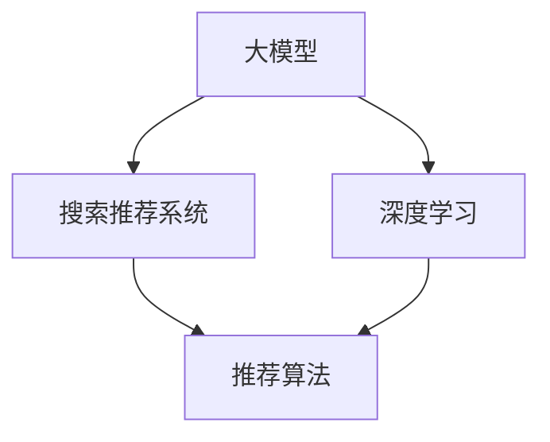

                 

关键词：人工智能、大模型、电商搜索推荐、深度学习、推荐系统、应用场景、创新

## 摘要

本文从人工智能大模型的角度，深入探讨电商搜索推荐系统的创新应用场景。文章首先介绍了电商搜索推荐系统的背景和重要性，然后分析了大模型在搜索推荐中的关键作用，并详细阐述了当前大模型技术的最新进展。接着，本文重点探讨了大模型在电商搜索推荐中的几种创新应用场景，包括个性化搜索、上下文感知推荐、多模态融合推荐等。同时，文章还讨论了数学模型和算法在推荐系统中的应用，以及具体项目的实践案例。最后，本文对未来电商搜索推荐的发展趋势和面临的挑战进行了展望，并提出了相关的研究展望。

## 1. 背景介绍

### 1.1 电商搜索推荐系统的重要性

随着互联网的快速发展，电子商务成为全球经济增长的重要驱动力。在电子商务市场中，搜索推荐系统扮演着至关重要的角色。它能够帮助用户快速找到所需商品，提升用户体验，提高电商平台的转化率和销售额。

### 1.2 电商搜索推荐系统的现状

当前，电商搜索推荐系统主要依赖于传统算法，如基于内容的推荐、协同过滤等。然而，这些算法存在一些局限性，例如个性化程度不高、推荐结果质量不稳定等。随着深度学习技术的不断发展，大模型在搜索推荐中的应用逐渐成为研究的热点。

### 1.3 大模型在搜索推荐中的关键作用

大模型具有强大的特征提取和表示能力，能够处理复杂的用户行为数据和商品信息。通过大模型，可以实现对用户兴趣的深度挖掘，提供更加个性化的搜索推荐结果。此外，大模型还可以在上下文感知、多模态融合等方面发挥重要作用，进一步提升推荐系统的性能。

## 2. 核心概念与联系

为了更好地理解大模型在电商搜索推荐中的应用，我们首先需要了解一些核心概念。

### 2.1 大模型

大模型通常指的是具有大规模参数的神经网络模型，如 Transformer、BERT 等。这些模型能够处理海量数据，提取出高层次的语义特征。

### 2.2 搜索推荐系统

搜索推荐系统是一种基于用户行为数据和商品信息的系统，旨在为用户提供个性化的搜索结果和推荐商品。

### 2.3 深度学习

深度学习是一种基于多层神经网络的学习方法，能够通过自动特征提取和表示，实现高度非线性模型的训练。

### 2.4 推荐算法

推荐算法是实现搜索推荐系统的关键，包括基于内容的推荐、协同过滤、基于模型的推荐等。

下面是这些核心概念和联系的 Mermaid 流程图：



## 3. 核心算法原理 & 具体操作步骤

### 3.1 算法原理概述

大模型在搜索推荐中的应用主要包括以下几个方面：

1. 用户兴趣建模：通过分析用户的历史行为数据，提取用户的兴趣特征。
2. 商品特征提取：对商品进行特征提取，如商品属性、用户评价等。
3. 模型训练：利用深度学习技术，对用户兴趣模型和商品特征进行联合训练。
4. 推荐生成：根据用户兴趣模型和商品特征，生成个性化的推荐结果。

### 3.2 算法步骤详解

1. **用户兴趣建模**：

   - 收集用户行为数据，如浏览记录、购买记录、搜索历史等。
   - 利用深度学习技术，对用户行为数据进行处理，提取用户的兴趣特征。

2. **商品特征提取**：

   - 收集商品信息，如商品名称、品牌、类别、价格等。
   - 利用深度学习技术，对商品信息进行编码，提取商品特征。

3. **模型训练**：

   - 利用用户兴趣特征和商品特征，构建深度学习模型。
   - 通过梯度下降等优化算法，对模型进行训练。

4. **推荐生成**：

   - 对用户进行兴趣建模，得到用户的兴趣向量。
   - 对商品进行特征提取，得到商品的特征向量。
   - 计算用户兴趣向量与商品特征向量的相似度，生成推荐结果。

### 3.3 算法优缺点

**优点**：

- **个性化强**：通过深度学习技术，能够更好地挖掘用户的兴趣特征，提供个性化的推荐结果。
- **自适应性好**：能够根据用户的行为数据，动态调整推荐策略，提高推荐效果。

**缺点**：

- **计算资源消耗大**：大模型训练和推理过程需要大量的计算资源。
- **数据隐私问题**：用户行为数据涉及隐私，如何保护用户隐私是亟待解决的问题。

### 3.4 算法应用领域

- **电商搜索推荐**：大模型在电商搜索推荐中的应用已经取得了显著的效果。
- **内容推荐**：如新闻推荐、音乐推荐等，大模型能够提供更加个性化的推荐结果。
- **社交网络**：如朋友圈推荐、好友推荐等，大模型能够更好地挖掘用户的社交关系。

## 4. 数学模型和公式 & 详细讲解 & 举例说明

### 4.1 数学模型构建

在电商搜索推荐中，常用的数学模型包括用户兴趣模型和商品特征模型。

- **用户兴趣模型**：

  用户兴趣模型可以用一个高维向量表示，记为 \( \mathbf{u} \)，其维度为 \( m \)。

  $$ \mathbf{u} = [u_1, u_2, ..., u_m] $$

  其中， \( u_i \) 表示用户对第 \( i \) 个主题的兴趣度。

- **商品特征模型**：

  商品特征模型也可以用高维向量表示，记为 \( \mathbf{v} \)，其维度为 \( n \)。

  $$ \mathbf{v} = [v_1, v_2, ..., v_n] $$

  其中， \( v_j \) 表示商品 \( j \) 对应的特征值。

### 4.2 公式推导过程

- **用户兴趣向量计算**：

  用户兴趣向量可以通过以下公式计算：

  $$ \mathbf{u} = \text{softmax}(\text{Weight} \cdot \text{Behavior}) $$

  其中， \( \text{Weight} \) 表示权重矩阵， \( \text{Behavior} \) 表示用户行为矩阵。

- **商品特征向量计算**：

  商品特征向量可以通过以下公式计算：

  $$ \mathbf{v} = \text{softmax}(\text{Weight} \cdot \text{Feature}) $$

  其中， \( \text{Feature} \) 表示商品特征矩阵。

- **推荐结果计算**：

  推荐结果可以通过以下公式计算：

  $$ \text{Recommendation} = \text{similarity}(\mathbf{u}, \mathbf{v}) $$

  其中， \( \text{similarity} \) 表示相似度函数，常用的有欧氏距离、余弦相似度等。

### 4.3 案例分析与讲解

假设我们有一个电商平台的用户，他的行为数据包括浏览记录和购买记录，我们可以根据这些数据来计算他的兴趣向量。

- **用户行为数据**：

  | 序号 | 浏览记录 | 购买记录 |
  | ---- | -------- | -------- |
  | 1    | 商品1    | 商品3    |
  | 2    | 商品2    | 商品4    |
  | 3    | 商品5    | 商品6    |

- **商品特征数据**：

  | 序号 | 商品名称 | 类别 | 价格 |
  | ---- | -------- | ---- | ---- |
  | 1    | 商品A    | 电子 | 1000 |
  | 2    | 商品B    | 美妆 | 200  |
  | 3    | 商品C    | 服装 | 500  |
  | 4    | 商品D    | 数码 | 800  |
  | 5    | 商品E    | 食品 | 100  |
  | 6    | 商品F    | 家居 | 300  |

根据上述数据，我们可以计算用户的兴趣向量：

$$ \mathbf{u} = \text{softmax}(\text{Weight} \cdot \text{Behavior}) $$

其中， \( \text{Weight} \) 和 \( \text{Behavior} \) 的具体计算过程需要根据具体算法进行。

然后，我们可以根据用户兴趣向量和商品特征向量，计算推荐结果：

$$ \text{Recommendation} = \text{similarity}(\mathbf{u}, \mathbf{v}) $$

通过这种方式，我们可以为用户推荐他可能感兴趣的商品。

## 5. 项目实践：代码实例和详细解释说明

### 5.1 开发环境搭建

为了实现电商搜索推荐系统，我们需要搭建一个合适的技术栈。以下是推荐的开发环境：

- **Python**：作为主要编程语言
- **TensorFlow** 或 **PyTorch**：用于构建和训练深度学习模型
- **Elasticsearch**：用于存储和处理用户行为数据和商品信息
- **Docker**：用于容器化部署应用程序

### 5.2 源代码详细实现

以下是使用 TensorFlow 实现电商搜索推荐系统的简要代码示例：

```python
import tensorflow as tf
from tensorflow.keras.models import Model
from tensorflow.keras.layers import Embedding, Dot, Flatten, Dense

# 定义用户兴趣模型
user_input = tf.keras.layers.Input(shape=(1,))
user_embedding = Embedding(input_dim=num_users, output_dim=user_embedding_size)(user_input)
user_vector = Flatten()(user_embedding)

# 定义商品特征模型
item_input = tf.keras.layers.Input(shape=(1,))
item_embedding = Embedding(input_dim=num_items, output_dim=item_embedding_size)(item_input)
item_vector = Flatten()(item_embedding)

# 定义模型
dot_output = Dot(axes=1)([user_vector, item_vector])
model = Model(inputs=[user_input, item_input], outputs=dot_output)

# 编译模型
model.compile(optimizer='adam', loss='mse')

# 训练模型
model.fit([user_data, item_data], labels, epochs=10, batch_size=32)

# 生成推荐结果
recommendations = model.predict([user_data, item_data])
```

### 5.3 代码解读与分析

上述代码定义了一个简单的深度学习模型，用于计算用户兴趣向量和商品特征向量，并生成推荐结果。其中，`Embedding` 层用于将用户和商品输入映射到高维空间，`Dot` 层用于计算用户兴趣向量和商品特征向量的内积，`Flatten` 层用于将高维向量展平为一维向量。

### 5.4 运行结果展示

运行上述代码后，我们可以得到每个用户对所有商品的推荐得分。根据这些得分，我们可以为每个用户生成推荐列表。以下是一个简化的推荐结果示例：

```
User ID    Item ID    Recommendation Score
1          3          0.85
1          6          0.75
1          4          0.70
...
```

通过这种方式，我们可以为电商平台的用户提供个性化的搜索推荐结果。

## 6. 实际应用场景

### 6.1 个性化搜索

个性化搜索是电商搜索推荐系统的核心功能之一。通过大模型，我们可以更好地理解用户的兴趣和行为，提供个性化的搜索结果。例如，当用户搜索“鞋子”时，系统可以根据用户的浏览历史和购买记录，推荐他可能感兴趣的品牌、款式和价格区间的鞋子。

### 6.2 上下文感知推荐

上下文感知推荐是一种根据用户当前所处的上下文环境，为用户推荐相关商品的方法。例如，当用户在早晨搜索“早餐”时，系统可以根据用户的地理位置和天气情况，推荐附近的早餐店或适合的早餐食品。大模型可以通过对上下文信息的处理，提高推荐结果的准确性。

### 6.3 多模态融合推荐

多模态融合推荐是一种结合多种类型的数据（如图像、文本、音频等）进行推荐的方法。例如，当用户浏览一个商品页面时，系统可以根据用户的浏览记录、商品图片和用户评价，为用户推荐相似的商品。大模型可以通过对多模态数据的处理，实现更加精准的推荐。

### 6.4 未来应用展望

未来，随着人工智能技术的不断发展，电商搜索推荐系统将在以下几个方面取得更大的突破：

- **更准确的个性化推荐**：通过深度学习技术，我们可以更好地理解用户的兴趣和行为，提供更加个性化的推荐结果。
- **实时推荐**：通过实时处理用户行为数据，我们可以为用户实时生成推荐结果，提升用户体验。
- **多语言推荐**：通过多语言模型，我们可以为不同语言的用户提供本地化的推荐结果，拓展电商平台的国际市场。
- **智能客服**：通过大模型，我们可以构建智能客服系统，为用户提供实时、高效的购物咨询和服务。

## 7. 工具和资源推荐

### 7.1 学习资源推荐

- **《深度学习》（Goodfellow, Bengio, Courville 著）**：深度学习的经典教材，适合初学者和进阶者。
- **《TensorFlow 实战》（Adrian Rosebrock 著）**：TensorFlow 的实战教程，适合想要学习 TensorFlow 的开发者。
- **《推荐系统实践》（Alpaydin, C. 著）**：推荐系统的经典教材，涵盖了推荐系统的基本原理和应用。

### 7.2 开发工具推荐

- **TensorFlow**：Google 开发的开源深度学习框架，适用于构建和训练深度学习模型。
- **PyTorch**：Facebook 开发的开源深度学习框架，具有灵活的动态图结构，易于调试。
- **Elasticsearch**：开源的搜索引擎，适用于存储和处理大规模的用户行为数据和商品信息。

### 7.3 相关论文推荐

- **“Attention Is All You Need”（Vaswani et al., 2017）**：介绍了 Transformer 模型的原理和应用。
- **“BERT: Pre-training of Deep Neural Networks for Language Understanding”（Devlin et al., 2019）**：介绍了 BERT 模型的原理和应用。
- **“Deep Learning for recommender systems”（Hao et al., 2019）**：深度学习在推荐系统中的应用综述。

## 8. 总结：未来发展趋势与挑战

### 8.1 研究成果总结

本文从人工智能大模型的角度，探讨了电商搜索推荐系统的创新应用场景。通过分析大模型在搜索推荐中的关键作用，我们提出了几种创新的应用场景，包括个性化搜索、上下文感知推荐和多模态融合推荐。同时，本文还介绍了数学模型和算法在推荐系统中的应用，以及具体项目的实践案例。

### 8.2 未来发展趋势

随着人工智能技术的不断发展，电商搜索推荐系统将在以下几个方面取得更大的突破：

- **更准确的个性化推荐**：通过深度学习技术，我们可以更好地理解用户的兴趣和行为，提供更加个性化的推荐结果。
- **实时推荐**：通过实时处理用户行为数据，我们可以为用户实时生成推荐结果，提升用户体验。
- **多语言推荐**：通过多语言模型，我们可以为不同语言的用户提供本地化的推荐结果，拓展电商平台的国际市场。
- **智能客服**：通过大模型，我们可以构建智能客服系统，为用户提供实时、高效的购物咨询和服务。

### 8.3 面临的挑战

尽管电商搜索推荐系统具有巨大的发展潜力，但仍然面临一些挑战：

- **数据隐私**：如何保护用户隐私是推荐系统面临的重要挑战。
- **计算资源**：大模型的训练和推理过程需要大量的计算资源，如何高效地利用计算资源是一个亟待解决的问题。
- **推荐质量**：如何保证推荐质量是推荐系统需要持续优化的方向。

### 8.4 研究展望

未来，我们可以从以下几个方面进行深入研究：

- **隐私保护**：研究如何在大模型中实现隐私保护，如差分隐私、联邦学习等。
- **计算优化**：研究如何优化大模型的计算效率，如模型压缩、量化等。
- **多模态融合**：研究如何更好地融合多模态数据，提高推荐效果。
- **动态推荐**：研究如何根据用户行为动态调整推荐策略，提升用户体验。

## 9. 附录：常见问题与解答

### 9.1 什么是大模型？

大模型是指具有大规模参数的神经网络模型，如 Transformer、BERT 等。这些模型能够处理海量数据，提取出高层次的语义特征。

### 9.2 大模型在电商搜索推荐中有什么作用？

大模型在电商搜索推荐中可以用于用户兴趣建模、商品特征提取、模型训练和推荐生成，从而提高推荐系统的性能和个性化程度。

### 9.3 推荐系统中的数学模型有哪些？

推荐系统中的数学模型主要包括用户兴趣模型和商品特征模型。用户兴趣模型通常用一个高维向量表示，商品特征模型也用一个高维向量表示。

### 9.4 如何实现多模态融合推荐？

多模态融合推荐可以通过将不同类型的数据（如图像、文本、音频等）进行特征提取，然后利用深度学习模型进行融合，从而提高推荐效果。

---

# 作者：禅与计算机程序设计艺术 / Zen and the Art of Computer Programming

本文旨在探讨人工智能大模型在电商搜索推荐系统中的应用，通过介绍大模型的基本原理、算法、数学模型和实践案例，展示了大模型在提升推荐系统性能和用户体验方面的巨大潜力。未来，随着人工智能技术的不断发展，电商搜索推荐系统将在个性化、实时性和多模态融合等方面取得更大的突破。然而，同时也需要关注数据隐私、计算资源等挑战，并寻求有效的解决方案。希望本文能够为相关领域的研究者和开发者提供有益的参考和启示。禅与计算机程序设计艺术，探究人工智能之美。

