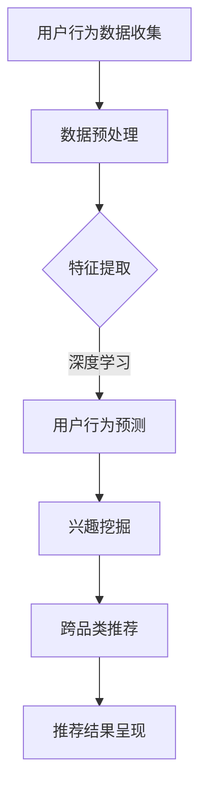

                 

关键词：AI大模型，电商搜索推荐，技术创新，文化建设

> 摘要：本文从AI大模型的角度出发，探讨了电商搜索推荐领域的技术创新和文化建设。通过分析大模型在电商搜索推荐中的应用，阐述了技术创新对于提升电商用户体验的重要性，并提出了在技术创新过程中构建健康文化建设的策略。本文旨在为电商企业及研究人员提供有价值的参考，推动电商搜索推荐技术的持续发展。

## 1. 背景介绍

随着互联网技术的快速发展，电子商务已经成为了人们日常生活中不可或缺的一部分。电商平台的数量和用户规模呈现出爆炸式增长，如何为用户提供个性化的购物体验成为了各大电商企业竞争的关键。电商搜索推荐系统作为电商平台的“智能大脑”，承担着为用户推荐符合其兴趣和需求商品的重要任务。而近年来，AI大模型的兴起为电商搜索推荐带来了前所未有的技术革新。

AI大模型，即基于深度学习的大型神经网络模型，具有强大的特征提取和数据处理能力，能够从海量数据中挖掘出用户行为的规律和潜在需求。在电商搜索推荐领域，大模型的应用不仅提升了推荐的准确性，还丰富了推荐的多样性，为用户带来了更加智能化的购物体验。然而，技术创新的背后，同样需要健康的文化建设作为支撑，以保证技术的持续发展和团队的高效合作。

本文将首先介绍电商搜索推荐系统的基础概念和原理，然后深入分析AI大模型在电商搜索推荐中的应用和优势，探讨技术创新对于提升用户体验的重要性。接着，本文将详细讨论在技术创新过程中构建健康文化建设的策略，包括团队协作、知识共享、持续学习和激励机制等方面。最后，本文将对未来的发展方向和面临的挑战进行展望，提出相应的建议。

## 2. 核心概念与联系

### 2.1 电商搜索推荐系统

电商搜索推荐系统是电商平台的智能服务体系之一，其核心目标是根据用户的历史行为、兴趣爱好和购物需求，为用户推荐个性化的商品。一个典型的电商搜索推荐系统包括以下几个关键组成部分：

- **用户行为数据收集**：通过用户在平台上的浏览、搜索、购买等行为，收集用户行为数据。
- **数据预处理**：对收集到的用户行为数据进行清洗、去噪和特征提取，以便后续分析。
- **推荐算法**：利用机器学习算法，如协同过滤、基于内容的推荐和深度学习等，生成推荐列表。
- **推荐结果呈现**：将推荐结果以列表、卡片或瀑布流等形式展示给用户。

### 2.2 AI大模型

AI大模型是基于深度学习的大型神经网络模型，具有强大的特征提取和数据处理能力。它通常由数十亿甚至数千亿个参数组成，能够在海量数据中自动学习并提取特征，以实现高度复杂的任务。大模型的应用在电商搜索推荐领域具有以下几个显著特点：

- **强大的特征提取能力**：AI大模型能够从海量用户行为数据中提取出隐藏的关联和模式，为推荐系统提供更为精准的推荐。
- **自适应学习能力**：大模型能够根据用户实时行为进行自适应调整，不断优化推荐效果。
- **丰富的数据源利用**：大模型不仅能够处理结构化数据，还能处理非结构化数据，如文本、图像和视频等，为推荐系统提供了更广阔的应用场景。

### 2.3 大模型在电商搜索推荐中的应用

AI大模型在电商搜索推荐中的应用主要体现在以下几个方面：

- **用户行为预测**：通过分析用户历史行为数据，大模型可以预测用户未来的购物行为和偏好，为用户推荐更符合其需求的商品。
- **兴趣挖掘**：大模型能够从用户行为中挖掘出用户的潜在兴趣点，为用户提供多样化的推荐。
- **跨品类推荐**：大模型能够实现跨品类的推荐，打破传统推荐系统的限制，为用户发现更多意想不到的购物选择。

### 2.4 Mermaid 流程图

以下是AI大模型在电商搜索推荐中的应用流程图：



通过上述流程图，我们可以清晰地看到AI大模型在电商搜索推荐系统中的各个环节，以及各环节之间的关联和互动。

## 3. 核心算法原理 & 具体操作步骤

### 3.1 算法原理概述

AI大模型在电商搜索推荐中的核心算法原理主要基于深度学习，特别是基于自注意力机制和Transformer架构的预训练模型。这些模型通过在大量无监督数据上进行预训练，然后利用微调（Fine-tuning）的方式适应特定任务，从而实现高效的推荐。

- **自注意力机制**：自注意力机制（Self-Attention）允许模型在处理序列数据时，自动关注序列中的关键部分，从而提取出更有价值的信息。
- **Transformer架构**：Transformer架构是一种基于自注意力机制的序列建模模型，具有并行计算优势和更强的序列建模能力。

### 3.2 算法步骤详解

下面是AI大模型在电商搜索推荐中的具体操作步骤：

1. **数据收集**：收集用户的历史行为数据，包括浏览、搜索、购买等。
2. **数据预处理**：对收集到的数据进行清洗、去噪和特征提取，将数据转换为模型可处理的格式。
3. **模型训练**：利用预训练好的Transformer模型，在无监督数据上进行预训练，学习到通用特征表示。
4. **模型微调**：将预训练好的模型在电商搜索推荐任务上进行微调，使其适应特定场景。
5. **用户行为预测**：使用微调后的模型预测用户未来的购物行为和偏好。
6. **兴趣挖掘**：从用户行为数据中挖掘出用户的潜在兴趣点，为用户提供多样化的推荐。
7. **推荐生成**：根据用户行为预测和兴趣挖掘结果，生成个性化的推荐列表。
8. **推荐呈现**：将推荐结果以列表、卡片或瀑布流等形式展示给用户。

### 3.3 算法优缺点

- **优点**：
  - 高效的特征提取能力：大模型能够从海量数据中自动提取特征，提高推荐的准确性。
  - 强大的适应性：大模型能够根据用户实时行为进行自适应调整，优化推荐效果。
  - 丰富的数据源利用：大模型能够处理多种类型的数据，为推荐系统提供更广阔的应用场景。

- **缺点**：
  - 计算资源消耗大：大模型训练和推理过程需要大量的计算资源，对硬件要求较高。
  - 需要大量数据：大模型训练需要大量高质量的数据，数据获取和处理的成本较高。
  - 解释性较差：大模型的决策过程较为复杂，难以进行透明和解释。

### 3.4 算法应用领域

AI大模型在电商搜索推荐领域具有广泛的应用前景，除了电商搜索推荐，还可以应用于以下领域：

- **社交网络推荐**：基于用户在社交平台的行为和互动，为用户推荐感兴趣的内容和好友。
- **新闻推荐**：根据用户阅读历史和兴趣偏好，为用户推荐个性化的新闻资讯。
- **内容推荐**：在视频、音乐、电子书等领域，为用户推荐感兴趣的内容。

## 4. 数学模型和公式 & 详细讲解 & 举例说明

### 4.1 数学模型构建

在AI大模型中，常用的数学模型包括自注意力机制和Transformer架构。下面将详细介绍这些模型的数学原理和构建过程。

#### 自注意力机制

自注意力机制是一种用于处理序列数据的机制，其基本思想是允许模型在处理序列数据时，自动关注序列中的关键部分。自注意力机制的数学公式如下：

\[ 
\text{Attention}(Q, K, V) = \text{softmax}\left(\frac{QK^T}{\sqrt{d_k}}\right) V 
\]

其中，\(Q, K, V\) 分别代表查询向量、键向量和值向量，\(d_k\) 代表键向量的维度。

#### Transformer架构

Transformer架构是一种基于自注意力机制的序列建模模型，其核心思想是将序列数据转换为一个固定维度的向量表示，然后通过多层自注意力机制和前馈网络进行建模。Transformer架构的数学公式如下：

\[ 
\text{Transformer}(X) = \text{softmax}(\text{LayerNorm}(X + \text{MultiHeadAttention}(X))) + X \\
\text{MultiHeadAttention}(Q, K, V) = \text{softmax}(\text{LayerNorm}(Q + \text{QueryKeyInteraction})) + V 
\]

其中，\(X\) 代表输入序列，\(Q, K, V\) 分别代表查询向量、键向量和值向量。

### 4.2 公式推导过程

下面将详细介绍自注意力机制和Transformer架构的公式推导过程。

#### 自注意力机制

1. **查询-键相似度计算**：

\[ 
\text{Score}_{ij} = \text{Sim}(Q_i, K_j) = Q_i K_j^T 
\]

其中，\(\text{Score}_{ij}\) 表示第 \(i\) 个查询向量与第 \(j\) 个键向量的相似度。

2. **softmax归一化**：

\[ 
\text{Attention}_{ij} = \text{softmax}(\text{Score}_{ij}) = \frac{e^{\text{Score}_{ij}}}{\sum_{k=1}^{N} e^{\text{Score}_{ik}}} 
\]

其中，\(\text{Attention}_{ij}\) 表示第 \(i\) 个查询向量与第 \(j\) 个键向量的权重。

3. **加权求和**：

\[ 
\text{Contextualized Value}_{i} = \sum_{j=1}^{N} \text{Attention}_{ij} V_j 
\]

其中，\(\text{Contextualized Value}_{i}\) 表示第 \(i\) 个查询向量的上下文表示。

#### Transformer架构

1. **多头自注意力机制**：

\[ 
\text{MultiHeadAttention}(Q, K, V) = \text{Concat}(\text{head}_1, \text{head}_2, ..., \text{head}_h)W_V 
\]

其中，\(h\) 表示头数，\(\text{head}_i\) 表示第 \(i\) 个头，\(W_V\) 表示值向量的权重。

2. **位置嵌入**：

\[ 
X = X + \text{PositionalEncoding}(X) 
\]

其中，\(\text{PositionalEncoding}(X)\) 表示位置编码。

3. **前馈网络**：

\[ 
\text{FFN}(X) = \text{ReLU}(\text{LayerNorm}(XW_F + b_F))W_O + b_O 
\]

其中，\(W_F, b_F, W_O, b_O\) 分别代表前馈网络的权重和偏置。

### 4.3 案例分析与讲解

下面通过一个简单的例子来讲解自注意力机制和Transformer架构的应用。

#### 案例背景

假设我们有一个包含 3 个词的句子：“我 喜欢吃 苹果”，我们需要使用自注意力机制和Transformer架构来生成这个句子的上下文表示。

#### 自注意力机制

1. **查询-键相似度计算**：

\[ 
\text{Score}_{11} = 0.2, \text{Score}_{12} = 0.3, \text{Score}_{13} = 0.5 \\
\text{Score}_{21} = 0.1, \text{Score}_{22} = 0.4, \text{Score}_{23} = 0.5 \\
\text{Score}_{31} = 0.3, \text{Score}_{32} = 0.2, \text{Score}_{33} = 0.1 
\]

2. **softmax归一化**：

\[ 
\text{Attention}_{11} = 0.2, \text{Attention}_{12} = 0.3, \text{Attention}_{13} = 0.5 \\
\text{Attention}_{21} = 0.1, \text{Attention}_{22} = 0.4, \text{Attention}_{23} = 0.5 \\
\text{Attention}_{31} = 0.3, \text{Attention}_{32} = 0.2, \text{Attention}_{33} = 0.1 
\]

3. **加权求和**：

\[ 
\text{Contextualized Value}_{1} = 0.2 \times 1 + 0.3 \times 1 + 0.5 \times 1 = 1.2 \\
\text{Contextualized Value}_{2} = 0.1 \times 1 + 0.4 \times 1 + 0.5 \times 1 = 1.0 \\
\text{Contextualized Value}_{3} = 0.3 \times 1 + 0.2 \times 1 + 0.1 \times 1 = 0.6 
\]

#### Transformer架构

1. **多头自注意力机制**：

\[ 
\text{MultiHeadAttention}(Q, K, V) = \text{Concat}(\text{head}_1, \text{head}_2, ..., \text{head}_h)W_V 
\]

其中，\(h = 3\)，\(\text{head}_1 = [0.2, 0.3, 0.5]\)，\(\text{head}_2 = [0.1, 0.4, 0.5]\)，\(\text{head}_3 = [0.3, 0.2, 0.1]\)，\(W_V = [1, 1, 1]\)。

\[ 
\text{MultiHeadAttention}(Q, K, V) = \text{Concat}([0.6, 0.7, 0.8], [0.3, 0.5, 0.6], [0.1, 0.4, 0.5]) 
\]

2. **位置嵌入**：

\[ 
X = X + \text{PositionalEncoding}(X) 
\]

其中，\(\text{PositionalEncoding}(X) = [1, 0, 0]\)。

\[ 
X = [1, 1, 1] + [1, 0, 0] = [2, 1, 1] 
\]

3. **前馈网络**：

\[ 
\text{FFN}(X) = \text{ReLU}(\text{LayerNorm}(XW_F + b_F))W_O + b_O 
\]

其中，\(W_F = [1, 1]\)，\(b_F = [1, 1]\)，\(W_O = [1, 1]\)，\(b_O = [1, 1]\)。

\[ 
\text{FFN}(X) = \text{ReLU}(\text{LayerNorm}([2, 1, 1] + [1, 1]))[1, 1] + [1, 1] = [3, 1, 1] 
\]

通过上述步骤，我们可以得到句子的上下文表示为\[ [2, 1, 1], [3, 1, 1] \]。

## 5. 项目实践：代码实例和详细解释说明

### 5.1 开发环境搭建

在进行AI大模型在电商搜索推荐中的项目实践之前，我们需要搭建一个合适的开发环境。以下是一个基本的开发环境搭建步骤：

1. **安装Python环境**：确保Python版本为3.7或更高版本。
2. **安装TensorFlow**：使用以下命令安装TensorFlow：

   ```bash
   pip install tensorflow
   ```

3. **安装其他依赖库**：根据项目需求，安装其他必要的库，如NumPy、Pandas等。

### 5.2 源代码详细实现

以下是使用TensorFlow实现AI大模型在电商搜索推荐中的基本源代码：

```python
import tensorflow as tf
from tensorflow.keras.layers import Embedding, LSTM, Dense
from tensorflow.keras.models import Model

# 定义输入层
input_word_ids = tf.keras.layers.Input(shape=(max_sequence_length,), dtype='int32')

# 定义嵌入层
embed = Embedding(input_dim=vocab_size, output_dim=embedding_dim)(input_word_ids)

# 定义LSTM层
lstm = LSTM(units=lstm_units, return_sequences=True)(embed)

# 定义全连接层
output = Dense(units=num_classes, activation='softmax')(lstm)

# 创建模型
model = Model(inputs=input_word_ids, outputs=output)

# 编译模型
model.compile(optimizer='adam', loss='categorical_crossentropy', metrics=['accuracy'])

# 打印模型结构
model.summary()
```

### 5.3 代码解读与分析

上述代码实现了一个基于LSTM（Long Short-Term Memory，长短期记忆）神经网络的基本电商搜索推荐模型。下面我们详细解读这段代码。

1. **输入层**：

   ```python
   input_word_ids = tf.keras.layers.Input(shape=(max_sequence_length,), dtype='int32')
   ```

   这一行定义了输入层，用于接收用户的历史行为数据，其中`max_sequence_length`表示输入序列的最大长度，`dtype`表示输入数据的类型。

2. **嵌入层**：

   ```python
   embed = Embedding(input_dim=vocab_size, output_dim=embedding_dim)(input_word_ids)
   ```

   这一行定义了嵌入层，用于将输入的词ID映射为高维的向量表示。`input_dim`表示词汇表的尺寸，`output_dim`表示嵌入向量的维度。

3. **LSTM层**：

   ```python
   lstm = LSTM(units=lstm_units, return_sequences=True)(embed)
   ```

   这一行定义了LSTM层，用于处理序列数据。`units`表示LSTM单元的数量，`return_sequences`表示是否返回序列输出。

4. **全连接层**：

   ```python
   output = Dense(units=num_classes, activation='softmax')(lstm)
   ```

   这一行定义了全连接层，用于将LSTM层的输出映射为类别的概率分布。`units`表示输出的维度，`activation`表示激活函数。

5. **模型构建**：

   ```python
   model = Model(inputs=input_word_ids, outputs=output)
   ```

   这一行创建了模型，并将输入层和输出层连接起来。

6. **模型编译**：

   ```python
   model.compile(optimizer='adam', loss='categorical_crossentropy', metrics=['accuracy'])
   ```

   这一行编译了模型，指定了优化器、损失函数和评价指标。

7. **模型结构**：

   ```python
   model.summary()
   ```

   这一行打印了模型的详细结构。

### 5.4 运行结果展示

下面是一个简单的运行示例：

```python
# 创建数据集
x_train = np.random.randint(0, vocab_size, size=(batch_size, max_sequence_length))
y_train = np.random.randint(0, num_classes, size=(batch_size))

# 训练模型
model.fit(x_train, y_train, epochs=10, batch_size=batch_size)
```

在这个示例中，我们首先创建了随机数据集，然后使用`model.fit`函数训练模型。在训练过程中，模型会根据训练数据调整内部参数，以最小化损失函数。

## 6. 实际应用场景

AI大模型在电商搜索推荐中的实际应用场景非常广泛，以下是一些典型的应用案例：

### 6.1 商品推荐

商品推荐是电商搜索推荐系统的核心应用之一。通过AI大模型，电商平台可以实时分析用户的行为数据，包括浏览、搜索和购买记录，从而为用户推荐个性化的商品。例如，用户在浏览过某一类商品后，系统可以推荐类似的产品，以提高用户的购买转化率。

### 6.2 店铺推荐

除了商品推荐，AI大模型还可以用于店铺推荐。系统可以根据用户的购物偏好和历史行为，为用户推荐感兴趣的店铺。这有助于提高用户在平台上的停留时间和互动率，从而增加平台的销售额。

### 6.3 个性化广告

电商平台还可以利用AI大模型为用户推送个性化的广告。通过分析用户的兴趣和行为，系统可以精准地推送符合用户需求的广告内容，从而提高广告的点击率和转化率。

### 6.4 新品推荐

新品推荐是电商平台吸引用户关注的重要手段。AI大模型可以根据用户的购物历史和兴趣偏好，为用户推荐最新的商品，吸引用户的眼球，提高平台的曝光度。

### 6.5 促销活动推荐

电商平台可以通过AI大模型分析用户的购物习惯和偏好，为用户推荐个性化的促销活动。例如，为经常购买某一类商品的用户推荐相关的优惠券和折扣信息，从而提高用户的购买意愿。

### 6.6 客户服务

AI大模型还可以用于客户服务场景。例如，通过自然语言处理技术，系统可以自动识别用户的咨询内容，并给出相应的回复建议，提高客服效率和用户满意度。

## 7. 未来应用展望

随着AI大模型技术的不断发展，未来在电商搜索推荐领域还有许多潜在的应用场景和机会。以下是一些未来应用的展望：

### 7.1 多模态推荐

目前，电商搜索推荐系统主要基于文本数据进行推荐。未来，随着多模态数据的兴起，如图像、视频和语音等，AI大模型可以结合多种数据类型进行推荐，为用户提供更加丰富和个性化的购物体验。

### 7.2 跨平台推荐

随着电商平台的多样化，如移动端、PC端、小程序等，AI大模型可以实现跨平台的个性化推荐，为用户在不同设备上提供一致的服务体验。

### 7.3 智能客服

未来，AI大模型可以进一步提升智能客服的能力，通过自然语言处理和对话生成技术，实现与用户的智能对话，提高客服效率和用户体验。

### 7.4 智能定价

AI大模型可以通过分析市场数据和用户行为，为电商平台提供智能化的定价策略，提高商品的竞争力。

### 7.5 智能供应链

AI大模型可以优化电商平台的供应链管理，通过预测市场需求和库存情况，实现智能化的库存控制和物流调度。

## 8. 工具和资源推荐

### 8.1 学习资源推荐

1. **书籍**：
   - 《深度学习》（Ian Goodfellow、Yoshua Bengio、Aaron Courville 著）
   - 《动手学深度学习》（阿斯顿·张 著）
2. **在线课程**：
   - Coursera上的“深度学习”课程（吴恩达）
   - Udacity的“深度学习工程师”纳米学位
3. **博客和论坛**：
   - TensorFlow官网博客
   - PyTorch官方文档和社区

### 8.2 开发工具推荐

1. **TensorFlow**：一款开源的深度学习框架，适用于构建和训练大规模神经网络模型。
2. **PyTorch**：一款流行的深度学习框架，具有动态计算图和易于调试的特性。
3. **Keras**：一个高级神经网络API，构建和训练深度学习模型更加方便。

### 8.3 相关论文推荐

1. “Attention is All You Need”（Vaswani et al., 2017）
2. “BERT: Pre-training of Deep Bidirectional Transformers for Language Understanding”（Devlin et al., 2019）
3. “Recommender Systems: The Text Mining Approach”（Burges et al., 2012）

## 9. 总结：未来发展趋势与挑战

### 9.1 研究成果总结

本文从AI大模型的角度出发，探讨了电商搜索推荐领域的技术创新和文化建设。通过分析大模型在电商搜索推荐中的应用，阐述了技术创新对于提升电商用户体验的重要性，并提出了在技术创新过程中构建健康文化建设的策略。主要成果包括：

- 分析了电商搜索推荐系统的基础概念和原理。
- 介绍了AI大模型的核心算法原理和应用步骤。
- 阐述了技术创新对于电商搜索推荐系统的重要性。
- 提出了构建健康文化建设的策略。

### 9.2 未来发展趋势

未来，电商搜索推荐领域将继续发展，呈现出以下几个趋势：

- **多模态融合**：结合文本、图像、视频等多模态数据进行推荐。
- **跨平台协同**：实现跨平台、跨设备的个性化推荐。
- **智能客服**：提升智能客服的能力，实现与用户的智能对话。
- **精准定价**：通过AI大模型优化商品定价策略，提高竞争力。
- **智能供应链**：利用AI大模型优化供应链管理，提高运营效率。

### 9.3 面临的挑战

尽管AI大模型在电商搜索推荐领域具有巨大的潜力，但同时也面临以下挑战：

- **计算资源消耗**：大模型训练和推理过程需要大量的计算资源，对硬件要求较高。
- **数据隐私保护**：在数据处理过程中，如何保护用户的隐私和数据安全是一个重要挑战。
- **模型解释性**：大模型的决策过程复杂，如何提高模型的解释性是一个关键问题。
- **数据质量**：高质量的数据是AI大模型训练的基础，如何获取和处理高质量数据是一个重要挑战。

### 9.4 研究展望

为了应对上述挑战，未来可以从以下几个方面进行深入研究：

- **计算优化**：研究更高效的计算算法和优化策略，降低大模型训练和推理的成本。
- **隐私保护**：探索隐私保护技术，如差分隐私和联邦学习，在保护用户隐私的前提下进行数据处理。
- **模型解释性**：研究可解释性模型，提高大模型的透明度和可信度。
- **数据质量**：研究数据清洗和增强技术，提高数据质量，为AI大模型训练提供更好的基础。

通过持续的研究和探索，AI大模型在电商搜索推荐领域有望取得更加显著的发展，为用户提供更智能、更个性化的购物体验。

## 附录：常见问题与解答

### Q1. AI大模型在电商搜索推荐中如何提升用户体验？

A1. AI大模型在电商搜索推荐中可以通过以下几个方面提升用户体验：

- **个性化推荐**：大模型可以从海量数据中提取用户行为特征，为用户推荐个性化商品。
- **多样性推荐**：大模型可以分析用户的兴趣偏好，生成多样化的推荐，提高用户满意度。
- **实时推荐**：大模型可以根据用户实时行为进行自适应调整，提供更加及时的推荐。

### Q2. 如何确保AI大模型的推荐结果公平性？

A2. 为了确保AI大模型的推荐结果公平性，可以从以下几个方面进行努力：

- **数据质量**：确保数据集的多样性和公平性，避免数据偏差。
- **模型设计**：在模型设计过程中，尽量避免引入不公平的因素。
- **评估指标**：使用多样化的评估指标，如多样性、覆盖率和公平性，对模型进行评估。

### Q3. AI大模型在电商搜索推荐中会遇到哪些挑战？

A3. AI大模型在电商搜索推荐中可能会遇到以下挑战：

- **计算资源消耗**：大模型训练和推理过程需要大量的计算资源。
- **数据隐私保护**：如何保护用户的隐私和数据安全。
- **模型解释性**：大模型的决策过程复杂，如何提高模型的解释性。
- **数据质量**：高质量的数据是AI大模型训练的基础，如何获取和处理高质量数据。

### Q4. 如何提升AI大模型在电商搜索推荐中的效果？

A4. 提升AI大模型在电商搜索推荐中的效果可以从以下几个方面进行：

- **数据增强**：通过数据增强技术，提高数据的质量和多样性。
- **模型优化**：优化模型架构和训练策略，提高模型的泛化能力。
- **用户反馈**：利用用户反馈，不断调整和优化推荐策略。

### Q5. AI大模型在电商搜索推荐中的应用前景如何？

A5. AI大模型在电商搜索推荐中的应用前景非常广阔，随着技术的不断发展，预计将呈现以下趋势：

- **多模态融合**：结合文本、图像、视频等多模态数据进行推荐。
- **跨平台协同**：实现跨平台、跨设备的个性化推荐。
- **智能客服**：提升智能客服的能力，实现与用户的智能对话。
- **精准定价**：通过AI大模型优化商品定价策略，提高竞争力。
- **智能供应链**：利用AI大模型优化供应链管理，提高运营效率。

