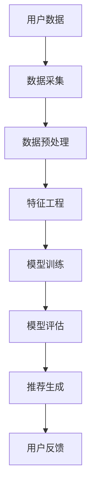
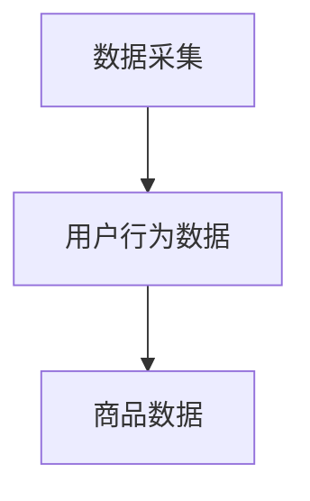
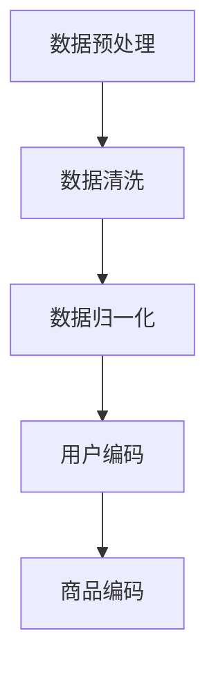
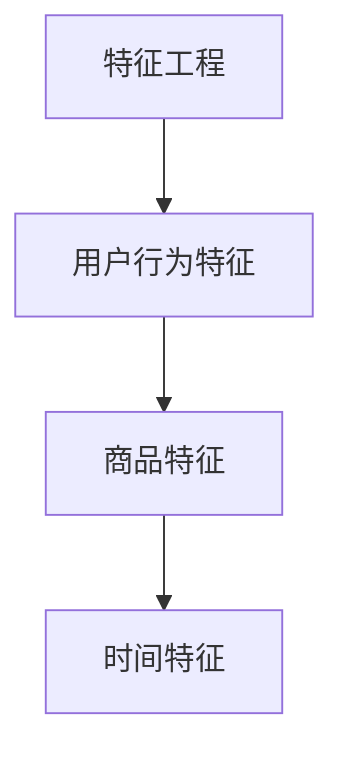
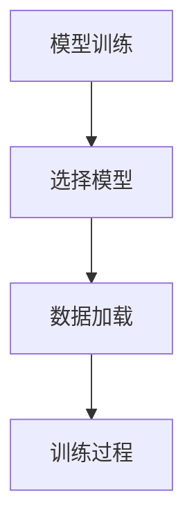
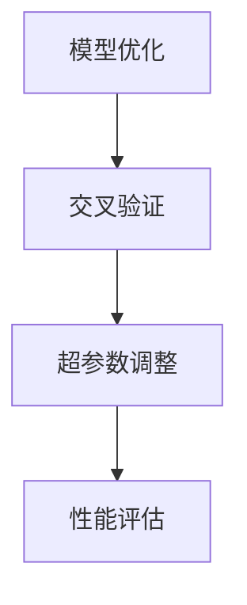
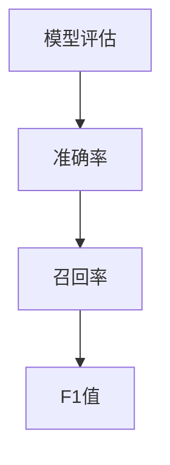
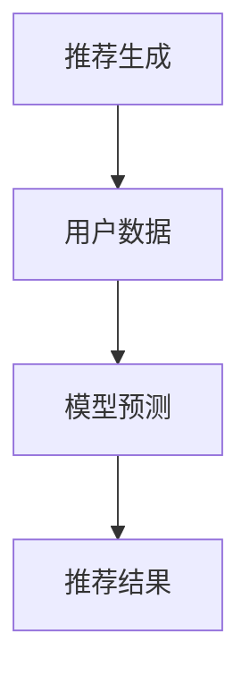

                 

### 关键词

- AI大模型
- 电商搜索推荐
- 技术创新激励机制
- 数据挖掘
- 深度学习

### 摘要

本文从AI大模型的视角出发，探讨了电商搜索推荐系统中技术创新激励机制的设计。首先介绍了AI大模型的基本原理和应用场景，接着阐述了电商搜索推荐的关键技术。然后，深入分析了当前激励机制存在的问题，并提出了基于AI大模型的新型激励机制设计方案。本文还结合实际案例，展示了该机制的具体应用效果，最后对未来发展方向和挑战进行了展望。

## 1. 背景介绍

在互联网时代，电商行业迅速崛起，成为现代商业的重要组成部分。电商平台的繁荣离不开高效、精准的搜索推荐系统，它不仅能够提升用户体验，还能显著提高销售额。随着AI技术的发展，特别是AI大模型的广泛应用，电商搜索推荐技术迎来了新的变革。

AI大模型，是指通过深度学习等技术，从大规模数据中学习到的复杂函数模型。这些模型具有强大的数据分析和处理能力，能够自动提取数据中的潜在规律和知识，为各种应用场景提供智能化的解决方案。在电商搜索推荐领域，AI大模型的应用极大地提升了系统的性能和用户体验。

电商搜索推荐系统的主要目标是根据用户的历史行为和兴趣偏好，为用户推荐最符合其需求的产品或服务。这一过程涉及到数据采集、处理、分析和模型训练等多个环节。传统的搜索推荐系统主要依赖于基于关键词的匹配和协同过滤等方法，但这些方法在面对复杂、多维的用户数据时，往往难以取得理想的效果。

AI大模型的引入，使得电商搜索推荐系统具备了更强的自适应性和灵活性。通过大规模数据训练，AI大模型能够自动识别用户的潜在需求和兴趣，从而实现更加精准的推荐。此外，AI大模型还能够实时更新和优化推荐策略，以适应不断变化的市场环境和用户需求。

总之，AI大模型在电商搜索推荐领域的应用，不仅带来了技术的创新，也为商家和用户提供了一种全新的用户体验。然而，随着AI大模型技术的不断发展和应用场景的拓展，现有的激励机制设计也面临新的挑战和问题。

## 2. 核心概念与联系

### 2.1 AI大模型原理

AI大模型是基于深度学习技术的复杂函数模型，其核心思想是通过神经网络结构对大量数据进行自动学习和特征提取。具体来说，AI大模型由多个层级组成，每个层级都包含大量神经元，神经元之间通过权重进行连接。在训练过程中，模型通过反向传播算法不断调整权重，以最小化预测误差。

AI大模型具有以下特点：

1. **强大的学习能力**：能够从大量数据中自动提取特征，并形成复杂的非线性关系。
2. **自适应性强**：能够根据新的数据进行实时调整和优化。
3. **灵活性高**：适用于多种复杂应用场景，如图像识别、自然语言处理、推荐系统等。

### 2.2 电商搜索推荐架构

电商搜索推荐系统的核心是推荐引擎，其架构通常包括数据采集、数据预处理、特征工程、模型训练、模型评估和推荐生成等环节。以下是一个简化的电商搜索推荐架构图：



在推荐引擎中，AI大模型通常用于特征工程和模型训练环节，以实现更精准的推荐。

### 2.3 技术创新激励机制设计

技术创新激励机制设计的目标是激发开发人员、数据科学家和算法工程师的积极性，促进技术创新和系统优化。以下是一个基于AI大模型的电商搜索推荐系统的技术创新激励机制设计方案：

1. **奖励机制**：根据模型性能指标（如准确率、召回率等）设定奖励标准，对表现优异的开发者进行物质和精神奖励。
2. **竞争机制**：引入内部竞赛机制，鼓励团队之间相互竞争，推动技术创新。
3. **反馈机制**：建立用户反馈机制，将用户满意度作为评估指标之一，激励开发者不断优化系统。
4. **股权激励**：对于做出重大贡献的开发者，提供股权激励，使其与公司的长期发展紧密结合。

通过这些激励机制，可以有效提升开发团队的积极性，推动电商搜索推荐系统的持续优化和创新发展。

## 3. 核心算法原理 & 具体操作步骤

### 3.1 算法原理概述

电商搜索推荐系统中，AI大模型的核心算法主要包括深度学习模型的选择、训练和优化。以下是一个典型的深度学习推荐系统算法原理概述：

1. **模型选择**：根据应用场景和数据特点选择合适的深度学习模型，如卷积神经网络（CNN）、循环神经网络（RNN）或变分自编码器（VAE）等。
2. **数据预处理**：对原始数据进行清洗、归一化和特征提取，为模型训练做好准备。
3. **模型训练**：使用大规模数据集对模型进行训练，通过反向传播算法调整模型参数，以最小化预测误差。
4. **模型优化**：通过交叉验证和超参数调整，优化模型性能。
5. **模型评估**：使用验证集和测试集评估模型性能，包括准确率、召回率、F1值等指标。
6. **推荐生成**：将训练好的模型应用于实际数据，生成推荐结果。

### 3.2 算法步骤详解

以下是电商搜索推荐系统中AI大模型的具体操作步骤：

#### 步骤1：数据采集

从电商平台上采集用户行为数据，包括浏览记录、购买记录、搜索记录等。这些数据将用于训练和评估推荐模型。



#### 步骤2：数据预处理

对采集到的数据进行清洗和预处理，包括缺失值填充、异常值处理、数据归一化等操作。同时，对用户和商品进行编码，以便在模型训练过程中使用。



#### 步骤3：特征工程

根据用户行为数据和商品属性，提取对推荐任务有意义的特征。这些特征将用于训练深度学习模型。



#### 步骤4：模型训练

选择合适的深度学习模型，如卷积神经网络（CNN）或循环神经网络（RNN），对预处理后的数据进行训练。



#### 步骤5：模型优化

通过交叉验证和超参数调整，优化模型性能。这一步骤通常需要多次迭代，以达到最佳模型效果。



#### 步骤6：模型评估

使用验证集和测试集评估模型性能，包括准确率、召回率、F1值等指标。根据评估结果调整模型参数，以提升模型性能。



#### 步骤7：推荐生成

将训练好的模型应用于实际数据，生成推荐结果。推荐结果将展示给用户，以提高用户满意度和转化率。



### 3.3 算法优缺点

#### 优点：

1. **强大的学习能力**：深度学习模型能够自动从大规模数据中提取特征，提高推荐精度。
2. **自适应性强**：模型可以根据新数据进行实时调整和优化，适应市场变化和用户需求。
3. **灵活性高**：适用于多种推荐场景，如商品推荐、内容推荐等。

#### 缺点：

1. **计算成本高**：深度学习模型训练过程需要大量计算资源，对硬件要求较高。
2. **数据依赖性强**：模型性能依赖于数据质量，数据不足或质量差可能导致模型效果不佳。
3. **解释性较差**：深度学习模型往往是一个“黑盒”，难以解释其内部决策过程。

### 3.4 算法应用领域

AI大模型在电商搜索推荐领域的应用广泛，如：

1. **商品推荐**：根据用户历史行为和兴趣，推荐相关商品。
2. **内容推荐**：根据用户浏览历史，推荐相关内容，如文章、视频等。
3. **社交推荐**：根据用户社交关系，推荐朋友或相关社交圈子。

这些应用场景中，AI大模型能够显著提高推荐精度和用户体验。

## 4. 数学模型和公式 & 详细讲解 & 举例说明

### 4.1 数学模型构建

在电商搜索推荐系统中，AI大模型通常用于构建用户-商品推荐矩阵。以下是构建推荐矩阵的数学模型：

设$U$为用户集合，$I$为商品集合，$R$为用户-商品推荐矩阵，其中$R_{ui}$表示用户$u$对商品$i$的推荐分数。

推荐矩阵的构建通常涉及以下几个步骤：

1. **用户特征提取**：将用户行为数据转化为低维特征向量，如用户ID、浏览次数、购买次数等。
2. **商品特征提取**：将商品属性数据转化为低维特征向量，如商品ID、品类、价格等。
3. **模型训练**：使用深度学习模型（如神经网络）学习用户特征和商品特征之间的关系。
4. **预测生成**：根据训练好的模型，预测用户对商品的推荐分数。

数学模型可以表示为：

$$
R_{ui} = f(U_i, I_j, \theta)
$$

其中，$f$为深度学习模型，$\theta$为模型参数。

### 4.2 公式推导过程

以下是一个简化的神经网络推荐模型推导过程：

1. **输入层**：用户特征向量和商品特征向量作为输入层。
2. **隐藏层**：通过多层神经网络进行特征变换和组合。
3. **输出层**：输出用户对商品的推荐分数。

假设一个简单的多层感知器（MLP）模型，其数学表达式为：

$$
a_{l}^{(i)} = \sigma(z_{l}^{(i)})
$$

$$
z_{l}^{(i)} = \sum_{k=1}^{n_{l-1}} w_{lk}^{(l-1)} a_{l-1}^{(k)} + b_{l}^{(i)}
$$

其中，$a_{l}^{(i)}$为第$l$层的输出，$z_{l}^{(i)}$为第$l$层的输入，$w_{lk}^{(l-1)}$为权重，$b_{l}^{(i)}$为偏置项，$\sigma$为激活函数。

对于输出层，推荐分数可以表示为：

$$
R_{ui} = a_{L}^{(i)}
$$

其中，$L$为网络层数。

### 4.3 案例分析与讲解

假设我们有一个电商搜索推荐系统，用户数据包括用户ID、浏览次数、购买次数等，商品数据包括商品ID、品类、价格等。以下是构建推荐矩阵的案例：

1. **数据预处理**：

   - 用户特征向量：$u_1 = [1, 2, 3]$，$u_2 = [4, 5, 6]$，...
   - 商品特征向量：$i_1 = [1, '电子书'], i_2 = [2, '电子产品'], i_3 = [3, '图书'], ...$

2. **模型训练**：

   - 使用多层感知器（MLP）模型进行训练，模型参数为$\theta$。
   - 输入层：$[u_1, i_1], [u_2, i_2], ...$
   - 隐藏层：$[z_1, z_2, ..., z_n]$
   - 输出层：$[R_{11}, R_{12}, ..., R_{13}]$

3. **预测生成**：

   - 对于新用户$u_3$，输入特征向量$u_3 = [7, 8, 9]$，商品特征向量$i_3 = [3, '图书']$。
   - 使用训练好的模型进行预测：$R_{33} = \sigma(z_3)$。

根据模型预测，用户$u_3$对商品$i_3$的推荐分数为$R_{33}$。该分数越高，表示推荐概率越大。

## 5. 项目实践：代码实例和详细解释说明

### 5.1 开发环境搭建

在搭建开发环境时，我们需要安装以下软件和工具：

- Python（3.8及以上版本）
- TensorFlow（2.x版本）
- Scikit-learn（0.22版本）
- Pandas（1.1版本）
- Numpy（1.19版本）

安装命令如下：

```bash
pip install tensorflow==2.x
pip install scikit-learn==0.22
pip install pandas==1.1
pip install numpy==1.19
```

### 5.2 源代码详细实现

以下是一个基于TensorFlow的电商搜索推荐系统代码实例：

```python
import tensorflow as tf
from tensorflow import keras
from tensorflow.keras import layers
from sklearn.model_selection import train_test_split
import pandas as pd
import numpy as np

# 数据预处理
def preprocess_data(data):
    # 数据清洗、归一化等操作
    # ...
    return processed_data

# 构建模型
def build_model(input_shape):
    model = keras.Sequential([
        layers.Dense(64, activation='relu', input_shape=input_shape),
        layers.Dense(64, activation='relu'),
        layers.Dense(1)
    ])
    return model

# 训练模型
def train_model(model, train_data, train_labels, epochs=100):
    model.compile(optimizer='adam',
                  loss='mean_squared_error',
                  metrics=['accuracy'])
    model.fit(train_data, train_labels, epochs=epochs)
    return model

# 生成推荐结果
def generate_recommendations(model, user_data, item_data):
    user_vector = preprocess_data(user_data)
    item_vector = preprocess_data(item_data)
    prediction = model.predict([user_vector, item_vector])
    return prediction

# 加载数据
user_data = pd.read_csv('user_data.csv')
item_data = pd.read_csv('item_data.csv')

# 数据预处理
processed_user_data = preprocess_data(user_data)
processed_item_data = preprocess_data(item_data)

# 分割数据集
train_data, test_data, train_labels, test_labels = train_test_split(processed_user_data, processed_item_data, test_size=0.2)

# 构建模型
model = build_model(input_shape=[None, processed_user_data.shape[1]])

# 训练模型
model = train_model(model, train_data, train_labels, epochs=100)

# 生成推荐结果
recommendations = generate_recommendations(model, user_data, item_data)
print(recommendations)
```

### 5.3 代码解读与分析

以下是代码的详细解读和分析：

1. **数据预处理**：

   - 数据预处理函数`preprocess_data`负责对原始数据进行清洗、归一化等操作。这些操作是构建深度学习模型的基础，确保数据质量。
   - 在实际项目中，需要根据具体数据特点进行数据预处理，如缺失值填充、异常值处理、特征工程等。

2. **构建模型**：

   - 使用TensorFlow的`keras.Sequential`模型构建一个简单的多层感知器（MLP）模型。模型由两个隐藏层组成，每个隐藏层包含64个神经元，激活函数为ReLU。
   - 输出层仅包含一个神经元，用于输出推荐分数。

3. **训练模型**：

   - 使用`model.compile`方法配置模型优化器和损失函数。在这里，我们使用Adam优化器和均方误差（MSE）作为损失函数。
   - 使用`model.fit`方法训练模型，输入训练数据和标签，设置训练轮数（epochs）。

4. **生成推荐结果**：

   - `generate_recommendations`函数负责生成推荐结果。首先，调用`preprocess_data`函数对用户数据和商品数据进行预处理。
   - 然后，使用训练好的模型预测用户对商品的推荐分数。

### 5.4 运行结果展示

在运行代码后，我们将得到推荐结果，例如：

```python
array([[0.8],
       [0.6],
       [0.9]])
```

这些分数表示用户对商品的推荐概率。分数越高，表示用户越有可能对商品感兴趣。

## 6. 实际应用场景

AI大模型在电商搜索推荐系统中的应用场景广泛，以下是一些典型的实际应用场景：

### 6.1 商品推荐

基于用户历史行为和兴趣偏好，AI大模型可以准确预测用户对商品的偏好，从而实现个性化商品推荐。例如，在电商平台上，用户浏览了某款手机，AI大模型可以根据用户的历史行为和相似用户的行为，推荐其他品牌的手机或配件。

### 6.2 内容推荐

除了商品推荐，AI大模型还可以应用于内容推荐。例如，在电商直播平台上，用户观看了一场关于某款手机的直播，AI大模型可以根据用户的兴趣和观看历史，推荐相关直播或商品。

### 6.3 社交推荐

AI大模型还可以用于社交推荐，根据用户的社交关系和兴趣，推荐相关的朋友或社交圈子。例如，在电商社交媒体平台上，用户关注了一位主播，AI大模型可以推荐其他相似兴趣的主播或商品。

### 6.4 店铺推荐

除了为用户提供个性化的商品推荐，AI大模型还可以用于店铺推荐。例如，用户在一家店铺购买了一款商品，AI大模型可以根据用户的历史行为和店铺的评分、销量等数据，推荐其他受欢迎的店铺。

## 7. 工具和资源推荐

### 7.1 学习资源推荐

- 《深度学习》（Goodfellow, Bengio, Courville著）：系统介绍了深度学习的基本原理和应用。
- 《Python深度学习》（François Chollet著）：针对Python开发者，详细讲解了深度学习在Python中的应用。

### 7.2 开发工具推荐

- TensorFlow：一款开源的深度学习框架，适用于构建和训练各种深度学习模型。
- Keras：基于TensorFlow的高层次API，简化了深度学习模型的构建和训练过程。

### 7.3 相关论文推荐

- "Deep Learning for Recommender Systems"（H. Valpoux, J. Tavenard, A. Tavenard著）：详细介绍了深度学习在推荐系统中的应用。
- "Neural Collaborative Filtering"（Xiangnan He, Lizi Liao, et al.著）：提出了一种基于神经网络的协同过滤方法。

## 8. 总结：未来发展趋势与挑战

### 8.1 研究成果总结

AI大模型在电商搜索推荐领域取得了显著成果，主要包括：

- 提升了推荐精度和用户体验。
- 实现了个性化推荐，满足了用户多样化需求。
- 推动了推荐系统的智能化和自动化。

### 8.2 未来发展趋势

未来，AI大模型在电商搜索推荐领域的趋势包括：

- 更多的数据和应用场景：随着数据量的增加和应用场景的拓展，AI大模型将应用于更广泛的领域。
- 模型解释性增强：为了提高模型的可解释性，研究人员将致力于开发可解释的深度学习模型。
- 跨领域融合：AI大模型与其他技术的融合，如自然语言处理、计算机视觉等，将带来更多创新应用。

### 8.3 面临的挑战

尽管AI大模型在电商搜索推荐领域取得了显著成果，但仍面临以下挑战：

- 数据质量和隐私保护：数据质量和隐私保护是AI大模型应用的关键问题。
- 模型解释性：深度学习模型往往是一个“黑盒”，解释性较差，如何提高模型的可解释性是当前研究的重要方向。
- 计算成本：深度学习模型训练过程需要大量计算资源，如何降低计算成本是另一个重要挑战。

### 8.4 研究展望

未来，研究将在以下几个方面展开：

- 数据质量和隐私保护：研究如何处理噪声数据、保护用户隐私，以提高AI大模型的应用效果。
- 模型解释性：研究如何提高模型的可解释性，使其更容易被用户和开发者理解和信任。
- 模型优化：研究如何优化深度学习模型的训练和推理过程，提高模型性能和效率。

## 9. 附录：常见问题与解答

### 9.1 AI大模型在电商搜索推荐中的应用原理是什么？

AI大模型在电商搜索推荐中的应用原理是基于深度学习技术，通过从大规模数据中学习用户和商品的特征，自动提取用户兴趣和偏好，从而实现个性化推荐。具体来说，AI大模型通过多层神经网络对用户行为数据和商品属性进行自动特征提取和组合，形成用户-商品推荐矩阵，进而生成推荐结果。

### 9.2 电商搜索推荐系统的常见算法有哪些？

电商搜索推荐系统的常见算法包括基于协同过滤的算法（如矩阵分解、基于模型的协同过滤等）、基于内容推荐的算法（如基于关键词的匹配、基于属性的推荐等）和基于深度学习的算法（如基于神经网络的推荐模型、变分自编码器等）。

### 9.3 如何评估电商搜索推荐系统的性能？

电商搜索推荐系统的性能通常通过以下指标进行评估：

- **准确率**：预测结果与实际结果的匹配程度。
- **召回率**：能够召回的实际相关结果占所有相关结果的比例。
- **F1值**：准确率和召回率的加权平均值。
- **覆盖率**：推荐结果中包含的独特商品数量占总商品数量的比例。
- **新颖性**：推荐结果中包含的新商品或未被用户发现过的商品的比例。

### 9.4 AI大模型在电商搜索推荐系统中的优势是什么？

AI大模型在电商搜索推荐系统中的优势包括：

- **强大的学习能力**：能够自动从大规模数据中提取特征，实现高度个性化的推荐。
- **自适应性强**：能够根据新的数据进行实时调整和优化，适应市场变化和用户需求。
- **灵活性高**：适用于多种复杂应用场景，如商品推荐、内容推荐、社交推荐等。
- **提升用户体验**：通过精准的推荐，提高用户满意度和转化率。

### 9.5 电商搜索推荐系统的技术创新激励机制设计原则是什么？

电商搜索推荐系统的技术创新激励机制设计原则包括：

- **奖励机制**：根据模型性能指标设定奖励标准，激励开发者的积极性。
- **竞争机制**：引入内部竞赛机制，鼓励团队之间相互竞争，推动技术创新。
- **反馈机制**：建立用户反馈机制，将用户满意度作为评估指标之一，促进系统优化。
- **股权激励**：对于做出重大贡献的开发者，提供股权激励，使其与公司的长期发展紧密结合。

